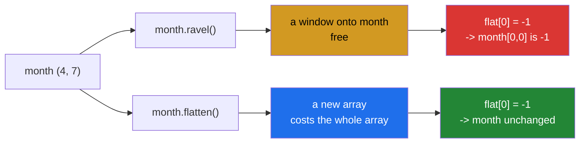

# 2.1 — `.ravel()` changed the original and `.flatten()` did not

## One-line answer

`arr.ravel()` and `arr.flatten()` return the same values in the same order, and one of them is a window
onto the original while the other is a copy — so swapping one for the other silently changes whether
writing to the result damages your data.

---

## The story

Somebody has the month as a grid and wants it as one long list, because the function they are about to
call takes a list.

They flatten it, hand it over, and the function does its work. Everything looks fine.

A week later somebody else notices the grid is wrong. Not corrupted, not obviously broken — one row has
values in it that look like they belong to a different calculation entirely, and nobody can say when it
happened.

What happened is that "flatten it" was written two different ways in two different places, by two people,
on two days, and one of those ways handed out the original paper while the other handed out a photocopy.
Both lines produce a list of twenty-eight numbers. Only one of them is safe to write on.

---

## The idea in plain language

This is the plan's named example for `NP-10`, and it is worth stating as plainly as possible:

> **`arr.ravel()` returns a view when it can. `arr.flatten()` always returns a copy.**

Everything else follows. The two calls produce identical values in identical order, so every test comparing
values passes for both. The difference appears only when somebody writes to the result — and then it
appears as damage to an array they did not name.

The reason is [1.1](../01-the-decision/1.1-six-operations-one-question.md)'s rule. Reading a C-ordered array in flat order is
exactly walking its memory from start to finish, which a stride describes perfectly, so `ravel` can hand
back a window. `flatten` is documented to copy regardless, which makes it the one with no surprises and
the one that costs memory.

"When it can" is doing real work in that sentence. `ravel` on a **transposed** array has to copy, because
flat order over a transpose is not a walk any single stride produces
([Day 22, 2.4](../../../day-22-broadcasting-and-shape/parts/02-reshape/2.4-ravel-and-flatten.md)). So
`ravel` is a view *sometimes*, which is worse than always or never: code that works because the result was
a copy breaks when somebody upstream stops transposing.

Three spellings are the same operation and it is worth knowing all three, because a codebase will contain
all three:

- `arr.ravel()` — view when possible.
- `np.ravel(arr)` — the same function, called differently.
- `arr.reshape(-1)` — also a view when possible
  ([Day 22, 2.2](../../../day-22-broadcasting-and-shape/parts/02-reshape/2.2-minus-one.md)).

And one spelling is the copy: `arr.flatten()`. There is no function form of it; it is a method only.

So the practical rule is short. **If you are going to write to the flattened result, use `flatten` — or
use `ravel` and know exactly what you are doing.** If you are only going to read it, `ravel` is free and
`flatten` costs you the whole array.

---

## Why Setu needs it

- **This is the plan's named example for `NP-10`**, and the reason the ID exists as its own day rather than
  a paragraph on Day 21.
- **[2.2](2.2-in-a-pipeline.md)** puts this exact substitution inside three functions, which is how it
  survives review.
- **[2.3](2.3-the-defences.md)** is the three ways to stop it.
- **[3.2](../03-the-module/3.2-the-stats-module.md)** flattens the month in the gate module, and the choice
  of which call to use is one of the module's stated decisions.
- **Day 125 onwards**, flattening a tensor before a fully-connected layer is done on every forward pass,
  and whether the result aliases the activations decides whether an in-place operation afterwards corrupts
  a gradient.

---

## The mechanism

The two calls, side by side, with a write:

```python
import numpy as np

month = np.array(
    [
        [8213.0, 10442.0, 6180.0, 9000.0, 12007.0, 9631.0, 7204.0],
        [7788.0, 9120.0, 11345.0, 8402.0, 6733.0, 14210.0, 5096.0],
        [9004.0, 8765.0, 7621.0, 10188.0, 9950.0, 8317.0, 11002.0],
        [6540.0, 12488.0, 9873.0, 7106.0, 8899.0, 10540.0, 9218.0],
    ]
)

for name, flatten_it in [("ravel", lambda a: a.ravel()), ("flatten", lambda a: a.flatten())]:
    work = month.copy()
    flat = flatten_it(work)
    same_values = np.array_equal(flat, month.reshape(-1))
    flat[0] = -1.0
    print(
        f"  {name:8s} same values={same_values!s:5s} "
        f"shares={np.shares_memory(flat, work)!s:5s} "
        f"work[0,0] after writing flat[0] = {work[0, 0]}"
    )
```

**Line by line:**

- The loop over `(name, lambda)` pairs — the two calls run under identical conditions on identical data,
  which is the only fair way to show that they differ in exactly one respect.
- `work = month.copy()` **inside** the loop — a fresh array for each, because the first iteration writes to
  its copy and the second must not inherit that
  ([Day 21, 2.3](../../../day-21-indexing-and-views/parts/02-the-view-trap/2.3-copy-and-when-to-pay.md)).
- `np.array_equal(flat, month.reshape(-1))` — **the values are identical**, checked before the write. This
  is the line that explains why the bug survives: every value-based test passes for both calls.
- `flat[0] = -1.0` — one write, to the flattened result. The caller is writing to a thing they think is
  theirs.
- `np.shares_memory(flat, work)` — `True` for `ravel`, `False` for `flatten`
  ([1.2](../01-the-decision/1.2-the-three-probes.md)).
- `work[0, 0]` printed after the write — **`-1.0` for `ravel` and `8213.0` for `flatten`**. The same line
  of user code, two library calls, and one of them reached back into an array that was never mentioned.

```text
  ravel    same values=True  shares=True   work[0,0] after writing flat[0] = -1.0
  flatten  same values=True  shares=False  work[0,0] after writing flat[0] = 8213.0
```

The two paths:



Now the "when it can" that makes `ravel` worse than either extreme:

```python
import numpy as np

month = np.array(
    [
        [8213.0, 10442.0, 6180.0, 9000.0],
        [7788.0, 9120.0, 11345.0, 8402.0],
    ]
)

for label, flatten_it in [
    ("month.ravel()", lambda a: a.ravel()),
    ("month.T.ravel()", lambda a: a.T.ravel()),
    ("month.reshape(-1)", lambda a: a.reshape(-1)),
    ("np.ravel(month)", lambda a: np.ravel(a)),
    ("month.flatten()", lambda a: a.flatten()),
]:
    work = month.copy()
    flat = flatten_it(work)
    flat[0] = -1.0
    print(f"  {label:20s} shares={np.shares_memory(flat, work)!s:5s} work[0,0] = {work[0, 0]}")
```

**Line by line:**

- `month.ravel()` — a view, as before.
- `month.T.ravel()` — **a copy**, for the same input and the same method. Flat order over a transposed
  array is not a stride walk, so `ravel` has no choice
  ([Day 22, 3.3](../../../day-22-broadcasting-and-shape/parts/03-transpose/3.3-contiguity-and-the-speed-you-lose.md)).
  **This is the dangerous property**: the safety of `ravel` depends on what happened to the array before it
  arrived, which is not visible at the call site.
- `month.reshape(-1)` — a view, and it is the same operation under a different name
  ([Day 22, 2.2](../../../day-22-broadcasting-and-shape/parts/02-reshape/2.2-minus-one.md)). A codebase
  that has decided against `ravel` and not against `reshape(-1)` has not decided anything.
- `np.ravel(month)` — a view. The function form and the method form are the same call, so a grep for
  `.ravel()` misses half of them.
- `month.flatten()` — a copy, unconditionally. **The only line in this block whose behaviour does not
  depend on its input.**

```text
  month.ravel()        shares=True  work[0,0] = -1.0
  month.T.ravel()      shares=False work[0,0] = 8213.0
  month.reshape(-1)    shares=True  work[0,0] = -1.0
  np.ravel(month)      shares=True  work[0,0] = -1.0
  month.flatten()      shares=False work[0,0] = 8213.0
```

Four of those five lines are "flatten this array" and three of them alias. **The one that behaves the same
way every time is the one that always copies.**

---

## When it breaks

**The substitution that looks like a cleanup:**

```text
$ uv run python -c "
import numpy as np
def normalise(grid):
    flat = grid.flatten()
    flat -= flat.min()
    flat /= flat.max()
    return flat

month = np.array([[8213.0, 10442.0], [6180.0, 9000.0]])
before = month.copy()
out = normalise(month)
print('flatten: month unchanged :', np.array_equal(before, month))

def normalise_faster(grid):
    flat = grid.ravel()
    flat -= flat.min()
    flat /= flat.max()
    return flat

month2 = before.copy()
out2 = normalise_faster(month2)
print('ravel  : month unchanged :', np.array_equal(before, month2))
print('same result either way   :', np.allclose(out, out2))
"
flatten: month unchanged : True
ravel  : month unchanged : False
same result either way   : True
```

**What it means.** Somebody replaced `flatten` with `ravel` because `ravel` avoids a copy, which is a real
and correct optimisation — **and it turned a pure function into one that destroys its argument**. The
returned values are identical, so every test on the return value passes. The only difference is a line
nobody wrote: the caller's grid is now normalised too. This is the substitution the plan names, and it is
attractive precisely because the reasoning behind it is sound.

**A `ravel` that was safe until somebody removed a transpose:**

```text
$ uv run python -c "
import numpy as np
def flat_scores(grid):
    return grid.T.ravel()

month = np.array([[8213.0, 10442.0], [6180.0, 9000.0]])
scores = flat_scores(month)
scores[0] = -1.0
print('with transpose : month[0,0] =', month[0, 0], ' shares:', np.shares_memory(scores, month))

def flat_scores_v2(grid):
    return grid.ravel()

month2 = np.array([[8213.0, 10442.0], [6180.0, 9000.0]])
scores2 = flat_scores_v2(month2)
scores2[0] = -1.0
print('transpose gone : month[0,0] =', month2[0, 0], ' shares:', np.shares_memory(scores2, month2))
"
with transpose : month[0,0] = 8213.0  shares: False
transpose gone : month[0,0] = -1.0  shares: True
```

**What it means.** The first version was safe, and it was safe **by accident**: the transpose forced
`ravel` to copy. Somebody later realised the transpose was unnecessary and removed it — a clean, correct
simplification — and the function silently became one that hands out a window into its caller's data. **The
`ravel` was never reviewed, because it did not change.** This is the shape of the bug that survives longest:
the line that broke is not the line that was edited.

**A grep that missed most of them:**

```text
$ uv run python -c "
import numpy as np
month = np.array([[8213.0, 10442.0], [6180.0, 9000.0]])
spellings = {
    'arr.ravel()': month.ravel(),
    'np.ravel(arr)': np.ravel(month),
    'arr.reshape(-1)': month.reshape(-1),
    'arr.reshape(month.size)': month.reshape(month.size),
    'arr[:]': month[:],
    'arr.flatten()': month.flatten(),
}
for name, result in spellings.items():
    print(f'  {name:26s} aliases: {np.shares_memory(result, month)}')
"
  arr.ravel()                aliases: True
  np.ravel(arr)              aliases: True
  arr.reshape(-1)            aliases: True
  arr.reshape(month.size)    aliases: True
  arr[:]                     aliases: True
  arr.flatten()              aliases: False
```

**What it means.** Five spellings alias and one does not, and a codebase policy of "do not use `ravel`"
catches one of the five. `reshape(-1)`, `reshape(n)` and even a bare `[:]` all produce views, and none of
them contains the string "ravel". **A rule expressed as a banned function name cannot work**, which is why
[2.3](2.3-the-defences.md)'s defences are about the boundary rather than about the call.

---

## In production

**What a professional writes instead of the teaching version.** The flattening says which it is, and the
default is the safe one:

```python
from __future__ import annotations

import numpy as np


def flat_readonly(grid: np.ndarray) -> np.ndarray:
    """A flat, READ-ONLY view of ``grid``. Free; writing through it raises.

    Use when the flattened values are only read. ravel() may or may not alias depending
    on whether the input is contiguous, so the read-only flag is what makes it safe
    either way, without the caller needing to know which happened.
    """
    view = np.ravel(grid)
    if np.shares_memory(view, grid):
        view = view.view()
        view.flags.writeable = False
    return view


def flat_owned(grid: np.ndarray) -> np.ndarray:
    """A flat COPY of ``grid``, safe to modify. Costs the size of the array."""
    return grid.flatten()
```

**Line by line:**

- **Two functions with the cost in their names** — `flat_readonly` is free and cannot be written to;
  `flat_owned` costs memory and can. A call site says which one it needed.
- `np.ravel(grid)` inside `flat_readonly` — the cheap call, used deliberately because the result is about
  to be made safe.
- `if np.shares_memory(view, grid)` — **freeze only when it actually aliased**. When `ravel` already copied
  (a transposed input), the result is the caller's to write to and freezing it would be a pointless
  restriction. This is the "when it can" from the mechanism section handled rather than assumed.
- `view.view()` before setting the flag — freezing the object `ravel` returned would be fine here, but
  taking a fresh view object is the habit from [1.3](../01-the-decision/1.3-writeable-the-flag.md) and it
  keeps the function from having any effect on anything it did not create.
- The docstring explaining **why** the flag rather than a copy — "without the caller needing to know which
  happened" is the value this function adds over calling `ravel` directly.
- `flat_owned` returning `grid.flatten()` and nothing else — a one-line function that exists purely to give
  the copying behaviour a name matching the other. **The symmetry is the point**: two names, one axis of
  difference, and no way to pick one by accident.

**What changes at scale.** The choice becomes a memory decision rather than a style one. `ravel` on a 4 GB
array is free and `flatten` is 4 GB, so a pipeline that flattens defensively at four stages has peaked at
20 GB for a 4 GB dataset — which is exactly the pressure that makes somebody replace `flatten` with
`ravel`, and exactly why the replacement keeps happening. The frozen-view approach in the production code
above is what resolves that tension: free like `ravel`, safe like `flatten`, and the only cost is one
`shares_memory` call. Two further effects at size. `ravel` on a non-contiguous array copies **silently**,
so a pipeline that was free becomes one that allocates the whole array the day somebody adds a transpose
upstream — and the symptom is a memory increase with no code change nearby
([Day 22, 3.3](../../../day-22-broadcasting-and-shape/parts/03-transpose/3.3-contiguity-and-the-speed-you-lose.md)).
And a flat view of a large array keeps the whole array alive, so returning `arr.ravel()[:10]` from a
function holds gigabytes for ten values
([Day 21, 5.1](../../../day-21-indexing-and-views/parts/05-in-anger/5.1-the-leak-a-view-causes.md)).

**The failure that only appears with real data.** An image pipeline flattened each frame before a
histogram step, using `flatten`. A memory profile showed the copy, somebody changed it to `ravel`, and the
memory came down as intended. The histogram step did not write, so nothing broke. Eight months later a
normalisation was added to the histogram step — `flat -= flat.min()` — and every frame in the shared buffer
was silently modified before being written to disk. The output images were subtly wrong for three weeks,
and the change that broke it was in a different function from the change that made it possible.

**The review comment a senior engineer leaves.** *"`flatten()` → `ravel()` saves the copy, and it also
means this function now returns a view of its argument. Nothing writes to it today. Either freeze the view
before returning it, or leave the `flatten` and add a comment saying why the copy is deliberate — a future
reader will otherwise make this change again."*

**The interview question.** *"What is the difference between `ravel` and `flatten`?"* They return the same
values in the same order. `flatten` always copies; `ravel` returns a **view** when it can, which is
whenever the array is contiguous — so writing to a ravelled result modifies the original, and writing to a
flattened one does not. The reason it matters is that the substitution looks like a pure optimisation: it
genuinely does save a full copy, every value-based test still passes, and the only difference is that a
function which was pure now modifies its caller's data. The details that show experience: `ravel` copies
when the input is non-contiguous, so its safety depends on whether somebody upstream transposed — which
means code can be safe by accident and break when an unrelated simplification removes the transpose; and
`reshape(-1)`, `np.ravel` and even a bare `[:]` all produce views too, so a rule phrased as "do not use
`ravel`" catches about a fifth of the cases. The fix I would reach for is to return a **read-only** view:
free like `ravel`, safe like `flatten`.

---

## Check yourself

```bash
uv run python -c "
import numpy as np
month = np.array([[8213., 10442.], [6180., 9000.]])
for label, fn in [('ravel', lambda a: a.ravel()), ('flatten', lambda a: a.flatten()),
                  ('reshape(-1)', lambda a: a.reshape(-1)), ('T.ravel', lambda a: a.T.ravel())]:
    work = month.copy()
    flat = fn(work)
    values_match = np.array_equal(np.sort(flat), np.sort(month.reshape(-1)))
    flat[0] = -1.0
    print(f'  {label:12s} same values={values_match!s:5s} aliases={np.shares_memory(flat, work)!s:5s} work[0,0]={work[0,0]}')
"
```

All four produce the same values and two of them changed `work`. Say which two, and say what is different
about the fourth line that makes it behave like `flatten`.

**Answer out loud, without scrolling up:**

> Say the one-sentence difference between `ravel` and `flatten`. Then say why swapping one for the other is
> an attractive change to make, and name two other spellings that have the same problem.

---

**Next:** [2.2 — the same bug inside a pipeline](2.2-in-a-pipeline.md).
