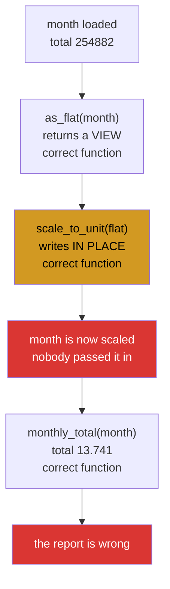

# 2.2 — The same bug inside a pipeline — why nobody sees it

## One-line answer

Split the `ravel` and the write across three small, well-named, individually correct functions and the bug
becomes invisible — because no single function does anything wrong and the damage appears in a fourth
place that touched none of them.

---

## The story

Three people each write one small part of the flat's reporting script, and each part is fine.

The first person writes something that turns the month into a flat list, because the next step wants a
list. The second writes something that scales a list so its values run from nought to one, because the
chart looks better that way. The third writes the bit that prints the monthly total.

Each of them tests their own part. Each part does exactly what its name says.

The report comes out saying the flat walked twelve steps last month, and everybody stares at it. Nobody who looks at any one of the
three functions can see anything wrong, because there is nothing wrong with any of them. The problem is
in the **gaps**: the first function handed out the original rather than a copy, the second wrote to what it
was given, and the third read a month that had been quietly rescaled between being loaded and being
totalled.

Three correct functions, one wrong answer, and the line that caused it is not in the function that
produced it.

---

## The idea in plain language

[2.1](2.1-ravel-changed-it-flatten-did-not.md) showed the bug in six lines, where it is obvious. This
document is about why it survives in real code, and the answer is that **it stops being visible when it
is spread out**.

Three things have to be true for the damage to happen, and in a pipeline each of them lives in a different
function:

1. Something returns a **view** of an array the caller still holds
   ([1.1](../01-the-decision/1.1-six-operations-one-question.md)).
2. Something else **writes** to that view, usually in place for speed.
3. Something else again **reads** the original, later.

No one of those is a mistake. Returning a view is the cheap, correct thing to do. Writing in place is the
standard memory optimisation. Reading an array you loaded is the whole point.

The bug is the **combination**, and combinations are exactly what code review is worst at: a reviewer looks
at a diff, and the diff contains one of the three.

Two properties make it worse than an ordinary bug.

**It is order-dependent.** The damage only appears if the write happens before the read. Change the order
of two independent-looking steps and the symptom moves or disappears, which makes it look intermittent.

**The evidence is destroyed.** By the time anybody looks at the month, it holds the rescaled values, and
there is nothing to say they were ever different. The array does not remember being written to. So the
investigation starts from "these numbers are wrong" with no trail.

There is one more thing that keeps it alive, and it is the reason this document sits in a gate day. **Unit
tests do not find it.** Each function is tested alone, with a fresh array, and passes. The interaction is
only visible in a test that calls two of them in sequence and then checks the input — which is a test
nobody writes unless they already know about this class of bug.

---

## Why Setu needs it

- **[2.3](2.3-the-defences.md)** is the three defences, and they are aimed at the three numbered conditions
  above rather than at any one function.
- **[3.4](../03-the-module/3.4-the-boundary-that-decides.md)** is the gate module deciding where its copy
  goes, which is condition 1 answered deliberately.
- **[5.1](../05-the-gate/5.1-the-eval.md)** includes a test that calls two functions in sequence, which is
  the shape of test this document argues for.
- **Day 76's pipelines** chain many transformers over one dataset, which is this structure with more steps
  and a shared array running through all of them.
- **Day 162's RAG pipeline** passes retrieved chunks through several processing stages, and a stage that
  normalises embeddings in place corrupts the index for every later query.

---

## The mechanism

Three correct functions:

```python
from __future__ import annotations

import numpy as np


def as_flat(grid: np.ndarray) -> np.ndarray:
    """Flatten a grid to one long run of readings."""
    return grid.ravel()


def scale_to_unit(values: np.ndarray) -> np.ndarray:
    """Rescale so the smallest is 0 and the largest is 1."""
    values -= values.min()
    values /= values.max()
    return values


def monthly_total(grid: np.ndarray) -> float:
    """The total of every reading in the month."""
    return float(np.nansum(grid, dtype=np.float64))
```

**Line by line:**

- `as_flat` returning `grid.ravel()` — a view when the grid is contiguous
  ([2.1](2.1-ravel-changed-it-flatten-did-not.md)). **There is nothing wrong with this function.** Its
  name says what it does, it does it, and it does it without allocating.
- `scale_to_unit` using `-=` and `/=` — in place, for speed, avoiding two full-size temporaries
  ([Day 23, 1.2](../../../day-23-ufuncs-and-statistics/parts/01-ufuncs/1.2-out-and-the-temporaries.md)).
  **There is nothing wrong with this function either**, except one thing it does not say: it modifies its
  argument and also returns it, which is the two-shapes-at-once problem from
  [1.5](../01-the-decision/1.5-the-api-contract.md).
- `monthly_total` — pure, reads only, converts at the boundary. Faultless.
- Every one of the three would pass review on its own, and two of them would pass any test written against
  their return values.

Now the pipeline:

```python
import numpy as np

month = np.array(
    [
        [8213.0, 10442.0, 6180.0, 9000.0, 12007.0, 9631.0, 7204.0],
        [7788.0, 9120.0, 11345.0, 8402.0, 6733.0, 14210.0, 5096.0],
        [9004.0, 8765.0, 7621.0, 10188.0, 9950.0, 8317.0, 11002.0],
        [6540.0, 12488.0, 9873.0, 7106.0, 8899.0, 10540.0, 9218.0],
    ]
)

print("total before  :", round(monthly_total(month), 1))

flat = as_flat(month)
scaled = scale_to_unit(flat)

print("scaled range  :", round(float(scaled.min()), 3), "to", round(float(scaled.max()), 3))
print("total after   :", round(monthly_total(month), 3))
print("month row 0   :", month[0].round(3))
print("flat aliases  :", np.shares_memory(flat, month))
```

**Line by line:**

- `monthly_total(month)` **before** anything else — the correct answer, printed so the damage is visible
  rather than asserted.
- `flat = as_flat(month)` — condition 1. `flat` is a window onto `month`, and the variable name gives no
  hint of it.
- `scaled = scale_to_unit(flat)` — condition 2. The function wrote to `flat`, which is `month`. **This is
  the only line where anything goes wrong, and it looks completely ordinary.**
- `scaled.min()` and `.max()` — 0.0 and 1.0. The scaling worked perfectly. If the test for `scale_to_unit`
  checks its output range, it passes.
- `monthly_total(month)` again — condition 3, and the answer is now 12.31 rather than a quarter of a
  million: the total of twenty-eight values that all now sit between 0 and 1. **`month` was never passed to `scale_to_unit`**, and it was rescaled anyway.
- `month[0]` printed — the values, so it is clear this is not a display problem. The month genuinely holds
  scaled numbers now.
- `np.shares_memory(flat, month)` — `True`, the diagnosis, and the only line in the block that names the
  cause ([1.2](../01-the-decision/1.2-the-three-probes.md)).

```text
total before  : 254882.0
scaled range  : 0.0 to 1.0
total after   : 12.31
month row 0   : [0.342 0.587 0.119 0.428 0.758 0.498 0.231]
flat aliases  : True
```

Where the damage travels:



The amber box is the only one anybody would look at twice, and it is not wrong. The red box is where the
damage is, and no function created it.

Now the tests that pass anyway:

```python
import numpy as np


def test_as_flat_gives_the_right_values() -> None:
    grid = np.array([[1.0, 2.0], [3.0, 4.0]])
    assert np.array_equal(as_flat(grid), np.array([1.0, 2.0, 3.0, 4.0]))


def test_scale_to_unit_spans_zero_to_one() -> None:
    values = np.array([5.0, 10.0, 15.0])
    out = scale_to_unit(values)
    assert out.min() == 0.0
    assert out.max() == 1.0


def test_monthly_total_adds_everything() -> None:
    grid = np.array([[1.0, 2.0], [3.0, 4.0]])
    assert monthly_total(grid) == 10.0


for test in [
    test_as_flat_gives_the_right_values,
    test_scale_to_unit_spans_zero_to_one,
    test_monthly_total_adds_everything,
]:
    test()
    print(f"  PASS  {test.__name__}")
```

**Line by line:**

- Three tests, one per function, each written the way anybody would write it: build an input, call the
  function, check the return value.
- `test_as_flat_gives_the_right_values` checks the **values**, which are identical whether `as_flat` used
  `ravel` or `flatten` ([2.1](2.1-ravel-changed-it-flatten-did-not.md)). It cannot distinguish them.
- `test_scale_to_unit_spans_zero_to_one` checks the **output range**, which is correct. It never looks at
  `values` afterwards, so the in-place modification is invisible to it.
- `test_monthly_total_adds_everything` is a pure function tested purely. Nothing to see.
- Each test builds its **own fresh array**, so there is no shared state for the interaction to show up in.
  That is normal, correct test hygiene, and here it is exactly what hides the bug.
- All three pass, and the pipeline above is broken. **The coverage is complete and the interaction is
  untested**, which is the sentence this whole document exists to make concrete.

```text
  PASS  test_as_flat_gives_the_right_values
  PASS  test_scale_to_unit_spans_zero_to_one
  PASS  test_monthly_total_adds_everything
```

---

## When it breaks

**The test that would have found it:**

```text
$ uv run python -c "
import numpy as np
def as_flat(grid): return grid.ravel()
def scale_to_unit(values):
    values -= values.min(); values /= values.max(); return values

grid = np.array([[1.0, 2.0], [3.0, 4.0]])
before = grid.copy()
scale_to_unit(as_flat(grid))
print('grid unchanged :', np.array_equal(before, grid))
print('grid is now    :', grid)
"
grid unchanged : False
grid is now    : [[0.         0.33333333]
 [0.66666667 1.        ]]
```

**What it means.** One test, five lines, and it calls **two** functions in sequence and then checks the
input. That is the whole difference between finding this and not: a test that composes rather than
isolating. The habit worth taking is `before = arr.copy()` at the top of any test that passes an array into
more than one function, and `np.array_equal(before, arr)` at the bottom
([5.1](../05-the-gate/5.1-the-eval.md)).

**Reordering the pipeline hides it again:**

```text
$ uv run python -c "
import numpy as np
def as_flat(grid): return grid.ravel()
def scale_to_unit(values):
    values -= values.min(); values /= values.max(); return values
def monthly_total(grid): return float(np.nansum(grid))

month = np.array([[8213.0, 10442.0], [6180.0, 9000.0]])
scaled = scale_to_unit(as_flat(month))
print('total AFTER scaling  :', round(monthly_total(month), 3))

month2 = np.array([[8213.0, 10442.0], [6180.0, 9000.0]])
total_first = monthly_total(month2)
scaled2 = scale_to_unit(as_flat(month2))
print('total BEFORE scaling :', round(total_first, 1))
"
total AFTER scaling  : 2.139
total BEFORE scaling : 33835.0
```

**What it means.** The same three functions, the same data, and the answer depends on **which order two
apparently independent steps ran in**. Compute the total first and it is right; compute it second and it is
wrong. In a real pipeline that ordering can depend on a configuration flag, a cache hit, or which of two
report sections was rendered first — so the symptom is intermittent, and intermittent bugs get attributed
to concurrency, caching, or bad luck long before anybody suspects a `ravel`.

**The one-character fix, and where it has to go:**

```text
$ uv run python -c "
import numpy as np
def as_flat_safe(grid): return grid.flatten()
def scale_to_unit(values):
    values -= values.min(); values /= values.max(); return values
def monthly_total(grid): return float(np.nansum(grid))

month = np.array([[8213.0, 10442.0], [6180.0, 9000.0]])
before = month.copy()
scaled = scale_to_unit(as_flat_safe(month))
print('scaled range   :', scaled.min(), 'to', scaled.max())
print('month unchanged:', np.array_equal(before, month))
print('total          :', round(monthly_total(month), 1))
"
scaled range   : 0.0 to 1.0
month unchanged: True
total          : 33835.0
```

**What it means.** Changing `ravel` to `flatten` in `as_flat` fixes it, and it is worth noticing **which of
the three functions had to change**. Not the one that wrote to its argument, and not the one that read the
wrong total — the one that handed out the view. That is the general shape: the fix goes at condition 1,
where the aliasing is created, because that is the only place with the information to decide. The function
that writes cannot know whether what it was given is shared, and the function that reads cannot know
anything at all.

---

## In production

**What a professional writes instead of the teaching version.** The boundary is explicit and the two
dangerous shapes are separated:

```python
from __future__ import annotations

import numpy as np


def flat_readonly(grid: np.ndarray) -> np.ndarray:
    """WINDOW. A flat, read-only view. Free, and writing through it raises.

    The default for reading. Anything that needs to modify the flat values calls
    flat_owned instead, which is visible at the call site.
    """
    view = np.ravel(grid)
    if np.shares_memory(view, grid):
        view = view.view()
        view.flags.writeable = False
    return view


def flat_owned(grid: np.ndarray) -> np.ndarray:
    """TRANSFORM. A flat copy, safe to modify. Costs the size of the array."""
    return grid.flatten()


def scaled_to_unit(values: np.ndarray) -> np.ndarray:
    """TRANSFORM. Returns a NEW array scaled to [0, 1]; the input is untouched."""
    spread = values.max() - values.min()
    if spread == 0.0:
        raise ValueError("every value is identical; there is no range to scale to")
    return (values - values.min()) / spread
```

**Line by line:**

- `flat_readonly` as the **default-shaped** function — the cheap call, made safe with the read-only flag
  ([1.3](../01-the-decision/1.3-writeable-the-flag.md)), so condition 1 cannot be met by accident.
- `if np.shares_memory(view, grid)` before freezing — when `ravel` already copied, the result belongs to
  the caller and freezing it would be a pointless restriction
  ([2.1](2.1-ravel-changed-it-flatten-did-not.md)).
- `flat_owned` existing and being named — the escape hatch. A guard people cannot get past by any legitimate
  route is a guard they will disable, and this is the legitimate route.
- `scaled_to_unit` renamed from `scale_to_unit` — a participle, and **it now returns a new array**, so
  condition 2 is gone as well ([1.5](../01-the-decision/1.5-the-api-contract.md)). Two of the three
  conditions removed, in a function each.
- `(values - values.min()) / spread` — allocating, deliberately. It costs two temporaries and it makes the
  function pure, which on any array small enough to fit in a report is the right trade.
- `spread == 0.0` raising — a real edge case that the in-place version divided by zero on, producing `inf`
  and `nan` silently ([Day 23, 1.3](../../../day-23-ufuncs-and-statistics/parts/01-ufuncs/1.3-divide-by-zero-warns.md)).
  A month where every day is identical is unlikely and a column where every value is identical is not.
- **Note what is not here**: nothing named `scale_to_unit_inplace`. If a caller needs the in-place version
  for memory reasons, it should exist and be named — and adding it is a decision somebody makes with the
  cost visible, rather than the default everybody inherits.

**What changes at scale.** The pipeline gets longer and the distance between the three conditions grows,
which is the only thing that really changes — and it is enough. In a ten-stage pipeline the view is created
in stage two and written in stage seven, and no reviewer sees both in one sitting. Two things follow.
**Copies stop being affordable**, which is the pressure that produces this bug in the first place: on a
4 GB array a defensive copy per stage is 40 GB, so somebody replaces them with views and the conditions
align. The frozen view is what resolves that, because it is as cheap as the view and as safe as the copy.
And **the ordering becomes genuinely nondeterministic**: in a parallel or lazily-evaluated pipeline, which
stage runs first is not something the source says, so the symptom moves between runs — at which point the
investigation goes to the scheduler rather than to a `ravel` three files away. That is why the defence has
to be structural rather than a rule about ordering.

**The failure that only appears with real data.** A feature pipeline built a flat view of a shared feature
matrix for a "quick statistics" step, which only read. Two years later a normalisation was added to that
step, in place, because the step already had the flat array to hand and copying four gigabytes seemed
wasteful. Every model trained afterwards used normalised features while the feature store's own summary
statistics, computed later in the run, described the raw ones. The mismatch showed up as models performing
better in evaluation than in production, which was investigated as a leakage problem for two months.

**The review comment a senior engineer leaves.** *"This diff adds `values -= values.min()` to a function
that takes an array it did not create. That is fine in isolation — but `get_flat()` three files away
returns `arr.ravel()`, so this now rescales the caller's matrix. Please either return a new array here or
freeze the view there; and add a test that calls both and asserts the input is unchanged."*

**The interview question.** *"You have three small functions, each correct and each tested, and the
pipeline gives the wrong answer. How do you approach it?"* The classic cause in NumPy is aliasing spread
across functions: one returns a view of its argument, another writes to what it is given, and a third reads
the original later. Each is individually correct — returning a view is the cheap right thing, writing in
place is the standard memory optimisation — and the bug is the combination, which is exactly what unit
tests miss, because each test builds a fresh array and checks a return value. The tell is that the symptom
depends on the **order** two apparently independent steps ran in, which makes it look intermittent and
sends people to caching or concurrency. The test that finds it is one that calls two functions in sequence
and then asserts the input is unchanged — `before = arr.copy()` at the top, `np.array_equal` at the bottom.
And the fix goes at the function that **creates** the aliasing, not the one that writes, because that is the
only one with enough information to decide: either return a copy, or return a read-only view, which is free.

---

## Check yourself

```bash
uv run python -c "
import numpy as np
def as_flat(g): return g.ravel()
def scale(v):
    v -= v.min(); v /= v.max(); return v
def total(g): return float(np.nansum(g))

month = np.array([[8213., 10442., 6180.], [9000., 12007., 9631.]])
before = month.copy()
print('total before :', round(total(month), 1))
scaled = scale(as_flat(month))
print('scaled range :', scaled.min(), 'to', scaled.max())
print('total after  :', round(total(month), 3))
print('unchanged?   :', np.array_equal(before, month))
print('aliased?     :', np.shares_memory(as_flat(before.copy()), before))
"
```

The scaling worked perfectly and the total is wrong. Say which of the three functions you would change,
and why it is not the one that did the writing.

**Answer out loud, without scrolling up:**

> Name the three conditions that have to line up for this bug, and say which function each lives in. Then
> say why complete unit-test coverage does not find it.

---

**Next:** [2.3 — the three defences](2.3-the-defences.md).
