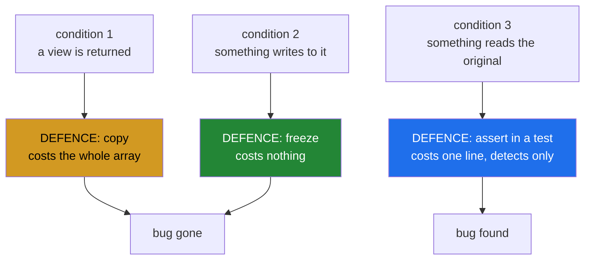

# 2.3 — The three defences — and which one to reach for first

## One-line answer

Three things stop the aliasing bug — copy on the way out, freeze on the way out, or assert in a test — and
they cost the whole array, nothing, and one line respectively, which is the entire basis for choosing
between them.

---

## The story

The flat has lost a month of readings once and does not intend to do it again, so they talk about what to
do differently.

Somebody suggests photocopying the chart before handing it to anybody. That definitely works and it means a
drawer full of photocopies, and when the chart is a year long the photocopier becomes the problem.

Somebody else suggests laminating what gets handed over, so a pen simply will not mark it. That costs
nothing, works every time, and anybody who genuinely needs to write on a copy can still ask for one.

The third person points out that neither helps if nobody notices the damage, and suggests that whoever
checks the report each month should also check the chart still says what it said last month. That catches
it after the fact rather than preventing it, and it is the only one of the three that would have caught
what actually happened.

None of the three is the answer. All three get used, for different things.

---

## The idea in plain language

Section 2 established that three conditions have to line up
([2.2](2.2-in-a-pipeline.md)): something returns a view, something writes to it, and something reads the
original later. Break any one and the bug is gone.

There are three practical ways, and they attack different conditions.

**Copy on the way out.** Return `arr.flatten()`, `arr.copy()`, `np.array(x, copy=True)` — anything that
allocates. This removes condition 1: there is no view, so nothing downstream can reach back. It is the
most obvious defence and the most expensive one, costing the size of the array every time.

**Freeze on the way out.** Return a read-only view
([1.3](../01-the-decision/1.3-writeable-the-flag.md)). This removes condition 2 rather than condition 1:
the view still exists and is still shared, and writing to it raises. It costs **nothing** — no allocation,
no copy — and it turns the bug into an exception in the function that caused it.

**Assert in a test.** `before = arr.copy()` at the top and `np.array_equal(before, arr)` at the bottom.
This removes nothing; it detects. But it is the only one that works on code you are not changing, and it
is the only one that catches a case the other two missed.

Ranking them for a new function is easy, and it is worth saying plainly because people default to the
wrong one:

> **Freeze first. Copy when the caller genuinely needs to modify. Assert always.**

Freezing is first because it is free and safe, which no other option in this document is. The instinct to
copy comes from copying being the obvious way to be safe, and it is the expensive way — and on a large
array the expense is exactly what makes somebody replace it with a view later, which is how the bug gets
in ([2.1](2.1-ravel-changed-it-flatten-did-not.md)).

Two further notes keep the advice honest.

**Freezing is not always available.** If the caller has to modify the result, a frozen view is useless and
a copy is the answer. The right shape is then two functions, one of each
([1.5](../01-the-decision/1.5-the-api-contract.md)), so the cost is visible at the call site.

**Asserting is not optional.** The other two are decisions somebody makes once; the assertion is what
notices when somebody later makes a different one. A test that composes two functions and checks the input
is unchanged is five lines and it is the only thing standing between a future refactor and a repeat.

---

## Why Setu needs it

- **[3.4](../03-the-module/3.4-the-boundary-that-decides.md)** applies exactly this ranking to the gate
  module, and states which defence each function uses.
- **[5.1](../05-the-gate/5.1-the-eval.md)** is the assertion half, written out as a test file.
- **Day 76's transformers** face this every time: `transform` must not modify its input, and the frozen
  view is how a pipeline avoids copying the training data at every stage.
- **Day 155's vector store** hands out slices of its index, and the choice between a frozen window and a
  per-query copy is the difference between one copy of the index and one per caller.

---

## The mechanism

The three defences on the same broken pipeline:

```python
import numpy as np


def scale_to_unit(values: np.ndarray) -> np.ndarray:
    """The dangerous consumer, unchanged: it writes to whatever it is given."""
    values -= values.min()
    values /= values.max()
    return values


def flat_copying(grid: np.ndarray) -> np.ndarray:
    """DEFENCE 1: copy. No view exists, so nothing can reach back."""
    return grid.flatten()


def flat_frozen(grid: np.ndarray) -> np.ndarray:
    """DEFENCE 2: freeze. The view exists and cannot be written to."""
    view = np.ravel(grid).view()
    view.flags.writeable = False
    return view


month = np.array([[8213.0, 10442.0], [6180.0, 9000.0]])

work = month.copy()
scale_to_unit(flat_copying(work))
print("copy   : month unchanged :", np.array_equal(work, month), " cost: a full copy")

work = month.copy()
try:
    scale_to_unit(flat_frozen(work))
except ValueError as error:
    print("freeze : refused        :", error)
print("freeze : month unchanged :", np.array_equal(work, month), " cost: nothing")
```

**Line by line:**

- `scale_to_unit` **unchanged** from [2.2](2.2-in-a-pipeline.md) — the defences are about the producing
  side, and leaving the consumer as it was is what shows that.
- `flat_copying` returning `grid.flatten()` — condition 1 removed. The result is independent
  ([2.1](2.1-ravel-changed-it-flatten-did-not.md)) and `scale_to_unit` writes to it harmlessly.
- `flat_frozen` returning a read-only view — condition 2 removed. `np.ravel` for the cheap flatten, `.view()`
  to get an object of its own, then the flag
  ([1.3](../01-the-decision/1.3-writeable-the-flag.md)).
- The `try` around the frozen call — **the frozen version raises**, which is the whole difference between
  the two defences. The copy lets the pipeline run and quietly wastes memory; the freeze stops it and names
  the function that tried to write.
- `np.array_equal(work, month)` after each — `True` both times. **Both defences work**; only the cost and
  the failure mode differ.
- The costs printed as words — "a full copy" against "nothing" — because that is the actual decision, and
  it is easy to lose sight of when both lines say `True`.

```text
copy   : month unchanged : True  cost: a full copy
freeze : refused        : output array is read-only
freeze : month unchanged : True  cost: nothing
```

The three defences against the three conditions:



Now the third defence, which the other two do not replace:

```python
import numpy as np


def check_unchanged(call, array: np.ndarray, *, what: str) -> None:
    """Run ``call`` and raise if it modified ``array``."""
    before = array.copy()
    call()
    if not np.array_equal(before, array, equal_nan=True):
        changed = int(np.count_nonzero(before != array))
        raise AssertionError(f"{what} modified its input: {changed} of {array.size} values changed")


def as_flat(grid: np.ndarray) -> np.ndarray:
    return grid.ravel()


def scale_to_unit(values: np.ndarray) -> np.ndarray:
    values -= values.min()
    values /= values.max()
    return values


month = np.array([[8213.0, 10442.0], [6180.0, 9000.0]])

try:
    check_unchanged(
        lambda: scale_to_unit(as_flat(month)), month, what="the flatten-then-scale pipeline"
    )
except AssertionError as error:
    print("caught:", error)
```

**Line by line:**

- `check_unchanged` taking a **callable** rather than a function and arguments — so it can wrap a whole
  composition, which is the point. The bug lives between functions
  ([2.2](2.2-in-a-pipeline.md)), so the thing being checked has to be more than one call.
- `before = array.copy()` — the reference. **This is the only line of the defence that matters**, and it is
  why the technique costs a copy in the test and nothing in production.
- `equal_nan=True` — required whenever the data can contain missing values, because `nan != nan` makes a
  perfect copy compare unequal
  ([Day 23, 2.5](../../../day-23-ufuncs-and-statistics/parts/02-statistics/2.5-the-nan-family.md)).
  Without it this helper fails on correct code, which is the fastest way to get it deleted.
- `np.count_nonzero(before != array)` in the message — **how many values changed**, which distinguishes "one
  element was written" from "the whole array was rescaled" without anybody having to look.
- `what` naming the pipeline rather than a function — the caller knows which composition it is testing, and
  a message saying "the flatten-then-scale pipeline" points at two functions, which is where the bug is.
- The `try` at the bottom catching and printing — in a real test file this would be the assertion itself
  and the failure would be pytest's job.

```text
caught: the flatten-then-scale pipeline modified its input: 4 of 4 values changed
```

Four of four values changed, from a pipeline that was never passed the month by name.

---

## When it breaks

**Copying at every stage:**

```text
$ uv run python -c "
import numpy as np
import tracemalloc

def stage(values):
    return values.copy()

data = np.ones(10_000_000)
tracemalloc.start()
a = stage(data); b = stage(a); c = stage(b); d = stage(c)
_, peak = tracemalloc.get_traced_memory()
tracemalloc.stop()
print('array size :', f'{data.nbytes:,}', 'bytes')
print('peak alloc :', f'{peak:,}', 'bytes')
print('multiple   :', round(peak / data.nbytes, 1), 'x')
"
array size : 80,000,000 bytes
peak alloc : 320,000,432 bytes
multiple   : 4.0
```

**What it means.** Four defensive copies of an eighty-megabyte array peaked at four times the data. Scale
that to a four-gigabyte array in a ten-stage pipeline and the defence is what kills the job. **This is the
pressure that produces the bug in the first place**: somebody profiles, sees the copies, replaces them with
views, and the three conditions line up
([2.2](2.2-in-a-pipeline.md)). Freezing gives the same safety at zero, which is why it is first in the
ranking rather than second.

**Freezing something the caller needed to modify:**

```text
$ uv run python -c "
import numpy as np
def flat_frozen(grid):
    v = np.ravel(grid).view(); v.flags.writeable = False; return v

month = np.array([[8213.0, 10442.0], [6180.0, 9000.0]])
flat = flat_frozen(month)
print('reading is fine :', flat.mean())
try:
    flat.sort()
except ValueError as e:
    print('sorting refused :', e)
print('the way out     :', np.sort(flat))
"
reading is fine : 8458.75
sorting refused : sort array is read-only
the way out     : [ 6180.  8213.  9000. 10442.]
```

**What it means.** The frozen view refused an in-place sort, which is correct and is also an obstacle if
sorting in place was the point. The escape is `np.sort`, which copies
([Day 23, 3.1](../../../day-23-ufuncs-and-statistics/parts/03-sorting-and-searching/3.1-sort-and-the-copy.md)),
and the caller now pays for a copy they might not have needed. **This is the honest cost of the freeze
defence**: it makes the copy the caller's decision rather than the library's, which is better, and it is
not free for them. When a function's callers routinely need to modify, provide the copying version
alongside and name it ([1.5](../01-the-decision/1.5-the-api-contract.md)).

**An assertion that fails on correct code:**

```text
$ uv run python -c "
import numpy as np
month = np.array([8213.0, np.nan, 6180.0])
before = month.copy()
print('nothing was done to month')
print('array_equal          :', np.array_equal(before, month))
print('array_equal equal_nan:', np.array_equal(before, month, equal_nan=True))
"
nothing was done to month
array_equal          : False
array_equal equal_nan: True
```

**What it means.** No function was called and the naive check says the array changed, because `nan` is not
equal to itself
([Day 23, 2.5](../../../day-23-ufuncs-and-statistics/parts/02-statistics/2.5-the-nan-family.md)). An
assertion written without `equal_nan=True` fails permanently on any data containing a missing value, and
the usual response to a test that always fails is to delete it — which removes the third defence entirely
and leaves nobody watching. **One keyword is the difference between a working guard and a deleted one.**

---

## In production

**What a professional writes instead of the teaching version.** The three defences are a stated policy with
a default:

```python
from __future__ import annotations

from collections.abc import Callable

import numpy as np


def handout(values: np.ndarray, *, writeable: bool = False) -> np.ndarray:
    """Hand ``values`` to code outside this module.

    Default is a read-only VIEW: free, and any write raises in the caller that did it.
    writeable=True returns a COPY instead, costing the size of the array - use it when
    the caller genuinely needs to modify, and expect to justify it.
    """
    if writeable:
        return values.copy()
    view = values.view()
    view.flags.writeable = False
    return view


def assert_unchanged(call: Callable[[], object], array: np.ndarray, *, what: str) -> None:
    """Run ``call`` and raise if it modified ``array``. For tests that COMPOSE functions."""
    before = array.copy()
    call()
    if not np.array_equal(before, array, equal_nan=True):
        changed = int(np.count_nonzero(before != array))
        raise AssertionError(f"{what} modified its input: {changed} of {array.size} values changed")
```

**Line by line:**

- `writeable: bool = False` — **the default is the free, safe one**, which is the whole ranking encoded in
  a signature. Somebody who needs the copy asks for it, and the ask is visible in the diff.
- Keyword-only, so `handout(x, True)` cannot be written
  ([Day 10, 1.5](../../../day-10-functions/parts/01-the-signature/1.5-keyword-only-and-positional-only.md)).
- "expect to justify it" in the docstring — a small piece of social engineering that works: it tells a
  reviewer that `writeable=True` is a thing to ask about.
- One function rather than two, here, **unlike** [1.5](../01-the-decision/1.5-the-api-contract.md)'s
  advice — a deliberate difference, because the two behaviours share a name that means "give this to
  somebody else" and the flag is the only axis. Where the two shapes have genuinely different names in the
  domain, two functions are better; where they do not, a defaulted flag with the safe default is honest.
- `assert_unchanged` taking a `Callable[[], object]` — a zero-argument callable, so a test wraps whatever
  composition it wants in a `lambda`. The type annotation says that explicitly rather than leaving a bare
  `callable`.
- `equal_nan=True` — the fix for the third failure block, in the one place it needs to be.
- The message counting changed values — enough to distinguish a stray write from a wholesale rescale, which
  is the first thing anybody wants to know.
- **Note what is not defended**: nothing here stops a caller unfreezing the view
  ([1.3](../01-the-decision/1.3-writeable-the-flag.md)). That is accepted, because this is a guard against
  accidents and the alternative would be a copy.

**What changes at scale.** The ranking inverts nothing and the stakes grow. A frozen view stays free at any
size, so the defence that is merely convenient on a four-by-seven month is the only affordable one on a
four-gigabyte matrix — and the copy defence, which is fine on small data, becomes the reason a pipeline
runs out of memory and gets "optimised" back into the bug. Two further effects. The **assertion** defence
gets more expensive and more valuable at once: `before = arr.copy()` in a test costs the array, so at size
it moves to a sampled check on a slice or a checksum rather than a full comparison — and it matters more,
because the interaction distance has grown to the point where no reviewer sees both ends. And under
**concurrency** the freeze defence changes category: several threads reading one frozen array is safe by
construction, and the exception a writer gets is deterministic and points at the offending thread, where
the copy defence would have hidden the race behind per-thread data and the assertion defence would have
been unable to attribute it at all.

**The failure that only appears with real data.** A team hit the memory ceiling in a feature pipeline,
profiled it, found nine defensive `.copy()` calls, and removed six of them. The six were removed correctly
and the pipeline was faster and fitter — and one of the six had been the only thing preventing a downstream
in-place normalisation from reaching the shared feature matrix. The memory problem was real, the fix was
reasonable, and the right change was to replace those copies with frozen views rather than to delete them.

**The review comment a senior engineer leaves.** *"Removing this `.copy()` is right — it is 3 GB per call
— but the caller does write to the result, so this now aliases the store. Return a frozen view instead:
same memory saving, and the write becomes a `ValueError` in the caller rather than silent corruption here.
And please add an `assert_unchanged` around the two-function composition in the test."*

**The interview question.** *"How do you stop a function accidentally modifying its caller's array?"* Three
defences, and they attack different parts of the problem. Copy on the way out, which removes the aliasing
entirely and costs the size of the array. Freeze on the way out — return a read-only view — which leaves
the aliasing and makes any write raise, and costs **nothing**. And assert in a test: copy the input, run
the composition, check the input is unchanged. The ranking is freeze first, copy when the caller genuinely
needs to modify, assert always — and the reason freeze is first is that the copy defence is what people
reach for and what gets removed the first time somebody profiles memory, which is precisely how the bug
gets introduced. The details worth adding: the assertion needs `equal_nan=True` or it fails permanently on
any data with a missing value and gets deleted; the test has to **compose** two functions, because the bug
lives between them and each one passes alone; and freezing is a guard rail rather than a lock, since a
determined caller can unfreeze the view — which is the right trade for stopping accidents at zero cost.

---

## Check yourself

```bash
uv run python -c "
import numpy as np
def scale(v):
    v -= v.min(); v /= v.max(); return v
def flat_copy(g): return g.flatten()
def flat_frozen(g):
    v = np.ravel(g).view(); v.flags.writeable = False; return v

month = np.array([[8213., 10442.], [6180., 9000.]])
w = month.copy(); scale(flat_copy(w))
print('copy   : unchanged', np.array_equal(w, month))
w = month.copy()
try:
    scale(flat_frozen(w))
except ValueError as e:
    print('freeze : refused  ', e)
print('freeze : unchanged', np.array_equal(w, month))
gappy = np.array([1.0, np.nan, 3.0]); before = gappy.copy()
print('naive check       :', np.array_equal(before, gappy))
print('with equal_nan    :', np.array_equal(before, gappy, equal_nan=True))
"
```

Two defences both leave the month unchanged and only one of them raised. Say which failure mode you would
rather have in production, and why the other one is the more expensive of the two.

**Answer out loud, without scrolling up:**

> Name the three defences, what each costs, and which condition of the bug each one removes. Then say why
> the cheapest one is not the one people reach for first.

---

**Next:** [3.1 — the gate as a list](../03-the-module/3.1-the-gate-as-a-list.md).
