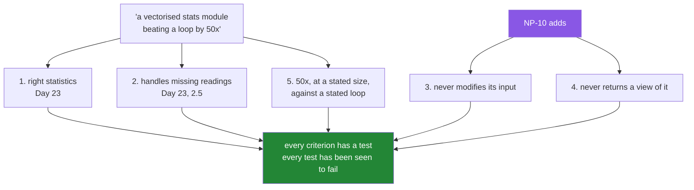

# 3.1 — The gate as a list — five criteria, each one falsifiable

## One-line answer

Phase 3's gate is "a vectorised stats module beating a loop by ≥50×", and turning that sentence into five
criteria that can each be **shown to fail** is the difference between a gate you passed and a gate you
told yourself you passed.

---

## The story

Somebody says they have finished the flat's reporting script.

The obvious next question is "how do you know", and the obvious answer is "it works". Which is true, and
is not something anybody else can check, and will still be true tomorrow when it has stopped working.

So they try to say it more precisely. It reads the month. It gives the right numbers. It is fast.

Better, and still not checkable. "The right numbers" — right against what? "Fast" — compared to what, and
by how much?

The version that can actually be checked is the third attempt. It reads a month with a missing day and
reports twenty-seven readings out of twenty-eight. Its mean matches the total of the recorded days divided
by twenty-seven. It never modifies the month that was passed in. It runs at least fifty times faster than
the obvious loop, measured at a stated size. And every one of those has a test that goes red if it stops
being true.

Now somebody else can check it, and so can the person who wrote it, in six months, when they have
forgotten everything.

---

## The idea in plain language

The plan states Phase 3's gate in one line: **a vectorised stats module beating a loop by ≥50×**.

That is a goal, not a specification, and the gap between the two is where gates get quietly failed. A goal
can be believed; a specification can be **falsified** — you can point at a thing that would make it false
and check whether that thing happens.

So the first work of a gate day is turning the sentence into criteria. Five of them, and each has to have
that property:

1. **It computes the right statistics.** Mean, standard deviation, minimum, maximum, and the count they
   were computed from — each checkable against a value computed a different way.
2. **It handles missing readings.** A month with a hole reports 27 of 28, and the mean divides by 27
   ([Day 23, 2.5](../../../day-23-ufuncs-and-statistics/parts/02-statistics/2.5-the-nan-family.md)).
3. **It never modifies its input.** `before = month.copy()` before, `np.array_equal` after
   ([2.3](../02-the-bug/2.3-the-defences.md)).
4. **It never returns a view of its input.** `np.shares_memory` on everything it hands back
   ([1.2](../01-the-decision/1.2-the-three-probes.md)).
5. **It beats a loop by at least fifty times**, at a stated size, against a stated loop, measured honestly
   ([4.1](../04-the-benchmark/4.1-what-fifty-times-is-against.md)).

Criteria 3 and 4 are the ones this day added. Without `NP-10` the gate would be the first two and the
fifth, and a module can satisfy all three of those while quietly corrupting the array it was given.

Two things about criterion 5 are worth flagging now, because they are the ones people fudge.

**"A loop" is not one thing.** The obvious loop somebody writes first and a carefully hand-optimised loop
differ by a factor of two, so the ratio depends on which you measure against — and the honest answer is to
measure both and say which the claim is about. That is [4.1](../04-the-benchmark/4.1-what-fifty-times-is-against.md).

**The ratio depends on the size**, and not in the direction people expect: it is larger on smaller arrays,
because at large sizes both versions become memory-bound. So "fifty times" without a size attached is not a
claim at all.

The last thing a gate needs is the property that makes it a gate rather than a checklist: **every criterion
has a test, and every test has been seen to fail.** A criterion whose test cannot go red is a criterion
nobody is checking ([Day 24, 5.2](../../../day-24-bits-strings-and-linear-algebra/parts/05-the-module/5.2-the-test-that-can-go-red.md)).

---

## Why Setu needs it

- **[3.2](3.2-the-stats-module.md)** is the module that has to satisfy these, and each of its decisions
  maps to one of the five.
- **[4.1](../04-the-benchmark/4.1-what-fifty-times-is-against.md) through
  [4.4](../04-the-benchmark/4.4-the-benchmark-that-lied.md)** are criterion 5 taken seriously.
- **[5.1](../05-the-gate/5.1-the-eval.md)** is the test file, with one test per criterion.
- **Every later phase gate** works this way, and this is the first one where the translation from sentence
  to criteria is done explicitly rather than assumed.
- **Day 162's RAG eval gate in CI** is the same shape with a fuzzier subject, and the habit of demanding a
  falsifiable criterion is what stops that gate becoming decorative.

---

## The mechanism

The gate, written down so it can be checked:

```python
from __future__ import annotations

from dataclasses import dataclass


@dataclass(frozen=True, slots=True)
class Criterion:
    """One gate requirement, stated so that it can be shown to fail."""

    number: int
    claim: str
    falsified_by: str
    checked_by: str


GATE = [
    Criterion(
        number=1,
        claim="reports mean, std, min, max and the count they came from",
        falsified_by="any statistic disagreeing with the same value computed another way",
        checked_by="test_matches_a_hand_computation",
    ),
    Criterion(
        number=2,
        claim="ignores unrecorded readings and says how many it used",
        falsified_by="a month with one hole reporting 28 observed, or a nan in any result",
        checked_by="test_counts_only_recorded_readings",
    ),
    Criterion(
        number=3,
        claim="never modifies the array it was given",
        falsified_by="the input differing after any public call",
        checked_by="test_input_is_never_modified",
    ),
    Criterion(
        number=4,
        claim="never returns anything that aliases the input",
        falsified_by="np.shares_memory(result, month) being True for any returned array",
        checked_by="test_nothing_returned_aliases_the_input",
    ),
    Criterion(
        number=5,
        claim="at least 50x a one-pass Python loop over 7_000 float64 readings",
        falsified_by="the measured ratio falling below 50 at that size",
        checked_by="test_beats_the_loop_by_fifty",
    ),
]

for criterion in GATE:
    print(f"{criterion.number}. {criterion.claim}")
    print(f"   fails if : {criterion.falsified_by}")
    print(f"   tested by: {criterion.checked_by}")
```

**Line by line:**

- `Criterion` as a **frozen dataclass** rather than a comment block — the gate is data, so it can be
  printed, iterated and checked against the test file
  ([Day 19, 2.3](../../../day-19-typing-dataclasses-and-concurrency/parts/02-dataclasses/2.3-frozen-slots-kw-only.md)).
- `falsified_by` as a required field — **this is the whole idea**. A criterion without a stated way of
  failing is a wish, and making the field mandatory means writing one is not optional.
- `checked_by` naming a test function — the link from the criterion to the thing that enforces it, so a
  criterion with no test is visible as an empty string rather than as an absence.
- Criterion 5 stating **both** the size and the kind of loop — "50x a one-pass Python loop over 7 000
  `float64` readings". A ratio without those two is not checkable, and both halves were chosen from a
  measured curve rather than picked
  ([4.1](../04-the-benchmark/4.1-what-fifty-times-is-against.md)).
- Criteria 3 and 4 phrased about **any** public call and **any** returned array, not about a particular
  function — so adding a function to the module does not quietly escape them.
- The loop printing all three fields — the gate as a thing you can read aloud in a review, which is what it
  is for.

```text
1. reports mean, std, min, max and the count they came from
   fails if : any statistic disagreeing with the same value computed another way
   tested by: test_matches_a_hand_computation
2. ignores unrecorded readings and says how many it used
   fails if : a month with one hole reporting 28 observed, or a nan in any result
   tested by: test_counts_only_recorded_readings
3. never modifies the array it was given
   fails if : the input differing after any public call
   tested by: test_input_is_never_modified
4. never returns anything that aliases the input
   fails if : np.shares_memory(result, month) being True for any returned array
   tested by: test_nothing_returned_aliases_the_input
5. at least 50x a one-pass Python loop over 7_000 float64 readings
   fails if : the measured ratio falling below 50 at that size
   tested by: test_beats_the_loop_by_fifty
```

Where each criterion comes from:



Now the difference between a criterion and a wish, shown rather than described:

```python
wishes = [
    "the module is fast",
    "it handles edge cases",
    "it does not have bugs",
    "the code is clean",
]

criteria = [
    "at least 50x a one-pass loop over 7_000 float64 readings",
    "a month with one nan reports observed=27, expected=28, and no nan in any field",
    "np.array_equal(before, month) after every public call",
    "np.shares_memory is False for every array the module returns",
]

for wish, criterion in zip(wishes, criteria):
    print(f"  wish     : {wish}")
    print(f"  criterion: {criterion}")
    print()
```

**Line by line:**

- The two lists side by side — the same four intentions, once as things somebody believes and once as
  things somebody can check.
- "the module is fast" against the ratio, the size and the comparison — **three missing pieces of
  information**, each of which is a place where the claim could quietly become untrue.
- "it handles edge cases" against a specific month with a specific hole and specific expected numbers — the
  wish names a category and the criterion names an instance, which is what a test can be written from.
- "it does not have bugs" against a no-modification assertion — the wish is unfalsifiable in principle and
  the criterion fails the moment one specific thing goes wrong. **You cannot test the absence of bugs; you
  can test the presence of a promise.**
- "the code is clean" against a `shares_memory` check — this pairing is the least obvious and the most
  useful. "Clean" is where "does not alias its caller's data" usually hides, and pulling it out into a
  checkable statement is the whole of criterion 4.
- `zip(wishes, criteria)` — the two lists walked together
  ([Day 6, 1.3](../../../day-06-loops/parts/01-iteration/1.3-enumerate-and-zip.md)), which only works
  because they were written to correspond.

```text
  wish     : the module is fast
  criterion: at least 50x a one-pass loop over 7_000 float64 readings

  wish     : it handles edge cases
  criterion: a month with one nan reports observed=27, expected=28, and no nan in any field

  wish     : it does not have bugs
  criterion: np.array_equal(before, month) after every public call

  wish     : the code is clean
  criterion: np.shares_memory is False for every array the module returns
```

---

## When it breaks

**A criterion with no way to fail:**

```text
$ uv run python -c "
import numpy as np

def summarise(counts):
    return {'mean': float(np.nanmean(counts))}

month = np.array([8213.0, 10442.0, 6180.0])
result = summarise(month)
print('handles missing data?', 'mean' in result)
print('is fast?             ', True)
print('does not crash?      ', result is not None)
"
handles missing data? True
is fast?              True
does not crash?       True
```

**What it means.** Three checks, all passing, and none of them could have failed. `'mean' in result` tests
that a key exists, not that the value is right. `True` tests nothing at all. `result is not None` passes
for any function that returns anything. **A check that cannot fail is not a weaker check; it is
decoration**, and a gate made of these is a gate that has never been closed. The test for whether a
criterion is real is to ask what input would break it — and if you cannot name one, the criterion is not
written yet.

**A ratio with no size attached:**

```text
$ uv run python -c "
import timeit
import math
import numpy as np

def loop(counts):
    good = [v for v in counts if v == v]
    return sum(good) / len(good)

def vector(counts):
    return float(np.nanmean(counts))

rng = np.random.default_rng(20260902)
for size in [10_000, 100_000, 1_000_000]:
    data = rng.normal(9000, 2000, size)
    t_loop = min(timeit.repeat(lambda: loop(data), number=1, repeat=2))
    t_vec = min(timeit.repeat(lambda: vector(data), number=3, repeat=3)) / 3
    print(f'n={size:>9,}  ratio {t_loop/t_vec:6.0f}x')
"
n=   10,000  ratio     33x
n=  100,000  ratio     24x
n=1,000,000  ratio     25x
```

**What it means.** The same two functions and the same comparison give three different ratios, and a claim
of "24 times" and a claim of "33 times" are both true of this pair. **A ratio without a size is not a
falsifiable statement**, because whoever wants it to pass can pick the size where it does.

Two further things this output settles. The direction of the variation is not what most people guess: the
ratio is **worse** at a million than at ten thousand, because at large sizes both versions become bound by
memory rather than by the interpreter. And none of these three numbers reaches fifty — this comparison is
a single `nanmean` against a comprehension, which is not the gate's workload. Criterion 5 names a specific
loop over a specific size for exactly that reason, and
[4.1](../04-the-benchmark/4.1-what-fifty-times-is-against.md) is where the honest comparison is built.

**A criterion that the tests do not actually cover:**

```text
$ uv run python -c "
import numpy as np

def summarise(counts):
    counts.sort()          # in place - modifies the caller's array
    return float(counts[len(counts) // 2])

month = np.array([8213.0, 10442.0, 6180.0, 9000.0])
before = month.copy()
median = summarise(month)
print('returns a number      :', isinstance(median, float))
print('the number is right   :', median == 9000.0)
print('input unchanged       :', np.array_equal(before, month))
print('month is now          :', month)
"
returns a number      : True
the number is right   : True
input unchanged       : False
month is now          : [ 6180.  8213.  9000. 10442.]
```

**What it means.** The first two checks pass and describe a working function. The third fails, and it is
the only one that would have been written by somebody who had read `NP-10`
([2.3](../02-the-bug/2.3-the-defences.md)). A gate consisting of criteria 1, 2 and 5 would have passed this
module — it computes the right answer, quickly — while it silently sorts the caller's month
([Day 23, 3.1](../../../day-23-ufuncs-and-statistics/parts/03-sorting-and-searching/3.1-sort-and-the-copy.md)).
**Criteria 3 and 4 are what this day adds to the gate**, and this is what they are for.

---

## In production

**What a professional writes instead of the teaching version.** The criteria live next to the tests and the
link between them is checkable:

```python
from __future__ import annotations

from dataclasses import dataclass


@dataclass(frozen=True, slots=True)
class Criterion:
    """One requirement, its falsification, and the test that enforces it."""

    number: int
    claim: str
    falsified_by: str
    checked_by: str


def verify_coverage(gate: list[Criterion], test_names: set[str]) -> None:
    """Every criterion must name a test that exists, and every test must serve one.

    Run this in the test suite. A criterion whose test was renamed away is a criterion
    nobody is checking, and it looks exactly like one that passes.
    """
    named = {criterion.checked_by for criterion in gate}
    missing = sorted(named - test_names)
    if missing:
        raise AssertionError(f"criteria name tests that do not exist: {missing}")
    unclaimed = sorted(test_names - named)
    if unclaimed:
        raise AssertionError(
            f"tests not claimed by any criterion: {unclaimed}. Either add a criterion "
            f"or say in a comment why this test is not gate-relevant."
        )
```

**Line by line:**

- `verify_coverage` run **inside the test suite** — the gate checks itself. Without this, the link between
  a criterion and its test is a string nobody validates, and a rename silently disconnects them.
- `named - test_names` — criteria pointing at tests that do not exist. This fires the moment somebody
  renames a test, which is exactly when the connection would otherwise be lost.
- `test_names - named` — **the reverse direction**, and the one people leave out. A test not claimed by any
  criterion is either a criterion nobody wrote down or a test that does not belong in the gate suite, and
  both are worth knowing about.
- The unclaimed message offering the two legitimate resolutions — "add a criterion or say why not" —
  because an error that only forbids is an error people work around.
- `sorted(...)` on both — a deterministic message, so a failure is reproducible and diffable rather than
  reordering between runs.
- `falsified_by` never read by this function — it is documentation aimed at humans, and that is a
  legitimate thing for a field to be. It is what somebody reads when deciding whether the test is really
  testing the claim.

**What changes at scale.** A gate stops being a list somebody reads and becomes something that runs, which
is the only form that survives. Three things follow. The **performance criterion** becomes the awkward one:
a ratio measured on a shared CI machine varies with what else is running, so a hard threshold makes the
build flaky and a soft one makes the gate meaningless — the usual resolution is to assert a generous floor
in CI and track the real number as a metric, which is
[5.2](../05-the-gate/5.2-the-performance-test-in-ci.md)'s subject. The **criteria multiply** as the system
grows, and a list of five that everybody knows becomes a list of ninety that nobody reads, at which point
the `checked_by` link is what keeps it honest rather than the prose. And criteria 3 and 4 — no modification,
no aliasing — get harder to check as the surface grows, because "every public call" and "every returned
array" become sets somebody has to enumerate; the practical answer is a parametrised test over the module's
public functions rather than one test per function.

**The failure that only appears with real data.** A team's phase gate included "the pipeline is idempotent
— running it twice gives the same result". It passed for a year. The test ran the pipeline twice on a
freshly loaded array each time, so it was testing that the pipeline was deterministic, which it was. The
actual claim — that running it twice **on the same array** was safe — was never tested, and the day
somebody ran it twice on a cached array the second run operated on the first run's output. The criterion
was right and the test did not check it, and nothing in either said so.

**The review comment a senior engineer leaves.** *"'Handles edge cases' is not a criterion — name the edge
case and the expected numbers. And criterion 5 needs a size: this module measures 56× at seven thousand
readings and 31× at seven million, so 'at least 50×' is either a passing claim or a failing one depending
on where you measure it."*

**The interview question.** *"How do you know when a piece of work is done?"* By turning the goal into
criteria that can each be **falsified** — for every one, you can name an input or an observation that would
make it false, and there is a test that checks exactly that. A goal like "the module is fast" cannot be
checked by anybody else; "at least fifty times a one-pass Python loop over seven thousand `float64`
readings" can, and the size and the comparison have to be in the statement because the ratio varies with
both. The two criteria people leave out of a numerical gate are the ones about aliasing: that the module
never modifies the array it was given, and never returns anything sharing memory with it — a module can be
fast and correct and still be quietly sorting its caller's data in place. And the property that makes it a
gate rather than a checklist is that every criterion's test has been **seen to fail**: a check that cannot
go red is decoration, and the way to find out is to break the code on purpose.

---

## Check yourself

```bash
uv run python -c "
import numpy as np
def summarise(counts):
    counts.sort()
    return float(counts[len(counts) // 2])
month = np.array([8213., 10442., 6180., 9000.])
before = month.copy()
median = summarise(month)
print('1. right answer   :', median == 9000.0)
print('2. returns a float:', isinstance(median, float))
print('3. input unchanged:', np.array_equal(before, month))
print('4. result aliases :', 'n/a - returns a number')
print('month is now      :', month)
"
```

Two of those criteria pass and one fails, on a function that computes the correct answer. Say which of the
five gate criteria caught it, and which three would have let it through.

**Answer out loud, without scrolling up:**

> State the phase gate in one sentence, then break it into five criteria. For each, say what would make it
> false.

---

**Next:** [3.2 — `src/setu/stats.py`](3.2-the-stats-module.md).
