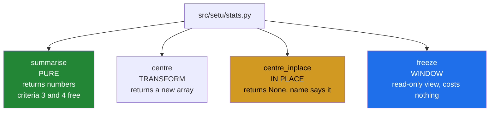

# 3.2 — `src/setu/stats.py` — the gate's module

## One-line answer

The gate's module is short — one summary, one transform, one in-place variant and one way to hand data out
safely — and every line of it is one of the five criteria or one of the four function shapes.

---

## The story

The flat wants one function they can call at the end of the month that tells them how it went.

Not a report, not a chart. One call, and back comes: how many days were actually recorded, what the average
was, how spread out it was, the best day and the worst.

And — this is the part that took a month of arguments to get right — it must not touch the chart. Somebody
should be able to run it twice, run it in the middle of somebody else adding this week's numbers, or run
it on a chart they borrowed, and afterwards the chart says exactly what it said before.

That last requirement is not about statistics at all. It is about being the kind of function other people
can call without reading it first.

---

## The idea in plain language

The module has four public functions and one dataclass, and every one of them is a decision this day has
already argued for.

**`summarise`** is the gate's centrepiece: a `Summary` of the recorded readings, with the count they came
from. It is a **pure** function ([1.5](../01-the-decision/1.5-the-api-contract.md)) — it reads and returns
plain Python numbers, so criteria 3 and 4 are satisfied by construction: there is nothing to modify and
nothing to alias.

**`centre`** is a **transform**: it returns a new array with the mean subtracted, and never touches its
input.

**`centre_inplace`** is the in-place variant, named so and returning `None`, because a caller working on a
gigabyte sometimes genuinely needs it and the alternative is that they write it themselves, worse.

**`freeze`** is the **window** shape: a read-only view somebody can be handed
([1.3](../01-the-decision/1.3-writeable-the-flag.md)).

Three decisions inside `summarise` carry most of the weight, and each is a trade that was made rather than
inherited.

**It flattens with `reshape(-1)`, which is a view when it can be.** That is the cheap call, and it is safe
**here** because nothing in the function writes to it
([2.1](../02-the-bug/2.1-ravel-changed-it-flatten-did-not.md)). The comment says so, because a future edit
that adds a write is exactly what would break it. The comment also says *when* it is a view: `reshape`
falls back to a copy on a non-contiguous input, which costs time rather than correctness here, and which
[4.4](../04-the-benchmark/4.4-the-benchmark-that-lied.md) catches in a benchmark.

**It makes exactly one copy**, when it selects the recorded readings with a boolean mask
([Day 21, 3.2](../../../day-21-indexing-and-views/parts/03-boolean-masks/3.2-indexing-with-a-mask.md)).
That copy is what makes the four statistics that follow cheap, and it is a decision worth stating rather
than a side effect — [3.3](3.3-one-pass-or-five.md) is about whether it earns itself.

**It returns `float` and `int`, never arrays.** A pure function that returns no array cannot alias
anything, so criterion 4 is met by the return type rather than by a promise
([Day 20, 2.5](../../../day-20-arrays-and-dtypes/parts/02-dtypes/2.5-nep-50-and-the-python-number.md)).

And one thing the module does **not** do: it does not accept an `inplace=` flag on `centre`. Two functions
with different names is the shape argued for in
[1.5](../01-the-decision/1.5-the-api-contract.md), because a flag hides at the call site and a name does
not.

---

## Why Setu needs it

- **[3.3](3.3-one-pass-or-five.md)** examines the one copy this module makes and asks whether it pays.
- **[3.4](3.4-the-boundary-that-decides.md)** is where the copy sits and why it is there rather than
  anywhere else.
- **[4.3](../04-the-benchmark/4.3-the-number-measured.md)** measures this module against a loop, which is
  criterion 5.
- **[5.1](../05-the-gate/5.1-the-eval.md)** asserts all five criteria against it.
- **Day 26 onwards**, `DataFrame.describe()` is this function with more fields, and having written one is
  what makes its cost model obvious.

---

## The mechanism

The shape of the answer, and the summary:

```python
"""Phase 3's gate: a vectorised summary that beats a loop, and never edits its caller's array."""

from __future__ import annotations

from dataclasses import dataclass

import numpy as np

ACCUMULATE_IN = np.float64
MIN_FOR_SPREAD = 4


@dataclass(frozen=True, slots=True)
class Summary:
    """Every number the gate reports, with the evidence behind it."""

    observed: int
    expected: int
    mean: float
    std: float
    smallest: float
    largest: float

    @property
    def complete(self) -> bool:
        return self.observed == self.expected

    @property
    def spread(self) -> float:
        return self.largest - self.smallest


def summarise(counts: np.ndarray, *, sample: bool = True) -> Summary:
    """Summarise ``counts``, ignoring readings that were never taken.

    Never modifies the caller's array and never returns a view of it: every value on the
    result is a plain Python number, so there is nothing for a caller to write through.
    """
    if counts.dtype.kind != "f":
        raise TypeError(f"missing readings need a float dtype, got {counts.dtype}")
    flat = counts.reshape(-1)  # a view when counts is contiguous, else a copy; never written
    live = ~np.isnan(flat)
    observed = int(np.count_nonzero(live))
    if observed < MIN_FOR_SPREAD:
        raise ValueError(f"only {observed} of {flat.size} readings; refusing to summarise")
    good = flat[live]  # a copy, and the only one this function makes
    return Summary(
        observed=observed,
        expected=int(flat.size),
        mean=float(good.mean(dtype=ACCUMULATE_IN)),
        std=float(good.std(ddof=1 if sample else 0, dtype=ACCUMULATE_IN)),
        smallest=float(good.min()),
        largest=float(good.max()),
    )
```

**Line by line:**

- The docstring's second sentence — **the copy-and-view contract, stated in the place a caller looks**
  ([1.5](../01-the-decision/1.5-the-api-contract.md)). "Every value on the result is a plain Python number"
  is not a style note; it is the argument for why criterion 4 cannot fail.
- `observed` and `expected` as the first two fields — the evidence before the claims
  ([Day 23, 5.1](../../../day-23-ufuncs-and-statistics/parts/05-the-module/5.1-the-summary-module.md)),
  which is criterion 2.
- `counts.dtype.kind != "f"` — an integer array cannot hold a missing reading
  ([Day 23, 2.5](../../../day-23-ufuncs-and-statistics/parts/02-statistics/2.5-the-nan-family.md)), so
  being handed one means the holes were filled upstream and criterion 2 is unanswerable.
- `counts.reshape(-1)` with the comment `# a view when counts is contiguous, else a copy; never written`
  — **the comment is the point**. The call is a view when the input is contiguous and quietly a copy when
  it is not ([2.1](../02-the-bug/2.1-ravel-changed-it-flatten-did-not.md)), and either way it is safe
  because of what the rest of the function does not do. The next person adding a line needs both halves:
  that writing here would reach the caller, and that a transposed input makes this line cost money.
- `~np.isnan(flat)` — the mask, computed once and used twice. One pass over the data
  ([Day 23, 4.1](../../../day-23-ufuncs-and-statistics/parts/04-counting/4.1-count-nonzero-and-the-mask.md)).
- `good = flat[live]` with the comment `# a copy, and the only one this function makes` — boolean indexing
  always copies ([Day 21, 4.3](../../../day-21-indexing-and-views/parts/04-fancy-indexing/4.3-fancy-indexing-always-copies.md)),
  and saying "the only one" is a claim a reader can check and [3.3](3.3-one-pass-or-five.md) will test.
- `ddof=1 if sample else 0` — the caller's choice translated once
  ([Day 23, 2.3](../../../day-23-ufuncs-and-statistics/parts/02-statistics/2.3-std-var-and-ddof.md)).
- `dtype=ACCUMULATE_IN` on both reductions — the accumulator, so the answers do not drift with the input
  size ([Day 23, 2.6](../../../day-23-ufuncs-and-statistics/parts/02-statistics/2.6-float-summation-and-the-drift.md)).
- `float(...)` on every statistic and `int(...)` on every count — **criterion 4, enforced by the return
  type**. A `Summary` holds no arrays, so there is nothing a caller could write through.

Then the three shapes that do touch arrays:

```python
def centre(counts: np.ndarray) -> np.ndarray:
    """Subtract the mean. Returns a NEW array; the caller's is untouched."""
    if counts.dtype.kind != "f":
        raise TypeError(f"expected floats, got dtype {counts.dtype}")
    return counts - np.nanmean(counts, dtype=ACCUMULATE_IN)


def centre_inplace(counts: np.ndarray) -> None:
    """Subtract the mean IN PLACE. Modifies ``counts``, and any array sharing its memory.

    Returns None, following the convention that a function which changes its argument
    returns nothing, so `x = centre_inplace(x)` cannot be written by accident.
    """
    if not counts.flags.writeable:
        raise ValueError("counts is read-only; it is probably a broadcast or a frozen view")
    counts -= np.nanmean(counts, dtype=ACCUMULATE_IN)


def freeze(counts: np.ndarray) -> np.ndarray:
    """A read-only view of ``counts``. Writing through it raises instead of corrupting."""
    view = counts.view()
    view.flags.writeable = False
    return view
```

**Line by line:**

- `centre` using `counts - ...` rather than `-=` — the subtraction allocates, which is what a transform
  promises ([1.1](../01-the-decision/1.1-six-operations-one-question.md)).
- `centre_inplace` named with the suffix and annotated `-> None` — both halves of the in-place contract
  ([1.5](../01-the-decision/1.5-the-api-contract.md)), and the docstring says **and any array sharing its
  memory**, which is the sentence a caller holding a view needs.
- Its `writeable` check — a function that writes refuses a frozen array with its own message rather than
  raising from three frames down inside a ufunc
  ([1.3](../01-the-decision/1.3-writeable-the-flag.md)). The message names the two likely causes.
- `np.nanmean` in both — a month with a hole is the normal case, and `mean` would return `nan` for the
  whole thing ([Day 23, 2.5](../../../day-23-ufuncs-and-statistics/parts/02-statistics/2.5-the-nan-family.md)).
- `freeze` taking `counts.view()` before setting the flag — freezing a **view**, so the owner keeps write
  access ([1.3](../01-the-decision/1.3-writeable-the-flag.md)).
- **Three functions, three of the four shapes**, and the fourth is `summarise`. Every public name in the
  module is one of them, which is a property a reviewer can check by reading the signatures.

Running it on the month with a hole:

```text
observed/expected: 27 / 28  complete: False
mean             : 9106.74
std (sample)     : 2071.93
std (population) : 2033.2
smallest/largest : 5096.0 14210.0  spread: 9114.0

summarise touched it? False
centre returns new   : True
month unchanged      : True
centred nanmean ~ 0  : -0.0

in place returns     : None
own changed          : True

frozen shares memory : True
frozen writeable     : False
writing through it   : ValueError: assignment destination is read-only
in place on frozen   : ValueError: counts is read-only; it is probably a broadcast or a frozen view
```

Read that output against the five criteria. Line 1 is criterion 2 — twenty-seven of twenty-eight, and
`complete: False` saying so. Lines 2 to 5 are criterion 1, including the two standard deviations that
differ because `ddof` was the caller's choice. `summarise touched it? False` and `month unchanged: True`
are criterion 3. And the last four lines are the module's own guard working: a frozen view shares memory,
refuses a write, and refuses the in-place function with a message from the module rather than from NumPy.

The four shapes in one module:



---

## When it breaks

**An integer month:**

```text
$ uv run python -c "
import numpy as np
from setu.stats import summarise
month = np.array([[8213, 10442, 6180, 9000], [7788, 9120, 11345, 8402]])
summarise(month)
"
Traceback (most recent call last):
  File "<string>", line 5, in <module>
TypeError: missing readings need a float dtype, got int64
```

**What it means.** An integer array cannot hold a `nan`, so every reading in it looks recorded — including
any zero that actually means "nobody wrote a number down"
([Day 23, 2.5](../../../day-23-ufuncs-and-statistics/parts/02-statistics/2.5-the-nan-family.md)). The
module refuses rather than reporting `observed == expected` for a month that has holes it cannot see.
**Criterion 2 is unanswerable on an integer array**, and the guard says so rather than answering it wrongly.

**Almost everything missing:**

```text
$ uv run python -c "
import numpy as np
from setu.stats import summarise
summarise(np.array([8213.0, np.nan, np.nan]))
"
Traceback (most recent call last):
  File "<string>", line 4, in <module>
ValueError: only 1 of 3 readings; refusing to summarise
```

**What it means.** One reading is not a distribution. Without the guard, `std(ddof=1)` on one value returns
`nan` with a `Degrees of freedom <= 0` warning
([Day 23, 2.3](../../../day-23-ufuncs-and-statistics/parts/02-statistics/2.3-std-var-and-ddof.md)) and the
`nan` flows into a report. **The message names both counts**, so somebody reading a log knows whether one
of three or one of a million was recorded, which are very different problems.

**The in-place function on something frozen:**

```text
$ uv run python -c "
import numpy as np
from setu.stats import centre_inplace, freeze
month = np.array([8213.0, 10442.0, 6180.0, 9000.0])
centre_inplace(freeze(month))
"
Traceback (most recent call last):
  File "<string>", line 5, in <module>
ValueError: counts is read-only; it is probably a broadcast or a frozen view
```

**What it means.** The module's own message rather than NumPy's `output array is read-only`, and it names
the two things that are usually responsible ([1.3](../01-the-decision/1.3-writeable-the-flag.md)). The
traceback points at the call rather than at a ufunc three frames down. **This is the whole value of the
check**: NumPy would have raised too, and later, and with less to go on.

---

## In production

**What a professional writes instead of the teaching version.** This module **is** close to it, which is
the point of a gate day. What a real system adds is the layer that decides where its one copy lives:

```python
from __future__ import annotations

from dataclasses import dataclass

import numpy as np

from setu.stats import Summary, freeze, summarise


@dataclass(frozen=True, slots=True)
class MonthStore:
    """Owns one month of readings and hands out only windows and numbers."""

    _readings: np.ndarray

    @classmethod
    def load(cls, readings: np.ndarray) -> "MonthStore":
        # np.array copies; np.asarray would keep the caller's array and let them
        # modify our contents behind our back (Day 25, 1.1).
        return cls(_readings=np.array(readings, dtype=np.float64, copy=True))

    def summary(self, *, sample: bool = True) -> Summary:
        """PURE. Numbers only; nothing here can alias our readings."""
        return summarise(self._readings, sample=sample)

    def readings(self) -> np.ndarray:
        """WINDOW. A read-only view. Free, and writing through it raises."""
        return freeze(self._readings)

    def snapshot(self) -> np.ndarray:
        """TRANSFORM. An independent copy the caller may modify freely."""
        return self._readings.copy()
```

**Line by line:**

- `load` as a classmethod using `np.array(..., copy=True)` — **the store's one copy**, taken at the
  boundary. Using `np.asarray` would keep the caller's array and every guarantee below would be a lie
  ([1.1](../01-the-decision/1.1-six-operations-one-question.md)), and the comment says so.
- `summary()` delegating to `summarise` — the store adds nothing except ownership, which is the right amount
  for it to add.
- `readings()` returning `freeze(...)` — a window, free, and the method that would otherwise be the
  dangerous one ([1.5](../01-the-decision/1.5-the-api-contract.md)).
- `snapshot()` beside it — the escape hatch, named, so nobody unfreezes the window instead
  ([1.3](../01-the-decision/1.3-writeable-the-flag.md)).
- **No method returns a writeable view of `_readings`** — the invariant, checkable by reading four short
  methods. That is the property that makes the class worth having over a bare array.
- `frozen=True` on the dataclass and a leading underscore on the field — the array reference cannot be
  reassigned, which is not the same as the array being immutable and is worth having anyway.

**What changes at scale.** The module's shape stops being a style question and becomes the memory budget.
`summarise` returning numbers means a hundred callers cost nothing; `readings()` returning a frozen window
means a hundred readers share one copy of a four-gigabyte array where `snapshot()` would need a hundred.
Two further effects. The **one copy** inside `summarise` — `flat[live]` — is proportional to the data and
is the module's whole allocation, so at gigabyte scale it is the number that decides whether the function
fits, which is why [3.3](3.3-one-pass-or-five.md) examines whether it earns itself. And under
**concurrency** the four shapes become the vocabulary for thread safety: `summarise`, `centre` and
`readings` are safe to call from any number of threads on one store, `centre_inplace` is not safe from any,
and the names say which without anybody reading the bodies.

**The failure that only appears with real data.** A monitoring service summarised a shared metrics buffer
every minute. The summary function flattened with `ravel` and, in a later optimisation, selected the live
values with `out=` into a reused scratch buffer — which happened to alias the flattened view. The summary
numbers were right and the metrics buffer was progressively overwritten with intermediate values. It looked
like data loss in the collector, and the collector was rewritten twice before anybody read the summary
function.

**The review comment a senior engineer leaves.** *"`counts.reshape(-1)` is a view — fine, because nothing
in this function writes to it. Please keep the comment saying so; the next person adding a line here is
exactly who it is for. And `flat[live]` is the only allocation in the module, so it is worth a comment
saying that too."*

**The interview question.** *"Walk me through a module that has to guarantee it does not modify its
input."* The strongest guarantee is structural rather than defensive: the main function is **pure** and
returns plain Python numbers, so there is nothing to modify and nothing to alias — the promise is met by
the return type rather than by discipline. Around it, every function that does touch arrays is one of three
named shapes: a transform that returns a new array, an in-place variant with `_inplace` in its name and a
`None` return so an assignment fails loudly, and a `freeze` that hands out a read-only view. Inside the
summary the two things worth pointing at are a comment on the `reshape(-1)` saying it is a view and safe
only because nothing writes to it, and a comment on the boolean-mask selection saying it is the only copy
the function makes — both are claims a reader can check, and both are what a future edit would break. At
the boundary the constructor uses `np.array(..., copy=True)` rather than `asarray`, because `asarray`
returns the caller's own array and every guarantee downstream would then be false.

---

## Check yourself

```bash
uv run python -c "
import numpy as np
from setu.stats import centre, centre_inplace, freeze, summarise
month = np.array([[8213., 10442., 6180., 9000., 12007., 9631., 7204.],
                  [7788., 9120., 11345., 8402., 6733., 14210., 5096.]])
month[0, 3] = np.nan
before = month.copy()
s = summarise(month)
print('observed/expected:', s.observed, '/', s.expected, ' complete:', s.complete)
print('mean/std         :', round(s.mean, 2), round(s.std, 2))
print('input unchanged  :', np.array_equal(before, month, equal_nan=True))
c = centre(month)
print('centre aliases   :', np.shares_memory(c, month))
print('input unchanged  :', np.array_equal(before, month, equal_nan=True))
f = freeze(month)
print('freeze aliases   :', np.shares_memory(f, month), ' writeable:', f.flags.writeable)
try:
    centre_inplace(f)
except ValueError as e:
    print('in place frozen  :', e)
"
```

Two lines report `input unchanged` and both say `True`. Say which of the five gate criteria those two lines
are checking, and why the `equal_nan=True` is not optional here.

**Answer out loud, without scrolling up:**

> Name the four functions in this module and the shape each one is. Then say how `summarise` satisfies the
> no-aliasing criterion without needing a `shares_memory` check anywhere.

---

**Next:** [3.3 — one pass or five](3.3-one-pass-or-five.md).
