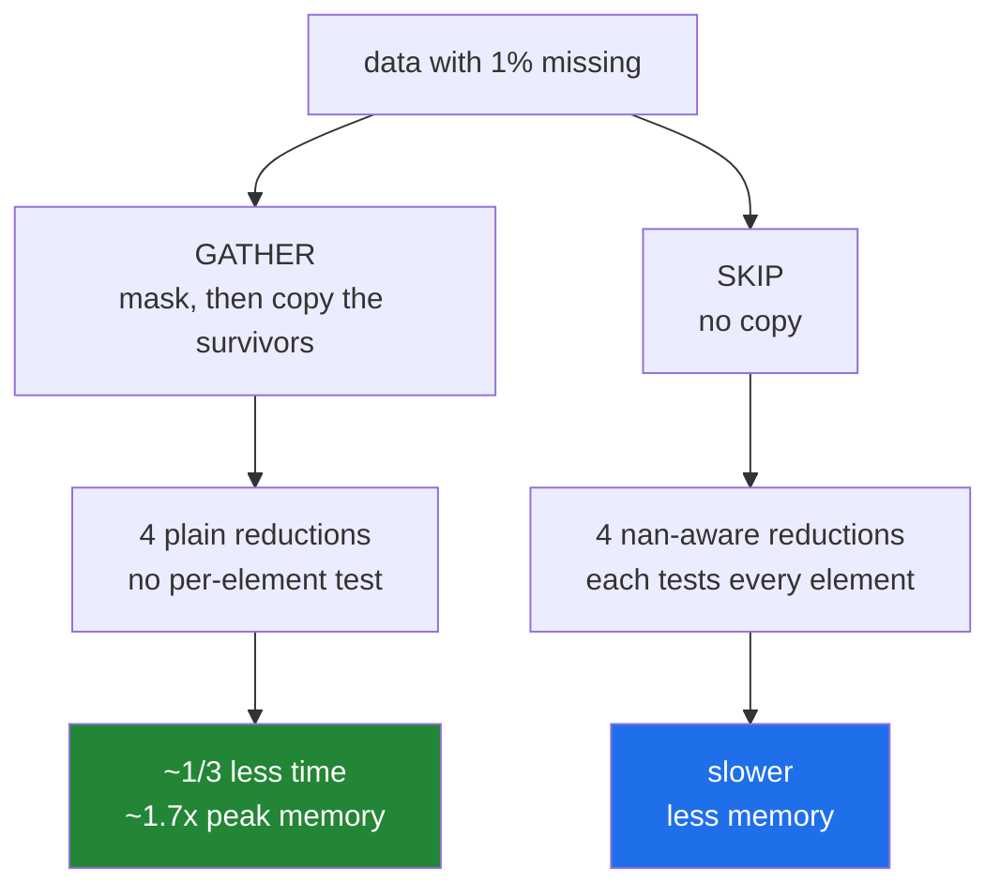

# 3.3 — One pass or five — the copy that pays for itself

## One-line answer

The module makes one copy to gather the recorded readings, and that copy buys four cheaper passes
afterwards — about a third less time for about 1.7 times the peak memory, which is a trade worth stating
rather than a side effect worth hiding.

---

## The story

Somebody is totalling the month, and about one day in a hundred has no number written down.

There are two ways to go about it. Read the whole chart four times — once for the total, once for the
spread, once for the smallest, once for the largest — and each time skip over the blanks as you come to
them. Or copy the numbers that are actually there onto a fresh sheet first, and then read that sheet four
times with nothing to skip.

The second way means writing the numbers out once more, which is work, and a sheet of paper, which is
space. In exchange, four passes get easier because there is no deciding to do on any of them.

Whether that is worth it depends on how much writing out costs relative to how much the skipping costs,
and on whether there is room on the desk for a second sheet. Neither answer is obviously right, which is
exactly why it should be a decision somebody made rather than whichever way the code happened to come out.

---

## The idea in plain language

`summarise` has to produce five numbers from an array with holes in it
([3.2](3.2-the-stats-module.md)). There are two shapes it could have.

**Gather then reduce.** Build a mask, use it to select the recorded readings into a new array, and then run
four ordinary reductions over that array. One copy, and every reduction after it is a plain contiguous walk
with no per-element decision.

**Reduce with skipping.** Call `np.nanmean`, `np.nanstd`, `np.nanmin` and `np.nanmax` on the original.
No copy, and every one of the four has to test each element for being missing as it goes
([Day 23, 2.5](../../../day-23-ufuncs-and-statistics/parts/02-statistics/2.5-the-nan-family.md)).

Both are correct and give identical answers. The module uses the first, and the reason is worth measuring
rather than asserting: gathering took about a third less time at every size tested, and cost about 1.7
times the peak memory.

Two things about that trade are worth having in your head.

**The copy is proportional to the surviving data**, not to the input. A month where nothing is missing
copies everything; a month where nine tenths are missing copies a tenth. So the memory cost falls as the
data gets worse, which is the opposite of most costs.

**The speed advantage comes from the reductions, not from the gather.** The gather is one pass with a
branch; the four reductions afterwards have none. Four cheap passes plus one expensive one beat four
expensive passes — and the more statistics you add, the further ahead the gather gets. Adding a sixth
widened the gap to about 1.7 times in the measurement below.

The generalisation is therefore about **how many times you read what the copy produced**. At one statistic
the two shapes come out about level, because the copy has nothing to amortise against and is paying its
own way at best. At five it is comfortably ahead. So the right shape for a function returning five
statistics is not automatically the right shape for a function returning one, and the number of statistics
is the variable to think about rather than the size of the array.

---

## Why Setu needs it

- **[3.4](3.4-the-boundary-that-decides.md)** is about **where** that copy sits, which is a different
  question from whether to make it.
- **[4.3](../04-the-benchmark/4.3-the-number-measured.md)** measures the whole module against a loop, and
  this decision is part of what it measures.
- **[5.1](../05-the-gate/5.1-the-eval.md)** asserts the module makes one copy and not five, which is only
  testable because the decision was made deliberately.
- **Day 23's `out=`** made the same argument about temporaries in a chained expression
  ([Day 23, 1.2](../../../day-23-ufuncs-and-statistics/parts/01-ufuncs/1.2-out-and-the-temporaries.md));
  this is the version where the extra allocation is the *right* answer.
- **Day 76's pipelines** face this at every stage: gather the valid rows once, or filter inside each
  transformer.

---

## The mechanism

The two shapes, timed and measured:

```python
import timeit
import tracemalloc

import numpy as np

ACCUMULATE_IN = np.float64


def gather_then_reduce(counts: np.ndarray) -> tuple[int, float, float, float, float]:
    """One copy, then four plain reductions."""
    flat = counts.reshape(-1)
    live = ~np.isnan(flat)
    n = int(np.count_nonzero(live))
    good = flat[live]
    return (
        n,
        float(good.mean(dtype=ACCUMULATE_IN)),
        float(good.std(ddof=1, dtype=ACCUMULATE_IN)),
        float(good.min()),
        float(good.max()),
    )


def reduce_with_skipping(counts: np.ndarray) -> tuple[int, float, float, float, float]:
    """No copy, and four reductions that each test every element."""
    flat = counts.reshape(-1)
    n = int(np.count_nonzero(~np.isnan(flat)))
    return (
        n,
        float(np.nanmean(flat, dtype=ACCUMULATE_IN)),
        float(np.nanstd(flat, ddof=1, dtype=ACCUMULATE_IN)),
        float(np.nanmin(flat)),
        float(np.nanmax(flat)),
    )


rng = np.random.default_rng(20260902)
for size in [100_000, 1_000_000, 10_000_000]:
    data = rng.normal(9000, 2000, size)
    data[rng.integers(0, size, size // 100)] = np.nan
    t_gather = min(timeit.repeat(lambda: gather_then_reduce(data), number=3, repeat=3)) / 3
    t_skip = min(timeit.repeat(lambda: reduce_with_skipping(data), number=3, repeat=3)) / 3
    tracemalloc.start()
    gather_then_reduce(data)
    _, peak_gather = tracemalloc.get_traced_memory()
    tracemalloc.stop()
    tracemalloc.start()
    reduce_with_skipping(data)
    _, peak_skip = tracemalloc.get_traced_memory()
    tracemalloc.stop()
    print(f"n={size:>10,}  data {data.nbytes:>12,} bytes")
    print(f"    gather {t_gather * 1000:7.2f} ms  peak {peak_gather:>12,}")
    print(f"    skip   {t_skip * 1000:7.2f} ms  peak {peak_skip:>12,}")
    print(f"    agree  {np.allclose(gather_then_reduce(data), reduce_with_skipping(data))}")
```

**Line by line:**

- Both functions returning the **same five values in the same order** — that is what makes `np.allclose` on
  the last line a meaningful check, and a benchmark of two functions computing different things is
  worthless.
- `flat = counts.reshape(-1)` in both — a view in both cases
  ([2.1](../02-the-bug/2.1-ravel-changed-it-flatten-did-not.md)), so the flattening is not part of what is
  being compared.
- `good = flat[live]` — **the one copy**. Boolean indexing allocates
  ([Day 21, 4.3](../../../day-21-indexing-and-views/parts/04-fancy-indexing/4.3-fancy-indexing-always-copies.md)),
  and everything after it is a contiguous walk.
- `good.mean(...)`, `good.std(...)`, `.min()`, `.max()` — four reductions with no missing values to
  consider, because they were removed by the gather.
- `np.nanmean`, `np.nanstd`, `np.nanmin`, `np.nanmax` in the other — four reductions that each check every
  element ([Day 23, 2.5](../../../day-23-ufuncs-and-statistics/parts/02-statistics/2.5-the-nan-family.md)).
  Both count the missing values the same way, so that part is not what differs.
- `size // 100` missing values — one per cent, which is a realistic missing rate. **This number matters to
  the result**: at a much higher rate the gather copies far less and wins by more.
- `tracemalloc.start()` around each — the peak allocation, which is the other half of the trade and is
  invisible to `timeit` ([1.4](../01-the-decision/1.4-out-and-aliasing.md)).
- Three sizes, spanning two orders of magnitude — because a trade that reverses with size is a trade you
  have to state the size for ([3.1](3.1-the-gate-as-a-list.md)).

```text
n=   100,000  data      800,000 bytes
    gather    0.86 ms  peak    1,685,696
    skip      1.24 ms  peak    1,067,132
    agree  True
n= 1,000,000  data    8,000,000 bytes
    gather   10.46 ms  peak   16,842,176
    skip     16.12 ms  peak   10,067,132
    agree  True
n=10,000,000  data   80,000,000 bytes
    gather  100.92 ms  peak  168,409,408
    skip    155.18 ms  peak  100,067,132
    agree  True
```

The pattern holds at every size: **gathering takes about a third less time and costs about 1.7 times the
peak memory.** At ten million readings that is 54 ms saved for 68 MB spent.

Where the two shapes differ:



Now the thing that decides which is right — how many statistics you need:

```python
import timeit

import numpy as np

rng = np.random.default_rng(20260902)
data = rng.normal(9000, 2000, 5_000_000)
data[rng.integers(0, 5_000_000, 50_000)] = np.nan


def one_statistic_gathering() -> float:
    good = data[~np.isnan(data)]
    return float(good.mean(dtype=np.float64))


def one_statistic_skipping() -> float:
    return float(np.nanmean(data, dtype=np.float64))


t_gather = min(timeit.repeat(one_statistic_gathering, number=3, repeat=3)) / 3
t_skip = min(timeit.repeat(one_statistic_skipping, number=3, repeat=3)) / 3

print(f"one statistic, gathering : {t_gather * 1000:7.2f} ms")
print(f"one statistic, skipping  : {t_skip * 1000:7.2f} ms")
print(f"gathering is {t_gather / t_skip:.2f}x the cost")
print("same answer:", np.isclose(one_statistic_gathering(), one_statistic_skipping()))
```

**Line by line:**

- The same data and the same missing rate as before, so the only thing that changed is **how many
  statistics are wanted**.
- `one_statistic_gathering` doing the copy and then one reduction — the module's shape, applied to a
  function that only needs a mean.
- `one_statistic_skipping` calling `np.nanmean` directly — one pass, no allocation.
- The ratio printed as "the cost" rather than "the speedup" — because the interesting question here is
  whether the copy still earns anything, and framing it that way makes a value near 1.0 easy to read.
- `np.isclose` on the last line — the same correctness check, because two ways of computing a mean over
  floats need not agree bit for bit
  ([Day 23, 2.6](../../../day-23-ufuncs-and-statistics/parts/02-statistics/2.6-float-summation-and-the-drift.md)).

```text
one statistic, gathering :   22.60 ms
one statistic, skipping  :   23.67 ms
gathering is 0.95x the cost
same answer: True
```

**The advantage disappears.** For one statistic the two are level — 0.95 is within the noise of a
measurement like this — where for five the gather took about a third less time. So the copy is not free
money; it is an investment that pays in proportion to how many reductions follow it, and at one reduction
it has just about broken even while still costing the extra memory.

That is the honest shape of the finding, and it is why this belongs in a comment rather than in a habit:
**the gather is right for this module because it produces five numbers**, and somebody writing a function
that produces one should reach for `np.nanmean` and not copy anything.

---

## When it breaks

**A month with almost nothing missing:**

```text
$ uv run python -c "
import timeit
import tracemalloc
import numpy as np

rng = np.random.default_rng(1)
for rate, label in [(0, 'nothing missing'), (500_000, 'half missing')]:
    data = rng.normal(9000, 2000, 1_000_000)
    if rate:
        data[rng.choice(1_000_000, rate, replace=False)] = np.nan
    tracemalloc.start()
    good = data[~np.isnan(data)]
    _, peak = tracemalloc.get_traced_memory()
    tracemalloc.stop()
    print(f'{label:18s} survivors {good.size:>9,}  peak {peak:>11,} bytes')
"
nothing missing    survivors 1,000,000  peak   9,000,480 bytes
half missing       survivors   500,000  peak   5,000,480 bytes
```

**What it means.** The copy is proportional to the **survivors**, so a clean month costs a full extra copy
and a month that is half missing costs half of one. That is an unusual shape for a cost: it is worst when
the data is best. In a system where missing data is rare — which is most of them — the gather is always
paying close to its maximum, and the argument for it rests entirely on the four reductions it makes cheaper.
**If the module ever drops to two statistics, this decision should be revisited**, which is the sort of
thing a comment in the code is for.

**The gather that ran out of memory:**

```text
$ uv run python -c "
import numpy as np
size = 200_000_000
print('a float64 array of', f'{size:,}', 'values needs', f'{size * 8:,}', 'bytes')
print('gathering doubles that to about  ', f'{size * 8 * 2:,}')
print('on a 16 GB machine that is        ', round(size * 8 * 2 / 2**30, 1), 'GB of', 16)
print()
small = np.arange(10, dtype=np.float64)
mask = np.ones(10, dtype=bool)
print('the mask itself costs one byte per element:', mask.nbytes, 'for', small.nbytes)
"
a float64 array of 200,000,000 values needs 1,600,000,000 bytes
gathering doubles that to about   3,200,000,000
on a 16 GB machine that is         6.0 GB of 16
```

**What it means.** The arithmetic that decides this at scale, done rather than guessed. Two hundred million
readings is 1.6 GB, gathering peaks at about double, and that is before anything else in the process. The
speed advantage measured above is real and is worth about a third of the run time — **and no amount of
speed helps a job that does not fit.** At that size the answer flips to the `nan`-aware reductions, and the
comment in the module should say at roughly what size somebody should reconsider. Note also the mask: a
boolean array is one byte per element
([Day 23, 4.1](../../../day-23-ufuncs-and-statistics/parts/04-counting/4.1-count-nonzero-and-the-mask.md)),
so it is another 200 MB on top.

**The five statistics that were secretly nine passes:**

```text
$ uv run python -c "
import timeit
import numpy as np

rng = np.random.default_rng(2)
data = rng.normal(9000, 2000, 2_000_000)
data[rng.integers(0, 2_000_000, 20_000)] = np.nan

def careless(counts):
    return (int(np.count_nonzero(~np.isnan(counts))),
            float(np.nanmean(counts)),
            float(np.nanstd(counts, ddof=1)),
            float(np.nanmin(counts)),
            float(np.nanmax(counts)),
            float(np.nanmedian(counts)))

def gathered(counts):
    good = counts[~np.isnan(counts)]
    return (int(good.size), float(good.mean()), float(good.std(ddof=1)),
            float(good.min()), float(good.max()), float(np.median(good)))

t_c = min(timeit.repeat(lambda: careless(data), number=3, repeat=3)) / 3
t_g = min(timeit.repeat(lambda: gathered(data), number=3, repeat=3)) / 3
print(f'six nan-aware calls : {t_c*1000:7.2f} ms')
print(f'gather then six     : {t_g*1000:7.2f} ms')
print(f'ratio               : {t_c/t_g:.2f}x')
"
six nan-aware calls :   66.17 ms
gather then six     :   38.56 ms
ratio               : 1.72x
```

**What it means.** Adding a sixth statistic — a median — widens the gap to about 1.7 times,
because `np.nanmedian` is markedly more expensive than `np.median` on gathered data: it has to work around
the missing values while partitioning
([Day 23, 2.4](../../../day-23-ufuncs-and-statistics/parts/02-statistics/2.4-median-percentile-and-quantile.md)).
**The more statistics you want, the better the gather looks**, which is the rule from the mechanism section
demonstrated in the direction that favours it. A summary function that grows over time drifts towards the
gather being correct, and one that shrinks drifts the other way — so the comment recording the decision
should say what it depends on rather than just what it is.

---

## In production

**What a professional writes instead of the teaching version.** The trade is recorded where somebody
changing the function will read it:

```python
from __future__ import annotations

import numpy as np

ACCUMULATE_IN = np.float64

# Gather-then-reduce rather than nan-aware reductions.
#
# We select the recorded readings into a new array once, then run plain reductions over
# it. Measured on 1e5 to 1e7 readings with 1% missing: about a third less time, about
# 1.7x the peak memory. The copy is proportional to the SURVIVORS, so it is worst
# when the data is cleanest.
#
# This is only the right shape because we produce five statistics. At ONE statistic the
# two came out level (0.95x), so the copy had barely earned itself; at six it was 1.7x
# ahead. If this function ever drops below three statistics, or is asked to handle arrays
# where 2x peak memory does not fit (roughly 1e8 readings on a 16 GB box), re-measure
# before assuming.
GATHER_THRESHOLD_STATISTICS = 3


def gathered_statistics(counts: np.ndarray) -> tuple[np.ndarray, int]:
    """The recorded readings as a contiguous array, plus how many there were.

    Returns a COPY: the caller may reduce over it freely, and it does not alias ``counts``.
    """
    flat = counts.reshape(-1)  # a view; nothing is written to it
    live = ~np.isnan(flat)
    good = flat[live]  # the module's one allocation
    return good, int(good.size)
```

**Line by line:**

- The **comment block is the deliverable here**, not the function. It records the measurement, the
  conditions, and the two circumstances under which the decision reverses — which is everything a future
  editor needs and none of it is recoverable from the code.
- "about a third to a half faster, about 1.7x the peak memory" — **numbers, with the sizes and the missing
  rate they were measured at**. A comment saying "faster" is a comment somebody will disbelieve and delete.
- "The copy is proportional to the SURVIVORS, so it is worst when the data is cleanest" — the
  counter-intuitive part, stated, because it is the one somebody will get wrong when reasoning about it
  fresh.
- The two reversal conditions — fewer than three statistics, or arrays where twice the memory does not fit
  — with a size attached to the second. **A decision that names the conditions under which it is wrong is
  a decision somebody can act on**; one that does not is folklore.
- `GATHER_THRESHOLD_STATISTICS = 3` — the threshold as a named constant even though nothing reads it. That
  is deliberate: it makes the number greppable and gives the comment something to attach to, so the
  reasoning does not float free of the code.
- `flat[live]` with the comment "the module's one allocation" — a claim
  ([3.2](3.2-the-stats-module.md)) that [5.1](../05-the-gate/5.1-the-eval.md) can test with
  `tracemalloc`.
- Returning **both** the array and its size — the count is free here and computing it again later would be
  another pass.
- The docstring saying "Returns a COPY ... does not alias `counts`" — the contract
  ([1.5](../01-the-decision/1.5-the-api-contract.md)), so a caller knows they may write to it.

**What changes at scale.** The trade tips, and it tips on memory rather than on speed. The speed advantage
is roughly constant as a proportion — about a third at every size measured — while the memory cost
grows linearly and eventually stops fitting, so there is a size above which the faster option is simply not
available. Two further effects. **The missing rate becomes a live variable**: at one per cent the gather
copies almost everything, and on a dataset that is ninety per cent missing it copies a tenth and wins
enormously — so a function tuned on clean data can behave very differently on sparse data, and the missing
rate is worth logging alongside the timing. And past the point where the array does not fit at all, both
shapes are wrong and the answer becomes **chunking**: read a block, accumulate running count, sum, sum of
squares, minimum and maximum, discard the block. That is one pass, constant memory, and it is what every
database's `stddev()` does — with the caveat that a median cannot be computed that way at all, which is
why a streaming summary reports quantile estimates rather than exact ones.

**The failure that only appears with real data.** A summary function used the gather shape, measured and
correct, on data that was typically five per cent missing. A schema change made one column optional and its
missing rate went to zero — every reading present — so the gather began copying the full array on every
call. The function was ten per cent faster than the alternative and used twice the memory it had been
sized for, and the service began being killed under load. The profile showed the time in the reductions,
where it had always been, and the allocation did not appear in any timing at all.

**The review comment a senior engineer leaves.** *"This gathers into a temporary and then reduces five
times, which is the right call and is not obvious — please leave a comment with the measurement and the
sizes. Specifically say that the copy scales with the survivors, so it is worst on clean data, and at what
size the memory stops fitting."*

**The interview question.** *"You need five statistics from an array with missing values. Do you gather the
valid values first or use the `nan`-aware reductions?"* Measure it, and for five statistics the gather won:
about a third less time from a hundred thousand to ten million readings, at roughly 1.7 times the peak
memory. The reason is that the copy is one pass with a branch, and it makes four subsequent passes
branch-free — so the copy amortises across however many statistics you compute. That immediately gives the
rule: for **one** statistic the two came out level in my measurement, because the copy has nothing to
amortise against and only just pays its own way — while adding a sixth statistic like a median widened the
gather's advantage to about 1.7 times. Two things to say about the memory: the copy is proportional to the **survivors**, so it costs most
when the data is cleanest, which is backwards from most costs; and there is a size above which twice the
peak simply does not fit, at which point neither shape is right and the answer is a chunked single pass
accumulating count, sum, sum of squares, min and max — which is what a database does, and which cannot give
you an exact median.

---

## Check yourself

```bash
uv run python -c "
import timeit, tracemalloc
import numpy as np
rng = np.random.default_rng(20260902)
data = rng.normal(9000, 2000, 1_000_000)
data[rng.integers(0, 1_000_000, 10_000)] = np.nan

def gather():
    g = data[~np.isnan(data)]
    return (g.mean(), g.std(ddof=1), g.min(), g.max())
def skip():
    return (np.nanmean(data), np.nanstd(data, ddof=1), np.nanmin(data), np.nanmax(data))

for name, fn in [('gather', gather), ('skip', skip)]:
    t = min(timeit.repeat(fn, number=3, repeat=3)) / 3
    tracemalloc.start(); fn(); _, peak = tracemalloc.get_traced_memory(); tracemalloc.stop()
    print(f'{name:7s} {t*1000:7.2f} ms  peak {peak:>11,} bytes')
print('data bytes  :', f'{data.nbytes:,}')
print('same answer :', np.allclose(gather(), skip()))
"
```

One is faster and one uses less memory. Say which trade the module made and the one condition under which
you would make the other one.

**Answer out loud, without scrolling up:**

> Say why gathering the valid values first makes the four reductions cheaper, and what that argument
> depends on. Then say when it reverses.

---

**Next:** [3.4 — the boundary that decides copy or view](3.4-the-boundary-that-decides.md).
