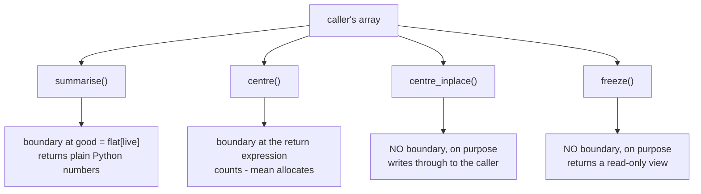

# 3.4 — The boundary — the one line where the caller's memory ends

## One-line answer

In `stats.py` there is exactly one line that stops using the caller's memory and starts using the module's
own, and because it is one line and it is marked, the question "can this function change my array?" is
answered by reading rather than by testing.

---

## The story

The month's step counts are written on a chart on the kitchen wall, and there is one rule about it: the
chart stays on the wall.

If you want to work out the totals, you sit at the table with a scrap of paper, copy the numbers you need
onto the scrap, and do your crossing-out there. Nobody has ever written the rule down, but everyone in the
flat can tell you where the copying happens: at the table, when you sit down. Not halfway through. Not
twice.

That is what makes the rule usable. It is not "be careful with the chart" — careful is a mood, and moods
lapse at eleven at night. It is a **place**. Before the table, you are looking at the chart and you may not
mark it. After the table, you are looking at your own scrap and you may do what you like. Anybody walking
into the kitchen can look at what you are holding and know which side of the rule you are on.

A rule that lives in a place can be checked. A rule that lives in everyone's good intentions cannot.

---

## The idea in plain language

Every function that takes an array and produces something has a moment where it stops working on the
caller's block of memory and starts working on its own. Call that moment **the boundary**.

Above the boundary the function is holding a **view** — a second label on the caller's memory, which shares
every byte with it ([1.2](../01-the-decision/1.2-the-three-probes.md)). Reading through a view is free.
Writing through a view writes into the caller's array, which is the whole of the bug in
[2.1](../02-the-bug/2.1-ravel-changed-it-flatten-did-not.md).

Below the boundary the function is holding a **copy** — a fresh block of memory that belongs to the
function and to nobody else. Writing to it is safe, because there is no caller on the other end of it.

Three things follow, and they are why the boundary is worth naming rather than just having.

**A function with one boundary can be audited by reading.** You find the line, you check that nothing above
it writes, and you are done. A function whose copies are scattered through it has to be tested to be
trusted, and a test only covers the inputs you thought of.

**A boundary in the wrong place is a bug even when the answer is right.** Put it too late and you have
written through a view; put it too early and you have copied data you were only going to read.

**A boundary that moves depending on the input is the worst case of all**, because the function is a
transform on some arguments and a mutation on others, and the failing one is whichever the test suite
happens not to cover. `np.asarray` has exactly this shape, and it is in the "when it breaks" section below.

`stats.py` ([3.2](3.2-the-stats-module.md)) has four functions, and each one's boundary is stated in the
same way: a comment on the line, and a sentence in the docstring.

---

## Why Setu needs it

- **[5.1](../05-the-gate/5.1-the-eval.md)** asserts the caller's array is unchanged after every public
  call. That test is easy to write because the boundary is one line; it would be guesswork otherwise.
- **[4.3](../04-the-benchmark/4.3-the-number-measured.md)** times the module against a loop, and where the
  boundary sits determines how much memory the timed code allocates.
- **[1.5](../01-the-decision/1.5-the-api-contract.md)** gave the four function shapes. This part is where
  they land in real code: the boundary is what makes a function one shape and not another.
- **Day 41's tensors** repeat this exactly. `torch.from_numpy` gives you a tensor sharing the array's
  memory, so a training loop has a boundary too, and getting it wrong there corrupts a dataset.
- **Day 76's pipelines** chain six transformers. Each one's boundary is a decision, and six functions that
  each copy defensively is six times the data resident at once
  ([2.3](../02-the-bug/2.3-the-defences.md)).

---

## The mechanism

Here is `summarise` again, with the boundary marked and every intermediate probed:

```python
import numpy as np

month = np.array(
    [
        [8402.0, 11930.0, 6011.0, np.nan, 9877.0, 14210.0, 5096.0],
        [9120.0, 7734.0, 10402.0, 8890.0, 12005.0, 13877.0, 6210.0],
        [7788.0, 9002.0, 11566.0, 9341.0, 8120.0, 12994.0, 7003.0],
        [10440.0, 8877.0, 9210.0, 11002.0, 7654.0, 13120.0, 5988.0],
    ]
)

flat = month.reshape(-1)  # above the boundary: a view of the caller's memory
live = ~np.isnan(flat)  # above: reads the caller's memory, writes to its own
good = flat[live]  # THE BOUNDARY: from here on the memory is ours

for name, arr in [("counts", month), ("flat", flat), ("live", live), ("good", good)]:
    print(
        f"{name:8} shares_memory(counts)={np.shares_memory(month, arr)!s:5} "
        f"owndata={arr.flags.owndata!s:5} base={type(arr.base).__name__}"
    )
```

**Line by line:**

- `flat = month.reshape(-1)` — **above the boundary.** `reshape` returns a view whenever it can
  ([2.1](../02-the-bug/2.1-ravel-changed-it-flatten-did-not.md)), so `flat` is a second label on the
  caller's numbers. It is safe here for one reason only: nothing writes through it.
- `live = ~np.isnan(flat)` — **still above, and this is the subtle one.** It *reads* the caller's memory
  and *writes* to a new boolean array of its own. A ufunc without `out=` always allocates its result
  ([Day 23, 1.2](../../../day-23-ufuncs-and-statistics/parts/01-ufuncs/1.2-out-and-the-temporaries.md)), so
  no byte of `month` is touched. `live` owns its own data, but it is not the boundary, because it is a
  different array of a different dtype rather than the readings themselves.
- `good = flat[live]` — **the boundary.** Boolean indexing always copies
  ([Day 21, 4.3](../../../day-21-indexing-and-views/parts/04-fancy-indexing/4.3-fancy-indexing-always-copies.md)),
  so `good` is a fresh block holding just the recorded readings. Everything after this line could sort,
  scale or overwrite `good` without the caller ever knowing.
- The three probes on each intermediate — `shares_memory`, `owndata` and `base`
  ([1.2](../01-the-decision/1.2-the-three-probes.md)) — because the claim "this is where the boundary is"
  should be checkable rather than commented.

```text
counts   shares_memory(counts)=True  owndata=True  base=NoneType
flat     shares_memory(counts)=True  owndata=False base=ndarray
live     shares_memory(counts)=False owndata=True  base=NoneType
good     shares_memory(counts)=False owndata=True  base=NoneType
```

**Read the `shares_memory` column top to bottom and the boundary is visible**: `True`, `True`, then `False`
and it never goes back. `flat` is the last thing that touches the caller. `live` is already the module's
own memory but it is a mask, not the readings; `good` is the readings, on the module's side.

Note `flat`'s row: `owndata=False` and `base=ndarray` is exactly the signature of a view, and `month`'s own
row — `owndata=True`, `base=NoneType` — is what an array that owns its block looks like.

### The four functions and where each boundary sits



Two of the four have no boundary at all, and that is the point of them. `centre_inplace` exists precisely
to write into the caller's memory, and `freeze` exists precisely to hand back a window onto it. A function
with no boundary is not a broken function; it is a function whose *name* has to say so
([1.5](../01-the-decision/1.5-the-api-contract.md)).

```python
import numpy as np

import stats  # src/setu/stats.py from part 3.2

before = month.copy()

s = stats.summarise(month)
print("summarise   untouched:", np.array_equal(month, before, equal_nan=True))

out = stats.centre(month)
print(
    "centre      untouched:",
    np.array_equal(month, before, equal_nan=True),
    " result shares:",
    np.shares_memory(month, out),
)

view = stats.freeze(month)
print("freeze      shares:", np.shares_memory(month, view), " writeable:", view.flags.writeable)

work = month.copy()
stats.centre_inplace(work)
print("centre_inpl changed its argument:", not np.array_equal(work, month, equal_nan=True))
```

**Line by line:**

- `before = month.copy()` then `np.array_equal(month, before, ...)` — the assertion form from
  [2.3](../02-the-bug/2.3-the-defences.md). It is the only way to check "untouched" that does not depend on
  reading the function.
- `equal_nan=True` on every comparison — `nan != nan`, so without it the check fails on a chart that has a
  missing reading, which this one does. That is the false alarm from 2.3's failure section.
- `stats.centre(month)` checked **two** ways: the caller is unchanged *and* the result does not share
  memory. Both matter. A function can leave its input alone and still hand back a view of it, and then the
  caller has two labels for one block without being told.
- `stats.freeze(month)` checked for `shares_memory=True` — for `freeze`, sharing is the feature. The
  `writeable=False` on the next probe is what makes sharing safe
  ([1.3](../01-the-decision/1.3-writeable-the-flag.md)).
- `work = month.copy()` before `centre_inplace` — because that function does what it says and there would
  be nothing left to compare against otherwise.

```text
summarise   untouched: True
centre      untouched: True  result shares: False
freeze      shares: True  writeable: False
centre_inpl changed its argument: True
```

Four functions, four different relationships with the caller's memory, and all four are what the names
promised.

---

## When it breaks

**The boundary drawn too late — a write above the line:**

```python
import numpy as np

month = np.array([[8402.0, 11930.0, 6011.0, np.nan], [9120.0, 7734.0, 10402.0, 8890.0]])
before = month.copy()


def spread_sorting(counts: np.ndarray) -> float:
    """Sorts above the boundary, which means it sorts the caller's array."""
    flat = counts.reshape(-1)
    flat.sort()
    return float(flat[-1] - flat[0])


print("before:", month.tolist())
print("spread:", spread_sorting(month))
print("after :", month.tolist())
print("untouched:", np.array_equal(month, before, equal_nan=True))
```

```text
before: [[8402.0, 11930.0, 6011.0, nan], [9120.0, 7734.0, 10402.0, 8890.0]]
spread: nan
after : [[6011.0, 7734.0, 8402.0, 8890.0], [9120.0, 10402.0, 11930.0, nan]]
untouched: False
```

**What it means.** There is no exception, no warning and no traceback. `flat.sort()` sorts in place
([Day 23, 3.1](../../../day-23-ufuncs-and-statistics/parts/03-sorting-and-searching/3.1-sort-and-the-copy.md)),
`flat` is a view, and so the caller's wall chart has been re-sorted into a shape that no longer means
anything: week one is now the seven smallest numbers of the month.

Look at the returned value too — `nan`, because sorting puts missing values at the end and `flat[-1]` is
therefore the `nan`. **One misplaced line produced a wrong answer and destroyed the input at the same
time**, and only the second one is permanent.

**The smallest fix** is to move the boundary above the write: `flat = counts.reshape(-1).copy()`, or better,
`good = flat[~np.isnan(flat)]` which both copies and solves the `nan` problem in the same expression.

**The boundary drawn too early — a second copy nobody needed:**

```python
import tracemalloc

import numpy as np


def one_copy(counts: np.ndarray) -> float:
    flat = counts.reshape(-1)
    good = flat[~np.isnan(flat)]
    return float(good.mean())


def two_copies(counts: np.ndarray) -> float:
    flat = counts.reshape(-1)
    good = flat[~np.isnan(flat)].astype(np.float64)
    return float(good.mean())


rng = np.random.default_rng(20260902)
data = rng.normal(9000, 2000, 1_000_000)
data[rng.integers(0, data.size, 10_000)] = np.nan
for name, fn in [("one_copy", one_copy), ("two_copies", two_copies)]:
    tracemalloc.start()
    fn(data)
    _, peak = tracemalloc.get_traced_memory()
    tracemalloc.stop()
    print(f"{name:11} peak {peak:>12,} bytes")
```

```text
one_copy    peak    8,920,968 bytes
two_copies  peak   15,841,072 bytes
```

**What it means.** `data` is already `float64`, so the `.astype(np.float64)` changes nothing at all about
the values — and still allocates a second full copy, because `astype` copies by default even when the
dtype already matches
([Day 20, 2.4](../../../day-20-arrays-and-dtypes/parts/02-dtypes/2.4-astype-and-the-copy.md)). Peak memory
went from 8.9 MB to 15.8 MB for a line that does nothing. No error, no warning, and on a laptop with a
million readings you would never notice.

**The smallest fix** is `astype(np.float64, copy=False)`, which returns the array itself when the dtype
already matches — or, better, delete the line and put the dtype check at the top of the function where
`summarise` puts it.

**The boundary that moves — the same call, two different contracts:**

```python
import numpy as np


def scale(values: np.ndarray) -> np.ndarray:
    arr = np.asarray(values, dtype=np.float64)
    arr *= 2
    return arr


floats = np.array([1.0, 2.0, 3.0])
ints = np.array([1, 2, 3])
print("before floats:", floats, " before ints:", ints)
scale(floats)
scale(ints)
print("after  floats:", floats, " after  ints:", ints)
```

```text
before floats: [1. 2. 3.]  before ints: [1 2 3]
after  floats: [2. 4. 6.]  after  ints: [1 2 3]
```

**What it means.** This is the same function called twice, and it modified its caller once. `np.asarray`
copies only when it has to: *"No copy is performed if the input is already an ndarray with matching dtype
and order"* (NumPy reference, `numpy.asarray`,
<https://numpy.org/doc/stable/reference/generated/numpy.asarray.html>). The float array already matched, so
`arr` was the caller's array itself and `arr *= 2` wrote straight through it. The integer array did not
match, so `asarray` made a copy and the caller was untouched.

**There is no boundary in this function — there is a coin flip.** A test written with an integer fixture
passes for ever, and the day someone passes a `float64` column the caller's data changes. That is the worst
failure on this day, because it is invisible in the code, invisible in the tests, and dependent on the
dtype of the argument.

**The smallest fix** is to decide which shape the function has and write it: `np.array(values,
dtype=np.float64)` (always copies, so it is always a transform), or `np.asarray(...)` followed by `arr =
arr * 2` rather than `*=` (never writes, so it is always a transform), or keep `*=` and rename it
`scale_inplace` with `np.asarray(values, dtype=np.float64, copy=False)`, which raises instead of copying
when a copy would be needed.

---

## In production

**What a professional writes instead of the teaching version.** The boundary is a comment on a line, and
the module's own docstring says the rule once so that every function does not have to:

```python
"""Phase 3's gate: a vectorised summary that beats a loop, and never edits its caller's array.

MEMORY CONTRACT
  Public functions fall into exactly one of four shapes (Day 25, 1.5):

    summarise(counts)        READS ONLY. Boundary at `good = flat[live]`. Returns plain
                             Python numbers, so nothing the caller holds can alias us.
    centre(counts)           TRANSFORM. Boundary at the return expression. New array out;
                             the argument is untouched.
    centre_inplace(counts)   IN PLACE. NO boundary, by design. Writes through to the
                             caller and to anything sharing its memory. Returns None.
    freeze(counts)           WINDOW. NO boundary, by design. Returns a read-only view
                             that shares the caller's memory.

  Every function marks its boundary line with a comment. If you add a function, add its
  shape to this list first and write the line second.
"""
```

**Line by line:**

- The four shapes listed **with their boundary**, not just their name — a reader deciding whether
  `centre_inplace` is safe to call on a slice of a bigger array gets the answer here rather than in the
  source.
- "NO boundary, by design" written out twice — because the absence of a copy is a decision, and an
  undocumented absence is indistinguishable from an oversight.
- "Returns plain Python numbers, so nothing the caller holds can alias us" — the reason `summarise` returns
  `float` rather than `np.float64` scalars or a small array. A function that returns array pieces has to
  keep worrying about them; one that returns numbers is finished.
- The last paragraph as an instruction to the next person — the convention only survives if adding a
  function means editing this docstring.

**What changes at scale.** Every misplaced boundary costs one of two things, and they pull in opposite
directions. Too late costs correctness: a write through a view corrupts data that other code is still
using, and on a shared feature array in a training pipeline that corruption is silent and travels. Too
early costs memory: a defensive copy at every stage of a six-stage pipeline holds six copies resident, and
the process dies at the ceiling rather than at the bug ([2.3](../02-the-bug/2.3-the-defences.md)).

At a gigabyte the copies stop being free and the boundary becomes a design decision reviewed like any
other. The pattern that survives is: **copy once, at the edge of the system, and pass views inside it.**
Load the data, copy it into the shape the pipeline wants, and from there every stage takes a view and
writes to an output buffer it was given. That is one boundary for the whole pipeline instead of one per
function, and it is why array libraries expose `out=`
([Day 23, 1.2](../../../day-23-ufuncs-and-statistics/parts/01-ufuncs/1.2-out-and-the-temporaries.md)).

**The failure that only appears with real data.** A team had a normalisation step written with
`np.asarray(df[cols], dtype=np.float64)` followed by an in-place subtraction — the third failure above,
exactly. It ran correctly for a year because the upstream loader produced `float32`, so `asarray` always
copied. Then a schema change made the column `float64`, the copy stopped happening, and the normaliser
began writing into the dataframe's own block. The symptom was that a second call in the same request
produced different numbers from the first, which was diagnosed as a caching bug for two weeks. The line
that changed was in the loader, and the line that broke was in a file nobody edited.

**The review comment a senior engineer leaves.** *"Which line here is the boundary? `reshape` gives you a
view, so `flat[i] = 0` two lines down is writing into whatever the caller passed. If you meant to work on a
copy, copy first and say so; if you meant to write through, this function needs `_inplace` in its name and
a `None` return."*

**The interview question.** *"You have a function that takes an array, does some work and returns a
result. How do you know whether it modified the caller's array?"* The answer they want is not "check the
docs". It is: **find the point where the function stops holding a view and starts holding a copy, and check
that nothing before it writes.** Then say how you would verify it — `np.shares_memory` on the intermediates,
or a `before = arr.copy()` assertion in a test — and name the trap: `np.asarray` and `astype` both copy
*conditionally*, so a function built on either has a boundary that depends on the dtype it was handed, and
that function will behave differently in production from how it behaved in your test.

---

## Check yourself

**Run this now.** Take any function you have written on days 20–24 that takes an array, and find its
boundary:

```python
import numpy as np

from setu import stats

month = np.array(
    [
        [8402.0, 11930.0, 6011.0, np.nan, 9877.0, 14210.0, 5096.0],
        [9120.0, 7734.0, 10402.0, 8890.0, 12005.0, 13877.0, 6210.0],
        [7788.0, 9002.0, 11566.0, 9341.0, 8120.0, 12994.0, 7003.0],
        [10440.0, 8877.0, 9210.0, 11002.0, 7654.0, 13120.0, 5988.0],
    ]
)
before = month.copy()
for name in ["summarise", "centre", "freeze"]:
    result = getattr(stats, name)(month)
    print(
        f"{name:10} caller untouched:",
        np.array_equal(month, before, equal_nan=True),
        " result aliases caller:",
        np.shares_memory(month, result) if isinstance(result, np.ndarray) else "n/a",
    )
```

You should see `untouched: True` three times, `aliases: False` for `centre`, `True` for `freeze`, and
`n/a` for `summarise` because it returns numbers rather than an array.

**Answer out loud, without scrolling up:**

1. In `summarise`, which line is the boundary, and what would happen if a write appeared one line above it?
2. Why is `live = ~np.isnan(flat)` above the boundary even though `live` owns its own memory?
3. `np.asarray(x, dtype=np.float64)` — under what condition does it return `x` itself, and why does that
   make a function built on it dangerous?

---

**Next:** [4.1 — what "fifty times faster" is measured against](../04-the-benchmark/4.1-what-fifty-times-is-against.md).
