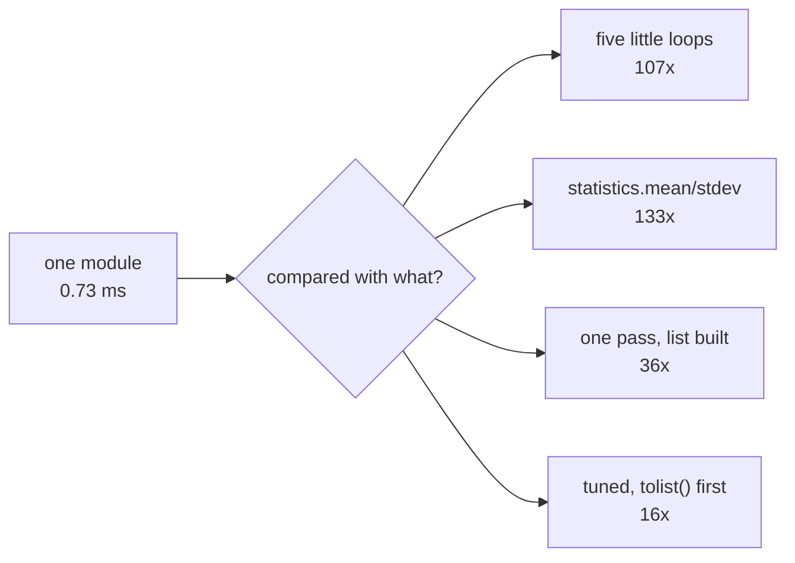

# 4.1 — What "fifty times faster" is measured against

## One-line answer

A speedup is a ratio between two programs, so "the module is fifty times faster" is only a measurement once
you say what the other program was — and the very same module, on the very same data, came out anywhere
from 15 to 133 times faster depending on which loop it was compared with.

---

## The story

Two people share the flat and the wall chart, and both of them total the month at the end of it.

One of them has always done it standing at the wall, reading the numbers off and adding them up in their
head, going back to the start each time they need a different total. They found a better way last week and
they are pleased about it: "It's ten times quicker now."

The other one has been doing it at the table with a calculator for months. They try the better way and it
is barely quicker at all — a few seconds, maybe.

Neither of them is lying. "Ten times quicker" was a true and useful statement about the speaker's own
previous evening. It just was not a statement about the new method, which is what the other person heard.
The missing words were "than the way I used to do it", and those words are the whole of the difference
between a claim somebody can check and a claim that sounds good.

---

## The idea in plain language

A **baseline** is the program you are comparing against. A **speedup** is the baseline's time divided by
the new program's time. That is the whole definition, and it makes the important thing obvious: **a speedup
is a fact about two programs, and quoting it without naming both is quoting half a measurement.**

Phase 3's gate asks for a stats module that beats a loop by fifty times or more. "A loop" is not one
program. Here are four of them, all of which a real person has written, all of which produce exactly the
same five numbers from the same array:

- **Five separate loops** — one pass over the array for the count, one for the total, one for the squared
  differences, one for the smallest, one for the largest. This is what the code looks like before anybody
  has thought about it, because each statistic gets written when it is needed.
- **The standard library** — build a list of the recorded readings, then call `statistics.mean` and
  `statistics.stdev` on it. This is what Python's own documentation points you at.
- **One pass, building a list** — walk the array once, collect the readings into a list, then reduce the
  list. Someone who has noticed the five passes and fixed them.
- **A tuned loop** — call `.tolist()` first so the inner loop is over Python floats rather than NumPy
  scalars, bind `math.isnan` to a local name, and do everything in one walk. Someone who knows where
  Python's overheads are.

Against those four, the same module came out 107, 133, 36 and 15 times faster. All four numbers are true.
Only one of them is the one you should quote, and which one depends on a question that is not about
performance at all: **what code is this actually replacing?**

Four things make a baseline honest.

**It is correct.** It produces the same answer. A baseline that skips the missing readings and returns
`nan` is faster and is not a baseline.

**It is representative.** It is the code that exists, or the code a reasonable person would write. Not the
worst code you can imagine.

**It is written in good faith.** You may not add work to it to make your number look better, and the test
for that is simple: would you be happy for the author of the baseline to read your version of it?

**It is named whenever the number is.** "36 times faster than a one-pass Python loop over a NumPy array"
is a sentence somebody can check. "36 times faster" is not.

---

## Why Setu needs it

- **[4.3](4.3-the-number-measured.md)** records this day's gate number, and it records the baseline beside
  it for exactly this reason.
- **[5.2](../05-the-gate/5.2-the-performance-test-in-ci.md)** puts a speed assertion in the test suite,
  which is only meaningful if the baseline is fixed and committed alongside it.
- **[4.4](4.4-the-benchmark-that-lied.md)** is the same idea with the sign flipped: the ways a benchmark
  flatters you without anybody intending it to.
- **Day 24's matmul** made the same comparison honestly — a hand-written triple loop against `@`
  ([Day 24, 3.4](../../../day-24-bits-strings-and-linear-algebra/parts/03-matmul/3.4-the-measured-gap.md)) —
  and that number is large because the baseline is genuinely the algorithm being replaced.
- **Day 100's serving latency** and **Day 190's retrieval** both live or die on a quoted number, and both
  are places where a flattering baseline turns into a promise you cannot keep.

---

## The mechanism

Four baselines and the module, all producing the same five numbers, all timed the same way:

```python
import math
import statistics
import timeit

import numpy as np

from setu import stats


def loop_five_passes(counts: np.ndarray) -> tuple[int, float, float, float, float]:
    """One pass per statistic. What the code looks like before anybody tidies it."""
    rows, cols = counts.shape
    n = 0
    for i in range(rows):
        for j in range(cols):
            if not math.isnan(counts[i, j]):
                n += 1
    total = 0.0
    for i in range(rows):
        for j in range(cols):
            x = counts[i, j]
            if not math.isnan(x):
                total += x
    mean = total / n
    sq = 0.0
    for i in range(rows):
        for j in range(cols):
            x = counts[i, j]
            if not math.isnan(x):
                sq += (x - mean) ** 2
    smallest = math.inf
    largest = -math.inf
    for i in range(rows):
        for j in range(cols):
            x = counts[i, j]
            if not math.isnan(x) and x < smallest:
                smallest = x
    for i in range(rows):
        for j in range(cols):
            x = counts[i, j]
            if not math.isnan(x) and x > largest:
                largest = x
    return n, mean, math.sqrt(sq / (n - 1)), smallest, largest


def stdlib(counts: np.ndarray) -> tuple[int, float, float, float, float]:
    """What Python's own documentation points you at."""
    values = [x for row in counts.tolist() for x in row if not math.isnan(x)]
    return len(values), statistics.mean(values), statistics.stdev(values), min(values), max(values)


def loop_one_pass(counts: np.ndarray) -> tuple[int, float, float, float, float]:
    """Somebody noticed the five passes and fixed them."""
    values = []
    rows, cols = counts.shape
    for i in range(rows):
        for j in range(cols):
            x = counts[i, j]
            if not math.isnan(x):
                values.append(float(x))
    n = len(values)
    total = 0.0
    for x in values:
        total += x
    mean = total / n
    sq = 0.0
    for x in values:
        sq += (x - mean) ** 2
    return n, mean, math.sqrt(sq / (n - 1)), min(values), max(values)


def loop_tuned(counts: np.ndarray) -> tuple[int, float, float, float, float]:
    """Somebody who knows where Python's overheads are."""
    isnan = math.isnan
    values = [x for row in counts.tolist() for x in row if not isnan(x)]
    n = len(values)
    total = 0.0
    smallest = largest = values[0]
    for x in values:
        total += x
        if x < smallest:
            smallest = x
        elif x > largest:
            largest = x
    mean = total / n
    sq = 0.0
    for x in values:
        d = x - mean
        sq += d * d
    return n, mean, math.sqrt(sq / (n - 1)), smallest, largest


def numpy_module(counts: np.ndarray) -> tuple[int, float, float, float, float]:
    s = stats.summarise(counts)
    return s.observed, s.mean, s.std, s.smallest, s.largest


BASELINES = [
    ("loop_five_passes", loop_five_passes),
    ("stdlib_statistics", stdlib),
    ("loop_one_pass", loop_one_pass),
    ("loop_tuned", loop_tuned),
]

rng = np.random.default_rng(20260902)
for size in [100_000, 1_000_000]:
    data = rng.normal(9000, 2000, size).reshape(-1, 100)
    data.reshape(-1)[rng.integers(0, size, size // 100)] = np.nan
    ref = numpy_module(data)
    t_np = min(timeit.repeat(lambda: numpy_module(data), number=1, repeat=5))
    print(f"n = {size:,}")
    print(f"    {'numpy_module':18} {t_np * 1000:9.2f} ms   (the module)")
    for name, fn in BASELINES:
        agrees = np.allclose(fn(data), ref)
        t = min(timeit.repeat(lambda fn=fn: fn(data), number=1, repeat=5))
        print(f"    {name:18} {t * 1000:9.2f} ms   {t / t_np:6.1f}x   agrees={agrees}")
```

**Line by line:**

- `loop_five_passes` walking the array **five times** — and note it indexes `counts[i, j]`, which builds a
  fresh `np.float64` object for every element. Both costs are real and neither is a straw man; it is
  literally how the code comes out when each statistic is added on a different day.
- `stdlib` calling `statistics.mean` and `statistics.stdev` — the standard library's answer to this exact
  question, and therefore the most defensible "before" for somebody who has never used NumPy.
- `loop_one_pass` building `values` once and reducing it four times — the same shape as the module's own
  gather-then-reduce ([3.3](../03-the-module/3.3-one-pass-or-five.md)), written in Python.
- `loop_tuned` calling `counts.tolist()` — this converts the whole array to nested Python lists in C, so
  the inner loop is over plain `float` objects instead of NumPy scalars. That single change is most of the
  gap between this and `loop_one_pass`.
- `isnan = math.isnan` on the line above the comprehension — binding a global to a local name, because
  Python looks up globals through a dictionary on every call and locals by slot.
- `agrees = np.allclose(fn(data), ref)` computed **for every baseline** — a benchmark line with no
  correctness check beside it is a number about two different programs.
- `min(timeit.repeat(...))` rather than the mean — the reason is [4.2](4.2-timeit-honestly.md).
- `lambda fn=fn: fn(data)` with the default argument — without it, every lambda would close over the loop
  variable and all four rows would time the last baseline. This is Python's late-binding closure, and it is
  the single most common way a benchmark loop times the wrong thing.
- Two sizes, not one, because a ratio that changes with size is telling you something and a ratio measured
  at one size cannot.

```text
n = 100,000
    numpy_module            0.73 ms   (the module)
    loop_five_passes       78.47 ms    107.3x   agrees=True
    stdlib_statistics      97.53 ms    133.4x   agrees=True
    loop_one_pass          26.49 ms     36.2x   agrees=True
    loop_tuned             11.45 ms     15.7x   agrees=True
n = 1,000,000
    numpy_module            9.66 ms   (the module)
    loop_five_passes      781.92 ms     81.0x   agrees=True
    stdlib_statistics    1011.44 ms    104.7x   agrees=True
    loop_one_pass         297.94 ms     30.8x   agrees=True
    loop_tuned            143.84 ms     14.9x   agrees=True
```

**Read the last column.** One module, one machine, one dataset, and a range from 14.9 to 133.4. The module
did not change between rows. Only the sentence after the word "than" changed.

Two more things are worth reading out of that table.

**The ratio shrinks as the data grows** — 107 to 81, 36 to 31, 15.7 to 14.9. That is not the loops getting
faster. It is the module getting slower per element, because a million `float64` values are eight megabytes
and no longer fit in cache, so several of the module's passes start waiting on memory. A speedup quoted
without its size is missing a second piece of information.

**The four baselines are separated by a factor of nine among themselves** — `loop_tuned` is nearly nine
times faster than `stdlib_statistics`, and both are pure Python. Most of the spread in the last column is
about Python, not about NumPy.



---

## When it breaks

**A baseline that does not compute the same thing:**

```python
import math
import timeit

import numpy as np

from setu import stats


def loop_forgot_the_gaps(counts: np.ndarray) -> tuple[int, float, float, float, float]:
    """Same shape as the real loop, but it never checks for a missing reading."""
    values = []
    rows, cols = counts.shape
    for i in range(rows):
        for j in range(cols):
            values.append(float(counts[i, j]))
    n = len(values)
    mean = sum(values) / n
    sq = sum((x - mean) ** 2 for x in values)
    return n, mean, math.sqrt(sq / (n - 1)), min(values), max(values)


rng = np.random.default_rng(20260902)
data = rng.normal(9000, 2000, 100_000).reshape(-1, 100)
data.reshape(-1)[rng.integers(0, data.size, 1_000)] = np.nan
s = stats.summarise(data)
ref = (s.observed, s.mean, s.std, s.smallest, s.largest)
t_np = min(timeit.repeat(lambda: stats.summarise(data), number=1, repeat=5))

got = loop_forgot_the_gaps(data)
t = min(timeit.repeat(lambda: loop_forgot_the_gaps(data), number=1, repeat=5))
print("module :", tuple(round(v, 2) for v in ref))
print("forgot :", tuple(round(v, 2) for v in got))
print(f"forgot the gaps  {t * 1000:8.2f} ms  {t / t_np:6.1f}x  agrees={np.allclose(got, ref)}")
```

```text
module : (99006, 9005.13, 2001.56, 412.76, 17692.93)
forgot : (100000, nan, nan, 412.76, 17692.93)
forgot the gaps     19.79 ms    28.5x  agrees=False
```

**What it means.** The baseline dropped the `isnan` check, so it is doing less work per element and its
time went down — and its answers went with it. The count is 100,000 instead of 99,006, and the mean and
standard deviation are `nan`, because one missing value poisons a sum
([Day 23, 2.5](../../../day-23-ufuncs-and-statistics/parts/02-statistics/2.5-the-nan-family.md)).

Look at `smallest` though: `412.76`, a perfectly ordinary-looking number, because Python's `min` compares
pairwise and every comparison against `nan` is false, so the `nan` simply loses every comparison it is in.
**Two of the five outputs were visibly broken and two were quietly wrong**, and only the `agrees=False`
caught it.

**The smallest fix** is the one already in the code above: compute `agrees` on the same line you compute
the time, and refuse to print a ratio when it is `False`.

**A baseline nobody would ever write:**

```python
def loop_straw_man(counts: np.ndarray) -> tuple[int, float, float, float, float]:
    """A 'baseline' with insert(0, x) instead of append. Quadratic, and nobody writes it."""
    values = []
    rows, cols = counts.shape
    for i in range(rows):
        for j in range(cols):
            x = counts[i, j]
            if not math.isnan(x):
                values.insert(0, float(x))
    n = len(values)
    total = 0.0
    for x in values:
        total += x
    mean = total / n
    sq = 0.0
    for x in values:
        sq += (x - mean) ** 2
    return n, mean, math.sqrt(sq / (n - 1)), min(values), max(values)
```

```text
straw man         1430.44 ms  2058.8x  agrees=True
```

**What it means.** One character changed — `append` became `insert(0, ...)` — and the module is now two
thousand times faster. Every `insert(0, x)` shifts the entire list along by one slot, so building a
hundred thousand entries costs about five billion moves instead of a hundred thousand.

**This baseline is correct.** `agrees=True`. It produces exactly the right five numbers, and the benchmark
would sail past any correctness check you attached to it. That is the point: **the correctness test does not
catch a dishonest baseline, because a dishonest baseline is not incorrect — it is unrepresentative.** The
only check for this one is a person reading the code and asking whether anyone would write it, which is why
the baseline gets committed to the repository next to the module rather than living in a notebook.

**The smallest fix** is not a code change. It is committing the baseline, so that "would the author of this
be happy with how I wrote it" is a question somebody can actually answer.

---

## In production

**What a professional writes instead of the teaching version.** The number never travels alone. A quoted
speedup carries five things, and a benchmark that does not record all five gets rerun by whoever reads it:

```text
summarise() vs loop_one_pass   36.2x
  baseline   lab/baselines.py::loop_one_pass, committed at 4a1c0e2
  data       1e5 float64, 1% missing, rng seed 20260902
  machine    (uname / CPU model / RAM)
  versions   numpy==2.5.2, python==3.12.12
  method     min of 5 timeit.repeat runs, number=1
```

**Line by line:**

- The baseline **as a file path and a commit** — not as a description. "A Python loop" is not reproducible;
  `lab/baselines.py::loop_one_pass` at a named commit is.
- The data described precisely enough to regenerate, **seed included** — a benchmark on unspecified random
  data is a benchmark somebody has to take your word for
  ([Day 20, 4.2](../../../day-20-arrays-and-dtypes/parts/04-random/4.2-the-seed-is-part-of-the-result.md)).
- The **fraction missing** stated, because it changes the answer: at 1% missing the gather copies almost
  everything, and at 90% missing it copies almost nothing
  ([3.3](../03-the-module/3.3-one-pass-or-five.md)).
- The machine, because a ratio measured on a laptop with a hot cache is not the ratio in a container with a
  half-core CPU limit.
- The library versions, because next year's NumPy is not this year's.
- The method — `min` of five repeats — so a reader knows you did not quote a mean over a noisy run
  ([4.2](4.2-timeit-honestly.md)).

**What changes at scale.** The baseline that matters stops being "a Python loop" almost immediately.
Once the loop is gone, the next comparison is against another vectorised implementation, or against the
same code on more cores, or against last month's version of your own code. Speedups compound
multiplicatively and shrink fast: the second 10× is much harder than the first, and by the third the
honest baseline is "us, last quarter". Teams that keep a committed baseline file can answer "faster than
what" for ever; teams that quoted one number against a loop in 2023 cannot answer it at all.

**The failure that only appears with real data.** A team advertised a 40× speedup for a feature-computation
rewrite, measured against the old code on a benchmark dataset with no missing values. Production data was
about a third missing. The new implementation gathered the surviving values into a copy; the old one had
skipped them in place. On real data the copy was a third of the size the benchmark had suggested, the
comparison shifted, and the observed speedup in production was about 9×. Nothing was wrong with either
implementation and nothing was wrong with the measurement. The benchmark's data was wrong, and the missing
line in the record was "1% missing".

**The review comment a senior engineer leaves.** *"Fifty times faster than what? I can find four Python
loops that give this module anything from 15× to 130×. Commit the baseline you used, put the seed and the
missing-fraction in the docstring, and quote the number as `36x vs loop_one_pass` — otherwise this
number will be repeated in a design doc next month with no way to check it."*

**The interview question.** *"You rewrote something and it is fifty times faster. How do I know that is
real?"* The answer they are listening for is that a speedup is a ratio and you have to hand over both
halves: what the baseline was, that it produced the same output, that it was the code actually being
replaced rather than a version you wrote to lose, and how the timing was taken. The strongest version of
the answer adds the honest caveat before they ask for it — *"against a tuned one-pass loop it is only 15×,
and 15× is the number I would put in a design document, because that is the code somebody might actually
have written."*

---

## Check yourself

**Run this now.** Time the module against just two of the baselines, and print the ratio with its name
attached:

```python
import timeit

import numpy as np

from setu import stats

rng = np.random.default_rng(20260902)
data = rng.normal(9000, 2000, 100_000).reshape(-1, 100)
data.reshape(-1)[rng.integers(0, data.size, 1_000)] = np.nan
t_np = min(timeit.repeat(lambda: stats.summarise(data), number=1, repeat=5))
print(f"summarise: {t_np * 1000:.2f} ms")
print("now write ONE baseline yourself, time it the same way, and print:")
print("    f'{ratio:.1f}x vs <the name of your baseline function>'")
```

**Answer out loud, without scrolling up:**

1. The same module measured 15.7× and 133.4× on the same data. What changed between those two numbers?
2. `loop_straw_man` passed the correctness check and gave a 2058× speedup. What check would have caught it,
   and why can it not be automated?
3. The ratio fell from 107× to 81× when the data grew from 100,000 to 1,000,000 readings. Which side of the
   comparison got slower, and why?

---

**Next:** [4.2 — timing it honestly](4.2-timeit-honestly.md).
