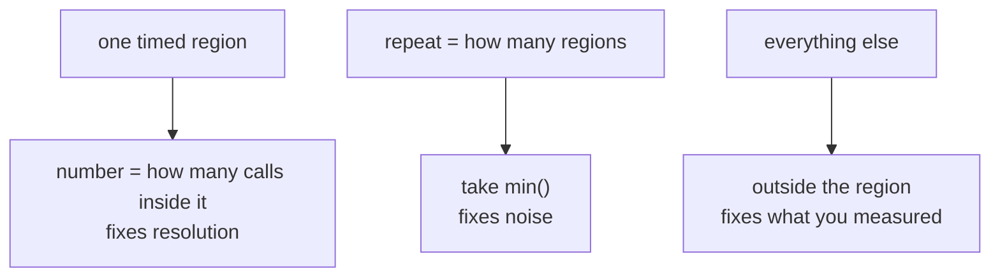

# 4.2 — `timeit` honestly — `min`, not mean, and what got into the timed region

## One-line answer

Take the **fastest** of several runs, not the average, keep everything that is not the thing you are timing
outside the timed region, and check that the timed region is long enough for the clock to see it — those
three rules are most of the difference between a timing and a guess.

---

## The story

Somebody wants to know how long it takes to walk to the shop, so they time it. Nine minutes.

They do it again the next day and it is twelve, because the lights at the crossing were against them. The
day after that it is fifteen, because a neighbour stopped them on the corner and wanted to talk about the
bins. Then nine again. Then eleven.

Now: which number do they tell somebody who asks how far the shop is?

The average of those five is a little over eleven minutes, and it is a number about the neighbour and the
traffic lights as much as about the walk. The fastest is nine, and nine is the walk. Nothing that happened
on any of those five mornings could have made the walk shorter than it really is. Plenty of things made it
longer.

So the smallest number is the one that describes the walk, and the gap between the smallest and the rest
describes the street.

---

## The idea in plain language

Timing code has exactly the same shape. Your machine is running an operating system, a browser, an editor
and whatever else, and every one of them can take the processor away from your benchmark for a moment.
None of them can give it back extra speed.

That gives the first rule, and Python's own documentation states it plainly: *"the lowest value gives a
lower bound for how fast your machine can run the given code snippet; higher values in the result vector
are typically not caused by variability in Python's speed, but by other processes interfering with your
timing accuracy. So the `min()` of the result is probably the only number you should be interested in"*
(Python 3.12 standard library reference, `timeit`,
<https://docs.python.org/3/library/timeit.html>).

**Rule one: take the minimum of several runs, not the mean.**

The second rule is about what is inside the stopwatch. If you generate the test data inside the timed
region, you have timed the data generation as well, and it can easily be most of what you measured.

**Rule two: everything that is not the thing being measured happens outside the timed region.**

The third rule is about resolution. The clock has a smallest unit it can see, and calling a function once
has a fixed cost of its own. Time something that takes a few hundred nanoseconds once, and most of what
you measure is the measuring.

**Rule three: the timed region must be long enough to be worth timing.** `timeit` gives you `number=` for
exactly this — it runs the snippet `number` times and divides.

Two terms, because they are the two knobs and people mix them up. **`number`** is how many times the
snippet runs inside one timed region; the result is divided by it, so this is the resolution knob.
**`repeat`** is how many separate timed regions you get back, as a list; this is the noise knob, and it is
what you take the `min` of. The defaults are `number=1000000` and `repeat=5`.

One more thing `timeit` does that is worth knowing rather than discovering: it turns the garbage collector
off during timing, *"to make independent timings more comparable"*, and the same page tells you how to turn
it back on with `gc.enable()` in the setup string. For code that allocates a lot, the version with the
collector running is the one that resembles production.

---

## Why Setu needs it

- **[4.3](4.3-the-number-measured.md)** is the gate's number, and it is measured with these three rules.
- **[5.2](../05-the-gate/5.2-the-performance-test-in-ci.md)** asserts a ratio in a test, which is only
  possible because `min`-of-repeats is stable enough to compare against a threshold.
- **[4.4](4.4-the-benchmark-that-lied.md)** collects the ways a benchmark comes out flattering even when
  all three rules are followed.
- **Day 24's matmul gap** used the same method
  ([Day 24, 3.4](../../../day-24-bits-strings-and-linear-algebra/parts/03-matmul/3.4-the-measured-gap.md)).
- **Day 100's latency budget** and **Day 190's retrieval timing** are the same tool against a service
  instead of a function, and there the noise is a network rather than a neighbour.

---

## The mechanism

### Rule one — the spread is real, and the minimum is the signal

```python
import statistics as st
import timeit

import numpy as np

from setu import stats

rng = np.random.default_rng(20260902)
data = rng.normal(9000, 2000, 1_000_000).reshape(-1, 100)
data.reshape(-1)[rng.integers(0, data.size, 10_000)] = np.nan

runs = timeit.repeat(lambda: stats.summarise(data), number=1, repeat=15)
ms = [r * 1000 for r in runs]
print("all 15 runs, ms:", " ".join(f"{v:.2f}" for v in ms))
print(
    f"min {min(ms):7.2f}   mean {st.mean(ms):7.2f}   max {max(ms):7.2f}   max/min {max(ms) / min(ms):.2f}x"
)
```

**Line by line:**

- `timeit.repeat(..., repeat=15)` returning a **list of fifteen timings**, one per timed region — the raw
  material, before anybody summarises it.
- `number=1` here because `summarise` on a million readings already takes about ten milliseconds, which is
  far above the clock's resolution. On a microsecond-scale function this would be wrong; see rule three.
- Printing **all fifteen** rather than a summary — the spread is the interesting part and it disappears the
  moment you reduce it to one number.
- `min`, `mean` and `max` printed together **so the argument can be checked** rather than asserted.

```text
all 15 runs, ms: 10.73 10.65 11.50 10.38 13.41 12.30 10.80 11.23 11.60 10.04 10.30 10.02 12.52 10.52 10.42
min   10.02   mean   11.09   max   13.41   max/min 1.34x
```

**Read the fifteen numbers.** They cluster just above ten and then there are a few stragglers — 13.41,
12.52, 12.30. That is the shape you should expect: a floor, and a tail above it. There is no tail *below*
the floor, because there is nothing that can make the code faster than it is.

The mean is 11.09 and the minimum is 10.02, so quoting the mean would report the module as ten per cent
slower than it is, and the size of that error depends on what else the machine was doing. Two people
benchmarking the same code on the same machine would get different means and the same minimum.

### Rule two — what got inside the stopwatch

```python
with_setup = min(
    timeit.repeat(
        lambda: stats.summarise(rng.normal(9000, 2000, 1_000_000).reshape(-1, 100)),
        number=1,
        repeat=5,
    )
)
without = min(timeit.repeat(lambda: stats.summarise(data), number=1, repeat=5))
print(f"generate + summarise {with_setup * 1000:8.2f} ms")
print(f"summarise only       {without * 1000:8.2f} ms")
print(f"the data generation was {(with_setup - without) / with_setup:.0%} of what you measured")
```

**Line by line:**

- The first lambda calling `rng.normal(...)` **inside** the timed region — the mistake, written the way it
  actually happens, which is by putting the whole expression on one line because it reads nicely.
- The second lambda using `data`, which was generated once, above, outside everything.
- The difference expressed as a **percentage of the wrong measurement**, because that is the number that
  tells you how badly you were misled.

```text
generate + summarise    23.22 ms
summarise only          10.43 ms
the data generation was 55% of what you measured
```

**More than half of the first measurement was generating random numbers.** If you had used that figure in
a speedup, the module would have looked less than half as fast as it is — and the mistake is invisible,
because 23.22 ms is a perfectly reasonable-looking number.

The general form: **anything inside the lambda is being timed.** Reading a file, building a dataframe,
converting a list to an array, importing a module on first use. Move it out, do it once, and pass the
result in.

### Rule three — the floor of the clock

```python
small = np.arange(100.0)
one = min(timeit.repeat(lambda: small.sum(), number=1, repeat=20))
many = min(timeit.repeat(lambda: small.sum(), number=100_000, repeat=5)) / 100_000
nothing = min(timeit.repeat(lambda: None, number=1, repeat=20))
print(f"number=1        {one * 1e9:9.0f} ns")
print(f"number=100000   {many * 1e9:9.0f} ns")
print(f"timing 'None'   {nothing * 1e9:9.0f} ns   <- the floor")
```

**Line by line:**

- `small = np.arange(100.0)` — a hundred elements, so `.sum()` takes well under a microsecond and the
  problem is visible.
- `number=100_000` on the second measurement, then **dividing by 100 000** — one timed region containing a
  hundred thousand calls, which puts the region up in the milliseconds where the clock is comfortable.
- `lambda: None` timed the same way — this measures the harness itself: the call, the loop, the clock read.
  It is the floor below which no measurement means anything, and every benchmark should know its own.

```text
number=1             1200 ns
number=100000         681 ns
timing 'None'         100 ns   <- the floor
```

**The same call measured 1200 ns and 681 ns.** The second is the right one. The first is the operation plus
one call's worth of harness overhead plus one clock read, and at this scale that is nearly half the number.
The `lambda: None` row is why: a hundred nanoseconds of the measurement is not the code at all.

**The rule of thumb:** choose `number` so that one timed region takes at least a few milliseconds, which is
several thousand times the floor. `summarise` on a million readings needs `number=1`; `small.sum()` needs
`number=100_000`.



---

## When it breaks

**The lambda that timed the wrong function:**

```python
import timeit

import numpy as np

from setu import stats


def a(counts: np.ndarray) -> float:
    return stats.summarise(counts).mean


def b(counts: np.ndarray) -> float:
    return float(np.nanmean(counts))


timers = []
for name, fn in [("a", a), ("b", b)]:
    timers.append((name, lambda: fn(data)))  # BUG: fn is looked up when the lambda runs
for name, t in timers:
    print(f"    {name}: {min(timeit.repeat(t, number=1, repeat=5)) * 1000:.2f} ms")
```

```text
    a: 4.77 ms
    b: 4.76 ms
```

**What it means.** Both rows timed `b`. A Python closure captures the **variable**, not its value, so both
lambdas look up `fn` when they are called, and by then the loop has finished and `fn` is `b`.

**This is the most dangerous output on the day, because it looks like a result.** Two numbers, four
significant figures, agreeing to within a fiftieth of a millisecond — a reader concludes the two
implementations are the same speed, writes that in a document, and nothing about the output suggests
otherwise. There is no error and no warning.

Here is the same loop with the value bound at definition time:

```python
timers = []
for name, fn in [("a", a), ("b", b)]:
    timers.append((name, lambda fn=fn: fn(data)))  # default argument: evaluated now
for name, t in timers:
    print(f"    {name}: {min(timeit.repeat(t, number=1, repeat=5)) * 1000:.2f} ms")
```

```text
    a: 10.09 ms
    b: 4.60 ms
```

**The real answer is that `a` takes more than twice as long as `b`** — which makes sense, because
`summarise` computes five statistics and `np.nanmean` computes one. The broken version reported them as
identical.

**The smallest fix** is the `fn=fn` default argument, which is evaluated once when the lambda is created.
`functools.partial(fn, data)` does the same job and is arguably clearer about the intent.

**The collector that was switched off without you knowing:**

```python
import timeit

off = min(timeit.repeat(lambda: stats.summarise(data), number=1, repeat=7))
on = min(timeit.Timer(lambda: stats.summarise(data), "gc.enable()").repeat(number=1, repeat=7))
print(f"gc disabled (timeit default) {off * 1000:7.2f} ms")
print(f"gc enabled  (like real code) {on * 1000:7.2f} ms")
```

```text
gc disabled (timeit default)    9.50 ms
gc enabled  (like real code)    9.55 ms
```

**What it means.** Here it made almost no difference — half a per cent, which is inside the noise of the
run above. That is the honest result and it is worth reporting as such rather than pretending to a finding.

It made no difference **because of what this code allocates**: a handful of large NumPy arrays. Python's
cyclic garbage collector runs on the count of container objects allocated, and five big arrays are five
objects. Code that allocates a million small Python objects — a list of dicts, a graph of nodes — is the
case where the collector shows up, and there the `timeit` default hides a real cost that production pays.

**The smallest fix** is to know which case you are in, and to add `"gc.enable()"` as the setup string when
your code allocates many small objects. The `timeit` documentation gives exactly that recipe.

---

## In production

**What a professional writes instead of the teaching version.** For anything that matters, the timing
harness stops being three lines in a script and becomes a small function that records what it measured:

```python
import platform
import timeit
from collections.abc import Callable


def measure(fn: Callable[[], object], *, number: int = 1, repeat: int = 7) -> dict[str, object]:
    """Time `fn` and return the number together with everything needed to trust it."""
    runs = timeit.repeat(fn, number=number, repeat=repeat)
    per_call = [r / number for r in runs]
    return {
        "best_s": min(per_call),
        "median_s": sorted(per_call)[len(per_call) // 2],
        "worst_s": max(per_call),
        "spread": max(per_call) / min(per_call),
        "number": number,
        "repeat": repeat,
        "python": platform.python_version(),
        "machine": platform.processor() or platform.machine(),
    }
```

**Line by line:**

- `min` returned as `best_s` and **`max` and the spread returned alongside it** — a spread of 1.34 is a
  usable measurement and a spread of 8 means the machine was busy and the number should be thrown away.
  Reporting only the minimum hides the evidence that the minimum is trustworthy.
- The **median** as well, because when the spread is large the median tells you what a caller will
  typically experience, while the minimum tells you what the code is capable of. Both are real questions
  and they have different answers.
- Dividing by `number` inside the function so the caller always gets a per-call figure and cannot forget.
- `platform` fields captured automatically — the alternative is remembering to write them down, and nobody
  does.
- `fn` typed as a zero-argument callable, which forces the caller to close over the data outside — rule two
  enforced by the signature rather than by discipline.

**What changes at scale.** `timeit` measures a function on an idle machine. A service under load is a
different question, and past a certain point the tool changes: you want a distribution rather than a
minimum, and you want the tail. The p99 is what your users feel and the minimum is what your code is
capable of, and the two can differ by a factor of fifty once a garbage collector, a network, a lock or a
noisy neighbour is in the picture. **The minimum is the right summary for a pure function on a quiet
machine, and the wrong summary for almost anything else.** Day 100's latency work is where that switch
happens.

The other thing that changes is that the machine stops being yours. A benchmark run in CI shares a host
with other jobs, so the spread widens and a threshold tuned on a laptop becomes flaky. That is the whole
subject of [5.2](../05-the-gate/5.2-the-performance-test-in-ci.md).

**The failure that only appears with real data.** A team benchmarked a parsing routine at 40 µs per record
and sized a service for 25,000 records a second. In production it managed about 6,000. The benchmark had
looped over the same record, which stayed in cache and whose branch pattern the processor learned
perfectly after the first few thousand iterations. Real records arrived from a socket, missed cache every
time, and branched unpredictably. Nothing about the timing method was wrong — `min` of repeats, data
generated outside, `number` chosen sensibly. The input was the problem: **one record, measured a hundred
thousand times, is a measurement of one record.**

**The review comment a senior engineer leaves.** *"`np.mean(runs)` — take `min(runs)` instead; the high
values are your laptop, not the code. And `rng.normal(...)` is inside the lambda, so half of what you
measured is the random number generator. Also print the spread: if `max/min` is above about two, rerun it
on a quiet machine."*

**The interview question.** *"How would you measure whether your change made this function faster?"* Say
`timeit.repeat` and the minimum, and say why the minimum: interference only ever adds time. Then say what
you keep outside the timed region, and how you pick `number` so the region is long enough for the clock.
The answer that stands out adds the limit before being asked — *"that gives me the function's floor on a
quiet machine, which is the right number for a library function and the wrong one for a service; for a
service I would want a distribution and the p99, not a minimum."*

---

## Check yourself

**Run this now.** Measure the same call three ways and see the three rules move the number:

```python
import statistics as st
import timeit

import numpy as np

from setu import stats

rng = np.random.default_rng(20260902)
data = rng.normal(9000, 2000, 1_000_000).reshape(-1, 100)
data.reshape(-1)[rng.integers(0, data.size, 10_000)] = np.nan

runs = timeit.repeat(lambda: stats.summarise(data), number=1, repeat=15)
print(f"min  {min(runs) * 1000:6.2f} ms")
print(f"mean {st.mean(runs) * 1000:6.2f} ms   <- how much higher, and why?")
print(f"spread {max(runs) / min(runs):.2f}x   <- above 2 means try again on a quiet machine")
```

**Answer out loud, without scrolling up:**

1. Why is the minimum of fifteen runs a better estimate than the mean, in one sentence about what
   interference can and cannot do?
2. `number` and `repeat` — which one fixes resolution and which one fixes noise?
3. A benchmark loop printed two timings that agreed to three decimal places. What is the first thing you
   should suspect, and what one-word change fixes it?

---

**Next:** [4.3 — the number, measured](4.3-the-number-measured.md).
