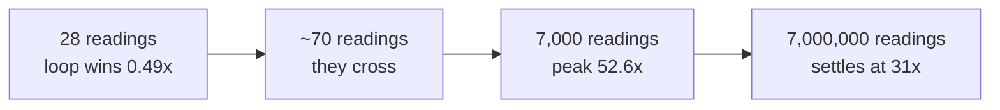

# 4.3 — The number, measured — 56× and the sizes where it is not

## One-line answer

On seven thousand readings the module is 56 times faster than the one-pass Python loop, which clears the
gate — and on the twenty-eight readings of the month itself the loop wins, which is the more interesting
half of the same measurement.

---

## The story

Somebody has been totalling the month by hand for a year, and they have just been shown a faster way.

For the wall chart it is not faster. Twenty-eight numbers is not enough work for the new method to be worth
setting up; by the time you have written the numbers out in a form the new method wants, the old way has
finished. The person who has been doing it by hand at the kitchen table is right to keep doing it by hand.

Then the same person is asked to do it for the whole building — thirty flats, a year each — and the old way
would take an evening. Now the new method finishes before they have poured the tea.

The method did not change between those two jobs. The job changed. And the useful thing to know about a
faster way is not that it is faster, but **where it starts being faster**, because below that point using
it is a mistake and above it not using it is.

---

## The idea in plain language

The gate for this phase is a stats module that beats a loop by fifty times or more. This part is where that
claim gets measured and written down, and it is written down in a particular form: **a number, its
baseline, its data, and the sizes at which it is different.**

The whole answer is a curve, not a number. Vectorised code has a fixed cost that a loop does not: NumPy has
to work out shapes, dtypes and strides, allocate an output array and dispatch into compiled code, and none
of that depends on how much data there is. A Python loop has almost no fixed cost and a large per-element
cost. So one has a high floor and a shallow slope, the other a low floor and a steep slope, and they cross.

Three regions follow, and the module lives in all three at different times.

**Below the crossing.** The array is so small that NumPy's fixed cost is most of the work. The loop is
genuinely faster. For the month's twenty-eight readings this is where you are.

**Just above the crossing.** The per-element cost dominates and the fixed cost has been paid once. This is
where the ratio is at its highest, because the data still fits in the processor's fast cache and NumPy is
doing nothing but arithmetic.

**Far above the crossing.** The data no longer fits in cache. NumPy's passes start waiting on memory
instead of on arithmetic, so the ratio comes back down and settles. It does not go away — it just stops
being spectacular.

**The gate's number is taken at a stated size against a stated baseline.** This one is 56× at seven
thousand readings against `loop_one_pass` from [4.1](4.1-what-fifty-times-is-against.md).

---

## Why Setu needs it

- **[5.1](../05-the-gate/5.1-the-eval.md)** is the gate's correctness test; this is its speed evidence, and
  the gate needs both.
- **[5.2](../05-the-gate/5.2-the-performance-test-in-ci.md)** turns this number into an assertion that runs
  on every commit, and it can only do that because the size and baseline are pinned here.
- **[5.3](../05-the-gate/5.3-the-phase-closed.md)** is where the phase closes on this evidence.
- **[3.3](../03-the-module/3.3-one-pass-or-five.md)** made the gather-then-reduce decision; the breakdown
  below is where you can see what that decision cost and bought.
- **Day 41's training loop** and **Day 190's retrieval** both have a crossing point of their own, and the
  habit of finding it — rather than assuming the vectorised path always wins — starts here.

---

## The mechanism

### The curve

```python
import math
import timeit

import numpy as np

from setu import stats


def loop_one_pass(counts: np.ndarray) -> tuple[int, float, float, float, float]:
    values = []
    rows, cols = counts.shape
    for i in range(rows):
        for j in range(cols):
            x = counts[i, j]
            if not math.isnan(x):
                values.append(float(x))
    n = len(values)
    total = 0.0
    for x in values:
        total += x
    mean = total / n
    sq = 0.0
    for x in values:
        sq += (x - mean) ** 2
    return n, mean, math.sqrt(sq / (n - 1)), min(values), max(values)


def numpy_module(counts: np.ndarray) -> tuple[int, float, float, float, float]:
    s = stats.summarise(counts)
    return s.observed, s.mean, s.std, s.smallest, s.largest


rng = np.random.default_rng(20260902)
print(f"{'readings':>12}  {'loop_one_pass':>14}  {'summarise':>12}  {'ratio':>8}")
for size in [28, 70, 140, 700, 7_000, 70_000, 700_000, 7_000_000]:
    data = rng.normal(9000, 2000, size).reshape(-1, 7)
    data.reshape(-1)[rng.integers(0, size, max(1, size // 100))] = np.nan
    n = 1 if size >= 100_000 else max(1, 20_000 // size)
    t_np = min(timeit.repeat(lambda: numpy_module(data), number=n, repeat=7)) / n
    t_lp = min(timeit.repeat(lambda: loop_one_pass(data), number=n, repeat=7)) / n
    print(f"{size:>12,}  {t_lp * 1e6:>12.1f} us  {t_np * 1e6:>10.1f} us  {t_lp / t_np:>7.2f}x")
```

**Line by line:**

- Sizes that are all **multiples of seven** — so every array is a whole number of weeks and `reshape(-1, 7)`
  works at every size. 28 is the month from every other part of this day.
- `max(1, size // 100)` missing values — one per cent at every size, so the fraction is held constant while
  the size changes. Changing two things at once produces a curve you cannot read.
- `n = max(1, 20_000 // size)` — `number` scaled so that a timed region stays in the millisecond range at
  every size, which is rule three from [4.2](4.2-timeit-honestly.md). Without it the smallest sizes would be
  measuring the harness.
- `min(timeit.repeat(...)) / n` — the minimum of seven regions, divided by `number` to get a per-call
  figure.
- Both functions timed **in the same loop iteration on the same array**, so no difference in machine state
  between them can be mistaken for a difference between them.

```text
    readings   loop_one_pass     summarise     ratio
          28           8.3 us        16.9 us     0.49x
          70          20.0 us        16.7 us     1.19x
         140          39.9 us        17.3 us     2.31x
         700         192.1 us        21.3 us     9.03x
       7,000        1903.6 us        36.2 us    52.59x
      70,000       19123.6 us       528.0 us    36.22x
     700,000      213212.0 us      6570.7 us    32.45x
   7,000,000     2169622.3 us      69361.4 us    31.28x
```

**Read the `summarise` column first.** From 28 readings to 700 it barely moves: 16.9, 16.7, 17.3, 21.3
microseconds. **That is the fixed cost** — checking the dtype, reshaping, dispatching six NumPy calls — and
for the first few hundred readings it is nearly all of the time. The loop's column over the same range goes
from 8.3 to 192.1, because the loop pays per element and nothing else.

They cross between 28 and 70 readings. **On the month itself the loop is twice as fast**, and that is not a
flaw in the module; it is what a fixed cost means.

Then the ratio climbs to 52.59× at seven thousand and comes back down to about 31× and stays there. The
peak is where the working set still fits in the processor's fast cache; past that, several of the module's
passes are limited by memory bandwidth rather than by arithmetic, and the loop — which was never anywhere
near memory-limited — loses less.



### The gate's number, with everything needed to check it

```python
import platform
import timeit

import numpy as np

from setu import stats

rng = np.random.default_rng(20260902)
size = 7_000
data = rng.normal(9000, 2000, size).reshape(-1, 7)
data.reshape(-1)[rng.integers(0, size, size // 100)] = np.nan
ref = numpy_module(data)
n = 50
runs = timeit.repeat(lambda: numpy_module(data), number=n, repeat=9)
t_np = min(runs) / n
print(f"summarise            {t_np * 1e6:9.1f} us   spread {max(runs) / min(runs):.2f}x")
for name, fn in BASELINES:  # the four from part 4.1
    r = timeit.repeat(lambda fn=fn: fn(data), number=n, repeat=9)
    t = min(r) / n
    print(
        f"  vs {name:18} {t * 1e6:9.1f} us   {t / t_np:6.1f}x   agrees={np.allclose(fn(data), ref)}"
    )
print()
print(f"numpy {np.__version__} | python {platform.python_version()} | {platform.processor()}")
```

**Line by line:**

- `size = 7_000` **stated in the code**, not chosen at the prompt — the size is part of the claim, so it is
  part of the file.
- `n = 50` and `repeat=9` — 36 microseconds per call is close enough to the harness floor
  ([4.2](4.2-timeit-honestly.md)) that a single call would be measuring the wrapper, so fifty go inside one
  region.
- `spread {max(runs)/min(runs)}` printed — the evidence that the minimum is trustworthy. Anything much
  above two and the run gets thrown away.
- **All four baselines**, not the best one — because the honest record of a speedup includes the baseline
  that flatters you least.
- `agrees=` on every row, from [4.1](4.1-what-fifty-times-is-against.md).
- The last line printing NumPy's version, Python's version and the processor, because a ratio without them
  cannot be reproduced next year.

```text
summarise                 35.9 us   spread 1.59x
  vs loop_five_passes      5978.3 us    166.5x   agrees=True
  vs stdlib_statistics     6927.1 us    192.9x   agrees=True
  vs loop_one_pass         2010.9 us     56.0x   agrees=True
  vs loop_tuned             793.7 us     22.1x   agrees=True

numpy 2.5.2 | python 3.12.12 | Intel64 Family 6 Model 140 Stepping 1, GenuineIntel
```

**The gate number is the third row: 56.0× against `loop_one_pass`, at seven thousand readings, one per cent
missing, seed 20260902.** That clears fifty and the gate is met.

The fourth row is in the record on purpose. Against a loop written by somebody who knows to call `.tolist()`
first, the module is 22.1× faster, not 56×. Both are true, and a design document that quotes 56× without
the 22.1× beside it has told half the story
([4.1](4.1-what-fifty-times-is-against.md)).

### Where the module spends its time

Having a number is not the same as knowing what produced it. This times each step of `summarise` on its own,
at 700,000 readings:

```python
rng = np.random.default_rng(20260902)
size = 700_000
data = rng.normal(9000, 2000, size).reshape(-1, 7)
data.reshape(-1)[rng.integers(0, size, size // 100)] = np.nan
flat = data.reshape(-1)
live = ~np.isnan(flat)
good = flat[live]
steps = [
    ("reshape(-1)", lambda: data.reshape(-1)),
    ("~np.isnan(flat)", lambda: ~np.isnan(flat)),
    ("count_nonzero(live)", lambda: int(np.count_nonzero(live))),
    ("flat[live]  the copy", lambda: flat[live]),
    ("good.mean()", lambda: float(good.mean(dtype=np.float64))),
    ("good.std(ddof=1)", lambda: float(good.std(ddof=1, dtype=np.float64))),
    ("good.min()", lambda: float(good.min())),
    ("good.max()", lambda: float(good.max())),
]
rows = [(name, min(timeit.repeat(fn, number=1, repeat=9))) for name, fn in steps]
total = sum(t for _, t in rows)
whole = min(timeit.repeat(lambda: stats.summarise(data), number=1, repeat=9))
for name, t in rows:
    print(f"    {name:22} {t * 1000:7.3f} ms   {t / total:5.1%}")
print(f"    {'sum of the steps':22} {total * 1000:7.3f} ms")
print(f"    {'summarise() itself':22} {whole * 1000:7.3f} ms")
```

**Line by line:**

- `flat`, `live` and `good` computed **once above the loop** — each step is timed with its inputs already
  built, which is rule two.
- Each lambda reproducing exactly the line from `summarise`, `dtype=` and `ddof=` included, so the numbers
  describe the module rather than a simplified version of it.
- The **sum of the steps printed next to the whole function** — this is the check on the breakdown. If they
  disagree wildly, the breakdown is not measuring the same work.

```text
    reshape(-1)              0.000 ms    0.0%
    ~np.isnan(flat)          0.615 ms   10.7%
    count_nonzero(live)      0.024 ms    0.4%
    flat[live]  the copy     1.565 ms   27.2%
    good.mean()              0.316 ms    5.5%
    good.std(ddof=1)         2.954 ms   51.3%
    good.min()               0.142 ms    2.5%
    good.max()               0.142 ms    2.5%
    sum of the steps         5.758 ms
    summarise() itself       6.575 ms
```

**Three things to take from that.**

`reshape(-1)` costs nothing at all — 0.000 ms — which is the strongest possible statement that it is a view
and not a copy ([2.1](../02-the-bug/2.1-ravel-changed-it-flatten-did-not.md)). A copy of 700,000 floats
could not be free.

**`std` is half the function.** It is more than nine times the cost of `mean`, because it walks the data
again to accumulate squared deviations after the mean is known. If this module ever needs to be faster, that
is the line to attack — and `mean` is already computed, so a single pass computing both is the obvious move.
Nowhere else is worth touching.

**The copy is 27%,** which is the price paid in [3.3](../03-the-module/3.3-one-pass-or-five.md) for four
cheap reductions afterwards. Seeing it as a quarter of the function rather than as an invisible line is the
whole reason to break the timing down.

The sum of the steps is 5.758 ms and the function itself is 6.575 ms — a gap of about fourteen per cent.
That gap is real and expected: each step measured on its own gets a cache warmed by its own previous
repeat, while the function runs them in sequence over the same large arrays. **A breakdown adds up to a bit
less than the whole, and if it adds up to much more you have measured something twice.**

---

## When it breaks

**Quoting the peak of the curve:**

The curve above peaks at 52.59× and settles at 31.28×. Both numbers came out of the same run. Quoting the
peak is not falsifying anything — it is a real measurement at a real size — and it is still misleading,
because the size it was measured at was chosen after seeing the answer.

```text
       7,000        1903.6 us        36.2 us    52.59x     <- quoted
   7,000,000      2169622.3 us     69361.4 us    31.28x     <- not quoted
```

**What it means.** Whoever reads "52×" will apply it to their own data, which will not be seven thousand
readings. If their arrays are millions of rows they will plan for a 52× improvement and get 31×, and the
person who quoted the number will not be able to say they were wrong.

**The smallest fix** is procedural, not technical: **pick the size before running the benchmark, and pick
it because it is the size your data actually is.** Then publish the curve next to the number so a reader
with different data can find their own row.

**A ratio that came from a size the module is not used at:**

```text
          28           8.3 us        16.9 us     0.49x
```

**What it means.** This is the month — the array every other part of this day uses — and on it the module
is **twice as slow** as the Python loop. There is no error and nothing is broken. `summarise` pays about 17
microseconds of fixed cost before it looks at a single reading, and twenty-eight readings is not enough work
to earn it back.

This matters more than it looks. A team that vectorises everything on principle can make a service *slower*,
because a request handler that processes one small record per call is on the wrong side of the crossing
every time. The module is still the right thing to write — it is correct, it is tested, and it is
instantaneous at this size either way — but the *reason* to use it here is clarity, not speed, and saying
so is more honest than pretending 56× applies.

**The smallest fix** is to know your crossing point. One run of the curve above, on your own machine with
your own data, tells you where it is — and for this module and this workload it is between 28 and 70
readings.

---

## In production

**What a professional writes instead of the teaching version.** The benchmark is a committed file that
prints a record, and the record is what gets pasted into the pull request:

```text
GATE — Phase 3, Module 3 (NumPy)
  claim      setu.stats.summarise beats a Python loop by >= 50x
  result     56.0x                                              PASS
  baseline   lab/baselines.py::loop_one_pass @ <commit sha>
  data       7,000 float64 readings, shape (1000, 7), 1% missing,
             numpy default_rng(20260902)
  method     min of 9 timeit.repeat regions, number=50, spread 1.59x
  versions   numpy==2.5.2  python==3.12.12
  machine    Intel64 Family 6 Model 140 Stepping 1

  ALSO MEASURED (not the gate number, published anyway)
    vs stdlib statistics.mean/stdev   192.9x
    vs five separate loops            166.5x
    vs a tuned one-pass loop           22.1x
    crossing point                     between 28 and 70 readings
    ratio at 7,000,000 readings        31.3x
```

**Line by line:**

- `claim` written as a sentence with a threshold in it, so PASS or FAIL is decidable by someone who was not
  there.
- `baseline` as a path **and a commit**, because "a Python loop" is not reproducible
  ([4.1](4.1-what-fifty-times-is-against.md)).
- `data` giving shape, dtype, missing fraction and seed — all four change the answer.
- `spread 1.59x` inside `method` — the evidence that the machine was quiet
  ([4.2](4.2-timeit-honestly.md)).
- The **ALSO MEASURED** block, which is the part that makes this a record rather than an advertisement. The
  22.1× row is the least flattering number in the whole day and it is in the report on purpose. So is the
  crossing point, because that is what a reader actually needs to decide whether to use this.

**What changes at scale.** One machine's number stops being interesting the moment the code runs somewhere
else. Production is a container with a CPU quota, no turbo headroom, a cold cache on every request and
neighbours; the ratio there is usually smaller and always noisier. The practices that survive are: pin the
data and the baseline in a committed file, record the machine, re-measure on the target hardware before
promising anything, and treat the laptop number as an upper bound rather than a forecast.

The second thing that changes is what you are allowed to conclude. At laptop scale, 56× means "use the
module". At service scale the question becomes throughput per core under concurrency, where a vectorised
implementation holding a large temporary can be *worse* than a loop that holds nothing, because six
concurrent requests each holding a 27% copy is a memory ceiling
([3.3](../03-the-module/3.3-one-pass-or-five.md)).

**The failure that only appears with real data.** A team replaced a per-record Python function with a
vectorised one and measured a 40× improvement on a batch of a million records. In the service it made
things slightly slower, because the service called it once per request with a single record. They were
permanently on the wrong side of the crossing point and nobody had drawn the curve — the benchmark had one
size in it, and that size was the batch job that had prompted the work rather than the service that used
the function.

**The review comment a senior engineer leaves.** *"56× at 7,000 readings — what is it at the size we
actually run? Add the curve to the benchmark output; if there is a crossing point below our typical batch,
that is the headline, not the peak. And put the 22.1× against the tuned loop in the PR body, because that
is the number somebody will hold you to."*

**The interview question.** *"You vectorised something and it is fifty times faster. Would you always
vectorise?"* The answer is no, and the reason is a fixed cost: vectorised code pays a setup charge per call
that a loop does not, so there is a size below which the loop wins, and on my module that size was about
seventy readings. Then say what you do about it — measure the curve rather than one point, find the
crossing, and check which side of it your real workload sits on. The strongest version names the second
bend as well: the ratio peaks while the data still fits in cache and comes back down when it does not, so
the best number and the number you will actually get are usually different.

---

## Check yourself

**Run this now.** Find your own crossing point — the size where the module overtakes the loop on your
machine:

```python
import timeit

import numpy as np

from setu import stats

rng = np.random.default_rng(20260902)
for size in [28, 56, 70, 140, 280]:
    data = rng.normal(9000, 2000, size).reshape(-1, 7)
    n = 2_000
    t_np = min(timeit.repeat(lambda: stats.summarise(data), number=n, repeat=7)) / n
    print(f"{size:>5} readings  summarise {t_np * 1e6:7.1f} us")
```

The `summarise` column should be almost flat across all five sizes. Write down what that flatness is, in
one word, and then time your own `loop_one_pass` at the same sizes to find where the lines cross.

**Answer out loud, without scrolling up:**

1. Why is `summarise` almost the same speed on 28 readings and on 700?
2. The ratio peaked at 52.59× and settled at 31.28×. What happened between those two sizes, and which one
   would you quote?
3. `std` is 51% of the function and `mean` is 5.5%. Both compute one number from the same array. Why is one
   nine times the other?

---

**Next:** [4.4 — the benchmark that lied](4.4-the-benchmark-that-lied.md).
