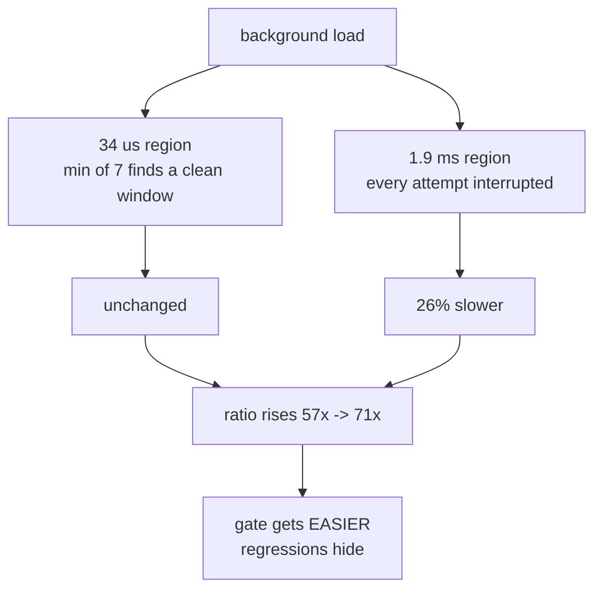

# 5.2 — The performance test in CI — a ratio survives a slow machine, mostly

## One-line answer

Asserting a **ratio** rather than a time is what lets a speed test run on hardware you do not control — but
a ratio is not immune to a busy machine either, and on this one a heavy background load pushed it from 57×
up to 71×, which is a test getting easier to pass exactly when you would want it to get harder.

---

## The story

Somebody in the flat can total the month faster than anybody else, and they want it written down.

Writing down "four minutes" does not work, because it depends on the evening. Four minutes on a quiet
Sunday; nine minutes with the television on and somebody asking about the bins. Anyone reading "four
minutes" a month later and getting nine will conclude the claim was wrong, when what actually happened was
that the evening was different.

So they write it down as a comparison instead: "twice as fast as doing it in your head". That travels
better. On a noisy evening both ways get slower, so the comparison roughly holds.

Roughly. Because the noisy evening does not slow both ways down by the same amount. The quick method takes
four minutes and the interruption lands in the middle of it once. The slow method takes twenty, and the
interruption lands in the middle of it five times. The comparison does not stay put — it drifts, and it
drifts in the direction that flatters the quick method.

---

## The idea in plain language

A speed test in continuous integration is a test that runs on somebody else's computer, at a time you did
not choose, next to jobs you cannot see. Three properties of that environment break a naive timing
assertion.

**The hardware is not yours.** A CI runner may be half the speed of your laptop, or twice, and it can
change between one run and the next without anybody telling you.

**The machine is shared.** Other jobs run on the same host. Your timed region can be interrupted at any
moment ([4.2](../04-the-benchmark/4.2-timeit-honestly.md)).

**A failure costs somebody's afternoon.** A test that fails once a fortnight for no reason gets marked as
flaky, then ignored, then deleted. **A flaky performance test is worse than no performance test**, because
it teaches the team that red does not mean anything.

The first defence is to assert a **ratio** rather than an elapsed duration. `assert elapsed < 0.001` is a statement
about a machine; `assert loop_time / module_time >= 50` is a statement about two pieces of code, measured
in the same process, seconds apart. If the runner is half the speed, both sides halve and the ratio holds.
That is why [5.1](5.1-the-eval.md)'s `test_beats_the_loop_by_fifty` times the baseline every run instead of
comparing against a number recorded on a laptop.

The second thing to know is that the first defence is incomplete, and this part is mostly about that. Noise
does not scale the two sides equally, because they are not the same length. A 34-microsecond measurement
and a 2-millisecond measurement have very different chances of being interrupted, and `min` over several
repeats protects the short one better than the long one. So the ratio moves under load — and on this
machine it moved **up**.

That direction matters. A test that gets harder under load fails spuriously and annoys people. **A test
that gets easier under load stops catching regressions on exactly the runs where the machine was busy**,
which is silent.

---

## Why Setu needs it

- **[5.1](5.1-the-eval.md)** wrote `test_beats_the_loop_by_fifty` with `@pytest.mark.slow`; this is what
  that marker is for.
- **[5.3](5.3-the-phase-closed.md)** closes the phase, and the closing statement has to say how the speed
  claim is kept true rather than just measured once.
- **[4.3](../04-the-benchmark/4.3-the-number-measured.md)** produced the number and the margin above the
  threshold, which is the input to every decision here.
- **Day 100's latency budget** puts a threshold on a service, where the same trade appears with a
  distribution instead of a minimum.
- **Day 236's release checklist** inherits whatever policy this day sets for slow tests, so it is worth
  setting one deliberately.

---

## The mechanism

### The ratio is stable on a quiet machine — and the margin is thin

```python
import timeit

import numpy as np

from setu import stats
from tests.test_stats import gate_data, loop_one_pass

data = gate_data()
ratios = []
nps = []
for _ in range(12):
    n = 20
    t_np = min(timeit.repeat(lambda: stats.summarise(data), number=n, repeat=7)) / n
    t_lp = min(timeit.repeat(lambda: loop_one_pass(data), number=n, repeat=7)) / n
    ratios.append(t_lp / t_np)
    nps.append(t_np)
print("ratio over 12 runs :", " ".join(f"{r:.1f}" for r in ratios))
print(f"    min {min(ratios):.1f}  max {max(ratios):.1f}  spread {max(ratios) / min(ratios):.2f}x")
print("summarise us       :", " ".join(f"{t * 1e6:.1f}" for t in nps))
print(f"    min {min(nps) * 1e6:.1f}  max {max(nps) * 1e6:.1f}  spread {max(nps) / min(nps):.2f}x")
```

**Line by line:**

- Importing `gate_data` and `loop_one_pass` **from the test file** — the same data and the same baseline the
  assertion uses, so this script is measuring the test rather than something like it.
- Twelve repetitions of the **whole assertion**, not twelve timings — each iteration is one complete
  `min`-of-seven measurement of each side, which is exactly what one CI run does.
- The ratio **and** the absolute time printed, so the two spreads can be compared. A ratio that is more
  stable than its parts is the claim, and it needs both numbers to be checkable.

```text
ratio over 12 runs : 55.0 57.6 57.1 57.1 56.8 56.6 58.1 58.5 56.1 59.5 58.3 57.3
    min 55.0  max 59.5  spread 1.08x
summarise us       : 35.9 34.4 34.3 34.1 34.7 34.4 34.4 33.7 35.4 33.6 33.7 33.7
    min 33.6  max 35.9  spread 1.07x
```

**Two readings, and the second is the uncomfortable one.**

The spread is small — 8% on the ratio, 7% on the absolute time — which says the measurement is repeatable
on a quiet machine.

But look at the floor: **55.0 against a threshold of 50.** The margin is ten per cent. On the worst of
twelve runs, on an idle laptop, the gate had a tenth of its headroom left. A CI runner that is slightly
worse-behaved than this machine will cross it. That is not a reason to lower the threshold — it is a reason
to know the number before somebody is woken up by it.

### Under load, the ratio moves — upwards

```python
import multiprocessing as mp
import time
import timeit


def burn(stop: mp.Event) -> None:
    x = 0
    while not stop.is_set():
        x = (x * 31 + 7) % 1_000_003


def measure(data, label: str) -> None:
    n = 20
    t_np = min(timeit.repeat(lambda: stats.summarise(data), number=n, repeat=7)) / n
    t_lp = min(timeit.repeat(lambda: loop_one_pass(data), number=n, repeat=7)) / n
    print(
        f"{label:16} summarise {t_np * 1e6:7.1f} us   "
        f"loop {t_lp * 1e6:8.1f} us   ratio {t_lp / t_np:6.1f}x"
    )


if __name__ == "__main__":
    data = gate_data()
    measure(data, "quiet machine")
    stop = mp.Event()
    workers = [mp.Process(target=burn, args=(stop,)) for _ in range(mp.cpu_count())]
    for w in workers:
        w.start()
    time.sleep(2)
    measure(data, "machine loaded")
    stop.set()
    for w in workers:
        w.join()
    measure(data, "quiet again")
```

**Line by line:**

- `mp.Process` rather than threads — Python threads share one interpreter lock and would not create real
  competition for the processor. Separate processes do.
- `mp.cpu_count()` of them, so every core has a competitor and the timed process has to share.
- `burn` doing integer arithmetic in a loop with **no sleeping and no memory traffic** — a clean competitor
  for processor time, which isolates one kind of interference.
- `if __name__ == "__main__":` — required, not stylistic. On Windows and macOS `multiprocessing` starts
  children by importing this module, and without the guard each child would spawn its own children for
  ever.
- `time.sleep(2)` after starting the workers — giving the load time to actually arrive before measuring, so
  the "loaded" row is not half quiet.
- `measure` called a **third time after the load stops** — the control. Without it, a difference could be
  drift, thermal throttling or anything else that happened to change during the run.

```text
quiet machine    summarise    33.9 us   loop   1919.4 us   ratio   56.7x
machine loaded   summarise    34.0 us   loop   2420.7 us   ratio   71.2x
quiet again      summarise    34.4 us   loop   1932.6 us   ratio   56.3x
```

**The module's time did not move at all** — 33.9, 34.0, 34.4 microseconds. **The loop got 26% slower** —
1919 to 2421 microseconds. And the ratio went from 56.7 to 71.2, then back to 56.3 when the load stopped.
The third row is what makes the second one believable.

**Why the short measurement was protected and the long one was not.** `min` of seven repeats asks: across
seven attempts, what is the best clean window this code got? A 34-microsecond region only needs a clean
window of 34 microseconds, and even on a fully loaded machine the scheduler hands out slices far longer
than that, so at least one of the seven attempts runs uninterrupted. A 1.9-millisecond region needs a clean
window fifty-six times longer, and on a loaded machine it does not get one — every attempt is interrupted,
so the minimum includes somebody else's work.

**The consequence for the test.** Under load the gate becomes *easier*. A genuine regression that took the
module from 57× down to 45× would still show as about 56× on a busy runner and the test would pass. The
failure mode of this assertion is not a false alarm; it is silence.



### Deselecting it, and knowing what it costs

```bash
uv run pytest tests/test_stats.py -q -m "not slow"
uv run pytest tests/test_stats.py -q --durations=4
```

**Line by line:**

- `-m "not slow"` — selects by marker. `slow` is registered in `pyproject.toml` under
  `[tool.pytest.ini_options]`, and the project runs with `--strict-markers`, so a typo in a marker name is
  an error rather than a silently ignored test.
- `--durations=4` — the four slowest tests with their times, which is how you find out what a suite is
  actually spending its life on before deciding what to deselect.

```text
..............                                                           [100%]
14 passed, 1 deselected in 0.12s
```

```text
...............                                                          [100%]
============================= slowest 4 durations =============================
0.30s call     test_stats.py::test_beats_the_loop_by_fifty
0.04s call     test_stats.py::test_summarise_makes_one_copy_not_five

(2 durations < 0.005s hidden.  Use -vv to show these durations.)
15 passed in 0.42s
```

**The timing test is 0.30 of the suite's 0.42 seconds** — about seventy per cent of the wall clock for one
of fifteen tests. At this size that is affordable and the test runs on every commit. The moment the suite
has forty such tests it is not, and the `slow` marker is already in place for that day.

---

## When it breaks

**A threshold tuned on a laptop, on a runner that is not one:**

There is no way to paste a real CI failure into this document without a CI account, so here is the same
failure produced honestly — the assertion run against a threshold that this machine cannot meet, which is
what a slower runner would look like from the inside:

```python
GATE_RATIO = 65.0  # what a threshold tuned on somebody else's faster machine looks like
```

```text
>       assert ratio >= GATE_RATIO, f"{ratio:.1f}x is below the gate's {GATE_RATIO:.0f}x"
E       AssertionError: 61.1x is below the gate's 65x
E       assert 61.084803720676504 >= 65.0

test_stats.py:180: AssertionError
=========================== short test summary info ===========================
FAILED test_stats.py::test_beats_the_loop_by_fifty - AssertionError: 61.1x is...
1 failed, 14 deselected in 0.55s
```

**What it means.** Nothing changed in the module. The threshold was set from a number measured somewhere
else, and this machine cannot reach it. In CI this is the common shape of the failure: somebody records
70× on a fast desktop, writes 65 into the assertion, and the runner — which is slower, shared, and
virtualised — reports 52×. The module is fine. The test is a machine detector.

**The smallest fix** is to set the threshold from the *worst* measurement you have seen rather than the
best, and to leave real headroom. Twelve runs on this machine gave a floor of 55.0, so 50 is a margin of
about ten per cent, which is thin. Given the evidence above, the honest options are to keep 50 and accept
that a slow runner may fail it, or to run the assertion only where the machine is known.

**The other failure — the one that does not print anything:**

A real, small regression: change one line so that `good.min()` and `good.max()` become `np.nanmin(flat)`
and `np.nanmax(flat)`, which is the kind of edit that happens during a tidy-up because it looks more
symmetrical with the rest.

```python
def regressed(counts: np.ndarray) -> tuple[int, float, float, float, float]:
    """One line changed: good.min()/good.max() became np.nanmin/np.nanmax on the full array."""
    flat = counts.reshape(-1)
    live = ~np.isnan(flat)
    n = int(np.count_nonzero(live))
    good = flat[live]
    return (
        n,
        float(good.mean(dtype=ACCUMULATE_IN)),
        float(good.std(ddof=1, dtype=ACCUMULATE_IN)),
        float(np.nanmin(flat)),
        float(np.nanmax(flat)),
    )
```

```text
current module, quiet              ratio   56.0x   PASS
regressed module, quiet            ratio   50.4x   PASS
regressed module, machine loaded   ratio   62.3x   PASS
```

**What it means.** The regression is real — two of the five statistics now scan the whole array, missing
readings included, instead of the gathered copy — and the module is about eleven per cent slower. On a
quiet machine that lands at 50.4×, which passes the gate by four tenths of a point. **On a busy runner it
reads 62.3×, which looks healthy.** All three rows are green, and the middle one is the warning nobody saw.

**There is no smallest fix for this**, which is why it is worth stating rather than solving. The mitigations
are all partial: record the measured ratio in the CI log on every run so a downward trend is visible even
when the assertion passes; assert a **band** rather than a floor, so a suspiciously *high* ratio is also a
failure; or move the assertion to a dedicated machine. The first is nearly free and catches the most: a run
recording 50.4 after a month of 56s is visible to a human even though the test is green.

---

## In production

**What a professional writes instead of the teaching version.** The test reports the number whether it
passes or fails, and says out loud what it does not guarantee:

```python
import os

import pytest

RUN_PERF = os.environ.get("SETU_PERF") == "1"


@pytest.mark.slow
@pytest.mark.skipif(not RUN_PERF, reason="set SETU_PERF=1 on a machine you control")
def test_beats_the_loop_by_fifty(record_property):
    """Criterion 5. A RATIO, not a time, so a slow runner slows both sides.

    KNOWN LIMIT: noise does not scale the two sides equally. Under heavy load the
    loop's 1.9 ms region gets interrupted and the module's 34 us region does not, so
    the ratio rises (measured: 57x -> 71x) and the gate gets EASIER. Read the recorded
    value in the CI log; a passing run with an unusually high ratio means the runner
    was busy, not that the module got faster.
    """
    data = gate_data()
    assert data.flags.c_contiguous, "a strided input measures a different code path"
    n = 20
    t_np = min(timeit.repeat(lambda: stats.summarise(data), number=n, repeat=7)) / n
    t_lp = min(timeit.repeat(lambda: loop_one_pass(data), number=n, repeat=7)) / n
    ratio = t_lp / t_np
    record_property("gate_ratio", round(ratio, 1))
    record_property("summarise_us", round(t_np * 1e6, 1))
    assert ratio >= GATE_RATIO, f"{ratio:.1f}x is below the gate's {GATE_RATIO:.0f}x"
```

**Line by line:**

- `skipif` on an **environment variable**, so the default everywhere is "do not run this" and turning it on
  is a deliberate act by whoever set up that machine. The `reason` string says what the machine has to be.
- `record_property` — pytest's built-in fixture for attaching a name and value to the test's entry in the
  JUnit XML report. CI systems display and archive those, so **every run's ratio is recorded even when it
  passes**, which is the cheap mitigation for the silent failure above.
- Both the ratio **and** the module's absolute time recorded. If the ratio holds while the absolute time
  doubles, the runner changed; if the absolute time holds while the ratio falls, the module regressed. One
  number cannot distinguish those.
- The docstring's **KNOWN LIMIT paragraph**, with the measured direction in it. A test whose weakness is
  written down is a test somebody can reason about at 2 a.m.; the same weakness undocumented is a trap.
- `round(ratio, 1)` — the recorded value carries the precision the measurement has, not fifteen digits of
  it.

**What changes at scale.** Performance assertions inside a unit test suite stop working somewhere around
the point where the suite runs on every push. What replaces them is a **separate benchmark job**: dedicated
or at least consistent hardware, results stored per commit, and alerting on a *trend* rather than a
threshold — a five per cent regression sustained over three commits is a real signal, and a single run
crossing a line is usually not. Benchmark-tracking services exist to do exactly this, and the reason they
exist is that thresholds in unit tests do not survive contact with shared runners.

The second change is what you assert. A threshold answers "is it fast enough". A stored history answers
"did we make it slower", which is the question that actually protects a codebase, because "fast enough" was
decided once and "slower than yesterday" happens continuously.

**The failure that only appears with real data.** A team had a performance test that passed for eight
months and then began failing every third run. Nothing had changed in their code. Their CI provider had
moved them onto a new instance type with more cores and a smaller per-core cache; the absolute times were
similar and the variance had tripled. The test had been asserting a threshold with about four per cent of
headroom, measured on the old hardware and never re-derived. The fix was not a code change: it was
recording the measured value on every run, which showed a step change on a known date and a stable
distribution either side of it.

**The review comment a senior engineer leaves.** *"This asserts a ratio, good — but the floor over twelve
local runs is 55 and the threshold is 50, so there is ten per cent of headroom and CI is slower than your
laptop. Put it behind an env var, add `record_property` so we can see the number on green runs, and write
the load behaviour in the docstring: it goes **up** under load, which means a busy runner hides
regressions."*

**The interview question.** *"How do you stop a performance test being flaky in CI?"* Start with the
substance: assert a ratio measured in the same process, not an absolute time, so the runner's speed
cancels. Then show you know the limits of that — noise does not affect a fast measurement and a slow one
equally, so the ratio drifts, and you should know which way. Then the practical layer: mark it, keep it off
shared runners by default, record the value on every run so trends are visible, and alert on regression
rather than on a fixed line. The answer that stands out names the worse failure mode explicitly — *"the
flaky test that fails is annoying, and the one that quietly gets easier to pass is the one that costs you a
regression"*.

---

## Check yourself

**Run this now.** Find your own margin:

```python
import timeit

from setu import stats
from tests.test_stats import gate_data, loop_one_pass

data = gate_data()
ratios = []
for _ in range(12):
    n = 20
    t_np = min(timeit.repeat(lambda: stats.summarise(data), number=n, repeat=7)) / n
    t_lp = min(timeit.repeat(lambda: loop_one_pass(data), number=n, repeat=7)) / n
    ratios.append(t_lp / t_np)
print(f"worst of 12: {min(ratios):.1f}x   threshold: 50   headroom: {min(ratios) / 50 - 1:.0%}")
```

Write the headroom down. If it is under about twenty per cent, this test does not belong on a shared
runner without the environment-variable guard.

**Answer out loud, without scrolling up:**

1. Why does asserting a ratio survive a slow CI machine better than asserting a time?
2. Under load the module's time did not change and the loop's rose 26%. What is it about `min` of seven
   repeats that produced that asymmetry?
3. The gate got easier to pass on a busy machine. Why is that worse than getting harder, and what is the
   cheapest thing that makes it visible?

---

**Next:** [5.3 — the phase, closed](5.3-the-phase-closed.md).
