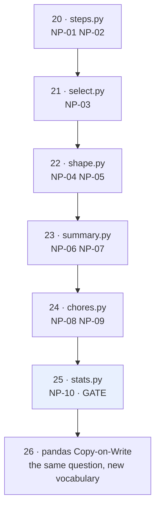

# 5.3 — The phase, closed — the record, and what it does not claim

## One-line answer

Closing a phase means writing down what was built, what the gate measured, and — the part people skip —
what the gate does **not** cover, so that the next person inherits a claim with edges rather than a
slogan.

---

## The story

The month is over and the chart comes down off the wall.

There are two ways to do that. One is to take it down and start a new one, and by March nobody can tell
you what January said. The other takes five minutes: write the totals at the bottom, note that week one's
Thursday was blank because the phone was flat, and put the sheet in the drawer.

The second version is worth doing for a reason that has nothing to do with tidiness. Six months later
somebody asks whether the walking got better after the clocks changed. With the sheets in the drawer that
is a question you can answer. Without them it is a question you can only have an opinion about.

And the note about the blank Thursday matters as much as the totals. Anyone reading the sheet later will
see 27 numbers where they expected 28, and without the note they will assume a mistake and stop trusting
the whole page.

---

## The idea in plain language

Phase 3 is six days — 20 through 25 — covering ten curriculum IDs, and it ends here. Ending it means
producing three things.

**The inventory.** One module and one test file per day, all present, all green. A phase is not finished
because the reading is finished; it is finished when the code exists
(the plan's Principle 1 — no commit, no day).

**The gate record.** The number, its baseline, its data and its method
([4.3](../04-the-benchmark/4.3-the-number-measured.md)), plus the fact that the tests have been seen to
fail ([5.1](5.1-the-eval.md)). A gate met is a claim, and a claim needs its evidence attached or it decays
into folklore within a month.

**The limits.** What the gate does *not* say. This is the part that gets left out, and it is the part that
stops somebody quoting your number in a situation it does not cover.

For this gate the limits are specific and they were all measured on the way here. It is 56× against a
one-pass Python loop and **22× against a tuned one** ([4.1](../04-the-benchmark/4.1-what-fifty-times-is-against.md)).
It is measured at seven thousand readings; at seven million it is 31×, and **below about seventy readings
the loop wins** ([4.3](../04-the-benchmark/4.3-the-number-measured.md)). It assumes contiguous input;
a strided one is about 30% slower ([4.4](../04-the-benchmark/4.4-the-benchmark-that-lied.md)). And the CI
assertion gets *easier* on a loaded machine, so a green run is weaker evidence than it looks
([5.2](5.2-the-performance-test-in-ci.md)).

None of those makes the gate invalid. All of them make it honest, and a claim with its edges drawn is worth
more than a bigger claim without them.

---

## Why Setu needs it

- **Day 26 opens Phase 4 with pandas Copy-on-Write**, which is this entire day in a different vocabulary: pandas
  3.0 made every operation return something that behaves like a copy, and the chained-assignment trap it
  fixes is `df[df.a > 1]['b'] = 0` — the same "I wrote through a view" bug as
  [2.1](../02-the-bug/2.1-ravel-changed-it-flatten-did-not.md). You are not starting a new subject
  tomorrow; you are meeting this one wearing a different hat.
- **Day 41's tensors** share memory with NumPy arrays, so the copy-or-view question reappears with
  gradients attached to it.
- **Day 76's pipelines** chain transformers, and the boundary decision from
  [3.4](../03-the-module/3.4-the-boundary-that-decides.md) is made once per stage.
- **Every later gate** — Modules 4 through 27 each end with one — inherits the shape set here: criteria that
  can be falsified, tests seen to fail, and a record that states its own limits.

---

## The mechanism

### The inventory

```python
"""What Phase 3 owes: one module and one test file per day, 20 to 25."""

from pathlib import Path

PHASE_3 = {
    20: ("NP-01, NP-02", "steps.py", "ndarray, dtypes, creation"),
    21: ("NP-03", "select.py", "indexing, slicing, masks, fancy"),
    22: ("NP-04, NP-05", "shape.py", "broadcasting, reshape, transpose, joins"),
    23: ("NP-06, NP-07", "summary.py", "ufuncs, statistics, sorting, counting"),
    24: ("NP-08, NP-09", "chores.py", "bits, strings, matmul, linear algebra"),
    25: ("NP-10", "stats.py", "copy vs view, and the gate"),
}

root = Path.cwd()
print(f"{'day':>4}  {'ids':<12} {'module':<12} {'src':>7} {'test':>7}  subject")
owed = 0
for day, (ids, module, subject) in sorted(PHASE_3.items()):
    src = root / "src" / "setu" / module
    test = root / "tests" / f"test_{module}"
    if not (src.exists() and test.exists()):
        owed += 1
    print(
        f"{day:>4}  {ids:<12} {module:<12} "
        f"{'yes' if src.exists() else 'MISSING':>7} {'yes' if test.exists() else 'MISSING':>7}  {subject}"
    )
print()
print(f"{len(PHASE_3) - owed} of {len(PHASE_3)} days complete" if owed else "phase 3 complete")
```

**Line by line:**

- `PHASE_3` as a **dictionary keyed by day**, holding the IDs, the module and the subject — the phase as
  data, the same move as [3.1](../03-the-module/3.1-the-gate-as-a-list.md)'s `Criterion` list. A phase you
  can print is a phase you can check.
- The IDs stored next to the module, so the question "which day taught fancy indexing" has an answer in the
  file rather than in the curriculum index.
- `src.exists() and test.exists()` — **both**. A module with no test is not a finished day
  (the plan's Principle 7), so the check treats a missing test exactly
  like a missing module.
- `MISSING` rather than a blank or a `False` — a word that shows up when somebody skims the output.
- The count at the end phrased as owed days, because that is the number that decides whether the phase is
  closed.

Run in a repository where the days have been read but the code has not been written:

```text
 day  ids          module           src    test  subject
  20  NP-01, NP-02 steps.py     MISSING MISSING  ndarray, dtypes, creation
  21  NP-03        select.py    MISSING MISSING  indexing, slicing, masks, fancy
  22  NP-04, NP-05 shape.py     MISSING MISSING  broadcasting, reshape, transpose, joins
  23  NP-06, NP-07 summary.py   MISSING MISSING  ufuncs, statistics, sorting, counting
  24  NP-08, NP-09 chores.py    MISSING MISSING  bits, strings, matmul, linear algebra
  25  NP-10        stats.py     MISSING MISSING  copy vs view, and the gate
```

```text
0 of 6 days complete
```

**That is what an unclosed phase looks like**, and it is deliberately the output shown here rather than a
row of `yes`. The reading is done and the phase is not, and the six `MISSING` pairs are the reps
(the plan's Principle 1). When your own run prints `phase 3 complete`,
the phase is closed and not before.

### The record

Committed as `docs/gates/phase-03.md`, next to the code it describes:

```text
PHASE 3 — NumPy (Module 3) — days 20-25 — IDs NP-01 .. NP-10

GATE      a vectorised stats module beating a loop by >= 50x
RESULT    56.0x                                                    PASS

  baseline   tests/test_stats.py::loop_one_pass @ <commit sha>
  data       7,000 float64 readings, shape (1000, 7), contiguous,
             1% missing, numpy default_rng(20260902)
  method     min of 9 timeit.repeat regions, number=50, spread 1.59x
  versions   numpy==2.5.2  python==3.12.12
  machine    Intel64 Family 6 Model 140 Stepping 1

EVIDENCE
  tests/test_stats.py            15 passed
  seen to fail                   2 mutations, recorded in the test file
  modules                        steps, select, shape, summary, chores, stats

WHAT THIS NUMBER DOES NOT SAY
  against a tuned one-pass loop            22.1x, not 56x
  below ~70 readings                       the loop is faster (0.49x at 28)
  at 7,000,000 readings                    31.3x, not 56x
  on a non-contiguous input                ~30% slower than measured here
  on a loaded CI runner                    the ratio RISES; green is weak evidence
  memory                                   peak is ~2.1x the data, by design (3.3)
```

**Line by line:**

- `GATE` quoting the phase's own words from the curriculum index, unedited — so a reader can check the
  claim against what was asked rather than against what was convenient.
- `RESULT ... PASS` on one line at the top, because that is what most people came for, and everything
  underneath is the evidence they need if they stay.
- The `baseline` naming a **test function at a commit**, not "a Python loop"
  ([4.1](../04-the-benchmark/4.1-what-fifty-times-is-against.md)).
- `contiguous` listed as a property of the data alongside size and missing fraction, because
  [4.4](../04-the-benchmark/4.4-the-benchmark-that-lied.md) showed it is worth 30%.
- `seen to fail  2 mutations` — the line that separates a suite from a decoration
  ([5.1](5.1-the-eval.md)). "15 passed" on its own is not evidence of anything.
- **`WHAT THIS NUMBER DOES NOT SAY` as a required section of the record.** Five of its six lines are worse
  than the headline. That is the point: every one of them was measured on the way to the headline, and
  leaving them out would be choosing not to publish what you know.



---

## When it breaks

**A phase closed on a suite that has never gone red:**

```text
tests/test_stats.py .............                                   [100%]
15 passed in 0.43s
```

**What it means.** Nothing, on its own. This is exactly the output a correct module produces and exactly
the output a module whose tests assert nothing produces. [5.1](5.1-the-eval.md)'s two mutations are what
turn these fifteen dots into evidence, and a phase closed without them has closed on a green light nobody
has checked the bulb of.

**The smallest fix** is one minute: delete `view.flags.writeable = False`, run, see two red, put it back.
Then write "seen to fail" in the record with the mutation and the message.

**A gate quoted without its edges:**

Imagine the record above with the last section deleted. What remains is *"the module is 56× faster than a
loop"*, which is true, and which somebody will now use to size a service that calls it once per request
with twenty readings — where it is **twice as slow** as a loop
([4.3](../04-the-benchmark/4.3-the-number-measured.md)).

**What it means.** No line in the shortened record is false. The failure is entirely one of omission, and
it is the most common way a correct measurement causes a wrong decision. The number was measured at a size,
against a baseline, on contiguous data, on a quiet machine — and every one of those four became invisible
when the qualifying section was dropped.

**The smallest fix** is to make the limits section non-optional in the record's template, so writing one is
not an act of unusual virtue.

**A phase declared closed with unticked reps:**

```text
0 of 6 days complete
```

**What it means.** The days have been read and the code has not been written. This is the failure the
inventory script exists to catch, and it is the one that is easiest to talk yourself out of, because
reading a day feels like doing it. It is not: the reps are where the understanding gets tested, and a
`TODO(me)` left in a lab is a claim you have not checked
(the plan's Principle 1).

**The smallest fix** is to run the inventory before writing the record, and to treat any `MISSING` as
blocking.

---

## In production

**What a professional writes instead of the teaching version.** The record is a decision record, committed
with the code, dated, and never edited afterwards — superseded by a new one instead:

```text
docs/gates/phase-03.md          the record above, dated, immutable
docs/gates/phase-03-rerun-2.md  a later re-measurement, if hardware changes
```

The reason it is immutable is that a record which gets quietly updated stops being evidence of what was
true in September. If the number changes, that is a new fact and it gets a new file, and the difference
between the two files is the most interesting thing in the directory.

Three practices carry this pattern into a real codebase. **Architecture decision records** do the same job
for design choices: what was decided, what the alternatives were, what the consequences are, dated and
append-only. **Model cards** and **dataset cards** do it for machine learning artefacts, and their most
valuable section is always the intended-use-and-limitations one — the same "what this does not say" section
as above. And **release notes** are the version of this that faces outward, where the temptation to drop
the limits section is strongest and the cost of dropping it is highest.

**What changes at scale.** The record stops being read by you. Six months on, the person quoting your 56×
in a design document has not read this day, will not run the benchmark, and will take the headline. That
is the whole argument for the limits section: it is not for you, and it is not documentation of your work
— it is the guard rail on somebody else's decision.

The second change is that gates start depending on each other. Phase 4's pandas work sits on top of this
NumPy module, so when the NumPy gate's assumptions change — a version bump, new hardware, a different
missing fraction in production — everything downstream inherits the change. A dated, immutable record is
what makes that traceable; a number in somebody's head is not.

**The failure that only appears with real data.** A team closed a performance milestone with "8× faster
than the previous pipeline" and moved on. Eighteen months later the number was still being quoted in
capacity planning. The original measurement had been taken on a dataset with one partition; production had
since grown to four hundred, and the 8× had become about 1.4× because the per-partition overhead the
original benchmark never saw now dominated. Nobody had lied. The record had no limits section, so there was
nothing to invalidate — and no way for anybody to notice that the conditions had moved out from under it.

**The review comment a senior engineer leaves.** *"Add a 'what this does not say' section before I approve
this. You measured at one size against one baseline on a quiet laptop with contiguous input — all four of
those belong in the record, because in six months somebody will quote the headline at me in a planning
meeting and I will want to be able to look up whether it applies."*

**The interview question.** *"How do you hand over a piece of work so that somebody else can rely on it?"*
Say what you would write down: what was built, what was measured, and under exactly what conditions. Then
make the point that separates a good answer from a complete one — **the handover has to include the
limits**, because the person who reads it later will not re-run your benchmark and will take your headline
at face value. Give a concrete example: a module that is fifty-six times faster than a loop on seven
thousand rows and twice as slow on twenty-eight, where publishing only the first number would send somebody
in the wrong direction with your name on it.

---

## Check yourself

**Run this now.** Close your own phase:

```bash
uv run python scripts/phase_inventory.py    # the script above
uv run pytest tests/ -q
uv run pytest tests/test_stats.py -q -m "not slow"
./m depth 25
```

The inventory must print `phase 3 complete`. If it prints `MISSING` anywhere, that is the next thing to do
and this part is not finished.

**Answer out loud, without scrolling up:**

1. Your module is 56× faster than a loop. Name three conditions that number depends on, and say what
   happens to it when each one changes.
2. Fifteen tests passed. Why is that not, by itself, evidence that the module works?
3. Tomorrow opens pandas with Copy-on-Write. What have you already learned this week that the
   chained-assignment trap is an instance of?

---

**Back to the hub:** [`LESSON.md`](../../LESSON.md).

**Tomorrow:** day 26 opens Phase 4 with pandas 3.0 — Copy-on-Write, the `str` dtype, and the
chained-assignment trap. Every one of those three is this day's subject in a different vocabulary.
