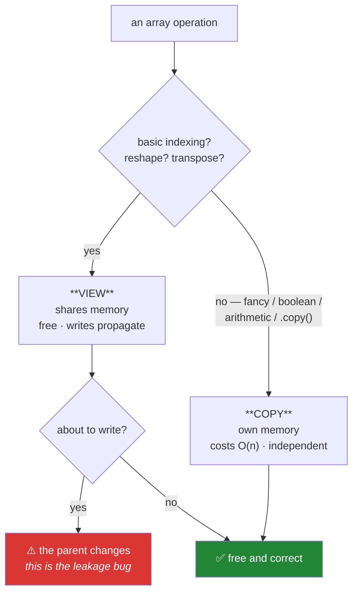

# Day 25 — Copy vs view, and the vectorised stats module

**Phase 3 gate** · ID: **NP-10** (copy vs view behaviour) · Artifact: **ADR-001**

> **Yesterday:** linear algebra, and vector search written six phases early.
> **Today:** the whole copy-versus-view question, settled and written down as a decision record you
> could defend to a reviewer. Then the module that makes it worth having done. **Phase 3 closes** —
> and tomorrow this exact question reappears one level up, as pandas 3.0's Copy-on-Write.
> **Tomorrow:** Phase 4, pandas 3.0.

```bash
./m start 25 && ./m scaffold 25
```

**Time:** 2 hours (gate day). **Request budget:** 0 model calls.

---

## §1 The story

You met views on Day 21 and have used them for four days. Today you settle them, because "settled"
means two things this project cares about:

1. **A written rule** you follow without thinking, so the question stops costing attention.
2. **A written decision record** (Principle 10) you could hand to a hiring panel.

Here is the shape of the problem, one last time. Every operation in NumPy either shares memory with
its source or does not, and the syntax does not tell you which:



The rule this project adopts — and the reason is what ADR-001 has to argue — is:

> **Functions in `src/setu/` never write into an array they were given.** Anything that transforms
> returns a new array. Anything that must mutate says so in its name and its docstring, and there is
> a test asserting the caller's array is unchanged.

That is not the *fastest* possible rule. In-place operations avoid allocations, and on Day 131's
optimiser loop that genuinely matters. So ADR-001 is not "views are bad" — it is a decision with a
stated cost and a stated exception, which is what makes it worth writing.

And the reason it belongs in a *data science* curriculum rather than a software-engineering one is
Principle 8. Day 21 showed it: an in-place transform on a training view silently modifies the source
that the test set was sliced from. Nothing in the diff looks like a write. That is not a style
preference — it is a correctness property of your evaluation.

---

## §2 Setup — run this

```bash
mkdir -p days/day-25/lab
touch days/day-25/lab/copies.py
touch src/setu/stats.py
touch tests/test_stats.py
touch docs/adr/ADR-001-copy-vs-view.md
```

No new packages.

---

## §3 NP-10 — the complete picture

`days/day-25/lab/copies.py`:

```python
"""NP-10: everything that shares memory, everything that does not, and how to tell."""

from __future__ import annotations

import numpy as np


def the_full_table() -> None:
    a = np.arange(24).reshape(4, 6)

    cases = {
        "a[1:3]": a[1:3],
        "a[:, 2]": a[:, 2],
        "a[::2, ::2]": a[::2, ::2],
        "a.T": a.T,
        "a.reshape(6, 4)": a.reshape(6, 4),
        "a.ravel()": a.ravel(),
        "a.view()": a.view(),
        "a[[0, 2]]": a[[0, 2]],
        "a[a > 10]": a[a > 10],
        "a.flatten()": a.flatten(),
        "a.copy()": a.copy(),
        "a + 0": a + 0,
        "a.astype(a.dtype)": a.astype(a.dtype),
        "np.sort(a)": np.sort(a),
    }

    print("\n  operation              shares memory?")
    for label, result in cases.items():
        print(f"  {label:<22} {np.shares_memory(a, result)}")

    print("\n  Note a.astype(same dtype) still COPIES: astype always copies by default.")
    print("  Note a + 0 copies: every arithmetic ufunc allocates a result.")


def when_reshape_copies() -> None:
    a = np.arange(12).reshape(3, 4)
    print(f"\n{np.shares_memory(a, a.reshape(4, 3))=}   <- contiguous: a view")
    transposed = a.T
    print(f"{transposed.flags['C_CONTIGUOUS']=}   <- transposing breaks contiguity")
    print(f"{np.shares_memory(a, transposed.reshape(12))=}   <- so reshape must COPY")
    print("  ^ reshape returns a view WHEN IT CAN. Never assume; check.")


def in_place_operators() -> None:
    a = np.arange(5, dtype=float)
    original = a.copy()

    b = a
    b += 100
    print(f"\nafter b += 100 : {a=}   <- SAME object mutated")

    a = original.copy()
    b = a
    b = b + 100
    print(f"after b = b + 100: {a=}   <- rebound; parent untouched")
    print("  ^ Day 10's rebind-vs-mutate, with an eight-megabyte price tag attached.")


def the_deliberate_in_place_case() -> None:
    import time

    n = 20_000_000
    a = np.ones(n)

    start = time.perf_counter()
    for _ in range(5):
        a = a * 1.001
    out_of_place = time.perf_counter() - start

    a = np.ones(n)
    start = time.perf_counter()
    for _ in range(5):
        a *= 1.001
    in_place = time.perf_counter() - start

    print(f"\n5 scalings of a {n:,}-element array")
    print(f"  out of place: {out_of_place:.3f}s   (5 allocations of {a.nbytes / 1024**2:.0f} MiB)")
    print(f"  in place:     {in_place:.3f}s")
    print(f"  ~{out_of_place / in_place:.1f}x")
    print("\n  This is the COST side of ADR-001. The exception it grants is exactly")
    print("  this shape: a hot loop over an array the function itself allocated.")


def how_to_check() -> None:
    a = np.arange(10)
    v = a[2:5]
    c = a[2:5].copy()

    print(f"\n{v.base is a=}                  <- works for a direct view")
    print(f"{v[::2].base is a=}               <- FALSE: chained views point at the intermediate")
    print(f"{np.shares_memory(a, v[::2])=}    <- TRUE: this is the reliable check")
    print(f"{c.flags['OWNDATA']=} {v.flags['OWNDATA']=}")
    print(f"{v.flags['WRITEABLE']=}")
    print("\n  Use np.shares_memory. .base and OWNDATA both have edge cases.")


def defensive_copy_costs() -> None:
    import time

    a = np.ones((5000, 1000))
    start = time.perf_counter()
    for _ in range(10):
        a.copy()
    elapsed = time.perf_counter() - start
    print(f"\ncopying {a.nbytes / 1024**2:.0f} MiB ten times: {elapsed:.3f}s")
    print(f"  ~{elapsed / 10 * 1000:.1f}ms per defensive copy")
    print("  Cheap for a lab. NOT cheap inside a training loop. That is the trade-off")
    print("  ADR-001 has to name honestly.")


if __name__ == "__main__":
    the_full_table()
    when_reshape_copies()
    in_place_operators()
    the_deliberate_in_place_case()
    how_to_check()
    defensive_copy_costs()
```

**Line by line:**

- The table — fourteen operations, printed with their answer. **Run it and read every row.** The
  surprising ones are `a.astype(a.dtype)` (copies even when the dtype is unchanged, because `astype`
  copies by default — pass `copy=False` if you want the other behaviour) and `a + 0` (every
  arithmetic ufunc allocates a result array).
- `a.view()` — an explicit view with the same data, optionally reinterpreted as another dtype. Rarely
  needed; included so the name is not mysterious when you meet it.
- `transposed.flags['C_CONTIGUOUS']` is `False` — a transpose leaves the data where it is and swaps
  the strides, so the elements are no longer in row-major order. `reshape` then **cannot** produce a
  view and copies instead. This is why "reshape is a view" is a rule of thumb rather than a guarantee.
- `b += 100` versus `b = b + 100` — Day 10's distinction, now with a cost. The first mutates in place
  (no allocation, parent changes); the second allocates a new array (parent safe). On an 8 MiB array
  the difference is visible in a profiler.
- `the_deliberate_in_place_case` — **this is the honest counter-argument to today's rule.** Five
  scalings of a 20-million-element array: out-of-place allocates 160 MiB five times. Run it and record
  the ratio; ADR-001 has to cite a real number, not a vague "in-place is faster".
- `v[::2].base is a` is **`False`** — a chained view's `.base` points at the *intermediate* view, not
  the original. This is why `.base` is not a reliable test and `np.shares_memory` is.
- `flags['OWNDATA']` — whether the array owns its buffer. Also has edge cases (an array can own data
  that another array also references). One reliable check: `np.shares_memory`.
- `defensive_copy_costs` — ~20 MiB copied ten times. Milliseconds. **That is the price of the rule,
  measured**, and in a lab it is nothing. Inside a per-batch training loop it is not.

---

## §4 The artifact — ADR-001

`docs/adr/ADR-001-copy-vs-view.md`. Use the template in `docs/adr/ADR-TEMPLATE.md`.

This is the **Phase 3 gate artifact** and the first of thirteen. It must contain:

- **Context.** The view/copy split, the leakage mechanism from Day 21 (`train -= train.mean()`
  writing into the source), and the fact that the syntax gives no signal.
- **Options considered.** At least three, honestly:
  1. *Always copy on input.* Safe, costs an allocation per call.
  2. *Never copy; document ownership.* Fast, and one mistake corrupts an evaluation.
  3. *Copy at boundaries, allow in-place inside a function's own scratch space.* The middle path.
- **Decision.** State the rule. State it in one sentence a reviewer could repeat back.
- **Consequences.** What gets easier (tests, reasoning, no leakage class). What gets harder
  (allocations; a documented exception is needed for hot loops).
- **Numbers.** Your measured defensive-copy cost and your measured in-place speedup, from §3. **An ADR
  with no numbers is an opinion.**
- **What would make us change our minds.** Be specific — e.g. *"if profiling shows defensive copies
  exceed 5% of an epoch on Day 136, the training loop gets a documented in-place exception."*
- **Cold read.** Re-read it tomorrow with your reviewer hat on, and sign it.

---

## §5 Build brief — `src/setu/stats.py`

Layer 1. The vectorised statistics module. Phase 8 imports from here rather than reimplementing, and
Day 84's `audit(df)` calls into it.

```python
"""Vectorised statistics. No Python loops over data. Layer 1."""

from __future__ import annotations

import numpy as np

from setu.arrays import as_float_array, safe_divide
from setu.errors import DataError


def summary(values) -> dict[str, float]:
    """TODO(me): {'n','n_missing','mean','std','min','q25','median','q75','max','iqr'}.

    - nan-aware throughout; ddof=1 for std
    - all-missing input returns nan for every statistic, never raises
    - return plain floats (not np.float64) so the result is JSON-serialisable
    """
    raise NotImplementedError


def zscores(values) -> np.ndarray:
    """TODO(me): (x - mean) / std, nan-aware, ddof=1.

    - zero std returns all zeros, not inf (reuse safe_divide)
    - NaN stays NaN; it must not become 0
    - must NOT modify the input (ADR-001)
    """
    raise NotImplementedError


def iqr_outlier_mask(values, *, factor: float = 1.5) -> np.ndarray:
    """TODO(me): boolean mask, True where the value is an outlier.

    Outlier = below q25 - factor*iqr, or above q75 + factor*iqr.
    NaN is NOT an outlier (it is missing) - the mask must be False there.
    Raise DataError if factor <= 0. This is Day 77's detector, built early.
    """
    raise NotImplementedError


def correlation_matrix(matrix) -> np.ndarray:
    """TODO(me): (k, k) Pearson correlation between COLUMNS.

    - build it from standardised columns and one matmul (Days 22 and 24)
    - diagonal exactly 1.0; clip to [-1, 1]
    - a constant column correlates 0 with everything (not nan)
    - do NOT use np.corrcoef - you are building it (Principle 2), then compare
    """
    raise NotImplementedError


def bootstrap_mean_ci(values, *, confidence: float = 0.95, n_boot: int = 2000, seed: int = 42):
    """TODO(me): (low, high) percentile bootstrap CI for the mean.

    - resample WITH replacement, n_boot times, vectorised: draw an
      (n_boot, n) index matrix in ONE call, no Python loop over iterations
    - use make_rng(seed) so it is reproducible
    - drop NaN before resampling
    - raise DataError if fewer than 2 non-missing values
    This is Day 68's lab, built here so Phase 8 can check its work against it.
    """
    raise NotImplementedError
```

- `bootstrap_mean_ci` vectorising the resampling loop is the day's technical high point: draw a
  `(n_boot, n)` matrix of indices in one `rng.integers` call, index the data with it to get a
  `(n_boot, n)` sample matrix, then `.mean(axis=1)`. Two thousand bootstrap iterations, no Python loop.
- `correlation_matrix` composes Days 22 and 24: standardise the columns, then one matmul divided by
  `n - 1`. Comparing it against `np.corrcoef` afterwards is the Principle-2 payoff.

---

## §6 The eval that must be able to fail

`tests/test_stats.py`:

```python
import json

import numpy as np
import pytest

from setu.errors import DataError
from setu.stats import (
    bootstrap_mean_ci,
    correlation_matrix,
    iqr_outlier_mask,
    summary,
    zscores,
)


def test_summary_against_hand_computed_values():
    out = summary([2.0, 4.0, 4.0, 4.0, 5.0, 5.0, 7.0, 9.0])
    assert out["n"] == 8 and out["n_missing"] == 0
    assert out["mean"] == pytest.approx(5.0)
    assert out["std"] == pytest.approx(2.13809, rel=1e-4)
    assert out["median"] == pytest.approx(4.5)
    assert out["iqr"] == pytest.approx(out["q75"] - out["q25"])


def test_summary_ignores_missing():
    out = summary([1.0, np.nan, 3.0])
    assert out["n"] == 3 and out["n_missing"] == 1
    assert out["mean"] == pytest.approx(2.0)


def test_summary_all_missing_is_nan_not_an_exception():
    out = summary([np.nan, np.nan])
    assert np.isnan(out["mean"]) and np.isnan(out["std"])


def test_summary_is_json_serialisable():
    json.dumps(summary([1.0, 2.0, 3.0]))


def test_zscores_are_standardised():
    out = zscores([2.0, 4.0, 4.0, 4.0, 5.0, 5.0, 7.0, 9.0])
    assert np.nanmean(out) == pytest.approx(0.0, abs=1e-12)
    assert np.nanstd(out, ddof=1) == pytest.approx(1.0)


def test_zscores_keep_nan_as_nan():
    out = zscores([1.0, np.nan, 3.0])
    assert np.isnan(out[1]), "a missing value became 0 - that is imputation, not standardisation"


def test_zscores_constant_input_is_zeros_not_inf():
    out = zscores([5.0, 5.0, 5.0])
    assert np.all(np.isfinite(out)) and np.allclose(out, 0.0)


def test_zscores_does_not_modify_the_input():
    values = np.array([1.0, 2.0, 3.0])
    before = values.copy()
    zscores(values)
    assert np.array_equal(values, before), "ADR-001 violated"


def test_iqr_flags_the_obvious_outlier():
    values = [10.0, 11.0, 12.0, 11.5, 10.5, 1000.0]
    assert iqr_outlier_mask(values).tolist() == [False, False, False, False, False, True]


def test_iqr_does_not_flag_nan():
    mask = iqr_outlier_mask([10.0, 11.0, 12.0, np.nan, 1000.0])
    assert mask[3] == False, "NaN is missing, not an outlier"  # noqa: E712


def test_iqr_rejects_a_bad_factor():
    with pytest.raises(DataError):
        iqr_outlier_mask([1.0, 2.0], factor=0.0)


def test_correlation_matches_numpy():
    rng = np.random.default_rng(0)
    data = rng.normal(size=(500, 4))
    data[:, 1] = data[:, 0] * 2 + rng.normal(scale=0.01, size=500)
    assert np.allclose(correlation_matrix(data), np.corrcoef(data, rowvar=False), atol=1e-10)


def test_correlation_diagonal_is_exactly_one():
    rng = np.random.default_rng(1)
    out = correlation_matrix(rng.normal(size=(100, 5)))
    assert np.array_equal(np.diag(out), np.ones(5))


def test_correlation_is_bounded():
    rng = np.random.default_rng(2)
    out = correlation_matrix(rng.normal(size=(200, 6)))
    assert out.min() >= -1.0 and out.max() <= 1.0


def test_correlation_constant_column_is_zero_not_nan():
    data = np.column_stack([np.arange(50, dtype=float), np.full(50, 3.0)])
    out = correlation_matrix(data)
    assert np.all(np.isfinite(out)), "a constant column produced nan"


def test_bootstrap_ci_brackets_the_true_mean():
    rng = np.random.default_rng(3)
    sample = rng.normal(loc=10.0, scale=2.0, size=400)
    low, high = bootstrap_mean_ci(sample, seed=1)
    assert low < 10.0 < high
    assert low < sample.mean() < high


def test_bootstrap_ci_is_reproducible():
    values = np.arange(50, dtype=float)
    assert bootstrap_mean_ci(values, seed=7) == bootstrap_mean_ci(values, seed=7)


def test_bootstrap_ci_narrows_with_more_data():
    rng = np.random.default_rng(4)
    small = bootstrap_mean_ci(rng.normal(size=50), seed=1)
    large = bootstrap_mean_ci(rng.normal(size=5000), seed=1)
    assert (large[1] - large[0]) < (small[1] - small[0])


def test_bootstrap_is_vectorised():
    """2000 resamples of 10k values must be fast; a Python loop would not be."""
    import time

    rng = np.random.default_rng(5)
    values = rng.normal(size=10_000)
    start = time.perf_counter()
    bootstrap_mean_ci(values, n_boot=2000, seed=1)
    assert time.perf_counter() - start < 3.0, "are you looping over bootstrap iterations?"


def test_bootstrap_rejects_too_little_data():
    with pytest.raises(DataError):
        bootstrap_mean_ci([1.0])


def test_no_in_place_writes_to_caller_arrays():
    """ADR-001, enforced across the module."""
    from setu import stats

    rng = np.random.default_rng(6)
    for fn in (summary, zscores, iqr_outlier_mask):
        values = rng.normal(size=100)
        before = values.copy()
        fn(values)
        assert np.array_equal(values, before), f"{fn.__name__} wrote into its argument"
    matrix = rng.normal(size=(50, 4))
    before = matrix.copy()
    stats.correlation_matrix(matrix)
    assert np.array_equal(matrix, before), "correlation_matrix wrote into its argument"
```

**Line by line:**

- `test_summary_against_hand_computed_values` — the same eight-value dataset as Day 20, so the
  `ddof=1` answer (2.138, not 2.0) is checked a second time in a different module. Consistency across
  the codebase is itself a property worth testing.
- `test_zscores_keep_nan_as_nan` — **a missing value must not become 0.** Zero is the *mean* after
  standardisation, so turning NaN into 0 silently imputes it as average. That would pass every other
  test here and quietly corrupt Day 96's model. The message names the mistake.
- `test_correlation_matches_numpy` — **the Principle-2 payoff.** You built it from standardisation and
  a matmul; `np.corrcoef` is the reference. `atol=1e-10` because the two take different floating-point
  paths to the same answer. Building it yourself and then proving it matches is exactly the pattern
  Day 92 and Day 143 repeat.
- `rowvar=False` in the reference call — `np.corrcoef` treats **rows** as variables by default, which
  is the opposite of every dataframe convention. Getting this wrong gives an `(n, n)` matrix instead of
  `(k, k)` and a confusing size mismatch.
- `test_bootstrap_ci_narrows_with_more_data` — a **statistical** property, not a numeric one: a
  hundred times more data gives a visibly tighter interval. It catches an implementation that
  resamples the wrong axis or the wrong size, which numeric tests can miss.
- `test_bootstrap_is_vectorised` — 2000 × 10 000. Vectorised it is well under a second; a Python loop
  over iterations is many seconds. Third performance test in Phase 3, same justification each time:
  the difference is algorithmic.
- `test_no_in_place_writes_to_caller_arrays` — **ADR-001, enforced mechanically over the whole
  module.** This is the Phase 3 gate expressed as a test, and it is the one that keeps the decision
  true after you have forgotten writing it.

```bash
uv run python -m pytest tests/test_stats.py -v
uv run python -m pytest -q
```

---

## §7 Request budget

| Resource | Spent today |
|---|---|
| LLM calls | **0** |

---

## §8 Traps

- **Assuming `reshape` is always a view.** After a transpose it copies. Check.
- **Assuming `astype` with the same dtype is free.** It copies unless you pass `copy=False`.
- **Trusting `.base`.** Chained views point at the intermediate. Use `np.shares_memory`.
- **`+=` on an array you were given.** You just mutated the caller's data.
- **Turning NaN into 0 while standardising.** That is silent imputation.
- **`np.corrcoef` without `rowvar=False`.** Rows are variables by default.
- **A Python loop over bootstrap iterations.** Draw the whole index matrix at once.
- **Dividing by a zero standard deviation.** Constant columns give `inf` or `nan`.
- **Writing an ADR with no numbers.** That is an opinion with a template around it.
- **Defensive copies inside a hot loop.** The measured cost is why ADR-001 needs an exception clause.

---

## §9 Verify before you code

Written **2026-08-21**:

- <https://numpy.org/doc/stable/user/basics.copies.html> — the official copy/view page.
- <https://numpy.org/doc/stable/reference/generated/numpy.ndarray.flags.html> — `OWNDATA`,
  `C_CONTIGUOUS`, `WRITEABLE`.
- <https://numpy.org/doc/stable/reference/generated/numpy.corrcoef.html> — confirm the `rowvar` default.
- <https://numpy.org/doc/stable/reference/generated/numpy.percentile.html> — the interpolation methods,
  which is why two quartile implementations can disagree in the third decimal.

---

## §10 Say it in an interview

> "NumPy's copy-versus-view split isn't visible in the syntax, so I settled it with a written rule:
> library functions never write into an array they were handed, and there's a test that runs every
> public function against a copy and asserts the argument is unchanged. The reason it's a correctness
> issue rather than a style one is that an in-place transform on a training slice writes into the
> array the test set was sliced from — you get leakage through a mechanism that doesn't look like a
> write in the diff. The decision record names the cost honestly: I measured defensive copies at about
> two milliseconds for twenty megabytes, and in-place scaling at roughly twice the speed of
> out-of-place on a large array, so the exception is documented for hot loops rather than pretended
> away."

---

## §11 Done when — **Phase 3 gate**

Tick [`CHECKLIST.md`](CHECKLIST.md), then:

```bash
./m check
./m done 25
./m status
```

**Gate criteria:** `ADR-001` written, with **your** measured numbers, and cold-read a day later ·
`src/setu/stats.py` complete and vectorised · `test_no_in_place_writes_to_caller_arrays` green ·
`correlation_matrix` proven equal to `np.corrcoef` · every Phase 3 lab runs in seconds.

Tomorrow: pandas 3.0, where this exact question becomes Copy-on-Write — and you already know the
answer.
