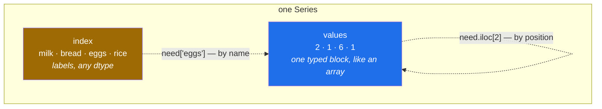

# 1.1 — A column with labels — the Series

## One-line answer

A **Series** is one column of values with a label attached to every value, which makes it a NumPy
array and a dictionary at the same time — and the labels, not the positions, are what pandas carries
through every operation.

---

## The story

There is a shopping list on the fridge door. It is four lines long, written in biro on the back of an
envelope:

```text
milk    2
bread   1
eggs    6
rice    1
```

Somebody stands in the shop and reads it. They do not think "the third line says six". They think
"six eggs". The number on its own means nothing — it is the pairing of the word and the number that
is the list.

Now watch what happens when the flat decides to buy double this week. Somebody goes down the list and
doubles each number: four milk, two bread, twelve eggs, two rice. The words did not move. Nobody
re-wrote the item names, and nobody had to check that "eggs" was still on the third line. The names
came along for free, attached to their numbers.

That is a small thing on an envelope and a very large thing in a program. Almost every mistake in
handling data is a number that got separated from the thing it was counting.

---

## The idea in plain language

A **Series** is pandas' name for one column of data with a label on every value.

You have already met both halves of that. A NumPy array is a block of values that are all the same
kind, laid out one after another, and reached by counting positions
([Day 20, 1.1](../../../day-20-arrays-and-dtypes/parts/01-the-block/1.1-a-list-of-boxes.md)). A
dictionary is a set of keys, each pointing at a value, reached by name
([Day 8, 2.3](../../../day-08-containers/parts/02-sets-and-dicts/2.3-a-dict-is-ordered-now.md)).

A Series is both at once. Underneath, the values are a single typed block, exactly like an array, so
arithmetic over the whole column happens at NumPy speed. On top, there is a second sequence — the
**index** — holding one label per value, so any value can also be found by its name.

Three words to fix now, because the rest of this phase uses them constantly:

- The **values** are the data itself: `2, 1, 6, 1`. One dtype for the whole column, the same promise
  an array makes
  ([Day 20, 2.1](../../../day-20-arrays-and-dtypes/parts/02-dtypes/2.1-a-dtype-is-a-promise.md)).
- The **index** is the sequence of labels: `milk, bread, eggs, rice`. It is a real object with its own
  dtype, not decoration.
- The **name** is what the column itself is called: `need`. It is optional, and it becomes the column
  heading when the Series is put into a table ([1.3](1.3-a-table-of-columns.md)).

If you do not supply an index, pandas makes one for you: the whole numbers counting up from zero.
That default is so easy to mistake for "row numbers" that it gets its own document
([1.2](1.2-the-index-is-not-a-row-number.md)).

The reason all of this matters is the doubling in the story. When you multiply a Series by two, the
labels are carried through untouched. When you add two Series together, pandas matches them up **by
label** before adding, not by position — which is either the most useful behaviour in the library or
the most surprising, depending on whether you were expecting it
([Day 28, 4.1](../../../day-28-selection-and-alignment/parts/04-alignment/4.1-two-lists-different-items.md)).

---

## Why Setu needs it

- **[1.3](1.3-a-table-of-columns.md), later today**, builds a DataFrame, and a DataFrame is a set of
  Series sharing one index. Everything true of a Series is true of every column of every table you
  meet from here on.
- **Day 27** reads the shopping list from a file, and the thing it hands back is a table of these.
- **Day 28** adds two Series with different labels, and the labels decide the answer.
- **Day 31's `groupby`** returns a Series whose index is the thing you grouped by, which is unreadable
  until you are comfortable that an index can be words.
- **Day 91 onwards**, every model's predictions come back as a Series, and keeping the labels attached
  is what lets you say *which row* was predicted wrong.

---

## The mechanism

Start with no labels at all, so the default index is visible:

```python
import pandas as pd

need = pd.Series([2, 1, 6, 1])
print(need)
print("index:", need.index, "| values:", need.values, "| dtype:", need.dtype)
```

**Line by line:**

- `pd.Series([...])` — the constructor takes anything list-like: a list, a tuple, a NumPy array, a
  dictionary. Given a plain list it infers the dtype the same way `np.array` does
  ([Day 20, 3.1](../../../day-20-arrays-and-dtypes/parts/03-creating/3.1-np-array-and-what-it-infers.md)),
  which is why four whole numbers become `int64` rather than anything wider.
- `need.index` — the labels. Nobody supplied any, so pandas built a `RangeIndex`: the numbers 0, 1, 2
  and 3, stored as a start, a stop and a step rather than as four separate integers. It is the same
  trick `range()` uses, and it costs almost nothing however long the Series is.
- `need.values` — the block underneath, as a NumPy array. Reaching for `.values` is how you drop out
  of pandas and back into NumPy, and there is a better-behaved way to do it that
  [3.4](../03-copy-on-write/3.4-to-numpy-and-the-read-only-array.md) explains.
- `need.dtype` — one dtype for the whole column, exactly as with an array. **A Series cannot hold an
  integer in one place and a word in another** without falling back to a dtype that can hold
  anything, which is a decision with real costs
  ([2.1](../02-the-str-dtype/2.1-text-used-to-be-object.md)).

```text
0    2
1    1
2    6
3    1
dtype: int64
index: RangeIndex(start=0, stop=4, step=1) | values: [2 1 6 1] | dtype: int64
```

Now the list as it is actually written on the envelope, with the words attached:

```python
import pandas as pd

need = pd.Series([2, 1, 6, 1], index=["milk", "bread", "eggs", "rice"], name="need")
print(need)
print()
print("look up by label   :", need["eggs"])
print("look up by position:", need.iloc[2])
```

**Line by line:**

- `index=[...]` — the labels, supplied in the same order as the values. It must be the same length as
  the data, and pandas raises immediately if it is not, which is one of the few checks it does eagerly.
- `name="need"` — what this column is called. It prints as a `Name:` line under the values, and it
  becomes the column heading in [1.3](1.3-a-table-of-columns.md).
- `need["eggs"]` — lookup **by label**, like a dictionary. This is the half of the Series that an array
  does not have.
- `need.iloc[2]` — lookup **by position**, like a list. Both give 6, and that coincidence is exactly
  why the two are worth keeping straight from the first day: here the labels are words, so there is no
  confusion, but when the labels are numbers there very much is
  ([Day 28, 1.1](../../../day-28-selection-and-alignment/parts/01-label-and-position/1.1-two-ways-to-say-that-row.md)).

```text
milk     2
bread    1
eggs     6
rice     1
Name: need, dtype: int64

look up by label   : 6
look up by position: 6
```

The doubling from the story — and the point is what does **not** change:

```python
import pandas as pd

need = pd.Series([2, 1, 6, 1], index=["milk", "bread", "eggs", "rice"], name="need")
print(need * 2)
```

**Line by line:**

- `need * 2` — one operation over the whole column, elementwise, exactly like an array
  ([Day 23, 1.1](../../../day-23-ufuncs-and-statistics/parts/01-ufuncs/1.1-one-operation-every-element.md)).
  There is no loop, and pandas hands the arithmetic straight down to NumPy.
- **The index is untouched.** `milk` is still `milk`; the labels are copied across to the result
  without being looked at. This is the whole reason a Series exists rather than an array: the answer
  still knows what it is about.
- The `Name: need` survives too, so the column can be put back into a table without being re-labelled.

```text
milk      4
bread     2
eggs     12
rice      2
Name: need, dtype: int64
```

The two halves of a Series, drawn:



The left box is the dictionary half and the right box is the array half. Every behaviour in this
phase comes from one or the other.

---

## When it breaks

**The index that was the wrong length:**

```text
$ uv run python -c "
import pandas as pd
pd.Series([2, 1, 6, 1], index=['milk', 'bread', 'eggs'])
"
Traceback (most recent call last):
  ...
  File ".../pandas/core/series.py", line 503, in __init__
    com.require_length_match(data, index)
  File ".../pandas/core/common.py", line 601, in require_length_match
    raise ValueError(
ValueError: Length of values (4) does not match length of index (3)
```

**What it means.** Four values, three labels, and pandas refuses rather than guessing which value has
no name. This is one of the very few places pandas checks something up front instead of letting it
become a `NaN` later, and it is worth being glad about: the same mismatch arriving through an index
built from another column would otherwise go unnoticed until a merge on Day 32.

**The label that is not there:**

```text
$ uv run python -c "
import pandas as pd
need = pd.Series([2, 1, 6, 1], index=['milk', 'bread', 'eggs', 'rice'])
print(need['butter'])
"
Traceback (most recent call last):
  ...
  File ".../pandas/core/indexes/base.py", line 3648, in get_loc
    raise KeyError(key) from err
KeyError: 'butter'
```

**What it means.** `KeyError`, the same exception a dictionary raises for a missing key
([Day 8, 2.4](../../../day-08-containers/parts/02-sets-and-dicts/2.4-get-setdefault-and-counter.md)), because
label lookup really is dictionary lookup. The fix depends on what you meant: `need.get("butter")`
returns `None` instead of raising, and `"butter" in need` asks the question without the exception.
Note that `in` tests the **index**, not the values — a genuine surprise the first time, and the same
rule a dictionary follows.

**The dtype that quietly went wide:**

```text
$ uv run python -c "
import pandas as pd
mixed = pd.Series([2, 1, 'six', 1])
print(mixed)
print('dtype:', mixed.dtype)
print('2 + 1 =', mixed.iloc[0] + mixed.iloc[1])
"
0      2
1      1
2    six
3      1
dtype: object
dtype: object
2 + 1 = 3
```

**What it means.** One typo in a column of numbers, and the dtype is `object` — a column of pointers
to arbitrary Python objects rather than a block of integers. Nothing raises. Arithmetic on two of the
numbers still works, so a quick check passes, but `mixed.sum()` now joins the values as text rather
than adding them, the memory cost is several times higher, and every operation runs at Python speed
instead of NumPy speed. **This is the commonest way a pandas program becomes slow and wrong at the
same time**, and it is why [2.1](../02-the-str-dtype/2.1-text-used-to-be-object.md) is about `object`
and why Day 27 types columns at read time rather than afterwards.

---

## In production

**What a professional writes instead of the teaching version.** Almost nobody builds a Series from a
literal list outside a test. They arrive as columns of a table read from a file
([Day 27, 1.2](../../../day-27-reading-and-writing/parts/01-the-csv/1.2-read-csv-and-what-it-guessed.md)),
and the professional habit is to **state the dtype rather than accept the inference**:

```python
import pandas as pd


def as_counts(raw: dict[str, int]) -> pd.Series:
    """Build the counts column with its dtype stated, not inferred."""
    counts = pd.Series(raw, dtype="int64", name="need")
    if counts.index.has_duplicates:
        dupes = list(counts.index[counts.index.duplicated()])
        raise ValueError(f"duplicate items in the list: {dupes}")
    if (counts < 0).any():
        raise ValueError("a count cannot be negative")
    return counts
```

**Line by line:**

- `pd.Series(raw, ...)` — given a dictionary, pandas uses the **keys as the index** and the values as
  the data. It is the most direct route from a Python mapping to a labelled column, and it makes the
  point that an index is a set of keys.
- `dtype="int64"` — stated, not inferred. Inference is right almost always, and "almost always" is the
  problem: the one input where a count arrives as the text `"2"` produces an `object` column that
  behaves differently everywhere downstream, and it does so silently.
- `index.has_duplicates` — asked explicitly, because pandas allows a duplicated index and most code is
  not written for one. A duplicate label turns `counts["milk"]` from one number into a Series of two,
  which breaks the caller rather than this function
  ([Day 28, 5.3](../../../day-28-selection-and-alignment/parts/05-reindexing/5.3-duplicate-labels.md)).
- `(counts < 0).any()` — the domain check. `counts < 0` is a Series of booleans and `.any()` reduces it
  to one, the same reduction shape as NumPy's
  ([Day 23, 2.1](../../../day-23-ufuncs-and-statistics/parts/02-statistics/2.1-a-reduction-turns-many-into-one.md)).
- Raising rather than returning something odd — the input is wrong, and the caller can catch an
  exception
  ([Day 18, 2.2](../../../day-18-exceptions/parts/02-the-hierarchy/2.2-which-built-in-to-raise.md)).

**What changes at scale.** The index stops being free. A `RangeIndex` over ten million rows is three
integers, but an index of ten million strings is ten million Python-level string objects unless it is
backed by Arrow ([2.3](../02-the-str-dtype/2.3-the-storage-behind-it.md)), and it can easily be larger
than the data it labels. Two habits follow. Leave the default `RangeIndex` alone unless you are
actually looking things up by label. And when you do set a meaningful index, check `index.is_unique`
and `index.is_monotonic_increasing`, because a sorted unique index turns a label lookup from a scan
into a binary search.

**The failure that only appears with real data.** A team keyed a Series by product code and everything
worked for a year. Then a supplier started sending codes with a trailing space. `"A100 "` and `"A100"`
are different labels, so the lookups did not quietly return the wrong row — they raised `KeyError` for
exactly the rows that mattered, and the job's `except KeyError: continue` skipped them. The count of
processed rows never dropped far enough for anyone to notice. **A label is an exact string, and real
label data has whitespace in it.** Strip and normalise before indexing by it, which is what Day 33's
`.str` accessor is for.

**The review comment a senior engineer leaves.** *"`.values` here — use `.to_numpy()` instead.
`.values` is not guaranteed to hand back a NumPy array for every dtype, and it hides whether you got a
copy or a view. Also this Series has no `name`, so when it lands in the report the column heading is
`0`."*

**The interview question.** *"What is the difference between a Series and a NumPy array?"* The values
are the same thing — one typed block — so the arithmetic is the same speed. The difference is the
index: a Series carries a label for every value, so it can be looked up by name like a dictionary,
and, more importantly, **operations between two Series align on the labels before they compute**. That
alignment is the feature the question is really about, because it is what makes pandas convenient and
what produces the surprise `NaN`s that beginners cannot explain.

---

## Check yourself

```bash
uv run python -c "
import pandas as pd
need = pd.Series([2, 1, 6, 1], index=['milk', 'bread', 'eggs', 'rice'], name='need')
print('by label   :', need['eggs'])
print('by position:', need.iloc[2])
print('index dtype:', need.index.dtype)
print('is milk in it?', 'milk' in need)
print('is 2 in it?   ', 2 in need)
print('doubled keeps labels:', (need * 2).index.tolist())
"
```

The fifth line prints `False` even though 2 is one of the values. Say why.

**Answer out loud, without scrolling up:**

> What are the two halves of a Series, and which half does `in` look at? Then say what a Series has
> that a NumPy array does not, and name one thing that gets easier because of it.

---

**Next:** [1.2 — The index is not a row number](1.2-the-index-is-not-a-row-number.md).
