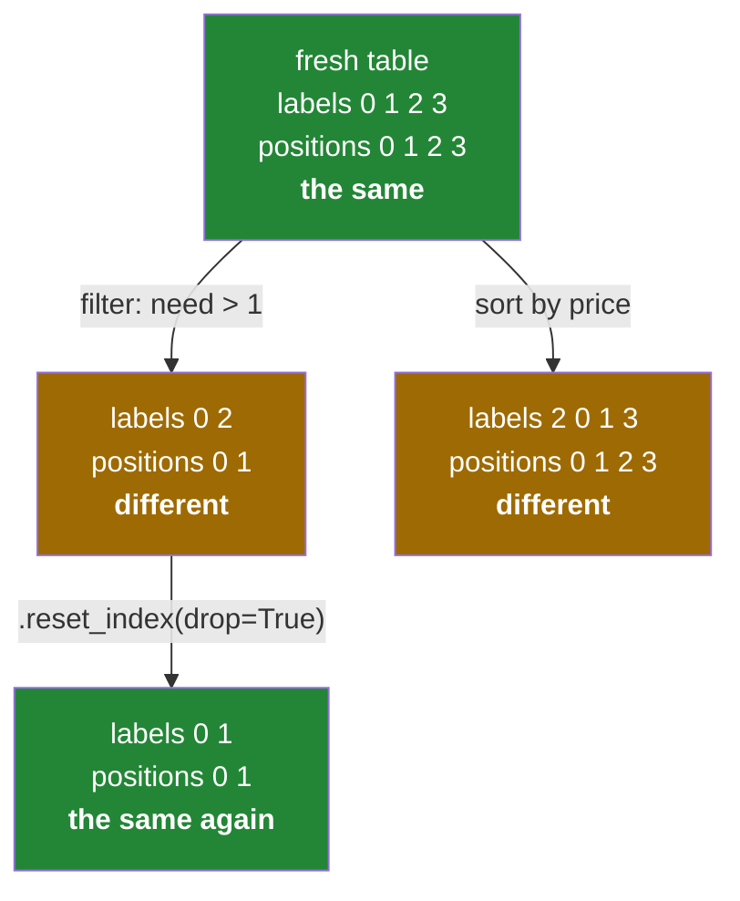

# 1.2 — The index is not a row number

## One-line answer

The default index looks like row numbers because it starts at zero and counts up, but it is a set of
**labels that stay attached to their rows for ever** — so after a filter or a sort, the label at
position 1 is usually not `1`.

---

## The story

A raffle at a school fair. Somebody prints a hundred tickets, numbered 1 to 100, and hands them out in
order. For the first hour, ticket number and position in the queue are the same thing: the twelfth
person to arrive is holding ticket 12.

Then people start leaving. Half the queue wanders off to the cake stall, and what is left is a shorter
queue holding tickets 3, 12, 41, 42, 78 and 90.

Now somebody says "call the second person". There are two completely different things they could
mean. They could mean the second person standing there, who is holding ticket 12. Or they could mean
ticket number 2, who went home an hour ago.

For the first hour nobody had to be careful, because the two answers were always the same. The moment
anybody left the queue, they stopped being the same — and the person calling out numbers did not
notice, because nothing about the queue looked different.

---

## The idea in plain language

When you build a Series or a table without saying what the labels should be, pandas supplies a
`RangeIndex`: 0, 1, 2, 3, and so on
([1.1](1.1-a-column-with-labels.md)). Because those labels start at zero and go up by one, they look
exactly like positions, and for a brand-new table they are.

They are not positions. They are **labels that happen to be numbers**, and pandas treats them as
labels for the rest of their life.

The difference shows up the first time rows are removed or reordered:

- **A filter keeps the labels of the rows that survived.** Take rows 0 and 2 out of a table of four,
  and the result has an index of `[0, 2]` — with no `1`, and a gap where it used to be. The rows have
  positions 0 and 1 now, but their labels are still 0 and 2.
- **A sort moves the rows and drags the labels with them.** Sort by price and the index might read
  `[2, 0, 1, 3]`. The label still identifies which original row this is; it just is not in order any
  more.

This is why pandas has two different ways to ask for a row, and why they are spelled differently:

- `.loc[...]` asks **by label** — "the row whose label is 1".
- `.iloc[...]` asks **by position** — "the row in slot 1, counting from the top of the table as it
  is right now".

On a fresh table both give the same answer, which is precisely what makes this trap so effective. On a
filtered table they give different answers, and sometimes one of them raises `KeyError` while the
other quietly returns the wrong row. Day 28 is devoted to the pair
([Day 28, 1.1](../../../day-28-selection-and-alignment/parts/01-label-and-position/1.1-two-ways-to-say-that-row.md));
today you only need to believe that they are different questions.

There is one more thing the index is for, and it is the reason pandas keeps labels around at all
rather than renumbering after every operation. **The index is what pandas lines two objects up by.**
When you add two Series, subtract one column from another, or join two tables, the labels decide which
value meets which. Renumbering after a filter would destroy that, which is why pandas refuses to do it
unless you ask ([Day 28, 4.2](../../../day-28-selection-and-alignment/parts/04-alignment/4.2-alignment-is-automatic.md)).

When you genuinely do want the labels thrown away and renumbered, the call is `reset_index(drop=True)`,
and the `drop=True` is not optional decoration — without it, the old labels are kept as a new column.

---

## Why Setu needs it

- **[1.3](1.3-a-table-of-columns.md), next**, gives every column of a table the same index, so this one
  object controls the whole table's alignment.
- **Day 28's alignment** is this idea doing useful work rather than causing surprise, and every `NaN`
  it produces traces back to a label that was in one object and not the other.
- **Day 30's missing-data handling** relies on the index surviving a filter, because that is how you
  put a cleaned column back where it came from.
- **Day 91 onwards**, `train_test_split` hands back frames with shuffled, gappy indexes. Code that
  assumes `df.loc[0]` is the first row breaks there, and the failure looks like a modelling bug rather
  than an indexing one.

---

## The mechanism

A fresh table, where labels and positions agree:

```python
import pandas as pd

shop = pd.DataFrame(
    {
        "item": ["milk", "bread", "eggs", "rice"],
        "need": [2, 1, 6, 1],
        "price": [1.15, 1.40, 0.32, 2.05],
    }
)
print(shop.index)
```

**Line by line:**

- `pd.DataFrame({...})` — a table built from a dictionary of columns, which
  [1.3](1.3-a-table-of-columns.md) takes apart properly. For now it is four rows and three columns.
- `shop.index` — a `RangeIndex`, printed as its start, stop and step rather than as a list of four
  numbers. **The compact printing is the clue that these are generated labels**, not something read
  from the data.

```text
RangeIndex(start=0, stop=4, step=1)
```

Now take the rows the flat needs more than one of, and watch the labels come along:

```python
import pandas as pd

shop = pd.DataFrame(
    {
        "item": ["milk", "bread", "eggs", "rice"],
        "need": [2, 1, 6, 1],
        "price": [1.15, 1.40, 0.32, 2.05],
    }
)
many = shop[shop["need"] > 1]
print(many)
print("index now:", many.index.tolist())
print("positions :", list(range(len(many))))
```

**Line by line:**

- `shop["need"] > 1` — a column of `True`/`False`, one per row, exactly like a NumPy comparison
  ([Day 21, 3.1](../../../day-21-indexing-and-views/parts/03-boolean-masks/3.1-a-comparison-makes-an-array.md)).
  Day 28 covers masks on frames properly
  ([Day 28, 2.1](../../../day-28-selection-and-alignment/parts/02-masks/2.1-a-comparison-makes-a-column.md)).
- `shop[mask]` — keeps the rows where the mask is `True`: milk and eggs.
- `many.index.tolist()` — `[0, 2]`. **The `1` is gone and there is a hole where it was.** Bread was
  row 1 and bread is not here, so no row is labelled 1 any more.
- `list(range(len(many)))` — `[0, 1]`, the positions. Two rows, so two positions, always counted from
  the top of the table as it stands now.
- The two lists are printed together on purpose. From here on, "the second row" is an ambiguous
  request.

```text
   item  need  price
0  milk     2   1.15
2  eggs     6   0.32
index now: [0, 2]
positions : [0, 1]
```

The same question asked both ways, on that filtered table:

```python
import pandas as pd

shop = pd.DataFrame(
    {
        "item": ["milk", "bread", "eggs", "rice"],
        "need": [2, 1, 6, 1],
        "price": [1.15, 1.40, 0.32, 2.05],
    }
)
many = shop[shop["need"] > 1]
print("many.iloc[1] ->", many.iloc[1]["item"])
try:
    print("many.loc[1]  ->", many.loc[1]["item"])
except KeyError as exc:
    print("many.loc[1]  -> KeyError:", exc)
```

**Line by line:**

- `many.iloc[1]` — position 1, the second row as it sits: **eggs**. `.iloc` always works as long as the
  table is long enough, because positions are always `0` to `len - 1`.
- `many.loc[1]` — label 1, which was bread, and bread was filtered out. There is no such label any
  more, so this raises `KeyError`.
- `try` / `except KeyError` — catching the specific exception rather than everything
  ([Day 18, 1.2](../../../day-18-exceptions/parts/01-raising-and-catching/1.2-try-except-and-catching-by-type.md)).
- **This is the good case.** `KeyError` is loud and stops the program. The dangerous version is a table
  where label 1 still exists but points at a different row than position 1 — then both calls succeed,
  return different rows, and nothing complains.

```text
many.iloc[1] -> eggs
many.loc[1]  -> KeyError: 1
```

Throwing the labels away, with and without `drop`:

```python
import pandas as pd

shop = pd.DataFrame(
    {
        "item": ["milk", "bread", "eggs", "rice"],
        "need": [2, 1, 6, 1],
        "price": [1.15, 1.40, 0.32, 2.05],
    }
)
many = shop[shop["need"] > 1]
print(many.reset_index())
print()
print(many.reset_index(drop=True))
```

**Line by line:**

- `reset_index()` — renumbers the rows 0, 1, 2, … **and keeps the old labels as a new column called
  `index`**. That column is often exactly what you want, because it records where each row came from.
  It is also a very common way to end up with a stray `index` column in a saved file.
- `reset_index(drop=True)` — renumbers and **throws the old labels away**. This is the one to reach for
  after a filter when the original row numbers mean nothing to anybody.
- Neither call changes `many`; both return a new table. That is the Copy-on-Write model that
  [3.1](../03-copy-on-write/3.1-every-result-behaves-like-a-copy.md) explains, and it is why the
  result has to be assigned to something to be kept.

```text
   index  item  need  price
0      0  milk     2   1.15
1      2  eggs     6   0.32

   item  need  price
0  milk     2   1.15
1  eggs     6   0.32
```

Sorting shows the same thing from the other direction — nothing is removed, and the labels still stop
matching the positions:

```python
import pandas as pd

shop = pd.DataFrame(
    {
        "item": ["milk", "bread", "eggs", "rice"],
        "need": [2, 1, 6, 1],
        "price": [1.15, 1.40, 0.32, 2.05],
    }
)
print(shop.sort_values("price"))
print("index after sort:", shop.sort_values("price").index.tolist())
```

**Line by line:**

- `sort_values("price")` — reorders the rows cheapest first. All four rows are still present.
- The printed index reads `2, 0, 1, 3`, straight down the left-hand side. **Those are not row numbers
  and never were**; they are the labels the rows have always had, now out of order.
- Reading the sorted table, the cheapest item is at position 0 and carries label 2. `sorted.iloc[0]`
  and `sorted.loc[2]` both find it, and `sorted.loc[0]` finds milk instead.

```text
    item  need  price
2   eggs     6   0.32
0   milk     2   1.15
1  bread     1   1.40
3   rice     1   2.05
index after sort: [2, 0, 1, 3]
```

The queue from the story, as the table sees it:



Green is where the two agree and it is safe to be sloppy. Every real pipeline spends almost all of its
time in the amber boxes.

---

## When it breaks

**The label that no longer exists:**

```text
$ uv run python -c "
import pandas as pd
shop = pd.DataFrame({'item': ['milk', 'bread', 'eggs', 'rice'], 'need': [2, 1, 6, 1]})
many = shop[shop['need'] > 1]
print(many.loc[1])
"
Traceback (most recent call last):
  ...
  File ".../pandas/core/indexes/base.py", line 3648, in get_loc
    raise KeyError(key) from err
KeyError: 1
```

**What it means.** Row 1 was bread; bread did not survive the filter; there is no label 1. The fix is
to decide which question you were actually asking. If you wanted the second remaining row, use
`many.iloc[1]`. If you wanted bread specifically, it is not in this table and the `KeyError` is
correct. If you want the labels renumbered so that `loc` and `iloc` agree again, call
`reset_index(drop=True)` immediately after the filter — and then never rely on the numbers meaning
anything about the original data.

**The stray column that `reset_index` left behind:**

```text
$ uv run python -c "
import pandas as pd
shop = pd.DataFrame({'item': ['milk', 'bread', 'eggs', 'rice'], 'need': [2, 1, 6, 1]})
clean = shop[shop['need'] > 1].reset_index()
print(clean.columns.tolist())
print(clean.reset_index().columns.tolist())
"
['index', 'item', 'need']
['level_0', 'index', 'item', 'need']
```

**What it means.** The first `reset_index()` added a column called `index`. The second one found that
name taken and invented `level_0`. Nothing raised, and the table now carries two columns of stale row
numbers that will be written to the next CSV and read back by somebody who assumes they mean
something. **`drop=True` is the default you want**; leaving it off should be a deliberate choice with a
reason.

**The silent version, which is the one that costs an evening:**

```text
$ uv run python -c "
import pandas as pd
shop = pd.DataFrame({'item': ['milk', 'bread', 'eggs', 'rice'], 'need': [2, 1, 6, 1]})
dear = shop.sort_values('need', ascending=False)
print('by position, the item we need most:', dear.iloc[0]['item'])
print('by label 0,  what you probably meant:', dear.loc[0]['item'])
"
by position, the item we need most: eggs
by label 0,  what you probably meant: milk
```

**What it means.** No exception, no warning, two different answers. After the sort, position 0 is eggs
and label 0 is still milk. Code written as `dear.loc[0]` during development on an unsorted table keeps
working, keeps returning a row, and starts returning the wrong one the day somebody adds a sort
upstream. This is the single best reason to write `.iloc` when you mean a position and `.loc` when you
mean a label, even in throwaway code — the habit is what protects you, because the failure has no
symptom.

---

## In production

**What a professional writes instead of the teaching version.** They set an index that *means*
something and then check it, rather than living with generated numbers:

```python
import pandas as pd


def keyed_by_item(shop: pd.DataFrame) -> pd.DataFrame:
    """Index the list by item name, refusing the two states that break lookups."""
    if shop["item"].isna().any():
        raise ValueError("an item name is missing; it cannot be used as a label")
    keyed = shop.set_index("item")
    if not keyed.index.is_unique:
        dupes = keyed.index[keyed.index.duplicated()].unique().tolist()
        raise ValueError(f"the same item appears twice: {dupes}")
    return keyed.sort_index()
```

**Line by line:**

- `set_index("item")` — promotes a real column to be the labels, so `keyed.loc["eggs"]` works and means
  something permanent. A meaningful index is the fix for the whole class of bug above: nobody
  accidentally writes `.loc["eggs"]` when they meant position 2.
- `isna().any()` checked **before** `set_index` — a missing value is allowed to become a label, and a
  `NaN` label is nearly impossible to look up, because `NaN` does not equal itself
  ([Day 20, 2.3](../../../day-20-arrays-and-dtypes/parts/02-dtypes/2.3-floats-nan-and-precision.md)).
  Catching it here gives a sentence that names the problem instead of a `KeyError` three functions
  later.
- `index.is_unique` — checked, not assumed. With a duplicated label, `keyed.loc["eggs"]` returns a
  **table** rather than a row, so every caller that expected one row silently starts handling several
  ([Day 28, 5.3](../../../day-28-selection-and-alignment/parts/05-reindexing/5.3-duplicate-labels.md)).
- `.sort_index()` — a sorted index lets pandas binary-search a label instead of scanning for it, and it
  makes any later `.loc` slice well defined. On a large frame this is the difference between a lookup
  that is instant and one that is linear.
- The function returns a new frame and never edits its argument, which is the boundary rule from
  [Day 25, 3.4](../../../day-25-copy-view-and-the-gate/parts/03-the-module/3.4-the-boundary-that-decides.md).

**What changes at scale.** A `RangeIndex` is three integers no matter how many rows there are, so it
costs nothing. Any other index costs memory proportional to the data, and a string index that is not
Arrow-backed costs a great deal ([2.3](../02-the-str-dtype/2.3-the-storage-behind-it.md)). The
practical rule in a large pipeline is to keep the cheap default index for everything except the steps
that genuinely need label lookups or alignment, and to sort the index when you do set one. The second
thing that changes is that `reset_index(drop=True)` after every filter stops being free — it rebuilds
the frame — so it belongs at the end of a cleaning stage rather than after each of its ten steps.

**The failure that only appears with real data.** A reporting job filtered out rows with missing prices
and then attached a list of freshly computed values with `df["score"] = scores`, where `scores` was a
plain NumPy array. On the developer's sample nothing was ever filtered, so the index had no gaps and
the values landed correctly. In production about 4% of rows were dropped, the array was assigned by
position while everything else in the frame was keyed by label, and the scores were **shifted relative
to the rows they described** from the first gap onward. Every number was plausible, no row was empty,
and the error was found six weeks later. Assigning a bare array into a frame ignores the index
entirely; assigning a Series aligns on it, and would have produced obvious `NaN`s instead of a silent
shift.

**The review comment a senior engineer leaves.** *"This does `.reset_index()` without `drop=True`, so
we are writing an `index` column into the Parquet file, and tomorrow somebody reads it back and joins
on it. Either drop it or give it a real name that says what it is."*

**The interview question.** *"What is the pandas index, and why does it trip people up?"* It is the set
of labels attached to the rows, not their positions. It looks like positions on a fresh frame because
the default is 0, 1, 2, …, and it stops looking like them after the first filter or sort, because
labels stay glued to their rows. That matters for two reasons: `.loc` and `.iloc` ask genuinely
different questions and only agree by coincidence, and the index is what pandas aligns on when it
combines two objects — so a mismatched index is where surprise `NaN`s come from.

---

## Check yourself

```bash
uv run python -c "
import pandas as pd
shop = pd.DataFrame({'item': ['milk', 'bread', 'eggs', 'rice'], 'need': [2, 1, 6, 1]})
many = shop[shop['need'] > 1]
print('labels   :', many.index.tolist())
print('positions:', list(range(len(many))))
print('iloc[1]  :', many.iloc[1]['item'])
print('after reset:', many.reset_index(drop=True).index.tolist())
print('sorted labels:', shop.sort_values('need').index.tolist())
"
```

Run it, then change `many.iloc[1]` to `many.loc[1]` and predict the output before you press enter.

**Answer out loud, without scrolling up:**

> After a filter, what is the difference between the label `1` and the position `1`? Then say which of
> the two can raise `KeyError`, and why the other one is more dangerous.

---

**Next:** [1.3 — A table of columns — the DataFrame](1.3-a-table-of-columns.md).
