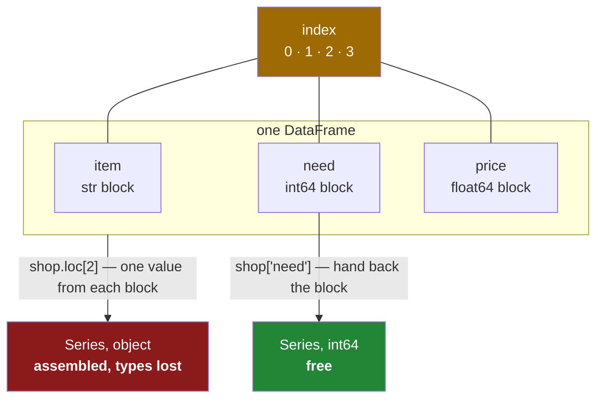

# 1.3 — A table of columns — the DataFrame

## One-line answer

A **DataFrame** is a set of Series that share one index — it is stored as columns, not as rows, which
is why taking a column is free and taking a row is not.

---

## The story

The shopping list on the fridge grew. It started as four items and four numbers, and then somebody
added a second number to each line — what the item cost last time — so they could work out roughly
what the shop would come to.

The envelope now reads:

```text
milk    2   1.15
bread   1   1.40
eggs    6   0.32
rice    1   2.05
```

Ask somebody what the whole list costs and watch what they do with their finger. They run it **down**
the right-hand column, not across the rows. Ask them what is on the list and the finger goes down the
left column instead.

Now ask them about eggs, and something different happens: the finger goes across. It has to stop at
each column in turn and pick one thing out of each. Reading a column is one smooth movement. Reading a
row is three separate jumps.

Nobody notices that difference on an envelope with four lines. On a file with four million lines it is
the difference between a job that finishes and a job that does not.

---

## The idea in plain language

A **DataFrame** is a table: named columns, labelled rows.

The important part is how it is stored. A DataFrame is **a set of Series that all share the same
index** ([1.1](1.1-a-column-with-labels.md)). Each column is its own block of memory with its own
dtype, and one index object sits alongside them all, labelling the rows
([1.2](1.2-the-index-is-not-a-row-number.md)).

That is the opposite of how people picture a table. A spreadsheet feels like a stack of rows, and a
database is often described as a list of records. A DataFrame is neither. It is a stack of columns
standing side by side, and the row is the thing that has to be assembled on demand.

Two consequences follow, and between them they explain most of what pandas is good and bad at.

**Taking a column is free.** `shop["price"]` hands back the Series that is already sitting there. No
data is copied and nothing is computed.

**Taking a row is work, and it changes the dtype.** A row crosses every column, so its values come
from different blocks and are of different kinds — a word from one, a whole number from another, a
decimal from a third. The Series that comes back has to hold all of them, so its dtype falls back to
`object`, the dtype that can hold anything and is good at nothing
([2.1](../02-the-str-dtype/2.1-text-used-to-be-object.md)). The row's **index is the column names**,
which reads strangely the first time and is the only sensible answer once you see that a row is a
Series like any other.

This is why "never loop over rows" is the first piece of pandas advice everybody is given, and why
**Day 29** spends a whole day timing it. The advice is not superstition; it is a direct consequence of
the storage.

There are three common ways a DataFrame comes into being, and it is worth knowing all three because
they behave differently:

- **From a dictionary of columns** — the keys become column names, the values become columns. This is
  what the mechanism below uses, and it is how most teaching examples are written.
- **From a list of records** — a list of dictionaries, one per row. This is the shape data arrives in
  from an API or a JSON file, and pandas transposes it into columns for you
  ([Day 27, 2.1](../../../day-27-reading-and-writing/parts/02-json/2.1-nested-by-nature.md)).
- **From a dictionary of Series** — and here pandas does something you must know about before it
  surprises you. It **aligns the Series on their labels** rather than stacking them by position, so
  the result's index is the union of theirs, and any label missing from one of them becomes a `NaN`.
  That is Day 28's whole subject arriving early
  ([Day 28, 4.1](../../../day-28-selection-and-alignment/parts/04-alignment/4.1-two-lists-different-items.md)).

In practice you will rarely build one by hand at all. Day 27 reads them from files, which is where
real tables come from.

---

## Why Setu needs it

- **[1.4](1.4-one-dtype-per-column.md), next**, is about the fact that each column carries its own
  dtype — which only makes sense once you know the table is stored as columns.
- **[3.1](../03-copy-on-write/3.1-every-result-behaves-like-a-copy.md)** explains why taking a column
  and writing to it does not do what you expect, and the answer is column storage again.
- **Day 27** hands back one of these from every file it opens.
- **Day 31's `groupby`** is fast because it works down columns; the same logic written across rows is
  hundreds of times slower.
- **Day 35's comparison with Polars and DuckDB** is a comparison of column stores, and the whole
  argument is unreadable without this document.

---

## The mechanism

The list, as a table:

```python
import pandas as pd

shop = pd.DataFrame(
    {
        "item": ["milk", "bread", "eggs", "rice"],
        "need": [2, 1, 6, 1],
        "price": [1.15, 1.40, 0.32, 2.05],
    }
)
print(shop)
print("shape:", shop.shape, "| columns:", shop.columns.tolist(), "| index:", shop.index.tolist())
```

**Line by line:**

- `pd.DataFrame({...})` — a dictionary of columns. **Each key is a column name and each value becomes
  one Series.** The dictionary's insertion order is the column order, which has been guaranteed since
  Python 3.7 ([Day 8, 2.3](../../../day-08-containers/parts/02-sets-and-dicts/2.3-a-dict-is-ordered-now.md)).
- All three lists are the same length, so pandas gives them a shared `RangeIndex` of 0 to 3. Lists of
  different lengths raise, because there is no label information to align them by.
- `shop.shape` — `(4, 3)`, **rows first then columns**, the same convention as a two-dimensional NumPy
  array ([Day 20, 1.2](../../../day-20-arrays-and-dtypes/parts/01-the-block/1.2-shape-dtype-and-the-rest.md)).
- `shop.columns` — an `Index` object, exactly like the row index but running across the top. Column
  names are labels too, which is why they can be looked up, sliced and reordered the same way.
- `shop.index` — the row labels, shared by all three columns. **One index for the whole table** is what
  makes a DataFrame a table rather than three unrelated Series.

```text
    item  need  price
0   milk     2   1.15
1  bread     1   1.40
2   eggs     6   0.32
3   rice     1   2.05
shape: (4, 3) | columns: ['item', 'need', 'price'] | index: [0, 1, 2, 3]
```

A column out, and a row out, so the difference is visible:

```python
import pandas as pd

shop = pd.DataFrame(
    {
        "item": ["milk", "bread", "eggs", "rice"],
        "need": [2, 1, 6, 1],
        "price": [1.15, 1.40, 0.32, 2.05],
    }
)
col = shop["need"]
print(type(col).__name__, "| name:", col.name, "| index:", col.index.tolist())
print()
row = shop.loc[2]
print(row)
print("its index is the column names:", row.index.tolist())
print("its dtype:", row.dtype)
```

**Line by line:**

- `shop["need"]` — square brackets on a DataFrame with a string inside mean **give me that column**.
  The result is a Series whose `name` is the column name and whose index is the table's row index.
  Nothing is copied; this is the column that was already there.
- `shop.loc[2]` — label 2, so the row for eggs
  ([1.2](1.2-the-index-is-not-a-row-number.md)). It comes back as a Series too.
- `row.index.tolist()` — `['item', 'need', 'price']`. **The row's labels are the column names.** A row
  is a Series across the table rather than down it, so its labels have to be the things that name the
  positions it crossed.
- `row.dtype` — `object`, and this is the line that matters. The row holds `'eggs'`, `6` and `0.32`,
  which have nothing in common, so the only dtype that can hold all three is the one that holds
  pointers to arbitrary Python objects. **Pulling a row out of a well-typed table collapses three
  dtypes into one**, and the one it collapses to is always the widest. That is why a loop over rows is
  slow: each step builds a fresh Series object and unifies the dtypes of every column to do it, and
  none of that work is what you asked for. It is also why the unification can change a value outright,
  which the failure below shows.
- `Name: 2` in the printed output is the row's label, taking the place the column name held above.

```text
Series | name: need | index: [0, 1, 2, 3]

item     eggs
need        6
price    0.32
Name: 2, dtype: object
its index is the column names: ['item', 'need', 'price']
its dtype: object
```

The other two ways one gets built. First from records, the shape an API returns:

```python
import pandas as pd

rows = [{"item": "milk", "need": 2}, {"item": "bread", "need": 1}]
print(pd.DataFrame(rows))
```

**Line by line:**

- A **list of dictionaries**, one per row, each with the same keys. pandas collects the keys across all
  the dictionaries to make the columns and fills in `NaN` wherever a dictionary was missing one.
- This is the one construction that is genuinely row-shaped, and pandas transposes it into columns as
  it builds. That transposition is the cost of the convenience, and on a large list it is the slowest
  way to build a frame.

```text
    item  need
0   milk     2
1  bread     1
```

And from a dictionary of Series, where the labels are in charge:

```python
import pandas as pd

a = pd.Series([2, 1], index=["milk", "bread"])
b = pd.Series([1.15, 1.40, 0.32], index=["milk", "bread", "eggs"])
print(pd.DataFrame({"need": a, "price": b}))
```

**Line by line:**

- Two Series of **different lengths and different labels**, which would be an error if pandas stacked
  them by position. It does not.
- pandas takes the **union of the two indexes** — milk, bread, eggs — and lines each Series up against
  it by label. The result is sorted, because the union of two unordered label sets has no other
  natural order.
- `eggs` has a price but no count, so its `need` is `NaN`.
- **`need` is now `float64`, not `int64`.** `NaN` is a floating-point value and there is no room for it
  in an integer column, so the whole column is widened to hold it
  ([Day 20, 2.3](../../../day-20-arrays-and-dtypes/parts/02-dtypes/2.3-floats-nan-and-precision.md)).
  Counts printed as `1.0` and `2.0` are the visible symptom, and
  [2.5](../02-the-str-dtype/2.5-the-missing-value-in-a-text-column.md) shows the dtype that avoids it.

```text
       need  price
bread   1.0   1.40
eggs    NaN   0.32
milk    2.0   1.15
```

Adding a column, which is the operation that makes a frame feel like a spreadsheet:

```python
import pandas as pd

shop = pd.DataFrame(
    {
        "item": ["milk", "bread", "eggs", "rice"],
        "need": [2, 1, 6, 1],
        "price": [1.15, 1.40, 0.32, 2.05],
    }
)
shop["total"] = shop["need"] * shop["price"]
print(shop)
```

**Line by line:**

- `shop["need"] * shop["price"]` — two Series multiplied elementwise, giving a new Series with the same
  index. Because both come from the same frame their labels already match, so the alignment is
  invisible here; it is very much not invisible when the two Series come from different places.
- `shop["total"] = ...` — assignment to a **column that does not exist yet** creates it. This is the one
  form of writing to a frame that is always safe and always does what it looks like, which is worth
  holding on to while [section 4](../04-chained-assignment/4.1-the-write-that-vanished.md) takes apart
  the forms that are not.
- The new column is appended on the right, and its dtype is `float64` because a count times a price is
  a decimal.
- Assigning a **Series** here aligns on the index; assigning a plain list or NumPy array of the right
  length does not, and puts values in by position. That distinction has ruined more afternoons than
  any other in this library.

```text
    item  need  price  total
0   milk     2   1.15   2.30
1  bread     1   1.40   1.40
2   eggs     6   0.32   1.92
3   rice     1   2.05   2.05
```

How the table is really laid out:



Green is the direction the storage is built for. Red is the direction that has to be assembled, and it
is the one every beginner reaches for first.

---

## When it breaks

**Columns of different lengths:**

```text
$ uv run python -c "
import pandas as pd
pd.DataFrame({'item': ['milk', 'bread', 'eggs'], 'need': [2, 1]})
"
Traceback (most recent call last):
  ...
ValueError: All arrays must be of the same length
```

**What it means.** Plain lists carry no labels, so pandas has no way to know which count belongs to
which item, and it refuses instead of padding with `NaN`. Note how different this is from the
dictionary-of-Series case above, which had exactly the same mismatch and filled it silently — **the
Series carried labels, so alignment was possible**. If you want the forgiving behaviour, give your data
an index first.

**The column name that is not there:**

```text
$ uv run python -c "
import pandas as pd
shop = pd.DataFrame({'item': ['milk', 'bread'], 'need': [2, 1]})
print(shop['Need'])
"
Traceback (most recent call last):
  ...
KeyError: 'Need'
```

**What it means.** Column names are labels and labels are exact: `Need` is not `need`. The commonest
real cause is a spreadsheet exported with a trailing space in a heading, which is invisible in every
error message. `shop.columns.tolist()` prints them with their quotes so the space shows, and
`df.columns = df.columns.str.strip()` immediately after reading a file is a standard defensive line
([Day 27, 1.2](../../../day-27-reading-and-writing/parts/01-the-csv/1.2-read-csv-and-what-it-guessed.md)).

**The row that changed a number on the way out:**

```text
$ uv run python -c "
import pandas as pd
big = pd.DataFrame({'id': [9007199254740993], 'score': [0.5]})
print('stored id   :', big['id'].iloc[0])
print('via the row :', big.loc[0]['id'], 'dtype', big.loc[0].dtype)
print('equal?      :', big.loc[0]['id'] == big['id'].iloc[0])
"
stored id   : 9007199254740993
via the row : 9007199254740992.0 dtype float64
equal?      : True
```

**What it means.** This frame has no text column, so every value in the row *can* share one dtype — and
the only dtype that holds both an `int64` and a `float64` is `float64`. Pulling the row therefore
converts the id to a floating-point number, and that particular id is one digit past the largest whole
number a `float64` can represent exactly, so it comes back **ending in 2 instead of 3**
([Day 20, 2.3](../../../day-20-arrays-and-dtypes/parts/02-dtypes/2.3-floats-nan-and-precision.md)).

The last line is the cruel part. The equality check says `True`, because comparing an integer with a
float converts the integer to a float first, and both sides then round to the same value. **The
obvious test for this bug reports that the bug is not there.** Read the id out of its column and it is
exact; read it out of a row and it is not. This is why identifiers should be read column-wise, and why
a column of ids is better off as `str` than as a wide integer if anything is ever going to take a row
from that frame.

---

## In production

**What a professional writes instead of the teaching version.** Nobody hand-builds a frame in
production code, but everybody writes the function that checks one on arrival:

```python
import pandas as pd

REQUIRED = {"item": "str", "need": "int64", "price": "float64"}


def check_shape(shop: pd.DataFrame) -> pd.DataFrame:
    """Refuse a shopping list that is not the table the rest of the code expects."""
    missing = REQUIRED.keys() - set(shop.columns)
    if missing:
        raise ValueError(f"missing columns: {sorted(missing)}")
    wrong = {
        name: str(shop[name].dtype)
        for name, want in REQUIRED.items()
        if str(shop[name].dtype) != want
    }
    if wrong:
        raise TypeError(f"wrong dtypes: {wrong}, wanted {REQUIRED}")
    if shop.empty:
        raise ValueError("the shopping list is empty")
    return shop
```

**Line by line:**

- `REQUIRED` as a module-level dictionary — the schema written down in one place, so the check and the
  error message cannot disagree. Day 27 makes this same mapping do double duty as the `dtype=` argument
  to `read_csv` ([Day 27, 1.4](../../../day-27-reading-and-writing/parts/01-the-csv/1.4-dtype-at-read-time.md)).
- `REQUIRED.keys() - set(shop.columns)` — set difference between the names wanted and the names
  present. Using a set means the check does not care about column order, which is right: a DataFrame's
  columns are labels, and depending on their order is a bug waiting for somebody to add a column
  ([Day 8, 2.2](../../../day-08-containers/parts/02-sets-and-dicts/2.2-set-algebra.md)).
- Checking the **names before the dtypes** — otherwise `shop[name]` raises `KeyError` inside the dtype
  comparison and the caller gets a worse message than the one this function was written to give.
- `str(shop[name].dtype) != want` — compared as text. dtype objects compare oddly against strings in
  some cases, and `str()` on both sides makes the comparison mean exactly what it looks like.
- Collecting **all** the wrong dtypes into one dictionary before raising, rather than raising on the
  first. Somebody fixing a broken export wants the whole list, not one item per run.
- `shop.empty` — checked last and separately, because an empty frame can have perfectly correct columns
  and dtypes. Almost every aggregation downstream returns `NaN` on it rather than failing
  ([Day 23, 2.1](../../../day-23-ufuncs-and-statistics/parts/02-statistics/2.1-a-reduction-turns-many-into-one.md)).
- Returning `shop` unchanged, so the check can be dropped into a chain of calls without an extra
  statement.

**What changes at scale.** The column store stops being an implementation detail and becomes the
thing you design around. Reading five columns out of a two-hundred-column Parquet file costs
five-column time, because the columns are separate on disk too
([Day 27, 3.4](../../../day-27-reading-and-writing/parts/03-parquet/3.4-column-pruning.md)). Adding a
column to a wide frame in a loop, on the other hand, gets slower every iteration, because each
assignment can force the frame's internal blocks to be rebuilt — the fix is to collect the new columns
in a dictionary and attach them once with `df.assign(**cols)` or `pd.concat(axis=1)`. And a row-wise
`apply` over ten million rows creates ten million `object` Series; it is not slow because Python is
slow, it is slow because it is building ten million temporary objects that the column store went to
great trouble to avoid.

**The failure that only appears with real data.** A team's ingest built its frame with
`pd.DataFrame(list_of_dicts)`. It worked for two years. Then an upstream service began omitting an
optional field for some records instead of sending it as `null`, and the resulting column had `NaN`
for those rows — which was correct and expected. What was not expected was that on the days when
**every** record omitted the field, the column was not created at all, and the downstream
`df["discount"]` raised `KeyError` rather than returning a column of `NaN`. **A frame built from
records has a schema that depends on the data**, so the columns can change from run to run. Passing
`columns=` explicitly to the constructor, or reindexing to a known schema straight after, is what makes
it stable.

**The review comment a senior engineer leaves.** *"You are iterating rows here to build `total`. That
is a column operation — `df['need'] * df['price']` — and it will be about a hundred times faster and
three lines shorter. Also every row you pull out is an `object` Series, so you are silently converting
every price to a Python float and back."*

**The interview question.** *"How is a DataFrame stored, and why does it matter?"* As columns: each
column is its own typed block, and one shared index labels the rows. It matters because it makes
column operations cheap and row operations expensive — taking a column hands back an existing block,
while taking a row has to gather one value from each block and box them into an `object` Series that
has lost every dtype. That is the mechanical reason behind "vectorise, do not loop over rows", and it
is also why the columnar file formats pair so naturally with pandas.

---

## Check yourself

```bash
uv run python -c "
import pandas as pd
shop = pd.DataFrame({'item': ['milk', 'bread', 'eggs', 'rice'],
                     'need': [2, 1, 6, 1],
                     'price': [1.15, 1.40, 0.32, 2.05]})
print('shape       :', shop.shape)
print('col dtype   :', shop['need'].dtype)
print('row dtype   :', shop.loc[2].dtype)
print('row labels  :', shop.loc[2].index.tolist())
print('col labels  :', shop['need'].index.tolist())
"
```

The third and second lines disagree about the dtype of the same table. Say why that is correct.

**Answer out loud, without scrolling up:**

> Is a DataFrame stored as rows or as columns, and what are the two consequences of the answer? Then
> say what the index of a single row is, and why.

---

**Next:** [1.4 — One dtype per column, not one per table](1.4-one-dtype-per-column.md).
