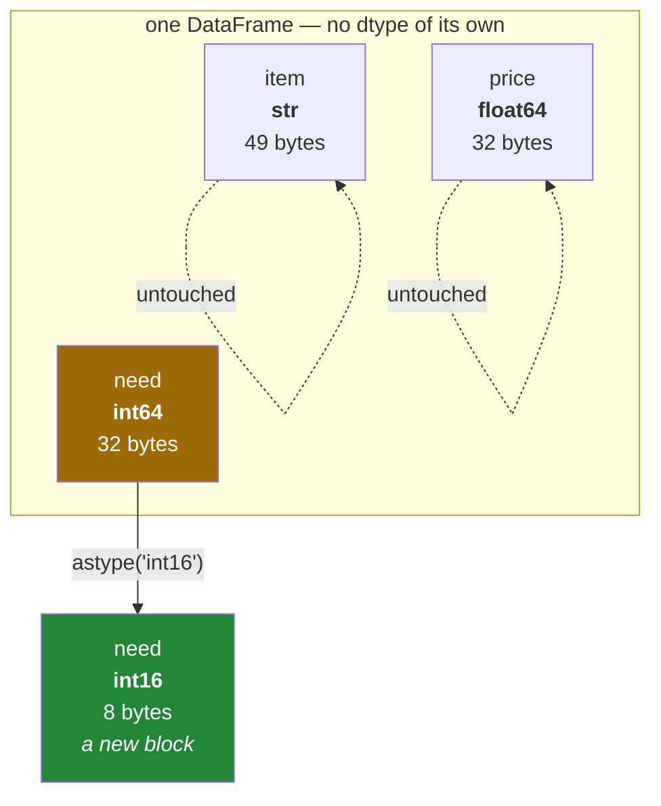

# 1.4 — One dtype per column, not one per table

## One-line answer

Every column carries its own dtype and its own block of memory, so a table can hold text next to whole
numbers next to decimals — and `astype` changes a column by building a new one, never by editing the
old one in place.

---

## The story

The flat has a drawer for kitchen things. Someone once tried to keep everything in one long box: the
forks, the tea towels, the takeaway menus. It technically worked. Finding a fork meant lifting out
menus.

What replaced it was four smaller boxes side by side in the same drawer. One holds only forks, so it
is a shallow box with dividers. One holds only tea towels, so it is deep and soft-sided. One holds
menus, so it is flat and wide.

Each box is the right shape for what goes in it, and that is only possible because each box holds one
kind of thing. The drawer as a whole holds four kinds of thing — but no single box does.

Nobody planned this. It is just what happens when you stop asking "what container fits everything" and
start asking "what container fits this".

---

## The idea in plain language

A NumPy array has one dtype for the whole thing, because it is one block of memory
([Day 20, 2.1](../../../day-20-arrays-and-dtypes/parts/02-dtypes/2.1-a-dtype-is-a-promise.md)). That is
a real limitation. A table of real data almost never has one kind of value in it: there is a name, a
count, a price and a date, and no single dtype holds all four well.

A DataFrame gets around this by not being one block. It is a set of columns standing side by side
([1.3](1.3-a-table-of-columns.md)), and **each column is its own array with its own dtype**. The table
has no dtype of its own; asking for `df.dtypes` gives you one answer per column, as a Series whose
index is the column names.

That is the whole idea, and three practical things follow from it.

**You choose the type per column, so the choice is cheap and local.** Making one column narrower does
not touch the others. A count that never exceeds a few hundred can be `int16` while the price beside it
stays `float64`.

**`astype` builds a new column rather than editing the existing one.** Changing a dtype means changing
how many bytes each value takes and how they are laid out, and there is no way to do that inside the
memory the old column already occupies. So `astype` allocates a new block, converts every value into
it, and hands back a new object — exactly as NumPy's `astype` does
([Day 20, 2.4](../../../day-20-arrays-and-dtypes/parts/02-dtypes/2.4-astype-and-the-copy.md)). The
original is untouched, which means **`df.astype(...)` on its own does nothing to `df`**; you have to
keep the result.

**A column that cannot decide falls back to `object`.** If pandas cannot find one dtype that fits every
value in a column, it uses `object`, which stores a pointer to a Python object per element. Everything
still works and everything is slower and larger. Section 2 is about the most common case of this — text
— and what pandas 3.0 changed about it ([2.1](../02-the-str-dtype/2.1-text-used-to-be-object.md)).

One more piece of vocabulary, because you will meet it constantly: **`select_dtypes`** picks columns by
their type rather than by name. "Every numeric column" is a thing you want to say roughly once per
analysis, and it is a much better thing to say than a hand-written list of names that goes stale the
moment somebody adds a column.

---

## Why Setu needs it

- **[1.5](1.5-reading-a-frame-before-you-touch-it.md), next**, is a tour of `info()`, which is mostly a
  report about exactly this: one dtype per column, and how much each one costs.
- **[Section 2](../02-the-str-dtype/2.1-text-used-to-be-object.md)** is the story of one particular
  dtype changing in pandas 3.0, which only makes sense if dtypes are per column.
- **Day 27** sets these at read time rather than fixing them afterwards, which is the whole point of
  that day ([Day 27, 1.4](../../../day-27-reading-and-writing/parts/01-the-csv/1.4-dtype-at-read-time.md)).
- **Day 30's missing-data work** turns on which dtypes can hold a missing value at all, and integers
  famously cannot.
- **Day 76 onwards**, every feature-engineering step begins by splitting the columns into numeric and
  categorical, and `select_dtypes` is how that split is written.

---

## The mechanism

The table reports one dtype per column:

```python
import pandas as pd

shop = pd.DataFrame(
    {
        "item": ["milk", "bread", "eggs", "rice"],
        "need": [2, 1, 6, 1],
        "price": [1.15, 1.40, 0.32, 2.05],
    }
)
print(shop.dtypes)
```

**Line by line:**

- `shop.dtypes` — a **Series**, not a single value. Its index is the column names and its values are
  the dtypes, which is the natural shape once you accept that dtypes are a per-column fact.
- `item` is `str`, which is new in pandas 3.0 and would have been `object` in every earlier version.
  Section 2 is about that change ([2.2](../02-the-str-dtype/2.2-str-the-dtype-pandas-3-infers.md)).
- `need` is `int64` and `price` is `float64`, both inferred the same way NumPy infers them
  ([Day 20, 3.1](../../../day-20-arrays-and-dtypes/parts/03-creating/3.1-np-array-and-what-it-infers.md)).
- The final `dtype: object` line is the dtype **of the `dtypes` Series itself**, not of the table. It
  is `object` because it holds dtype objects. This line confuses everybody once, and never twice.

```text
item         str
need       int64
price    float64
dtype: object
```

What each column costs, separately:

```python
import pandas as pd

shop = pd.DataFrame(
    {
        "item": ["milk", "bread", "eggs", "rice"],
        "need": [2, 1, 6, 1],
        "price": [1.15, 1.40, 0.32, 2.05],
    }
)
print(shop.memory_usage(deep=True))
```

**Line by line:**

- `memory_usage()` — bytes per column, again as a Series indexed by column name. The per-column answer
  is the only honest one, because the columns are genuinely separate allocations.
- `deep=True` — **this argument matters and the default does not do what you want.** Without it, a
  column that stores pointers reports only the size of the pointers, not the objects they point at, so
  a text column can under-report its size by a factor of ten. Always pass it when you are asking the
  question seriously.
- `Index    132` — the index is counted too, and here it is by far the largest entry. That is a
  four-row table, so the fixed overhead dominates; at four million rows it would not.
- `need` and `price` are 32 bytes each: four values, eight bytes each, which is exactly what `int64`
  and `float64` promise ([Day 20, 1.2](../../../day-20-arrays-and-dtypes/parts/01-the-block/1.2-shape-dtype-and-the-rest.md)).
- `item` is 49 bytes for four short words, because Arrow-backed text stores the characters end to end
  plus an offset per value ([2.3](../02-the-str-dtype/2.3-the-storage-behind-it.md)).

```text
Index    132
item      49
need      32
price     32
dtype: int64
```

Picking columns by type rather than by name:

```python
import pandas as pd

shop = pd.DataFrame(
    {
        "item": ["milk", "bread", "eggs", "rice"],
        "need": [2, 1, 6, 1],
        "price": [1.15, 1.40, 0.32, 2.05],
    }
)
print("numbers:", shop.select_dtypes("number").columns.tolist())
print("text   :", shop.select_dtypes("str").columns.tolist())
```

**Line by line:**

- `select_dtypes("number")` — `"number"` is a family, not a single dtype: it matches every integer and
  float width at once. That is what you want, because the alternative is listing `int8`, `int16`,
  `int32`, `int64`, `float32`, `float64` and getting it wrong.
- `select_dtypes("str")` — the pandas 3.0 text dtype. On an older codebase this line was
  `select_dtypes("object")`, and [2.4](../02-the-str-dtype/2.4-dtypes-equals-object-finds-nothing.md)
  is about what happens to that line now.
- It returns a **DataFrame**, not a list of names, so `.columns.tolist()` is only here to print it
  compactly. In real code you use the frame directly.
- There is an `exclude=` argument as well, and `select_dtypes(exclude="number")` is often the clearer
  way to say "everything that is not a measurement".

```text
numbers: ['need', 'price']
text   : ['item']
```

`astype`, and the copy it makes:

```python
import pandas as pd

shop = pd.DataFrame(
    {
        "item": ["milk", "bread", "eggs", "rice"],
        "need": [2, 1, 6, 1],
        "price": [1.15, 1.40, 0.32, 2.05],
    }
)
narrow = shop.astype({"need": "int16"})
print(narrow.dtypes.to_dict())
print("original unchanged:", shop["need"].dtype)
print(
    "bytes need int64:",
    shop["need"].memory_usage(deep=True, index=False),
    "int16:",
    narrow["need"].memory_usage(deep=True, index=False),
)
```

**Line by line:**

- `astype({"need": "int16"})` — a **dictionary** of column name to dtype, so only the named columns are
  converted and the rest are passed through. The other form, `astype("int16")` with a bare dtype, tries
  to convert *every* column and fails on the text one.
- `narrow.dtypes.to_dict()` — printed as a dictionary so all three fit on one line. Note that `item`
  survives as `str` and `price` as `float64`: **converting one column left the others alone**, which is
  the point of the whole document.
- `shop["need"].dtype` — still `int64`. `astype` returned a new frame and did not touch the old one.
  Forgetting to assign the result is the most common mistake with this method, and it fails silently
  because the original still works
  ([3.1](../03-copy-on-write/3.1-every-result-behaves-like-a-copy.md)).
- `memory_usage(..., index=False)` — the index excluded, so the two numbers compare like with like.
  32 bytes against 8: four values at eight bytes each, against four values at two bytes each. **The
  saving is exactly the ratio of the widths**, with nothing else going on.
- `int16` holds −32 768 to 32 767. Choosing it is a promise about the data, and a count that later
  exceeds it wraps silently rather than raising
  ([Day 20, 2.2](../../../day-20-arrays-and-dtypes/parts/02-dtypes/2.2-integers-and-the-silent-wrap.md)).

```text
{'item': <StringDtype(na_value=nan)>, 'need': dtype('int16'), 'price': dtype('float64')}
original unchanged: int64
bytes need int64: 32 int16: 8
```

The drawer, drawn:



`astype` produces the green box. The old amber box is still there until nothing refers to it any more.

---

## When it breaks

**The conversion that was thrown away:**

```text
$ uv run python -c "
import pandas as pd
shop = pd.DataFrame({'item': ['milk', 'bread'], 'need': [2, 1]})
shop.astype({'need': 'int16'})
print('dtype after astype:', shop['need'].dtype)
"
dtype after astype: int64
```

**What it means.** Nothing raised, nothing warned, and nothing changed. `astype` returned a converted
frame and the program dropped it on the floor. The fix is `shop = shop.astype({...})`, and the reason
this bites so often is that the line *looks* like a command rather than an expression. Almost every
pandas method behaves this way, which is [section 3](../03-copy-on-write/3.1-every-result-behaves-like-a-copy.md)'s
subject; the small habit that prevents it is to read every pandas call as a question that returns an
answer, not an instruction that changes something.

**The text that will not become a number:**

```text
$ uv run python -c "
import pandas as pd
prices = pd.Series(['1.15', '1.40', 'free'])
print(prices.astype('float64'))
"
Traceback (most recent call last):
  ...
ValueError: could not convert string to float: 'free'
```

**What it means.** One value in a column of prices is the word `free`, and `astype` refuses the whole
column because of it. This is the right behaviour and it is much better than the alternative: a
conversion that silently turned `free` into `0.0` would put a wrong number into a total that somebody
trusts. The fix is `pd.to_numeric(prices, errors="coerce")`, which converts what it can and puts `NaN`
where it cannot — and then you decide what a missing price means, which is Day 30's subject. **Choose
between them deliberately**: `astype` is "I promise these are all numbers", and `to_numeric(...,
errors="coerce")` is "some of these are not, and I want to see which".

**The narrowing that wrapped:**

```text
$ uv run python -c "
import pandas as pd
counts = pd.Series([2, 40000, 6])
print('as int64:', counts.tolist())
print('as int16:', counts.astype('int16').tolist())
"
as int64: [2, 40000, 6]
as int16: [2, -25536, 6]
```

**What it means.** 40 000 does not fit in an `int16`, whose largest value is 32 767, so the bits that
did not fit were discarded and what is left reads as a negative number
([Day 20, 2.2](../../../day-20-arrays-and-dtypes/parts/02-dtypes/2.2-integers-and-the-silent-wrap.md)).
There is no exception and no warning. A count became negative and every sum, mean and threshold
downstream is now wrong in a way that a range check would catch and a type check would not. Narrowing a
dtype to save memory is a real technique, and it is only safe when you have checked the actual maximum
of the actual data — `counts.max()` before, and `counts.equals(narrowed)` after, are both one-liners.

---

## In production

**What a professional writes instead of the teaching version.** A narrowing helper that refuses to lose
information, rather than one that hopes:

```python
import pandas as pd


def narrow_ints(frame: pd.DataFrame) -> pd.DataFrame:
    """Shrink every integer column to the smallest width that still holds its values."""
    out = frame.copy()
    for name in frame.select_dtypes("integer").columns:
        column = frame[name]
        smaller = pd.to_numeric(column, downcast="unsigned" if column.min() >= 0 else "integer")
        if not smaller.astype(column.dtype).equals(column):
            raise ValueError(f"narrowing {name} changed its values")
        out[name] = smaller
    return out
```

**Line by line:**

- `frame.copy()` — an explicit copy up front, so the loop writes into something this function owns and
  the caller's frame is never touched
  ([Day 25, 3.4](../../../day-25-copy-view-and-the-gate/parts/03-the-module/3.4-the-boundary-that-decides.md)).
- `select_dtypes("integer")` — the integer family only. Narrowing floats is a different decision with
  different risks, and mixing the two into one helper would fail the one-idea test.
- `pd.to_numeric(..., downcast=...)` rather than `astype` — `downcast` asks pandas to **pick** the
  smallest width that fits, instead of naming one and hoping. That removes the guess that produced the
  wrapped value above.
- `"unsigned" if column.min() >= 0 else "integer"` — a column that is never negative gets twice the
  range from the same bytes. Counts, ids and quantities are almost always non-negative, and this is
  where the saving actually comes from.
- `smaller.astype(column.dtype).equals(column)` — **the check that makes this safe.** The narrowed
  column is widened straight back and compared with the original: if anything wrapped, the round trip
  does not land on the value it started from. The `astype` back is not decoration —
  `Series.equals` requires the dtypes to match as well as the values, so comparing `uint8` against
  `int64` directly reports a difference even when every number is identical. Without this line the
  function is the silent wrap from the previous section wearing a helpful name.
- Raising rather than skipping the column — if a narrowing changed the data, something is wrong with an
  assumption, and continuing quietly would hide it.

**What changes at scale.** dtypes stop being tidiness and become the budget. A hundred-million-row
frame with ten `int64` columns is eight gigabytes; the same data with honestly chosen widths is often
under two, and that is frequently the difference between a job that runs on one machine and a job that
needs a cluster. Two habits do most of the work: narrow the integers, and turn low-cardinality text
into `category`, which replaces repeated strings with small integer codes plus one lookup table — the
same trick Day 24 used to replace names with codes
([Day 24, 2.4](../../../day-24-bits-strings-and-linear-algebra/parts/02-strings/2.4-where-text-does-not-belong.md)).
The counter-pressure is that narrow types overflow sooner in arithmetic, so the aggregation still runs
in a wide accumulator even when the storage is narrow
([Day 23, 2.1](../../../day-23-ufuncs-and-statistics/parts/02-statistics/2.1-a-reduction-turns-many-into-one.md)).

**The failure that only appears with real data.** A pipeline downcast an id column to `int32` to save
memory, checked it against a year of history, and shipped. Ids were assigned sequentially and passed
2 147 483 647 fourteen months later. The new ids wrapped to negative numbers, the join against the
reference table found no matches, and the job produced an empty result rather than an error — because
an inner join on nothing is legitimately nothing. **A dtype is a promise about all future data, not
just the data you tested on**, and identifiers are the worst possible column to narrow, because their
whole job is to keep growing. Ids belong in `int64` or, better, in `str`, where arithmetic on them is
impossible by construction.

**The review comment a senior engineer leaves.** *"`memory_usage()` without `deep=True` in the logging
here, so the number we print for the text columns is the size of the pointers, not the strings. We have
been reporting a fifth of the real footprint in the dashboard for a while."*

**The interview question.** *"Can a DataFrame hold more than one dtype?"* The table can, each column
cannot. A DataFrame is a set of columns and each column is one typed array, so `df.dtypes` returns one
answer per column. Two things follow that people miss: `astype` cannot change a column in place — it
builds a new block and returns a new object, so the result has to be assigned — and a column that has
no single fitting dtype falls back to `object`, which quietly costs both memory and speed. In pandas
3.0 the most common case of that fallback, text, has its own real dtype instead.

---

## Check yourself

```bash
uv run python -c "
import pandas as pd
shop = pd.DataFrame({'item': ['milk', 'bread', 'eggs', 'rice'],
                     'need': [2, 1, 6, 1],
                     'price': [1.15, 1.40, 0.32, 2.05]})
print(shop.dtypes.to_dict())
print('numeric cols:', shop.select_dtypes('number').columns.tolist())
shop.astype({'need': 'int8'})
print('need after a thrown-away astype:', shop['need'].dtype)
print('need after a kept astype       :', shop.astype({'need': 'int8'})['need'].dtype)
"
```

The last two lines call the same method and disagree. Say why, in one sentence.

**Answer out loud, without scrolling up:**

> Why does a DataFrame have no dtype of its own? Then say what `astype` returns, what it does to the
> original, and one way that difference produces a bug with no error message.

---

**Next:** [1.5 — Reading a frame before you touch it](1.5-reading-a-frame-before-you-touch-it.md).
