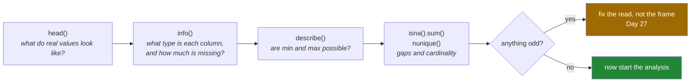

# 1.5 — Reading a frame before you touch it

## One-line answer

Four calls — `head`, `info`, `describe` and `isna().sum()` — answer what a table contains, what type
each column is, how much of it is missing and whether the numbers are plausible, and running them
before writing any analysis is the habit that catches most data problems on the first day rather than
the fifth.

---

## The story

Somebody brings home a box from a house clearance. Before deciding what to do with any of it, they do
four things, in this order, without thinking about it.

They open the lid and look at the top few items. Then they tip it out and sort it into piles by kind —
crockery here, books there, cables in a sad heap. Then they pick up the pile that matters and look at
the range of it: the oldest book, the newest, roughly what sort of thing it all is. And somewhere in
there they notice the gaps — a chess set with no queen, a stack of photos with the top one missing.

None of that is doing anything with the box. It is finding out what is in the box. Anyone who skips
straight to "I'll sell the books" without opening it first ends up carrying a box of cables to a
bookshop.

---

## The idea in plain language

A table you did not create yourself is a box you have not opened. There are four questions worth
asking before any analysis, and pandas has one call for each.

**What does it look like?** `head()` shows the first few rows, `tail()` the last few. Looking at real
values catches things no summary will: a column of prices with a currency symbol in it, a date written
the American way round, a name column where every value is `UNKNOWN`.

**What is in it, and what type is everything?** `info()` prints one line per column: its name, how many
values are **not** missing, and its dtype
([1.4](1.4-one-dtype-per-column.md)). It also prints the total memory. This is the single most useful
call in the library, because a wrong dtype is the root cause of a very large share of pandas problems,
and this is where you see it.

**Are the numbers plausible?** `describe()` gives count, mean, standard deviation, minimum, maximum and
the quartiles for every numeric column — the same statistics Day 23 computed by hand
([Day 23, 2.4](../../../day-23-ufuncs-and-statistics/parts/02-statistics/2.4-median-percentile-and-quantile.md)).
You are not reading it for the mean. You are reading it for the **minimum and the maximum**, because
that is where impossible values live: a negative price, an age of 999, a count of zero in a column that
should never be zero.

**What is missing?** `isna().sum()` counts the gaps per column. `info()` already told you this in the
form of a non-null count, and the explicit version is worth having because it is the number you
actually want, and because you can sort it.

Two words to define, since both appear in the output. **Missing** means pandas has no value for that
cell; it prints as `NaN` or `NaT` and it is not the same as zero or as an empty string
([Day 20, 2.3](../../../day-20-arrays-and-dtypes/parts/02-dtypes/2.3-floats-nan-and-precision.md)).
**Cardinality** means how many distinct values a column has, which `nunique()` reports; a column with
one distinct value carries no information, and a column where every value is distinct is usually an
identifier rather than something to analyse.

The order matters more than it looks. `head` before `info` means you have seen real values before you
start reasoning about types, so a `str` column full of digits is obvious rather than surprising.

---

## Why Setu needs it

- **[Section 2](../02-the-str-dtype/2.1-text-used-to-be-object.md)** is about one dtype changing in
  pandas 3.0, and `info()` is where you notice that it has.
- **Day 27** ends by reading a file and immediately running these four calls, because a file read with
  the wrong types is the failure that day exists to prevent.
- **Day 84's exploratory analysis** is this document with more rigour and better plots; the four calls
  here are the skeleton of it.
- **Day 30** decides what to do about the gaps that `isna().sum()` finds, and cannot start until they
  are counted.
- **Every day from 91 onwards**, the first thing to do with a dataset somebody hands you is exactly
  this, and an interviewer who gives you a CSV is watching for whether you do it.

---

## The mechanism

The shopping list, now with the date each thing was last bought — and one gap, because nobody has ever
bought the rice:

```python
import pandas as pd

shop = pd.DataFrame(
    {
        "item": ["milk", "bread", "eggs", "rice"],
        "need": [2, 1, 6, 1],
        "price": [1.15, 1.40, 0.32, 2.05],
        "last_bought": pd.to_datetime(["2026-08-28", "2026-08-27", "2026-08-24", None]),
    }
)
print(shop.head(2))
```

**Line by line:**

- `pd.to_datetime([...])` — turns a list of text dates into a real datetime column. Without it, those
  would be four strings and every date comparison would compare text
  ([Day 27, 1.5](../../../day-27-reading-and-writing/parts/01-the-csv/1.5-parse-dates-and-the-date-that-stayed-text.md)).
- `None` in that list — the rice has no last-bought date. pandas turns it into `NaT`, "not a time",
  which is the missing marker for datetimes specifically.
- `head(2)` — the first two rows. The default is 5; passing a number is worth the habit, because the
  default is a surprise on a frame with 200 columns.
- **`head` returns a new frame**, so this prints without changing anything. It is also cheap on a huge
  table, because pandas does not need to touch the rows it is not showing.

```text
    item  need  price last_bought
0   milk     2   1.15  2026-08-28
1  bread     1   1.40  2026-08-27
```

Now what is actually in it:

```python
import pandas as pd

shop = pd.DataFrame(
    {
        "item": ["milk", "bread", "eggs", "rice"],
        "need": [2, 1, 6, 1],
        "price": [1.15, 1.40, 0.32, 2.05],
        "last_bought": pd.to_datetime(["2026-08-28", "2026-08-27", "2026-08-24", None]),
    }
)
shop.info()
```

**Line by line:**

- `shop.info()` — note that it **prints and returns nothing**. Almost every other pandas method returns
  a value; this one is built for the terminal, so `x = shop.info()` puts `None` in `x`.
- `RangeIndex: 4 entries, 0 to 3` — the index, described rather than listed
  ([1.2](1.2-the-index-is-not-a-row-number.md)). If this line says anything other than `RangeIndex`,
  somebody has set an index and you should find out what it means before selecting anything.
- `Non-Null Count` — how many values are **present**, not how many are missing. `3 non-null` against
  `RangeIndex: 4 entries` is how you read off that one value is absent, which is a subtraction you have
  to do in your head. That is why `isna().sum()` below is worth running as well.
- `Dtype` — one per column, the subject of [1.4](1.4-one-dtype-per-column.md). `str` for the text is
  the pandas 3.0 behaviour ([2.2](../02-the-str-dtype/2.2-str-the-dtype-pandas-3-infers.md)).
- `datetime64[us]` — **microseconds**, and that `[us]` is a pandas 3.0 change worth registering now.
  Earlier versions defaulted to nanoseconds, `datetime64[ns]`, which could only represent dates between
  1677 and 2262. Microsecond resolution moves that limit out to a range no real dataset will reach, at
  the cost of code that hard-codes `"datetime64[ns]"` in a comparison no longer matching.
- `memory usage: 277.0 bytes` — approximate, and it undercounts text unless you call
  `info(memory_usage="deep")`, for the same reason `memory_usage()` needs `deep=True`
  ([1.4](1.4-one-dtype-per-column.md)).

```text
<class 'pandas.DataFrame'>
RangeIndex: 4 entries, 0 to 3
Data columns (total 4 columns):
 #   Column       Non-Null Count  Dtype
---  ------       --------------  -----
 0   item         4 non-null      str
 1   need         4 non-null      int64
 2   price        4 non-null      float64
 3   last_bought  3 non-null      datetime64[us]
dtypes: datetime64[us](1), float64(1), int64(1), str(1)
memory usage: 277.0 bytes
```

Are the numbers plausible?

```python
import pandas as pd

shop = pd.DataFrame(
    {
        "item": ["milk", "bread", "eggs", "rice"],
        "need": [2, 1, 6, 1],
        "price": [1.15, 1.40, 0.32, 2.05],
        "last_bought": pd.to_datetime(["2026-08-28", "2026-08-27", "2026-08-24", None]),
    }
)
print(shop.describe())
```

**Line by line:**

- `describe()` — by default it summarises the numeric columns **and the datetime ones**, and leaves the
  text out. A mean date is a strange idea and a minimum and maximum date is a very useful one, which is
  why the whole row is shown.
- `count` — **the number of non-missing values, not the number of rows.** `need` and `price` say 4;
  `last_bought` says 3. This row is the fastest missing-data check in the library, and reading it as a
  row count is a mistake that hides exactly the problem it is reporting.
- `mean` and `std` — the average and the spread
  ([Day 23, 2.3](../../../day-23-ufuncs-and-statistics/parts/02-statistics/2.3-std-var-and-ddof.md)).
  `std` is `NaN` for the date column, because a standard deviation of three timestamps has no sensible
  unit here.
- `min` and `max` — **the two rows to read first.** A price of 0.32 and 2.05 is believable for a corner
  shop; a minimum of `-1` would mean a refund got into the price column, and a maximum of `999999` would
  mean a placeholder did.
- `25%`, `50%`, `75%` — the quartiles, with `50%` being the median
  ([Day 23, 2.4](../../../day-23-ufuncs-and-statistics/parts/02-statistics/2.4-median-percentile-and-quantile.md)).
  A median far from the mean says the column is lopsided, which matters for every model that assumes
  otherwise.

```text
           need     price          last_bought
count  4.000000  4.000000                    3
mean   2.500000  1.230000  2026-08-26 08:00:00
min    1.000000  0.320000  2026-08-24 00:00:00
25%    1.000000  0.942500  2026-08-25 12:00:00
50%    1.500000  1.275000  2026-08-27 00:00:00
75%    3.000000  1.562500  2026-08-27 12:00:00
max    6.000000  2.050000  2026-08-28 00:00:00
std    2.380476  0.715495                  NaN
```

The text columns get a different set of questions, and `include="all"` asks both sets at once:

```python
import pandas as pd

shop = pd.DataFrame(
    {
        "item": ["milk", "bread", "eggs", "rice"],
        "need": [2, 1, 6, 1],
        "price": [1.15, 1.40, 0.32, 2.05],
        "last_bought": pd.to_datetime(["2026-08-28", "2026-08-27", "2026-08-24", None]),
    }
)
print(shop.describe(include="all"))
```

**Line by line:**

- `include="all"` — every column, with the statistics that do not apply left as `NaN`. The frame is
  ragged by nature, because "the mean of a word" and "the most common price" are questions of different
  kinds.
- `unique` — how many distinct values, here 4 out of 4 rows. **A text column where `unique` equals the
  row count is an identifier**, not a category, and grouping by it will produce one group per row.
- `top` and `freq` — the most common value and how often it appears. With four distinct items every
  count is 1 and `top` is arbitrary among them; on real data this pair is how you spot that 80% of a
  column is one placeholder value.
- The `NaN`s in this table are not missing data. They mean **the question does not apply to that
  column**, which is a different thing and is worth saying out loud the first time you read one of
  these.

```text
        item      need     price          last_bought
count      4  4.000000  4.000000                    3
unique     4       NaN       NaN                  NaN
top     milk       NaN       NaN                  NaN
freq       1       NaN       NaN                  NaN
mean     NaN  2.500000  1.230000  2026-08-26 08:00:00
min      NaN  1.000000  0.320000  2026-08-24 00:00:00
25%      NaN  1.000000  0.942500  2026-08-25 12:00:00
50%      NaN  1.500000  1.275000  2026-08-27 00:00:00
75%      NaN  3.000000  1.562500  2026-08-27 12:00:00
max      NaN  6.000000  2.050000  2026-08-28 00:00:00
std      NaN  2.380476  0.715495                  NaN
```

And the three one-line questions worth asking every time:

```python
import pandas as pd

shop = pd.DataFrame(
    {
        "item": ["milk", "bread", "eggs", "rice"],
        "need": [2, 1, 6, 1],
        "price": [1.15, 1.40, 0.32, 2.05],
        "last_bought": pd.to_datetime(["2026-08-28", "2026-08-27", "2026-08-24", None]),
    }
)
print("shape:", shop.shape)
print(shop.isna().sum())
print(shop.nunique())
```

**Line by line:**

- `shop.shape` — rows and columns, and the number to write down before any cleaning so you can say
  afterwards how many rows you lost.
- `shop.isna()` — a whole frame of `True`/`False`, the same shape as the original, with `True` wherever
  a value is missing.
- `.sum()` on that frame — sums **down each column**, and `True` counts as 1, so the result is the
  number of gaps per column ([Day 23, 4.1](../../../day-23-ufuncs-and-statistics/parts/04-counting/4.1-count-nonzero-and-the-mask.md)).
  Summing booleans to count them is a habit worth having; it works identically in NumPy.
- `shop.nunique()` — distinct values per column, ignoring missing ones. `last_bought` says 3 because
  the `NaT` is not counted, which is the same convention `count` uses in `describe`.
- All three return values rather than printing, unlike `info()`, so these can go into a log line or an
  assertion.

```text
shape: (4, 4)
item           0
need           0
price          0
last_bought    1
dtype: int64
item           4
need           3
price          4
last_bought    3
dtype: int64
```

The order to run them in:



The amber box is the one people skip. A wrong dtype is almost always cheaper to fix where the file was
read than to patch afterwards, which is the argument Day 27 makes in full.

---

## When it breaks

**The summary that hid the problem:**

```text
$ uv run python -c "
import pandas as pd
prices = pd.DataFrame({'price': ['1.15', '1.40', '0.32']})
print(prices.describe())
print('dtype:', prices['price'].dtype)
"
       price
count      3
unique     3
top     1.15
freq       1
dtype: str
```

**What it means.** The prices are text, so `describe()` silently switched to the text summary: no mean,
no minimum, no maximum. Nothing said "these are not numbers"; the give-away is that the rows changed
from `mean`/`std`/`min` to `unique`/`top`/`freq`. **If `describe()` on a column you believe is numeric
shows `unique` and `top`, the column is not numeric.** This is the single most useful thing to know
about the method, and it is why `info()` comes first — the dtype line says `str` outright.

**The count that is not a row count:**

```text
$ uv run python -c "
import pandas as pd
shop = pd.DataFrame({'price': [1.15, None, 0.32, None]})
print('rows        :', len(shop))
print('describe cnt:', shop.describe().loc['count', 'price'])
print('mean of what:', shop['price'].mean())
"
rows        : 4
describe cnt: 2.0
mean of what: 0.735
```

**What it means.** Four rows, two prices. The mean is the average of the two that exist, not of four
with the gaps treated as zero — pandas skips missing values in every aggregation by default. That is
usually what you want and it is never what you should assume: a mean over half the rows is a different
claim from a mean over all of them, and the `count` row is the only place the summary tells you which
one you are reading. Day 30 is about deciding what those gaps mean before letting an average paper over
them.

**`info()` assigned to a variable:**

```text
$ uv run python -c "
import pandas as pd
shop = pd.DataFrame({'need': [2, 1]})
summary = shop.info()
print('summary is:', summary)
"
<class 'pandas.DataFrame'>
RangeIndex: 2 entries, 0 to 1
Data columns (total 1 columns):
 #   Column  Non-Null Count  Dtype
---  ------  --------------  -----
 0   need    2 non-null      int64
dtypes: int64(1)
memory usage: 148.0 bytes
summary is: None
```

**What it means.** `info()` writes to standard output and returns `None`. It cannot be captured, logged
or asserted on, which makes it a tool for a human at a terminal and the wrong tool inside a program.
When you need the same facts in code, build them: `df.dtypes`, `df.isna().sum()` and `df.shape` all
return real objects you can compare against an expected schema — which is exactly what
[5.2](../05-the-module/5.2-asserting-the-schema.md) does.

---

## In production

**What a professional writes instead of the teaching version.** The four calls become one function
that returns a value, so it can go in a log and be compared between runs:

```python
import pandas as pd


def profile(frame: pd.DataFrame) -> pd.DataFrame:
    """One row per column: dtype, gaps, distinct values — the facts worth logging on every run."""
    return pd.DataFrame(
        {
            "dtype": frame.dtypes.astype("str"),
            "missing": frame.isna().sum(),
            "missing_pct": (frame.isna().mean() * 100).round(2),
            "distinct": frame.nunique(dropna=True),
        }
    ).sort_values("missing_pct", ascending=False)
```

**Line by line:**

- Every input is a Series **indexed by column name**, so assembling them into a frame lines them up by
  label with no effort at all — the dict-of-Series construction from
  [1.3](1.3-a-table-of-columns.md) doing exactly what it is good at.
- `frame.dtypes.astype("str")` — dtypes turned into text, because a column of dtype objects will not
  survive being written to Parquet or JSON, and this frame exists to be stored.
- `isna().mean()` — the **fraction** missing, because `mean` of a boolean column is the proportion that
  are `True`. This is the trick worth stealing from this function: a percentage without writing a
  division.
- `.round(2)` — a percentage to two places, because the extra digits are noise in a log line and make
  two runs look different when they are not.
- `nunique(dropna=True)` — the default stated out loud, so a reader does not have to remember whether
  missing counts as a distinct value. It does not.
- `sort_values("missing_pct", ascending=False)` — worst first. On a two-hundred-column frame nobody
  reads past the top ten rows, so the ordering is what makes the output useful rather than merely
  complete.
- **It returns a frame rather than printing**, which is the whole difference from `info()`. It can be
  written to disk each run and diffed against yesterday's, and that diff is how you notice that a
  column which was 0.1% missing is now 40% missing — the single most valuable data-quality alert there
  is.

**What changes at scale.** `head()` stays cheap, and the other three stop being free: `describe()` on a
two-hundred-column frame computes eight statistics per numeric column over every row, and `nunique()`
has to build a hash set per column. On a large table, profile a sample — `frame.sample(n=100_000,
random_state=0)` — and be explicit that the numbers are from a sample, with the seed recorded so the
run is reproducible (Principle 4). The exception is `isna().sum()`, which must run on everything,
because the whole point is to find the rare rows. There is also a subtlety worth knowing: on a frame
read from Parquet, the row count and per-column null counts are already in the file's metadata, so a
good reader can answer them without reading the data at all
([Day 27, 3.1](../../../day-27-reading-and-writing/parts/03-parquet/3.1-columns-on-disk-with-types.md)).

**The failure that only appears with real data.** A team profiled a new feed on their laptops, saw a
sensible `describe()`, and shipped. Their sample was the first 1 000 rows of a file sorted by date, and
the feed had switched units six months in — a column that was in kilograms became grams. The minimum
and maximum in their summary were from the kilogram era, so nothing looked wrong. In production the
means drifted by a factor of a thousand and the model's output went with them. `describe()` summarises
**the rows you gave it**, and the first rows of a sorted file are not a sample of the file. Profile a
random sample, or profile per month and look at the shape of the sequence.

**The review comment a senior engineer leaves.** *"This asserts `df.shape[0] > 0` and nothing else. Add
the dtype check — we have been bitten twice by a numeric column arriving as text after an upstream
export change, and the job runs happily and produces text concatenation instead of sums."*

**The interview question.** *"You are handed an unfamiliar CSV. What are the first things you run?"*
`head()` to see real values, `info()` for dtypes and non-null counts, `describe()` for ranges, and
`isna().sum()` for the gaps — in that order, because seeing values first stops you reasoning about a
schema you have not looked at. The single most informative line is the dtype list, because a numeric
column that arrived as text is both the most common problem and the one that produces the least obvious
symptoms. And the thing to look at in `describe()` is not the mean, it is the minimum and the maximum,
because that is where impossible values show themselves.

---

## Check yourself

```bash
uv run python -c "
import pandas as pd
shop = pd.DataFrame({'item': ['milk', 'bread', 'eggs', 'rice'],
                     'need': [2, 1, 6, 1],
                     'price': ['1.15', '1.40', '0.32', '2.05']})
shop.info()
print(shop.describe())
"
```

`price` was written with quotes on purpose. Name the two lines in that output that tell you so.

**Answer out loud, without scrolling up:**

> Name the four calls and the question each one answers. Then say what the `count` row of `describe()`
> counts, and why that is not the number of rows.

---

**Next:** [2.1 — Text used to be `object`, and what that cost](../02-the-str-dtype/2.1-text-used-to-be-object.md).
