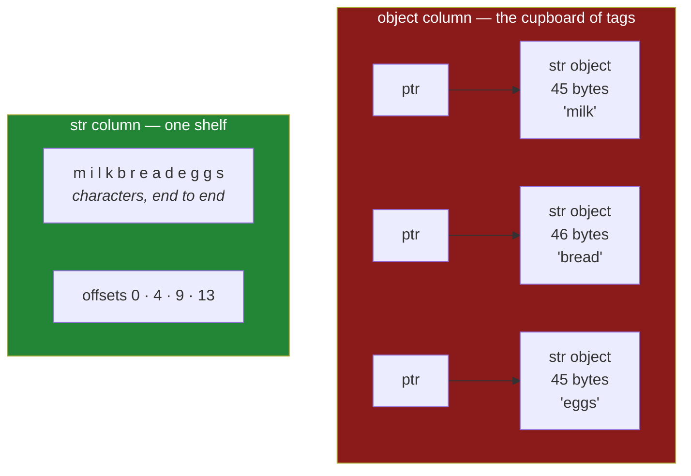

# 2.1 — Text used to be `object`, and what that cost

## One-line answer

`object` is the dtype pandas falls back to when no real dtype fits, and it stores a **pointer to a
Python object per element** rather than the data itself — which is why, before pandas 3.0, every column
of text was several times larger and several times slower than it needed to be.

---

## The story

A shop keeps its stock on shelves. Tins go on a shelf sized for tins, boxes on a shelf sized for boxes.
Everything on a shelf is the same shape, so you can see at a glance how many there are and reach
straight for the fourth one.

There is also a cupboard at the back for everything that does not fit a shelf. It does not hold the
items themselves — it holds a rack of numbered hooks, and on each hook is a paper tag saying which
corner of the stockroom the actual thing is in.

The cupboard is genuinely useful. Anything fits, because the tags are all the same size no matter what
they point at.

It is also the slowest place in the shop. Finding one item means reading a tag, walking to the corner
it names, and coming back. Doing that for four hundred items means four hundred walks, and they are in
four hundred different directions. The tags are neat and tidy; the walking is what costs.

---

## The idea in plain language

Every dtype you have met so far describes the data directly. `int64` means "eight bytes, read them as a
whole number". `float64` means "eight bytes, read them as a decimal"
([Day 20, 2.1](../../../day-20-arrays-and-dtypes/parts/02-dtypes/2.1-a-dtype-is-a-promise.md)). The
values live in the block itself, side by side, which is what makes a column fast to scan.

**`object` is different in kind.** An `object` column does not hold the data. It holds one **pointer**
per element — a memory address, eight bytes, all the same size — and each address names a separate
Python object somewhere else in memory. A *pointer* is just an address: a note saying where the real
thing is, rather than the real thing.

That indirection is exactly the cupboard of tags, and it buys the one thing no other dtype offers:
**anything at all can go in the column**, because every element is just an address and an address does
not care what it points at. A column can hold a word, then a number, then a list, then nothing.

It costs three things, and they compound:

**Memory.** You pay for the pointer *and* for the object it points at. A Python string is not four
bytes for a four-letter word; it is an object with a header, a length, a hash and flags, and it costs
about forty-five bytes before the letters. So a column of four hundred thousand short words pays four
hundred thousand pointers plus four hundred thousand string objects.

**Speed.** The letters of the different words are scattered across memory rather than lying end to end,
so working through the column means jumping about. Modern processors are fast mainly because they read
memory in order and guess what you will want next; jumping defeats both. Every operation also has to go
through Python's own machinery for each element rather than running a tight loop over a block.

**Honesty.** `object` tells you nothing. A column typed `int64` cannot secretly contain a word. A column
typed `object` can contain anything, so its dtype is not a promise about the data — it is the absence of
one. That is the cost nobody counts, and it is the one that produces bugs rather than slowness.

Until pandas 3.0, **every column of text in every pandas program was an `object` column**, because there
was no better default. That was not a mistake so much as an inheritance: pandas is built on NumPy, and
NumPy's fixed-width text dtype gives every element the same number of characters, which is unusable for
real text ([Day 24, 2.1](../../../day-24-bits-strings-and-linear-algebra/parts/02-strings/2.1-fixed-width-text.md)).
Faced with fixed-width or pointers, pandas chose pointers.

pandas 3.0 chose a third thing, and [2.2](2.2-str-the-dtype-pandas-3-infers.md) is about what it chose.

---

## Why Setu needs it

- **[2.2](2.2-str-the-dtype-pandas-3-infers.md), next**, only makes sense as an answer to this problem,
  and the size of the improvement is the size of the cost measured here.
- **[2.4](2.4-dtypes-equals-object-finds-nothing.md)** is about every piece of pandas code written
  before 2026 that identifies text columns by looking for `object`.
- **Day 27** reads files, and a column read as `object` when it should be a number is the failure that
  day is built to prevent
  ([Day 27, 1.4](../../../day-27-reading-and-writing/parts/01-the-csv/1.4-dtype-at-read-time.md)).
- **Day 33's text work** on a million titles is only bearable because the column is no longer `object`.
- **Day 117 onwards**, classical NLP starts from a column of documents, and the difference between the
  two dtypes is minutes against seconds on every experiment.

---

## The mechanism

The same four words, stored both ways:

```python
import pandas as pd

words = ["milk", "bread", "eggs", "rice"]
s_str = pd.Series(words)
s_obj = pd.Series(words, dtype="object")
print("inferred:", repr(s_str.dtype))
print("forced  :", repr(s_obj.dtype))
```

**Line by line:**

- `pd.Series(words)` with no dtype — pandas 3.0 infers `str`. On pandas 2.x the same line gave
  `object`, and that one changed default is what this whole section is about.
- `dtype="object"` — asking for the old behaviour explicitly, which is how the comparison below is made
  fair. It is still available and still occasionally the right answer.
- `repr(...)` rather than `print(dtype)` — the plain form prints `str` and `object`, which hides the
  detail. The `repr` shows `<StringDtype(na_value=nan)>`, a real pandas dtype object with settings on
  it, against `dtype('O')`, where `O` is NumPy's one-letter code for "object".

```text
inferred: <StringDtype(na_value=nan)>
forced  : dtype('O')
```

What is actually in the box:

```python
import sys

import pandas as pd

words = ["milk", "bread", "eggs", "rice"]
s_obj = pd.Series(words, dtype="object")
print("object element type:", type(s_obj.iloc[0]).__name__)
print("sys.getsizeof('milk'):", sys.getsizeof("milk"), "bytes for 4 characters")
```

**Line by line:**

- `type(s_obj.iloc[0]).__name__` — a plain Python `str`. That is the whole point: an `object` column is
  a column of references to ordinary Python objects, and pulling one out gives you the object itself.
- `sys.getsizeof("milk")` — **45 bytes for a four-letter word.** The letters are four of those bytes;
  the rest is the object header, the length, the cached hash and the flags that every Python string
  carries ([Day 7, 1.1](../../../day-07-strings/parts/01-text/1.1-a-string-is-code-points.md)).
- Add the eight-byte pointer in the column itself and one short word costs about 53 bytes. The same
  word inside a block of characters costs four.

```text
object element type: str
sys.getsizeof('milk'): 45 bytes for 4 characters
```

Now measured, on two hundred thousand words rather than four:

```python
import timeit

import numpy as np
import pandas as pd

rng = np.random.default_rng(0)
big = np.array(["milk", "bread", "eggs", "rice"])[rng.integers(0, 4, 200_000)]
a_str = pd.Series(big, dtype="str")
a_obj = pd.Series(big, dtype="object")

print("str    bytes:", a_str.memory_usage(deep=True, index=False))
print("object bytes:", a_obj.memory_usage(deep=True, index=False))
t1 = min(timeit.repeat(lambda: a_str.str.upper(), number=5, repeat=5))
t2 = min(timeit.repeat(lambda: a_obj.str.upper(), number=5, repeat=5))
print(f"upper str   : {t1:.4f}s")
print(f"upper object: {t2:.4f}s")
print("speedup     :", round(t2 / t1, 1))
```

**Line by line:**

- `np.random.default_rng(0)` — a seeded generator, so this measurement is reproducible (Principle 4)
  ([Day 20, 4.2](../../../day-20-arrays-and-dtypes/parts/04-random/4.2-the-seed-is-part-of-the-result.md)).
- `np.array([...])[rng.integers(0, 4, 200_000)]` — fancy indexing with 200 000 random positions,
  producing 200 000 words drawn from the four
  ([Day 21, 4.1](../../../day-21-indexing-and-views/parts/04-fancy-indexing/4.1-a-list-of-positions.md)).
  Repetition is deliberate: real text columns repeat, and this is the case that flatters `object` most.
- `memory_usage(deep=True, index=False)` — `deep` so the pointed-at strings are counted at all, `index`
  off so the two numbers compare like with like ([1.4](../01-the-two-objects/1.4-one-dtype-per-column.md)).
- `min(timeit.repeat(...))` — the **minimum** of five runs, not the mean, because the minimum is the
  run least disturbed by everything else on the machine
  ([Day 25, 4.2](../../../day-25-copy-view-and-the-gate/parts/04-the-benchmark/4.2-timeit-honestly.md)).
- `.str.upper()` — a real operation over every value, chosen because it is the simplest thing that
  must touch every string.
- The numbers below are from one run on one laptop. **The ratios are the point, not the absolute
  times**, and the ratios hold across machines.

```text
str    bytes: 2449994
object bytes: 10649994
upper str   : 0.0174s
upper object: 0.1316s
speedup     : 7.5
```

**Four times the memory and seven times the time**, for the same four words repeated. The memory figure
is arithmetic you can check: 200 000 pointers at 8 bytes is 1.6 MB, plus 200 000 string objects at about
45 bytes is 9 MB, giving the 10.6 MB reported. The `str` column stores the characters end to end — about
0.9 MB of letters — plus one 8-byte offset per value, giving 2.4 MB.

And the thing `object` buys, which nothing else offers:

```python
import pandas as pd

mess = pd.Series(["milk", 2, None, [1, 2]], dtype="object")
print(mess)
print("dtype:", mess.dtype)
```

**Line by line:**

- Four elements of four different kinds: a word, a whole number, nothing at all, and a list. **No other
  dtype accepts this**, and `object` accepts it without comment.
- `[1, 2]` inside a cell — a Python list living in a table cell. It works, and it is almost always a
  sign that something upstream flattened badly
  ([Day 27, 2.2](../../../day-27-reading-and-writing/parts/02-json/2.2-json-normalize.md)).
- This flexibility is why `object` still exists and always will. It is the dtype of last resort, and a
  last resort has to accept everything.
- The cost is that `mess.str.upper()` fails on the number, `mess.sum()` means something strange, and no
  operation over the column can be vectorised, because there is no shared type to vectorise over.

```text
0      milk
1         2
2      None
3    [1, 2]
dtype: object
dtype: object
```

The two layouts, side by side:



The red box needs three jumps to read three words. The green box needs one read plus arithmetic, which
is the same argument the very first NumPy day made about lists against arrays
([Day 20, 1.1](../../../day-20-arrays-and-dtypes/parts/01-the-block/1.1-a-list-of-boxes.md)).

---

## When it breaks

**The mixed column that refuses, loudly:**

```text
$ uv run python -c "
import pandas as pd
prices = pd.Series([1.15, 1.40, '0.32'], dtype='object')
print('dtype :', prices.dtype)
print('sum   :', prices.sum())
"
dtype : object
Traceback (most recent call last):
  ...
TypeError: unsupported operand type(s) for +: 'float' and 'str'
```

**What it means.** Two floats and one string, added left to right, and the third addition has no
meaning. This is the **good** outcome: the column was genuinely mixed, and pandas refused rather than
inventing an answer. Note where the error surfaces — at the `sum()`, not at the point the bad value
entered the column, which may be hundreds of lines and one file-read away. The `object` dtype accepted
the mess silently and the aggregation is merely where the bill arrived.

**The column that is uniformly text, which is the quiet one:**

```text
$ uv run python -c "
import pandas as pd
prices = pd.Series(['1.15', '1.40', '0.32'])
print('dtype:', prices.dtype)
print('sum  :', repr(prices.sum()))
"
dtype: str
sum  : '1.151.400.32'
```

**What it means.** Every value is text, so `+` between them is defined — it joins them. `sum()` returns
`'1.151.400.32'`, no exception anywhere. A total that should be 2.87 is a thirteen-character string, and
if it flows into a report as `f"total: {total}"` it will be printed without complaint. **A uniformly
wrong column is more dangerous than a mixed one**, because the mixed one raises and this one does not.

**The threshold that dropped the biggest rows:**

```text
$ uv run python -c "
import pandas as pd
counts = pd.Series(['2', '10', '6'])
print('counts > 5 :', (counts > '5').tolist())
print('max        :', counts.max())
print('after to_numeric:', pd.to_numeric(counts).max())
"
counts > 5 : [False, False, True]
max        : 6
after to_numeric: 10
```

**What it means.** This is the failure that costs the most and shows the least. Text is compared
character by character, so `'10'` is less than `'5'` because `'1'` comes before `'5'`
([Day 24, 2.3](../../../day-24-bits-strings-and-linear-algebra/parts/02-strings/2.3-comparison-is-not-a-match.md)).
A filter meant to keep the large values **keeps only the 6 and throws the 10 away**, and the maximum of
the column reports 6. Every row is still a plausible row, the counts are still plausible counts, and the
answer is wrong. Nothing raises, ever. The give-away is `info()` reporting a text dtype for a column you
believe is numeric ([1.5](../01-the-two-objects/1.5-reading-a-frame-before-you-touch-it.md)), which is
the argument for running it before anything else.

**The memory report that lied in the other direction:**

```text
$ uv run python -c "
import numpy as np, pandas as pd
rng = np.random.default_rng(0)
big = np.array(['milk', 'bread', 'eggs', 'rice'])[rng.integers(0, 4, 200_000)]
obj = pd.Series(big, dtype='object')
print('deep bytes reported:', obj.memory_usage(deep=True, index=False))
print('distinct strings   :', obj.nunique())
"
deep bytes reported: 10649994
distinct strings   : 4
```

**What it means.** The column reports 10.6 MB, but there are only **four distinct strings** in it, and
Python stores each of them once — the 200 000 pointers mostly point at the same four objects. The real
resident cost is closer to the 1.6 MB of pointers. `memory_usage(deep=True)` walks every element and
adds up the size of what it finds, counting a shared object once per reference. So the figure is an
over-estimate whenever values repeat, and an accurate one when they do not. That does not rescue
`object` — the speed penalty is unaffected, and it is the larger of the two — but it means you should
not quote a deep memory figure for a repetitive column without saying that it double-counts.

---

## In production

**What a professional writes instead of the teaching version.** They do not let a column become
`object` in the first place, and they check for the ones that did:

```python
import pandas as pd


def object_columns(frame: pd.DataFrame) -> dict[str, list[str]]:
    """Find object columns and report the Python types actually inside each one."""
    found: dict[str, list[str]] = {}
    for name in frame.columns[frame.dtypes == object]:
        kinds = sorted({type(value).__name__ for value in frame[name].dropna()})
        found[name] = kinds
    return found
```

**Line by line:**

- `frame.dtypes == object` — compared against the **built-in `object`**, not the string `"object"`.
  Comparing dtypes to the bare type is the form that survived the pandas 3.0 change; the string form is
  what [2.4](2.4-dtypes-equals-object-finds-nothing.md) is about.
- `{type(value).__name__ for value in ...}` — a set comprehension over the actual values
  ([Day 9, 2.2](../../../day-09-comprehensions/parts/02-dict-set-gen/2.2-set-comprehensions.md)),
  because the dtype does not say what is in there and the whole question is what is in there.
- `.dropna()` — missing values are their own type and would add a useless `float` to every answer, since
  `NaN` is a float ([2.5](2.5-the-missing-value-in-a-text-column.md)).
- Returning `{"price": ["float", "str"]}` rather than just the column name — **a list of one type means
  the column is uniform and can be converted; a list of several means somebody has to decide what the
  odd ones are.** That is the difference between a fixable problem and a conversation, and the report
  should say which.
- This walks every value, so it is a diagnostic to run on a sample or at ingest, not on every frame in a
  hot loop.

**What changes at scale.** The seven-fold slowdown is measured on one operation over 200 000 short
words; on a text-heavy pipeline it compounds across every step, and the memory multiplier decides
whether a dataset fits in RAM at all. There is a second, less obvious cost: `object` columns cannot be
released to another process or written to a columnar file without being converted first, so an
`object` column silently adds a serialisation step to every boundary it crosses
([Day 27, 3.2](../../../day-27-reading-and-writing/parts/03-parquet/3.2-the-round-trip-that-keeps-dtypes.md)).
And when text repeats heavily — country names, statuses, categories — the right answer is not `str`
either, it is `category`, which stores small integer codes plus one lookup table and turns a comparison
into an integer comparison ([Day 24, 2.4](../../../day-24-bits-strings-and-linear-algebra/parts/02-strings/2.4-where-text-does-not-belong.md)).

**The failure that only appears with real data.** A nightly job selected the transactions above a
reporting threshold and had run correctly for three years. An upstream export changed its number
formatting and began quoting every amount, so the column arrived as text instead of `float64`. The
filter `amounts > "1000"` still ran, still returned rows, and still produced a report — but it was now
comparing character by character, so every amount beginning with a `9` was included and every
five-figure amount beginning with a `1` was excluded. **The largest transactions were the ones that
disappeared**, which is precisely backwards from what the report was for, and the row count barely
moved. It was found five weeks later by someone who noticed a familiar large customer had stopped
appearing. **A dtype change is a silent event**: nothing logs it, and the job that starts producing
wrong numbers is the same job that produced right ones yesterday. Asserting dtypes after every read is a
two-line habit that makes this class of bug impossible
([5.2](../05-the-module/5.2-asserting-the-schema.md)).

**The review comment a senior engineer leaves.** *"This column comes back as `object` because of the
`apply` on line 40 — `apply` cannot know what the function returns, so it falls back. Do the operation
with the `.str` accessor and it stays a real dtype, or put an explicit `astype` after it so at least
the type is stated rather than inherited."*

**The interview question.** *"What is the `object` dtype and why is it a problem?"* It is pandas' fallback
when no real dtype fits: the column stores one pointer per element and the values live as separate
Python objects elsewhere in memory. It is a problem three ways — memory, because you pay for the pointer
and the object; speed, because every operation chases pointers instead of scanning a block, so it runs
several times slower; and correctness, because the dtype stops being a promise, so a stray string in a
numeric column produces wrong answers rather than an error. Before pandas 3.0 all text was `object` by
necessity; in 3.0 text has its own dtype, and an `object` column is now a signal that something is
genuinely mixed.

---

## Check yourself

```bash
uv run python -c "
import pandas as pd
words = pd.Series(['milk', 'bread', 'eggs'])
obj   = pd.Series(['milk', 'bread', 'eggs'], dtype='object')
print('inferred dtype:', repr(words.dtype))
print('forced dtype  :', repr(obj.dtype))
print('str    bytes  :', words.memory_usage(deep=True, index=False))
print('object bytes  :', obj.memory_usage(deep=True, index=False))
prices = pd.Series(['1.15', '1.40', '0.32'])
print('sum of a text column:', repr(prices.sum()))
print('is 10 bigger than 5?', pd.Series(['10']).gt('5').item())
"
```

The last two lines produce a total that is not a number and an answer that is not true. Say why neither
of them raised.

**Answer out loud, without scrolling up:**

> What does an `object` column actually store, and what are the three costs of that? Then say the one
> thing `object` can do that no other dtype can.

---

**Next:** [2.2 — `str`, the dtype pandas 3.0 infers](2.2-str-the-dtype-pandas-3-infers.md).
