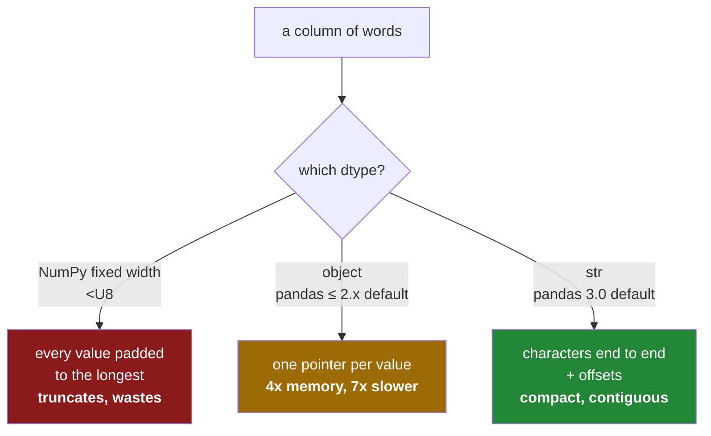

# 2.2 — `str` — the dtype pandas 3.0 infers

## One-line answer

From pandas 3.0, a column of text gets a real dtype called `str` instead of falling back to `object` —
so text is now stored as characters laid end to end, and every `.str` operation runs over a block
rather than chasing pointers.

---

## The story

For years the shop kept its bags of rice in the odds-and-ends cupboard at the back, because there was
no shelf the right shape. It worked. Everybody knew rice was in the cupboard, and everybody accepted
that fetching rice took longer than fetching tins.

Then somebody built a shelf for bags.

Nothing about the rice changed. It is the same rice, in the same bags, and the person at the till does
exactly what they did before: they ask for rice and they get rice. What changed is that it now comes
from a shelf instead of the cupboard, so it arrives faster and takes up less room.

The only people who notice are the ones who had written down "rice is in the cupboard". Their
instructions still say cupboard. The rice is not there any more.

---

## The idea in plain language

pandas 3.0 gives text a dtype of its own, and the dtype is called **`str`**.

The previous document explained why there was not one before: NumPy offers fixed-width text, which
wastes space and truncates, and pointers, which are slow and large
([2.1](2.1-text-used-to-be-object.md)). `str` is the third option, and it is the layout Apache Arrow
uses: **all the characters of all the values, laid end to end in one block, plus a list of offsets
saying where each value starts.**

That layout gives back the two properties `object` gave up. The data is contiguous, so scanning it is a
straight walk through memory rather than a series of jumps. And the column has a real type, so a number
cannot quietly appear in the middle of it.

Three practical facts, and they are the whole of what changes day to day:

**It is inferred, so you get it without asking.** `pd.Series(["milk", "bread"])` is `str` in pandas 3.0
and was `object` in 2.x. So is every text column that `read_csv` produces
([Day 27, 1.2](../../../day-27-reading-and-writing/parts/01-the-csv/1.2-read-csv-and-what-it-guessed.md)).
Existing code that never mentioned dtypes gets the new behaviour automatically, which is the point and
also the risk.

**The `.str` accessor is unchanged.** `.str.upper()`, `.str.contains()`, `.str.len()`, `.str.split()`
all work exactly as before, on the same method names, returning the same shapes. This is the "same
rice" part of the story: the interface did not move.

**The dtype prints as `str` but is not Python's `str`.** `df.dtypes` shows `str`, and
`str(series.dtype)` is the text `"str"`, so `df.dtypes == "str"` is a working test. Underneath it is a
`StringDtype` object with settings on it, which `repr` reveals as `<StringDtype(na_value=nan)>`. Those
settings matter twice: which storage backs it ([2.3](2.3-the-storage-behind-it.md)) and what a missing
value looks like ([2.5](2.5-the-missing-value-in-a-text-column.md)).

There is one trap worth naming immediately, because it catches people writing tests.
`series.dtype == pd.StringDtype()` is **`False`** for an inferred text column. Not because the column is
the wrong type, but because `pd.StringDtype()` with no arguments builds a differently-configured
variant, and dtype equality compares the configuration. Comparing against the string `"str"` is the form
that does what you expect.

This change is described in the pandas migration guide for string dtypes, *Migration guide for the new
string data type (pandas 3.0)*, at
<https://pandas.pydata.org/docs/user_guide/migration-3-strings.html>, which is also the document pandas
points you at from the deprecation warning in
[2.4](2.4-dtypes-equals-object-finds-nothing.md).

---

## Why Setu needs it

- **[2.3](2.3-the-storage-behind-it.md), next**, shows that `str` has two possible backings and that
  only one of them is fast — so "the column says `str`" is not yet the whole answer.
- **[2.4](2.4-dtypes-equals-object-finds-nothing.md)** is the migration break: every line of pandas code
  that finds text columns by looking for `object`.
- **Day 27** reads files and gets these columns without asking, on every text field.
- **Day 33's `.str` work** on a million titles is where the speed difference stops being a benchmark and
  starts being the reason the notebook finishes.
- **Day 117 onwards**, every NLP day starts from a text column, and Arrow-backed text is what makes
  tokenising a large corpus in pandas tolerable at all.

---

## The mechanism

Inference, and what the dtype really is:

```python
import pandas as pd

items = pd.Series(["milk", "bread", "eggs", "rice"])
print("repr :", repr(items.dtype))
print("str  :", str(items.dtype))
print("== 'str'          :", items.dtype == "str")
print("== pd.StringDtype():", items.dtype == pd.StringDtype())
```

**Line by line:**

- `pd.Series([...])` with no `dtype=` — pandas looks at the values, finds text, and picks `str`. **No
  argument was passed**; this is the new default and the reason the change reaches every existing
  program.
- `repr(items.dtype)` — `<StringDtype(na_value=nan)>`. The `repr` is the honest view: a dtype object
  with configuration, not a bare name.
- `str(items.dtype)` — the plain text `"str"`. This is what `df.dtypes` prints and what `info()` shows.
- `items.dtype == "str"` — **`True`**, and this is the comparison to write.
- `items.dtype == pd.StringDtype()` — **`False`**, and this is the one that wastes an hour.
  `pd.StringDtype()` with no arguments defaults to the `pd.NA` flavour of missing value, while inference
  produces the `nan` flavour, and the two configurations are not equal
  ([2.5](2.5-the-missing-value-in-a-text-column.md)). The dtype is right; the comparison is asking a
  narrower question than it looks.

```text
repr : <StringDtype(na_value=nan)>
str  : str
== 'str'          : True
== pd.StringDtype(): False
```

The accessor, which is the part that did not change:

```python
import pandas as pd

items = pd.Series(["milk", "bread", "eggs", "rice"])
print("upper   :", items.str.upper().tolist())
print("len     :", items.str.len().tolist(), "dtype", items.str.len().dtype)
print("contains:", items.str.contains("ea").tolist(), "dtype", items.str.contains("ea").dtype)
```

**Line by line:**

- `.str` — an **accessor**, a small object that groups the text methods together so they do not collide
  with the Series' own methods. `items.upper()` does not exist; `items.str.upper()` does. The separation
  matters because `len(items)` is the number of rows while `items.str.len()` is the length of each
  value, and both are questions people ask.
- `.str.upper()` — one operation per value, returning a new `str` column. On an Arrow-backed column this
  runs over the character block; on `object` it called Python's `str.upper` once per element
  ([2.1](2.1-text-used-to-be-object.md)).
- `.str.len()` — returns **`int64`**, not text. The accessor's methods return whatever type the question
  implies, and this is a counting question.
- `.str.contains("ea")` — returns **`bool`**, a mask you can filter with
  ([Day 28, 2.2](../../../day-28-selection-and-alignment/parts/02-masks/2.2-selecting-with-a-mask.md)).
  Only `bread` contains `ea`.
- Every one of these lines is identical to what you would have written on pandas 2.x. **The migration
  did not touch the accessor**, which is why most code needs no changes at all.

```text
upper   : ['MILK', 'BREAD', 'EGGS', 'RICE']
len     : [4, 5, 4, 4] dtype int64
contains: [False, True, False, False] dtype bool
```

Inside a table, where it shows up in `dtypes`:

```python
import pandas as pd

shop = pd.DataFrame(
    {
        "item": ["milk", "bread", "eggs", "rice"],
        "need": [2, 1, 6, 1],
    }
)
print(shop.dtypes)
print()
print("text columns:", shop.columns[shop.dtypes == "str"].tolist())
```

**Line by line:**

- `shop.dtypes` — `item` reads `str` where every pandas tutorial written before 2026 shows `object` for
  the same data. If you are following an older guide, this line is where you will first notice.
- `shop.dtypes == "str"` — comparing the dtypes Series against the text `"str"`, giving a boolean Series
  indexed by column name.
- `shop.columns[...]` — the boolean Series used to select from the columns index, the same masking idea
  as NumPy's ([Day 21, 3.2](../../../day-21-indexing-and-views/parts/03-boolean-masks/3.2-indexing-with-a-mask.md)).
- `select_dtypes("str")` does the same job and hands back a frame rather than names
  ([1.4](../01-the-two-objects/1.4-one-dtype-per-column.md)); use whichever fits what you do next.

```text
item      str
need    int64
dtype: object
```

```text
text columns: ['item']
```

Where the three dtypes sit relative to each other:



The red box is Day 24's NumPy text
([Day 24, 2.1](../../../day-24-bits-strings-and-linear-algebra/parts/02-strings/2.1-fixed-width-text.md)).
The amber box is what every pandas program used until 2026. The green box is the default now.

---

## When it breaks

**The dtype test that fails on a correct column:**

```text
$ uv run python -c "
import pandas as pd
items = pd.Series(['milk', 'bread'])
assert items.dtype == pd.StringDtype(), 'not a string column'
"
Traceback (most recent call last):
  File "<string>", line 4, in <module>
AssertionError: not a string column
```

**What it means.** The column *is* a string column. The assertion compares against
`pd.StringDtype()`, which defaults to the `pd.NA` missing-value flavour, while the inferred dtype uses
`nan` ([2.5](2.5-the-missing-value-in-a-text-column.md)); the two configurations are different objects
and compare unequal. Write `items.dtype == "str"` instead, which asks the question you meant. This bites
hardest in test suites written against pandas 2.x, where the same assertion was spelled
`== object` and passed for the wrong reason.

**The accessor called on the wrong thing:**

```text
$ uv run python -c "
import pandas as pd
need = pd.Series([2, 1, 6])
print(need.str.upper())
"
Traceback (most recent call last):
  ...
AttributeError: Can only use .str accessor with string values, not integer. Did you mean: 'std'?
```

**What it means.** `.str` refuses on a numeric column, and the message is unusually clear about why.
This is the accessor being a feature rather than a nuisance: on an `object` column that *happened* to
hold numbers, the same call would have gone ahead and produced nonsense per element. The fix is
`need.astype("str").str.upper()` if you genuinely want the text form — and a moment's thought about why
you are uppercasing a count.

**The comparison that is text, not arithmetic:**

```text
$ uv run python -c "
import pandas as pd
codes = pd.Series(['9', '10', '11'])
print('dtype     :', codes.dtype)
print(\"codes > '9':\", codes.gt('9').tolist())
print('as numbers :', pd.to_numeric(codes).gt(9).tolist())
"
dtype     : str
codes > '9': [False, False, False]
as numbers : [False, True, True]
```

**What it means.** A real `str` dtype does not make text behave like numbers, and it was never meant to.
`'10' > '9'` is `False` because `'1'` sorts before `'9'`
([Day 24, 2.3](../../../day-24-bits-strings-and-linear-algebra/parts/02-strings/2.3-comparison-is-not-a-match.md)).
The improvement from `object` to `str` is about memory, speed and honesty about *what kind of thing* the
column holds — it does not and cannot rescue a column that should have been numeric. That is Day 27's
job, done at read time
([Day 27, 1.4](../../../day-27-reading-and-writing/parts/01-the-csv/1.4-dtype-at-read-time.md)).

---

## In production

**What a professional writes instead of the teaching version.** They state the text dtype rather than
relying on inference, so the code says the same thing on pandas 2.x and 3.x:

```python
import pandas as pd

TEXT = "str"


def normalise_text(frame: pd.DataFrame, columns: list[str]) -> pd.DataFrame:
    """Strip and case-fold the named text columns, leaving everything else alone."""
    out = frame.copy()
    for name in columns:
        if str(out[name].dtype) not in {TEXT, "object", "string"}:
            raise TypeError(f"{name} is {out[name].dtype}, not a text column")
        out[name] = out[name].astype(TEXT).str.strip().str.casefold()
    return out
```

**Line by line:**

- `TEXT = "str"` as a named constant — one place to change if the project ever has to support both
  pandas versions from one codebase, and a name that says what it is at each use site.
- `str(out[name].dtype) not in {...}` — the dtype turned into text and checked against a **set** of
  acceptable spellings. `"object"` is accepted because a mixed column may legitimately arrive from an
  older file, and `"string"` because that is what the `pd.NA` flavour prints as
  ([2.5](2.5-the-missing-value-in-a-text-column.md)). Rejecting a numeric column here gives a better
  message than the `AttributeError` the accessor would raise three lines later.
- `.astype(TEXT)` before the accessor — makes the column's dtype explicit rather than assuming inference
  got it right, and converts an `object` column on the way through.
- `.str.strip()` — removes leading and trailing whitespace, which is the single most valuable text
  cleaning step there is, because invisible whitespace breaks joins and groupings without ever showing
  up in a print-out ([Day 7, 2.1](../../../day-07-strings/parts/02-methods/2.1-normalising-strip-and-case.md)).
- `.str.casefold()` rather than `.str.lower()` — case-folding is the operation designed for comparison
  rather than display, and it handles scripts where lowercasing is not enough
  ([Day 7, 4.2](../../../day-07-strings/parts/04-normalising/4.2-unicode-normalisation.md)).
- Chaining the two accessor calls — each returns a new column, so this reads left to right and no
  intermediate is named. That is idiomatic and it is also why nothing here writes into `frame`.

**What changes at scale.** The `str` dtype is what makes text columns viable in pandas at a size where
they previously were not: four times less memory and several times faster on every operation
([2.1](2.1-text-used-to-be-object.md)). Two caveats follow it into production. First, the gain depends
entirely on which storage backs the dtype, and the slow backing is still called `str`
([2.3](2.3-the-storage-behind-it.md)) — so "the column says `str`" is not yet good news. Second, `.str`
methods that take a Python function, such as `.str.replace(..., regex=True)` with a callable, or anything
routed through `.apply`, fall back to per-element Python and give up the whole advantage; the fast paths
are the built-in operations, and it is worth checking that the operation you reached for is one of them.

**The failure that only appears with real data.** A test suite pinned dtypes with
`assert df["name"].dtype == object`. The assertions were correct under pandas 2.x and were quietly
asserting the *fallback* rather than any intended property. Upgrading to 3.0 turned every one of them
red at once — several hundred failures across a codebase, none of which indicated a real defect. The
team's first instinct was to force `object` back everywhere with `astype(object)`, which would have
thrown away the entire improvement to make the tests pass. The right fix was to change the assertions to
`== "str"`, and the lesson is that **an assertion inherited from a default is not really an assertion**;
it records what happened rather than what was wanted.

**The review comment a senior engineer leaves.** *"`df['sku'].dtype == pd.StringDtype()` will be `False`
here even though the column is fine — that constructor defaults to the `pd.NA` variant and inference
gives you the `nan` one. Compare against the string `'str'`, or use `pd.api.types.is_string_dtype` if you
want to accept both flavours."*

**The interview question.** *"What changed about strings in pandas 3.0?"* Text now infers to a real
dtype, `str`, instead of falling back to `object`. The storage is Arrow-style — all the characters in one
block with an offsets array — so a text column is roughly four times smaller and several times faster,
and it has a genuine type rather than being the dtype of last resort. The `.str` accessor is unchanged,
so most code needs no edits. What does break is any code that identified text columns by looking for
`object`, because text is no longer `object` — and any test that asserted `dtype == object` was really
asserting the old fallback rather than anything meaningful.

---

## Check yourself

```bash
uv run python -c "
import pandas as pd
items = pd.Series(['milk', 'bread', 'eggs'])
print('repr        :', repr(items.dtype))
print('as text     :', str(items.dtype))
print(\"== 'str'    :\", items.dtype == 'str')
print('== StringDtype():', items.dtype == pd.StringDtype())
print('len dtype   :', items.str.len().dtype)
print('contains dt :', items.str.contains('e').dtype)
"
```

Two of those lines ask whether this is a string column and disagree. Say which one is asking the wrong
question.

**Answer out loud, without scrolling up:**

> What dtype does a column of text get in pandas 3.0, and how is it laid out in memory? Then say why
> `dtype == pd.StringDtype()` can be `False` for a perfectly good text column.

---

**Next:** [2.3 — The storage behind it: `python` and `pyarrow`](2.3-the-storage-behind-it.md).
