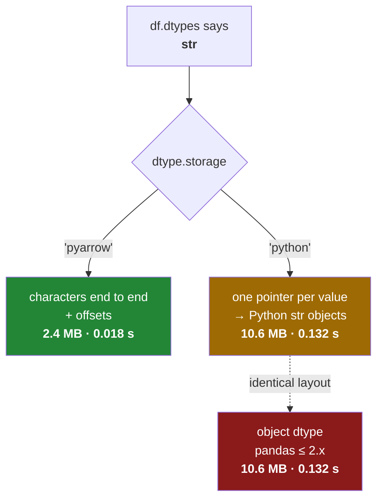

# 2.3 — The storage behind it — `python` and `pyarrow`

## One-line answer

The `str` dtype has two possible backings — `pyarrow`, which stores characters end to end, and
`python`, which stores pointers to Python strings — and only the first is fast, so a column can say
`str` and still cost exactly what `object` cost.

---

## The story

Two shops both advertise a click-and-collect service. Both signs say the same thing, in the same
words, in the same size lettering.

In the first shop, somebody has already picked your order and it is in a bag behind the counter. You
say your name and walk out with it.

In the second shop, the sign is the whole of the service. When you say your name, somebody takes your
list and goes round the aisles collecting the items, exactly as you would have done. You get your
shopping. It takes the same time it always did.

Neither shop is lying. Both do collect your order for you. But one of them installed the thing the
sign promises and the other put up the sign.

The only way to tell them apart is to have been to both, or to ask.

---

## The idea in plain language

`str` is not one implementation. It is a dtype with a setting called **storage**, and the setting picks
how the characters are actually kept:

- **`pyarrow`** — the layout described in [2.2](2.2-str-the-dtype-pandas-3-infers.md): every value's
  characters laid end to end in one block, plus an array of offsets recording where each value starts.
  Compact and contiguous.
- **`python`** — one pointer per element, each pointing at an ordinary Python string object. Which is
  exactly what `object` did ([2.1](2.1-text-used-to-be-object.md)).

The second one exists because pandas cannot assume PyArrow is installed. PyArrow is a large dependency,
and pandas will run without it — so when it is absent, pandas still gives you a `str` dtype, still gives
you the `.str` accessor, still reports `str` in `info()`, and quietly stores the data the old way.

**That is the point of this document.** The dtype name tells you what the column *means*. The storage
tells you what it *costs*. They are separate questions and only one of them shows up in `df.dtypes`.

The difference is not small. Measured below on two hundred thousand short words, `python` storage takes
**4.3 times the memory and 7 times the time** of `pyarrow` storage — which is the same ratio `object`
had against `str` in [2.1](2.1-text-used-to-be-object.md), because it is the same layout being measured
under a new name.

Reading the setting is one attribute:

```text
series.dtype.storage
```

and it answers `'pyarrow'` or `'python'`. There is a wrinkle in how the two print, and it will confuse
you once: **`repr` only mentions the storage when it is `python`.** The Arrow-backed dtype prints as
`<StringDtype(na_value=nan)>` with no storage mentioned at all, because Arrow is the default and pandas
only spells out the departure from it. So a dtype that does *not* say `storage=` is the fast one, which
is exactly backwards from what most people guess.

The practical rule is short. **Install `pyarrow`, and check the storage rather than the dtype name when
you care about performance.** In this project it is pinned at `pyarrow==25.0.1`, so the fast path is the
one you get; the check still belongs in any code that is going to run somewhere you did not set up.

---

## Why Setu needs it

- **[2.1](2.1-text-used-to-be-object.md)'s measurement** is only true when the storage is `pyarrow`, and
  this document is what makes that claim honest rather than a benchmark run under lucky conditions.
- **[2.4](2.4-dtypes-equals-object-finds-nothing.md), next**, is about code that tests dtype names; this
  is the reason a dtype name is not enough on its own.
- **Day 27's Parquet work** is Arrow all the way down — the file format and this storage share a memory
  layout, which is why a Parquet read can hand pandas its columns almost without conversion
  ([Day 27, 3.1](../../../day-27-reading-and-writing/parts/03-parquet/3.1-columns-on-disk-with-types.md)).
- **Day 33's million titles** is unbearable on `python` storage and fine on `pyarrow`.
- **Day 35's Polars comparison** is a comparison of two Arrow-backed systems, and this is where the
  shared foundation is introduced.

---

## The mechanism

The same four words in both storages:

```python
import pandas as pd

NAN = float("nan")
words = ["milk", "bread", "eggs", "rice"]
py = pd.Series(words, dtype=pd.StringDtype(storage="python", na_value=NAN))
ar = pd.Series(words, dtype=pd.StringDtype(storage="pyarrow", na_value=NAN))
print("python :", repr(py.dtype), "| storage", py.dtype.storage, "| name", str(py.dtype))
print("pyarrow:", repr(ar.dtype), "| storage", ar.dtype.storage, "| name", str(ar.dtype))
```

**Line by line:**

- `pd.StringDtype(storage=...)` — the dtype built by hand with the setting stated. Normally you never
  write this; inference picks one for you, and this is here to make the comparison possible.
- `na_value=NAN` on **both** — this argument is not decoration, and leaving it off would break the
  experiment. The dtype's printed *name* is decided by its missing-value setting, not by its storage:
  `na_value=nan` is named `str` and `na_value=pd.NA` is named `string`
  ([2.5](2.5-the-missing-value-in-a-text-column.md)). Pinning both to `nan` makes **storage the only
  difference between these two columns**, which is what this document is about.
- `py.dtype.storage` — `'python'`, printed explicitly because it is the only reliable way to ask.
- **Read the two `repr`s carefully.** The `python` one says `storage='python'` out loud. The `pyarrow`
  one does not mention storage at all — it is the default, so it is omitted. A dtype whose `repr` is
  silent about storage is the Arrow-backed one.
- `str(py.dtype)` and `str(ar.dtype)` are **both `str`**, and both would show `str` in `info()`. The two
  columns below are indistinguishable from anywhere except the `storage` attribute.

```text
python : <StringDtype(storage='python', na_value=nan)> | storage python | name str
pyarrow: <StringDtype(na_value=nan)> | storage pyarrow | name str
```

Now the cost, on two hundred thousand words:

```python
import timeit

import numpy as np
import pandas as pd

NAN = float("nan")
rng = np.random.default_rng(0)
big = np.array(["milk", "bread", "eggs", "rice"])[rng.integers(0, 4, 200_000)]
bpy = pd.Series(big, dtype=pd.StringDtype(storage="python", na_value=NAN))
bar = pd.Series(big, dtype=pd.StringDtype(storage="pyarrow", na_value=NAN))

print("python  bytes:", bpy.memory_usage(deep=True, index=False))
print("pyarrow bytes:", bar.memory_usage(deep=True, index=False))
t1 = min(timeit.repeat(lambda: bpy.str.upper(), number=5, repeat=5))
t2 = min(timeit.repeat(lambda: bar.str.upper(), number=5, repeat=5))
print(f"python  upper: {t1:.4f}s")
print(f"pyarrow upper: {t2:.4f}s")
```

**Line by line:**

- The same seeded construction as [2.1](2.1-text-used-to-be-object.md), deliberately, so the numbers can
  be laid against that document's `object` measurement directly
  ([Day 20, 4.2](../../../day-20-arrays-and-dtypes/parts/04-random/4.2-the-seed-is-part-of-the-result.md)).
- `min(timeit.repeat(...))` — the minimum of five runs, for the reasons Day 25 gives
  ([Day 25, 4.2](../../../day-25-copy-view-and-the-gate/parts/04-the-benchmark/4.2-timeit-honestly.md)).
- **Compare these four numbers with the ones in [2.1](2.1-text-used-to-be-object.md).** The `python`
  storage figures — 10 649 994 bytes and 0.1318 s — are the `object` figures, to the byte. The layout is
  identical, so the cost is identical; only the label on the box changed.
- The `pyarrow` figures — 2 449 994 bytes and 0.0176 s — are the improvement the pandas 3.0 release notes
  are describing.
- `.str.upper()` is the operation being timed, chosen because it must touch every character and so
  cannot be optimised away.

```text
python  bytes: 10649994
pyarrow bytes: 2449994
python  upper: 0.1244s
pyarrow upper: 0.0176s
```

Which storage you actually got:

```python
import pandas as pd

items = pd.Series(["milk", "bread", "eggs", "rice"])
print("dtype   :", items.dtype)
print("storage :", items.dtype.storage)
print("fast?   :", items.dtype.storage == "pyarrow")
```

**Line by line:**

- `pd.Series([...])` with no dtype — inference, the normal case. Which storage this picks depends
  entirely on whether `pyarrow` is importable in this environment.
- `items.dtype` prints `str` either way, which is the trap.
- `items.dtype.storage` is the answer, and it is `pyarrow` here because this project pins
  `pyarrow==25.0.1`.
- `== "pyarrow"` — the check worth putting in a start-up assertion on any project that cares, so that a
  machine missing the dependency fails at import rather than being mysteriously slow all afternoon.

```text
dtype   : str
storage : pyarrow
fast?   : True
```

Two shops, one sign:



The dotted line is the whole point of the document: the amber box and the red box are the same thing.

---

## When it breaks

**The environment without PyArrow:**

```text
$ uv venv --python 3.12 /tmp/nopa
$ uv pip install --python /tmp/nopa/Scripts/python.exe "pandas==3.0.5"
$ /tmp/nopa/Scripts/python.exe -c "
import pandas as pd
items = pd.Series(['milk', 'bread', 'eggs'])
print('pandas  :', pd.__version__)
try:
    import pyarrow; print('pyarrow :', pyarrow.__version__)
except ImportError: print('pyarrow : not installed')
print('dtype   :', items.dtype)
print('storage :', items.dtype.storage)
print('bytes   :', items.memory_usage(deep=True, index=False))
"
pandas  : 3.0.5
pyarrow : not installed
dtype   : str
storage : python
bytes   : 160
```

**What it means.** A fresh environment with pandas and nothing else — and note that installing pandas
did **not** pull PyArrow in, because pandas 3.0 does not require it. The dtype still reports `str`, the
accessor still works, and every column of text in that process is on the slow path. Those 160 bytes for
three short words are the `object` figure, not the Arrow one. Nothing warns.
**This is the most likely way to meet the problem**: a colleague's laptop, a slim container image, or a
CI runner where somebody trimmed the dependencies to speed up the build. The symptom is that everything
is about seven times slower than on your machine and nobody can see why.

**The assertion that was not asking about speed:**

```text
$ uv run python -c "
import pandas as pd
items = pd.Series(['milk', 'bread'], dtype=pd.StringDtype(storage='python', na_value=float('nan')))
assert str(items.dtype) == 'str'
print('assertion passed, storage is:', items.dtype.storage)
"
assertion passed, storage is: python
```

**What it means.** The assertion is satisfied by both storages, because both really are `str`. If the
reason you wrote it was performance, it does not test that. `assert items.dtype.storage == "pyarrow"` is
the test that does, and it belongs in the place a project asserts its environment rather than scattered
through the data code.

**The dtype that will not compare equal to itself:**

```text
$ uv run python -c "
import pandas as pd
NAN = float('nan')
a = pd.Series(['milk'], dtype=pd.StringDtype(storage='python', na_value=NAN))
b = pd.Series(['milk'], dtype=pd.StringDtype(storage='pyarrow', na_value=NAN))
print('same dtype name :', str(a.dtype) == str(b.dtype))
print('same dtype obj  :', a.dtype == b.dtype)
print('frames equal    :', a.equals(b))
"
same dtype name : True
same dtype obj  : False
frames equal    : False
```

**What it means.** Two columns with the same values and the same dtype name are not `equals`, because
`equals` compares dtypes and the dtype objects differ in their storage. A test that builds an expected
frame with a literal and compares it against one read from Parquet can fail on this alone, with a
message that says the frames differ while printing two identical tables. The fix is either to compare
with `pd.testing.assert_frame_equal(..., check_dtype=False)` when the dtype genuinely does not matter,
or to construct the expected frame the same way the real one is built. **The frustrating part is that
the printed output of both frames is byte-for-byte identical**, so the failure looks like a bug in the
comparison rather than in the setup.

---

## In production

**What a professional writes instead of the teaching version.** A start-up check, run once, that fails
loudly rather than letting the process be slow in silence:

```python
import pandas as pd


def assert_fast_strings() -> None:
    """Fail at import if text columns will not be Arrow-backed."""
    storage = pd.Series(["probe"]).dtype.storage
    if storage != "pyarrow":
        raise RuntimeError(
            f"text columns are backed by {storage!r}, not 'pyarrow'; "
            "install pyarrow==25.0.1 — expect roughly 4x the memory and 7x the time without it"
        )
```

**Line by line:**

- `pd.Series(["probe"])` — a one-element probe that goes through **inference**, so it reports what real
  columns will get. Asking `pd.StringDtype().storage` would report a default rather than what inference
  actually does in this environment.
- `.dtype.storage` — the attribute, which is the only place the answer lives.
- Raising `RuntimeError` rather than warning — a warning scrolls past in a log and the cost here is a
  silent seven-fold slowdown across everything. This is an environment fault, not a data fault, and it
  should stop the process ([Day 18, 2.2](../../../day-18-exceptions/parts/02-the-hierarchy/2.2-which-built-in-to-raise.md)).
- `{storage!r}` — the `!r` conversion prints `'python'` with quotes, so the message cannot be misread as
  a description
  ([Day 7, 3.3](../../../day-07-strings/parts/03-formatting/3.3-repr-and-the-debugging-f-string.md)).
- **The message names the fix and the cost.** An error that says what to install and what it is worth
  gets acted on; one that says "pyarrow not found" gets ignored for a month.
- Called once at start-up, never per frame — the probe allocates a Series, and doing that in a hot path
  would be its own small waste.

**What changes at scale.** Storage stops being a performance detail and becomes an interoperability one.
An Arrow-backed column can be handed to another Arrow-speaking system — Polars, DuckDB, a Parquet
writer, a network transfer — **without converting anything**, because they already agree on the memory
layout. A `python`-backed column has to be converted at every one of those boundaries, so the cost is
not only the seven times on your own operations but a fresh conversion each time the data crosses out of
pandas. On a pipeline that reads Parquet, does three transformations and writes Parquet, that is the
difference between two conversions and none. This is also why Day 35's comparison against Polars and
DuckDB is a fair fight rather than a rout: with Arrow underneath, the systems differ in their execution
engines rather than in how they hold a string.

**The failure that only appears with real data.** A team's job ran in eight minutes locally and fifty in
production for months, and the investigation went through cluster sizing, disk throughput and network
before anybody looked at dtypes. The production image had been slimmed by a well-meaning change that
dropped PyArrow, on the reasoning that nothing imported it directly — which was true. Nothing imported
it; pandas *used* it when present. Every text column in production was on `python` storage. **A
dependency that is only ever used implicitly is invisible to the usual "is this import needed" review**,
and the only defence is a start-up assertion like the one above, which would have turned fifty minutes
of mystery into one line at boot.

**The review comment a senior engineer leaves.** *"This checks `df.dtypes == 'str'` in the ingest test,
which passes on both storages. If the point is that we get the Arrow path, assert
`dtype.storage == 'pyarrow'` once in the environment test instead — checking it per frame is noise, and
checking the name proves nothing."*

**The interview question.** *"pandas 3.0 gives text a `str` dtype — does that automatically make text
faster?"* No. `str` has two possible storages, `pyarrow` and `python`, and only the Arrow one has the
contiguous layout that makes it fast; the `python` one is pointers to Python strings, which is precisely
what `object` was. If PyArrow is not installed pandas silently uses the slow one and still reports the
dtype as `str`, so the dtype name tells you nothing about the cost. The attribute to check is
`dtype.storage`. And the confusing detail is that the `repr` only mentions storage when it is `python` —
Arrow is the default, so it goes unsaid.

---

## Check yourself

```bash
uv run python -c "
import pandas as pd
items = pd.Series(['milk', 'bread', 'eggs'])
print('dtype   :', items.dtype)
print('repr    :', repr(items.dtype))
print('storage :', items.dtype.storage)
slow = pd.Series(['milk'], dtype=pd.StringDtype(storage='python', na_value=float('nan')))
print('slow repr:', repr(slow.dtype))
print('names equal:', str(items.dtype) == str(slow.dtype))
print('dtypes equal:', items.dtype == slow.dtype)
"
```

Two dtypes with the same name compare unequal. Say which of the two `repr`s belongs to the fast one, and
how you can tell.

**Answer out loud, without scrolling up:**

> What are the two storages behind the `str` dtype, and which one does pandas use when PyArrow is not
> installed? Then say why `df.dtypes` cannot tell you which one you have.

---

**Next:** [2.4 — `dtypes == "object"` finds nothing now](2.4-dtypes-equals-object-finds-nothing.md).
