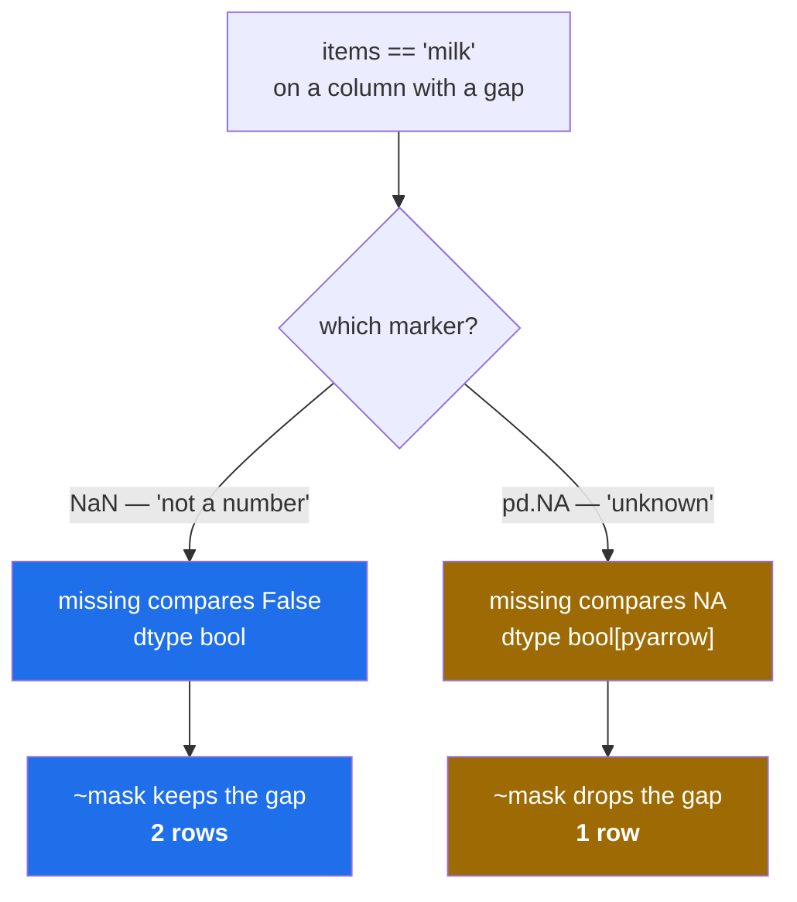

# 2.5 — The missing value in a text column — `NaN` and `pd.NA`

## One-line answer

A text column comes in two flavours that differ only in what a missing value is — `NaN`, which makes
every comparison with it `False`, or `pd.NA`, which makes every comparison with it **unknown** — and
the choice decides whether "everything that is not milk" includes the row nobody filled in.

---

## The story

Four people share the flat and there is a sheet on the fridge for who is doing the shop this week. Three
have written a name. The fourth line is blank.

Somebody asks: who is *not* doing the shop?

There are two honest answers and people genuinely give both. One is "the three who wrote someone else's
name, plus the blank one — a blank is not you, so it is a no". The other is "the three who wrote someone
else's name; the blank one we do not know about, so leave it out until somebody asks them".

Neither answer is wrong. They are answers to slightly different questions, and the difference only
matters for the blank line. But the two answers produce different lists, and if one person is working
from the first list and another from the second, they will disagree about a real thing — whether to
knock on that door.

---

## The idea in plain language

A missing value is not a value. It is the absence of one, and a table needs some way to write it down.

pandas has two markers, and a text column can be built with either:

- **`NaN`** — "not a number", the marker floating-point arithmetic already had
  ([Day 20, 2.3](../../../day-20-arrays-and-dtypes/parts/02-dtypes/2.3-floats-nan-and-precision.md)).
  Its defining property is that **every comparison involving it is `False`**, including `NaN == NaN`.
- **`pd.NA`** — pandas' own marker, meaning "unknown". Its defining property is that **every comparison
  involving it is `NA` again**: the answer to a question about an unknown value is itself unknown.

That second behaviour is called **three-valued logic**: an expression can be true, false, or unknown,
and the unknown propagates outward instead of collapsing to false. It is the rule SQL uses for `NULL`,
and it is the one Day 42's SQL days will meet again.

Which marker a column uses is part of its dtype, and it decides the dtype's printed name:

| Built with | `repr` | prints as | missing shows as |
|---|---|---|---|
| inference, `pd.Series(["milk", None])` | `<StringDtype(na_value=nan)>` | `str` | `NaN` |
| `pd.StringDtype(na_value=pd.NA)` | `<StringDtype(na_value=<NA>)>` | `string` | `<NA>` |

**Inference gives you the `NaN` flavour**, named `str`. That is the pandas 3.0 default and the one you
will meet unless you go out of your way. The `pd.NA` flavour, named `string`, is opt-in.

Two consequences are worth knowing before they surprise you.

**A negated mask treats them differently.** `~(items == "milk")` — "everything that is not milk" — keeps
the missing row under the `NaN` flavour, because the comparison was `False` and its negation is `True`.
Under the `pd.NA` flavour the comparison is `NA`, the negation is still `NA`, and pandas drops `NA` rows
when it uses a mask to select. **The same expression returns a different number of rows.** That is the
shopping sheet, exactly.

**Operations returning numbers differ too.** `.str.len()` on the `NaN` flavour comes back as `float64`,
because a column that must hold `NaN` cannot be an integer column
([1.3](../01-the-two-objects/1.3-a-table-of-columns.md)). On the `pd.NA` flavour it comes back as
`Int64` — capital I — which is pandas' integer type that *can* hold a missing value. So lengths are
`4.0` in one and `4` in the other.

What is the same in both: `isna()` finds the gaps, `fillna()` fills them, and `dropna()` removes them.
**Always test for missingness with `isna()`**, never with `== None` or `== float("nan")`, because
neither of those works under either flavour.

---

## Why Setu needs it

- **[Section 3](../03-copy-on-write/3.1-every-result-behaves-like-a-copy.md)** and Day 28 both filter
  with masks, and this is the document that says what a mask does about a gap
  ([Day 28, 2.5](../../../day-28-selection-and-alignment/parts/02-masks/2.5-the-mask-that-matched-nothing.md)).
- **Day 27** reads files where blanks, `NA` and `-` all have to be turned into one of these markers
  ([Day 27, 1.6](../../../day-27-reading-and-writing/parts/01-the-csv/1.6-na-values-and-the-blank.md)).
- **Day 30** is entirely about missing data, and starts from the assumption that you know what a missing
  value *is*.
- **Day 42's SQL days** meet three-valued logic again as `NULL`, where it is not optional.
- **Day 76 onwards**, every imputation step has to decide what a gap means, and the answer is never
  "zero" by default.

---

## The mechanism

The two flavours, side by side:

```python
import pandas as pd

s = pd.Series(["milk", None, "eggs"])
t = pd.Series(["milk", None, "eggs"], dtype=pd.StringDtype(na_value=pd.NA))
print("inferred:", str(s.dtype), "|", repr(s.dtype))
print("NA-flav :", str(t.dtype), "|", repr(t.dtype))
print()
print(s.tolist())
print(t.tolist())
```

**Line by line:**

- `pd.Series(["milk", None, "eggs"])` — plain inference. `None` in the input becomes the column's
  missing marker, whichever that is.
- `dtype=pd.StringDtype(na_value=pd.NA)` — the opt-in flavour, asked for explicitly.
- `str(s.dtype)` is **`str`** and `str(t.dtype)` is **`string`**. Two different names for what most
  people would call the same type, and the only difference is the missing-value marker. This is why
  [2.2](2.2-str-the-dtype-pandas-3-infers.md)'s `dtype == pd.StringDtype()` check failed: that
  constructor defaults to the `pd.NA` flavour, so it builds `string`, not `str`.
- The two `tolist()` lines show `nan` against `<NA>` in the middle position — the same absence, written
  two ways.

```text
inferred: str | <StringDtype(na_value=nan)>
NA-flav : string | <StringDtype(na_value=<NA>)>

['milk', nan, 'eggs']
['milk', <NA>, 'eggs']
```

What a comparison gives back:

```python
import pandas as pd

s = pd.Series(["milk", None, "eggs"])
t = pd.Series(["milk", None, "eggs"], dtype=pd.StringDtype(na_value=pd.NA))
print("nan-flav eq:", s.eq("milk").tolist(), "dtype", s.eq("milk").dtype)
print("NA-flav  eq:", t.eq("milk").tolist(), "dtype", t.eq("milk").dtype)
```

**Line by line:**

- `.eq("milk")` — the method form of `== "milk"`, used here only because it reads more clearly inside a
  `print`.
- The `NaN` flavour gives `[True, False, False]` with dtype **`bool`**: three plain booleans. The missing
  row compared as `False`, because every comparison with `NaN` is `False`.
- The `pd.NA` flavour gives `[True, <NA>, False]` with dtype **`bool[pyarrow]`**: a boolean column that
  can also hold "unknown". The missing row is neither true nor false.
- **The dtypes differ, not just the values.** A plain `bool` column cannot represent the middle answer at
  all, so the `NaN` flavour is not hiding the unknown — it genuinely does not have anywhere to put it.

```text
nan-flav eq: [True, False, False] dtype bool
NA-flav  eq: [True, <NA>, False] dtype bool[pyarrow]
```

And the consequence that changes a result — "everything that is not milk":

```python
import pandas as pd

s = pd.Series(["milk", None, "eggs"])
t = pd.Series(["milk", None, "eggs"], dtype=pd.StringDtype(na_value=pd.NA))
print("nan ~eq       :", (~s.eq("milk")).tolist())
print("NA  ~eq       :", (~t.eq("milk")).tolist())
print("nan rows kept :", s[~s.eq("milk")].tolist())
print("NA  rows kept :", t[~t.eq("milk")].tolist())
```

**Line by line:**

- `~` negates the mask elementwise, the same operator NumPy uses
  ([Day 24, 1.3](../../../day-24-bits-strings-and-linear-algebra/parts/01-bits/1.3-tilde-on-bool-and-int.md)).
- Under `NaN`: the middle was `False`, so its negation is `True`, and **the missing row is kept**. The
  result has two rows, one of which is the gap itself.
- Under `pd.NA`: the middle was `NA`, and the negation of unknown is still unknown. When pandas uses a
  mask to select rows, it treats `NA` as "do not include", so **the missing row is dropped**. The result
  has one row.
- **Same expression, same data, different answers** — two rows against one. Neither is a bug; they are
  the two honest answers from the story. What causes real trouble is not knowing which one you asked
  for.
- The row counts are the thing to watch. A filter that silently keeps or drops the unknowns changes
  every total computed after it.

```text
nan ~eq       : [False, True, True]
NA  ~eq       : [False, <NA>, True]
nan rows kept : [nan, 'eggs']
NA  rows kept : ['eggs']
```

Numbers out of text, which the flavour also changes:

```python
import pandas as pd

s = pd.Series(["milk", None, "eggs"])
t = pd.Series(["milk", None, "eggs"], dtype=pd.StringDtype(na_value=pd.NA))
print("nan-flav len:", s.str.len().tolist(), "dtype", s.str.len().dtype)
print("NA-flav  len:", t.str.len().tolist(), "dtype", t.str.len().dtype)
```

**Line by line:**

- `.str.len()` — the length of each value, a counting question whose answer ought to be whole numbers.
- Under `NaN` the result is `float64`: `[4.0, nan, 4.0]`. The column has to hold `NaN`, `NaN` is a float,
  so the whole column is widened — the same widening that turned counts into `1.0` and `2.0` in
  [1.3](../01-the-two-objects/1.3-a-table-of-columns.md).
- Under `pd.NA` the result is `Int64` — **capital I** — which is pandas' nullable integer type. Lengths
  stay `4` and the gap stays `<NA>`.
- `Int64` and `int64` are different types and the capital letter is the only thing distinguishing them
  in writing, which is a real source of confusion in code review. The capital one can hold a missing
  value; the lower-case NumPy one cannot.

```text
nan-flav len: [4.0, nan, 4.0] dtype float64
NA-flav  len: [4, <NA>, 4] dtype Int64
```

The blank line on the shopping sheet:



Neither branch is the wrong one. The bug is a program that uses both without noticing.

---

## When it breaks

**Testing for a gap by comparing to it:**

```text
$ uv run python -c "
import pandas as pd
s = pd.Series(['milk', None, 'eggs'])
print('== None      :', (s == None).tolist())
print('.isna()      :', s.isna().tolist())
print('nan == nan   :', float('nan') == float('nan'))
"
== None      : [False, False, False]
.isna()      : [False, True, False]
nan == nan   : False
```

**What it means.** `s == None` finds nothing, because the missing value is `NaN` and `NaN` equals
nothing — as the third line shows, not even itself. The rule is absolute and worth memorising: **there
is no value you can compare against to find a missing value.** `isna()` is not a convenience, it is the
only thing that works. The same applies to `pd.NA`, where the comparison returns `NA` rather than
`False` and an `if` on it raises outright.

**The dtype comparison that is looser than it looks:**

```text
$ uv run python -c "
import pandas as pd
s = pd.Series(['milk', 'eggs'])
print('str(dtype)      :', str(s.dtype))
print('== \"str\"        :', s.dtype == 'str')
print('== \"string\"     :', s.dtype == 'string')
print('== StringDtype():', s.dtype == pd.StringDtype())
"
str(dtype)      : str
== "str"        : True
== "string"     : True
== StringDtype(): False
```

**What it means.** Read those last three lines together, because they are inconsistent in a way that
will cost you an afternoon. Comparing the dtype against either **string name** says `True` — pandas
treats `"str"` and `"string"` as aliases for "some string dtype" and does not check the flavour.
Comparing it against a **constructed dtype object** says `False`, because that comparison does check the
flavour, and `pd.StringDtype()` defaults to the `pd.NA` one.

So `dtype == "string"` is not the precise test it appears to be: it passes for both flavours, and a test
suite relying on it will not notice a column changing from `str` to `string` underneath it — which is
exactly the change that alters the row counts above. If you need to know the flavour, ask for it
directly with `s.dtype.na_value is pd.NA`. If you only need to know that it is text at all,
`pd.api.types.is_string_dtype` says so honestly ([2.4](2.4-dtypes-equals-object-finds-nothing.md)).

**The `if` that cannot decide:**

```text
$ uv run python -c "
import pandas as pd
value = pd.Series(['milk', None], dtype=pd.StringDtype(na_value=pd.NA)).iloc[1]
if value == 'milk':
    print('it is milk')
else:
    print('it is not milk')
"
Traceback (most recent call last):
  ...
TypeError: boolean value of NA is ambiguous
```

**What it means.** `value == 'milk'` is `NA`, and `if` demands a definite yes or no. pandas refuses to
guess, which is exactly right — silently choosing `False` is how the two answers from the story get
mixed up in one program. The fix is to decide explicitly: `if pd.isna(value)` first, then compare, or
`if (value == "milk") is True` if you genuinely want unknown to count as no. This error is much more
common inside an `and`/`or` chain than in a bare `if`, and the traceback points at the `if` rather than
at the column that produced the `NA`.

---

## In production

**What a professional writes instead of the teaching version.** They make the treatment of gaps explicit
at the point of filtering, rather than letting the dtype decide it:

```python
import pandas as pd


def not_matching(
    items: pd.Series, value: str, *, unknown_counts_as_match: bool = False
) -> pd.Series:
    """Rows whose value differs from `value`, with the missing rows handled on purpose."""
    matches = items.eq(value).fillna(unknown_counts_as_match).astype(bool)
    return items[~matches]
```

**Line by line:**

- `items.eq(value)` — the comparison, which may contain `False` or `NA` in the gap depending on the
  column's flavour.
- `.fillna(unknown_counts_as_match)` — **the decision, written down.** Every gap in the mask becomes a
  definite `True` or `False` before it is used, so the function behaves identically on both flavours of
  text column. This one call is what makes the code portable between them.
- `.astype(bool)` — forces a plain boolean mask, so the result is never a nullable `bool[pyarrow]`
  column. Selecting with a plain mask has no ambiguity left in it at all.
- `unknown_counts_as_match` as a **keyword-only** argument with a default
  ([Day 10, 1.5](../../../day-10-functions/parts/01-the-signature/1.5-keyword-only-and-positional-only.md)) — the name
  is long deliberately. `not_matching(items, "milk", unknown_counts_as_match=True)` reads as a sentence
  at the call site, and the reader does not have to remember what a bare `True` meant.
- `items[~matches]` — the selection, now over a mask with no unknowns in it.
- The default is `False`, meaning an unknown is **not** treated as a match and therefore survives the
  negation — the `NaN` behaviour. That is chosen because it matches what inference gives you, so the
  default and the common case agree.

**What changes at scale.** The row-count difference stops being a curiosity. A filter that drops
unknowns removes rows from every total downstream, and on a real dataset the missing rows are almost
never a random sample — they are the new customers, the failed imports, the records from the system that
went down. So the two flavours do not merely disagree by a few rows, they disagree in a way that is
correlated with whatever you are measuring. The professional habit is to **count the gaps before and
after every filter** and log the difference; if a filter removed 12 000 rows and you expected it to
remove 9 000, the extra 3 000 are the unknowns and you should have decided about them on purpose. The
second thing that changes is interoperability: `pd.NA` and three-valued logic are what SQL does, so a
pipeline that reads from a database and filters in pandas will disagree with the same query written in
SQL unless the flavours are aligned.

**The failure that only appears with real data.** A retention report filtered `~(status == "cancelled")`
to count active accounts. The `status` column was `NaN`-flavoured, so the accounts with no status — new
sign-ups whose status had not been written yet — compared `False` to `"cancelled"`, were kept by the
negation, and counted as active. Then an upstream change moved the column to the `pd.NA` flavour. The
same line now dropped those rows, the active count fell by about 3%, and it was reported as a retention
problem. **Nobody changed the filter and the filter changed its meaning.** The rows involved were
entirely new sign-ups, which is precisely the population a retention report is most sensitive to. The
fix was one `fillna` on the mask, and the lesson is that a filter over a column that can be missing has
three cases, not two, and the third one is decided by a dtype somewhere else.

**The review comment a senior engineer leaves.** *"`~(df['status'] == 'cancelled')` — what do you want
to happen to the rows where status is missing? Right now the answer depends on which string dtype the
column has, which is decided in the loader. Put a `.fillna(False)` on the mask so the intent is in this
line."*

**The interview question.** *"What is the difference between `NaN` and `pd.NA` in pandas?"* Both mark a
missing value; they differ in how comparisons behave. `NaN` comes from floating point and every
comparison with it is `False`, so a mask over a column with gaps gives plain booleans. `pd.NA` means
unknown and propagates — comparisons return `NA`, giving three-valued logic like SQL's `NULL`, and
pandas drops `NA` rows when the mask is used to select. The practical consequence is that
`~(col == x)` returns a different number of rows under the two, because a gap is kept under `NaN` and
dropped under `NA`. In pandas 3.0 inference gives you the `NaN` flavour, printed as `str`; the `pd.NA`
one is opt-in and prints as `string`. And with either, you test for a gap with `isna()`, never with a
comparison.

---

## Check yourself

```bash
uv run python -c "
import pandas as pd
s = pd.Series(['milk', None, 'eggs'])
t = pd.Series(['milk', None, 'eggs'], dtype=pd.StringDtype(na_value=pd.NA))
print('names      :', str(s.dtype), '/', str(t.dtype))
print('eq dtypes  :', s.eq('milk').dtype, '/', t.eq('milk').dtype)
print('rows kept  :', len(s[~s.eq('milk')]), '/', len(t[~t.eq('milk')]))
print('len dtypes :', s.str.len().dtype, '/', t.str.len().dtype)
print('== None    :', (s == None).sum(), 'found')
print('isna()     :', s.isna().sum(), 'found')
"
```

The third line prints two different row counts for the same filter. Say which flavour kept the gap and
why.

**Answer out loud, without scrolling up:**

> What does a comparison with `NaN` return, and what does a comparison with `pd.NA` return? Then say why
> that changes how many rows `~(items == "milk")` gives you, and name the only reliable way to test for a
> missing value.

---

**Next:** [3.1 — Every result behaves like a copy](../03-copy-on-write/3.1-every-result-behaves-like-a-copy.md).
