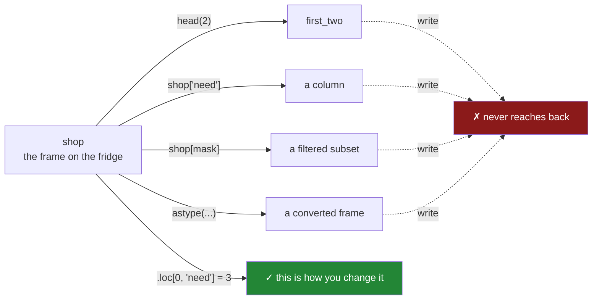

# 3.1 — Every result behaves like a copy

## One-line answer

In pandas 3.0, **Copy-on-Write** is the only mode: anything you get back from a frame — a column, a
slice, a filtered subset, the result of a method — behaves as its own copy, so writing to it never
reaches back and changes the frame it came from.

---

## The story

Somebody photographs the shopping list on the fridge before going out, because the list is for the
whole flat and they only need part of it.

In the shop they cross things off the photo on their phone. They tap and scribble and end up with a
picture that no longer matches the fridge.

Nobody would expect otherwise. Marking up a photograph of a list has never changed the list. When they
get home the sheet on the fridge says exactly what it said this morning, and if they want it updated
they have to walk over and write on it.

The photograph is useful precisely because it is separate. You can mess it up freely.

---

## The idea in plain language

**Copy-on-Write**, usually shortened to **CoW**, is a rule about what happens when you take something
out of a DataFrame.

The rule is one sentence: **every object pandas gives you behaves as though it were its own copy.**

Take a column, a slice, the first two rows, a filtered subset, the result of `rename` or `astype` or
`sort_values` — write into any of them and the original frame is unaffected. There is no exception, no
"unless it was a view", and no way to tell from the shape of your code whether the connection exists,
because it never does.

Two consequences, and they pull in opposite directions.

**Nothing you do to a result can corrupt its source.** That is the safety half, and it removes an entire
category of bug that used to be pandas' most notorious feature — a function that quietly edited its
caller's data, or a filtered subset that turned out to be wired back to the original.

**Nothing you do to a result reaches the source either, so results must be kept.** That is the half
that catches people. `shop.astype({"need": "int16"})` on its own line does nothing at all
([1.4](../01-the-two-objects/1.4-one-dtype-per-column.md)). It computes a converted frame and throws it
away. Nearly every pandas method works like this: it is a **question that returns an answer**, not an
instruction that changes something.

The word "behaves" in the rule is doing careful work, and it is worth noticing now because
[3.2](3.2-the-copy-that-has-not-happened-yet.md) is about it. pandas does not actually duplicate the
data when you take a column — that would be slow and wasteful. It shares the memory and keeps track,
and it does the duplication only if and when somebody writes. From the outside the behaviour is
indistinguishable from a real copy, which is why the rule can be stated so simply.

The name of the mode before this was **chained assignment**, `SettingWithCopyWarning`, and a long
history of confusion. On pandas 2.x, whether writing to a subset reached the original depended on
details of how the subset was produced, and pandas warned you when it was unsure. That warning is gone
in 3.0, because the ambiguity it was warning about is gone
([4.4](../04-chained-assignment/4.4-settingwithcopy-is-gone.md)). Copy-on-Write became the only mode in
pandas 3.0, which shipped in January 2026; the design is described in the pandas user guide's
Copy-on-Write page, <https://pandas.pydata.org/docs/user_guide/copy_on_write.html>.

If you have used NumPy, this is the opposite of the rule there. A NumPy slice **is** a view, and writing
to it does change the original
([Day 21, 2.1](../../../day-21-indexing-and-views/parts/02-the-view-trap/2.1-a-slice-does-not-copy.md)).
That difference between the two libraries is worth holding on to deliberately, and
[3.3](3.3-the-question-that-stopped-mattering.md) takes it apart.

---

## Why Setu needs it

- **[3.2](3.2-the-copy-that-has-not-happened-yet.md), next**, shows the machinery underneath and why it
  is not slow.
- **[Section 4](../04-chained-assignment/4.1-the-write-that-vanished.md)** is the trap this rule
  creates: a write that vanishes because it landed on a temporary copy.
- **Day 28** writes into frames with `.loc`, which is the operation that *does* change things, and it
  only makes sense against this background
  ([Day 28, 3.1](../../../day-28-selection-and-alignment/parts/03-writing/3.1-assigning-through-loc.md)).
- **Day 30 onwards**, every cleaning step is a chain of methods whose results must be assigned, and the
  phase gate for Days 26–35 says "no chained assignment anywhere".
- **Day 91 onwards**, a transformer that edited its input frame would leak information between the
  training and test splits, which is Principle 8's leakage in its most literal form.

---

## The mechanism

A method that looks like a command and is not:

```python
import pandas as pd

shop = pd.DataFrame(
    {
        "item": ["milk", "bread", "eggs", "rice"],
        "need": [2, 1, 6, 1],
        "price": [1.15, 1.40, 0.32, 2.05],
    }
)
shop.rename(columns={"need": "qty"})
print("columns after a thrown-away rename:", shop.columns.tolist())
renamed = shop.rename(columns={"need": "qty"})
print("columns of the kept result       :", renamed.columns.tolist())
```

**Line by line:**

- `shop.rename(...)` on a line by itself — it **computes a renamed frame and discards it**. The
  statement is legal, does no harm, and accomplishes nothing.
- `shop.columns` afterwards — unchanged, because nothing was ever going to change it.
- `renamed = shop.rename(...)` — the same call with the answer kept. Now there are two frames: the
  original with `need`, and a new one with `qty`.
- **Read every pandas method this way.** `sort_values`, `drop`, `fillna`, `reset_index`, `astype`,
  `replace` all return a new object and leave the old one alone. A handful of methods accept
  `inplace=True`, and that argument is best ignored: it does not reliably save memory under CoW, it
  breaks method chaining, and it makes the line look like the only kind of statement this section is
  trying to teach you to distrust.

```text
columns after a thrown-away rename: ['item', 'need', 'price']
columns of the kept result       : ['item', 'qty', 'price']
```

A subset, written to:

```python
import pandas as pd

shop = pd.DataFrame(
    {
        "item": ["milk", "bread", "eggs", "rice"],
        "need": [2, 1, 6, 1],
        "price": [1.15, 1.40, 0.32, 2.05],
    }
)
first_two = shop.head(2)
first_two.loc[0, "need"] = 99
print("subset  :", first_two["need"].tolist())
print("original:", shop["need"].tolist())
```

**Line by line:**

- `shop.head(2)` — the first two rows, as a new frame. Under CoW this shares memory with `shop` for the
  moment ([3.2](3.2-the-copy-that-has-not-happened-yet.md)), which you cannot tell and do not need to.
- `first_two.loc[0, "need"] = 99` — a real write, through `.loc`, in a single step. It succeeds, and
  `first_two` now says 99.
- `shop["need"]` — still `[2, 1, 6, 1]`. **The write did not travel back.** On pandas 2.x this same code
  might have changed `shop`, or might not, depending on how `head` happened to be implemented that day,
  and pandas would have emitted `SettingWithCopyWarning` to say it was not sure.
- The photograph from the story: `first_two` is a picture of part of the list, and marking it up leaves
  the fridge alone.
- Note that the write itself worked perfectly. **CoW does not make results read-only**; it makes them
  independent.

```text
subset  : [99, 1]
original: [2, 1, 6, 1]
```

The rule, drawn:



Everything that leaves the frame is independent of it. The single green arrow is the subject of
[section 4](../04-chained-assignment/4.3-loc-the-single-step.md).

---

## When it breaks

**The cleaning that never happened:**

```text
$ uv run python -c "
import pandas as pd
shop = pd.DataFrame({'item': ['  milk ', 'bread'], 'need': [2, 1]})
shop['item'].str.strip()
shop.dropna()
shop.rename(columns={'item': 'name'})
print(repr(shop['item'].tolist()))
print(shop.columns.tolist())
"
['  milk ', 'bread']
['item', 'need']
```

**What it means.** Three statements, each of which reads like an instruction, and none of which changed
anything. Every one computed a result and dropped it. Nothing raised, and a script full of these runs to
completion and reports success. **This is the commonest beginner mistake in pandas and it survives into
professional code**, usually as one line in the middle of a working function. The fix is to assign each
result — `shop["item"] = shop["item"].str.strip()` — or to chain them and assign once.

**The function that did not do what its name says:**

```text
$ uv run python -c "
import pandas as pd

def add_total(frame):
    frame.assign(total=frame['need'] * frame['price'])

shop = pd.DataFrame({'need': [2, 1], 'price': [1.15, 1.40]})
add_total(shop)
print(shop.columns.tolist())
"
['need', 'price']
```

**What it means.** `assign` returns a new frame with the extra column; the function computes it and
returns `None`. The caller sees no error, no new column, and a function whose name promises something it
did not do. Under the pre-3.0 rules some spellings of this *would* have modified the caller's frame,
which was worse — it worked by accident and was unpredictable. The fix is one word: `return
frame.assign(...)`, and then `shop = add_total(shop)` at the call site, which also makes the data flow
visible.

**The `inplace` that is not the optimisation it looks like:**

```text
$ uv run python -c "
import pandas as pd
shop = pd.DataFrame({'need': [2, 1, 6]})
out = shop.sort_values('need', inplace=True)
print('returned:', out)
print('sorted  :', shop['need'].tolist())
"
returned: None
sorted  : [1, 2, 6]
```

**What it means.** `inplace=True` does change `shop`, and it returns `None` — so the very natural
`shop = shop.sort_values('need', inplace=True)` would replace your frame with `None`, which is a
genuinely common way to lose an afternoon's work in a notebook. The wider point is that `inplace` does
not save memory under Copy-on-Write the way people assume: pandas still builds the new result and then
rebinds it internally. It costs you method chaining and a return value, and buys nothing. **Prefer
`shop = shop.sort_values("need")`.**

---

## In production

**What a professional writes instead of the teaching version.** They chain, assign once, and never write
a function that edits its argument:

```python
import pandas as pd


def clean(shop: pd.DataFrame) -> pd.DataFrame:
    """Return a cleaned copy of the shopping list. The caller's frame is never touched."""
    return (
        shop.rename(columns=str.lower)
        .assign(
            item=lambda df: df["item"].str.strip().str.casefold(),
            total=lambda df: df["need"] * df["price"],
        )
        .sort_values("item")
        .reset_index(drop=True)
    )
```

**Line by line:**

- The whole body is **one expression**, wrapped in brackets so it can span lines
  ([Day 5, 1.6](../../../day-05-operators-and-conditionals/parts/01-operators/1.6-precedence-and-associativity.md)).
  Each method hands its result to the next, so there is exactly one place the answer can be dropped —
  and `return` is standing there.
- `rename(columns=str.lower)` — a **function** rather than a mapping, applied to every column name. It
  is the plain Python `str.lower`, not the accessor, because column names are ordinary strings.
- `.assign(item=..., total=...)` — adds or replaces columns and returns a new frame, which is what makes
  it chainable where `df["x"] = ...` is not.
- `lambda df: ...` inside `assign` — the lambda receives **the frame as it is at that point in the
  chain**, not the original `shop`. That matters here: `total` is computed after `item` was cleaned, and
  had a later step renamed a column the lambda would see the new name. Referring to `shop` directly
  inside the chain is the mistake to avoid, because it silently reaches back to the pre-chain frame.
- `.sort_values("item")` then `.reset_index(drop=True)` — sorted, then renumbered, with `drop=True` so
  the old labels are not left behind as a column
  ([1.2](../01-the-two-objects/1.2-the-index-is-not-a-row-number.md)).
- **The docstring states the guarantee.** Under CoW it is true automatically, but saying it makes the
  contract explicit for a reader who has to decide whether they need their own copy first
  ([Day 25, 1.5](../../../day-25-copy-view-and-the-gate/parts/01-the-decision/1.5-the-api-contract.md)).

**What changes at scale.** The reflex worry about CoW is that copying everything must be expensive, and
it is not, because the copies are lazy — [3.2](3.2-the-copy-that-has-not-happened-yet.md) is the whole
story. What does cost is **long chains on large frames**, where each step materialises an intermediate
that lives until the chain ends; a ten-step chain over a frame near your memory limit can hold several
copies at once even though each individual step is cheap. The professional habits are to keep chains to
one logical stage, to select the columns you need early so the intermediates are narrow, and to let a
chain end and its result be named before starting the next. The other real change is that a pipeline
which used to rely on a function editing a shared frame in place has to be rewritten to pass frames
back, which usually makes the data flow clearer and occasionally means one more copy in memory.

**The failure that only appears with real data.** A team upgraded to pandas 3.0 and a preprocessing step
stopped working — not with an error, but by producing untransformed data. The step had been written as a
function taking a frame, calling a series of methods on it, and returning nothing; on pandas 2.x several
of those calls happened to modify the caller's frame because the intermediate was a view. The code had
never been correct, it had been **accidentally effective**, and the accident depended on how each subset
happened to be produced. Under CoW the accident stops happening, uniformly. **The upgrade did not break
the code; it revealed that the code had been relying on undefined behaviour** — which is the honest
description of most `SettingWithCopyWarning` suppressions.

**The review comment a senior engineer leaves.** *"This function takes a frame and mutates it, which
under CoW means it mutates nothing and the caller silently gets un-cleaned data. Make it return a new
frame and assign at the call site — and while you are there, drop the `inplace=True` on line 12, it
returns `None` and does not save us anything."*

**The interview question.** *"What is Copy-on-Write in pandas 3.0 and what does it change for you?"*
Every object you get back from a frame behaves as its own copy, so writing to a column, a slice or a
filtered subset can never modify the frame it came from. It removes the whole `SettingWithCopyWarning`
class of confusion, where whether a write propagated depended on how the subset happened to be produced.
The cost is that results must be assigned — a method call on its own line does nothing — and the trap is
chained assignment, where the write lands on a temporary that is discarded immediately. Under the
covers the copies are lazy: pandas shares the memory and only duplicates when somebody actually writes,
so the guarantee is cheap.

---

## Check yourself

```bash
uv run python -c "
import pandas as pd
shop = pd.DataFrame({'item': ['milk', 'bread', 'eggs'], 'need': [2, 1, 6]})
shop.rename(columns={'need': 'qty'})
print('after thrown-away rename:', shop.columns.tolist())
part = shop.head(2)
part.loc[0, 'need'] = 99
print('part    :', part['need'].tolist())
print('original:', shop['need'].tolist())
shop.loc[0, 'need'] = 5
print('after .loc:', shop['need'].tolist())
"
```

Three writes happen in that script and only one of them changes `shop`. Say which, and what is different
about it.

**Answer out loud, without scrolling up:**

> State the Copy-on-Write rule in one sentence. Then say the two consequences — one that makes your code
> safer and one that makes a line of your code do nothing.

---

**Next:** [3.2 — The copy that has not happened yet](3.2-the-copy-that-has-not-happened-yet.md).
