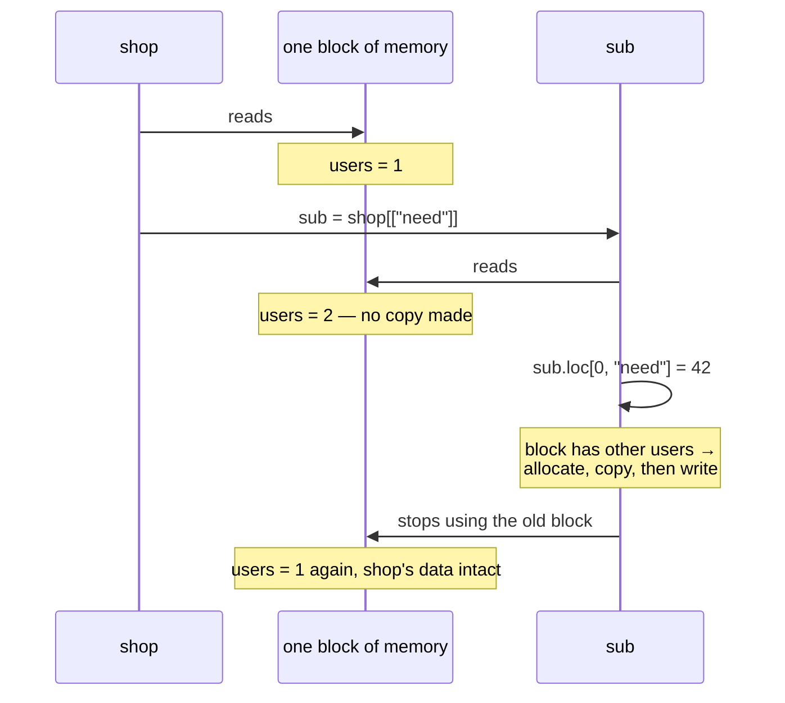

# 3.2 — The copy that has not happened yet

## One-line answer

pandas does not duplicate the data when you take a column or a subset — it shares the memory and
counts who is using it, and it makes the real copy only at the moment somebody writes, which is why
the copy guarantee from [3.1](3.1-every-result-behaves-like-a-copy.md) costs almost nothing.

---

## The story

Two people in the flat want the shopping list. One is going to the shop; the other just wants to know
whether there is bread on it.

Nobody photocopies anything. They both stand and read the same sheet on the fridge. Reading does not
use it up, and two people reading the same piece of paper is not a problem.

It only becomes a problem when one of them wants to cross something off. At that moment — and not
before — the person who wants to make changes takes the sheet down, writes out their own version, and
scribbles on that. The other person is still reading the original, undisturbed.

If neither of them ever writes, no copy is ever made. Most of the time neither of them ever writes.

---

## The idea in plain language

[3.1](3.1-every-result-behaves-like-a-copy.md) said that everything you take out of a frame behaves as
its own copy. Taken literally, that sounds ruinous: selecting one column out of a two-gigabyte frame
would allocate a fresh column every time.

It does not, because the copy is **lazy**. The full name of the mode says so — Copy **on Write**, not
copy on read.

What actually happens when you take a subset:

1. pandas hands you a new object that **points at the same memory** the original uses.
2. It records that this memory now has more than one user. That record is a **reference count**, which
   is simply a tally of how many things are looking at the same block.
3. Nothing is duplicated. Both objects read the same bytes.
4. **If and only if somebody writes**, pandas notices that the block has other users, allocates a fresh
   block for the writer, copies the data into it, and performs the write there. The other users keep
   the original, untouched.

From the outside this is indistinguishable from having copied immediately. Reads are free, the
guarantee holds, and the cost is paid only by code that actually modifies something — which in a
typical analysis is a small fraction of the operations.

You can watch it happen, and that is what makes this document worth reading rather than taking on
trust. `np.shares_memory(a, b)` answers whether two arrays occupy overlapping memory
([Day 21, 2.2](../../../day-21-indexing-and-views/parts/02-the-view-trap/2.2-how-to-tell-base-and-shares-memory.md)).
Ask it before a write and the answer is `True`. Write to one of them. Ask again, and the answer is
`False` — the block was split at the moment of the write.

This is not a pandas invention. Copy-on-write is a standard technique: operating systems use it when a
process forks, so a child process shares its parent's memory until one of them writes to a page. The
idea is the same and so is the reason for it — most shared data is never modified, so paying for the
copy up front is paying for something that usually does not happen.

Two practical points follow.

**`.copy()` still exists and is still sometimes right.** It forces the duplication immediately. You want
it when you are about to write many times to a subset and would rather pay once, or when you want to
release the original's memory and the shared block is keeping a huge frame alive
([Day 21, 5.1](../../../day-21-indexing-and-views/parts/05-in-anger/5.1-the-leak-a-view-causes.md)).

**Memory can spike at a write, not at a read.** The copy happens inside the assignment, so the moment
your memory doubles is a line that looks like it is only setting a value. That is the one performance
surprise CoW introduces, and it replaces a much larger class of correctness surprises.

---

## Why Setu needs it

- **[3.1](3.1-every-result-behaves-like-a-copy.md)'s guarantee** is only believable once you know it is
  not paid for on every read.
- **[3.4](3.4-to-numpy-and-the-read-only-array.md)** is the visible edge of this machinery: the array
  `to_numpy()` hands you is read-only precisely because it is still sharing.
- **Day 25's whole gate** was about views and copies in NumPy, and this is the same question answered
  differently one library up
  ([Day 25, 1.1](../../../day-25-copy-view-and-the-gate/parts/01-the-decision/1.1-six-operations-one-question.md)).
- **Day 29's timing work** measures pandas operations, and a benchmark that writes on the first
  iteration and reads on the rest measures the copy once and nothing thereafter.
- **Day 35's Polars comparison** rests on the same idea, since immutable data structures make the
  question moot entirely.

---

## The mechanism

The copy, caught in the act:

```python
import numpy as np
import pandas as pd

shop = pd.DataFrame({"item": ["milk", "bread", "eggs", "rice"], "need": [2, 1, 6, 1]})
sub = shop[["need"]]

before = np.shares_memory(sub["need"].to_numpy(), shop["need"].to_numpy())
sub.loc[0, "need"] = 42
after = np.shares_memory(sub["need"].to_numpy(), shop["need"].to_numpy())

print("shares memory before the write:", before)
print("shares memory after  the write:", after)
print("original:", shop["need"].tolist(), "| sub:", sub["need"].tolist())
```

**Line by line:**

- `shop[["need"]]` — a **double** bracket, so this selects a list of columns and returns a DataFrame
  rather than a Series. Either would do here; the frame makes the `.loc` write below read naturally.
- `np.shares_memory(...)` — NumPy's honest answer to "do these two occupy the same bytes"
  ([Day 21, 2.2](../../../day-21-indexing-and-views/parts/02-the-view-trap/2.2-how-to-tell-base-and-shares-memory.md)).
  It is the probe that makes the laziness visible; pandas does not advertise it any other way.
- `.to_numpy()` on both sides — because `shares_memory` works on arrays, not on pandas objects. This
  returns the underlying block without copying it, which is exactly what
  [3.4](3.4-to-numpy-and-the-read-only-array.md) is about.
- `before` is **`True`**: at this point `sub` and `shop` are reading the same block. No copy has been
  made, despite [3.1](3.1-every-result-behaves-like-a-copy.md) promising that `sub` behaves like one.
- `sub.loc[0, "need"] = 42` — the write. **This is the line where the copy happens.** pandas sees the
  block has another user, allocates a new one for `sub`, copies, and writes 42 into the new block.
- `after` is **`False`**: they are now genuinely separate blocks.
- The last line confirms the guarantee held throughout: `shop` never changed, and `sub` did.

```text
shares memory before the write: True
shares memory after  the write: False
original: [2, 1, 6, 1] | sub: [42, 1, 6, 1]
```

The sequence, drawn:



Everything above the write is free. The one expensive step is the write, and only the first write to
that block pays it.

Forcing it early, when you know you are going to write:

```python
import numpy as np
import pandas as pd

shop = pd.DataFrame({"item": ["milk", "bread", "eggs", "rice"], "need": [2, 1, 6, 1]})

lazy = shop[["need"]]
eager = shop[["need"]].copy()

print("lazy  shares:", np.shares_memory(lazy["need"].to_numpy(), shop["need"].to_numpy()))
print("eager shares:", np.shares_memory(eager["need"].to_numpy(), shop["need"].to_numpy()))
```

**Line by line:**

- `lazy` — the ordinary selection, still sharing.
- `.copy()` — duplicates immediately. **It is not required for correctness under CoW**, which is the
  change from pandas 2.x, where `.copy()` was scattered everywhere defensively to avoid
  `SettingWithCopyWarning` ([4.4](../04-chained-assignment/4.4-settingwithcopy-is-gone.md)).
- `eager shares` is `False` from the start — the block was duplicated at the `.copy()` call rather than
  at the first write.
- **When this is worth doing:** you are about to write to the subset in a loop, and you would rather
  pay the copy once knowingly than have it happen inside the first iteration; or the original is a huge
  frame you want garbage-collected, and the shared block is what is keeping it alive
  ([Day 21, 5.1](../../../day-21-indexing-and-views/parts/05-in-anger/5.1-the-leak-a-view-causes.md)).
- **When it is waste:** everywhere else. A `.copy()` added "to be safe" under CoW buys no safety that
  you did not already have, and costs the full duplication every time.

```text
lazy  shares: True
eager shares: False
```

---

## When it breaks

**The memory that doubled on an assignment:**

```text
$ uv run python -c "
import numpy as np, pandas as pd
big = pd.DataFrame({'v': np.zeros(4_000_000)})
sub = big[['v']]
print('shared, bytes held once:', big.memory_usage(deep=True).sum())
print('shares:', np.shares_memory(sub['v'].to_numpy(), big['v'].to_numpy()))
sub.loc[0, 'v'] = 1.0
print('after the write, shares:', np.shares_memory(sub['v'].to_numpy(), big['v'].to_numpy()))
print('now two blocks of', big['v'].to_numpy().nbytes, 'bytes each')
"
shared, bytes held once: 32000132
shares: True
after the write, shares: False
now two blocks of 32000000 bytes each
```

**What it means.** Setting **one value** allocated a second 32 MB block. The line that doubled the
memory is `sub.loc[0, 'v'] = 1.0`, which looks like the cheapest statement in the script. On a frame
close to the memory limit this is where a job dies, and the traceback points at an innocuous assignment
rather than at the selection three functions earlier that created the second user. **When you see a
`MemoryError` on an assignment, look for what else is still holding that block** — often a subset kept
alive in a list, or an earlier variable in a notebook that was never reassigned.

**The `.copy()` that was cargo-culted:**

```text
$ uv run python -c "
import pandas as pd, timeit
import numpy as np
big = pd.DataFrame({'v': np.zeros(2_000_000)})
t_plain = min(timeit.repeat(lambda: big[big['v'] == 0], number=3, repeat=3))
t_copy  = min(timeit.repeat(lambda: big[big['v'] == 0].copy(), number=3, repeat=3))
print(f'filter        : {t_plain:.4f}s')
print(f'filter + copy : {t_copy:.4f}s')
"
filter        : 0.0047s
filter + copy : 0.0156s
```

**What it means.** The defensive `.copy()` more than triples the time here and buys nothing, because the
filter's result was already independent of `big` under CoW. On pandas 2.x that `.copy()` was the
standard way to silence `SettingWithCopyWarning`, so codebases are full of them, and every one is now
pure cost. They are safe to remove — but remove them deliberately rather than in bulk, because a few
were written for the memory-release reason above rather than the warning.

**Reading `shares_memory` as a promise:**

```text
$ uv run python -c "
import numpy as np, pandas as pd
shop = pd.DataFrame({'need': [2, 1, 6, 1]})
sub = shop[['need']]
print('shares:', np.shares_memory(sub['need'].to_numpy(), shop['need'].to_numpy()))
shop.loc[0, 'need'] = 99
print('shop:', shop['need'].tolist())
print('sub :', sub['need'].tolist())
"
shares: True
shop: [99, 1, 6, 1]
sub : [2, 1, 6, 1]
```

**What it means.** `shares_memory` said `True`, and then a write to `shop` did **not** show up in `sub`.
Sharing is an implementation detail, not a relationship you can rely on: whichever object writes first
gets moved to a new block, and the other keeps the old one. Here `shop` did the writing, so `shop` was
the one that got a fresh block. **Do not use `shares_memory` to reason about whether two frames are
linked** — under CoW they are never linked in a way you can observe. It is a diagnostic for
understanding memory, and this document uses it for exactly that and nothing else.

---

## In production

**What a professional writes instead of the teaching version.** They decide about the copy explicitly at
the one place it matters, and say why:

```python
import pandas as pd


def prepare_working_set(shop: pd.DataFrame, columns: list[str]) -> pd.DataFrame:
    """Narrow the frame to the columns we will edit, and detach it from the source.

    The .copy() is deliberate: the caller's frame may be very large, and holding a
    lazy reference to its block would keep all of it alive for the life of this result.
    """
    missing = set(columns) - set(shop.columns)
    if missing:
        raise KeyError(f"columns not in the frame: {sorted(missing)}")
    return shop.loc[:, columns].copy()
```

**Line by line:**

- `shop.loc[:, columns]` — selects the columns by label, keeping every row
  ([Day 28, 1.4](../../../day-28-selection-and-alignment/parts/01-label-and-position/1.4-rows-and-columns-at-once.md)).
  Narrowing **before** copying is what makes the copy affordable: three columns are duplicated, not two
  hundred.
- `.copy()` — and the docstring says why, in two sentences. **An unexplained `.copy()` under CoW reads
  as superstition**, so one that is genuinely needed has to justify itself or the next reader will
  delete it.
- The reason given is memory release, not safety. Safety is already guaranteed
  ([3.1](3.1-every-result-behaves-like-a-copy.md)), and claiming it as the reason would be the
  cargo-cult version.
- The `missing` check before the selection — `shop.loc[:, ["nope"]]` raises `KeyError` anyway, but with a
  message about the index rather than a sentence naming the columns the caller got wrong
  ([Day 18, 3.3](../../../day-18-exceptions/parts/03-your-own/3.3-the-message-is-an-interface.md)).
- Using a **set difference** rather than a loop, so the check does not care about order and reports all
  the missing names at once
  ([Day 8, 2.2](../../../day-08-containers/parts/02-sets-and-dicts/2.2-set-algebra.md)).

**What changes at scale.** Two things, and they are the reason this document is `working` rather than
`foundation`. First, **memory profiles get spiky**: usage stays flat through a long read-only stage and
then jumps at the first write, so a job's peak is no longer where its author expects. Watching resident
memory rather than reasoning about it is the only reliable approach, and the peak is what determines
whether the job fits. Second, **lazy sharing extends the lifetime of large blocks**: a small subset kept
in a dictionary or returned from a function can pin a two-gigabyte frame in memory long after the
variable holding that frame has gone out of scope, because the block still has a user. That is the
NumPy view-leak from Day 21 in a new costume
([Day 21, 5.1](../../../day-21-indexing-and-views/parts/05-in-anger/5.1-the-leak-a-view-causes.md)), and
the fix is the same: `.copy()` at the boundary where the small thing outlives the big thing.

**The failure that only appears with real data.** A service cached small per-customer summaries, each
one a handful of rows sliced out of the day's full frame. Memory grew all day and the service was
restarted nightly, which everyone had come to accept. The summaries were tiny — a few kilobytes each by
any reasonable accounting — but each one lazily shared the block of the multi-gigabyte frame it came
from, and the cache held a thousand of them. **The cache was, in effect, holding a thousand references
to the whole day's data.** One `.copy()` where the summary entered the cache reduced the service's peak
memory by two orders of magnitude. The tell was that memory scaled with the number of *distinct source
frames* touched rather than with the size of the cache.

**The review comment a senior engineer leaves.** *"Every one of these `.copy()` calls was added to
silence `SettingWithCopyWarning` on pandas 2. Under CoW they are pure cost — except the one on line 88,
which is holding a slice of the raw frame in a long-lived cache. Delete the rest, keep that one, and put
a comment on it saying it is about lifetime rather than safety."*

**The interview question.** *"If every pandas result is a copy, isn't that slow?"* No, because the copy
is lazy — that is what the "on write" in Copy-on-Write means. Taking a subset shares the underlying
memory and increments a reference count; nothing is duplicated. The duplication happens inside the first
write to a shared block, so read-only code never pays it at all. You can observe it with
`np.shares_memory`, which returns `True` before a write and `False` after. The practical consequences
are that `.copy()` is no longer needed for safety, and that memory spikes now happen on assignments
rather than on selections — which occasionally surprises people profiling a job.

---

## Check yourself

```bash
uv run python -c "
import numpy as np, pandas as pd
shop = pd.DataFrame({'item': ['milk', 'bread', 'eggs'], 'need': [2, 1, 6]})
sub = shop[['need']]
print('before:', np.shares_memory(sub['need'].to_numpy(), shop['need'].to_numpy()))
sub.loc[0, 'need'] = 42
print('after :', np.shares_memory(sub['need'].to_numpy(), shop['need'].to_numpy()))
print('shop  :', shop['need'].tolist())
print('sub   :', sub['need'].tolist())
eager = shop[['need']].copy()
print('eager :', np.shares_memory(eager['need'].to_numpy(), shop['need'].to_numpy()))
"
```

One line in that script allocates a new block of memory. Say which, and say what would have happened if
you had never written to `sub` at all.

**Answer out loud, without scrolling up:**

> When does pandas actually duplicate the data, and what does it do instead until then? Then name the
> one situation where calling `.copy()` yourself is still worth it.

---

**Next:** [3.3 — The question that stopped mattering](3.3-the-question-that-stopped-mattering.md).
