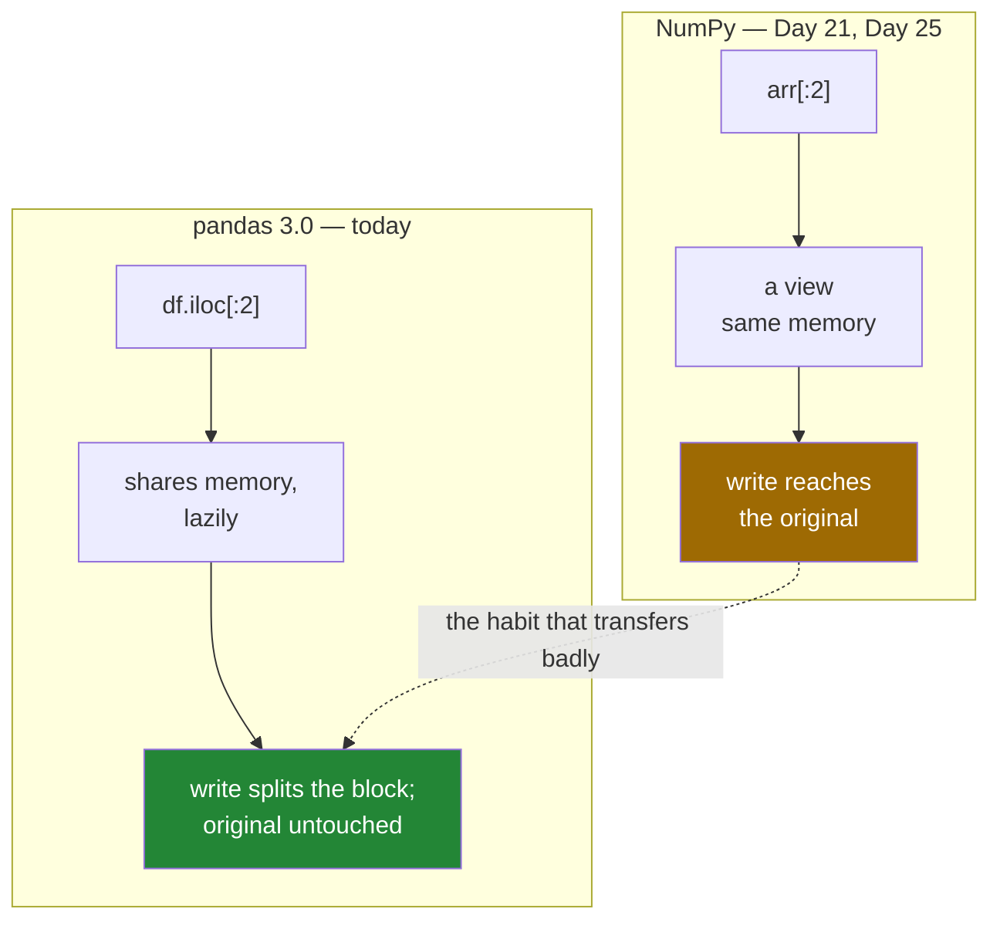

# 3.3 — The question that stopped mattering — view or copy

## One-line answer

"Is this a view or a copy?" is the question Day 25 built a whole gate around for NumPy, and in pandas
3.0 it has **no observable answer** — the same slicing syntax means different things in the two
libraries, and the difference is a real hazard when you use them in the same function.

---

## The story

Somebody moves from a flat where the front door locks itself behind you to one where it does not.

For the first week they keep patting their pocket for keys on the way out, because the old door
punished you for forgetting. Then they stop, because the new door does not.

Six months later they visit their old flat, walk out to the bins, and the door shuts behind them.

The habit was correct for one door and wrong for the other. The trouble is not that they learned the
wrong rule — they learned the right rule for where they lived. It is that both doors look like doors.

---

## The idea in plain language

Day 21 and Day 25 spent a lot of effort on one NumPy question: when you take a slice of an array, do
you get a **view** — a window onto the same memory, where writing changes the original — or a **copy**?

The answer mattered enormously, because NumPy's rules are mixed. A basic slice gives a view
([Day 21, 2.1](../../../day-21-indexing-and-views/parts/02-the-view-trap/2.1-a-slice-does-not-copy.md)).
Fancy indexing gives a copy
([Day 21, 4.3](../../../day-21-indexing-and-views/parts/04-fancy-indexing/4.3-fancy-indexing-always-copies.md)).
`ravel` gives a view when it can and a copy when it cannot
([Day 25, 2.1](../../../day-25-copy-view-and-the-gate/parts/02-the-bug/2.1-ravel-changed-it-flatten-did-not.md)).
Day 25's gate was a table of sixteen operations answering it one by one
([Day 25, 1.1](../../../day-25-copy-view-and-the-gate/parts/01-the-decision/1.1-six-operations-one-question.md)).

**In pandas 3.0, that question has no answer you can act on.** Not because pandas always copies — it
usually does not ([3.2](3.2-the-copy-that-has-not-happened-yet.md)) — but because sharing is never
observable. Whatever pandas is doing underneath, writing to a result never affects its source, so
"view or copy" stops being a question about behaviour and becomes a question about memory only.

So the two libraries now answer the same question differently:

| | NumPy | pandas 3.0 |
|---|---|---|
| `x[:2]` then write to it | **changes the original** | leaves the original alone |
| the rule | depends on the operation | one rule, no exceptions |
| how you check | `np.shares_memory`, `.base` | there is nothing to check |
| what to guard against | accidental modification | a write that goes nowhere |

The hazard is that **the two libraries share their syntax**. `arr[:2]` and `df.iloc[:2]` look alike,
read alike, and sit in the same function. A data-science file typically imports both, and the mental
model has to switch between them at the boundary.

The practical rule is short:

- **In NumPy, assume a slice is a view.** Copy deliberately when you need independence.
- **In pandas, assume everything is independent.** Assign results, because nothing propagates by itself.
- **At the boundary between them**, be most careful of all — which is what
  [3.4](3.4-to-numpy-and-the-read-only-array.md) is about, because it is the one place pandas hands you
  a NumPy array and the two rule sets meet.

None of Day 21 or Day 25 is wasted. Those documents are about NumPy, NumPy still behaves that way, and
every array underneath a pandas column is still a NumPy array. What changed is that pandas grew a layer
on top that hides the distinction — and knowing what is being hidden is why you can predict pandas'
memory behaviour when somebody else can only observe it.

---

## Why Setu needs it

- **Day 21 and Day 25** are the immediately preceding NumPy days, so this is the document that stops
  their rules being misapplied one library up.
- **[3.4](3.4-to-numpy-and-the-read-only-array.md), next**, is the boundary where the two models touch,
  and it is where NumPy habits actually bite in pandas code.
- **Day 30 onwards**, most cleaning code mixes both libraries — a NumPy `where` inside a pandas
  `assign` is routine.
- **Day 91 onwards**, scikit-learn takes frames in and gives arrays back, so every model call crosses
  this boundary twice.
- **Day 125 onwards**, tensors add a third set of rules, and the habit of asking "whose rules am I under
  here" is the transferable part.

---

## The mechanism

The same operation in both libraries, side by side:

```python
import numpy as np
import pandas as pd

arr = np.array([2, 1, 6, 1])
part = arr[:2]
part[0] = 99
print("NumPy  slice:", part.tolist(), "| original:", arr.tolist())
print("NumPy  shares:", np.shares_memory(part, arr), "| base is arr:", part.base is arr)

shop = pd.DataFrame({"need": [2, 1, 6, 1]})
sub = shop.iloc[:2]
sub.loc[0, "need"] = 99
print("pandas slice:", sub["need"].tolist(), "| original:", shop["need"].tolist())
```

**Line by line:**

- `arr[:2]` — a basic slice, so NumPy hands back a **view**: a different array object reading the same
  memory ([Day 21, 2.1](../../../day-21-indexing-and-views/parts/02-the-view-trap/2.1-a-slice-does-not-copy.md)).
- `part[0] = 99` — writes through the view into the shared block, so **`arr` changes too**. Its first
  element is now 99, and nothing announced that.
- `part.base is arr` — `True`. `.base` is the array a view is looking through, and it is `None` for an
  array that owns its own data
  ([Day 21, 2.2](../../../day-21-indexing-and-views/parts/02-the-view-trap/2.2-how-to-tell-base-and-shares-memory.md)).
- `shop.iloc[:2]` — the pandas equivalent, positional and half-open, giving the first two rows.
- `sub.loc[0, "need"] = 99` — writes, and **`shop` does not change**. Same syntax shape, opposite
  outcome.
- The `.tolist()` calls are only for printing; comparing the two `original` values is the whole point of
  the block.

```text
NumPy  slice: [99, 1] | original: [99, 1, 6, 1]
NumPy  shares: True | base is arr: True
pandas slice: [99, 1] | original: [2, 1, 6, 1]
```

The two doors:



Both branches start with a slice and end somewhere different. The dotted line is the mistake this
document exists to prevent, in both directions.

Where the NumPy rules are still exactly true — underneath:

```python
import numpy as np
import pandas as pd

shop = pd.DataFrame({"need": [2, 1, 6, 1]})
block = shop["need"].to_numpy()
print("type of what is underneath:", type(block).__name__, "| dtype:", block.dtype)
print("it is a normal NumPy array:", isinstance(block, np.ndarray))
print("but pandas locked it:", block.flags.writeable)
```

**Line by line:**

- `shop["need"].to_numpy()` — reaches through pandas to the block itself. **This really is a NumPy
  array**, with strides, a dtype and every property Day 20 described
  ([Day 20, 1.3](../../../day-20-arrays-and-dtypes/parts/01-the-block/1.3-one-block-and-strides.md)).
- `isinstance(block, np.ndarray)` — `True`. pandas did not invent a new container; it wrapped NumPy's.
- `block.flags.writeable` — **`False`**, and this is how pandas keeps its promise at the boundary. If
  this array were writeable you could reach through it and change `shop`, which would break the rule
  from [3.1](3.1-every-result-behaves-like-a-copy.md). [3.4](3.4-to-numpy-and-the-read-only-array.md) is
  about exactly this flag.
- So the NumPy rules have not been repealed. They have been **fenced off**, and the fence is the
  read-only flag.

```text
type of what is underneath: ndarray | dtype: int64
it is a normal NumPy array: True
but pandas locked it: False
```

---

## When it breaks

**The NumPy habit applied to pandas — a write that goes nowhere:**

```text
$ uv run python -c "
import pandas as pd
shop = pd.DataFrame({'need': [2, 1, 6, 1]})
first_half = shop.iloc[:2]
first_half.loc[:, 'need'] = 0
print('the subset:', first_half['need'].tolist())
print('the frame :', shop['need'].tolist())
print('did the zeroing take effect on shop?', (shop['need'] == 0).any())
"
the subset: [0, 0]
the frame : [2, 1, 6, 1]
did the zeroing take effect on shop? False
```

**What it means.** Somebody with NumPy reflexes takes a slice, writes through it, and expects the frame
to change — because in NumPy it would have. It does not, nothing warns, and the frame is untouched. The
give-away is that the subset was never assigned back. The fix is to write through the original with a
single `.loc` call — `shop.loc[shop.index[:2], "need"] = 0` — which is
[section 4](../04-chained-assignment/4.3-loc-the-single-step.md)'s subject.

**The pandas habit applied to NumPy — a write that goes somewhere unwanted:**

```text
$ uv run python -c "
import numpy as np

def normalise(values):
    values -= values.min()
    return values / values.max()

readings = np.array([2.0, 1.0, 6.0, 1.0])
scaled = normalise(readings[:3])
print('scaled  :', scaled.tolist())
print('readings:', readings.tolist())
"
scaled  : [0.2, 0.0, 1.0]
readings: [1.0, 0.0, 5.0, 1.0]
```

**What it means.** The reverse mistake, and the more expensive one. `normalise` was written by somebody
used to pandas, where a function cannot damage its argument. In NumPy `readings[:3]` is a view and
`values -= values.min()` is an **in-place** subtraction, so the caller's array was modified — three of
its four values changed, and the fourth did not because it was outside the slice. Nothing raised. The
fix is either `values = values - values.min()`, which rebinds rather than writing in place, or an
explicit `.copy()` at the top of the function; Day 25 made this an API contract
([Day 25, 1.5](../../../day-25-copy-view-and-the-gate/parts/01-the-decision/1.5-the-api-contract.md)).

**Asking pandas the Day 25 question and getting a useless answer:**

```text
$ uv run python -c "
import numpy as np, pandas as pd
shop = pd.DataFrame({'need': [2, 1, 6, 1]})
a = shop.iloc[:2]
b = shop.iloc[:2].copy()
print('a shares with shop:', np.shares_memory(a['need'].to_numpy(), shop['need'].to_numpy()))
print('b shares with shop:', np.shares_memory(b['need'].to_numpy(), shop['need'].to_numpy()))
a.loc[0, 'need'] = 7
b.loc[0, 'need'] = 7
print('after writing to both, shop is:', shop['need'].tolist())
"
a shares with shop: True
b shares with shop: False
after writing to both, shop is: [2, 1, 6, 1]
```

**What it means.** `a` shares memory and `b` does not, and **it makes no difference to anything you can
observe**. Both writes landed on their own object; `shop` is unchanged either way. In NumPy that same
pair of answers would have predicted two completely different outcomes. This is what "the question
stopped mattering" means concretely: the probe still works, the answer is still true, and it no longer
tells you anything about behaviour — only about memory
([3.2](3.2-the-copy-that-has-not-happened-yet.md)).

---

## In production

**What a professional writes instead of the teaching version.** They mark the boundary explicitly, so
the reader knows which rule set applies:

```python
import numpy as np
import pandas as pd


def zscore(frame: pd.DataFrame, column: str) -> pd.Series:
    """Standardise one column. Takes a frame, returns a Series — never touches the input.

    to_numpy(copy=True) is deliberate: past this line we are under NumPy's rules,
    where in-place arithmetic would reach back into the caller's frame.
    """
    values = frame[column].to_numpy(dtype="float64", copy=True)
    values -= values.mean()
    spread = values.std(ddof=0)
    if spread == 0:
        raise ValueError(f"{column} has no variation; every value is {frame[column].iloc[0]!r}")
    values /= spread
    return pd.Series(values, index=frame.index, name=f"{column}_z")
```

**Line by line:**

- `to_numpy(dtype="float64", copy=True)` — the boundary, marked. `copy=True` is what makes the in-place
  arithmetic on the next lines safe; without it the array would be the frame's own read-only block and
  the `-=` would raise ([3.4](3.4-to-numpy-and-the-read-only-array.md)).
- `dtype="float64"` stated — an integer column would otherwise make `-=` a lossy integer operation, and
  the conversion has to happen before any arithmetic rather than after
  ([Day 20, 2.4](../../../day-20-arrays-and-dtypes/parts/02-dtypes/2.4-astype-and-the-copy.md)).
- `values -= values.mean()` and `values /= spread` — deliberately **in place**, because we own this
  array now and in-place arithmetic avoids allocating a second one
  ([Day 23, 1.2](../../../day-23-ufuncs-and-statistics/parts/01-ufuncs/1.2-out-and-the-temporaries.md)).
  That is only defensible because of the `copy=True` above, and the docstring says so.
- `std(ddof=0)` — the divisor stated rather than defaulted. NumPy defaults to `ddof=0` and pandas
  defaults to `ddof=1`, so a function that omits it gives different answers depending on which library
  computed it ([Day 23, 2.3](../../../day-23-ufuncs-and-statistics/parts/02-statistics/2.3-std-var-and-ddof.md)).
  This is a second, quieter boundary hazard between the two libraries.
- `if spread == 0: raise` — a constant column would divide by zero and produce a column of `nan` or
  `inf` with only a warning ([Day 23, 1.3](../../../day-23-ufuncs-and-statistics/parts/01-ufuncs/1.3-divide-by-zero-warns.md)).
- `pd.Series(values, index=frame.index, ...)` — back across the boundary, and **the index is put back
  on**. Returning a bare array would strip the labels and invite the positional-assignment bug from
  [1.2](../01-the-two-objects/1.2-the-index-is-not-a-row-number.md).

**What changes at scale.** The boundary becomes the place to think about memory. `to_numpy(copy=True)`
on a large column doubles it, so a function that does this to twenty columns holds twenty copies; the
alternative — operating in pandas and letting CoW handle it — is usually both simpler and lighter, and
the NumPy detour is worth it only for operations pandas cannot express. The other thing that changes is
that **scikit-learn and friends take arrays, so the boundary is crossed on every model call**, and
whether those libraries copy their input is documented per estimator rather than guaranteed. The
defensive habit in a pipeline is to treat any array handed to a third-party library as potentially
modified by it, which is Day 25's contract rule applied to somebody else's code
([Day 25, 1.5](../../../day-25-copy-view-and-the-gate/parts/01-the-decision/1.5-the-api-contract.md)).

**The failure that only appears with real data.** A team wrote a feature transform that took
`df["amount"].to_numpy()`, clipped it in place with `np.clip(values, 0, cap, out=values)`, and returned
it. On pandas 2.x this sometimes reached back and clipped the caller's frame as well, and on their
sample data the clip never triggered — the values were all inside the cap — so nothing was ever
observed. In production, values above the cap were common, and the frame the transform was given was
also used, later, to produce the audit report. **The audit and the model disagreed about the same
column**, because one of them had been clipped in place by a function that was documented as returning a
new array. Under pandas 3.0 the same code raises immediately on the read-only block instead, which is a
much better outcome and is the subject of the next document.

**The review comment a senior engineer leaves.** *"Line 30 drops into NumPy with `.to_numpy()` and then
does `-=` on it. Add `copy=True`, or this raises on a read-only block — and if it ever stops raising,
that means we are modifying the frame the caller handed us. Also `std()` here is NumPy's, so `ddof=0`;
the pandas version two functions up uses `ddof=1` and they will not agree."*

**The interview question.** *"You know NumPy well. What is different about views and copies in pandas
3.0?"* In NumPy the distinction is observable and the rules are mixed — a basic slice is a view and
writing through it changes the original, while fancy indexing copies. In pandas 3.0 Copy-on-Write makes
the distinction unobservable: results share memory lazily, but a write always splits the block first, so
nothing you do to a subset reaches its source. `np.shares_memory` still answers, and the answer no longer
predicts anything about behaviour — only about memory. The real hazard is that the two libraries share
their slicing syntax and are usually imported together, so the danger is carrying a NumPy habit into
pandas, where a write silently goes nowhere, or a pandas habit into NumPy, where a function silently
modifies its caller's array.

---

## Check yourself

```bash
uv run python -c "
import numpy as np, pandas as pd
arr = np.array([2, 1, 6, 1])
arr[:2][0] = 99
print('NumPy  after writing to a slice:', arr.tolist())
shop = pd.DataFrame({'need': [2, 1, 6, 1]})
sub = shop.iloc[:2]
sub.loc[0, 'need'] = 99
print('pandas after writing to a slice:', shop['need'].tolist())
print('underlying array writeable?', shop['need'].to_numpy().flags.writeable)
"
```

Two slices, two writes, one original changed and one did not. Say which library did which, and what the
third line has to do with it.

**Answer out loud, without scrolling up:**

> In NumPy, does writing to a basic slice change the original? In pandas 3.0, does it? Then say what
> `np.shares_memory` still tells you about a pandas frame, and what it no longer tells you.

---

**Next:** [3.4 — `to_numpy` and the read-only array](3.4-to-numpy-and-the-read-only-array.md).
