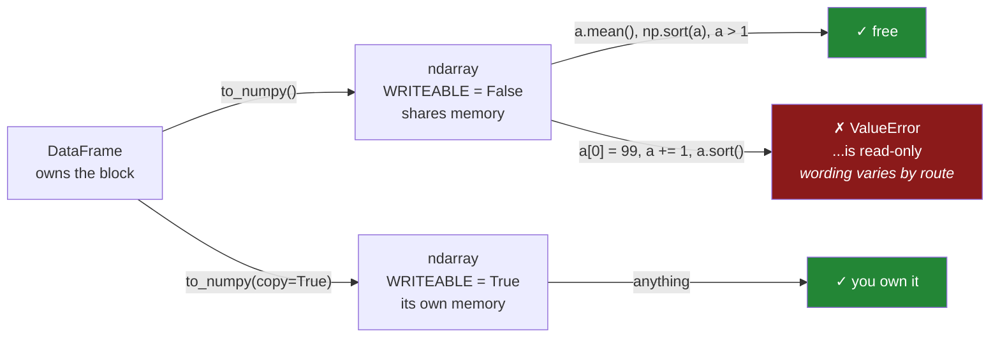

# 3.4 — `to_numpy` and the read-only array

## One-line answer

`to_numpy()` hands back the frame's actual block with its `WRITEABLE` flag turned **off**, so any
attempt to write through it raises immediately — which is how pandas keeps its copy guarantee at the
one place where it lets NumPy's rules back in.

---

## The story

A library lets you take a rare book off the shelf and read it at the desk by the window. You may turn
every page, copy anything out by hand, sit with it all afternoon.

There is a small sign on the desk: no pens. Pencils are at the counter, along with paper, and if you
want a version you can annotate, the photocopier is by the door.

The rule is not there to make life difficult. It is there because there is exactly one of that book,
and the next person to ask for it should get the same book. Making a copy is easy and takes ten
seconds — the library just wants you to make the copy on purpose, rather than by accident, halfway
through a sentence.

---

## The idea in plain language

Section 3 has been about a promise: nothing you get from a frame can change the frame
([3.1](3.1-every-result-behaves-like-a-copy.md)). pandas keeps that promise cheaply by sharing memory
and copying only on a write ([3.2](3.2-the-copy-that-has-not-happened-yet.md)).

`to_numpy()` is the one place that promise is genuinely in danger, because it hands you the raw NumPy
array underneath. NumPy has no idea about Copy-on-Write. If that array were writeable, `values[0] = 99`
would go straight into the frame's memory and the promise would be broken with no way for pandas to
notice.

So pandas turns the array's **`WRITEABLE` flag off** before handing it over.

You met that flag on Day 25, where it was the tool that turned a silent aliasing bug into a loud error
([Day 25, 1.3](../../../day-25-copy-view-and-the-gate/parts/01-the-decision/1.3-writeable-the-flag.md)).
Here it is doing exactly the same job, one library up, and pandas sets it for you.

What that means in practice:

- **Reading is completely free.** Every NumPy operation that only reads — `mean`, `sum`, `argsort`, a
  comparison, passing it to a plotting library or a model — works normally and copies nothing.
- **Writing raises.** `values[0] = 99` gives `ValueError: assignment destination is read-only`. Every
  in-place operation is refused too — `values += 1`, `np.clip(..., out=values)`, `values.sort()` — but
  the wording differs by route: the ufunc path says *output array is read-only* and `sort` says *sort
  array is read-only*. Three messages, one cause.
- **When you want to write, ask for a copy**: `to_numpy(copy=True)`. That gives you a writeable array
  that is genuinely yours, and it costs one duplication, which you asked for.

`.values` behaves the same way and is the older spelling. Prefer `.to_numpy()`: it takes arguments,
including `copy=` and `dtype=`, and it is defined to return a NumPy array for every dtype, which
`.values` is not.

The error is a good one. Compare it with the alternative: on pandas 2.x this array was often writeable,
so the same code silently modified the frame — sometimes. The read-only flag converts a bug that shows
up as wrong numbers in a report next month into an exception on the line that caused it.

---

## Why Setu needs it

- **[3.1](3.1-every-result-behaves-like-a-copy.md)'s promise** is enforced here, and this is the only
  document that shows the enforcement rather than the rule.
- **Day 27** writes frames to Parquet, which reads the blocks directly — read-only access is exactly
  what a writer needs ([Day 27, 3.2](../../../day-27-reading-and-writing/parts/03-parquet/3.2-the-round-trip-that-keeps-dtypes.md)).
- **Day 36 onwards**, plotting libraries take arrays out of frames constantly, and they only read.
- **Day 91 onwards**, every scikit-learn call converts a frame to an array, and some estimators want to
  scale in place — which is where `copy=True` stops being optional.
- **Day 125 onwards**, `torch.from_numpy` on a read-only array warns about exactly this, and the fix is
  the same one.

---

## The mechanism

The flag, and the error it produces:

```python
import numpy as np
import pandas as pd

shop = pd.DataFrame({"item": ["milk", "bread", "eggs", "rice"], "need": [2, 1, 6, 1]})

a = shop["need"].to_numpy()
print("writeable:", a.flags.writeable, "| shares:", np.shares_memory(a, shop["need"].to_numpy()))
try:
    a[0] = 99
except ValueError as exc:
    print("writing raises:", exc)
```

**Line by line:**

- `shop["need"].to_numpy()` — the block itself, not a copy. `np.shares_memory` confirms it: the array
  and the frame occupy the same bytes
  ([Day 21, 2.2](../../../day-21-indexing-and-views/parts/02-the-view-trap/2.2-how-to-tell-base-and-shares-memory.md)).
- `a.flags.writeable` — **`False`**. NumPy arrays carry a set of flags, and this is the one that decides
  whether assignment is allowed ([Day 25, 1.3](../../../day-25-copy-view-and-the-gate/parts/01-the-decision/1.3-writeable-the-flag.md)).
- `a[0] = 99` — refused. **This is the promise being kept**: if the write had succeeded, `shop` would
  have changed through the back door.
- `except ValueError` — the specific exception, caught by type
  ([Day 18, 1.2](../../../day-18-exceptions/parts/01-raising-and-catching/1.2-try-except-and-catching-by-type.md)).
  Catching it here is only so the document can print it; in real code you should not be writing to this
  array at all.

```text
writeable: False | shares: True
writing raises: assignment destination is read-only
```

Asking for one you may write to:

```python
import numpy as np
import pandas as pd

shop = pd.DataFrame({"item": ["milk", "bread", "eggs", "rice"], "need": [2, 1, 6, 1]})

b = shop["need"].to_numpy(copy=True)
print(
    "copy=True writeable:",
    b.flags.writeable,
    "| shares:",
    np.shares_memory(b, shop["need"].to_numpy()),
)
b[0] = 99
print("array:", b.tolist(), "| frame:", shop["need"].tolist())
```

**Line by line:**

- `to_numpy(copy=True)` — **the deliberate photocopy.** pandas duplicates the block and hands you the
  duplicate.
- `writeable` is `True` and `shares_memory` is `False`, in that order, and the two facts are the same
  fact: it is writeable *because* it is not shared.
- `b[0] = 99` succeeds, and the frame is unchanged. You now own an array and can do anything NumPy
  allows to it, including in-place arithmetic
  ([Day 23, 1.2](../../../day-23-ufuncs-and-statistics/parts/01-ufuncs/1.2-out-and-the-temporaries.md)).
- The cost is one full duplication of the column, paid at this line. On a large column that is the
  memory to budget for, and it is why `copy=True` is opt-in rather than the default.

```text
copy=True writeable: True | shares: False
array: [99, 1, 6, 1] | frame: [2, 1, 6, 1]
```

Reading, which is the overwhelmingly common case and costs nothing:

```python
import numpy as np
import pandas as pd

shop = pd.DataFrame({"item": ["milk", "bread", "eggs", "rice"], "need": [2, 1, 6, 1]})

a = shop["need"].to_numpy()
print("mean   :", a.mean())
print("argsort:", np.argsort(a).tolist())
print("mask   :", (a > 1).tolist())
print("sorted :", np.sort(a).tolist(), "— np.sort returns a new array, so this is fine")
print("frame unchanged:", shop["need"].tolist())
```

**Line by line:**

- `a.mean()`, `np.argsort(a)`, `a > 1` — all pure reads. The read-only flag is irrelevant to them and
  none of them copies the data
  ([Day 23, 3.2](../../../day-23-ufuncs-and-statistics/parts/03-sorting-and-searching/3.2-argsort-the-positions.md)).
- `np.sort(a)` — **works**, because it returns a *new* sorted array and leaves `a` alone. Its method
  cousin `a.sort()` sorts in place and would raise
  ([Day 23, 3.1](../../../day-23-ufuncs-and-statistics/parts/03-sorting-and-searching/3.1-sort-and-the-copy.md)).
  That pairing is the single most useful thing to know here: **the function form returns, the method
  form mutates**, and on a read-only array only the function form is available.
- The last line confirms nothing leaked back. Every operation above is safe on the shared block, which
  is why pandas hands it over without copying in the first place.

```text
mean   : 2.5
argsort: [1, 3, 0, 2]
mask   : [True, False, True, False]
sorted : [1, 1, 2, 6] — np.sort returns a new array, so this is fine
frame unchanged: [2, 1, 6, 1]
```

The desk by the window:



---

## When it breaks

**In-place arithmetic on a borrowed array:**

```text
$ uv run python -c "
import pandas as pd
shop = pd.DataFrame({'need': [2, 1, 6, 1]})
values = shop['need'].to_numpy()
values += 1
"
Traceback (most recent call last):
  ...
ValueError: output array is read-only
```

**What it means.** `+=` is an in-place operation: it writes the result back into the array it was given,
rather than making a new one
([Day 23, 1.2](../../../day-23-ufuncs-and-statistics/parts/01-ufuncs/1.2-out-and-the-temporaries.md)).
On a read-only array that is refused. Note the message is *"output array is read-only"* rather than
*"assignment destination"* — the ufunc machinery reports it differently from a plain index assignment,
and both mean the same thing. The two fixes are genuinely different: `values = values + 1` makes a new
array and leaves the frame alone, while `to_numpy(copy=True)` gives you one you may modify in place.
Choose the first unless you specifically want in-place arithmetic.

**A library that wants to scale in place:**

```text
$ uv run python -c "
import numpy as np, pandas as pd
shop = pd.DataFrame({'need': [2.0, 1.0, 6.0, 1.0]})
values = shop['need'].to_numpy()
np.clip(values, 0, 3, out=values)
"
Traceback (most recent call last):
  ...
ValueError: output array is read-only
```

**What it means.** `out=` asks a NumPy function to write its result into an array you supply, which is
the standard way to avoid allocating a temporary
([Day 23, 1.2](../../../day-23-ufuncs-and-statistics/parts/01-ufuncs/1.2-out-and-the-temporaries.md)).
It is refused for the same reason. This pattern appears inside third-party code — a preprocessing
routine that scales its input in place to save memory — so the traceback may point somewhere you did not
write. The fix is to hand that library `to_numpy(copy=True)`, or to check whether it has a `copy=`
parameter of its own; most scikit-learn transformers do, and it defaults to `True` precisely so this
does not happen.

**`.values`, which behaves the same and tells you less:**

```text
$ uv run python -c "
import pandas as pd
shop = pd.DataFrame({'item': ['milk', 'bread'], 'need': [2, 1]})
print('.values writeable      :', shop['need'].values.flags.writeable)
print('whole-frame .values    :', shop.values.dtype)
print('whole-frame .to_numpy():', shop.to_numpy().dtype)
"
.values writeable      : False
whole-frame .values    : object
whole-frame .to_numpy(): object
```

**What it means.** Two things. First, `.values` is read-only too, so switching spelling does not get you
a writeable array — that needs `copy=True`, which `.values` cannot take. Second, taking `.values` of a
whole frame with mixed dtypes gives an **`object`** array, because one array needs one dtype and the
only one that fits text next to numbers is `object`
([1.3](../01-the-two-objects/1.3-a-table-of-columns.md)). That is the row problem from earlier today,
applied to the whole table at once, and it is a common accidental way to turn a well-typed frame into
the slowest possible array. Convert **one column at a time** unless every column already shares a dtype.

---

## In production

**What a professional writes instead of the teaching version.** A helper that makes the borrow-or-copy
decision explicit and states it in the signature:

```python
import numpy as np
import pandas as pd


def as_array(frame: pd.DataFrame, column: str, *, writable: bool = False) -> np.ndarray:
    """The column as a NumPy array. Read-only by default; pass writable=True to pay for a copy."""
    series = frame[column]
    if series.isna().any():
        raise ValueError(
            f"{column} has {int(series.isna().sum())} missing values; fill or drop first"
        )
    array = series.to_numpy(copy=writable)
    if writable and not array.flags.writeable:
        array = array.copy()
    return array
```

**Line by line:**

- `writable: bool = False` — **keyword-only** and defaulting to the cheap option
  ([Day 10, 1.5](../../../day-10-functions/parts/01-the-signature/1.5-keyword-only-and-positional-only.md)). The call
  site reads `as_array(df, "need", writable=True)`, which is a sentence about intent rather than a bare
  `True`.
- The `isna` check **before** converting — this is the important one. A float column with gaps converts
  to an array full of `nan`, and every NumPy reduction over it then returns `nan` silently
  ([Day 23, 2.5](../../../day-23-ufuncs-and-statistics/parts/02-statistics/2.5-the-nan-family.md)). An
  integer column with gaps is worse: it is `float64` before it ever reaches here
  ([1.3](../01-the-two-objects/1.3-a-table-of-columns.md)). Refusing at the boundary with a count in the
  message is far better than a `nan` arriving in a report.
- `to_numpy(copy=writable)` — the flag passed straight through, so there is one decision and one place
  it is made.
- The `if writable and not array.flags.writeable` belt-and-braces line — `copy=True` should always give
  a writeable array, and this asserts it rather than trusting it, because the cost of being wrong is a
  silent write into the caller's frame. It is cheap: on the normal path the condition is `False` and
  nothing happens.
- Returning `np.ndarray` in the annotation, so a reader knows they have left pandas and are under
  NumPy's rules from here ([3.3](3.3-the-question-that-stopped-mattering.md)).

**What changes at scale.** The read-only default is what makes the pandas-to-NumPy boundary free, and
that matters more the larger the data is: handing a four-gigabyte column to a plotting or modelling
routine costs nothing as long as that routine only reads. The moment anything needs `copy=True` the cost
is the full column, so the professional habit is to **push the copy as late and as narrow as possible** —
select the rows and columns you need first, then copy. There is a second consideration that appears in
deep-learning code: `torch.from_numpy` on a read-only array produces a tensor that PyTorch warns about,
because the tensor is writeable while its underlying buffer is not, and writing through it is undefined.
The fix there is an explicit `copy=True` at the pandas boundary rather than silencing the warning.

**The failure that only appears with real data.** A team's feature pipeline handed
`df["amount"].to_numpy()` to a normaliser that scaled in place. It had run on pandas 2.x for two years
without complaint, because the array it received was writeable and the scaling worked — while also
quietly rescaling the source frame, which was reused a few steps later to compute an audit total. The
audit had been wrong for two years and nobody could reproduce it, because on the sample data the
pipeline was run once and the reuse never happened. **Upgrading to pandas 3.0 turned that silent
corruption into a `ValueError` on the exact line**, and the fix was three characters: `copy=True`. This
is the best possible outcome from a breaking change — a long-standing silent bug converted into a
loud one at the point of the mistake.

**The review comment a senior engineer leaves.** *"`to_numpy()` then `values -= mean` — that will raise
on the read-only block. Either use `copy=True` if you mean to work in place, or rebind with `values =
values - mean`. And if it ever stops raising after some refactor, that means we are writing into the
caller's frame, so please add a test that asserts the input frame is unchanged."*

**The interview question.** *"Why does `df["x"].to_numpy()` give you a read-only array in pandas 3.0?"*
Because it hands back the frame's actual block rather than a copy, and Copy-on-Write promises that
nothing you get from a frame can modify it. NumPy knows nothing about that promise, so pandas enforces
it by clearing the array's `WRITEABLE` flag — any write, including in-place operations like `+=` or an
`out=` argument, raises `ValueError` instead of silently corrupting the frame. Reads are unaffected and
free, which is the common case. When you genuinely need to modify the array, `to_numpy(copy=True)` gives
you your own writeable copy, and the cost is one duplication that you asked for explicitly.

---

## Check yourself

```bash
uv run python -c "
import numpy as np, pandas as pd
shop = pd.DataFrame({'need': [2, 1, 6, 1]})
a = shop['need'].to_numpy()
b = shop['need'].to_numpy(copy=True)
print('borrowed writeable:', a.flags.writeable, '| shares:', np.shares_memory(a, shop['need'].to_numpy()))
print('copied   writeable:', b.flags.writeable, '| shares:', np.shares_memory(b, shop['need'].to_numpy()))
print('reading is fine    :', a.mean(), np.sort(a).tolist())
try:
    a.sort()
except ValueError as exc:
    print('a.sort() raises    :', exc)
"
```

`np.sort(a)` works and `a.sort()` does not. Say what the difference is between them.

**Answer out loud, without scrolling up:**

> Why is the array from `to_numpy()` read-only, and which flag makes it so? Then name two operations
> that raise on it and one that does not, and say what you pass to get a writeable one.

---

**Next:** [4.1 — The write that vanished](../04-chained-assignment/4.1-the-write-that-vanished.md).
