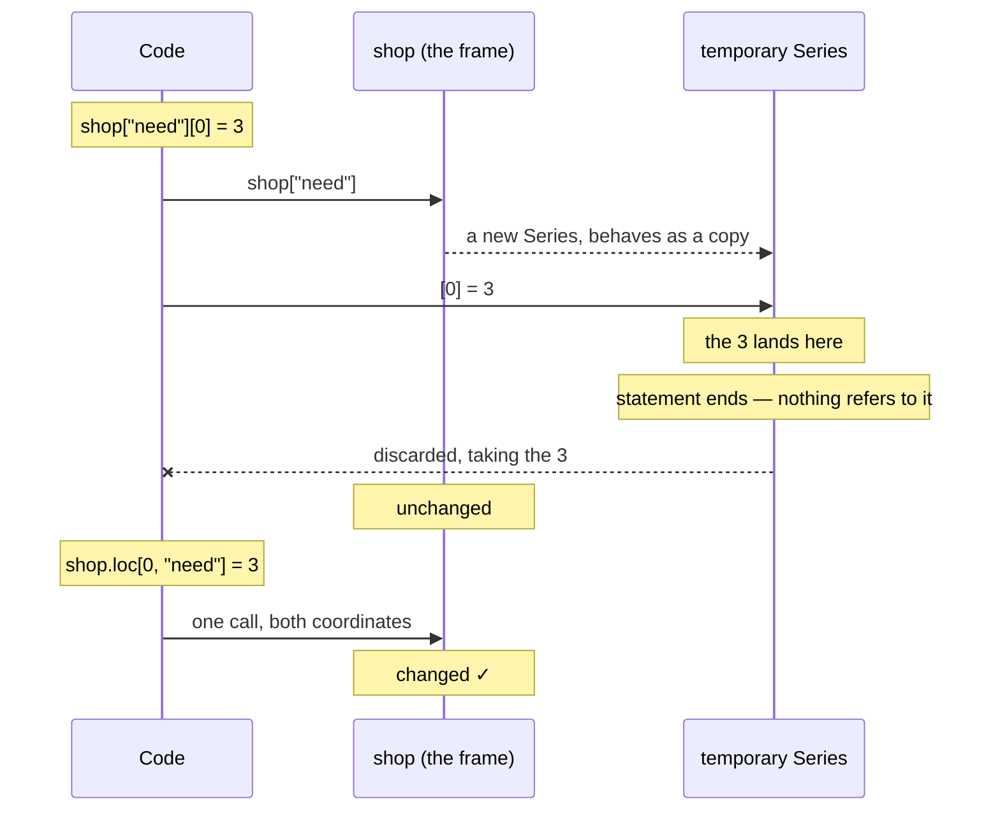

# 4.1 — The write that vanished

## One-line answer

`shop["need"][0] = 3` does not change `shop` — the value is written into a temporary that is thrown
away on the same line — and pandas 3.0 tells you so with a `ChainedAssignmentError`, which despite its
name is a warning and does not stop your program.

---

## The story

Somebody wants to change the shopping list: two milk should be three.

They take a photo of the list on their phone, open it, tap the 2, change it to a 3, and put the phone
back in their pocket. Then they go to the shop and buy two milk, because the sheet on the fridge — the
one the list actually is — still says two.

Nothing about that felt like a mistake while they were doing it. They looked at the list, they changed
the number, they saw the new number. Every step gave the feedback they expected. The photo even still
says three, if they check.

The photo was never the list.

---

## The idea in plain language

This is the single most famous trap in pandas, and Copy-on-Write is what finally made it consistent.

The expression is called **chained assignment**, because it chains two square-bracket operations
together and then assigns:

```text
shop["need"][0] = 3
      ↑        ↑
   first     second
```

Read it left to right, the way Python does. `shop["need"]` runs first and produces **a Series** — a
separate object, which under Copy-on-Write behaves as its own copy
([3.1](../03-copy-on-write/3.1-every-result-behaves-like-a-copy.md)). Then `[0] = 3` writes into that
Series. Then the statement ends, nothing holds a reference to the Series any more, and it is discarded.

The 3 was written. It was written into an object that no longer exists.

pandas 3.0 detects this particular shape and emits a **`ChainedAssignmentError`**. Read the name
carefully, because it is misleading in a way that matters: **it is a warning, not an exception.** Its
parent class is `Warning`. It prints to standard error and the program carries on to the next line with
the data unchanged. In a notebook it appears above the cell output and is very easy to scroll past; in a
scheduled job it goes to a log file that nobody reads.

The message pandas prints is unusually good, and it is worth reading in full rather than pattern-
matching on the first line — it names the cause and the fix in two sentences.

The fix is to do the whole thing in **one** operation rather than two, so that pandas knows you are
writing to `shop` rather than to something derived from it:

```text
shop.loc[0, "need"] = 3
```

One call, one object, and the row and column are both inside a single set of brackets.
[4.3](4.3-loc-the-single-step.md) is about why that works and how to write it for every case.

The one thing to hold on to before the next document explains the machinery: **the number of bracket
pairs before the `=` is the tell.** Two pairs is chained assignment. One pair is a real write.

---

## Why Setu needs it

- **[4.2](4.2-two-brackets-two-calls.md), next**, explains exactly why two brackets cannot work, in
  terms of what Python does with the line.
- **[4.3](4.3-loc-the-single-step.md)** is the fix, in all the forms you will need.
- **[4.5](4.5-the-filtered-frame-that-warned-nobody.md)** is the version of this trap that pandas does
  *not* warn about, which is why this section has five documents rather than one.
- **The Days 26–35 phase gate** says "no chained assignment anywhere", and this is the thing it is
  talking about.
- **Day 30 onwards**, every cleaning step writes into a frame, and this is the mistake that makes a
  cleaning step silently do nothing.

---

## The mechanism

The trap, run:

```python
import pandas as pd

shop = pd.DataFrame(
    {
        "item": ["milk", "bread", "eggs", "rice"],
        "need": [2, 1, 6, 1],
        "price": [1.15, 1.40, 0.32, 2.05],
    }
)
shop["need"][0] = 3
print("after the write, need is:", shop["need"].tolist())
```

**Line by line:**

- `shop["need"]` — the first bracket. Returns a Series holding the `need` column
  ([1.1](../01-the-two-objects/1.1-a-column-with-labels.md)). Under CoW this behaves as its own copy.
- `[0] = 3` — the second bracket, writing into **that Series**, not into `shop`. The write itself
  succeeds perfectly.
- The statement ends. Nothing was assigned to a name, so the Series is unreachable and Python frees it,
  taking the 3 with it.
- `shop["need"]` on the next line — a **fresh** Series from the unchanged frame, still starting with 2.
- The warning below is printed by pandas at the moment of the write. **The program does not stop**, and
  the `print` on the next line runs normally.

```text
<string>:9: ChainedAssignmentError: A value is being set on a copy of a DataFrame or Series through chained assignment.
Such chained assignment never works to update the original DataFrame or Series, because the intermediate object on which we are setting values always behaves as a copy (due to Copy-on-Write).

Try using '.loc[row_indexer, col_indexer] = value' instead, to perform the assignment in a single step.

See the documentation for a more detailed explanation: https://pandas.pydata.org/pandas-docs/stable/user_guide/copy_on_write.html#chained-assignment
after the write, need is: [2, 1, 6, 1]
```

The fix, run:

```python
import pandas as pd

shop = pd.DataFrame(
    {
        "item": ["milk", "bread", "eggs", "rice"],
        "need": [2, 1, 6, 1],
        "price": [1.15, 1.40, 0.32, 2.05],
    }
)
shop.loc[0, "need"] = 3
print("after .loc, need is:", shop["need"].tolist())
```

**Line by line:**

- `shop.loc[0, "need"]` — **one** bracket pair containing both coordinates: row label `0`, column
  `"need"`. `.loc` selects by label ([1.2](../01-the-two-objects/1.2-the-index-is-not-a-row-number.md)).
- Because it is a single operation on `shop` itself, pandas knows the target is `shop` and writes there.
  There is no intermediate object to lose the value in.
- No warning, and the change is visible on the next line.
- The comma inside the brackets is doing the work that the second bracket pair was doing in the broken
  version. **Row first, column second**, always, in `.loc` and `.iloc` alike.

```text
after .loc, need is: [3, 1, 6, 1]
```

The photo and the list:



---

## When it breaks

**The two-statement version, which does the same thing and says nothing:**

```text
$ uv run python -c "
import pandas as pd
shop = pd.DataFrame({'need': [2, 1, 6, 1]})
column = shop['need']
column[0] = 3
print('column:', column.tolist())
print('shop  :', shop['need'].tolist())
"
column: [3, 1, 6, 1]
shop  : [2, 1, 6, 1]
```

**What it means. This is more dangerous than the warned version.** It is the same mistake with the
intermediate given a name, and **no warning is printed at all** — pandas detects chained assignment by
recognising the one-line shape, and this is two lines. The write really did land in `column`, so
inspecting `column` shows the new value and everything looks correct. Only `shop` is stale.

This is why "just fix the lines that warn" is not a complete strategy. The warning finds the textbook
spelling; the same bug written across two statements is invisible, and it is extremely common because
naming an intermediate is otherwise good style.

**The warning that does not stop anything:**

```text
$ uv run python -c "
import pandas as pd
shop = pd.DataFrame({'need': [2, 1]})
shop['need'][0] = 3
print('still running, and need is:', shop['need'].tolist())
print('is ChainedAssignmentError an exception?', issubclass(pd.errors.ChainedAssignmentError, Exception))
print('is it a warning?                       ', issubclass(pd.errors.ChainedAssignmentError, Warning))
" 2>/dev/null
still running, and need is: [2, 1]
is ChainedAssignmentError an exception? True
is it a warning?                        True
```

**What it means.** The name says `Error`, and it is a `Warning` — in Python every warning class is also
an `Exception` subclass, which is why both checks say `True`, but what governs behaviour is that it goes
through the warning machinery. So it prints and execution continues. A `try`/`except` around the line
will not catch it, and a script full of these exits with status 0.

To make it stop your program, promote it:

```text
warnings.simplefilter("error", pd.errors.ChainedAssignmentError)
```

Putting that in `conftest.py` turns every chained assignment in the test suite into a failure, which is
the cheapest way to keep the phase gate's "no chained assignment anywhere" honest.

**The `+=` version, where one bracket works and two do not:**

```text
$ uv run python -c "
import pandas as pd
shop = pd.DataFrame({'need': [2, 1, 6, 1]})
shop['need'] += 1
print('whole column:', shop['need'].tolist())
shop['need'][0] += 1
print('one element :', shop['need'].tolist())
" 2>/dev/null
whole column: [3, 2, 7, 2]
one element : [3, 2, 7, 2]
```

**What it means.** The first line worked — every count went up by one — and the second did nothing. The
bracket count is the whole story again. `shop["need"] += 1` is **one** bracket pair, and Python expands
it to `shop["need"] = shop["need"] + 1`, which ends in an ordinary column assignment on `shop` itself.
`shop["need"][0] += 1` is **two** pairs, expanding to a read of the column, an add, and a write back into
the temporary — chained assignment wearing a `+=`.

The reason this one is worth its own example is that neither line looks like an assignment to a
beginner's eye, and they are adjacent in the source. If you are scanning code for this bug, **count the
bracket pairs to the left of the operator**, and remember that `+=`, `-=`, `*=` and friends all count as
assignments.

---

## In production

**What a professional writes instead of the teaching version.** They never write to a frame element by
element at all — they build a column and assign it once:

```python
import pandas as pd


def restock(shop: pd.DataFrame, minimum: int) -> pd.DataFrame:
    """Raise every count below `minimum` up to it. Returns a new frame."""
    if "need" not in shop.columns:
        raise KeyError(f"no 'need' column; got {shop.columns.tolist()}")
    return shop.assign(need=shop["need"].clip(lower=minimum))
```

**Line by line:**

- `shop["need"].clip(lower=minimum)` — the whole column raised to at least `minimum` in one vectorised
  call ([Day 23, 1.5](../../../day-23-ufuncs-and-statistics/parts/01-ufuncs/1.5-maximum-clip-and-elementwise.md)).
  No loop, no index, no element-by-element write, and therefore **no opportunity for chained
  assignment to exist**.
- `.assign(need=...)` — returns a new frame with that column replaced. It is an expression, so it
  chains, and it cannot be written in the broken two-bracket form
  ([3.1](../03-copy-on-write/3.1-every-result-behaves-like-a-copy.md)).
- Returning rather than modifying — the caller writes `shop = restock(shop, 2)` and the data flow is on
  the page.
- The `in shop.columns` check first, so a missing column produces a sentence naming what was found
  rather than a bare `KeyError`
  ([Day 18, 3.3](../../../day-18-exceptions/parts/03-your-own/3.3-the-message-is-an-interface.md)).
- **The deeper point: the best defence against chained assignment is not to write to individual cells.**
  Almost every real requirement is a column-level operation, and column-level operations have no chained
  form.

**What changes at scale.** The failure mode changes character. On four rows you notice that the number
did not change; on four million rows inside a nightly job you notice a metric that is subtly wrong six
weeks later. Two practices make the difference. First, promote `ChainedAssignmentError` to an error in
CI, as above, so the warned form can never reach production. Second — and this is the one that catches
the *unwarned* two-statement form — **assert the effect rather than trusting the write**: after a
cleaning step, check that the number of rows meeting the condition is now zero. A write that vanished
fails that assertion; a warning-based strategy alone does not see it. There is also a performance angle:
element-by-element writes are slow for the same reason row loops are
([1.3](../01-the-two-objects/1.3-a-table-of-columns.md)), so the vectorised fix is usually hundreds of
times faster as well as correct.

**The failure that only appears with real data.** A pipeline capped outlier prices with
`df["price"][df["price"] > cap] = cap`. On pandas 2.x it worked, most of the time, because the
intermediate happened to be a view. After the upgrade it silently stopped working — and it stopped
working **only for the rows it was meant to affect**, which were rare. The daily row counts were
identical, every column was present, and the only symptom was that a handful of extreme prices survived
into the model each day. The team found it when a single order of £2 million reached a dashboard. The
warning had been printed to a log file all along; nobody reads a log file that has fifty warnings a day
in it, which is the practical argument for promoting it to an error rather than logging it.

**The review comment a senior engineer leaves.** *"`df['status'][mask] = 'closed'` on line 61 is chained
assignment — it warns and does nothing. Use `df.loc[mask, 'status'] = 'closed'`. And can we add the
`simplefilter('error', ChainedAssignmentError)` to `conftest.py` so the next one fails the build instead
of getting reviewed?"*

**The interview question.** *"What is chained assignment and why does it not work?"* It is writing
through two consecutive indexing operations — `df["col"][0] = x`. Python evaluates the first bracket
into an intermediate object, and under Copy-on-Write that intermediate behaves as its own copy, so the
write lands there and the intermediate is discarded at the end of the statement. The original frame is
untouched. pandas 3.0 emits a `ChainedAssignmentError`, which despite its name is a warning and does not
halt the program. The fix is a single operation — `df.loc[0, "col"] = x` — and the thing most people
miss is that the same bug written across two statements, with the intermediate given a name, produces no
warning at all.

---

## Check yourself

```bash
uv run python -c "
import pandas as pd
shop = pd.DataFrame({'item': ['milk', 'bread'], 'need': [2, 1]})
shop['need'][0] = 3
print('chained :', shop['need'].tolist())
column = shop['need']
column[0] = 3
print('2-stmt  :', shop['need'].tolist(), '(and no warning at all)')
shop.loc[0, 'need'] = 3
print('with loc:', shop['need'].tolist())
"
```

Three attempts to write a 3 and only one of them worked. Say which, and say which of the two failures is
more dangerous.

**Answer out loud, without scrolling up:**

> Why does `df["col"][0] = x` not change `df`? Then say whether `ChainedAssignmentError` stops your
> program, and what the equivalent two-statement version warns about.

---

**Next:** [4.2 — Two brackets, two calls](4.2-two-brackets-two-calls.md).
