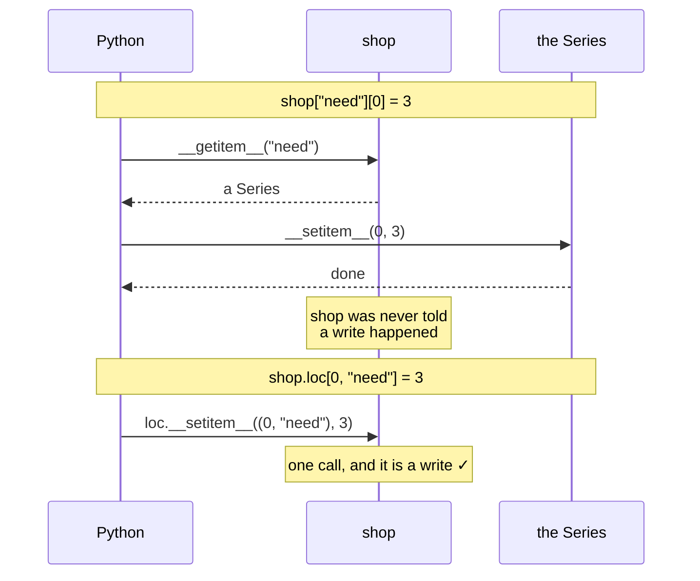

# 4.2 — Two brackets, two calls

## One-line answer

`shop["need"][0] = 3` calls `__getitem__` on the frame and `__setitem__` on **whatever that returned** —
so the frame is never told that a write happened, and no amount of cleverness inside pandas could make
it work.

---

## The story

Somebody rings the council to report a broken street light. The switchboard answers, listens, and puts
them through to the highways office. They explain the problem to highways, who write it down, thank
them, and hang up.

Two weeks later the light is still broken. It turns out highways deals with potholes; street lights are
lighting, in a different building. The person on the phone did exactly what they were asked and wrote
the report down carefully — in their own notebook, which is not the one that gets read on Monday.

The switchboard never knew what the call was about. It only knew where to put it through. And once it
had, it was out of the conversation entirely.

---

## The idea in plain language

[4.1](4.1-the-write-that-vanished.md) said the write lands on a temporary. This document says *why*
Python cannot do anything else, and the reason is a rule you already know from Day 15
([Day 15, 3.1](../../../day-15-constructors-and-dunders/parts/03-the-dunders/3.1-what-a-dunder-method-is.md)).

Square brackets are method calls in disguise. When Python sees square brackets it calls one of two
**dunder methods** — methods with two underscores on each side, which Python calls on your behalf:

- **Reading** — `thing[key]` calls `thing.__getitem__(key)`.
- **Writing** — `thing[key] = value` calls `thing.__setitem__(key, value)`.

Now read the chained line as Python reads it:

```text
shop["need"][0] = 3
```

Python has to evaluate the target before it can assign to it. So it works out `shop["need"]` first,
which is `shop.__getitem__("need")` — an ordinary read. That returns a Series. **Only then** does it
perform the assignment, and the assignment is `[0] = 3` applied to that Series:
`series.__setitem__(0, 3)`.

Count the calls that reached the frame. Exactly one: a read. **`shop.__setitem__` was never called.**
The frame was asked for a column and answered; it was never told that anything was being written, and
it has no way to find out.

This is why the trap cannot be fixed inside pandas. It is not that pandas chose not to make chained
assignment work — the information does not reach pandas at all. By the time the write happens, the
statement is a conversation between Python and the Series, and the frame has hung up.

Compare the two spellings:

| Written | Calls on `shop` | Frame told about the write? |
|---|---|---|
| `shop["need"][0] = 3` | `__getitem__("need")` | no |
| `shop["need"] = [...]` | `__setitem__("need", [...])` | yes |
| `shop.loc[0, "need"] = 3` | `loc.__setitem__((0, "need"), 3)` | yes |

The middle row is worth noticing: assigning a **whole column** through one bracket pair works perfectly,
because that really is `__setitem__` on the frame. The trouble is only ever the second pair.

And this explains the detail from [4.1](4.1-the-write-that-vanished.md) that surprises people most:
splitting the line in two — `column = shop["need"]` then `column[0] = 3` — produces no warning. pandas
spots chained assignment by noticing, at the moment of the write, that the object being written to is a
short-lived temporary with no other references. Give it a name and it is no longer short-lived, so the
detection cannot fire. **The bug is identical; only the detection is defeated.**

---

## Why Setu needs it

- **[4.1](4.1-the-write-that-vanished.md)** showed the symptom; without this document the rule is
  something to memorise rather than something you can derive.
- **[4.3](4.3-loc-the-single-step.md), next**, works precisely because `.loc[...] = ...` is one
  `__setitem__` on an object that belongs to the frame.
- **[4.5](4.5-the-filtered-frame-that-warned-nobody.md)** is a case where the shape is not detectable at
  all, and this document is why.
- **Day 15's dunder work** is the prerequisite, and this is where it earns its keep — knowing what `[]`
  compiles to turns a mysterious pandas rule into ordinary Python.
- **Day 45 onwards**, ORMs and query builders use the same dunder tricks, and reading a line as "which
  method is this really calling" is the general skill.

---

## The mechanism

Rather than take it on trust, build a tiny object that announces which dunder is running:

```python
class Loud:
    """A tiny stand-in for a DataFrame that says which dunder it is running."""

    def __init__(self, columns):
        self.columns = columns

    def __getitem__(self, key):
        print(f"  __getitem__({key!r}) -> a new list, detached")
        return list(self.columns[key])

    def __setitem__(self, key, value):
        print(f"  __setitem__({key!r}, {value!r}) -> writes into me")
        self.columns[key] = value


shop = Loud({"need": [2, 1, 6, 1]})
print('shop["need"][0] = 3')
shop["need"][0] = 3
print("result:", shop.columns["need"])
print()
print('shop["need"] = [3, 1, 6, 1]')
shop["need"] = [3, 1, 6, 1]
print("result:", shop.columns["need"])
```

**Line by line:**

- `class Loud` — thirteen lines standing in for a DataFrame, so the mechanism is visible without pandas
  in the way. This is Principle 2, from scratch before library.
- `__getitem__` returns **`list(...)`**, a new list built from the column. That `list()` call is the
  whole point: it makes the returned object detached, exactly as Copy-on-Write makes a returned Series
  detached ([3.1](../03-copy-on-write/3.1-every-result-behaves-like-a-copy.md)).
- `__setitem__` writes into `self.columns`, so it genuinely changes the object.
- `{key!r}` in the f-strings — `!r` prints the `repr`, so strings show their quotes and you can tell
  `'need'` from a variable named `need`
  ([Day 7, 3.3](../../../day-07-strings/parts/03-formatting/3.3-repr-and-the-debugging-f-string.md)).
- `shop["need"][0] = 3` — **watch the output. Only `__getitem__` runs.** `__setitem__` is not called on
  `shop` at all; the `[0] = 3` goes to the list's own `__setitem__`, which `Loud` never sees.
- `shop["need"] = [3, 1, 6, 1]` — one bracket pair, so this *is* `__setitem__` on `shop`, and the result
  changes.
- The printed result lines are the proof: the first form left `[2, 1, 6, 1]` alone and the second
  replaced it.

```text
shop["need"][0] = 3
  __getitem__('need') -> a new list, detached
result: [2, 1, 6, 1]

shop["need"] = [3, 1, 6, 1]
  __setitem__('need', [3, 1, 6, 1]) -> writes into me
result: [3, 1, 6, 1]
```

The same thing in pandas, with the intermediate named so it can be inspected:

```python
import pandas as pd

shop = pd.DataFrame({"item": ["milk", "bread", "eggs", "rice"], "need": [2, 1, 6, 1]})
temporary = shop["need"]
print("step 1 returned a:", type(temporary).__name__)
temporary[0] = 3
print("the temporary now:", temporary.tolist())
print("the frame still  :", shop["need"].tolist())
```

**Line by line:**

- `temporary = shop["need"]` — this is step one of the chained line, made into its own statement. It is
  a plain read.
- `type(temporary).__name__` — a `Series`, a **different object** from `shop`
  ([1.1](../01-the-two-objects/1.1-a-column-with-labels.md)).
- `temporary[0] = 3` — step two, `Series.__setitem__`. It works: the temporary really does hold 3 now.
- `shop["need"]` — unchanged. **Both objects are behaving correctly**; they are simply two objects.
- In the one-line version the only difference is that `temporary` has no name, so it is discarded
  immediately after the write. **The write is not lost because it failed. It is lost because the thing
  it succeeded on was thrown away.**

```text
step 1 returned a: Series
the temporary now: [3, 1, 6, 1]
the frame still  : [2, 1, 6, 1]
```

Who is talking to whom:



The frame appears in the top exchange exactly once, and it is answering a question rather than being
told anything.

---

## When it breaks

**The `__getitem__` that is not the one you think:**

```text
$ uv run python -c "
import pandas as pd
shop = pd.DataFrame({'item': ['milk', 'bread'], 'need': [2, 1]})
print('one string  ->', type(shop['need']).__name__)
print('a list      ->', type(shop[['need']]).__name__)
print('a mask      ->', type(shop[shop['need'] > 1]).__name__)
print('a slice     ->', type(shop[0:1]).__name__)
"
one string  -> Series
a list      -> DataFrame
a mask      -> DataFrame
a slice     -> DataFrame
```

**What it means.** `DataFrame.__getitem__` does four different jobs depending on what you hand it, and
returns two different types. That overloading is convenient and it is also why chained assignment is so
easy to write by accident: `shop[mask]["need"] = 0` looks like a natural extension of `shop[mask]`, and
it is two `__getitem__` calls followed by a write to a temporary
([4.5](4.5-the-filtered-frame-that-warned-nobody.md)). **When one method means four things, the second
bracket is very hard to see.**

**The name that hides the chain:**

```text
$ uv run python -c "
import warnings, pandas as pd
shop = pd.DataFrame({'need': [2, 1, 6, 1]})
with warnings.catch_warnings(record=True) as caught:
    warnings.simplefilter('always')
    shop['need'][0] = 3
    print('one statement :', len(caught), 'warning(s)')
with warnings.catch_warnings(record=True) as caught:
    warnings.simplefilter('always')
    column = shop['need']
    column[0] = 3
    print('two statements:', len(caught), 'warning(s)')
print('frame either way:', shop['need'].tolist())
"
one statement : 1 warning(s)
two statements: 0 warning(s)
frame either way: [2, 1, 6, 1]
```

**What it means.** The two forms are the same bug and only one is reported. pandas detects the chained
shape by checking, at the moment of the write, whether the object being written to is a temporary that
nothing else refers to — a reference count of one. Binding it to `column` raises that count, so the
check cannot fire. `warnings.catch_warnings(record=True)` is how you count warnings in a test rather
than reading them by eye ([Day 18, 4.4](../../../day-18-exceptions/parts/04-in-anger/4.4-pytest-raises.md)).
The practical consequence: **a codebase that is clean of warnings is not clean of this bug.**

**A dunder that does not exist:**

```text
$ uv run python -c "
import pandas as pd
shop = pd.DataFrame({'need': [2, 1]})
print('frames have __setitem__ :', hasattr(shop, '__setitem__'))
print('.loc has __setitem__    :', hasattr(shop.loc, '__setitem__'))
print('.loc is a               :', type(shop.loc).__name__)
"
frames have __setitem__ : True
.loc has __setitem__    : True
.loc is a               : _LocIndexer
```

**What it means.** `.loc` is not a dictionary or an attribute holding data — it is an **indexer object**
that exists to give the frame a second `__setitem__` with richer keys. `shop.loc[0, "need"] = 3` calls
`_LocIndexer.__setitem__((0, "need"), 3)`, and that indexer holds a reference to the frame, so it writes
straight into it. That is the entire trick behind [4.3](4.3-loc-the-single-step.md): pandas added an
object whose only job is to turn a two-coordinate write into one call.

---

## In production

**What a professional writes instead of the teaching version.** They make the rule mechanical rather
than a matter of attention — a check that runs over the source:

```python
import ast
import pathlib


def find_chained_writes(path: pathlib.Path) -> list[tuple[int, str]]:
    """Line numbers where an assignment target is a subscript of a subscript."""
    tree = ast.parse(path.read_text(encoding="utf-8"), filename=str(path))
    hits: list[tuple[int, str]] = []
    for node in ast.walk(tree):
        targets = getattr(node, "targets", None) or (
            [node.target] if hasattr(node, "target") else []
        )
        for target in targets:
            if isinstance(target, ast.Subscript) and isinstance(target.value, ast.Subscript):
                hits.append((target.lineno, ast.unparse(target)))
    return hits
```

**Line by line:**

- `ast.parse` — reads the file into an **abstract syntax tree**, the structured form of the code, so the
  check is about shape rather than text. A regular expression over source would drown in false matches
  from dictionaries and nested lists.
- `ast.walk(tree)` — every node in the file, in no particular order, which is fine because each
  assignment is judged on its own.
- `getattr(node, "targets", None) or [...]` — `ast.Assign` has a `targets` list, while `ast.AugAssign`
  (`+=`) has a single `target`. Handling both is what catches the `+=` form from
  [4.1](4.1-the-write-that-vanished.md).
- `isinstance(target, ast.Subscript) and isinstance(target.value, ast.Subscript)` — **the whole test.**
  A subscript whose own value is a subscript is `a[b][c]`, and having it as an assignment target is
  chained assignment, by definition rather than by heuristic.
- `ast.unparse(target)` — turns the node back into readable source, so the report says
  `shop['need'][0]` rather than an AST dump.
- This finds the one-statement form on any object, so it will flag a genuine nested dictionary write
  too. That is an acceptable false-positive rate for a codebase that has agreed not to write that way
  into frames; when it is not, the check is a starting point for a review rather than a gate.
- **What it cannot find is the two-statement form**, which needs the runtime assertion described below.

**What changes at scale.** Detection has to be layered, because no single method catches everything.
The runtime warning catches the classic one-liner and only at the moment it executes, so it finds bugs
on code paths your tests actually exercise. The AST check above catches the one-liner without running
anything, including in code paths nobody tests. Neither sees the two-statement version, and for that the
only reliable defence is **asserting the effect**: after a write, check that the condition you were
fixing is now false. In a large codebase the practical policy is the AST check in the linter,
`ChainedAssignmentError` promoted to an error in the test suite, and effect assertions after any write
that matters — with the third being the one that actually earns its keep.

**The failure that only appears with real data.** A team turned on `-W error::pandas.errors.
ChainedAssignmentError` in CI, fixed the nineteen sites that lit up, and declared the migration done.
Three months later a report was wrong. The offending code assigned the intermediate to a variable
first — a refactor somebody had done years earlier for readability — so it had never warned and never
would. **The warning-based sweep had found every instance of the pattern that was easy to spot and
created confidence that the class of bug was eliminated**, which was the actual harm: nobody looked
again. The AST check would not have found it either. What found it, eventually, was a test asserting
that no row still exceeded the cap after the capping step.

**The review comment a senior engineer leaves.** *"This is `frame[cols][mask] = value` — two
`__getitem__` calls and then a write to whatever came out, so it does nothing. Also worth knowing that
if you split it across two lines to make it readable, it will still do nothing and will stop warning."*

**The interview question.** *"Why can't pandas just make chained assignment work?"* Because the write
never reaches the frame. `df["col"][0] = x` is `df.__getitem__("col")` followed by `__setitem__` on the
object that returned — the frame's `__setitem__` is never called, so pandas has no way to know a write
occurred, and no implementation could change that; it is how Python evaluates an assignment target. The
warning exists only because pandas can notice, at the moment of the write, that the target is a
temporary with no other references. Give the intermediate a name and even that detection stops working,
because the reference count is no longer one — the bug is unchanged, only the warning is gone.

---

## Check yourself

```bash
uv run python -c "
class Loud:
    def __init__(self, cols): self.cols = cols
    def __getitem__(self, k):
        print('  __getitem__', repr(k)); return list(self.cols[k])
    def __setitem__(self, k, v):
        print('  __setitem__', repr(k)); self.cols[k] = v

shop = Loud({'need': [2, 1]})
print('two brackets:'); shop['need'][0] = 3; print('  ->', shop.cols['need'])
print('one bracket :'); shop['need'] = [3, 1]; print('  ->', shop.cols['need'])
"
```

One of those printed `__setitem__` and one did not. Say which dunder the missing write went to instead.

**Answer out loud, without scrolling up:**

> What two method calls does `df["col"][0] = 3` make, and which object does each one land on? Then say
> why naming the intermediate silences the warning without fixing anything.

---

**Next:** [4.3 — `.loc`, the single step](4.3-loc-the-single-step.md).
