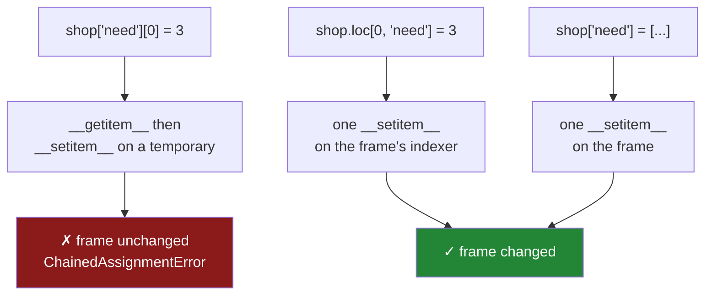

# 4.3 — `.loc` — the single step

## One-line answer

`.loc[rows, columns] = value` puts both coordinates inside one set of brackets, so the write is a
single call on the frame itself — and it is the answer to every case chained assignment was reaching
for.

---

## The story

Somebody phones the council again about the street light. This time the switchboard asks for the
postcode and what is wrong, writes both on one form, and puts it in the tray that gets emptied every
morning.

One call. One form. Everything the council needs to act is on it, and the person who took it is the
person who files it.

Nothing clever happened. The difference from last time is that the information about *where* and the
information about *what* arrived together, so nobody had to pass anything on.

---

## The idea in plain language

Chained assignment fails because the write goes to an object the frame does not know about
([4.2](4.2-two-brackets-two-calls.md)). The fix is to give the frame everything at once.

`.loc` is an **indexer**: an object attached to the frame whose whole job is to accept a richer key
than plain brackets can. It takes two coordinates separated by a comma, always in the same order:

```text
frame.loc[which rows, which columns] = value
        ↑            ↑
      rows        columns
```

Because the whole thing is one subscript, assigning to it is one `__setitem__` call on an object that
holds the frame — so the write lands in the frame.

Each coordinate accepts several kinds of thing, and this is what makes `.loc` cover every case:

| A coordinate can be | Example | Means |
|---|---|---|
| one label | `0` | that row |
| a list of labels | `["milk", "rice"]` | those rows |
| a slice of labels | `"a":"c"` | that range, **including the end** |
| a boolean mask | `shop["price"] > 1.3` | the rows where it is `True` |
| `:` | `:` | all of them |

Three things to fix in your memory now, because they cause most of the mistakes:

**Rows come first.** `frame.loc[0, "need"]` is row 0 of the `need` column. Writing it the other way
round produces a `KeyError` about a label that does not exist, and the message rarely says "you have
them backwards".

**`.loc` uses labels, `.iloc` uses positions.** They are the same shape and they answer different
questions ([1.2](../01-the-two-objects/1.2-the-index-is-not-a-row-number.md)). Day 28 is largely about
the pair ([Day 28, 1.1](../../../day-28-selection-and-alignment/parts/01-label-and-position/1.1-two-ways-to-say-that-row.md)).

**`.loc` can create as well as change.** Assigning to a column name that does not exist adds it;
assigning to a row label that does not exist adds a row. That is convenient and it means a typo in a
column name silently makes a new column rather than raising.

There is a smaller relative, `.at`, which takes exactly one row label and one column label and is
noticeably faster for a single cell. Use it when you genuinely want one value; use `.loc` for
everything else, because `.at` refuses masks, lists and slices.

And the general advice, which outranks all of the above: **prefer assigning whole columns.** Most real
requirements are column-shaped, and `shop["total"] = shop["need"] * shop["price"]` or `.assign(...)`
avoids the whole question ([3.1](../03-copy-on-write/3.1-every-result-behaves-like-a-copy.md)). Reach
for `.loc` when you need to write to *some* rows.

---

## Why Setu needs it

- **[4.1](4.1-the-write-that-vanished.md) and [4.2](4.2-two-brackets-two-calls.md)** state the problem;
  this is the whole of the answer.
- **[4.5](4.5-the-filtered-frame-that-warned-nobody.md)** shows the case where you must write through
  the original frame with `.loc` rather than through a subset.
- **Day 28** takes `.loc` apart properly — every selection form, and the closed-interval slice that
  surprises everybody
  ([Day 28, 1.2](../../../day-28-selection-and-alignment/parts/01-label-and-position/1.2-loc-by-label.md)).
- **Day 30's missing-data work** fills gaps with `.loc[mask, col] = value` constantly.
- **Day 76 onwards**, every feature-engineering step writes a derived column, and doing it wrong is a
  leak or a silent no-op.

---

## The mechanism

The five forms, on one frame, in order:

```python
import pandas as pd

shop = pd.DataFrame(
    {
        "item": ["milk", "bread", "eggs", "rice"],
        "need": [2, 1, 6, 1],
        "price": [1.15, 1.40, 0.32, 2.05],
    }
)
shop.loc[0, "need"] = 3
print("one cell        :", shop["need"].tolist())
shop.loc[shop["price"] > 1.3, "need"] = 0
print("masked rows     :", shop["need"].tolist())
shop.loc[:, "need"] = 1
print("whole column    :", shop["need"].tolist())
shop.iloc[0, 1] = 9
print("iloc positional :", shop["need"].tolist())
shop.at[1, "need"] = 7
print("at, one scalar  :", shop["need"].tolist())
```

**Line by line:**

- `shop.loc[0, "need"] = 3` — row label 0, column `need`. The direct replacement for the broken
  `shop["need"][0] = 3` ([4.1](4.1-the-write-that-vanished.md)).
- `shop.loc[shop["price"] > 1.3, "need"] = 0` — **a boolean mask as the row coordinate.** The comparison
  produces a column of `True`/`False`, and the write touches only the `True` rows: bread at 1.40 and
  rice at 2.05. This is the form that replaces a loop, and it is the one worth being fluent in.
- `shop.loc[:, "need"] = 1` — `:` means every row, so this rewrites the whole column. It is equivalent
  to `shop["need"] = 1`, and the `.loc` spelling is preferred when the surrounding code already uses
  `.loc`, for consistency rather than for behaviour.
- `shop.iloc[0, 1] = 9` — **positions**, not labels: row 0, column 1, and column 1 is `need` because the
  columns are `item`, `need`, `price`. Counting columns to find out which one you are writing to is
  exactly why `.iloc` is the wrong default; a column inserted upstream silently redirects this write.
- `shop.at[1, "need"] = 7` — one cell, by label, and faster than `.loc` because it skips all the
  machinery for masks and slices. The speed difference only matters in a loop, and a loop over cells is
  usually the real problem.

```text
one cell        : [3, 1, 6, 1]
masked rows     : [3, 0, 6, 0]
whole column    : [1, 1, 1, 1]
iloc positional : [9, 1, 1, 1]
at, one scalar  : [9, 7, 1, 1]
```

Writing to several columns at once, and creating things:

```python
import pandas as pd

shop = pd.DataFrame(
    {
        "item": ["milk", "bread", "eggs", "rice"],
        "need": [2, 1, 6, 1],
        "price": [1.15, 1.40, 0.32, 2.05],
    }
)
shop.loc[shop["item"].isin(["milk", "rice"]), ["need", "price"]] = [5, 9.99]
print("two columns at once:", shop[["need", "price"]].values.tolist())

shop.loc[4] = ["tea", 1, 2.50]
print("rows now:", len(shop), "| last row:", shop.iloc[-1].tolist())

shop.loc[:, "total"] = shop["need"] * shop["price"]
print("columns now:", shop.columns.tolist())
```

**Line by line:**

- `shop["item"].isin([...])` — a mask that is `True` where the item is one of the listed values
  ([Day 23, 4.5](../../../day-23-ufuncs-and-statistics/parts/04-counting/4.5-isin-and-membership.md)).
  Much clearer than chaining `==` with `|`, and it does not need brackets around each comparison
  ([Day 28, 2.3](../../../day-28-selection-and-alignment/parts/02-masks/2.3-and-or-not-and-the-brackets.md)).
- `["need", "price"]` as the **column** coordinate, with `[5, 9.99]` as the value — the list is spread
  across the two columns, in order. Every matching row gets the same pair.
- `shop.loc[4] = [...]` — **label 4 does not exist, so this creates a row.** One value per column, in
  column order. Convenient and dangerous: `shop.loc[40]` would have created a row labelled 40 with no
  complaint.
- `shop.loc[:, "total"] = ...` — likewise creates a column that was not there. A misspelling here
  (`shop.loc[:, "totl"]`) makes a new column called `totl` and never tells you.
- `shop[["need", "price"]].values` — a two-column array, used here only to print both columns compactly;
  note that both are now `float64`, because 9.99 went into `need` as well
  ([1.4](../01-the-two-objects/1.4-one-dtype-per-column.md)).

```text
two columns at once: [[5.0, 9.99], [7.0, 1.4], [1.0, 0.32], [5.0, 9.99]]
rows now: 5 | last row: ['tea', np.int64(1), np.float64(2.5)]
columns now: ['item', 'need', 'price', 'total']
```

Broken and fixed, side by side:



Two green routes, and they are the whole answer: one bracket pair for a whole column, `.loc` when you
need to pick rows.

---

## When it breaks

**The coordinates the wrong way round:**

```text
$ uv run python -c "
import pandas as pd
shop = pd.DataFrame({'item': ['milk', 'bread'], 'need': [2, 1]})
shop.loc['need', 0] = 3
print(shop)
"
       item  need    0
0      milk   2.0  NaN
1     bread   1.0  NaN
need    NaN   NaN  3.0
```

**What it means. Nothing raised, and look at what happened.** `.loc` read `'need'` as a *row* label and
`0` as a *column* label; neither existed, so it created both — a new row labelled `need` and a new column
labelled `0` — and put the 3 where they cross. Every other cell in the new row and column is `NaN`.

Notice the collateral damage in the `need` column: it was `int64` and is now showing `2.0` and `1.0`,
because the new row had to hold a `NaN` there and an integer column cannot
([1.3](../01-the-two-objects/1.3-a-table-of-columns.md)). So one transposed pair of coordinates gained a
row, gained a column, and changed the dtype of an existing column — and the program carried on. **This
is the price of `.loc` being able to create things**, and it is the strongest argument for checking
`shop.shape` after a write that was supposed to change an existing value.

**The float that will not fit in an integer column:**

```text
$ uv run python -c "
import pandas as pd
shop = pd.DataFrame({'need': [2, 1, 6, 1]})
print('before:', shop['need'].dtype)
shop.loc[0, 'need'] = 2.5
"
Traceback (most recent call last):
  ...
    raise LossySetitemError
pandas.errors.LossySetitemError

During handling of the above exception, another exception occurred:
...
TypeError: Invalid value '2.5' for dtype 'int64'
```

**What it means.** This is a **pandas 3.0 change and a good one.** Earlier versions silently widened the
whole column to `float64` to accommodate the 2.5, so an integer column of counts quietly became
decimals and every later `dtype` check was surprised. Now it refuses, and names the value and the dtype.
The fix is to decide deliberately: `shop["need"] = shop["need"].astype("float64")` first if the column
really should hold fractions, or round the value if it should not. Note the chained traceback — the
internal `LossySetitemError` is re-raised as a `TypeError`, so **catch `TypeError`**, and read the last
line rather than the first.

**The typo that made a new column:**

```text
$ uv run python -c "
import pandas as pd
shop = pd.DataFrame({'item': ['milk', 'bread'], 'need': [2, 1]})
shop.loc[:, 'ned'] = 0
print(shop.columns.tolist())
print(shop)
"
['item', 'need', 'ned']
    item  need  ned
0   milk     2    0
1  bread     1    0
```

**What it means.** `ned` is not `need`, so `.loc` created a third column and the real one is untouched.
No warning, and a later `shop["need"]` still returns the old values, so the symptom is "my update did
not take effect" rather than anything pointing at a typo. **Reading is strict and writing is not**:
`shop.loc[:, "ned"]` on the right-hand side would have raised `KeyError` immediately. The defence is to
check the column count, or to assert the schema after a transformation
([5.2](../05-the-module/5.2-asserting-the-schema.md)).

---

## In production

**What a professional writes instead of the teaching version.** They avoid `.loc` writes entirely when
the operation is column-shaped, and when it is not, they write through a named mask and check the count:

```python
import pandas as pd


def mark_low_stock(shop: pd.DataFrame, threshold: int) -> pd.DataFrame:
    """Flag the items we are short of. Returns a new frame; the input is untouched."""
    out = shop.copy()
    low = out["need"] >= threshold
    if not low.any():
        raise ValueError(f"no item reaches a need of {threshold}; is the threshold right?")
    out["status"] = "ok"
    out.loc[low, "status"] = "low"
    assert (out.loc[low, "status"] == "low").all(), "the flag did not take effect"
    return out
```

**Line by line:**

- `out = shop.copy()` — an explicit copy, because this function is about to write into it and the
  contract in the docstring promises the caller's frame is safe. Under CoW the copy would happen at the
  first write anyway ([3.2](../03-copy-on-write/3.2-the-copy-that-has-not-happened-yet.md)); doing it up
  front makes the intent readable.
- `low = out["need"] >= threshold` — **the mask given a name.** A named mask can be reused, counted and
  asserted on; the same expression inlined into three `.loc` calls is three chances to write it
  differently.
- `if not low.any()` — a mask that matches nothing makes every `.loc` write below a silent no-op
  ([Day 28, 2.5](../../../day-28-selection-and-alignment/parts/02-masks/2.5-the-mask-that-matched-nothing.md)).
  Refusing early turns a quiet nothing into a sentence.
- `out["status"] = "ok"` **before** the masked write — the column is created for every row first, so
  there is no case where a row ends up with a missing status. Creating it through the mask instead would
  leave `NaN` in the unmatched rows.
- `out.loc[low, "status"] = "low"` — the masked write, one call, on a frame this function owns.
- The `assert` — **the effect checked rather than assumed.** This is the line that would catch the
  two-statement chained assignment from [4.2](4.2-two-brackets-two-calls.md), which no warning and no
  linter finds. It costs one pass over the flagged rows and it is the only defence that works against
  every form of the bug.

**What changes at scale.** `.loc` writes are not free: a masked write to a column touches the rows the
mask selects, and pandas may have to materialise the mask over the whole frame first. In a loop this is
disastrous — a hundred `.loc` writes over a large frame is a hundred passes, where one vectorised
expression such as `np.select` or a `.map` would be one. The rule that matters at scale is **one write
per column, not one per row**: build the whole column as an expression, then assign it once. The other
production consideration is dtype stability. Now that pandas 3.0 refuses a lossy write, a `.loc`
assignment that worked on a sample can raise on real data — a float arriving where the sample had only
whole numbers — so the dtype belongs in the schema assertion at read time rather than being discovered
at write time
([Day 27, 1.4](../../../day-27-reading-and-writing/parts/01-the-csv/1.4-dtype-at-read-time.md)).

**The failure that only appears with real data.** A team replaced a row loop with a masked `.loc` write
and shipped it. The mask referred to a column that a recent upstream rename had turned into
`customer_status` from `status`; the *read* of that column would have raised `KeyError` immediately, but
the code path built the mask from a `.get`-style helper that returned an all-`False` Series when the
column was missing. So the mask matched nothing, `.loc` wrote to no rows, and the job succeeded every
night doing nothing at all. **A write that touches zero rows is indistinguishable from a write that
was not needed**, and the two are only distinguishable by asserting what you expected — which is why
`if not low.any(): raise` is in the function above and not just a nicety.

**The review comment a senior engineer leaves.** *"`df.loc[:, 'flag'] = ...` inside the loop — that is a
full column write per iteration. Build the flag as one vectorised expression and assign it once. Also
`.loc` will happily create `flag` if the name is wrong, so please assert the column list after this
block."*

**The interview question.** *"How do you correctly write to a subset of a DataFrame?"* With a single
`.loc` call that names the rows and the columns together — `df.loc[mask, "col"] = value` — because that
is one `__setitem__` on an indexer that holds the frame, so the write reaches the frame. The broken
alternative is chained assignment, where two consecutive subscripts mean the write lands on a discarded
temporary. Two things worth adding: rows come first and `.loc` uses labels while `.iloc` uses positions;
and `.loc` creates rows and columns that do not exist, so a typo in a column name silently makes a new
column rather than raising, which is why writes are worth asserting even though reads are strict.

---

## Check yourself

```bash
uv run python -c "
import pandas as pd
shop = pd.DataFrame({'item': ['milk','bread','eggs','rice'],
                     'need': [2,1,6,1], 'price': [1.15,1.40,0.32,2.05]})
shop.loc[0, 'need'] = 3
print('cell  :', shop['need'].tolist())
shop.loc[shop['price'] > 1.3, 'need'] = 0
print('masked:', shop['need'].tolist())
shop.loc[:, 'ned'] = 0
print('typo  :', shop.columns.tolist())
try:
    shop.loc[0, 'need'] = 2.5
except TypeError as exc:
    print('lossy :', exc)
"
```

The third line adds a column nobody wanted and the fourth refuses a write. Say why pandas is strict
about one and permissive about the other.

**Answer out loud, without scrolling up:**

> What are the two coordinates inside `.loc[...]`, in which order, and what four kinds of thing can each
> one be? Then say what happens if you name a column that does not exist — on a read, and on a write.

---

**Next:** [4.4 — `SettingWithCopyWarning` is gone](4.4-settingwithcopy-is-gone.md).
