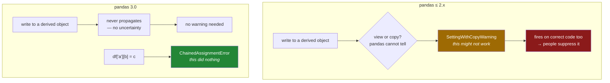

# 4.4 — `SettingWithCopyWarning` is gone — what replaced it

## One-line answer

`pd.errors.SettingWithCopyWarning` no longer exists in pandas 3.0 — the warning that fired when pandas
could not tell whether your write would propagate has been replaced by `ChainedAssignmentError`, which
fires when pandas knows for certain that it will not.

---

## The story

A shop has a sign on the freezer: *this door may not close properly — please check*.

The sign is honest. Sometimes the door sticks and sometimes it does not, and staff really do have to
look. But it has been there for years, so everyone walks past it. New staff ask about it once and are
told "yeah, it's usually fine".

Eventually the freezer is replaced with one whose door either shuts or does not, with a light that
comes on when it has not. The old sign comes down, because a warning that means *maybe* teaches people
to ignore warnings, and the new one means something definite.

---

## The idea in plain language

For about a decade, pandas printed this at people:

```text
SettingWithCopyWarning: A value is trying to be set on a copy of a slice from a DataFrame
```

It was the most-searched pandas message there has ever been, and the reason it was so confusing is
that **it was a warning about uncertainty, not about a mistake.**

Before Copy-on-Write, whether a write to a subset reached the original genuinely depended on how the
subset had been produced — sometimes a view, sometimes a copy, decided by internal details
([3.3](../03-copy-on-write/3.3-the-question-that-stopped-mattering.md)). pandas could see that you were
writing to something derived from another frame, could not work out which case you were in, and so said
so. That is why the message says *trying to be set* rather than naming a problem: it was a
"this might not do what you want".

The consequences were bad in both directions. The warning fired on plenty of correct code, so people
learned to suppress it — `pd.options.mode.chained_assignment = None` was a very common line — and it
failed to fire on some incorrect code. A warning that is wrong in both directions gets ignored, which
is the freezer sign.

**pandas 3.0 removed the uncertainty, so it removed the warning.** Under CoW a write to a derived object
*never* propagates ([3.1](../03-copy-on-write/3.1-every-result-behaves-like-a-copy.md)). There is
nothing to be unsure about, so there is nothing to warn about.

What is left is a narrower and much better message. `ChainedAssignmentError` fires only on the specific
shape `df["a"][b] = c`, where pandas can prove the write is landing on a temporary that is about to be
discarded ([4.1](4.1-the-write-that-vanished.md)). It does not mean *maybe*; it means *this did
nothing*.

Three practical facts for anyone maintaining older code:

**The old class is gone, not deprecated.** `pd.errors.SettingWithCopyWarning` raises `AttributeError`.
Any code that catches it, filters it or asserts on it breaks at import.

**The old suppression option still exists and no longer does anything.**
`pd.options.mode.chained_assignment` is still there, still defaults to `"warn"`, and can still be set to
`None` — and setting it does **not** silence `ChainedAssignmentError`. This is worse than removal would
have been: a line that used to suppress a warning now runs without complaint and suppresses nothing, so
a codebase carrying it looks configured when it is inert. Delete those lines rather than trusting them.

**Defensive `.copy()` calls are now pure cost.** Most of them were added to make the warning go away,
and under CoW they buy safety you already have
([3.2](../03-copy-on-write/3.2-the-copy-that-has-not-happened-yet.md)). Delete them deliberately, since
a few were written for memory reasons instead.

The new message's own text points at the pandas Copy-on-Write user guide,
<https://pandas.pydata.org/docs/user_guide/copy_on_write.html>, which is the canonical description of
the mode and of the chained-assignment case.

---

## Why Setu needs it

- **Every pandas answer written before 2026** talks about `SettingWithCopyWarning`, so you need to know
  what it was, why it existed and why it does not any more.
- **[4.5](4.5-the-filtered-frame-that-warned-nobody.md), next**, is the case the old warning *did* catch
  and the new one does not — which is the one thing the change made worse.
- **Day 30 onwards**, you will be adapting older cleaning recipes, and most of them contain a
  `.copy()` or a suppression line that is now wrong.
- **The Days 26–35 phase gate** asks for no chained assignment anywhere, and this document is how you
  make that a machine check rather than a promise.

---

## The mechanism

What is there now, and what is not:

```python
import pandas as pd

print("SettingWithCopyWarning exists:", hasattr(pd.errors, "SettingWithCopyWarning"))
print("ChainedAssignmentError exists:", hasattr(pd.errors, "ChainedAssignmentError"))
print("mro:", [cls.__name__ for cls in pd.errors.ChainedAssignmentError.__mro__][:4])
```

**Line by line:**

- `hasattr(pd.errors, "SettingWithCopyWarning")` — `False`. The class was **removed**, so this is not a
  deprecation you can ignore for a release; code referring to it fails now.
- `hasattr(pd.errors, "ChainedAssignmentError")` — `True`, the replacement.
- `__mro__` — the **method resolution order**, the chain of classes something inherits from
  ([Day 13, 1.3](../../../day-13-inheritance-and-abstraction/parts/01-inheritance/1.3-the-mro.md)).
  Reading it here answers the question the name raises: its parent is `Warning`, so despite being called
  an `Error` it goes through the warning machinery and does not stop the program
  ([4.1](4.1-the-write-that-vanished.md)).

```text
SettingWithCopyWarning exists: False
ChainedAssignmentError exists: True
mro: ['ChainedAssignmentError', 'Warning', 'Exception', 'BaseException']
```

Turning it into something that stops the build:

```python
import warnings

import pandas as pd

warnings.simplefilter("error", pd.errors.ChainedAssignmentError)

shop = pd.DataFrame({"item": ["milk", "bread"], "need": [2, 1]})
try:
    shop["need"][0] = 3
except pd.errors.ChainedAssignmentError as exc:
    print("caught, first line:", str(exc).splitlines()[0])
print("frame:", shop["need"].tolist())
```

**Line by line:**

- `warnings.simplefilter("error", ...)` — promotes that one warning class to a real exception, leaving
  every other warning alone. This is the single most useful line in this document.
- Now `shop["need"][0] = 3` **raises**, so a `try`/`except` can catch it and a test can fail on it.
  Without this line the same statement prints and continues.
- `str(exc).splitlines()[0]` — the message is five lines long, and only the first is needed here
  ([Day 7, 2.2](../../../day-07-strings/parts/02-methods/2.2-split-and-join.md)).
- The frame is still unchanged, because promoting the warning does not make the write work. **It makes
  the failure loud, not correct** — the fix is still `.loc` ([4.3](4.3-loc-the-single-step.md)).
- In a project, this line belongs in `conftest.py` so it applies to the whole test suite, or in a
  `filterwarnings` entry in `pyproject.toml`.

```text
caught, first line: A value is being set on a copy of a DataFrame or Series through chained assignment.
frame: [2, 1]
```

What happens to code written for the old world — one loud failure and one silent one:

```python
import warnings

import pandas as pd

try:
    pd.errors.SettingWithCopyWarning
except AttributeError as exc:
    print("the class :", exc)

print("the option:", repr(pd.options.mode.chained_assignment), "-> setting it to None...")
pd.options.mode.chained_assignment = None

shop = pd.DataFrame({"need": [2, 1]})
with warnings.catch_warnings(record=True) as caught:
    warnings.simplefilter("always")
    shop["need"][0] = 3
    print("warnings despite the option:", len(caught), [c.category.__name__ for c in caught])
```

**Line by line:**

- `pd.errors.SettingWithCopyWarning` — an `AttributeError`. The name is gone from the module, so every
  `except` clause, `filterwarnings` entry and test assertion naming it fails immediately. **This is the
  good failure**: it announces itself the first time anything imports the module.
- `pd.options.mode.chained_assignment` — **still there**, still `'warn'`. The option outlived the mode it
  controlled.
- Setting it to `None` — accepted without complaint. Anyone reading the code would reasonably conclude
  that chained-assignment warnings are now off.
- `catch_warnings(record=True)` — collects warnings rather than printing them, so they can be counted
  ([Day 18, 4.4](../../../day-18-exceptions/parts/04-in-anger/4.4-pytest-raises.md)).
- **The last line is the point.** One `ChainedAssignmentError` is still raised, with the option set to
  `None`. The suppression does nothing, and the only thing it achieves is to make a reader believe the
  file has been considered.

```text
the class : module 'pandas.errors' has no attribute 'SettingWithCopyWarning'
the option: 'warn' -> setting it to None...
warnings despite the option: 1 ['ChainedAssignmentError']
```

The two eras:



---

## When it breaks

**The suppression line that used to be everywhere and is now decoration:**

```text
$ uv run python -c "
import pandas as pd
pd.options.mode.chained_assignment = None
shop = pd.DataFrame({'need': [2, 1]})
shop['need'][0] = 3
print('frame:', shop['need'].tolist())
"
<string>:5: ChainedAssignmentError: A value is being set on a copy of a DataFrame or Series through chained assignment.
Such chained assignment never works to update the original DataFrame or Series, because the intermediate object on which we are setting values always behaves as a copy (due to Copy-on-Write).

Try using '.loc[row_indexer, col_indexer] = value' instead, to perform the assignment in a single step.

See the documentation for a more detailed explanation: https://pandas.pydata.org/pandas-docs/stable/user_guide/copy_on_write.html#chained-assignment
frame: [2, 1]
```

**What it means.** This line was the standard fix-by-silencing for the old warning and sits near the top
of an enormous number of scripts and notebooks. It still runs, it raises nothing, and **it does not
suppress the warning it appears to be suppressing** — the `ChainedAssignmentError` is printed anyway.
The old option controlled the old machinery, which is gone; the new warning does not consult it.

That combination is the worst of the three possibilities. A removed option would fail loudly. A working
option would at least be honest. What we have is a line that looks deliberate, reads as "we have thought
about this", and has no effect at all — so a reviewer skims past it. **Delete it wherever you find it**,
and if the warnings it reveals are numerous, promote them to errors and fix them rather than reaching
for a new way to hide them.

**The exception handler that no longer compiles:**

```text
$ uv run python -c "
import warnings, pandas as pd
with warnings.catch_warnings():
    warnings.simplefilter('ignore', pd.errors.SettingWithCopyWarning)
    print('ignored')
"
Traceback (most recent call last):
  ...
AttributeError: module 'pandas.errors' has no attribute 'SettingWithCopyWarning'
```

**What it means.** Same class of failure, in the other common spelling. Any `filterwarnings` entry in
`pyproject.toml` or `setup.cfg` naming the class by its dotted path fails the same way, and those are
easier to miss because they live in configuration rather than code. `grep -rn SettingWithCopy` across
the repository, including its `.toml` and `.cfg` files, is the first thing to run on a migration.

**Promoting the new warning and finding it is not enough:**

```text
$ uv run python -c "
import warnings, pandas as pd
warnings.simplefilter('error', pd.errors.ChainedAssignmentError)
shop = pd.DataFrame({'need': [2, 1]})
column = shop['need']
column[0] = 3
print('no exception raised, and the frame is:', shop['need'].tolist())
"
no exception raised, and the frame is: [2, 1]
```

**What it means.** The warning is promoted to an error, the bug is present, and nothing is raised —
because the two-statement form is not detectable ([4.2](4.2-two-brackets-two-calls.md)). This is the
honest limit of the tooling and it is worth internalising: **`ChainedAssignmentError` is a linter for one
spelling, not a guarantee about your codebase.** The only defence that covers every form is asserting the
effect after the write, which is what [4.3](4.3-loc-the-single-step.md)'s production function does.

---

## In production

**What a professional writes instead of the teaching version.** They put the promotion in configuration,
where it applies to everything, rather than in one module:

```toml
# pyproject.toml
[tool.pytest.ini_options]
filterwarnings = [
    "error::pandas.errors.ChainedAssignmentError",
    "error::pandas.errors.Pandas4Warning",
]
```

**Line by line:**

- `filterwarnings` under pytest's settings — applies to the whole test suite, so every test run is a
  sweep for these two problems and no individual test has to remember.
- `"error::..."` — the pytest spelling of "promote this warning class to an exception". The part after
  `::` is the fully qualified class name, which is why the class being *removed* rather than deprecated
  matters: a stale entry naming `SettingWithCopyWarning` fails collection with an error about an unknown
  warning class.
- `ChainedAssignmentError` — the subject of this section: a write that did nothing.
- `Pandas4Warning` — the other pandas 3.0 migration warning, which is what
  `select_dtypes("object")` emits ([2.4](../02-the-str-dtype/2.4-dtypes-equals-object-finds-nothing.md)).
  Promoting both means one test run reports every site of both problems.
- Putting this in `pyproject.toml` rather than `conftest.py` keeps it beside the other pins and settings
  and makes it visible in review, which matters because turning it off is a decision somebody should
  have to justify.

**What changes at scale.** The migration splits cleanly into three kinds of work, and only the first is
easy. The **loud** kind is the removed names — `SettingWithCopyWarning` and the `chained_assignment`
option — which fail at import and are found by running anything. The **noisy** kind is the one-line
chained assignments, found by promoting the warning in CI, though only on code paths the tests actually
execute, so coverage is the limiting factor. The **silent** kind is everything else: two-statement
chained assignments, writes to filtered subsets ([4.5](4.5-the-filtered-frame-that-warned-nobody.md)),
and functions that relied on modifying their argument
([3.1](../03-copy-on-write/3.1-every-result-behaves-like-a-copy.md)). Only end-to-end assertions on
output values find those. Budget the migration on the third category, because the first two are a
morning and the third is where the actual risk is.

**The failure that only appears with real data.** A team's codebase had 47 `SettingWithCopyWarning`
suppressions accumulated over six years. The upgrade to pandas 3.0 turned every one of them into an
import error, which sounds bad and was actually the best thing that happened: each suppression marked a
place where somebody had once been unsure whether a write propagated. Removing them was mechanical, but
**about a fifth of those sites turned out to contain a real chained assignment that had been silently
doing nothing since it was written** — the suppression had hidden the only signal. The numbers those
code paths produced had been wrong for years and had been reviewed, tested and trusted. The lesson is
about the suppression rather than about pandas: silencing a warning class globally converts a
"sometimes wrong" signal into no signal, and the wrongness does not go away.

**The review comment a senior engineer leaves.** *"Dropping `pd.options.mode.chained_assignment = None`
from the top of this file — it raises on pandas 3 anyway. But before you delete it, look at what it was
hiding: the write on line 210 is chained and has never done anything. That is a behaviour change we
should call out in the release notes, because the numbers will move."*

**The interview question.** *"What happened to `SettingWithCopyWarning`?"* It was removed in pandas 3.0,
along with the `chained_assignment` option that silenced it. It existed because, before Copy-on-Write,
whether a write to a derived object reached the original depended on whether that object happened to be
a view, and pandas could not tell — so the warning meant "this might not work". Under CoW the answer is
always "it does not", so there is no uncertainty to warn about. What replaced it is
`ChainedAssignmentError`, which is narrower and definite: it fires only on `df["a"][b] = c`, where pandas
can prove the write landed on a discarded temporary. It is a warning rather than an exception despite
the name, so it is worth promoting to an error in CI — and it is worth knowing that it does not catch
the same bug written across two statements.

---

## Check yourself

```bash
uv run python -c "
import warnings, pandas as pd
print('old class gone :', not hasattr(pd.errors, 'SettingWithCopyWarning'))
print('new class here :', hasattr(pd.errors, 'ChainedAssignmentError'))
print('it is a warning:', issubclass(pd.errors.ChainedAssignmentError, Warning))
warnings.simplefilter('error', pd.errors.ChainedAssignmentError)
shop = pd.DataFrame({'need': [2, 1]})
try:
    shop['need'][0] = 3
except pd.errors.ChainedAssignmentError:
    print('promoted, and it raised')
column = shop['need']
column[0] = 3
print('two-statement form: no exception, frame still', shop['need'].tolist())
"
```

The same bug is written twice and only one of them raises. Say what the promotion does and does not buy
you.

**Answer out loud, without scrolling up:**

> Why did `SettingWithCopyWarning` exist, and why is it gone rather than deprecated? Then say what
> `ChainedAssignmentError` means that the old warning did not, and one thing it still cannot see.

---

**Next:** [4.5 — The filtered frame that warned nobody](4.5-the-filtered-frame-that-warned-nobody.md).
