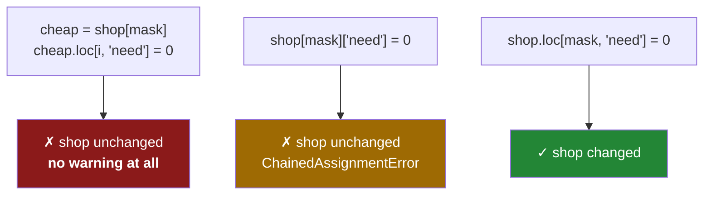

# 4.5 — The filtered frame that warned nobody

## One-line answer

Filtering a frame, keeping the result in a variable and writing to it with `.loc` is correct code that
does nothing to the original — and because it is correct code, pandas says nothing at all, which makes
it the version of the trap that survives every check in this section.

---

## The story

Somebody in the flat copies out the cheap half of the shopping list onto a fresh sheet — just the
things under a pound and a half — because they only have a fiver and want to see what fits.

They work on their sheet. They cross off the bread, add a note next to the eggs, change a number. It is
a perfectly good piece of paper and every mark on it is exactly where they meant to put it.

Then they stick it back on the fridge next to the original and go out.

Later somebody else does the shopping from the original, which has none of those changes on it. Nothing
went wrong at any step. Somebody edited a real sheet of paper carefully and correctly, and it simply was
not the sheet that gets used.

---

## The idea in plain language

Everything in this section so far has had a tell. Chained assignment has two bracket pairs
([4.1](4.1-the-write-that-vanished.md)), and pandas warns about the one-line form
([4.4](4.4-settingwithcopy-is-gone.md)).

This one has no tell.

```text
cheap = shop[shop["price"] < 1.5]
cheap.loc[0, "need"] = 0
```

Read it with everything you now know and it looks right. `shop[mask]` is a normal filter. `cheap` is a
DataFrame. `.loc[0, "need"] = 0` is the single-step write that [4.3](4.3-loc-the-single-step.md) spent a
whole document recommending. There is one bracket pair before the `=`. Nothing is chained.

And `shop` does not change, because `cheap` is a **different frame** — an independent result, exactly as
[3.1](../03-copy-on-write/3.1-every-result-behaves-like-a-copy.md) promised. The write is not a mistake
in the way chained assignment is; it succeeded, on the object it was aimed at. The mistake is aiming.

pandas cannot warn about this, and should not. `cheap` is a frame in its own right, and writing to a
frame you have created is the most ordinary thing in the library. There is no signal that
distinguishes "I made this subset in order to edit it" from "I made this subset in order to update the
original".

**This is the one case where pandas 3.0 is worse than pandas 2.x.** The old `SettingWithCopyWarning`
fired here — that is precisely what it was for, a write to something that came from a slice of another
frame. It was noisy and unreliable ([4.4](4.4-settingwithcopy-is-gone.md)), and it did catch this. The
new warning is precise and does not.

The fix is to write through the original with the mask as the row coordinate:

```text
shop.loc[shop["price"] < 1.5, "need"] = 0
```

One call, on `shop`, with the mask deciding the rows. Nothing intermediate exists.

The rule to carry away is about **which object you are writing to**, not about brackets:

> If you want the original to change, the name to the left of `.loc` must be the original.

Any time a filter's result is given a name and then written to, stop and ask whether you meant to edit
the subset or the source. Both are legitimate; only one of them is what the code says.

---

## Why Setu needs it

- **It is the last and hardest case in this section**, and the one a reader will actually meet after
  they have learned to avoid the other four.
- **[5.2](../05-the-module/5.2-asserting-the-schema.md)** and [4.3](4.3-loc-the-single-step.md)'s
  assertion habit are the only defences that see this, which is why the day ends with a module that
  asserts.
- **The Days 26–35 phase gate** is "no chained assignment anywhere", and this is what remains once the
  chained assignments are gone.
- **Day 30's cleaning work** filters and then fixes constantly, which is exactly the shape that goes
  wrong here.
- **Day 91 onwards**, a transformer that edits a filtered training subset instead of the frame is a
  bug you cannot see in the metrics.

---

## The mechanism

The silent version, and how quiet it really is:

```python
import warnings

import pandas as pd

shop = pd.DataFrame(
    {
        "item": ["milk", "bread", "eggs", "rice"],
        "need": [2, 1, 6, 1],
        "price": [1.15, 1.40, 0.32, 2.05],
    }
)
with warnings.catch_warnings(record=True) as caught:
    warnings.simplefilter("always")
    cheap = shop[shop["price"] < 1.5]
    cheap.loc[cheap.index[0], "need"] = 0
    print("warnings during all of that:", len(caught))
print("cheap :", cheap["need"].tolist())
print("shop  :", shop["need"].tolist())
```

**Line by line:**

- `shop[shop["price"] < 1.5]` — the filter. Three rows survive: milk, bread and eggs.
- `cheap.index[0]` — the **label** of the first surviving row, rather than a hard-coded `0`. Writing
  `cheap.loc[0, ...]` would work here by luck, because milk happens to keep label 0, and would raise if
  the first row had been filtered out ([1.2](../01-the-two-objects/1.2-the-index-is-not-a-row-number.md)).
- `cheap.loc[..., "need"] = 0` — a correct single-step write, to `cheap`.
- `catch_warnings(record=True)` with `simplefilter("always")` — collects every warning raised inside the
  block, so the count is measured rather than eyeballed
  ([Day 18, 4.4](../../../day-18-exceptions/parts/04-in-anger/4.4-pytest-raises.md)).
- **`len(caught)` is 0.** No `ChainedAssignmentError`, no deprecation, nothing at all. Compare this with
  [4.1](4.1-the-write-that-vanished.md), where the equivalent mistake printed five lines of advice.
- `cheap` changed and `shop` did not. Both objects are behaving exactly as documented.

```text
warnings during all of that: 0
cheap : [0, 1, 6]
shop  : [2, 1, 6, 1]
```

The nearly identical spelling that *does* warn:

```python
import warnings

import pandas as pd

shop = pd.DataFrame(
    {
        "item": ["milk", "bread", "eggs", "rice"],
        "need": [2, 1, 6, 1],
        "price": [1.15, 1.40, 0.32, 2.05],
    }
)
with warnings.catch_warnings(record=True) as caught:
    warnings.simplefilter("always")
    shop[shop["price"] < 1.5]["need"] = 0
    print("warnings:", len(caught), [c.category.__name__ for c in caught])
print("shop:", shop["need"].tolist())
```

**Line by line:**

- `shop[mask]["need"] = 0` — the same intention, written **without naming the intermediate**. Now there
  are two bracket pairs before the `=`, so it is chained assignment and pandas recognises it
  ([4.2](4.2-two-brackets-two-calls.md)).
- One `ChainedAssignmentError`, and `shop` is unchanged.
- **The difference between this block and the one above is a variable name.** Both do nothing to `shop`;
  one is reported and one is not. That is the entire lesson, and it is why "fix the warnings" is not a
  strategy.

```text
warnings: 1 ['ChainedAssignmentError']
shop: [2, 1, 6, 1]
```

The fix — one call, on the original:

```python
import pandas as pd

shop = pd.DataFrame(
    {
        "item": ["milk", "bread", "eggs", "rice"],
        "need": [2, 1, 6, 1],
        "price": [1.15, 1.40, 0.32, 2.05],
    }
)
shop.loc[shop["price"] < 1.5, "need"] = 0
print("shop:", shop["need"].tolist())
```

**Line by line:**

- `shop.loc[mask, "need"] = 0` — **`shop` is the name to the left of `.loc`.** That is the whole fix, and
  it is worth reading the line asking "which object is being written to" rather than checking bracket
  counts.
- The mask goes in the row position, the column name in the column position
  ([4.3](4.3-loc-the-single-step.md)).
- No intermediate frame exists at any point, so there is nothing for the write to be lost in.
- Milk, bread and eggs go to 0 and rice stays at 1, which is what the filter said.

```text
shop: [0, 0, 0, 1]
```

Three spellings, three outcomes:



The red box is more dangerous than the amber one, and it is the one that looks most like good code.

---

## When it breaks

**A cleaning function that returns nothing and changes nothing:**

```text
$ uv run python -c "
import pandas as pd

def cap_prices(frame, cap):
    dear = frame[frame['price'] > cap]
    dear.loc[:, 'price'] = cap

shop = pd.DataFrame({'item': ['milk', 'rice'], 'price': [1.15, 9.99]})
cap_prices(shop, 2.0)
print('max price after capping:', shop['price'].max())
"
max price after capping: 9.99
```

**What it means.** The function reads as a capping routine, runs without a warning, and caps nothing.
`dear` is a new frame; the cap lands on it; the function returns `None` and `dear` is collected. The
caller's frame still has a 9.99 in it. Two separate mistakes are stacked here — writing to a subset, and
a function that modifies rather than returns
([3.1](../03-copy-on-write/3.1-every-result-behaves-like-a-copy.md)) — and either one alone would have
been enough to make the routine useless. **The tell is not in the syntax; it is that the function has no
`return`.**

**The subset that was correct to edit:**

```text
$ uv run python -c "
import pandas as pd
shop = pd.DataFrame({'item': ['milk', 'bread', 'rice'], 'price': [1.15, 1.40, 9.99]})
report = shop[shop['price'] < 2.0].copy()
report.loc[:, 'price'] = report['price'].round(1)
print('report:'); print(report.to_string(index=False))
print('shop max still:', shop['price'].max())
"
report:
 item  price
 milk    1.2
bread    1.4
shop max still: 9.99
```

**What it means.** The *same shape of code*, and here it is entirely correct — `report` is a derived
thing that is supposed to differ from `shop`. This is why pandas cannot warn: the two cases are
indistinguishable from the library's side. What distinguishes them is intent, and the way to record
intent is in the name. `report` says "a separate artefact"; `cheap` or `dear` says "part of the original",
and a name like that beside a write is the thing to notice in review. The `.copy()` here is not needed
for correctness under CoW — it is documentation that this frame is meant to diverge
([3.2](../03-copy-on-write/3.2-the-copy-that-has-not-happened-yet.md)).

**The assertion that catches what nothing else does:**

```text
$ uv run python -c "
import pandas as pd
shop = pd.DataFrame({'item': ['milk', 'rice'], 'price': [1.15, 9.99]})
cap = 2.0
dear = shop[shop['price'] > cap]
dear.loc[:, 'price'] = cap
assert (shop['price'] <= cap).all(), f'{(shop[\"price\"] > cap).sum()} rows still above the cap'
"
Traceback (most recent call last):
  ...
AssertionError: 1 rows still above the cap
```

**What it means.** No warning fired, no linter would object, and the assertion catches it immediately —
because it asks about the **effect** rather than the spelling. This is the defence that works against
every form of the trap in this section: chained assignment, the two-statement version, and this one.
It costs one pass over a column. Put it after any write whose failure would be expensive, and phrase it
so the message names the number of offending rows rather than just saying `False`.

---

## In production

**What a professional writes instead of the teaching version.** They never filter-then-write; they build
the new column as one expression and return a new frame:

```python
import pandas as pd


def cap_prices(shop: pd.DataFrame, cap: float) -> pd.DataFrame:
    """Return a copy of the list with every price limited to `cap`."""
    if cap <= 0:
        raise ValueError(f"cap must be positive, got {cap}")
    capped = shop.assign(price=shop["price"].clip(upper=cap))
    assert (capped["price"] <= cap).all(), "clip did not take effect"
    return capped
```

**Line by line:**

- `shop["price"].clip(upper=cap)` — the whole column limited in one vectorised call
  ([Day 23, 1.5](../../../day-23-ufuncs-and-statistics/parts/01-ufuncs/1.5-maximum-clip-and-elementwise.md)).
  **There is no filter and no subset**, so the shape that goes wrong in this document cannot occur.
- `.assign(price=...)` — replaces the column and returns a new frame, so the function is an expression
  rather than a side effect.
- The `return`, which is the half of the fix that the broken version was missing just as much as the
  write itself.
- `if cap <= 0: raise` — a nonsensical cap would silently zero every price, and `clip` would not object
  ([Day 18, 2.2](../../../day-18-exceptions/parts/02-the-hierarchy/2.2-which-built-in-to-raise.md)).
- The `assert` — cheap, and it is what would have caught the broken version. It stays in the code rather
  than only in a test, because the failure it guards against is silent and the check is one pass.
- **Filtering is for reading; assignment is for the whole column.** Almost every requirement that sounds
  like "change these rows" is a `clip`, a `where`, a `mask` or a `map` over the entire column, and
  writing it that way removes the possibility of the bug rather than avoiding it.

**What changes at scale.** This is the residual risk after a pandas 3.0 migration, and it needs a
different tool from the other cases. The warning-based sweep and the AST check from
[4.2](4.2-two-brackets-two-calls.md) both see the bracket-shaped bug; neither sees this, because this is
syntactically correct. What finds it is **end-to-end assertions on values** — after the pipeline, no row
exceeds the cap, no status is missing, the count of flagged rows matches the count of rows meeting the
condition. Those assertions are worth writing for the handful of invariants that actually matter rather
than for every column, because their cost is a pass over the data and their value is entirely in being
specific. In review, the habit that helps most is to look at every `df[mask]` result that gets a name and
ask what happens to it next; if the answer is "it is written to", the next question is whether anybody
reads it afterwards.

**The failure that only appears with real data.** A fraud-scoring pipeline filtered out the rows for
manual review, wrote a decision onto that subset, and expected the decisions to appear in the main
frame. On pandas 2.x it had emitted `SettingWithCopyWarning` from the day it was written, and the
warning had been suppressed globally years earlier by a line at the top of the module
([4.4](4.4-settingwithcopy-is-gone.md)). The decisions had never been written back. Because the manual-
review queue was a small fraction of traffic and the default decision was the safe one, the effect was a
slow leak rather than an outage: reviewed cases silently kept their default. **The one signal that would
have caught it had been switched off before most of the team joined**, and under pandas 3.0 there is no
signal to switch off — which is the argument for the assertion, not for nostalgia about the old warning.

**The review comment a senior engineer leaves.** *"`flagged = df[mask]` then `flagged.loc[...] = ...` —
`flagged` is its own frame, so this updates nothing in `df`. Write it as `df.loc[mask, 'decision'] =
...`. And since this one is silent, add an assertion after it that no row in `mask` still has the default
decision."*

**The interview question.** *"You filter a frame, assign the result to a variable, and write to it with
`.loc`. What happens?"* The write succeeds on the filtered frame and the original is unchanged, because
under Copy-on-Write the filter produced an independent object. Nothing warns — this is correct code doing
exactly what it says, and pandas cannot tell the difference between wanting to edit a subset and wanting
to update the source. It is the case the old `SettingWithCopyWarning` used to catch, so it is the one
place pandas 3.0 gives you less help than 2.x did. The fix is to write through the original,
`df.loc[mask, "col"] = value`, and the defence in code is to assert the effect afterwards, because no
warning or linter can see this one.

---

## Check yourself

```bash
uv run python -c "
import pandas as pd
shop = pd.DataFrame({'item': ['milk','bread','eggs','rice'],
                     'need': [2,1,6,1], 'price': [1.15,1.40,0.32,2.05]})
cheap = shop[shop['price'] < 1.5]
cheap.loc[cheap.index[0], 'need'] = 0
print('subset written, shop:', shop['need'].tolist())
shop.loc[shop['price'] < 1.5, 'need'] = 0
print('original written, shop:', shop['need'].tolist())
"
```

The first write produced no warning and no change. Say what you would have to add to the script for it
to fail loudly instead.

**Answer out loud, without scrolling up:**

> Why does writing to a filtered frame leave the original alone, and why can pandas not warn about it?
> Then state the rule about which name has to be on the left of `.loc`.

---

**Next:** [5.1 — `src/setu/frames.py`, the day's module](../05-the-module/5.1-the-shopping-list-module.md).
