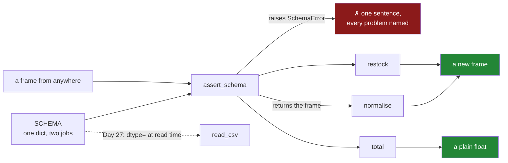

# 5.1 — `src/setu/frames.py` — the day's module

## One-line answer

The day's module is four small functions that all obey one rule — **check the schema, return a new
frame, never write to the caller's** — which turns everything sections 1 to 4 taught into a shape you
can reuse rather than a list of things to remember.

---

## The story

The flat keeps a jar of loose change on the shelf by the door for the milk money. It works because
everyone follows two unspoken rules: you count what is in it before you take anything, and if you
take from it you say so.

Nobody wrote the rules down. They emerged because the two things that had gone wrong before were
somebody assuming there was £3 in it when there was 40p, and somebody quietly taking a pound so that
the next person's count was wrong.

Two rules. Both about the boundary between the jar and the person, and neither about the money.

---

## The idea in plain language

Everything today has been about boundaries.

Section 1 said a frame is columns with dtypes and an index
([1.3](../01-the-two-objects/1.3-a-table-of-columns.md)). Section 2 said the dtypes changed in pandas
3.0 and old code that checks them is now wrong
([2.4](../02-the-str-dtype/2.4-dtypes-equals-object-finds-nothing.md)). Section 3 said everything you
get out of a frame is independent of it
([3.1](../03-copy-on-write/3.1-every-result-behaves-like-a-copy.md)). Section 4 said the way to change
one is a single `.loc` call on the frame itself
([4.3](../04-chained-assignment/4.3-loc-the-single-step.md)).

Put together they give a module with a **contract**, which is three promises made in the same place:

**Every function checks the frame it is given.** A function that assumes its input has the right
columns and dtypes will fail somewhere in the middle, with a message about whatever it happened to
touch first. One check at the top produces one sentence naming everything that is wrong
([5.2](5.2-asserting-the-schema.md)).

**Every function returns a new frame and never edits its argument.** Under Copy-on-Write that is the
default behaviour rather than something to work at
([3.1](../03-copy-on-write/3.1-every-result-behaves-like-a-copy.md)), so the discipline is only to
`return` and to resist `inplace=`.

**The schema lives in one constant.** `SCHEMA` is a dictionary from column name to dtype name, written
once. It is what the check compares against, and Day 27 hands the same dictionary to `read_csv` as its
`dtype=` argument, so the file is read into the shape the module promises rather than converted into it
afterwards
([Day 27, 1.4](../../../day-27-reading-and-writing/parts/01-the-csv/1.4-dtype-at-read-time.md)).

The four functions are deliberately small, and each one is an example of something the day taught:

| Function | What it demonstrates |
|---|---|
| `assert_schema` | dtype names after the pandas 3.0 change ([2.4](../02-the-str-dtype/2.4-dtypes-equals-object-finds-nothing.md)) |
| `normalise` | text work on a real `str` column, returning a new frame ([2.2](../02-the-str-dtype/2.2-str-the-dtype-pandas-3-infers.md)) |
| `restock` | a column-shaped write with no chained assignment anywhere ([4.3](../04-chained-assignment/4.3-loc-the-single-step.md)) |
| `total` | converting at the boundary, so nothing downstream meets a NumPy scalar |

One more word, because it shapes the whole module. A **custom exception** is a class of your own that
inherits from a built-in one ([Day 18, 3.1](../../../day-18-exceptions/parts/03-your-own/3.1-one-base-class-per-project.md)).
`SchemaError` inherits from `ValueError`, so a caller who knows about this module can catch
`SchemaError` specifically, and a caller who does not will still catch it with `except ValueError`. That
is the whole reason to define one: it adds precision without taking away the general handler.

---

## Why Setu needs it

- **[5.2](5.2-asserting-the-schema.md) and [5.3](5.3-the-test-that-can-go-red.md)** are this module's
  check and its test, and neither makes sense without the shape.
- **Day 27** replaces the hand-built frame with one read from a file, and reuses `SCHEMA` verbatim.
- **Day 28** adds selection and alignment to the same module.
- **The Days 26–35 phase gate** asks for "a clean, typed, joined dataset + `audit()` — no chained
  assignment anywhere", and this module is its first four functions.
- **Day 91 onwards**, every scikit-learn transformer has this exact contract — take a frame, return a
  new one, never modify the input — because anything else leaks between the training and test splits.

---

## The mechanism

The module's head — the schema and the exception, before any function:

```python
"""Load the flat's shopping list into a typed frame, and refuse anything that is not one."""

from __future__ import annotations

import pandas as pd

SCHEMA: dict[str, str] = {"item": "str", "need": "int64", "price": "float64"}


class SchemaError(ValueError):
    """The frame is not the shopping list this module promises."""
```

**Line by line:**

- The module docstring says what the module is *for* in one sentence, and the second half — "and refuse
  anything that is not one" — is the contract stated where somebody reading `help(frames)` will see it.
- `from __future__ import annotations` — makes every annotation a string at runtime, so the file is
  cheaper to import and forward references work
  ([Day 19, 1.2](../../../day-19-typing-dataclasses-and-concurrency/parts/01-type-hints/1.2-the-vocabulary.md)).
- `SCHEMA: dict[str, str]` — **the single source of truth for the shape of a shopping list.** Written as
  dtype *names* rather than dtype objects, because the names are what `str(series.dtype)` gives back
  ([2.2](../02-the-str-dtype/2.2-str-the-dtype-pandas-3-infers.md)) and what `read_csv` accepts as
  `dtype=`. One dictionary, two jobs.
- `"item": "str"` — **not `"object"`.** On pandas 2.x this entry would have read `"object"` and it would
  now be wrong ([2.4](../02-the-str-dtype/2.4-dtypes-equals-object-finds-nothing.md)). This single
  string is the day's migration lesson made load-bearing, and
  [5.3](5.3-the-test-that-can-go-red.md) is the test that goes red if it is wrong.
- `class SchemaError(ValueError)` — inherits from `ValueError` because a frame with the wrong columns is
  a bad *value*, not a bad type or a missing key
  ([Day 18, 2.2](../../../day-18-exceptions/parts/02-the-hierarchy/2.2-which-built-in-to-raise.md)).
  Inheriting from the right built-in is what lets an unaware caller still handle it.
- The exception has **no body beyond its docstring**. It carries no extra fields because the message is
  the whole interface here ([5.2](5.2-asserting-the-schema.md)).

The two functions that transform, and the one that reduces:

```python
def normalise(frame: pd.DataFrame) -> pd.DataFrame:
    """Strip and case-fold the item names. Returns a new frame."""
    return assert_schema(frame).assign(item=lambda df: df["item"].str.strip().str.casefold())


def restock(frame: pd.DataFrame, minimum: int) -> pd.DataFrame:
    """Raise every count up to `minimum`. Returns a new frame."""
    if minimum < 0:
        raise ValueError(f"minimum must not be negative, got {minimum}")
    out = assert_schema(frame).assign(need=lambda df: df["need"].clip(lower=minimum))
    if not (out["need"] >= minimum).all():
        raise AssertionError("restock did not take effect")
    return out


def total(frame: pd.DataFrame) -> float:
    """What the whole list comes to, as a plain Python float."""
    checked = assert_schema(frame)
    return float((checked["need"] * checked["price"]).sum())
```

**Line by line:**

- `assert_schema(frame).assign(...)` — the check is the **first thing in the expression**, and it returns
  the frame, so it chains. That is why `assert_schema` returns its argument rather than `None`: it can
  sit inside a chain instead of needing its own statement.
- `.assign(item=lambda df: ...)` — a new frame with one column replaced
  ([3.1](../03-copy-on-write/3.1-every-result-behaves-like-a-copy.md)). The lambda receives the frame at
  that point in the chain, so it cannot accidentally refer to a pre-check version.
- `.str.strip().str.casefold()` — whitespace off and case flattened, the two normalisations that stop
  `"  Milk "` and `"milk"` being different labels
  ([2.2](../02-the-str-dtype/2.2-str-the-dtype-pandas-3-infers.md)).
- `if minimum < 0: raise ValueError` — a plain `ValueError`, not `SchemaError`, because the *argument* is
  wrong rather than the frame. Using the specific exception for both would make `except SchemaError`
  catch a caller's typo.
- `.clip(lower=minimum)` — the whole column raised in one vectorised call
  ([Day 23, 1.5](../../../day-23-ufuncs-and-statistics/parts/01-ufuncs/1.5-maximum-clip-and-elementwise.md)).
  **There is no `.loc`, no mask and no filter**, so none of section 4's traps can occur here. That is the
  real defence: not avoiding chained assignment, but writing code that has no place to put one.
- The `AssertionError` after the clip — the effect checked rather than assumed, which is the only thing
  that catches the silent case from
  [4.5](../04-chained-assignment/4.5-the-filtered-frame-that-warned-nobody.md). It is cheap and it stays
  in the shipped code.
- `float(...)` in `total` — **the boundary conversion.** `(need * price).sum()` is a `np.float64`, and
  every caller downstream — a JSON response, a log line, a database write — is better off with a plain
  Python float
  ([Day 23, 2.1](../../../day-23-ufuncs-and-statistics/parts/02-statistics/2.1-a-reduction-turns-many-into-one.md)).
- `checked` named rather than chained in `total`, because the frame is used twice. Calling
  `assert_schema` twice would check it twice for nothing.

Running the module on the flat's list:

```python
import pandas as pd

from setu import frames

shop = pd.DataFrame(
    {
        "item": ["  Milk ", "bread", "eggs", "rice"],
        "need": [2, 1, 6, 1],
        "price": [1.15, 1.40, 0.32, 2.05],
    }
)
print("schema ok :", frames.assert_schema(shop).shape)
print("normalise :", frames.normalise(shop)["item"].tolist())
print("input kept:", shop["item"].tolist())
print("restock 2 :", frames.restock(shop, 2)["need"].tolist())
print("total     :", frames.total(shop))
```

**Line by line:**

- `"  Milk "` with the spaces and the capital — the messy value that `normalise` exists for, and the one
  that would otherwise split `milk` into two groups on Day 31.
- `frames.assert_schema(shop).shape` — passes, and returns the frame, so `.shape` reads off the end of
  it.
- `normalise` gives `milk`, and **the very next line shows the input is still `'  Milk '`** — the
  no-mutation promise, demonstrated rather than asserted.
- `restock(shop, 2)` — bread and rice go from 1 to 2, milk and eggs are already at or above it.
- `total` prints **7.669999999999999**, not 7.67. That is not a bug in the module; it is binary floating
  point ([Day 20, 2.3](../../../day-20-arrays-and-dtypes/parts/02-dtypes/2.3-floats-nan-and-precision.md)),
  and it is why [5.3](5.3-the-test-that-can-go-red.md) compares it with `pytest.approx` rather than `==`.
  Money in a real system belongs in integer pence or a `Decimal`, and the fact that this module returns a
  float is a deliberate simplification worth knowing about.

```text
schema ok : (4, 3)
normalise : ['milk', 'bread', 'eggs', 'rice']
input kept: ['  Milk ', 'bread', 'eggs', 'rice']
restock 2 : [2, 2, 6, 2]
total     : 7.669999999999999
```

How the pieces sit:



Every path into the module goes through the same check, and no path writes to what it was given.

---

## When it breaks

**The check that was not first:**

```text
$ uv run python -c "
import pandas as pd
def total_unchecked(frame):
    return float((frame['need'] * frame['price']).sum())
shop = pd.DataFrame({'item': ['milk'], 'need': ['2'], 'price': [1.15]})
print(total_unchecked(shop))
"
Traceback (most recent call last):
  ...
  File ".../pandas/core/arrays/arrow/array.py", line 1009, in _evaluate_op_method
    raise TypeError("Can only string multiply by an integer.")
TypeError: Can only string multiply by an integer.
```

**What it means.** The count arrived as text. Without a schema check the failure surfaces inside the
multiplication, and the message — *"Can only string multiply by an integer"* — is about string
repetition, because `"2" * 1.15` is asking to repeat a string a fractional number of times. It names no
column, no row and nothing about what was expected, and the traceback ends inside pandas' Arrow array
code rather than anywhere you wrote.

Compare it with `SchemaError: need is str, wanted int64`, which names the column, the actual dtype and
the wanted one. **The exception is not the problem; the distance between the error and the cause is.** A
check at the top of every public function collapses that distance to zero.

**The function that helpfully edited its argument:**

```text
$ uv run python -c "
import pandas as pd
def restock_bad(frame, minimum):
    frame.loc[frame['need'] < minimum, 'need'] = minimum
    return frame
shop = pd.DataFrame({'need': [2, 1, 6, 1]})
before = shop['need'].tolist()
out = restock_bad(shop, 2)
print('returned:', out['need'].tolist())
print('caller  :', shop['need'].tolist())
print('same object?', out is shop)
"
returned: [2, 2, 6, 2]
caller  : [2, 2, 6, 2]
same object? True
```

**What it means.** This version *works*, in the sense that the counts are raised — and it returns the
**same object** it was given, so the caller's frame changed too. That is a legitimate design if it is
documented, and it is a trap when it is not: `original = shop.copy(); processed = restock_bad(shop, 2)`
now has `original` and `processed` describing the same data, and any comparison between them shows no
difference. The module's version uses `.assign`, which cannot do this. `out is shop` returning `True` is
the one-line test for it, and it is worth writing whenever a function's contract says "returns a new
frame".

**The boundary that was not crossed:**

```text
$ uv run python -c "
import json
import pandas as pd
shop = pd.DataFrame({'need': [2, 1], 'price': [1.15, 1.40]})
raw = (shop['need'] * shop['price']).sum()
print('type:', type(raw).__name__)
try:
    json.dumps({'total': raw})
except TypeError as exc:
    print('json  :', exc)
print('fixed :', json.dumps({'total': float(raw)}))
"
type: float64
json  : Object of type float64 is not JSON serializable
```

**What it means.** Dropping the `float()` from `total` leaves a `np.float64`, which behaves like a float
everywhere until it reaches something that serialises. Then it fails, a long way from this module, in
code that has nothing to do with shopping lists. `float()` at the point the value leaves NumPy is one
call and removes the whole class of failure
([Day 19, 3.4](../../../day-19-typing-dataclasses-and-concurrency/parts/03-pydantic/3.4-model-dump-and-the-boundary.md)).
Note that the `fixed` line does not print, because the `TypeError` happened first — run it yourself to
see it succeed once the conversion is in place.

---

## In production

**What a professional writes instead of the teaching version.** The same four functions, plus the two
things that make a module survive other people using it:

```python
__all__ = ["SCHEMA", "SchemaError", "assert_schema", "normalise", "restock", "total"]

SCHEMA_VERSION = 1
```

**Line by line:**

- `__all__` — the module's **public surface, stated**. Without it, `from setu.frames import *` exports
  every name including `pd`, and more importantly a reader cannot tell which functions are the interface
  and which are internal
  ([Day 17, 4.4](../../../day-17-modules-and-packages/parts/04-the-project/4.4-designing-the-public-surface.md)).
  Anything not in this list can be renamed without warning; anything in it cannot.
- `SCHEMA_VERSION` — a number that goes up when `SCHEMA` changes shape. Once data is written to disk
  ([Day 27, 3.2](../../../day-27-reading-and-writing/parts/03-parquet/3.2-the-round-trip-that-keeps-dtypes.md))
  or sent to another service, the schema is an interface with other people's code on the far side of it,
  and "the columns changed on Tuesday" is not a diagnosis anybody can act on. Storing the version
  alongside the data turns a mystery into a comparison.

**What changes at scale.** Three things. The **checks stop being free**: `assert_schema` walks the dtype
list and asks the index whether it has duplicates, and `index.has_duplicates` is a full pass on an
unsorted index, so on a large frame in a hot loop the check can cost more than the work. The fix is to
check at the **edges** — once when data enters the system and once before it leaves — rather than in
every internal function, and to keep the cheap parts (column names and dtypes, which are metadata) in
the internal ones. Second, `total` reduces the whole column, so on a large frame it is a real pass over
the data and calling it three times costs three passes; if several statistics are wanted, compute them
together ([Day 23, 2.1](../../../day-23-ufuncs-and-statistics/parts/02-statistics/2.1-a-reduction-turns-many-into-one.md)).
Third, `.assign` builds a new frame each time, so a pipeline of eight such functions holds several
intermediates at once; chaining them in one expression lets each be released as soon as the next has
what it needs, which is why the chained style is a memory decision and not only a stylistic one.

**The failure that only appears with real data.** A module like this one was written with the schema
check inside each function, exactly as above, and ran happily for a year on a nightly batch. Then the
same functions were reused in a per-request service. `assert_schema` ran on every call, and the index
duplicate check — a full pass — turned a two-millisecond operation into forty. Nobody had changed the
module; **the cost of a check depends entirely on how often it runs, and that is decided by the caller,
not the module.** The fix was to split the check into a cheap part, on names and dtypes, and an
expensive part on the index, with the expensive one running only at ingest. The general lesson is that
"validate everywhere" is good advice for correctness and a performance decision that somebody has to
make deliberately.

**The review comment a senior engineer leaves.** *"`total` returns a float built from prices — fine for
this list, but if this ever holds money we will want integer pence or `Decimal`, because
`0.1 + 0.2` bites eventually. Please put that in the docstring so the next person knows it was a choice
and not an oversight."*

**The interview question.** *"How do you structure a module that transforms DataFrames?"* Three rules,
and they hold together. One schema constant that both validates the frame and configures the reader, so
the definition of the data lives in exactly one place. Every public function checks its input at the top
and raises a project exception naming everything that is wrong, so failures happen at the boundary rather
than in the middle of an unrelated operation. And every function returns a new frame rather than
modifying its argument — which under Copy-on-Write is the default, so it costs nothing but the
discipline of returning. The payoff is that the functions compose: each one takes a frame and gives a
frame, so they chain, and no call can damage the caller's data.

---

## Check yourself

```bash
uv run python -c "
import pandas as pd
from setu import frames
shop = pd.DataFrame({'item': ['  Milk ', 'bread'], 'need': [2, 1], 'price': [1.15, 1.40]})
print('returns the same object?', frames.assert_schema(shop) is shop)
out = frames.normalise(shop)
print('new object?           ', out is not shop)
print('input untouched       ', shop['item'].tolist())
print('total type            ', type(frames.total(shop)).__name__)
"
```

`assert_schema` returns the same object and `normalise` returns a different one. Say why each is right.

**Answer out loud, without scrolling up:**

> Name the three promises every function in this module makes. Then say why `SCHEMA` is written as dtype
> names rather than dtype objects, and what else those names are used for.

---

**Next:** [5.2 — Asserting the schema](5.2-asserting-the-schema.md).
