# 5.2 — Asserting the schema — one sentence naming every problem

## One-line answer

`assert_schema` collects **every** thing wrong with a frame into a list and raises once, so the caller
fixes four problems in one pass instead of discovering them one re-run at a time.

---

## The story

You are filling in a form to book a doctor's appointment. Eleven boxes, and you fill them all in.

You press the button. The page comes back red at the top: *"Postcode is required."* You scroll up, put
the postcode in, press the button again. The page comes back red: *"Phone number is not valid."* You
take the spaces out of the phone number, press the button again. *"Date of birth must be in the
past."* You had typed the year wrong.

Three round trips, and the form knew all three things the first time you pressed the button. It had
your postcode box, your phone box and your date box in front of it. It checked them in order, stopped
at the first one it did not like, and threw the rest away.

The version everyone prefers is the one that comes back once with all three lines listed under each
other. It is not smarter. It just kept going after the first problem instead of stopping.

---

## The idea in plain language

A **check** is code that looks at something and decides whether it is acceptable. There are two ways
to write one, and the difference is not about how clever the check is — it is about **when it stops**.

**Fail fast** stops at the first problem. The moment something is wrong, it raises, and nothing after
that line runs.

**Collect and report** keeps a list. Every problem it finds gets a sentence appended to the list, and
only at the very end, if the list has anything in it, does it raise — with all of them.

For a check that guards *behaviour* — is this file open, is this connection alive — fail fast is
right, because the second question is meaningless if the first one failed. For a check that guards
*shape* — does this table have the columns I need, in the types I need — collect-and-report is right,
because the questions are independent. A missing `price` column does not make the question "is `need`
an integer?" unanswerable. It is still answerable, and the answer is still useful.

The thing being checked here is a **schema**: the promise about what columns a table has and what type
each one holds. Day 26 section 1 established that a frame is exactly those two things plus an index
([1.3](../01-the-two-objects/1.3-a-table-of-columns.md)), so a schema check has exactly three
questions to ask.

1. **Are the right columns there** — none missing, none extra?
2. **Is each column the right dtype**, where a **dtype** is the single type every value in that column
   has ([1.4](../01-the-two-objects/1.4-one-dtype-per-column.md))?
3. **Is the index usable** — in particular, are its labels unique
   ([1.2](../01-the-two-objects/1.2-the-index-is-not-a-row-number.md))?

Three independent questions, so the answer is one list and one raise.

There is a fourth thing the function must do, and it is easy to miss: **return the frame it was
given**. Not a copy, not `None` — the same object. That is what lets it sit at the front of an
expression, as `assert_schema(frame).assign(...)` does in
[5.1](5.1-the-shopping-list-module.md), instead of needing a statement of its own.

---

## Why Setu needs it

- **[5.3](5.3-the-test-that-can-go-red.md)** is the test for this function, and the test that goes red
  when the schema says `object` instead of `str` is the day's whole migration lesson made mechanical.
- **Day 27** reads the shopping list from a CSV and hands `SCHEMA` to `read_csv` as `dtype=`
  ([Day 27, 1.4](../../../day-27-reading-and-writing/parts/01-the-csv/1.4-dtype-at-read-time.md)).
  The same dictionary that this function validates against is the one that configures the reader, so a
  file that does not match the promise fails at the door.
- **Day 30** puts an imputer in a pipeline, and the reason the imputer can assume a numeric column is
  that something upstream refused a frame where `need` arrived as text.
- **The Days 26–35 phase gate** asks for `audit()`, and `audit()` is this function with a longer list
  of questions.
- **Day 91 onwards**, every scikit-learn transformer calls something shaped exactly like this in its
  `fit` — `check_array` — for the same reason: a wrong shape caught at the boundary is a sentence, and
  the same wrong shape caught in the middle of a matrix multiply is a stack trace.

---

## The mechanism

The whole function. It goes in `src/setu/frames.py` under the `SchemaError` class from
[5.1](5.1-the-shopping-list-module.md):

```python
def assert_schema(frame: pd.DataFrame) -> pd.DataFrame:
    """Return `frame` unchanged, or raise `SchemaError` naming every problem at once."""
    if not isinstance(frame, pd.DataFrame):
        raise SchemaError(f"expected a DataFrame, got {type(frame).__name__}")

    problems: list[str] = []

    missing = [name for name in SCHEMA if name not in frame.columns]
    if missing:
        problems.append(f"missing columns: {', '.join(missing)}")

    unexpected = [str(name) for name in frame.columns if name not in SCHEMA]
    if unexpected:
        problems.append(f"unexpected columns: {', '.join(unexpected)}")

    for name, wanted in SCHEMA.items():
        if name not in frame.columns:
            continue
        actual = str(frame[name].dtype)
        if actual != wanted:
            problems.append(f"{name} is {actual}, wanted {wanted}")

    if frame.index.has_duplicates:
        problems.append("index has duplicate labels")

    if problems:
        raise SchemaError("; ".join(problems))
    return frame
```

**Line by line:**

- `if not isinstance(frame, pd.DataFrame)` — **the one check that does fail fast**, and it is first for
  a reason. Every question below it asks `frame` for `.columns`, `.dtype` or `.index`, and on a
  dictionary or a Series those either fail with a confusing `AttributeError` or, worse, succeed and
  mean something else. A Series has a `.index` too. This line is the difference between
  `SchemaError: expected a DataFrame, got Series` and a traceback about attribute lookup.
- `type(frame).__name__` — the class's plain name, `dict` or `Series`, rather than
  `<class 'pandas.core.series.Series'>` which `type(frame)` alone would print. The message is for a
  person.
- `problems: list[str] = []` — **the list is the whole design.** Everything after this line appends
  instead of raising, which is what makes the function collect-and-report rather than fail-fast. The
  annotation is there because an empty list has no inferable element type
  ([Day 19, 1.2](../../../day-19-typing-dataclasses-and-concurrency/parts/01-type-hints/1.2-the-vocabulary.md)).
- `[name for name in SCHEMA if name not in frame.columns]` — iterating a dictionary gives its keys
  ([Day 8, 2.5](../../../day-08-containers/parts/02-sets-and-dicts/2.5-view-objects-are-windows.md)), so this reads as
  "every column the schema wants that the frame has not got". `in frame.columns` is a lookup in an
  `Index`, which is hash-based, so this is fast even with many columns.
- `', '.join(missing)` — all the missing names in **one** sentence rather than one sentence each.
  Three missing columns is one problem — "this is not a shopping list" — not three.
- `unexpected` — the mirror question, and it is deliberately a **problem and not a shrug**. A frame
  with an extra `aisle` column is not the shopping list this module promises, and quietly ignoring the
  column is how a typo in a header (`prices` for `price`) turns into "missing columns: price;
  unexpected columns: prices", which is a message that diagnoses itself. Silently allowing extras
  would have reported only half of that.
- `str(name) for name in frame.columns` — the `str()` is not decoration. Column labels do not have to
  be strings; a frame read from a spreadsheet can have `0` or a `Timestamp` as a header, and
  `', '.join` raises `TypeError` on anything that is not a string. This is a check that must never
  fail while explaining a failure.
- `if name not in frame.columns: continue` — **skip the dtype question for a column that is not
  there.** Without this line, `frame[name]` raises `KeyError` and the function dies while reporting,
  losing the list it had built. This one `continue` is what makes "missing columns" and "wrong dtype"
  reportable in the same run.
- `str(frame[name].dtype)` — compared as a **name**, `"str"` or `"int64"`, because that is the form
  `SCHEMA` is written in and the form `read_csv` accepts
  ([5.1](5.1-the-shopping-list-module.md)). Comparing `frame[name].dtype == wanted` directly also
  works for some dtypes and is a trap for others, which is
  [2.4](../02-the-str-dtype/2.4-dtypes-equals-object-finds-nothing.md)'s subject.
- `f"{name} is {actual}, wanted {wanted}"` — the message names the column, what it found and what it
  expected. All three are needed: without the column name you do not know where to look, and without
  both dtypes you do not know which direction to fix.
- `frame.index.has_duplicates` — a property, not a method, so there are no brackets. Duplicate labels
  are legal in pandas and are what make `.loc["milk"]` return two rows instead of one
  ([1.2](../01-the-two-objects/1.2-the-index-is-not-a-row-number.md)); catching them here stops the
  surprise happening on Day 28 in a `.loc` that looked single-valued
  ([Day 28, 5.3](../../../day-28-selection-and-alignment/parts/05-reindexing/5.3-duplicate-labels.md)).
- `"; ".join(problems)` — semicolons and not newlines, because this string ends up on one line of a
  log and a log line that contains newlines is two log entries to whatever is reading it.
- `raise SchemaError(...)` and then `return frame` — the raise is inside the `if`, so the return is
  reached only when the list is empty. **`return frame`, not `return frame.copy()`**: this is a gate,
  not a converter, and the caller's expression continues on the object it already had.

The two shapes, side by side:

```mermaid
flowchart TD
    subgraph FF["fail fast — three round trips"]
        A1["check columns"] -->|"missing price"| X1["raise"]
        X1 --> F1["fix, re-run"] --> A2["check columns ✓"]
        A2 --> B2["check dtypes"] -->|"need is str"| X2["raise"]
        X2 --> F2["fix, re-run"] --> C3["check index"] -->|"duplicates"| X3["raise"]
    end
    subgraph CR["collect and report — one round trip"]
        A["check columns"] --> P1["append"]
        P1 --> B["check dtypes"] --> P2["append"]
        P2 --> C["check index"] --> P3["append"]
        P3 --> D{"list empty?"}
        D -->|"no"| R["raise once, all three"]
        D -->|"yes"| OK["return the frame"]
    end
    style X1 fill:#8b1a1a,color:#fff
    style X2 fill:#8b1a1a,color:#fff
    style X3 fill:#8b1a1a,color:#fff
    style R fill:#8b1a1a,color:#fff
    style OK fill:#238636,color:#fff
```



A frame with three separate things wrong with it, checked once:

```python
import pandas as pd

from setu import frames

broken = pd.DataFrame({"item": ["milk", "bread"], "need": ["2", "1"], "cost": [1.15, 1.40]})
try:
    frames.assert_schema(broken)
except frames.SchemaError as exc:
    print("SchemaError:", exc)
```

**Line by line:**

- `"need": ["2", "1"]` — the counts as **text**, quotes and all. This is not a contrived error; it is
  what a CSV gives you when one row of that column contains `n/a`, and it is exactly the case Day 27
  fixes at read time
  ([Day 27, 1.4](../../../day-27-reading-and-writing/parts/01-the-csv/1.4-dtype-at-read-time.md)).
- `"cost"` instead of `"price"` — one renamed column, which the checker sees as **two** problems: a
  missing `price` and an unexpected `cost`. Reported together, those two lines are a rename staring at
  you; reported one at a time, they are two mysteries.
- `except frames.SchemaError as exc` — caught by the module's own class, which is what a caller who
  knows this module writes. A caller who does not know it writes `except ValueError` and still catches
  it, because `SchemaError` inherits from `ValueError`
  ([5.1](5.1-the-shopping-list-module.md)).
- `print("SchemaError:", exc)` — printing the exception object prints its message, because that is what
  `BaseException.__str__` returns
  ([Day 15, 3.2](../../../day-15-constructors-and-dunders/parts/03-the-dunders/3.2-repr-and-str.md)).

```text
SchemaError: missing columns: price; unexpected columns: cost; need is str, wanted int64
```

Three problems, one line, one run. A fail-fast version would have printed `missing columns: price` and
stopped, and the two facts that together spell "you renamed the column" would never have been on
screen at the same time.

---

## When it breaks

**The frame that was not a frame:**

```text
$ uv run python -c "
import pandas as pd
from setu import frames
frames.assert_schema(pd.Series([1, 2, 3]))
" 2>&1 | tail -2
```

```text
SchemaError: expected a DataFrame, got Series
```

**What it means.** A Series is one column ([1.1](../01-the-two-objects/1.1-a-column-with-labels.md)),
and it has `.index`, `.dtype` and even `.name`, so most of a schema check written without the
`isinstance` guard would run part-way and then fail on `.columns` with
`AttributeError: 'Series' object has no attribute 'columns'`. That message is about an attribute; this
one is about the argument. The commonest way to arrive here is `frame["item"]` where `frame` was
meant — a single square bracket that returned a column instead of the table.

**The check that stopped at the first problem:**

```text
$ uv run python -c "
import pandas as pd

SCHEMA = {'item': 'str', 'need': 'int64', 'price': 'float64'}

def assert_schema_fail_fast(frame):
    for name in SCHEMA:
        if name not in frame.columns:
            raise ValueError(f'missing column: {name}')
    for name, wanted in SCHEMA.items():
        if str(frame[name].dtype) != wanted:
            raise ValueError(f'{name} is {frame[name].dtype}, wanted {wanted}')
    return frame

broken = pd.DataFrame({'item': ['milk'], 'need': ['2'], 'cost': [1.15]})
assert_schema_fail_fast(broken)
" 2>&1 | tail -2
```

```text
ValueError: missing column: price
```

**What it means.** Everything this version says is true, and it is a third of the truth. The `need`
column being text and the `cost` column being an unwanted extra are both still there, and the person
reading this message will add an empty `price` column, re-run, and meet the next third. **The bug is
not in the check; it is in the `raise` being inside the loop.** Moving it to the end and appending to a
list in the loop is the entire fix, and it is why the module's version has `problems` in it.

**The check that vanished in production:**

```text
$ uv run python -O -c "
import pandas as pd

def assert_schema_bad(frame):
    assert list(frame.columns) == ['item', 'need', 'price'], 'wrong columns'
    return frame

bad = pd.DataFrame({'nothing': [1]})
print('returned shape:', assert_schema_bad(bad).shape)
"
returned shape: (1, 1)
```

**What it means.** The same file, run without `-O`, raises `AssertionError: wrong columns`. With `-O`
it prints a shape and carries on, because **Python's `assert` statement is compiled out when
optimisations are on** — that is what `-O` means, and it is documented behaviour, not a bug. Anything
using `assert` for a check that must survive is one deployment flag away from having no check at all.
The rule that follows is short: `assert` is for tests and for statements you believe are already true;
`raise` is for validating input. The module's function is called `assert_schema` and contains no
`assert` statement, and that is deliberate.

**The message that named nothing:**

```text
$ uv run python -c "
import pandas as pd

def assert_schema_vague(frame):
    if list(frame.columns) != ['item', 'need', 'price']:
        raise ValueError('bad schema')
    return frame

assert_schema_vague(pd.DataFrame({'item': ['milk'], 'need': [2], 'prices': [1.15]}))
" 2>&1 | tail -2
```

```text
ValueError: bad schema
```

**What it means.** Two words, and the reader now has to open a REPL and print `frame.columns`
themselves to learn what the function already knew. **A check that has the answer and does not put it
in the message has done the hard half of the work and skipped the cheap half.** The failing value goes
in the message, every time — the same rule Day 1's pin test followed when it put the offending
specifiers into its assertion
([Day 2, 3.1](../../../day-02-quality-gate/parts/03-pytest/3.1-the-test-that-can-go-red.md)).

---

## In production

**What a professional writes instead of the teaching version.** The same function, with the schema
made a parameter and the message made machine-readable:

```python
def assert_schema(
    frame: pd.DataFrame,
    schema: dict[str, str] | None = None,
    *,
    allow_extra: bool = False,
) -> pd.DataFrame:
    """Return `frame` unchanged, or raise `SchemaError` naming every problem at once."""
    schema = SCHEMA if schema is None else schema
    ...
    if problems:
        raise SchemaError(f"{len(problems)} schema problems: " + "; ".join(problems))
    return frame
```

**Line by line:**

- `schema: dict[str, str] | None = None` — the schema becomes an argument so the function can guard the
  raw frame at ingest and a different, wider frame after a join, without a second copy of the logic.
  The default is `None` and not `SCHEMA` itself, because a mutable default is evaluated once at
  definition time and would be shared by every call
  ([Day 10, 1.3](../../../day-10-functions/parts/01-the-signature/1.3-defaults-and-when-they-run.md)).
- `*, allow_extra: bool = False` — keyword-only
  ([Day 10, 1.5](../../../day-10-functions/parts/01-the-signature/1.5-keyword-only-and-positional-only.md)),
  because `assert_schema(frame, True)` at a call site tells the reader nothing. Extra columns are a
  problem at ingest and normal after a merge adds three, so this needs to be switchable — but the
  default stays strict, since the loose setting should be the one you have to type.
- `f"{len(problems)} schema problems: "` — the count in front. Log searches group on it, and "12 schema
  problems" in an alert reads differently from "1 schema problem" long before anyone opens the detail.

**What changes at scale.** The three questions do not cost the same amount. Column names and dtypes are
**metadata**: pandas already holds them, so checking them is proportional to the number of columns and
is free even on a frame of fifty million rows. `index.has_duplicates` is not metadata — on an unsorted
index it is a full pass over every label, and pandas caches the answer only until the index changes.
So the cheap two-thirds of this function can run in every internal call, and the expensive third
belongs at the edges: once when data enters, once before it leaves. The general rule is that **a check
on metadata is free and a check on values is a pass over the data**, and knowing which one you have
written is the difference between a guard and a bottleneck.

**The failure that only appears with real data.** A schema check like this one guarded a nightly load
for months. Then an upstream export started emitting the count column with a thousands separator —
`"1,204"` — and pandas read the column as text. The check caught it, said `need is str, wanted int64`,
and the load stopped, which is exactly right. The part nobody had planned for was that the check ran
*after* an hour of joins, because it had been placed just before the write. The frame had been wrong
since the first minute. **A schema check is worth exactly as much as its position is early**, and the
version that would have saved the hour is the one that runs immediately after the read
([Day 27, 1.4](../../../day-27-reading-and-writing/parts/01-the-csv/1.4-dtype-at-read-time.md)).

**The review comment a senior engineer leaves.** *"This raises a bare string. Can the problems also be
attached to the exception as a list — `exc.problems` — so the ingest job can count them and decide
between failing the batch and quarantining twelve rows? The message is right for a human; the caller
needs the data too."*

**The interview question.** *"How do you validate a DataFrame?"* The answer that shows experience has
three parts. Collect problems into a list and raise once, because a shape check's questions are
independent and a caller should learn everything in one run. Put the actual and the expected value in
the message, because a check that says "bad schema" makes the reader re-derive what the function
already knew. And run it at the boundary — right after the read and right before the write — rather
than in every internal function, because the metadata questions are free but the index and value
questions are a full pass, and a validator called in a loop becomes the slowest thing in the pipeline.
The follow-up is usually *"why not `assert`?"*, and the answer is `python -O`.

---

## Check yourself

```bash
uv run python -c "
import pandas as pd
from setu import frames

broken = pd.DataFrame({'item': ['milk'], 'need': ['2'], 'cost': [1.15]})
try:
    frames.assert_schema(broken)
except frames.SchemaError as exc:
    print('problems:', str(exc).count(';') + 1)
    print(exc)
print('gate, not converter:', frames.assert_schema(
    pd.DataFrame({'item': ['milk'], 'need': [2], 'price': [1.15]})
) is not None)
"
```

You should see three problems from one frame, and the second print should be `True`.

**Answer out loud, without scrolling up:**

> Why does the dtype loop contain a `continue`, and what would the function print without it? Then say
> why `assert_schema` returns the frame instead of returning `None`.

---

**Next:** [5.3 — The test that can go red](5.3-the-test-that-can-go-red.md).
