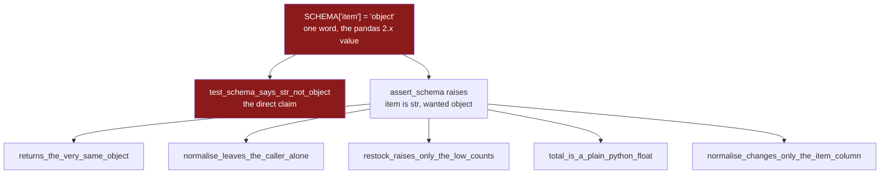

# 5.3 — `tests/test_frames.py` — the test that can go red

## One-line answer

Testing a frame is not testing a number: contents need `pd.testing.assert_frame_equal`, sameness needs
`is`, money needs `pytest.approx`, and the one test that matters most on this day is the one that turns
red the moment somebody writes `"object"` where pandas 3.0 says `str`.

---

## The story

Two of you share the shopping list in a notes app on your phones. It is one list, open on both phones.

You are about to reorganise it — merge the duplicates, fix the spellings — and you want to be able to
see what it looked like before. So you open the list in a second window, side by side with the first,
and think of that second window as "the before".

You do the tidying in the first window. Then you look across at the second one to compare.

It has changed too. Both windows are showing the same list, so there is nothing to compare against.
The "before" you were keeping was never a before; it was a second view of the same thing, and the
moment you edited the list it showed the edit.

The mistake was not the tidying. It was believing that opening a second window had made a copy.

---

## The idea in plain language

Everything in this part follows from that story: **to test that a function gave you something new,
comparing contents is not enough. You have to ask whether it is the same thing.**

Python has two questions for that, and they are not the same question
([Day 5, 1.4](../../../day-05-operators-and-conditionals/parts/01-operators/1.4-equals-is-overloadable-is-is-not.md)):

- `a == b` asks **do these have the same contents.**
- `a is b` asks **are these the same object** — the same thing in memory, the way both windows in the
  story were the same list.

The module from [5.1](5.1-the-shopping-list-module.md) promises two different things, one of each
kind. `assert_schema` promises to hand back **the very same frame**, so its test uses `is`. `normalise`
promises to hand back **a different frame**, leaving the caller's alone, so its test uses `is not` for
the object and then checks the contents of both.

Frames add a complication that plain Python objects do not have. `frame_a == frame_b` on two
DataFrames does not answer yes or no. It compares cell by cell and gives back **a whole frame of True
and False**, one per cell — and a frame of booleans cannot be used where Python wants a single yes or
no, which is why `assert out == shop` fails with an error rather than failing as a test. The tool for
"are these two frames the same data" is `pd.testing.assert_frame_equal`, which pandas ships for exactly
this and which prints which column and which rows differ.

The last complication is money. `total` returns a float built by multiplying and adding decimals, and
binary floating point cannot store `1.15` exactly
([Day 20, 2.3](../../../day-20-arrays-and-dtypes/parts/02-dtypes/2.3-floats-nan-and-precision.md)). The
shopping list comes to `7.669999999999999`, not `7.67`, so `== 7.67` is `False` and a test written that
way fails on correct code. `pytest.approx` is the comparison that allows a tiny difference, and using
it is not a weakening of the test — it is the only way to state the intended claim at all.

One more term, because the whole part turns on it. A **test that can go red** is one you have watched
fail. Day 2 established why: a test nobody has seen fail is a claim nobody has checked
([Day 2, 3.1](../../../day-02-quality-gate/parts/03-pytest/3.1-the-test-that-can-go-red.md)). On this
day there is one specific way to make that happen, and it is the day's subject: change `SCHEMA["item"]`
from `"str"` to `"object"` — the value it would have had before pandas 3.0 — and watch what breaks.

---

## Why Setu needs it

- **This is the day's gate.** Principle 7 says every lab ends with at least one test that can go RED,
  and the `"str"` versus `"object"` test is it.
- **Day 27** changes how the frame is built — read from a file instead of typed in — and keeps the same
  module. These tests are what say the change did not alter the contract
  ([Day 27, 3.2](../../../day-27-reading-and-writing/parts/03-parquet/3.2-the-round-trip-that-keeps-dtypes.md)).
- **Day 28** adds selection functions to `frames.py`, and adds to this file.
- **The Days 26–35 phase gate** — "no chained assignment anywhere" — is checkable only because these
  tests assert on the caller's frame after every call, which is precisely where a chained assignment's
  damage shows up ([4.5](../04-chained-assignment/4.5-the-filtered-frame-that-warned-nobody.md)).
- **Day 91 onwards**, every model pipeline is tested this way: call the transformer, assert the output
  is right, then assert the input is untouched. The second assertion is the one that catches leakage
  between the training and test splits.

---

## The mechanism

The file is `tests/test_frames.py`. The head, and the two identity tests:

```python
"""Day 26: the shopping-list module's contract, one test per promise."""

from __future__ import annotations

import pandas as pd
import pytest

from setu import frames as fr


def shopping_list() -> pd.DataFrame:
    """The flat's list, built fresh for every test that wants one."""
    return pd.DataFrame(
        {
            "item": ["  Milk ", "bread", "eggs", "rice"],
            "need": [2, 1, 6, 1],
            "price": [1.15, 1.40, 0.32, 2.05],
        }
    )


def test_schema_says_str_not_object() -> None:
    """pandas 3.0 infers `str` for text; a schema saying `object` matches nothing."""
    assert fr.SCHEMA["item"] == "str"
    assert str(shopping_list()["item"].dtype) == fr.SCHEMA["item"]


def test_assert_schema_returns_the_very_same_object() -> None:
    """It is a gate, not a converter: it must not copy, and it must chain."""
    shop = shopping_list()
    assert fr.assert_schema(shop) is shop
```

**Line by line:**

- `from setu import frames as fr` — aliased because the name appears in almost every line below, and
  `fr.SCHEMA` reads better than `frames.SCHEMA` repeated forty times. The import is of the **module**,
  not of its names, so a reader always sees where `SCHEMA` came from
  ([Day 17, 3.5](../../../day-17-modules-and-packages/parts/03-the-package/3.5-absolute-and-relative-imports.md)).
- `def shopping_list()` — **a plain function, not a pytest fixture.** A fixture would work, but this
  returns a brand-new frame on every call, and several tests below need two independent frames in one
  test. A function you call is the simpler tool; a fixture is what you reach for when setup is
  expensive or needs tearing down
  ([Day 2, 3.2](../../../day-02-quality-gate/parts/03-pytest/3.2-fixtures-and-tmp-path.md)).
- The list is rebuilt **inside** each test rather than defined once at module level. A module-level
  frame shared by every test is one object, and a single test that mutates it changes what every later
  test sees — the two-windows problem, in a test file.
- `assert fr.SCHEMA["item"] == "str"` — **this is the day's red-capable test.** It asserts the literal
  string in the module's own constant, which is the one place the pandas 3.0 change bites
  ([2.4](../02-the-str-dtype/2.4-dtypes-equals-object-finds-nothing.md)).
- The second line of the same test compares the constant against what pandas **actually** produces for
  that column. Together the two lines say something stronger than either alone: the schema says `str`,
  *and* `str` is what this pandas gives you. If a future pandas changed the inferred dtype again, the
  first line would still pass and the second would fail — which is the failure you want, because it
  says the world moved, not that the constant was typed wrong.
- `assert fr.assert_schema(shop) is shop` — `is`, not `==`. `==` here would build a frame of booleans
  and then fail with an error about ambiguity, and even if it did not, it would pass for a copy, which
  is exactly what this test exists to rule out.

The promise that nothing was edited, and the two comparisons that need pandas' own helper:

```python
def test_normalise_leaves_the_caller_frame_alone() -> None:
    """The no-mutation promise, checked on the object the caller still holds."""
    shop = shopping_list()
    out = fr.normalise(shop)
    assert out is not shop
    assert out["item"].tolist() == ["milk", "bread", "eggs", "rice"]
    assert shop["item"].tolist() == ["  Milk ", "bread", "eggs", "rice"]


def test_normalise_changes_only_the_item_column() -> None:
    """Everything the function did not promise to touch must come back identical."""
    shop = shopping_list()
    out = fr.normalise(shop)
    pd.testing.assert_frame_equal(out.drop(columns="item"), shop.drop(columns="item"))
```

**Line by line:**

- `assert out is not shop` — the story's assertion. It comes **first**, before any check of contents,
  because if this fails every line under it is meaningless: they would be inspecting one object twice.
- `out["item"].tolist()` — `.tolist()` turns the column into an ordinary Python list, and a list
  compares with `==` to give one True or False. Comparing the Series directly would produce a Series of
  booleans and the ambiguity error again. This is the small, boring way to compare one column, and it
  is the right one when the expected value is short enough to type out.
- The third assertion names the **original**, spaces and capital and all. It is the only line in the
  file that tests the no-mutation promise on real content, and it is why `"  Milk "` is in the fixture
  at all: a value that normalising changes.
- `pd.testing.assert_frame_equal(a, b)` — pandas' own comparison, which checks values, dtypes, column
  order and the index, and **raises with a message naming the column and the rows that differ** rather
  than saying `False`. Use it whenever the expected value is a whole frame.
- `.drop(columns="item")` on both sides — the columns `normalise` promised not to touch. Comparing the
  full frames would fail on `item`, which is the column that is *supposed* to differ. Dropping it makes
  the test say exactly one thing: *nothing else moved.* That is a promise the module never wrote down
  explicitly, and it is worth pinning, because `.assign` replacing the wrong column is a real typo.

The rest of the contract — the error messages, the argument check, and the float:

```python
@pytest.mark.parametrize(
    ("frame", "expected"),
    [
        (pd.DataFrame({"item": ["milk"], "need": [2]}), "missing columns: price"),
        (pd.DataFrame({"item": ["milk"], "need": ["2"], "price": [1.15]}), "need is str"),
        (pd.DataFrame({"item": ["milk"], "need": [2], "price": [1.15], "aisle": [3]}), "aisle"),
    ],
)
def test_assert_schema_names_the_problem(frame: pd.DataFrame, expected: str) -> None:
    """The message must name the column, not just say the frame is wrong."""
    with pytest.raises(fr.SchemaError, match=expected):
        fr.assert_schema(frame)


def test_assert_schema_reports_every_problem_at_once() -> None:
    """One run, one full list - not one problem per re-run."""
    broken = pd.DataFrame({"item": ["milk"], "need": ["2"], "cost": [1.15]})
    with pytest.raises(fr.SchemaError) as caught:
        fr.assert_schema(broken)
    message = str(caught.value)
    assert "missing columns: price" in message
    assert "unexpected columns: cost" in message
    assert "need is str, wanted int64" in message


def test_restock_rejects_a_negative_minimum() -> None:
    """A bad argument is a ValueError, never a SchemaError - the frame was fine."""
    with pytest.raises(ValueError, match="must not be negative"):
        fr.restock(shopping_list(), -1)


def test_total_is_a_plain_python_float() -> None:
    """The boundary conversion: nothing downstream should meet a numpy scalar."""
    value = fr.total(shopping_list())
    assert type(value) is float
    assert value == pytest.approx(7.67)
```

**Line by line:**

- `@pytest.mark.parametrize` — one test body, run once per row of the list, each appearing as its own
  named test in the output ([Day 2, 3.1](../../../day-02-quality-gate/parts/03-pytest/3.1-the-test-that-can-go-red.md)).
  Three broken frames written as three copy-pasted test functions would drift apart the first time the
  message format changed.
- `("frame", "expected")` as a tuple of names — the two things each row supplies. Each row is a broken
  frame and the fragment its message must contain.
- `pytest.raises(fr.SchemaError, match=expected)` — asserts both that it raised **and** that the message
  says something specific. Without `match=`, this test would pass for a `SchemaError` whose message was
  `bad schema`, which is the failure [5.2](5.2-asserting-the-schema.md) exists to prevent. `match=` is a
  regular expression searched in the message, so a fragment is enough.
- `"need is str"` as the expected fragment rather than the whole sentence — a fragment specific enough
  to be wrong if the check breaks, and short enough to survive a change of wording elsewhere in the
  message. Matching the entire string would make every one of these tests fail when a semicolon moved.
- `with pytest.raises(...) as caught:` and `str(caught.value)` — the second test needs **three**
  fragments in one message, and `match=` takes one pattern. Capturing the exception and asserting three
  `in` checks says the thing plainly. `caught.value` is the exception object; `caught` is pytest's
  wrapper around it.
- `pytest.raises(ValueError, match="must not be negative")` — deliberately the **general** class, not
  `SchemaError`. The claim under test is that a bad argument is not reported as a bad frame, and if
  someone later changed `restock` to raise `SchemaError` here, `except SchemaError` at a call site would
  start swallowing the caller's own typo.
- `type(value) is float` — `is`, not `isinstance`. `np.float64` **is** a subclass of `float`, so
  `isinstance(np.float64(1.0), float)` is `True` and the test would pass on exactly the value it exists
  to reject ([5.1](5.1-the-shopping-list-module.md)). This is the one place in the file where
  `isinstance` is the wrong tool, and the reason is worth remembering: `isinstance` asks "will this
  behave like a float", `type(...) is` asks "is this exactly a float".
- `pytest.approx(7.67)` — the comparison that tolerates the last bits of a binary float. Its default
  tolerance is relative, one part in a million, which is far tighter than the error here and far looser
  than exact equality.

Green, and what each name is claiming:

```text
$ uv run pytest tests/test_frames.py -v
collected 12 items

tests/test_frames.py::test_schema_says_str_not_object PASSED [  8%]
tests/test_frames.py::test_assert_schema_returns_the_very_same_object PASSED [ 16%]
tests/test_frames.py::test_assert_schema_names_the_problem[frame0-missing columns: price] PASSED [ 25%]
tests/test_frames.py::test_assert_schema_names_the_problem[frame1-need is str] PASSED [ 33%]
tests/test_frames.py::test_assert_schema_names_the_problem[frame2-aisle] PASSED [ 41%]
tests/test_frames.py::test_assert_schema_reports_every_problem_at_once PASSED [ 50%]
tests/test_frames.py::test_schema_error_is_catchable_as_a_value_error PASSED [ 58%]
tests/test_frames.py::test_normalise_leaves_the_caller_frame_alone PASSED [ 66%]
tests/test_frames.py::test_restock_raises_only_the_low_counts PASSED [ 75%]
tests/test_frames.py::test_restock_rejects_a_negative_minimum PASSED [ 83%]
tests/test_frames.py::test_total_is_a_plain_python_float PASSED [ 91%]
tests/test_frames.py::test_normalise_changes_only_the_item_column PASSED [100%]

12 passed in 0.99s
```

Now the part that matters. **Break the schema on purpose** — change one word in `src/setu/frames.py`:

```python
SCHEMA: dict[str, str] = {"item": "object", "need": "int64", "price": "float64"}
```

**Line by line:**

- `"object"` — the exact value this line would have held on pandas 2.x, where a text column's dtype was
  `object` ([2.1](../02-the-str-dtype/2.1-text-used-to-be-object.md)). This is not an invented error.
  It is what every schema written before pandas 3.0 says, and it is what a copied snippet or an older
  answer will hand you.

```text
$ uv run pytest tests/test_frames.py -q
6 failed, 6 passed

_______________________ test_schema_says_str_not_object _______________________

    def test_schema_says_str_not_object() -> None:
        """pandas 3.0 infers `str` for text; a schema saying `object` matches nothing."""
>       assert fr.SCHEMA["item"] == "str"
E       AssertionError: assert 'object' == 'str'
E
E         - str
E         + object
```

Six red from one word, and that is the shape you want: the direct test names the wrong value on the
line that holds it, and the five functional tests fail underneath it because every one of them calls
`assert_schema` and every call now raises `SchemaError: item is str, wanted object`. Change the word
back and all twelve go green.



---

## When it breaks

**Comparing two frames with `==`:**

```text
$ uv run python -c "
import pandas as pd
from setu import frames
shop = pd.DataFrame({'item': ['  Milk ', 'bread'], 'need': [2, 1], 'price': [1.15, 1.40]})
out = frames.normalise(shop)
assert out != shop
" 2>&1 | tail -4
```

```text
  File ".../pandas/core/generic.py", line 1501, in __bool__
    raise ValueError(
ValueError: The truth value of a DataFrame is ambiguous. Use a.empty, a.bool(), a.item(), a.any() or a.all().
```

**What it means.** `out != shop` produced a frame of True and False, one per cell, and then `assert`
asked that frame the yes-or-no question "are you true?". There is no sensible single answer — some
cells differ and some do not — so pandas refuses to guess and raises. Note what this is **not**: it is
not a failing test. It is an error in the test itself, and a test that errors is telling you the
assertion was never made. The fixes are the three in the file above, chosen by what you actually mean:
`is not` for "a different object", `.tolist() ==` for one column, and
`pd.testing.assert_frame_equal` for two whole frames.

**Comparing money with `==`:**

```text
$ uv run python -c "
import pandas as pd
from setu import frames
shop = pd.DataFrame({
    'item': ['  Milk ', 'bread', 'eggs', 'rice'],
    'need': [2, 1, 6, 1],
    'price': [1.15, 1.40, 0.32, 2.05],
})
print(frames.total(shop) == 7.67)
print(frames.total(shop))
"
False
7.669999999999999
```

**What it means.** The module is right and the test would be wrong. `2 × 1.15 + 1 × 1.40 + 6 × 0.32 +
1 × 2.05` is `7.67` in decimal and `7.669999999999999` in binary floating point, because none of
`1.15`, `1.40` or `0.32` can be stored exactly in base two — the same reason `0.1 + 0.2` is not `0.3`.
Floats behave this way because of the *IEEE Standard for Floating-Point Arithmetic* (IEEE 754-2019,
DOI 10.1109/IEEESTD.2019.8766229), which fixes how a fraction is stored in binary and does not include
`0.32` among the fractions it can store. `pytest.approx(7.67)` states the claim that was actually
meant. The other honest fix is to stop using floats for money, which is what
[5.1](5.1-the-shopping-list-module.md)'s review comment is about.

**What `assert_frame_equal` says when it does fail:**

```text
$ uv run python -c "
import pandas as pd
a = pd.DataFrame({'need': [2, 1]})
b = pd.DataFrame({'need': [2, 2]})
pd.testing.assert_frame_equal(a, b)
" 2>&1 | tail -6
```

```text
AssertionError: DataFrame.iloc[:, 0] (column name="need") are different

DataFrame.iloc[:, 0] (column name="need") values are different (50.0 %)
[index]: [0, 1]
[left]:  [2, 1]
[right]: [2, 2]
```

**What it means.** This is why the helper is worth using instead of hand-rolling a comparison. It names
the column, says what fraction of the values differ, prints the index labels of the rows involved, and
shows both sides. `left` is the first argument and `right` is the second, which is worth fixing in your
head now: everyone reads the diff backwards once. The convention in this file is `assert_frame_equal(
actual, expected)`, so `left` is what the code produced and `right` is what you wanted.

**The test that passed because the frame was shared:**

```text
$ uv run python -c "
import pandas as pd
from setu import frames

shop = pd.DataFrame({'item': ['  Milk '], 'need': [2], 'price': [1.15]})
before = shop
out = frames.normalise(shop)
print('before == shop?', before is shop)
print('before says   :', before['item'].tolist())
"
before == shop? True
before says   : ['  Milk ']
```

**What it means.** `before = shop` is the two-windows mistake from the story, written in Python: it
binds a second name to the same object rather than making a copy. Here the test still passes, because
`normalise` genuinely does not modify its argument — but it passes **for the wrong reason**, and it
would go on passing if `normalise` were rewritten to edit in place, since `before` would change with
`shop`. A "before" snapshot has to be `shop.copy()`, or the test has to assert against literal values
typed out in the test, which is what the file above does. Literal values are better here: they cannot
be quietly wrong.

---

## In production

**What a professional writes instead of the teaching version.** The same tests, plus one that no
individual assertion covers — the module's whole promise, checked in one place:

```python
CONTRACT = [
    (fr.normalise, {}),
    (fr.restock, {"minimum": 2}),
]


@pytest.mark.parametrize(("func", "kwargs"), CONTRACT)
def test_no_function_modifies_its_argument(func, kwargs) -> None:
    """Every transform in the module returns a new frame and leaves the caller's alone."""
    shop = shopping_list()
    snapshot = shop.copy()
    func(shop, **kwargs)
    pd.testing.assert_frame_equal(shop, snapshot)
```

**Line by line:**

- `CONTRACT` — a list of every function that claims to return a new frame. When Day 28 adds a selection
  function to the module, it gets added here and is covered by this test without a new test being
  written. **A test parametrised over a list is a test that grows with the module**, and the reviewable
  question becomes "is your function in that list?".
- `snapshot = shop.copy()` — a real copy, explicitly. Under Copy-on-Write the copy is lazy and costs
  nothing until one of the two is written to
  ([3.2](../03-copy-on-write/3.2-the-copy-that-has-not-happened-yet.md)), so this is cheap here and
  would not be in a loop over a large frame.
- `func(shop, **kwargs)` — the return value is **thrown away on purpose**. This test is not about what
  came back; it is about what happened to the argument, and ignoring the result makes that obvious to
  the next reader.
- `assert_frame_equal(shop, snapshot)` — the whole frame, not one column, because a function that
  edited its argument might have edited any part of it.

**What changes at scale.** Test data stops being typed into the file. A four-row list is perfect for
teaching and useless for catching the failures real data produces — a missing value in the middle of a
`str` column, a duplicate index label after a concat, an integer column that arrived as `int32` on one
machine and `int64` on another. Two things replace it. **Fixtures** — small real files committed to the
repo, read once per test session, so the tests exercise the reader as well as the functions
([Day 27, 1.2](../../../day-27-reading-and-writing/parts/01-the-csv/1.2-read-csv-and-what-it-guessed.md)).
And **property-based tests**, which generate frames rather than stating them: instead of asserting that
this particular list totals `7.67`, assert that `total` of any valid frame equals the sum of its rows,
and let the generator find the empty frame, the single-row frame and the frame full of zeros. The
teaching tests stay; they are the ones that read as documentation.

**The failure that only appears with real data.** A suite like this one was green for a year, then went
red on a machine that was not the author's. The cause was `int64`. On the original machine every count
column came out `int64`; the frames on the other machine came from a reader that produced `int32`, and
the schema check compared dtype names as strings, so `int32 != int64` and every test failed at once.
Nothing was wrong with the data. **Comparing dtypes by name is exact, and exactness is what you want at
a boundary and a nuisance inside one** — the fix was to keep the strict comparison at ingest, where the
reader is told the dtype anyway
([Day 27, 1.4](../../../day-27-reading-and-writing/parts/01-the-csv/1.4-dtype-at-read-time.md)), and to
accept any integer width internally. The general lesson is that a test asserting a dtype is asserting
something about the machine as well as the code.

**The review comment a senior engineer leaves.** *"`test_restock_raises_only_the_low_counts` asserts
the new counts and the untouched original, which is right — but it never checks that `price` and `item`
came through unchanged. Please use `assert_frame_equal` on the columns the function did not promise to
touch, the way the `normalise` test does. Two of the three bugs we have had in this module were a
`.assign` writing to the wrong column."*

**The interview question.** *"How do you test a function that takes a DataFrame and returns one?"* The
answer that shows experience covers four things. Assert on identity first — `is not` for the returned
object and an unchanged snapshot of the input — because a function that quietly edits its argument
passes every content check you can write. Use `pd.testing.assert_frame_equal` rather than `==`, because
`==` on frames gives a frame of booleans and errors out in an `assert`. Compare floats with
`pytest.approx`, and know it is because of binary floating point rather than pandas. And have at least
one test you have watched go red — on this module it is the one asserting the schema says `str` and not
`object`, which is the whole pandas 3.0 migration reduced to a single word in a single line.

---

## Check yourself

```bash
uv run pytest tests/test_frames.py -v
sed -i 's/"item": "str"/"item": "object"/' src/setu/frames.py
uv run pytest tests/test_frames.py -q
sed -i 's/"item": "object"/"item": "str"/' src/setu/frames.py
uv run pytest tests/test_frames.py -q
```

Green, then red, then green again. Count how many tests the one word took down, and say why it was more
than one.

**Answer out loud, without scrolling up:**

> Why does `test_total_is_a_plain_python_float` use `type(value) is float` instead of
> `isinstance(value, float)`? Then say what `assert out == shop` does to a test, and which of the three
> replacements you would use to check that two whole frames match.

---

**Next:** back to the hub, [LESSON.md](../../LESSON.md), for the build brief and the checklist.
