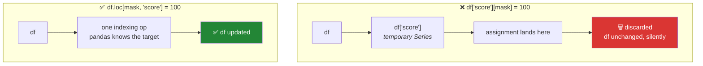

# Day 26 — pandas 3.0: Copy-on-Write, the `str` dtype, and the trap every tutorial still teaches

**Phase 4 · Module 4 · Data analysis with Pandas** · ID: **PD-01**

> **Yesterday:** Day 25 closed Phase 3 — copy vs view in NumPy, and a vectorised stats module.
> **Today:** the same copy-vs-view question, one level up — and the two pandas 3.0 changes that make
> almost every pandas tutorial written before 2026 quietly wrong.
> **Tomorrow:** reading and writing data with the dtypes declared at read time.

```bash
./m start 26 && ./m scaffold 26
```

**Time:** 2 hours — this is a long day on purpose. **Request budget:** 0 model calls.

---

## §1 The story

Yesterday's NumPy lesson ended on a distinction: a slice of an array is a **view**, so writing to it
writes to the parent. `.copy()` gives you a real copy. You had to know which one you had.

For a decade, pandas had the same question with a much worse answer. Sometimes `df[df.a > 3]` gave
you a view. Sometimes a copy. Which one depended on dtypes, on memory layout, on the phase of the
moon. pandas could not tell you reliably either, so it printed the most famous warning in data
science — `SettingWithCopyWarning` — which said, more or less, *"something might not have worked,
we're not sure, good luck."*

**pandas 3.0 ended that.** Released 21 January 2026, it makes **Copy-on-Write** the only mode. From
the user's point of view, every indexing operation now behaves as if it returned a copy. The warning
is gone, because the ambiguity is gone.

The catch — and it is a big one — is *how* the old pattern now fails.

```python
df["score"][df["flag"] > 5] = 100
```

In pandas 2.x this modified `df` and printed a warning. In pandas 3.0 it modifies a temporary copy
that is discarded on the next line. **No warning. No exception. Your dataframe is simply unchanged.**

That is the worst failure mode there is: code that looks right, runs clean, and does nothing. If you
learn pandas from a 2023 tutorial in 2026, you will hit it, and you will not hit it on the line where
you wrote it — you will hit it three days later when a model trains on the values you thought you
had fixed.

The second change is quieter and just as consequential. **String columns are no longer `object`
dtype.** They are a dedicated `str` dtype, Arrow-backed when PyArrow is installed. It is faster and
it uses far less memory. It also means this idiom, which appears in an enormous amount of existing
code, now finds nothing:

```python
text_cols = df.columns[df.dtypes == "object"]   # empty in pandas 3.0
```

So today does three things, in this order: **make both failures happen on your screen**, learn the
correct patterns, and write a test that goes red if either pattern sneaks back into the repo.

---

## §2 Setup — run this

```bash
uv add "pandas==3.0.5" "pyarrow"
mkdir -p days/day-26/lab
touch days/day-26/lab/cow_demo.py
touch src/setu/frames.py
touch tests/test_frames.py
```

**Line by line:**

- `uv add "pandas==3.0.5"` — exact pin, and it lands in `pyproject.toml` + `uv.lock`. Use whatever
  version **your** Day-1 `verify_pins.py` run reported; if that differs from `3.0.5`, pin yours and
  log the drift in `docs/CHANGELOG_PLAN_DS.md`.
- `"pyarrow"` — deliberately **not** pinned to a specific version here, because pandas declares its
  own compatible range and letting the resolver pick inside that range is safer than guessing. This
  is the one exception to Principle 4 in the whole plan, and it is written down so it is a decision
  rather than a slip. Without PyArrow the new string dtype still works — it just falls back to a
  slower NumPy-backed implementation.

Confirm what you actually have:

```bash
uv run python -c "import pandas as pd; print(pd.__version__); print(pd.options.mode.copy_on_write)"
```

- `pd.__version__` must start with `3.`. If it starts with `2.`, stop — everything below assumes 3.x.
- In 3.0 Copy-on-Write is not an option you can turn off. Reading the value confirms which world
  you are in.

---

## §3 Make Copy-on-Write fail on your screen

Copy into `days/day-26/lab/cow_demo.py`:

```python
"""PD-01: reproduce the pandas 3.0 chained-assignment failure, then fix it."""

from __future__ import annotations

import pandas as pd


def make_frame() -> pd.DataFrame:
    return pd.DataFrame(
        {
            "paper": ["a", "b", "c", "d"],
            "citations": [2, 9, 4, 11],
            "score": [1.0, 1.0, 1.0, 1.0],
        }
    )


def chained_assignment_does_nothing() -> None:
    df = make_frame()
    df["score"][df["citations"] > 5] = 100.0      # <-- looks correct. is not.
    print("chained:\n", df, "\n")


def loc_assignment_works() -> None:
    df = make_frame()
    df.loc[df["citations"] > 5, "score"] = 100.0  # <-- the only correct form
    print("loc:\n", df, "\n")


def a_slice_is_now_yours_alone() -> None:
    df = make_frame()
    high = df[df["citations"] > 5]
    high.loc[:, "score"] = 999.0
    print("slice modified:\n", high)
    print("parent untouched:\n", df, "\n")


if __name__ == "__main__":
    chained_assignment_does_nothing()
    loc_assignment_works()
    a_slice_is_now_yours_alone()
```

**Line by line:**

- `df["score"]` — this returns a **Series**. Under Copy-on-Write it is a temporary object that does
  not share writeable memory with `df`.
- `[df["citations"] > 5] = 100.0` — assigns into that temporary. The temporary is then discarded.
  `df` never hears about it. **Two consecutive `[]` operations with an assignment on the end is the
  signature of this bug.** Learn to see it as a shape, not as a rule.
- `df.loc[<row selector>, <column selector>] = value` — **one** indexing operation, so pandas knows
  you are assigning into `df` itself. This is the correct form and it is always the correct form.
- `high = df[df["citations"] > 5]` then `high.loc[:, "score"] = 999.0` — in pandas 2.x this might
  have written through to `df` and would have warned. In 3.0 `high` is unambiguously independent.
  That predictability is the *gift* half of Copy-on-Write.
- `df["citations"] > 5` — a boolean Series, one entry per row. This is the mask you first met on
  Day 21 as a NumPy boolean array; it is the same idea with an index attached.

Run it:

```bash
uv run python days/day-26/lab/cow_demo.py
```

**Read the first block carefully.** All four `score` values are still `1.0`. No warning was printed.
Sit with that for a moment — that silence is what makes this dangerous.

### What actually happened



### The house rule, from today until Day 240

> **Assignment into a DataFrame uses `.loc` (or `.iloc`). One pair of brackets, never two.**

Every remaining pandas day in this plan obeys it, and §7's test enforces it.

---

## §4 The `str` dtype

Add to `cow_demo.py`:

```python
def dtypes_are_not_object_anymore() -> None:
    df = make_frame()
    print("dtypes:\n", df.dtypes, "\n")

    legacy = df.columns[df.dtypes == "object"].tolist()
    print(f"legacy 'object' check found: {legacy}   <-- empty in pandas 3.0")

    correct = df.select_dtypes(include="str").columns.tolist()
    print(f"select_dtypes(include='str') found: {correct}")

    df.loc[1, "paper"] = None
    print("\nmissing values are allowed in a str column:")
    print(df["paper"], "\n")
    print(f"{df['paper'].isna().sum()=}")
```

**Line by line:**

- `df.dtypes` — `paper` reports `str`, not `object`. That single word is the change.
- `df.dtypes == "object"` returns all `False`, so `legacy` is `[]`. **This is the second silent
  failure of the day** — a column-selection helper that used to find your text columns now finds
  none, and a "clean the text columns" step becomes a no-op.
- `df.select_dtypes(include="str")` — the correct, version-appropriate way to ask for text columns.
  Use `select_dtypes`, not a hand-rolled dtype comparison, everywhere.
- `.columns.tolist()` — `df.columns` is an `Index`; `.tolist()` gives a plain Python list, which is
  what you want to return from a helper.
- `df.loc[1, "paper"] = None` — note the `.loc`, per §3's house rule. The new `str` dtype accepts
  missing values natively, which is precisely what `object` never did cleanly.
- `df['paper'].isna().sum()` — `isna()` gives a boolean Series; `.sum()` counts the `True`s, because
  `bool` is an `int` (Day 4, PY-01). Third appearance of that fact.

### Why this is a gift, not just a hazard

| | pandas 2.x `object` | pandas 3.0 `str` |
|---|---|---|
| Storage | a Python object pointer per cell | contiguous Arrow buffer |
| `.str` operations | per-object Python loop | vectorised Arrow kernels |
| Type safety | any object could hide in there | strings and missing values only |
| Handoff to Polars/DuckDB | convert and copy | already Arrow — zero-copy |

You will feel all four on Day 33 (`.str` accessor) and Day 35 (the Polars/DuckDB comparison).

---

## §5 The other two 3.0 changes worth knowing today

Add and run:

```python
def datetime_resolution() -> None:
    s = pd.to_datetime(["2026-08-21", "1500-01-01"])
    print(f"{s.dtype=}   <-- microseconds, not nanoseconds")
    print(s, "\n")


def inplace_returns_self() -> None:
    df = make_frame()
    result = df.fillna(0).clip(lower=0).round(2)
    print("chained without reassignment issues:\n", result)
```

- `s.dtype` reports a **microsecond** resolution rather than nanosecond. In 2.x, nanosecond
  resolution meant any date before 1678 or after 2262 raised an out-of-bounds error. `1500-01-01`
  now works. If you ever parsed historical dates and got a cryptic overflow, this was why.
- Methods that accept `inplace=True` now return `self` rather than `None`, which makes them
  chainable. That is a convenience — **it is not permission to use `inplace=True`.** This project
  does not: reassignment (`df = df.something()`) is explicit about what changed, and explicit beats
  clever in a file someone reads in four months.
- The `copy=` keyword across pandas methods no longer does anything under Copy-on-Write. If you see
  it in old code, delete it rather than reasoning about it.

---

## §6 Build brief — `src/setu/frames.py`

The dataframe helpers every later phase imports. Day 84's `audit(df)` is built on these; Day 227's
ingestion pipeline uses them on real scraped data.

```python
"""DataFrame helpers for Setu. pandas 3.0 semantics only."""

from __future__ import annotations

import pandas as pd


def text_columns(df: pd.DataFrame) -> list[str]:
    """Return the names of text columns, correctly on pandas 3.0."""
    return df.select_dtypes(include="str").columns.tolist()


def set_where(
    df: pd.DataFrame, mask: pd.Series, column: str, value: object
) -> pd.DataFrame:
    """TODO(me): set `column` to `value` on the rows where `mask` is True.

    Must use .loc. Must return the SAME object it was given (not a copy),
    so callers see the change. Must raise KeyError if `column` is not present.
    """
    raise NotImplementedError


def normalise_text_columns(df: pd.DataFrame) -> pd.DataFrame:
    """TODO(me): strip and collapse whitespace in every text column.

    Must NOT mutate the caller's frame — return a new one.
    Reuse setu.textutils.normalise_whitespace (Day 4). Do not rewrite it.
    """
    raise NotImplementedError
```

**Note the deliberate asymmetry**, because it is today's real design lesson: `set_where` mutates in
place and says so in its docstring; `normalise_text_columns` returns a new frame and says so. Either
is fine. **A function that does not say which is a bug waiting to happen** — that is Day 4's PY-02
lesson at library scale.

---

## §7 The eval that must be able to fail

`tests/test_frames.py`:

```python
import pandas as pd
import pytest

from setu import frames


@pytest.fixture
def df() -> pd.DataFrame:
    return pd.DataFrame(
        {"paper": ["  a  ", "b\n\nb", "c"], "citations": [2, 9, 4], "score": [1.0, 1.0, 1.0]}
    )


def test_text_columns_finds_str_dtype(df):
    assert frames.text_columns(df) == ["paper"]


def test_legacy_object_check_would_have_failed(df):
    # documents WHY text_columns exists — this is the pandas 2.x idiom
    assert df.columns[df.dtypes == "object"].tolist() == []


def test_set_where_actually_changes_the_frame(df):
    frames.set_where(df, df["citations"] > 5, "score", 100.0)
    assert df.loc[1, "score"] == 100.0
    assert df.loc[0, "score"] == 1.0


def test_set_where_rejects_a_missing_column(df):
    with pytest.raises(KeyError):
        frames.set_where(df, df["citations"] > 5, "nope", 1.0)


def test_normalise_text_does_not_mutate_the_caller(df):
    before = df["paper"].tolist()
    frames.normalise_text_columns(df)
    assert df["paper"].tolist() == before, "caller's frame was mutated — PD-01"


def test_normalise_text_collapses_whitespace(df):
    out = frames.normalise_text_columns(df)
    assert out["paper"].tolist() == ["a", "b b", "c"]


def test_no_chained_assignment_anywhere_in_src():
    """The house rule from §3, enforced across the whole package."""
    import re
    from setu import paths

    pattern = re.compile(r"\]\s*\[[^\]]+\]\s*=")
    offenders = [
        f"{path.name}:{i}"
        for path in (paths.SRC).rglob("*.py")
        for i, line in enumerate(path.read_text(encoding="utf-8").splitlines(), 1)
        if pattern.search(line)
    ]
    assert not offenders, f"chained assignment found: {offenders}"
```

**Line by line:**

- `@pytest.fixture` — a factory pytest calls for each test that names `df` as a parameter. Every test
  gets a **fresh** frame, so a test that mutates cannot poison the next one.
- `test_legacy_object_check_would_have_failed` — an unusual test: it asserts that the **wrong** way
  returns nothing. It exists as executable documentation. When someone asks "why not just check
  `dtypes == 'object'`?", this test is the answer, and it will start failing the day pandas changes
  its mind — which is exactly when you want to know.
- `test_set_where_actually_changes_the_frame` — checks the mutation happened **and** that row 0 was
  left alone. A helper that sets every row also satisfies the first assertion; the second catches it.
- `pytest.raises(KeyError)` — asserts the error contract. A function that returns silently on a typo'd
  column name is worse than one that raises.
- `test_normalise_text_does_not_mutate_the_caller` — the twin of Day 4's mutation test, one level up.
- `test_no_chained_assignment_anywhere_in_src` — a **repo-wide** guard. The regex looks for
  `][...] =`: a closing bracket, another bracket group, then an assignment. It is not a parser and it
  will not catch every form, but it catches the shape you will actually type at 11pm on Day 130.
  `rglob("*.py")` walks the package recursively; `enumerate(..., 1)` numbers lines from 1 so the
  message points at a real editor line.

```bash
uv run python -m pytest tests/test_frames.py -v
```

Red until you implement the TODOs. Then, to be sure the guard works, paste
`df["score"][df["citations"] > 5] = 1` into any file under `src/setu/`, run the suite, watch the last
test go red, and delete it.

---

## §8 Request budget

| Resource | Spent today |
|---|---|
| LLM calls | **0** |
| Network | one `uv add` resolution |
| Cost | $0 |

---

## §9 Traps

- **Learning pandas from a pre-2026 tutorial.** Most of them teach `df[col][mask] = v`. In 3.0 it is
  a silent no-op. This trap is the reason this day exists.
- **Looking for `SettingWithCopyWarning`.** It is gone. Its absence is not a sign you are safe.
- **`df.dtypes == "object"` to find text columns.** Use `select_dtypes(include="str")`.
- **Reaching for `inplace=True` because it chains now.** This project reassigns. Explicit beats clever.
- **Leaving `copy=` arguments in place.** They are inert under Copy-on-Write. Delete them.
- **Assuming a filtered frame writes back to its parent.** It does not, on purpose. If you wanted the
  parent changed, use `.loc` on the parent.
- **Installing pandas without PyArrow** and then being confused about why string operations are slow.
- **Pinning `3.0.5` because this file says so.** Pin what *your* verify run said. Log the difference.

---

## §10 Verify before you code

Written **2026-08-21**. pandas 3.x is moving; check these first:

- <https://pandas.pydata.org/docs/whatsnew/> — confirm the current 3.x patch and read anything newer
  than 3.0.5.
- <https://pandas.pydata.org/docs/user_guide/copy_on_write.html> — the authoritative Copy-on-Write page.
- <https://pandas.pydata.org/docs/user_guide/text.html> — the string dtype migration guide.
- <https://pandas.pydata.org/docs/reference/api/pandas.DataFrame.select_dtypes.html> — confirm
  `include="str"` is still the accepted spelling.

If any of these contradict this lesson, **the docs win** — and that contradiction is an addendum
(Principle 14), not a quiet edit.

---

## §11 Say it in an interview

> "pandas 3.0 made Copy-on-Write the only mode, which finally killed `SettingWithCopyWarning` — but
> it changed how chained assignment fails. `df[col][mask] = value` used to work and warn; now it
> writes into a discarded temporary and your frame is silently unchanged. So the house rule in my
> code is that every assignment goes through `.loc`, and I have a test that greps the package for the
> chained shape and fails the build if it appears. The other 3.0 change people trip on is that string
> columns aren't `object` dtype any more — they're a dedicated Arrow-backed `str` — so any helper
> that found text columns by comparing dtypes to `'object'` now finds nothing. I keep a test that
> asserts the old idiom returns empty, purely as executable documentation of why the new one exists."

---

## §12 Done when

Tick [`CHECKLIST.md`](CHECKLIST.md), then:

```bash
./m check
./m done 26
```
