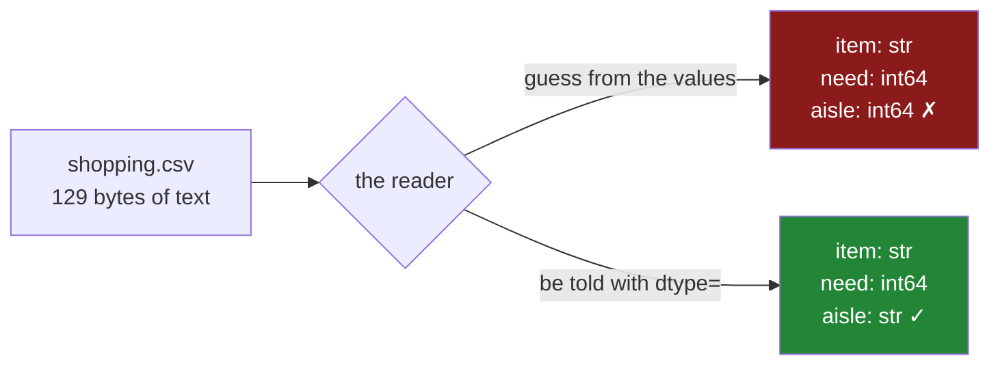

# 1.1 — A CSV has no types in it

## One-line answer

A CSV file is text and nothing else — every value in it is characters, including the ones that look
like numbers and dates — so anything that reads one has to **decide** what each column is, and that
decision is where the day's whole subject lives.

---

## The story

The flat's shopping list gets typed into the shared laptop and saved so everybody can open it.

Somebody opens the saved file in a plain text editor, out of curiosity, and it looks like this:

```text
item,need,price,aisle,bought
milk,2,1.15,07,2026-08-30
bread,1,1.40,03,2026-08-30
eggs,6,0.32,07,
rice,1,2.05,11,2026-08-24
```

That is the whole file. There is no note anywhere in it saying that `need` holds counts, or that
`price` is money, or that `bought` is a date. The first line gives the column names and every line
after it is values separated by commas. The `07` in the aisle column is the characters zero and seven,
in the same way that `milk` is the characters m, i, l and k.

Nobody minds, because a person reading it knows what a shopping list is. `2` next to `milk` is two
milk. `2026-08-30` is the thirtieth of August. `07` is aisle seven, and the zero is there because the
shop's signs are all two digits.

The program that opens it knows none of that. It has four lines of characters and a header, and it has
to work out the rest.

---

## The idea in plain language

A **CSV** — comma-separated values — is a plain text file where each line is a row and the values in
that row are separated by commas. That is the entire specification of the idea. It is old, it is
readable by everything, and it is the format almost every dataset arrives in.

The word that matters here is **plain text**. Day 26 established that a pandas column has one **dtype**
— one kind of value it holds, for every row
([Day 26, 1.4](../../../day-26-frames-and-copy-on-write/parts/01-the-two-objects/1.4-one-dtype-per-column.md)).
A CSV has no such thing. It does not record that `need` holds whole numbers; it records the character
`2`. It does not record that `bought` holds dates; it records twenty-six, zero, two, six, hyphen, and
so on.

So every program that reads a CSV faces the same question on every column, and there are exactly three
things it can do about it:

1. **Guess**, by looking at the values and deciding what they seem to be. This is what `read_csv` does
   by default ([1.2](1.2-read-csv-and-what-it-guessed.md)).
2. **Be told**, by the person calling it, one dtype per column. This is `dtype=`, and it is what this
   day argues for ([1.4](1.4-dtype-at-read-time.md)).
3. **Refuse**, and hand back every column as text for the caller to sort out. Almost nothing does this,
   because it is annoying, but it is the only option with no failure mode.

Two more terms, because the file above uses both and they are easy to confuse.

The **header** is the first line, the one with the column names in it. It is not data; it is a
description of the data. A CSV is not required to have one, which is its own small problem, and
`read_csv` assumes it does unless told otherwise.

A **delimiter** is the character that separates one value from the next. In a CSV it is the comma, in
the name. In practice files arrive with tabs, semicolons and pipes and are still called CSVs, which is
why `read_csv` has a `sep=` argument.

There is one thing a CSV genuinely cannot express, and it is worth saying now because sections 2 and 3
are both about it. **A CSV is flat.** Every row has the same columns and every value is a single
value. A shopping list where each item also carries a little bundle of information — the aisle and the
shelf and when it was last bought — has no natural spelling in a CSV. You either flatten it into more
columns or you reach for a format that has shape ([2.1](../02-json/2.1-nested-by-nature.md)).

---

## Why Setu needs it

- **[1.2](1.2-read-csv-and-what-it-guessed.md)** is what pandas does with a file that says nothing
  about itself, and this part is why it has to do anything at all.
- **[1.4](1.4-dtype-at-read-time.md)** is the day's central argument — declare the types at read time —
  and the argument only makes sense once you accept that the file has none.
- **[3.1](../03-parquet/3.1-columns-on-disk-with-types.md)** is the format that fixed this by storing
  the types in the file, and the comparison is meaningless without this part.
- **Day 30** puts an imputer in a pipeline, and an imputer that meets a numeric column stored as text
  does nothing at all.
- **Day 227**, the ingestion project, reads files it did not write from sources it does not control.
  Everything in this section is what stands between that and a table full of surprises.

---

## The mechanism

Write the file by hand, then look at it as bytes rather than as a table:

```python
from pathlib import Path

path = Path("data/shopping.csv")
path.parent.mkdir(parents=True, exist_ok=True)
path.write_text(
    "item,need,price,aisle,bought\n"
    "milk,2,1.15,07,2026-08-30\n"
    "bread,1,1.40,03,2026-08-30\n"
    "eggs,6,0.32,07,\n"
    "rice,1,2.05,11,2026-08-24\n",
    encoding="utf-8",
)
print("bytes on disk:", path.stat().st_size)
print(repr(path.read_text(encoding="utf-8")[:46]))
```

**Line by line:**

- `Path(...)` and `.parent.mkdir(parents=True, exist_ok=True)` — the folder is created before the file
  is written, and `exist_ok=True` means running this twice is not an error
  ([Day 16, 1.4](../../../day-16-files-and-context-managers/parts/01-the-path/1.4-exists-mkdir-and-the-race.md)).
- `encoding="utf-8"` — **stated, never left to the platform.** Without it Python uses the operating
  system's default, which on Windows is not UTF-8, and the same script then produces different bytes on
  different machines. This is the single most common source of "it works on my laptop" in file handling
  ([1.7](1.7-to-csv-and-what-it-throws-away.md)).
- `"eggs,6,0.32,07,\n"` — the line ends with a comma and then the newline, so the last field is
  **empty**. That empty field is the missing `bought` date, and [1.6](1.6-na-values-and-the-blank.md) is
  entirely about what an empty field means.
- `"07"` — written as characters. There is no way in this file to say "this is the text zero-seven and
  not the number seven", because the file has no way to say what anything is.
- `repr(...)` rather than `print` of the text — `repr` shows the `\n` characters instead of obeying
  them, which is the point: the line breaks are bytes in the file like everything else.

```text
bytes on disk: 129
'item,need,price,aisle,bought\nmilk,2,1.15,07,20'
```

One hundred and twenty-nine bytes, and every one of them is a character. There is no room in that number
for a type declaration, because none was written.

What the file actually is, and what a reader has to add:



The file is the same in both branches. Everything that differs is added by the reader, which is why
the reader's arguments are the subject of this whole section.

Compare it with the frame Day 26 built by hand, where the types were never in doubt:

```python
import pandas as pd

typed_by_hand = pd.DataFrame(
    {
        "item": ["milk", "bread", "eggs", "rice"],
        "need": [2, 1, 6, 1],
        "price": [1.15, 1.40, 0.32, 2.05],
    }
)
print(typed_by_hand.dtypes.to_string())
```

**Line by line:**

- Writing `[2, 1, 6, 1]` in Python is writing four `int` objects. The list already knows what they are,
  so pandas has nothing to guess — it reads the types off the objects it was handed.
- `[1.15, 1.40, 0.32, 2.05]` are `float` objects for the same reason, and `1.40` is a float even though
  it ends in a zero, because the decimal point is in the source code.
- `.dtypes.to_string()` — `dtypes` is a Series of dtype objects, and `to_string()` prints it without
  the `dtype: object` footer that would otherwise appear underneath and confuse the picture
  ([Day 26, 1.5](../../../day-26-frames-and-copy-on-write/parts/01-the-two-objects/1.5-reading-a-frame-before-you-touch-it.md)).

```text
item         str
need       int64
price    float64
```

**That is the difference this whole day is about.** A frame built in Python inherits its types from
the objects. A frame built from a file has to invent them, and the file cannot help.

---

## When it breaks

**The file that was not there:**

```text
$ uv run python -c "
import pandas as pd
pd.read_csv('data/shoping.csv')
" 2>&1 | tail -2
```

```text
FileNotFoundError: [Errno 2] No such file or directory: 'data/shoping.csv'
```

**What it means.** Exactly what it says, and it is here because it is the failure you will meet first
and because the fix is a habit rather than a code change. `pd.read_csv` takes a path and does not
resolve it relative to the script — it resolves it relative to the **current working directory**, which
is wherever you happened to run the command from. The same script run from the project root and from
inside `days/` looks for two different files. Building the path from a known anchor rather than a
relative string is the fix
([Day 16, 1.3](../../../day-16-files-and-context-managers/parts/01-the-path/1.3-relative-absolute-and-the-cwd.md)).

**The value with a comma in it — which does not fail:**

```text
$ uv run python -c "
import pandas as pd
from pathlib import Path
Path('data/bad.csv').write_text(
    'item,note
milk,the blue one, semi-skimmed
bread,plain
', encoding='utf-8'
)
print(pd.read_csv('data/bad.csv'))
"
```

```text
               item           note
milk   the blue one   semi-skimmed
bread         plain            NaN
```

**What it means.** The header promised two columns and the first data line has three fields, because
the note itself contains a comma. **pandas did not complain.** It decided that a row carrying one field
more than the header must be giving its first field as a row label, so it made `milk` and `bread` into
index labels, shifted every column one place to the left, and filled the gap on the shorter row with
`NaN`. Every value in that table is in the wrong place, and nothing said so.

Move the row with the extra comma to second place and the same file does fail, because by then the
shape has been decided:

```text
ParserError: Error tokenizing data. C error: Expected 2 fields in line 3, saw 3
```

The correct spelling of the file puts the field in double quotes — `milk,"the blue one, semi-skimmed"` —
and every real CSV writer, including `to_csv`, does that for you. The ones that do not are usually a
program that built the file by joining strings with commas, and the fix belongs at that end rather than
at this one. **The lesson is in the ordering:** whether a broken CSV raises or quietly reshapes your
table depends on which row the bad value happens to sit in.

**The file that opened and was wrong anyway:**

```text
$ uv run python -c "
import pandas as pd
from pathlib import Path
Path('data/nohead.csv').write_text('milk,2,1.15\nbread,1,1.40\n', encoding='utf-8')
print(pd.read_csv('data/nohead.csv'))
"
```

```text
    milk  2  1.15
0  bread  1   1.4
```

**What it means.** No error, no warning, and one row of data has quietly become the column names. A CSV
is not required to have a header and `read_csv` assumes it does, so a file without one loses its first
row every time it is read. Nothing about the output announces this; you have to notice that the column
names are values. `header=None` is the fix, and `names=[...]` supplies the real ones. **This is the
first example of the pattern that runs through the whole day: the failure is not an exception, it is a
plausible-looking wrong answer.**

---

## In production

**What a professional writes instead of the teaching version.** Never a bare relative path, and never
an unstated encoding:

```python
from pathlib import Path

DATA = Path(__file__).resolve().parents[2] / "data"


def shopping_path(name: str = "shopping.csv") -> Path:
    """The one place a data file's location is decided."""
    path = DATA / name
    if not path.is_file():
        raise FileNotFoundError(f"{path} is missing; run scripts/fetch_data.py first")
    return path
```

**Line by line:**

- `Path(__file__).resolve().parents[2]` — the project root worked out from **where this file is**, not
  from where the command was run. `resolve()` makes it absolute and follows symbolic links, so the
  answer does not depend on how the process was started.
- `parents[2]` — two levels up from this module. It is a magic number, and it is the reason this helper
  exists in exactly one file: when the layout changes, one line changes rather than forty.
- `if not path.is_file()` — the check that turns `FileNotFoundError: data/shoping.csv` into a message
  naming the absolute path **and** what to do about it. The advice at the end is the part that matters;
  a missing-file error that does not say how to get the file is a support ticket.

**What changes at scale.** Three things stop being true about CSVs as the files grow. **The whole file
is read into memory** — a 14 MB CSV of five hundred thousand shopping rows becomes about 50 MB of
frame, and a 5 GB file simply does not open on a laptop
([5.2](../05-the-module/5.2-the-file-that-does-not-fit.md)). **Parsing is not free**: reading a
forty-column CSV of two hundred thousand rows takes about 1.7 seconds on this machine against 0.09
seconds for the same data as Parquet, because every value has to be turned from characters into a
number ([3.3](../03-parquet/3.3-the-size-and-the-speed-measured.md)). And **you cannot read part of
one**: the columns are interleaved along every line, so getting three columns out of forty means
reading and parsing all forty ([3.4](../03-parquet/3.4-column-pruning.md)).

**The failure that only appears with real data.** A monthly export was read with `pd.read_csv(path)`
for two years without incident. Then one month a free-text comment field contained a line break —
somebody had pressed Enter inside a form — and the row split into two. The second half had four fields
where twelve were expected, and the parser raised `Expected 12 fields in line 40213, saw 4`. The row
number in that message is a **physical line number in the file**, not a row number in the data, and
with an embedded newline those two have parted company. The fix was proper quoting at the writing
end rather than anything at the reading end. The lesson is that a CSV's fragility is in the values, not in the schema:
a comma, a quote or a newline inside a field is enough, and real free-text data contains all three.

**The review comment a senior engineer leaves.** *"`pd.read_csv(path)` with no other arguments is a
guess we are choosing to trust. Please pass `dtype=` at minimum. If the file is ours to define, this
should be Parquet and then the question goes away."*

**The interview question.** *"What are the downsides of CSV?"* The answer that shows experience starts
with the one that costs money: **there are no types in the file**, so every reader guesses, and two
readers can guess differently on the same file. Then the practical ones — the format has no standard
for quoting, escaping or encoding, so a comma or a newline inside a value breaks it; it is row-oriented
so you cannot read a subset of columns without parsing all of them; and it is large on disk because
every number is stored as characters. The reason it survives anyway is the answer to the follow-up:
every tool on earth can read it, and a human can open it in an editor and see what is wrong, which is
worth more than it sounds at three in the morning.

---

## Check yourself

```bash
uv run python -c "
from pathlib import Path
p = Path('data/shopping.csv')
raw = p.read_text(encoding='utf-8')
print('bytes    :', p.stat().st_size)
print('lines    :', len(raw.splitlines()))
print('the 07   :', repr(raw.splitlines()[1].split(',')[3]))
print('any types in there?')
"
```

The third line prints `'07'` with quotes around it, because in the file it is text. Say what would have
to be added to the file for it to still be text after being read.

**Answer out loud, without scrolling up:**

> Name the three things a reader can do about a column whose type the file does not state, and say
> which one `pd.read_csv(path)` with no other arguments does. Then say what happens to the first row of
> a CSV that has no header line.

---

**Next:** [1.2 — `read_csv` and what it guessed](1.2-read-csv-and-what-it-guessed.md).
