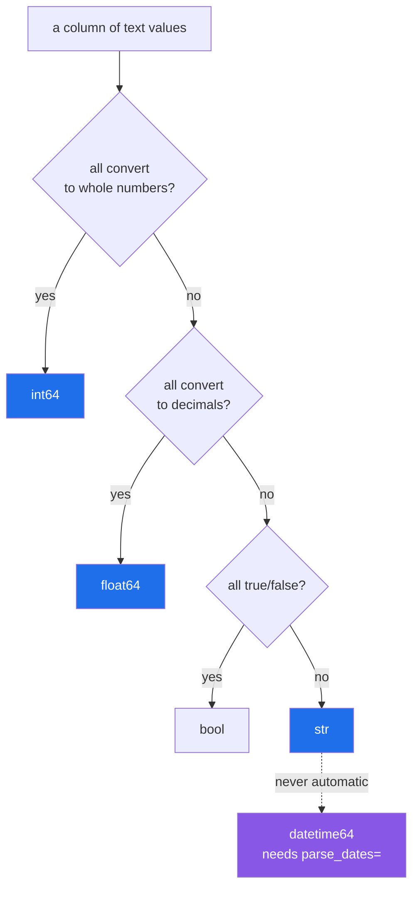

# 1.2 — `read_csv` and what it guessed

## One-line answer

`pd.read_csv(path)` reads every column as text and then **guesses** a dtype for each one by looking at
the values, and the guess is a real decision made on your behalf that you can see, print and disagree
with.

---

## The story

Somebody types the shopping list into the laptop and opens it in the spreadsheet program.

Without being asked, the program has already made up its mind about every column. The item names sit
against the left edge of their cells. The counts and the prices sit against the right edge. The dates
have quietly turned into `30/08/2026`, which is not what anybody typed.

Nobody chose any of that. The program looked at what was in each column and decided: words go left,
numbers go right, and that thing with the hyphens in it is a date so let me show it the way this
computer shows dates.

Most of the time it is right and nobody notices it happened at all. That is precisely what makes it
worth looking at: it is a decision, it was made without asking, and the only way to know what it
decided is to go and look.

---

## The idea in plain language

**Type inference** is a program looking at values and working out what kind of thing they are. It is
what `read_csv` does when you do not tell it otherwise, and it works one column at a time.

The rule pandas follows is simple enough to hold in your head. For each column, it tries to turn every
value into a whole number. If they all convert, the column is `int64`. If not, it tries decimals; if
they all convert, the column is `float64`. If not, it tries the true/false words; if that fails, the
column stays as text and becomes `str` — the dtype pandas 3.0 infers for text
([Day 26, 2.2](../../../day-26-frames-and-copy-on-write/parts/02-the-str-dtype/2.2-str-the-dtype-pandas-3-infers.md)).

Two things about that rule matter more than the rule itself.

**It is all-or-nothing per column.** One value that will not convert sends the whole column back to
text. A column of five hundred thousand counts with a single `n/a` in it is a text column, and every
number in it is a string. That is why [1.6](1.6-na-values-and-the-blank.md) is its own part.

**Dates are not part of it.** A column of `2026-08-30` is not a number and not a boolean, so it lands
in the last bucket and stays text. pandas will not turn text into dates unless you ask, and asking is
`parse_dates=` ([1.5](1.5-parse-dates-and-the-date-that-stayed-text.md)). This surprises people because
spreadsheets do the opposite — they convert dates eagerly and reformat them — so the two tools have
exactly opposite defaults on exactly the same file.

There is one term to define before the code, because it is the thing you will actually use. `dtypes`
on a frame is a Series whose index is the column names and whose values are the dtypes
([Day 26, 1.5](../../../day-26-frames-and-copy-on-write/parts/01-the-two-objects/1.5-reading-a-frame-before-you-touch-it.md)).
Printing it is how you find out what the guess was, and **printing it is the first thing to do after
every read**, before any analysis, every time.

---

## Why Setu needs it

- **[1.3](1.3-when-the-guess-is-wrong.md)** is the case where this guess is wrong in a way that
  destroys data, and you cannot recognise a wrong guess without knowing how the guess is made.
- **[1.4](1.4-dtype-at-read-time.md)** replaces the guess with a declaration, which is the day's
  argument and the plan's named example for `PD-02`.
- **[1.6](1.6-na-values-and-the-blank.md)** is the all-or-nothing rule biting: one blank turns a count
  column into text.
- **Day 34** builds `describe()` into a data-quality report, and the first line of any such report is
  what each column's dtype turned out to be.
- **Day 227**, the ingestion project, reads files from sources that change without telling anyone. A
  column whose inferred dtype changed between Monday and Tuesday is the commonest way that shows up.

---

## The mechanism

Read the file from [1.1](1.1-a-csv-has-no-types-in-it.md) with no arguments at all, and look at what
came back:

```python
import pandas as pd

shop = pd.read_csv("data/shopping.csv")
print(shop)
print()
print(shop.dtypes.to_string())
```

**Line by line:**

- `pd.read_csv("data/shopping.csv")` — one argument, which is the version almost every tutorial shows
  and the version this day argues against. Everything about the resulting frame's types was decided by
  pandas, not by you.
- `print(shop)` first — the values, so you can see they look right.
- `print(shop.dtypes.to_string())` second — **the types, which is the part that is not right.** These
  two prints in this order are the habit worth forming: the values reassure you and the dtypes tell you
  the truth.
- `.to_string()` — prints the Series without the trailing `dtype: object` line that `print(shop.dtypes)`
  would add underneath. That footer is the dtype *of the dtypes Series itself*, and it confuses the
  picture every single time.

```text
    item  need  price  aisle      bought
0   milk     2   1.15      7  2026-08-30
1  bread     1   1.40      3  2026-08-30
2   eggs     6   0.32      7         NaN
3   rice     1   2.05     11  2026-08-24

item          str
need        int64
price     float64
aisle       int64
bought        str
```

Five columns, five guesses, and **three of them are right**.

`item` is `str`, which is correct. `need` is `int64`, correct. `price` is `float64`, correct.

`aisle` is `int64`, and look at the values: `7`, `3`, `7`, `11`. The file said `07`, `03`, `07`, `11`.
The leading zeros are gone, and they are not recoverable — that is [1.3](1.3-when-the-guess-is-wrong.md).

`bought` is `str`, so the dates are text. Sorting that column sorts it alphabetically, and subtracting
one date from another is an error — that is
[1.5](1.5-parse-dates-and-the-date-that-stayed-text.md).

How the decision runs, per column:



The dotted arrow is the one to remember: **there is no path from text to a date without you asking.**

You can watch the all-or-nothing rule directly, by adding one bad value to a good column:

```python
import pandas as pd
from pathlib import Path

Path("data/onebad.csv").write_text(
    "item,need\nmilk,2\nbread,1\neggs,many\nrice,1\n", encoding="utf-8"
)
one_bad = pd.read_csv("data/onebad.csv")
print(one_bad.dtypes.to_string())
print(one_bad["need"].tolist())
```

**Line by line:**

- `eggs,many` — one row out of four where the count is a word. In a real file this is a person typing
  into a spreadsheet, and it happens constantly.
- `one_bad["need"].tolist()` — the values as ordinary Python objects, so you can see what they became
  rather than how they are displayed. Displayed, `2` and `'2'` look identical.

```text
item    str
need    str
['2', '1', 'many', '1']
```

Three good values and one bad one, and **all four are now strings**. `one_bad["need"].sum()` would not
error; it would concatenate them into `'21many1'`, because `+` on strings joins them
([Day 7, 2.2](../../../day-07-strings/parts/02-methods/2.2-split-and-join.md)). That
is the shape of the whole problem: the wrong type does not stop the program, it changes what the
operators mean.

---

## When it breaks

**Doing arithmetic on a column that is secretly text:**

```text
$ uv run python -c "
import pandas as pd
from pathlib import Path
Path('data/onebad.csv').write_text('item,need\nmilk,2\nbread,1\neggs,many\nrice,1\n', encoding='utf-8')
shop = pd.read_csv('data/onebad.csv')
print('sum      :', shop['need'].sum())
print('times two:', (shop['need'] * 2).tolist())
"
```

```text
sum      : 21many1
times two: ['22', '11', 'manymany', '11']
```

**What it means.** No exception anywhere. `sum` on a text column joins the strings end to end, and
multiplying a string by two repeats it, because that is what those operators mean for text
([Day 7, 2.2](../../../day-07-strings/parts/02-methods/2.2-split-and-join.md)).
`21many1` is a plausible-looking value that will travel a long way through a pipeline before anybody
questions it. **This is the day's central failure mode, and it is silence rather than an error.**

**Multiplying a text column by a float, which does error:**

```text
$ uv run python -c "
import pandas as pd
shop = pd.read_csv('data/onebad.csv')
print(shop['need'] * 1.5)
" 2>&1 | tail -2
```

```text
TypeError: Can only string multiply by an integer.
```

**What it means.** The same wrong column, one operator along, and now it does raise — because you can
repeat a string three times but not one and a half times. The message is about string repetition and
mentions no column name, no row and nothing about a CSV, which is why the traceback is confusing the
first time you meet it. It is the same failure Day 26 met from the other direction
([Day 26, 5.1](../../../day-26-frames-and-copy-on-write/parts/05-the-module/5.1-the-shopping-list-module.md)),
and its lesson is the same: the distance between the error and the cause is the problem, not the error.

**Assuming a date column is dates:**

```text
$ uv run python -c "
import pandas as pd
shop = pd.read_csv('data/shopping.csv')
print(shop['bought'].max())
print(shop['bought'].dt.year)
" 2>&1 | tail -3
```

```text
2026-08-30
AttributeError: Can only use .dt accessor with datetimelike values
```

**What it means.** The first line **worked**, and that is the trap. `max()` on a text column is the
alphabetically last string, and because ISO dates sort the same way alphabetically as they do
chronologically, it gave the right answer for the wrong reason. The moment the code asks for something
only a real date can do — `.dt.year` — it fails. A column of `30/08/2026` instead of `2026-08-30` would
have given a wrong answer from `max()` and still no error
([1.5](1.5-parse-dates-and-the-date-that-stayed-text.md)).

---

## In production

**What a professional writes instead of the teaching version.** They print the guess, but they do it as
a function rather than by eye, because by eye does not survive a forty-column file:

```python
import pandas as pd


def read_and_report(path: str, expected: dict[str, str]) -> pd.DataFrame:
    """Read a CSV, then say out loud where the guess disagrees with what was expected."""
    frame = pd.read_csv(path)
    actual = frame.dtypes.astype(str).to_dict()
    surprises = {
        name: (actual[name], want)
        for name, want in expected.items()
        if name in actual and actual[name] != want
    }
    if surprises:
        print(f"{path}: inference disagreed on {len(surprises)} column(s)")
        for name, (got, want) in surprises.items():
            print(f"  {name}: guessed {got}, expected {want}")
    return frame
```

**Line by line:**

- `frame.dtypes.astype(str).to_dict()` — dtypes as **strings** in an ordinary dictionary, because
  comparing dtype objects to strings is the trap Day 26 spent a part on
  ([Day 26, 2.4](../../../day-26-frames-and-copy-on-write/parts/02-the-str-dtype/2.4-dtypes-equals-object-finds-nothing.md)),
  and a dictionary is what you can diff.
- `if name in actual` — guards against a column named in `expected` that is not in the file at all.
  That is a different problem with a different message, and mixing the two into one report makes both
  harder to read.
- It **prints and returns** rather than raising. This is a reporting function used while exploring a
  new file, and the version that raises is `assert_schema`
  ([Day 26, 5.2](../../../day-26-frames-and-copy-on-write/parts/05-the-module/5.2-asserting-the-schema.md)).
  Knowing which of the two you want is the real decision: explore with a report, load with a raise.

**What changes at scale.** Inference is not free and it is not stable. It is **not free** because
pandas reads the column as text and then converts it, so a guessed read does strictly more work than a
declared one — on the 14 MB file used later in this day, `read_csv` with `dtype=` is measurably faster
than without. And it is **not stable**, which matters far more: the guess depends on the values in the
file, so the same code reading Monday's export and Tuesday's export can produce different dtypes. The
mechanism is worse than it sounds, because pandas reads large files in blocks and infers per block,
which is what the `low_memory` warning about mixed types is telling you when you see it. **A pipeline
whose column types are decided by its input data has no schema at all**, and that is the argument for
[1.4](1.4-dtype-at-read-time.md) in one sentence.

**The failure that only appears with real data.** A daily job read a CSV of order identifiers and
joined it to a reference table. It worked for four months. Then one day's file happened to contain only
identifiers made entirely of digits — no letters anywhere — and pandas inferred `int64` instead of
`str`. The join key on one side was now a number and on the other a string, so **the join matched
nothing** — a merge that matches nothing produces an empty frame rather than an error, which is a Day 32
subject and a Day 27 cause. The report went out with no rows in it. Nothing in the code changed; the data changed shape, and the
code had no opinion about shape. One `dtype={"order_id": "str"}` would have prevented it, and it is one
argument.

**The review comment a senior engineer leaves.** *"This `read_csv` has no `dtype=`, so our column types
are being decided by whatever happens to be in today's file. Please declare them. If we genuinely do
not know the schema yet, add a `print(frame.dtypes)` and a ticket, so at least it is a known unknown."*

**The interview question.** *"How does pandas decide a column's dtype when reading a CSV?"* The answer
that shows experience: it reads everything as text and then tries to convert each column, whole
numbers first, then decimals, then booleans, falling back to `str` — all-or-nothing per column, so a
single bad value keeps the entire column as text. Dates are never inferred; you have to pass
`parse_dates=`. And the important part is not the algorithm but the consequence: the guess depends on
the data rather than on your code, so it can change between two runs of the same pipeline without
anybody editing anything. That is why I pass `dtype=` on every read I control, and why the first line
after any read I do not control is `print(frame.dtypes)`.

---

## Check yourself

```bash
uv run python -c "
import pandas as pd
shop = pd.read_csv('data/shopping.csv')
print(shop.dtypes.to_string())
print()
print('aisle in the file :', open('data/shopping.csv').read().splitlines()[1].split(',')[3])
print('aisle in the frame:', shop['aisle'].tolist()[0])
"
```

Two lines that disagree. Say which of the five columns pandas guessed correctly and which two it did
not, and for each wrong one say what was lost.

**Answer out loud, without scrolling up:**

> Describe, in order, the conversions pandas tries on a column before giving up and calling it `str`.
> Then say what happens to a column of four counts when one of the four is the word `many`, and why
> that does not raise an error.

---

**Next:** [1.3 — When the guess is wrong](1.3-when-the-guess-is-wrong.md).
