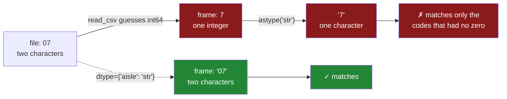

# 1.3 — When the guess is wrong — the aisle that lost its zero

## One-line answer

When pandas guesses `int64` for a column of identifiers, the leading zeros are gone **before your first
line of code runs**, and no amount of converting afterwards brings them back — which is why the fix has
to happen at read time and nowhere else.

---

## The story

The shop's aisles are numbered on signs hanging from the ceiling: `01` through `19`, always two digits,
because that is how the signs were printed.

The flat's list has an aisle against each item, copied off the sign. Milk is in `07`.

Somebody loads the list into a program to sort the shopping into aisle order, and prints it to check.
Milk is in aisle `7`.

It is not wrong, exactly. Aisle 7 is aisle 07; it is the same aisle. So the person shrugs and carries
on, and everything works, until the day the list has to be matched against the shop's own file of aisle
names — and that file says `07`, because it was printed from the same source as the signs. `7` and `07`
are different text, so those items match nothing. The only rows that come through are the ones from
aisles above nine, which never had a zero to lose. Three quarters of the list quietly disappears, and
what is left still looks like a shopping list.

The zero was not decoration. It was part of the name.

---

## The idea in plain language

Some columns of digits are **numbers** and some are **labels that happen to be made of digits**. The
difference is not what they look like; it is what you would do with them.

A number is something you would add up, average or compare in size. The `need` column is a number:
two milk plus one bread is three things.

A label is something you would look up, group by or join on. The `aisle` column is a label. Adding
aisle 07 to aisle 03 gives aisle 10, which is a real aisle and a meaningless answer. **If adding two
values together gives nonsense, the column is not a number.**

Real data is full of these: postcodes, phone numbers, product codes, order identifiers, bank sort
codes, ZIP codes, ISBNs, national insurance numbers, employee IDs. Most of them are digits and none of
them are quantities.

The reason this particular mistake is worth its own part is what happens to the leading zero, and the
key word is **irreversible**. Converting the text `"07"` to the number `7` throws away the zero, and
converting `7` back to text gives `"7"`. The information is not hidden or misfiled — it does not exist
any more. Compare that with the date column, which stayed as text
([1.5](1.5-parse-dates-and-the-date-that-stayed-text.md)): that guess was also wrong, but nothing was
lost, so it can be fixed later. This one cannot.

There is a second, quieter version of the same problem, and it is worth knowing about now because it
bites at scale. A long identifier made only of digits — a fifteen-digit account number, say — becomes
an `int64` fine, but if it is longer than about eighteen digits, or if the column also contains a blank
so pandas falls back to `float64`, the value gets **rounded**. A float can hold about fifteen or sixteen
significant digits, so a nineteen-digit identifier comes back with its last digits changed to zeros. No
error, no warning, and the identifier is now somebody else's.

---

## Why Setu needs it

- **[1.4](1.4-dtype-at-read-time.md)** is the fix, and this part is the argument for it. Without a case
  where the loss is irreversible, `dtype=` looks like tidiness rather than necessity.
- **[3.2](../03-parquet/3.2-the-round-trip-that-keeps-dtypes.md)** is the format where this cannot
  happen, because the file itself says the column is text.
- **[5.3](../05-the-module/5.3-the-round-trip-test.md)** pins this exact behaviour in a test, so it
  cannot come back.
- **Day 32** joins two frames on a key column, and a key that is `int64` on one side and `str` on the
  other matches nothing at all — which is this bug's usual way of announcing itself.
- **Day 34** builds `describe()` into a quality report, and "a numeric column whose values are all
  identifiers" is one of the things such a report exists to notice.

---

## The mechanism

The loss, and the attempt to undo it:

```python
import pandas as pd

guessed = pd.read_csv("data/shopping.csv")
print("dtype in the frame:", guessed["aisle"].dtype)
print("values             :", guessed["aisle"].tolist())
print("converted back     :", guessed["aisle"].astype("str").tolist())
print("in the file        :", open("data/shopping.csv").read().splitlines()[1].split(",")[3])
```

**Line by line:**

- `guessed["aisle"].dtype` — `int64`, decided by inference in [1.2](1.2-read-csv-and-what-it-guessed.md)
  because every value in the column converted to a whole number.
- `.tolist()` rather than printing the Series — the Series display right-aligns the values and shows
  them without quotes either way, so a printed column of numbers and a printed column of digit-strings
  look identical. `tolist()` gives ordinary Python objects, and `7` and `'7'` are visibly different.
- `.astype("str")` — the obvious repair, applied after the read. It is the line most people write when
  they notice the problem, and it is the point of this part that it does not work.
- Reading the raw line from the file — the evidence of what was actually there, so the comparison is
  against the file and not against memory.

```text
dtype in the frame: int64
values             : [7, 3, 7, 11]
converted back     : ['7', '3', '7', '11']
in the file        : 07
```

The last two lines are the whole part. The file says `07`. The best repair available after the read
says `7`. **Those are different strings, and any lookup, join or comparison against the shop's own file
will now fail.**

Where the zero goes:



The solid path loses information at the first arrow and can never get it back. The dotted path is
[1.4](1.4-dtype-at-read-time.md), and it is one argument long.

The consequence, shown against a second table:

```python
import pandas as pd

aisle_names = pd.DataFrame({"aisle": ["03", "07", "11"], "name": ["bakery", "dairy", "dry goods"]})
guessed = pd.read_csv("data/shopping.csv")
repaired = guessed.assign(aisle=lambda df: df["aisle"].astype("str"))
joined = repaired.merge(aisle_names, on="aisle", how="inner")
print("rows in the shopping list:", len(repaired))
print("rows after the join      :", len(joined))
```

**Line by line:**

- `aisle_names` — the shop's own file, with the aisle codes exactly as they are printed on the signs.
  It is built by hand here, which means its `aisle` column is `str` and keeps its zeros
  ([Day 26, 1.4](../../../day-26-frames-and-copy-on-write/parts/01-the-two-objects/1.4-one-dtype-per-column.md)).
- `.assign(aisle=...)` — the repair, applied the correct way for pandas 3.0, returning a new frame
  rather than writing into the old one
  ([Day 26, 3.1](../../../day-26-frames-and-copy-on-write/parts/03-copy-on-write/3.1-every-result-behaves-like-a-copy.md)).
  The repair is written properly and still does not help, which is the point.
- `.merge(..., on="aisle", how="inner")` — an inner join keeps only rows whose key appears on both
  sides. That is Day 32's subject in full; here it is a probe, because a join is the fastest way to find
  out whether two columns actually contain the same values.
- Printing **both** counts rather than the joined frame. A count is what makes the failure visible; the
  joined frame just looks like a small table, and a small table looks fine.

```text
rows in the shopping list: 4
rows after the join      : 1
```

Four rows in, one row out — and **one is far worse than zero**. An empty result is obviously wrong and
somebody investigates it. One row looks like a small table, and small tables look fine.

The row that survived is rice, in aisle `11`. Eleven has no leading zero, so losing the zeros did not
change it and it still matches. Milk, bread and eggs were in `07`, `03` and `07`; those became `'7'`
and `'3'`, which match nothing, so they were dropped. No exception, no warning, no message of any kind.
**The bug is not in the join. The bug happened at read time, the join is where it became visible, and
it hid three quarters of the data behind a result that looks like data.**

---

## When it breaks

**The long identifier that got rounded:**

```text
$ uv run python -c "
import pandas as pd
from pathlib import Path
Path('data/accounts.csv').write_text(
    'account,amount\n' '1234567890123456789,10.5\n' '1234567890123456780,20.0\n',
    encoding='utf-8',
)
f = pd.read_csv('data/accounts.csv')
print(f['account'].dtype)
print(f['account'].tolist())
"
```

```text
int64
[1234567890123456789, 1234567890123456780]
```

**What it means.** Nineteen digits, and `int64` held them, so this one survived. Now add one blank
account number to the same column and watch what a single missing value does:

```text
$ uv run python -c "
import pandas as pd
from pathlib import Path
Path('data/accounts2.csv').write_text(
    'account,amount\n'
    '1234567890123456789,10.5\n'
    ',20.0\n'
    '1234567890123456780,5.0\n',
    encoding='utf-8',
)
f = pd.read_csv('data/accounts2.csv')
print(f['account'].dtype)
print(f['account'].tolist())
"
```

```text
float64
[1.2345678901234568e+18, nan, 1.2345678901234568e+18]
```

**What it means.** One empty cell forced the column to `float64`, because `int64` has no way to say
"missing" ([1.6](1.6-na-values-and-the-blank.md)). A `float64` holds about sixteen significant digits,
so both nineteen-digit account numbers were rounded to the same value — **two different accounts are
now one account**, silently, before you have written a line of analysis. `dtype={"account": "str"}` at
read time is the only thing that prevents it.

**The postcode that became a number:**

```text
$ uv run python -c "
import pandas as pd
from pathlib import Path
Path('data/post.csv').write_text('postcode,count\n01234,3\n02900,7\n', encoding='utf-8')
print(pd.read_csv('data/post.csv')['postcode'].tolist())
"
```

```text
[1234, 2900]
```

**What it means.** The same failure with a different name. There is no error to catch, no warning to
enable and no flag that turns this into a failure, because pandas did not do anything wrong — it was
asked to guess, and digits are a perfectly good reason to guess a number. The only defence is not
asking it to guess.

**The repair that looked like it worked:**

```text
$ uv run python -c "
import pandas as pd
f = pd.read_csv('data/post.csv')
fixed = f.astype({'postcode': 'str'})
print(fixed['postcode'].dtype)
print(fixed['postcode'].tolist())
"
```

```text
str
['1234', '2900']
```

**What it means.** The dtype is now correct and the data is still wrong, which is the worst possible
combination because every check you are likely to write looks at the dtype. `assert_schema` would pass
this frame ([Day 26, 5.2](../../../day-26-frames-and-copy-on-write/parts/05-the-module/5.2-asserting-the-schema.md)),
because the schema says `str` and the column is `str`. **A schema check confirms the shape, not the
history**, and no check placed after the read can catch a value that was destroyed during it. That is
the strongest argument in this section for why the fix belongs at read time.

---

## In production

**What a professional writes instead of the teaching version.** They keep a list of the columns that
are labels, separately from the schema, because that list is the thing that gets forgotten:

```python
ID_COLUMNS: frozenset[str] = frozenset({"aisle", "postcode", "account", "order_id", "sku"})


def read_typed(path: str, schema: dict[str, str]) -> pd.DataFrame:
    """Read a CSV, with every identifier column forced to text whatever the schema says."""
    unguarded = ID_COLUMNS.intersection(schema) - {
        name for name, dtype in schema.items() if dtype == "str"
    }
    if unguarded:
        raise ValueError(f"identifier columns must be str, not: {sorted(unguarded)}")
    return pd.read_csv(path, dtype=schema)
```

**Line by line:**

- `frozenset` — immutable, so nothing can append to the project's list of identifier columns at run
  time ([Day 8, 2.1](../../../day-08-containers/parts/02-sets-and-dicts/2.1-a-set-is-a-hash-table.md)).
  It is a constant, and it is written as one.
- `ID_COLUMNS.intersection(schema)` — a set intersected with a dictionary uses the dictionary's keys,
  so this is "which of the known identifier columns does this schema mention".
- The set difference against the `str` entries — what is left is the identifier columns somebody has
  declared as something other than text. **The check is on the schema, not on the data**, so it fails at
  import time on a bad configuration rather than at three in the morning on a bad file.
- `raise ValueError` with `sorted(unguarded)` — sorted so the message is identical on every run, which
  matters when the message ends up in a test assertion or a log search.

**What changes at scale.** The problem stops being one column and becomes a governance question. A
forty-column file has perhaps eight identifier columns, and the person writing today's loader knows
which eight; the person who adds a column in six months does not. Two things carry that knowledge
forward. The first is naming: a convention where every identifier column ends in `_id` or `_code` makes
the rule mechanical, so the loader can force every column matching the pattern to `str` and nobody has
to remember. The second is **schema-on-read as configuration rather than code** — the dtype dictionary
lives in a file next to the data, versioned, reviewed like anything else, and used by every job that
touches that dataset. The moment two jobs read the same file with two different dtype dictionaries, you
have two different datasets with one name.

**The failure that only appears with real data.** A retailer's product codes were five digits, and
about four per cent of them began with a zero. The daily load read them with inference and got `int64`.
For eleven months this was invisible, because the downstream join was against a table loaded by the
same code with the same bug, so both sides had lost their zeros in the same way and matched perfectly.
Then a new supplier's file arrived, loaded by a different team's job that did pass `dtype=`, and
suddenly four per cent of products silently failed to match. The investigation took a week, because the
symptom was in the new system and **the bug was eleven months old in the old one**. Two wrong things
agreeing is the hardest version of this to find, and it is common precisely because the same wrong
loader is usually used on both sides.

**The review comment a senior engineer leaves.** *"`aisle` is a label, not a quantity — if adding two
of them together is meaningless, it should not be an integer. Please add it to `dtype=` as `str`. And
while you are there, `order_id` has the same problem and will bite us on the join."*

**The interview question.** *"You read a CSV and a column of codes came back as integers. What do you
do?"* The answer that shows experience is that you fix the read, not the frame — `dtype={"code": "str"}`
— because converting afterwards gives you a string column with the leading zeros already gone, which is
worse than the original problem since the dtype now looks right. Then the follow-up: how would you have
noticed? The honest answer is a join that returns fewer rows than expected, which is why comparing row
counts before and after a merge is a habit worth having. And the general rule underneath it: a column
of digits is only a number if adding two of its values together means something.

---

## Check yourself

```bash
uv run python -c "
import pandas as pd
f = pd.read_csv('data/shopping.csv')
print('after read   :', f['aisle'].tolist())
print('after astype :', f['aisle'].astype('str').tolist())
print('in the file  :', [line.split(',')[3] for line in open('data/shopping.csv').read().splitlines()[1:]])
"
```

Three lists, and the third one is the truth. Say which of the first two is closer to it, and whether
either could be turned into it.

**Answer out loud, without scrolling up:**

> Give the one-question test for whether a column of digits is a number or a label. Then say why
> `astype("str")` after the read does not fix the aisle column, and name one check that would pass on
> the repaired frame anyway.

---

**Next:** [1.4 — `dtype=` at read time](1.4-dtype-at-read-time.md).
