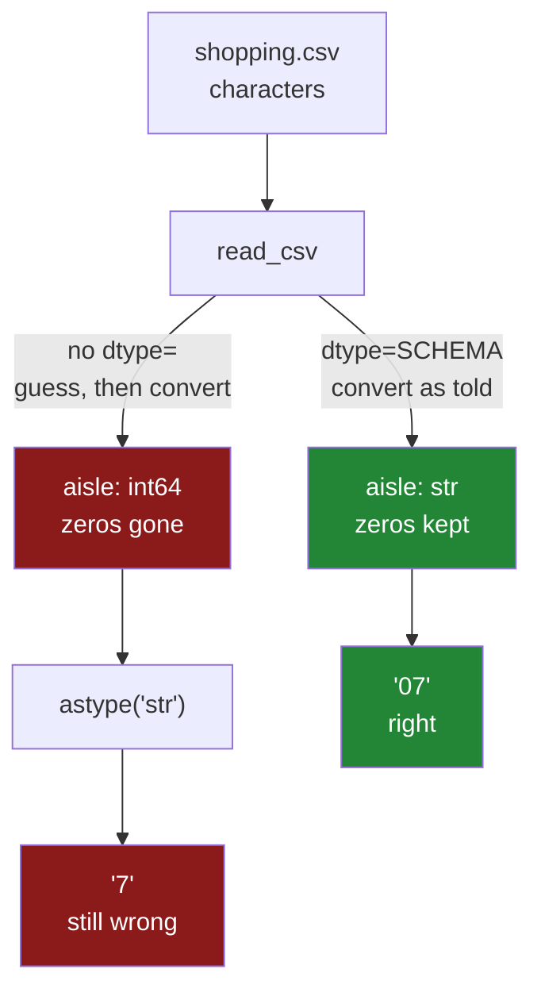

# 1.4 — `dtype=` at read time beats five `astype` calls later

## One-line answer

Passing `dtype=` to `read_csv` tells pandas what each column is **before** it converts anything, which
is the only place the decision can be made without losing information — and it replaces five later
`astype` calls that are each slower, each optional, and none of which can recover what the guess
already threw away.

---

## The story

You are ordering a takeaway for the flat over the phone.

There are two ways to do it. You can say what you want as you go — "one korma, mild, no coriander" —
and the person on the other end writes it down correctly the first time. Or you can say "one korma",
let them write it down, and then ring back three times: once to say mild, once to say no coriander,
and once because they had already sent it and the coriander is in it.

The second way works, mostly, for the things that can still be changed. It does not work for the
coriander.

Saying it up front is not tidier than ringing back. It is the only version where the parts that cannot
be undone come out right.

---

## The idea in plain language

`read_csv` takes an argument called `dtype`, and it is a dictionary from column name to dtype name:

`{"item": "str", "need": "int64", "price": "float64", "aisle": "str"}`

Handing it that dictionary changes what the function does. Instead of reading each column as text and
then guessing ([1.2](1.2-read-csv-and-what-it-guessed.md)), it reads each column and converts it
**directly to the dtype you named**. There is no guessing step, so there is no wrong guess to undo.

The distinction that matters is when the conversion happens. Everything a CSV holds is characters
([1.1](1.1-a-csv-has-no-types-in-it.md)), so somewhere between the file and the frame every value is
turned from characters into a value. That turning point happens exactly once. `dtype=` puts your
decision **at** that point. `astype` puts it **after** it, on values that have already been turned into
something.

For most columns those two are equivalent, which is why the difference is easy to miss. Text that was
guessed as `float64` can be converted back to `str` and you get your digits back — the wrong guess cost
you time and nothing else. But for a column of identifiers, the guess destroyed the leading zeros
([1.3](1.3-when-the-guess-is-wrong.md)), and no conversion afterwards can put them back. **One
irreversible column is enough to make the rule absolute**, because you do not get to know in advance
which columns those are in a file you did not write.

There is one more reason, and it is the reason a reviewer will give. Written as `dtype=`, the types are
**a declaration in one place** — a dictionary you can print, test, version and hand to a different
reader. Written as five `astype` calls, the types are **five statements scattered through a script**,
each of which can be deleted, reordered or forgotten independently, and none of which says what the
file is supposed to contain.

The `dtype` dictionary and the `SCHEMA` constant from Day 26
([Day 26, 5.1](../../../day-26-frames-and-copy-on-write/parts/05-the-module/5.1-the-shopping-list-module.md))
are deliberately the same shape, and that is the point of writing `SCHEMA` as dtype **names** rather
than dtype objects. One dictionary validates the frame and configures the reader.

---

## Why Setu needs it

- **This is the plan's named example for `PD-02`**: *"`dtype=` and `parse_dates=` at read time beat five
  `astype` calls later."* Everything else in this section is the evidence for it.
- **[1.5](1.5-parse-dates-and-the-date-that-stayed-text.md)** is its twin for dates, which need their
  own argument because inference never produces one.
- **[5.1](../05-the-module/5.1-the-loaders-module.md)** builds the loader around exactly this
  dictionary, reusing Day 26's `SCHEMA`.
- **Day 26's `assert_schema`** already compares against dtype names
  ([Day 26, 5.2](../../../day-26-frames-and-copy-on-write/parts/05-the-module/5.2-asserting-the-schema.md)),
  so the same object is the reader's configuration and the checker's expectation.
- **Day 91 onwards**, every model's input schema is a dictionary like this one, and a column whose dtype
  depends on the file rather than on the code is how a training run and a serving run quietly disagree.

---

## The mechanism

The same file, read twice: once guessed, once declared.

```python
import pandas as pd

SCHEMA = {"item": "str", "need": "int64", "price": "float64", "aisle": "str"}

guessed = pd.read_csv("data/shopping.csv")
declared = pd.read_csv("data/shopping.csv", dtype=SCHEMA, parse_dates=["bought"])

print("guessed :", guessed["aisle"].tolist(), guessed["aisle"].dtype)
print("declared:", declared["aisle"].tolist(), declared["aisle"].dtype)
print()
print(declared.dtypes.to_string())
```

**Line by line:**

- `SCHEMA` as a module-level constant, not written inline in the call. It is the file's definition, and
  a definition belongs somewhere it can be imported, printed and compared — which is exactly the
  argument Day 26 made for the same object
  ([Day 26, 5.1](../../../day-26-frames-and-copy-on-write/parts/05-the-module/5.1-the-shopping-list-module.md)).
- The dtypes are **strings**, not types: `"int64"` rather than `int` and `"str"` rather than `str`.
  `read_csv` accepts both, but the string form is what `str(series.dtype)` gives back, so the same
  dictionary can be compared against a frame's dtypes without translating anything
  ([Day 26, 2.4](../../../day-26-frames-and-copy-on-write/parts/02-the-str-dtype/2.4-dtypes-equals-object-finds-nothing.md)).
- `"aisle": "str"` — the only entry that changes an outcome, and the entire reason this part exists.
  Everything else in the dictionary agrees with what inference would have decided anyway.
- `parse_dates=["bought"]` — dates take a **separate argument**, not a `dtype` entry, because they are
  parsed rather than converted. [1.5](1.5-parse-dates-and-the-date-that-stayed-text.md) is that
  argument's own part; it is here because the plan's example names both together.
- **`bought` is not in `SCHEMA`.** Naming a column in both `dtype=` and `parse_dates=` is a conflict,
  and the two arguments are for two different jobs.

```text
guessed : [7, 3, 7, 11] int64
declared: ['07', '03', '07', '11'] str

item                 str
need               int64
price            float64
aisle                str
bought    datetime64[us]
```

The zeros are there. Nothing was repaired, because nothing was ever broken.

Where the two approaches put the decision:



The two arrows out of `read_csv` are the same function call with one argument different. Everything
below them follows from that one argument.

The version this replaces, written out so the comparison is fair:

```python
import pandas as pd

# The five-astype version. Every line of it is avoidable.
late = pd.read_csv("data/shopping.csv")
late = late.astype({"item": "str"})
late = late.astype({"need": "int64"})
late = late.astype({"price": "float64"})
late = late.astype({"aisle": "str"})
late["bought"] = pd.to_datetime(late["bought"])
print(late.dtypes.to_string())
print("aisle:", late["aisle"].tolist())
```

**Line by line:**

- Four of these five lines are **no-ops**: `item` was already `str`, `need` already `int64`, `price`
  already `float64`. They convert a column to the dtype it already has, which costs a pass over the
  data and changes nothing. That is the "five `astype` calls" the plan's example is about, and most of
  them are not fixing anything.
- `late.astype({"aisle": "str"})` — the one line that is trying to fix something, and it is the one
  line that cannot. The zeros went at `read_csv`.
- `late["bought"] = pd.to_datetime(...)` — this one **does** work, because the date text survived the
  read intact. Not every late conversion is doomed; the ones that are, are the ones where the guess
  destroyed something.
- Reassigning `late` on each line rather than passing `inplace=True` — under Copy-on-Write there is no
  `inplace` shortcut worth taking
  ([Day 26, 3.1](../../../day-26-frames-and-copy-on-write/parts/03-copy-on-write/3.1-every-result-behaves-like-a-copy.md)),
  and each of these lines builds a new frame, so the five-call version also allocates five times.

```text
item                 str
need               int64
price            float64
aisle                str
bought    datetime64[us]
```

```text
aisle: ['7', '3', '7', '11']
```

**Every dtype matches the declared version and one column's data does not.** That is the sharpest way
to say why a dtype check alone is not enough: this frame would pass `assert_schema`
([Day 26, 5.2](../../../day-26-frames-and-copy-on-write/parts/05-the-module/5.2-asserting-the-schema.md)),
and it is wrong.

Note the last line: `pd.to_datetime` and `parse_dates=` both give `datetime64[us]` here, so the date
column really is identical in the two frames. That is the honest version of the comparison — the late
approach is not wrong everywhere, it is wrong exactly where the guess destroyed something, and the
whole argument rests on that one column.

---

## When it breaks

**Declaring a dtype the values cannot take:**

```text
$ uv run python -c "
import pandas as pd
from pathlib import Path
Path('data/onebad.csv').write_text('item,need\nmilk,2\nbread,1\neggs,many\nrice,1\n', encoding='utf-8')
pd.read_csv('data/onebad.csv', dtype={'need': 'int64'})
" 2>&1 | tail -2
```

```text
ValueError: invalid literal for int() with base 10: 'many'
```

**What it means. This is the feature, not the failure.** Declaring `int64` turned a silent wrong answer
into a loud stop. Without `dtype=`, the same file gives a text column and `sum()` returns `'21many1'`
([1.2](1.2-read-csv-and-what-it-guessed.md)); with it, the load refuses and names the offending value.
The message could be kinder — it does not say which column or which row — but it says `'many'`, and
that is enough to find it. **A read that raises on bad data is worth more than a read that succeeds on
it.**

**Declaring `int64` on a column with a blank in it:**

```text
$ uv run python -c "
import pandas as pd
from pathlib import Path
Path('data/blank.csv').write_text('item,need\nmilk,2\nbread,\neggs,6\n', encoding='utf-8')
pd.read_csv('data/blank.csv', dtype={'need': 'int64'})
" 2>&1 | tail -2
```

```text
ValueError: Integer column has NA values in column 1
```

**What it means.** A plain `int64` has no way to represent "missing", so a column with one empty cell
cannot be one. The message says *column 1* — a **position**, not the name `need`, which is one of the
less helpful error messages in pandas and worth expecting. The fix depends on what the blank means: `"Int64"` with a
capital I is the nullable integer type that can hold both whole numbers and missing values, and
`"float64"` is the older answer that works and quietly turns your counts into decimals.
[1.6](1.6-na-values-and-the-blank.md) is entirely about that choice.

**Naming a column that is not in the file — which says nothing at all:**

```text
$ uv run python -c "
import pandas as pd
f = pd.read_csv('data/shopping.csv', dtype={'item': 'str', 'quantity': 'int64'})
print(f.dtypes.to_string())
"
```

```text
item          str
need        int64
price     float64
aisle       int64
bought        str
```

**What it means.** There is no `quantity` column in the file, and pandas **ignored the entry in
silence**. No error, no warning, and — this is the damaging part — `aisle` is back to `int64`, because
this schema never mentioned it. A typo in a schema key is therefore invisible: write `"aisel"` instead
of `"aisle"` and the read succeeds, the column is inferred, and the zeros are gone exactly as if you
had passed no schema at all.

**`dtype=` is a set of requests, not a contract.** It protects the columns whose names you spelled
correctly and stays quiet about everything else — both the names it did not recognise and the columns
you did not mention. That is why the schema check has to happen after the read as well
([Day 26, 5.2](../../../day-26-frames-and-copy-on-write/parts/05-the-module/5.2-asserting-the-schema.md)),
and why `usecols=` belongs alongside `dtype=`: together they turn an open read into a closed one.

---

## In production

**What a professional writes instead of the teaching version.** The schema lives outside the code, and
the read and the check are one function:

```python
from pathlib import Path

import pandas as pd

from setu.frames import SchemaError, assert_schema

SCHEMA: dict[str, str] = {"item": "str", "need": "int64", "price": "float64", "aisle": "str"}
DATES: list[str] = ["bought"]


def read_shopping(path: Path) -> pd.DataFrame:
    """Read a shopping-list CSV with every dtype declared, and refuse anything else."""
    frame = pd.read_csv(path, dtype=SCHEMA, parse_dates=DATES, usecols=[*SCHEMA, *DATES])
    return assert_schema(frame, {**SCHEMA, "bought": "datetime64[us]"})
```

**Line by line:**

- `usecols=[*SCHEMA, *DATES]` — read **only** the columns named, in one list built from the two
  declarations. This closes the gap the last failure above opened: a new column appearing upstream is
  now ignored rather than silently inferred, and reading forty columns to use five stops being the
  default ([3.4](../03-parquet/3.4-column-pruning.md)).
- `[*SCHEMA, *DATES]` — unpacking a dictionary into a list gives its keys
  ([Day 8, 1.4](../../../day-08-containers/parts/01-sequences/1.4-unpacking-and-star-rest.md)), so the
  column list is derived from the schema rather than typed out again. Two lists that must agree are two
  lists that will eventually disagree.
- `{**SCHEMA, "bought": "datetime64[us]"}` — the check's expectation is the read's schema **plus** what
  `parse_dates` produced. The date column is not in `dtype=` and must be in the check, or the check
  passes a frame whose date column silently stayed text.
- `assert_schema(frame, ...)` — the read and the guarantee in one function, so no caller can get an
  unchecked frame out of this module. **The read is where the schema is enforced**, and putting the
  check anywhere else means there is a window where a wrong frame exists.

**What changes at scale.** Declaring dtypes is faster as well as safer, and the reason is worth
knowing. Without `dtype=`, pandas reads a large file in blocks and infers per block, then reconciles —
which is what the mixed-types warning is telling you when it appears. With `dtype=` there is no
inference pass and no reconciliation, and the memory is allocated once at the right width instead of
being converted afterwards. The bigger win is one you choose deliberately: a schema lets you declare a
column narrower than the default. `need` as `"int8"` rather than `"int64"` is one byte per row instead
of eight, and a low-cardinality text column as `"category"` stores integer codes instead of strings
(Day 34's subject). On a large file those two choices routinely halve the memory the frame occupies,
and neither is available to a reader that is guessing.

**The failure that only appears with real data.** A pipeline read a partner's daily CSV with a full
`dtype=` dictionary and had run without incident for a year. Then the partner added a column. The read
kept working — an unnamed extra column is inferred, not rejected — and the new column happened to be
called `total`, which collided with a column the pipeline computed later. The computed value
overwrote the partner's, which is fine, and the schema check passed, which is also fine, and nobody
noticed for six weeks. The lesson is that **`dtype=` protects the columns you named and says nothing
about the ones you did not**. `usecols=` is the argument that makes the read closed rather than open,
and Day 26's "unexpected columns" check is what turns the surprise into a sentence.

**The review comment a senior engineer leaves.** *"Good, the dtypes are declared. Two things: please
add `usecols=` so an added column upstream cannot slip in untyped, and move `SCHEMA` next to
`assert_schema`'s expectation so there is one definition rather than two that have to agree."*

**The interview question.** *"Why pass `dtype=` to `read_csv` instead of converting afterwards?"* The
answer that shows experience has three parts and the first one is the only one that really matters.
Some conversions are irreversible: a column of codes guessed as an integer has already lost its leading
zeros, and a long identifier guessed as a float has already been rounded, so no `astype` can put either
back — the decision has to be made at the point of conversion because that point happens once. Second,
it is faster and lighter, because there is no inference pass and the memory is allocated once at the
right width. Third, and this is the one a reviewer cares about, it turns the file's schema into a
single object you can print, test, version and hand to the checker, instead of five statements
scattered through a script that can be reordered or deleted independently. The follow-up is usually
"what about dates?", and the answer is that they are a separate argument, `parse_dates=`, because
inference never produces a date at all.

---

## Check yourself

```bash
uv run python -c "
import pandas as pd
S = {'item': 'str', 'need': 'int64', 'price': 'float64', 'aisle': 'str'}
guessed  = pd.read_csv('data/shopping.csv')
declared = pd.read_csv('data/shopping.csv', dtype=S, parse_dates=['bought'])
print('guessed  aisle:', guessed['aisle'].astype('str').tolist())
print('declared aisle:', declared['aisle'].tolist())
print('same dtypes?  :', guessed.astype(S)[list(S)].dtypes.equals(declared[list(S)].dtypes))
"
```

The dtypes match and the values do not. Say in one sentence why that combination is more dangerous than
a mismatch in both.

**Answer out loud, without scrolling up:**

> Of the five `astype` calls in the late version, how many are fixing anything, and which one cannot
> work? Then say why `bought` belongs in `parse_dates=` and not in `dtype=`.

---

**Next:** [1.5 — `parse_dates` and the date that stayed text](1.5-parse-dates-and-the-date-that-stayed-text.md).
