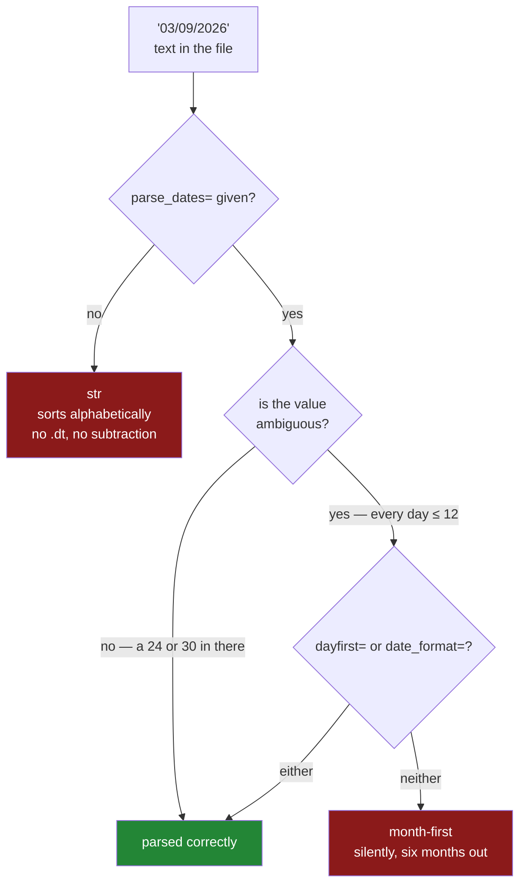

# 1.5 — `parse_dates` and the date that stayed text

## One-line answer

pandas never infers a date, so a date column read without `parse_dates=` is text that sorts
alphabetically and cannot be subtracted — and once you do ask for parsing, `03/09/2026` is either the
third of September or the ninth of March depending on an argument you did not pass.

---

## The story

The flat keeps the shopping list with a note of when each thing was last bought, so nobody buys milk
twice in a week.

Somebody sorts the list by that date to see what is oldest. The order comes out as the third of
September, the twenty-fourth of August, the thirtieth of August. September before August.

They look again, and it is sorted perfectly — alphabetically. `03/09` starts with a zero and a three,
`24/08` starts with a two, `30/08` starts with a three. As a piece of text, `03/09/2026` really does
come first. As a date it is last.

The list did not know these were dates. Nobody had told it, and dates written down look exactly like
any other line of characters.

---

## The idea in plain language

`read_csv` guesses dtypes for every column ([1.2](1.2-read-csv-and-what-it-guessed.md)), and **dates
are not among the things it will guess**. A column of `2026-08-30` is not a whole number and not a
decimal, so it falls through to text and stays there.

That is a deliberate choice by pandas rather than an oversight, and the reason is the second half of
this part: **there is no way to look at a date and know what it means.** `03/09/2026` is the third of
September in most of the world and the ninth of March in the United States. Both readings are valid,
they differ by six months, and nothing in the file says which one applies. A library that guessed here
would be wrong about half the world's data half the time and would never say so.

So dates get their own argument. `parse_dates=["bought"]` says "turn this column into real dates".
What you get back is a column of dtype `datetime64[us]`, and three things become possible that were
not:

- **Ordering** is by time rather than by spelling.
- **Subtraction** works, and gives a duration.
- **The `.dt` accessor** works, so `.dt.year`, `.dt.day_name()` and `.dt.month` all exist. That
  accessor is Day 33's subject in full.

A term, because it decides everything below. **ISO 8601** is the international standard for writing
dates as year-month-day with hyphens — `2026-08-30` — set out in *Data elements and interchange
formats — Information interchange — Representation of dates and times* (ISO 8601-1:2019,
<https://www.iso.org/standard/70907.html>). Its most useful property has nothing to do with
internationalism: because the parts run from largest to smallest, **an ISO date sorted as text comes
out in the same order as sorted as a date**. That is why the flat's file in
[1.1](1.1-a-csv-has-no-types-in-it.md) was in that format and why the sorting story above needed a
different file to go wrong.

Two arguments control the parsing, and knowing which to reach for is most of the skill:

- `dayfirst=True` — "when it is ambiguous, the day comes first". It is a hint, and pandas still looks
  at the values.
- `date_format="%d/%m/%Y"` — "this is the exact shape, do not think about it". It is an instruction,
  and it is faster and safer, because a value in a different shape fails instead of being reinterpreted.

---

## Why Setu needs it

- **This is half of the plan's named example for `PD-02`** — *"`dtype=` and `parse_dates=` at read time
  beat five `astype` calls later"* — and it is the half with the six-month failure mode.
- **[1.7](1.7-to-csv-and-what-it-throws-away.md)** shows that writing back to CSV turns the parsed dates
  into text again, which is the argument for Parquet.
- **[4.2](../04-sql/4.2-read-sql-and-the-connection.md)** needs `parse_dates=` too, because SQLite has
  no real date type and hands dates back as text.
- **Day 33** is `.dt` and resampling in full, and none of it exists on a text column.
- **Day 30** handles missing data, and a date column with one unparseable value is entirely text — the
  same all-or-nothing rule as [1.6](1.6-na-values-and-the-blank.md).

---

## The mechanism

First, the failure: a date column left as text.

```python
import pandas as pd
from pathlib import Path

Path("data/ukdates.csv").write_text(
    "item,bought\nmilk,30/08/2026\nbread,03/09/2026\neggs,24/08/2026\n", encoding="utf-8"
)
as_text = pd.read_csv("data/ukdates.csv")
print("dtype :", as_text["bought"].dtype)
print("max   :", as_text["bought"].max())
print("sorted:", as_text.sort_values("bought")["bought"].tolist())
```

**Line by line:**

- The dates are written `30/08/2026` — day, month, year — which is how they are printed on a receipt in
  most of the world and how a person would write them on the back of an envelope.
- `.max()` on a text column is the **alphabetically last string**, not the latest date. It happens to
  return `30/08/2026` here, which is not the latest date in the file, and it did not complain.
- `.sort_values("bought")` — sorting by a text column sorts by characters, left to right.

```text
dtype : str
max   : 30/08/2026
sorted: ['03/09/2026', '24/08/2026', '30/08/2026']
```

September first, then two days in August. **No error, no warning, and a wrong answer that looks like a
sorted list.** The latest date in the file is the third of September and `max()` said the thirtieth of
August.

Now the ambiguity, which is the more expensive half:

```python
import pandas as pd
from pathlib import Path

Path("data/amb.csv").write_text(
    "item,bought\nmilk,03/09/2026\nbread,05/09/2026\neggs,07/09/2026\n", encoding="utf-8"
)
default = pd.read_csv("data/amb.csv", parse_dates=["bought"])
uk = pd.read_csv("data/amb.csv", parse_dates=["bought"], dayfirst=True)
exact = pd.read_csv("data/amb.csv", parse_dates=["bought"], date_format="%d/%m/%Y")

print("default :", default["bought"].dt.strftime("%d %B %Y").tolist())
print("dayfirst:", uk["bought"].dt.strftime("%d %B %Y").tolist())
print("format= :", exact["bought"].dt.strftime("%d %B %Y").tolist())
```

**Line by line:**

- Every day number in this file is **nine or below**, so every value is genuinely ambiguous. That is
  what makes it dangerous: with a `24` or a `30` in the column, pandas can tell which field is the day
  and does. With none, it cannot, and it picks.
- `.dt.strftime("%d %B %Y")` — the dates spelled out with the month as a word, because `2026-03-09` and
  `2026-09-03` are easy to misread side by side and *March* and *September* are not
  ([Day 7, 3.2](../../../day-07-strings/parts/03-formatting/3.2-the-format-spec.md)).
- `dayfirst=True` — the hint. It tells pandas which way to lean when the values do not settle it.
- `date_format="%d/%m/%Y"` — the instruction. `%d` is the two-digit day, `%m` the two-digit month, `%Y`
  the four-digit year, and the slashes are literal.

```text
default : ['09 March 2026', '09 May 2026', '09 July 2026']
dayfirst: ['03 September 2026', '05 September 2026', '07 September 2026']
format= : ['03 September 2026', '05 September 2026', '07 September 2026']
```

**Three shopping trips in one week became three trips spread over five months.** No error, no warning,
no sign at all. Every downstream calculation — days since last bought, weekly totals, anything with a
window in it — is now wrong in a way no test on the dtype can find, because the dtype is perfectly
correct.

The decision, and where each argument sits in it:



Two ways to be wrong, and the second one only appears on some files — which is worse, because it means
the code passed its tests.

---

## When it breaks

**The warning you get when pandas notices, which is not always:**

```text
$ uv run python -c "
import pandas as pd
pd.read_csv('data/ukdates.csv', parse_dates=['bought'])
" 2>&1 | tail -3
```

```text
UserWarning: Parsing dates in %d/%m/%Y format when dayfirst=False (the default) was specified.
Pass `dayfirst=True` or specify a format to silence this warning.
```

**What it means.** pandas worked out from the values that this column must be day-first — because `30`
and `24` cannot be months — parsed it correctly, and warned you that it had to think about it. **This
warning is the good case.** On the ambiguous file above, where every day is nine or below, there is
nothing to notice and no warning appears. So the presence of this warning tells you something and its
absence tells you nothing at all, which is exactly the wrong way round for a safety net. Passing
`date_format=` is what removes the guesswork rather than the warning.

**The one bad value that turns off parsing entirely:**

```text
$ uv run python -c "
import pandas as pd
from pathlib import Path
Path('data/baddate.csv').write_text('item,bought\nmilk,2026-08-30\nbread,soon\n', encoding='utf-8')
f = pd.read_csv('data/baddate.csv', parse_dates=['bought'])
print(f['bought'].dtype)
print(f['bought'].tolist())
"
```

```text
str
['2026-08-30', 'soon']
```

**What it means.** You asked for dates and got text, **with no error and no warning**. One value that
will not parse makes the whole column unparseable, so pandas leaves it exactly as it found it. Adding
`date_format="%Y-%m-%d"` does not change this — it still comes back as `str`. The consequence is that
`parse_dates=` is a request that can silently fail, so a schema check that asserts the column is
`datetime64[us]` is not optional
([Day 26, 5.2](../../../day-26-frames-and-copy-on-write/parts/05-the-module/5.2-asserting-the-schema.md)).

**Doing date arithmetic on the column that stayed text:**

```text
$ uv run python -c "
import pandas as pd
f = pd.read_csv('data/baddate.csv', parse_dates=['bought'])
print(f['bought'] - pd.Timestamp('2026-08-01'))
" 2>&1 | tail -2
```

```text
TypeError: operation 'sub' not supported for dtype 'str' with object of type <class 'pandas.Timestamp'>
```

**What it means.** This is the good outcome of the previous failure: the silence ends the moment
something asks the column to behave like a date. The message names the column's dtype — `str` — and the
type it was asked to work with, so it is readable, and the fix is upstream rather than here — find the value that would not parse. `pd.to_datetime(col,
errors="coerce")` turns the unparseable values into `NaT` and parses the rest, which is the right answer
when bad values are expected and the wrong one when they are a signal that the file is broken.

---

## In production

**What a professional writes instead of the teaching version.** The format is stated, and the result is
checked:

```python
import pandas as pd

DATE_FORMAT = "%Y-%m-%d"
DATES = ["bought"]


def read_with_dates(path: str, schema: dict[str, str]) -> pd.DataFrame:
    """Read a CSV whose date columns have one known, stated format."""
    frame = pd.read_csv(path, dtype=schema, parse_dates=DATES, date_format=DATE_FORMAT)
    unparsed = [name for name in DATES if not str(frame[name].dtype).startswith("datetime64")]
    if unparsed:
        raise ValueError(f"{path}: date columns did not parse: {unparsed}")
    return frame
```

**Line by line:**

- `DATE_FORMAT` as a constant — the format is a property of the data source, so it belongs beside the
  schema and gets reviewed when the source changes. Written inline in the call, it is a magic string in
  a function body.
- `date_format=` rather than `dayfirst=` — an instruction rather than a hint. With a format given,
  pandas uses one fast path instead of trying to work out the shape, and a value in a different shape
  makes the column fail to parse instead of being reinterpreted as a different date.
- `str(frame[name].dtype).startswith("datetime64")` — `startswith` rather than `==` because the unit is
  part of the dtype name: `datetime64[us]`, `datetime64[ns]`, and `datetime64[ns, UTC]` when a timezone
  is attached. Comparing to a single exact string here breaks the first time the unit changes.
- The explicit `raise` — because `parse_dates=` failing is silent, as the second failure above showed.
  **A request that can silently fail needs a check that it succeeded**, and this is that check.

**What changes at scale.** Two things. Parsing is **expensive**: without `date_format=`, pandas tries
to work out the shape of the values, and on a column of millions that inference costs real seconds. A
stated format switches to a single fast path, and on a large file the difference between a stated and
an unstated format is often larger than the difference between reading the file and not reading it.
Second, and more subtly, **timezones become a decision rather than a detail.** `datetime64[us]` has no
timezone, so two naive timestamps from two systems in two countries compare as if they were in the same
place. In a system where the answer to "which happened first" matters, dates are stored in UTC and
converted only for display, and the parsing step is where that policy is applied or lost.

**The failure that only appears with real data.** A reporting job read a partner's daily file with
`parse_dates=` and no format, for a year, correctly. The partner's dates were day-first and always
contained days above the twelfth somewhere in the file, so pandas always worked it out. Then a public
holiday meant a file arrived covering only the first week of a month — **every day number in it was
below thirteen** — and pandas parsed the whole file month-first. The report showed a year's worth of
activity landing in a single week of a different month. The code had not changed and no test failed,
because every test file happened to contain a day above twelve. The fix was `date_format=` and the
lesson is that **inference is only as reliable as the least representative file you will ever receive**.

**The review comment a senior engineer leaves.** *"`parse_dates` with no `date_format` — this file is
day-first and will be parsed month-first any time a batch happens to contain only days under thirteen.
Please state the format. And add an assertion that the column really is datetime after the read,
because `parse_dates` fails silently."*

**The interview question.** *"You read a CSV and the date column is a string. What happened?"* The
answer is that pandas never infers dates — you have to pass `parse_dates=` — and the interesting half
is why: `03/09/2026` is ambiguous between two conventions that differ by six months, and no library can
resolve that from the file. Then the part that shows you have been bitten: `parse_dates=` can also fail
silently, because one unparseable value leaves the whole column as text with no warning, so a check
that the dtype really is `datetime64` belongs right after the read. And the practical rule I follow is
to pass `date_format=` rather than `dayfirst=`, because a stated format is faster and makes an unexpected
shape fail instead of being reinterpreted.

---

## Check yourself

```bash
uv run python -c "
import pandas as pd
from pathlib import Path
Path('data/amb.csv').write_text(
    'item,bought\nmilk,03/09/2026\nbread,05/09/2026\neggs,07/09/2026\n', encoding='utf-8'
)
for label, kw in [('default', {}), ('dayfirst', {'dayfirst': True})]:
    f = pd.read_csv('data/amb.csv', parse_dates=['bought'], **kw)
    print(label, f['bought'].dt.month_name().tolist())
"
```

Two months, six apart, from one file and one difference in arguments. Say which of the two runs printed
a warning, and why the other one is the more dangerous.

**Answer out loud, without scrolling up:**

> Say why pandas refuses to infer dates when it happily infers integers. Then name the one property of
> ISO 8601 that makes an unparsed ISO date column sort correctly anyway, and say what happens to a date
> column when a single value in it will not parse.

---

**Next:** [1.6 — `na_values` and the blank](1.6-na-values-and-the-blank.md).
