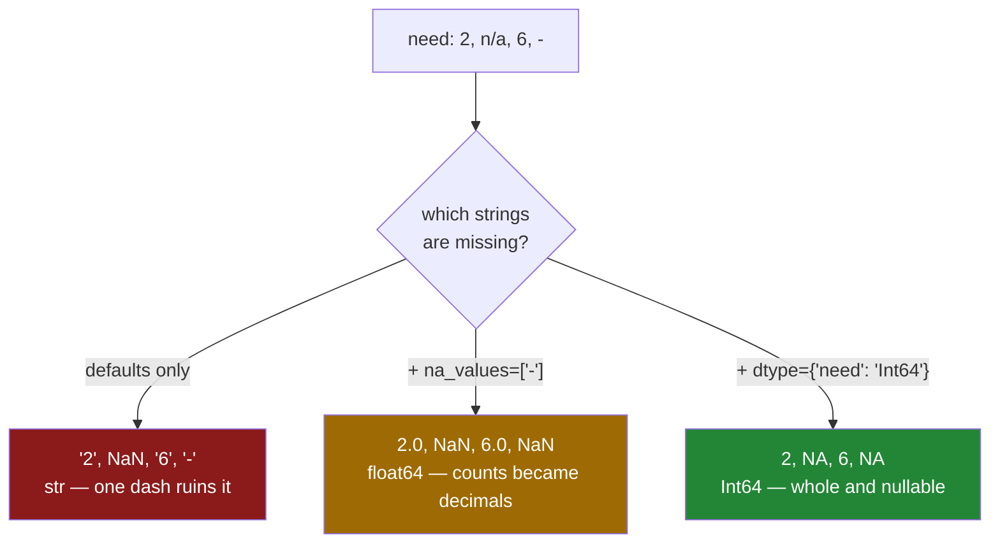

# 1.6 — `na_values` and the blank — what counts as missing

## One-line answer

pandas has a fixed list of nineteen strings it treats as missing when reading a CSV — `NA` and `null`
among them — so a file that spells missing differently keeps its placeholder as a value, and a file
that legitimately contains the text `NA` loses it.

---

## The story

Four people share the shopping list, and it has a column for how many of each thing to get.

One of them, when they do not know, leaves the box empty. Another writes a dash. A third writes
`n/a`. The fourth, who is thorough, writes `unknown`.

Everybody in the flat reads all four the same way: nobody has decided yet. Nobody has ever discussed
it, and it has never caused a problem, because a person looking at the list can tell that a dash and an
empty box mean the same thing.

The first time it causes a problem is the first time somebody adds the column up.

---

## The idea in plain language

A **missing value** is a cell where there is no answer, as distinct from a cell where the answer is
zero. Two milk and no milk are different facts; zero milk and "nobody has checked" are also different
facts, and a column that cannot tell them apart cannot be trusted.

A CSV has exactly one way to say missing that everybody agrees on: **an empty field**, which is two
commas with nothing between them. Everything else — `n/a`, `-`, `NULL`, `unknown`, `?`, `999`, a single
space — is a convention that somebody chose, and different people chose differently.

pandas deals with this by keeping **a fixed list of strings it treats as missing**, and reading it once
is worth more than any explanation:

`''` · `#N/A` · `#N/A N/A` · `#NA` · `-1.#IND` · `-1.#QNAN` · `-NaN` · `-nan` · `1.#IND` · `1.#QNAN` ·
`<NA>` · `N/A` · `NA` · `NULL` · `NaN` · `None` · `n/a` · `nan` · `null`

Anything in that list becomes missing. Anything not in it stays as a value, and there are two arguments
for changing that:

- `na_values=["-", "unknown"]` — **add** to the list, for the placeholders this file happens to use.
- `keep_default_na=False` — **throw the list away**, so only what you name is missing.

The second one exists because the list has entries you may not want. `NA` is on it, and `NA` is also
the country code for Namibia, the abbreviation for North America, and a perfectly ordinary chemical
symbol. A column of country codes read with the defaults comes back with Namibia missing.

Now the consequence, which is why this part sits in the middle of a section about types. A missing
value changes what dtype a column can have. Day 26 showed that a text column's blank is `NaN`
([Day 26, 2.5](../../../day-26-frames-and-copy-on-write/parts/02-the-str-dtype/2.5-the-missing-value-in-a-text-column.md)),
and a numeric column has the same problem in a sharper form: **a plain `int64` has no value that means
missing.** So a column of whole numbers with one blank cannot be `int64`, and pandas quietly makes it
`float64` instead, turning your counts into decimals.

The fix is `"Int64"` with a capital I — the **nullable integer** type, which holds whole numbers *and*
`pd.NA`. Two dtypes, one letter apart, and the difference is whether the column can say "no answer".

---

## Why Setu needs it

- **[1.4](1.4-dtype-at-read-time.md)** cannot declare `int64` on a column with a blank in it, so this
  part is where that failure gets its fix.
- **[1.7](1.7-to-csv-and-what-it-throws-away.md)** writes missing values back out, and what it writes is
  a choice too.
- **[2.4](../02-json/2.4-json-lines.md)** and **[4.2](../04-sql/4.2-read-sql-and-the-connection.md)**
  meet the same question in two other formats, where the answers differ.
- **Day 30** is missing data in full — where the imputer goes and why it belongs inside the pipeline —
  and every technique there assumes the missing values were correctly identified at read time.
- **Day 34** builds `describe()` into a quality report, and "how many missing per column" is its first
  line. That number is only meaningful if the reader agreed with the file about what missing looks like.

---

## The mechanism

A file where four people spelled missing three different ways:

```python
import pandas as pd
from pathlib import Path

Path("data/messy.csv").write_text(
    "item,need,price\nmilk,2,1.15\nbread,n/a,1.40\neggs,6,0.32\nrice,-,2.05\n", encoding="utf-8"
)
default = pd.read_csv("data/messy.csv")
print("values:", default["need"].tolist())
print(default.dtypes.to_string())
```

**Line by line:**

- `bread,n/a` — `n/a` **is** on pandas' default list, so it becomes missing.
- `rice,-` — a single dash is **not** on the list, so it stays as the text `'-'`.
- `.tolist()` rather than printing the column — a displayed `NaN` and a displayed `-` sit in the same
  column and look equally like "no number", and `tolist()` shows that one is a float and the other is a
  string.

```text
values: ['2', nan, '6', '-']
item         str
need         str
price    float64
```

**Look at what happened to the two good values.** `2` and `6` are now the strings `'2'` and `'6'`,
because one unconverted value — the dash — kept the whole column as text
([1.2](1.2-read-csv-and-what-it-guessed.md)). The dash did that, not the `n/a`; the `n/a` became `NaN`
and would have allowed a numeric column.

Naming the dash fixes the dtype and reveals the next problem:

```python
import pandas as pd

named = pd.read_csv("data/messy.csv", na_values=["-"])
print("values:", named["need"].tolist())
print(named.dtypes.to_string())
```

**Line by line:**

- `na_values=["-"]` — **adds** the dash to the default list rather than replacing it, which is why
  `n/a` is still treated as missing here. `na_values` is additive unless `keep_default_na=False` turns
  the defaults off.
- A list rather than a bare string, because `na_values="-"` also works and reads as if it might mean
  something else. A list of one is clearer and extends to a list of four without an edit.

```text
values: [2.0, nan, 6.0, nan]
item         str
need     float64
price    float64
```

The column is numeric now, and **the counts are decimals**. Two milk is `2.0`. Nothing is wrong
arithmetically, but the column no longer says what it is: a count of milk cartons is a whole number,
and a schema that declares `float64` here is documenting the missing values rather than the data.

The nullable integer says both things at once:

```python
import pandas as pd

whole = pd.read_csv("data/messy.csv", na_values=["-"], dtype={"need": "Int64"})
print("values:", whole["need"].tolist())
print(whole.dtypes.to_string())
```

**Line by line:**

- `"Int64"` — capital I. `"int64"` is NumPy's integer, which has no missing value;`"Int64"` is pandas'
  own nullable integer, which stores the numbers alongside a separate record of which cells are absent.
  The two spellings differ by one letter and by whether the column can hold a blank.
- The values print as `2`, `<NA>`, `6`, `<NA>` — whole numbers and pandas' own missing marker, `pd.NA`,
  rather than the float `NaN`
  ([Day 26, 2.5](../../../day-26-frames-and-copy-on-write/parts/02-the-str-dtype/2.5-the-missing-value-in-a-text-column.md)).
- `na_values=["-"]` is still needed. `dtype="Int64"` says what the column can hold; it does not say what
  counts as missing, and a dash is still not a number.

```text
values: [2, <NA>, 6, <NA>]
item         str
need       Int64
price    float64
```

Whole numbers, and two of them absent. That is what the file actually says.

The three routes from the same file:



The middle branch is amber rather than red: it works, and it quietly changes what the column claims to
be.

---

## When it breaks

**Namibia:**

```text
$ uv run python -c "
import pandas as pd
from pathlib import Path
Path('data/countries.csv').write_text('item,origin\nmilk,GB\nbeans,NA\nrice,IN\ntea,NULL\n', encoding='utf-8')
f = pd.read_csv('data/countries.csv')
print('values :', f['origin'].tolist())
print('missing:', f['origin'].isna().sum())
"
```

```text
values : ['GB', nan, 'IN', nan]
missing: 2
```

**What it means.** `NA` is the ISO country code for Namibia and it is on pandas' default missing list,
so every row from Namibia now has no country. `NULL` went the same way. Two real values became missing,
the count of missing values is now wrong, and any later `dropna()` deletes those rows entirely, which is Day 30's
subject and this day's cause.
The fix is to turn the default list off and name only what this file actually uses:

```text
$ uv run python -c "
import pandas as pd
f = pd.read_csv('data/countries.csv', keep_default_na=False, na_values=[''])
print('values :', f['origin'].tolist())
print('missing:', f['origin'].isna().sum())
"
```

```text
values : ['GB', 'NA', 'IN', 'NULL']
missing: 0
```

**`na_values=[""]` is not redundant there.** With `keep_default_na=False` the empty string comes off
the list too, so without naming it, a genuinely empty field would be read as the empty string rather
than as missing — which is a different bug in the other direction.

**Declaring `int64` on a column that has a blank:**

```text
$ uv run python -c "
import pandas as pd
pd.read_csv('data/messy.csv', na_values=['-'], dtype={'need': 'int64'})
" 2>&1 | tail -2
```

```text
ValueError: Integer column has NA values in column 1
```

**What it means.** Lower-case `int64` has no way to represent a missing value, so the read stops. This
is the correct behaviour and the message is unhelpfully positional — *column 1* rather than *need* — so
on a forty-column file you have to count. The two fixes are `"Int64"` if the blanks are legitimate, or
finding out why a required column has blanks in it if they are not. **Which of those two is right is a
question about the data, not about pandas**, and it is the question this argument makes you ask.

**A placeholder that is a number:**

```text
$ uv run python -c "
import pandas as pd
from pathlib import Path
Path('data/sentinel.csv').write_text('item,need\nmilk,2\nbread,-999\neggs,6\n', encoding='utf-8')
f = pd.read_csv('data/sentinel.csv')
print('dtype:', f['need'].dtype)
print('sum  :', f['need'].sum())
print('mean :', f['need'].mean())
"
```

```text
dtype: int64
sum  : -991
mean : -330.3333333333333
```

**What it means.** `-999` is a very common way for older systems to write "missing" in a numeric
column, and pandas has no way to know. The column reads as a clean `int64`, every check passes, and the
mean is a number that is not merely wrong but impossible — the flat does not need minus three hundred
and thirty of anything. `na_values=[-999]` is the fix, and the reason this one is worth fearing is that
it produces **no missing values at all**, so a quality report saying "zero missing" is confirming the
bug rather than catching it.

---

## In production

**What a professional writes instead of the teaching version.** The missing convention is declared per
source, next to the schema, and the defaults are turned off:

```python
import pandas as pd

SCHEMA: dict[str, str] = {"item": "str", "need": "Int64", "price": "float64", "aisle": "str"}
MISSING: list[str] = ["", "-", "n/a", "unknown"]


def read_shopping(path: str) -> pd.DataFrame:
    """Read a shopping-list CSV where 'missing' means exactly the four things we agreed on."""
    frame = pd.read_csv(path, dtype=SCHEMA, keep_default_na=False, na_values=MISSING)
    empty = frame.columns[frame.isna().all()].tolist()
    if empty:
        raise ValueError(f"{path}: these columns are entirely missing: {empty}")
    return frame
```

**Line by line:**

- `keep_default_na=False` with an explicit `MISSING` list — **the whole point.** The nineteen defaults
  are a guess about your data made by a library that has not seen it, and one of them is a country. The
  explicit list is short, reviewable, and cannot silently swallow a real value.
- `""` first in `MISSING` — the empty field, which has to be named once the defaults are off. Putting it
  first is a reminder of that.
- `"need": "Int64"` in the schema — nullable, because this source is known to have blanks. If it were
  not supposed to have them, `"int64"` would be right and the read failing would be the feature.
- `frame.columns[frame.isna().all()]` — a boolean mask over the columns, selecting the ones where every
  value is missing. That pattern is Day 28's subject
  ([Day 28, 2.2](../../../day-28-selection-and-alignment/parts/02-masks/2.2-selecting-with-a-mask.md));
  here it catches the specific disaster of a column whose placeholder was misidentified, which turns
  the entire column into `NaN` and is otherwise invisible until something downstream divides by it.

**What changes at scale.** The question stops being "what does this file use" and becomes "what did
each of the forty sources use". Two habits carry it. **The missing convention is metadata about the
source**, so it lives with the schema and the file path in one configuration object rather than in the
call; when a partner changes their export from `-` to `NULL`, exactly one line changes. And
**per-column missing lists become necessary**, because `na_values` accepts a dictionary as well as a
list — `{"need": ["-", "-999"], "origin": [""]}` — which is how you say that `NA` means missing in one
column and Namibia in another. On a wide file that is not a nicety; it is the only correct answer.

**The failure that only appears with real data.** A loader read a survey export with the defaults. One
of the questions was multiple choice and one of its options was literally `None` — as in "none of the
above" — which is on pandas' default list. Every respondent who chose "none of the above" was recorded
as not having answered. The count of missing answers went up, which somebody noticed, and the count of
"none of the above" went to zero, which nobody noticed because the option was rare and its absence
looked like a finding. It was reported as a result for four months. The lesson is that **the default
missing list contains words that are also real answers**, and `keep_default_na=False` is the only
defence that does not depend on somebody thinking of the specific word in advance.

**The review comment a senior engineer leaves.** *"This uses the default NA list, which includes `NA`
and `None`. Our `origin` column has real `NA` values in it for Namibia. Please set
`keep_default_na=False` and name what this file actually uses, and add a check that no column comes
back entirely missing."*

**The interview question.** *"How does pandas decide a value is missing when reading a CSV?"* The
answer that shows experience: there is a fixed list of about nineteen strings — the empty field, `NA`,
`n/a`, `NULL`, `None`, `NaN` and some Excel spellings — and anything on it becomes `NaN` regardless of
the column. `na_values=` adds to that list and `keep_default_na=False` replaces it, and on real data I
use the second, because the defaults include `NA`, which is Namibia, and `None`, which is a real
answer in survey data. Then the type consequence, which is the part interviewers are usually fishing
for: a plain `int64` has no missing value, so one blank turns a count column into `float64` — `Int64`
with a capital I is the nullable integer that keeps the counts whole. And the failure I would actually
check for is the numeric sentinel, `-999` or `9999`, which pandas cannot possibly detect and which
produces a clean column and an impossible mean.

---

## Check yourself

```bash
uv run python -c "
import pandas as pd
for kw in [{}, {'na_values': ['-']}, {'na_values': ['-'], 'dtype': {'need': 'Int64'}}]:
    f = pd.read_csv('data/messy.csv', **kw)
    print(f\"{str(f['need'].dtype):>8}  {f['need'].tolist()}\")
"
```

Three dtypes from one file. Say which of the three describes the data honestly, and what the middle one
is documenting instead.

**Answer out loud, without scrolling up:**

> Name three strings on pandas' default missing list that could be real values in real data. Then say
> why a column of whole numbers with one blank cannot be `int64`, and which one letter fixes it.

---

**Next:** [1.7 — `to_csv`, and what it throws away](1.7-to-csv-and-what-it-throws-away.md).
