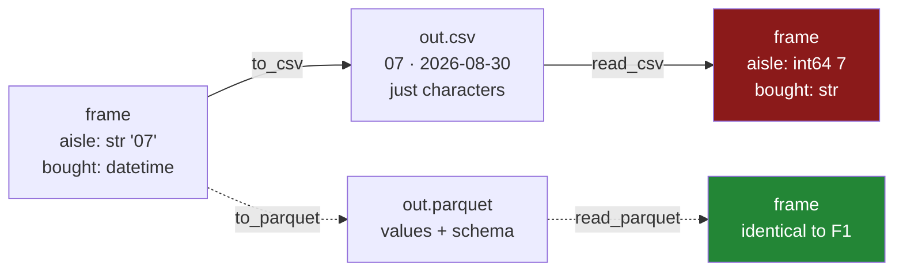

# 1.7 — `to_csv`, and what it throws away

## One-line answer

Writing a frame to CSV turns every value back into characters, so all the typing work of this section
is discarded at the door — and `to_csv`'s default of writing the index adds a nameless extra column
that grows by one on every round trip.

---

## The story

Somebody in the flat spends an evening tidying the shopping list properly. Aisles written the way the
signs write them, `07` not `7`. Dates in one format. Counts as whole numbers, prices to two places.

Then they print it out and pin it to the fridge, and throw away the file.

Next week somebody types it back into the laptop from the printout. The aisles come back as `7` and
`3`, because that is what a person types when they read `07` and are not thinking about it. The dates
come back in whatever format that person uses. All of last week's tidying is gone, and the person who
did it is annoyed for reasons the person retyping it does not understand.

Nothing was lost in the printing. Everything was lost in the fact that a printout holds the values and
not the decisions.

---

## The idea in plain language

`frame.to_csv(path)` writes the frame out as a CSV. Because a CSV is text and only text
([1.1](1.1-a-csv-has-no-types-in-it.md)), everything that is not a value is discarded on the way out:

- **Every dtype.** `aisle` was `str` holding `'07'`; the file gets the characters `07`, and the next
  reader guesses again.
- **The index's identity.** A frame's index is a real thing with labels and possibly a name
  ([Day 26, 1.2](../../../day-26-frames-and-copy-on-write/parts/01-the-two-objects/1.2-the-index-is-not-a-row-number.md)),
  and a CSV has no place to put it, so it becomes a column or it disappears.
- **Any distinction between kinds of missing.** `NaN` and `pd.NA` are different objects
  ([Day 26, 2.5](../../../day-26-frames-and-copy-on-write/parts/02-the-str-dtype/2.5-the-missing-value-in-a-text-column.md));
  in the file they are both an empty field.

So a CSV write followed by a CSV read is **not a round trip**. A round trip is an operation where
writing and then reading gives you back what you started with, and `to_csv` plus `read_csv` does not.
That is the single sentence this part exists to establish, because it is the argument for
[3.2](../03-parquet/3.2-the-round-trip-that-keeps-dtypes.md).

There is one argument on `to_csv` that causes more confusion than everything else combined, and its
default is the wrong way round for almost every use. `index=True` is the default, which means **the
index is written as an extra first column with no name.** When that file is read back, a column with no
name gets called `Unnamed: 0`. Write it out again and you get `Unnamed: 0` *and* `Unnamed: 0.1`. The
file grows a column every time it goes round, and it is one of the most common things wrong with CSVs
found in the wild.

`index=False` is the right default for any file that is going to be read by something else. The
exception is a frame whose index carries real information — a date index, a named identifier — and then
`index=True` with `index_label=` gives the column a name so the next read does not have to invent one.

---

## Why Setu needs it

- **[3.2](../03-parquet/3.2-the-round-trip-that-keeps-dtypes.md)** is the format where the round trip
  does work, and this part is the comparison that makes it worth having.
- **[5.3](../05-the-module/5.3-the-round-trip-test.md)** pins both behaviours in tests: Parquet comes
  back identical, CSV does not.
- **[2.3](../02-json/2.3-orient-six-ways-to-write-a-frame.md)** meets the same question in JSON, where
  one of the six answers does preserve dtypes.
- **Day 35** benchmarks pandas against Polars and DuckDB, and every one of those comparisons starts by
  choosing a file format.
- **Day 227**, the ingestion project, writes intermediate files between stages. A pipeline whose stages
  hand each other CSVs re-infers types at every boundary, which is both slow and a place for the schema
  to drift.

---

## The mechanism

Write out the properly typed frame and read it back with no arguments, exactly as the next person
would:

```python
import pandas as pd

SCHEMA = {"item": "str", "need": "int64", "price": "float64", "aisle": "str"}
typed = pd.read_csv("data/shopping.csv", dtype=SCHEMA, parse_dates=["bought"])
print("before:")
print(typed.dtypes.to_string())

typed.to_csv("data/out.csv", index=False)
back = pd.read_csv("data/out.csv")
print("\nafter a csv round trip:")
print(back.dtypes.to_string())
print("\naisle:", back["aisle"].tolist())
```

**Line by line:**

- `typed` is the correct frame from [1.4](1.4-dtype-at-read-time.md) — declared dtypes, parsed dates,
  aisle codes with their zeros.
- `index=False` — already the good version. The default is `True` and the next code block shows what
  that does.
- `pd.read_csv("data/out.csv")` with **no arguments**, deliberately. This is not a straw man; it is what
  the next person, or the next script, will write when they find a CSV. The question this block asks is
  what the file itself can tell them, and the answer is nothing.

```text
before:
item                 str
need               int64
price            float64
aisle                str
bought    datetime64[us]

after a csv round trip:
item          str
need        int64
price     float64
aisle       int64
bought        str

aisle: [7, 3, 7, 11]
```

**Two columns went backwards.** `aisle` is `int64` again with its zeros gone, and `bought` is text
again. Everything section 1 taught was undone by one write, because the file has nowhere to record it.

Look at the file itself and you can see why:

```text
item,need,price,aisle,bought
milk,2,1.15,07,2026-08-30
bread,1,1.4,03,2026-08-30
eggs,6,0.32,07,
rice,1,2.05,11,2026-08-24
```

**`07` is in the file.** The information reached the disk perfectly well; it is the *reading* that lost
it, because the file cannot say "these characters are text". Note also that `1.40` came out as `1.4` —
a float has no memory of how many decimal places you typed, so the two-place formatting was never in
the frame to write.

Now the index, with the default:

```python
import pandas as pd

typed.to_csv("data/out_idx.csv")
print(open("data/out_idx.csv").read())
first = pd.read_csv("data/out_idx.csv")
print("columns:", first.columns.tolist())

first.to_csv("data/spiral.csv")
second = pd.read_csv("data/spiral.csv")
print("columns:", second.columns.tolist())
```

**Line by line:**

- `to_csv` with **no `index=` argument at all** — this is the default, and it writes the index.
- Printing the raw file first, because the extra column is invisible in a displayed frame — a frame's
  index is displayed at the left too, so `Unnamed: 0` and the real index look almost the same on screen.
- The second write-and-read is the whole point: it shows the growth is not a one-off.

```text
,item,need,price,aisle,bought
0,milk,2,1.15,07,2026-08-30
1,bread,1,1.4,03,2026-08-30
2,eggs,6,0.32,07,
3,rice,1,2.05,11,2026-08-24
```

```text
columns: ['Unnamed: 0', 'item', 'need', 'price', 'aisle', 'bought']
columns: ['Unnamed: 0.1', 'Unnamed: 0', 'item', 'need', 'price', 'aisle', 'bought']
```

The first line of the file starts with a comma, because the index column has no name. On the way back
in, a nameless column becomes `Unnamed: 0`; that name is real, so the next write keeps it and adds
another nameless one, which comes back as `Unnamed: 0.1`. **Three more round trips and the file has
five columns of row numbers in it.**

What survives each hop:



The solid path is this part. The dotted path is [3.2](../03-parquet/3.2-the-round-trip-that-keeps-dtypes.md),
and the only difference between them is whether the file has room for the schema.

---

## When it breaks

**The column that had to be quoted:**

```text
$ uv run python -c "
import pandas as pd
f = pd.DataFrame({'item': ['milk'], 'note': ['the blue one, semi-skimmed']})
f.to_csv('data/quoted.csv', index=False)
print(open('data/quoted.csv').read())
print(pd.read_csv('data/quoted.csv')['note'].tolist())
"
```

```text
item,note
milk,"the blue one, semi-skimmed"

['the blue one, semi-skimmed']
```

**What it means.** This one works, and it is here because it is the thing `to_csv` does well.
The comma inside the value would have broken the file ([1.1](1.1-a-csv-has-no-types-in-it.md)), so
`to_csv` wrapped the field in double quotes, and `read_csv` unwrapped it. **Use the library's writer
rather than joining strings with commas yourself**, because quoting, escaping the quotes inside quoted
fields, and the newline handling are all details it already gets right.

**The float that grew a tail:**

```text
$ uv run python -c "
import pandas as pd
f = pd.DataFrame({'price': [1.15, 2.0 / 3]})
f.to_csv('data/floats.csv', index=False)
print(open('data/floats.csv').read())
"
```

```text
price
1.15
0.6666666666666666
```

**What it means.** `to_csv` writes floats with enough digits to reproduce the exact binary value, which
is correct and is not what anybody wants in a file another person will read. `float_format="%.2f"` is
the argument that fixes it, and it is a **display** decision: rounding on the way out means the file no
longer holds what the frame held, which is fine for a report and wrong for an intermediate file. The
distinction between "a file for a person" and "a file for the next stage" is the one to make before
choosing.

**The write that went somewhere unexpected:**

```text
$ uv run python -c "
import pandas as pd
pd.DataFrame({'a': [1]}).to_csv('data/nope/out.csv')
" 2>&1 | tail -2
```

```text
OSError: Cannot save file into a non-existent directory: 'data/nope'
```

**What it means.** `to_csv` creates the file but **not** the folders above it, and this is one of the
clearer error messages in pandas — it names the directory. `path.parent.mkdir(parents=True,
exist_ok=True)` before the write is the fix
([Day 16, 1.4](../../../day-16-files-and-context-managers/parts/01-the-path/1.4-exists-mkdir-and-the-race.md)).
It matters more than it looks, because a write that fails halfway through a long pipeline has already
done all the expensive work.

**The encoding that differed by machine:**

```text
$ uv run python -c "
import locale
import pandas as pd
print('platform default encoding:', locale.getpreferredencoding(False))
pd.DataFrame({'item': ['café']}).to_csv('data/enc.csv', index=False)
print(open('data/enc.csv', 'rb').read())
"
```

```text
platform default encoding: cp1252
b'item\r\ncaf\xc3\xa9\r\n'
```

**What it means.** The platform's preferred encoding on this machine is `cp1252`, and **pandas wrote
UTF-8 anyway** — `c3 a9` is the UTF-8 spelling of `é` — because `to_csv` defaults to `utf-8` rather
than to the platform. That is the good news. The bad news is the `\r\n`: the line endings *did* follow
the platform. So one file property is portable and another is not, which is exactly the kind of
inconsistency that is worth knowing rather than assuming. `lineterminator="\n"` pins the second one,
and passing `encoding="utf-8"` explicitly costs nothing and documents the first.

---

## In production

**What a professional writes instead of the teaching version.** A CSV is written for people, and the
call says so:

```python
from pathlib import Path

import pandas as pd


def write_report(frame: pd.DataFrame, path: Path) -> Path:
    """Write a CSV meant for a person to open. Not for another program to read back."""
    path.parent.mkdir(parents=True, exist_ok=True)
    frame.to_csv(
        path,
        index=False,
        encoding="utf-8",
        lineterminator="\n",
        float_format="%.2f",
        date_format="%Y-%m-%d",
    )
    return path
```

**Line by line:**

- The docstring's second sentence is the load-bearing one. **A CSV write is a decision to stop being
  typed**, and saying so in the docstring is what stops the next person using this function to pass
  data between two stages of a pipeline.
- `index=False` — stated rather than relied upon, because the default is the other way and the cost of
  getting it wrong compounds on every round trip.
- `encoding="utf-8"` — already the default, written anyway. It costs one line and removes a question
  that otherwise gets asked once a year when a file with an accent in it goes somewhere else.
- `lineterminator="\n"` — the one that is **not** the same everywhere. Without it a file written on
  Windows has `\r\n` line endings, which shows up as a spurious change in every line of a `git diff`
  and as a trailing `\r` in the last column of anything that splits on `\n` naively.
- `float_format="%.2f"` — two decimal places, because this is money and a person is reading it. On a
  file meant for a machine this line would be a bug, since it changes the values.
- `date_format="%Y-%m-%d"` — ISO, so the file sorts correctly as text in whatever the reader opens it
  with ([1.5](1.5-parse-dates-and-the-date-that-stayed-text.md)).

**What changes at scale.** The argument stops being about arguments and becomes about **where CSV
belongs in the system**. The rule most teams converge on is: CSV at the edges, a typed format in the
middle. A file arriving from a partner is a CSV because that is what partners send; a report going to a
person is a CSV because that is what opens in a spreadsheet; and every file passed from one stage of
your own pipeline to the next is Parquet, because those files are read by programs that should not be
guessing ([3.1](../03-parquet/3.1-columns-on-disk-with-types.md)). The size difference matters too — on
the five-hundred-thousand-row list used later in this day, the CSV is 13.5 MB and the Parquet is 1.6 MB
([3.3](../03-parquet/3.3-the-size-and-the-speed-measured.md)) — but the schema is the real reason.

**The failure that only appears with real data.** A team's nightly job wrote its output with
`to_csv(path)` and the next stage read it with `read_csv(path)`. It ran for two years, and the
`Unnamed: 0` column was quietly accumulating: three per file by the end, because the file went through
three stages. Nobody noticed, because every stage selected the columns it needed by name and the extra
ones were ignored. What eventually broke it was a `SELECT *`-style load into a warehouse that took every
column, hit a column-count limit, and failed. Two years of unnoticed growth surfaced as an error in a
completely unrelated system. **`index=False` is one argument, and its absence is invisible until it is
not.**

**The review comment a senior engineer leaves.** *"`to_csv` with no `index=False` — this will add an
`Unnamed: 0` on the next read, and another on the one after. Also, if this file is being read back by
our own code rather than by a person, it should be Parquet: we are throwing away the dtypes we spent
the top of this function declaring."*

**The interview question.** *"Is writing to CSV and reading it back a round trip?"* No, and the answer
should say what specifically is lost: every dtype, because the file is characters and the next reader
re-infers; the index, unless you write it as a column and name it; and any distinction between kinds of
missing value. The practical consequences I have actually hit are a column of codes losing its leading
zeros on the way back in, and `index=True` — which is the default — adding an `Unnamed: 0` column that
grows by one on every round trip. So I use `index=False` on every write, and for files that my own code
reads back I use Parquet, which stores the schema alongside the data and does round-trip exactly.

---

## Check yourself

```bash
uv run python -c "
import pandas as pd
S = {'item': 'str', 'need': 'int64', 'price': 'float64', 'aisle': 'str'}
typed = pd.read_csv('data/shopping.csv', dtype=S, parse_dates=['bought'])
typed.to_csv('data/rt.csv')
once = pd.read_csv('data/rt.csv')
once.to_csv('data/rt2.csv')
twice = pd.read_csv('data/rt2.csv')
print('start :', typed.columns.tolist())
print('once  :', once.columns.tolist())
print('twice :', twice.columns.tolist())
print('aisle :', twice['aisle'].tolist())
"
```

Two round trips, two extra columns, and the aisle codes are gone. Say which single argument would have
prevented the first problem and which format would have prevented both.

**Answer out loud, without scrolling up:**

> Name the three things a CSV write throws away. Then say what `Unnamed: 0.1` is, and why the value
> `07` being present in the written file does not save the aisle column.

---

**Next:** [2.1 — Nested by nature](../02-json/2.1-nested-by-nature.md).
