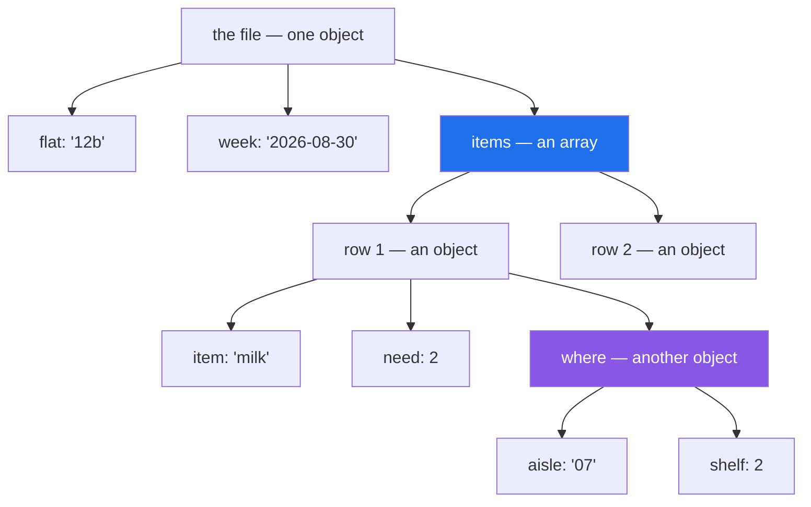

# 2.1 — Nested by nature — why JSON is not a table

## One-line answer

JSON can hold a value inside a value inside a value, which is exactly what a table cannot do, so
`read_json` on a real API response gives you a frame with dictionaries sitting in its cells rather than
the flat table you wanted.

---

## The story

The flat's shopping list starts to grow extra notes.

Milk is not just "milk, 2, £1.15" any more. Somebody has written next to it which aisle it is in and
which shelf, because the shop moved things around and nobody could find it. Bread has the same. So does
everything else.

On the back of an envelope this is easy. You write the item on one line, and underneath it, indented a
bit, you write *aisle 07, shelf 2*. Anybody can read it.

The moment somebody tries to type it into a spreadsheet, it stops being easy. A spreadsheet has rows
and columns and each cell holds one thing. "Aisle 07, shelf 2" is two things. So you either make two
more columns, or you squash them into one cell as text and pull them apart again every time you need
them.

The envelope could hold a note inside a line. The grid cannot.

---

## The idea in plain language

**JSON** — JavaScript Object Notation — is a text format for data, defined by *The JavaScript Object
Notation (JSON) Data Interchange Format* (RFC 8259, 2017,
<https://www.rfc-editor.org/rfc/rfc8259>). It has six kinds of thing in it: strings, numbers,
`true`/`false`, `null`, **arrays** (an ordered list, in square brackets) and **objects** (a set of
name-to-value pairs, in curly brackets). Day 16 met the format when writing files
([Day 16, 2.5](../../../day-16-files-and-context-managers/parts/02-reading-and-writing/2.5-jsonl.md)).

The important word is the last two. An array's items can themselves be arrays or objects. An object's
values can themselves be arrays or objects. There is no limit, so JSON describes a **tree**: a shape
where things contain other things.

A table is not a tree. A table is a **rectangle**: some number of rows, some number of columns, and
exactly one value where a row and a column meet. Day 26 said this precisely — a frame is a set of
columns, each one dtype, sharing an index
([Day 26, 1.3](../../../day-26-frames-and-copy-on-write/parts/01-the-two-objects/1.3-a-table-of-columns.md)).

So there is a **shape mismatch** between the format and the destination, and every part in this section
is about a way of resolving it. A CSV had a type problem — the values were right and their kinds were
unknown ([1.1](../01-the-csv/1.1-a-csv-has-no-types-in-it.md)). JSON has the opposite: the types are in
the file, because `2` without quotes is a number and `"2"` with them is a string, but the **shape** is
wrong.

This matters because JSON is what an API gives you, and an API response almost always has two levels:
some information about the response itself — when it was made, which page this is, how many results
there are — wrapped around the list of things you actually asked for. The rows you want are one field
deep inside an object, and `pd.read_json` on the whole thing does not find them.

---

## Why Setu needs it

- **[2.2](2.2-json-normalize.md)** is the tool that flattens a tree into a rectangle, and it only makes
  sense once you can see that the two shapes are different.
- **[2.3](2.3-orient-six-ways-to-write-a-frame.md)** is the reverse problem: a rectangle can be written
  as a tree in six different ways, and they are not interchangeable.
- **[5.1](../05-the-module/5.1-the-loaders-module.md)** has a `from_json` that does this flattening, and
  it is three lines longer than `from_csv` for exactly this reason.
- **Day 227**, the ingestion project, reads API responses, and every one of them has this shape.
- **Day 229 onwards**, every tool an agent calls returns JSON, and turning that into something you can
  count is this operation.

---

## The mechanism

The flat's list, written the way an API would send it:

```json
{
  "flat": "12b",
  "week": "2026-08-30",
  "items": [
    {"item": "milk",  "need": 2, "price": 1.15, "where": {"aisle": "07", "shelf": 2}},
    {"item": "bread", "need": 1, "price": 1.40, "where": {"aisle": "03", "shelf": 1}},
    {"item": "eggs",  "need": 6, "price": 0.32, "where": {"aisle": "07", "shelf": 4}},
    {"item": "rice",  "need": 1, "price": 2.05, "where": {"aisle": "11", "shelf": 3}}
  ]
}
```

**Line by line:**

- The outermost `{ }` is an **object**, so the whole file is one thing with three named parts, not a
  list of rows.
- `"flat"` and `"week"` are **metadata**: facts about the whole list rather than about any one item.
  They appear once, and a table has nowhere to put a value that appears once.
- `"items"` is an **array of objects**, and this is the part that is actually the table. Each object is
  a row and its keys are the column names.
- `"where"` is an **object inside a row**, which is the shape a table cannot hold. Its `aisle` and
  `shelf` want to be two more columns.
- `"aisle": "07"` — **in quotes.** JSON can say this is text, which a CSV could not
  ([1.3](../01-the-csv/1.3-when-the-guess-is-wrong.md)). The leading zero is safe here, and that is a
  real advantage of the format.
- `"need": 2` — no quotes, so it is a number. The types are in the file.

The shape, drawn:



The blue node is where the table lives. The purple node is the part that has to be flattened before it
can be a column.

Now hand the whole file to pandas and see what it makes of it:

```python
import pandas as pd

straight = pd.read_json("data/shopping.json")
print(straight)
print()
print(straight.dtypes.to_string())
```

**Line by line:**

- `pd.read_json(path)` — the obvious call, and the one everybody tries first. It reads the file and
  makes a frame out of the top-level object, which is not where the rows are.
- Printing the dtypes as well as the values, because the values look nearly plausible and the dtypes
  say what actually happened.

```text
  flat        week                                              items
0  12b  2026-08-30  {'item': 'milk', 'need': 2, 'price': 1.15, 'wh...
1  12b  2026-08-30  {'item': 'bread', 'need': 1, 'price': 1.4, 'wh...
2  12b  2026-08-30  {'item': 'eggs', 'need': 6, 'price': 0.32, 'wh...
3  12b  2026-08-30  {'item': 'rice', 'need': 1, 'price': 2.05, 'wh...

flat        str
week        str
items    object
```

Four rows, which is right, and **three columns, which is wrong**. `flat` and `week` have been repeated
down every row, and the entire shopping list is stuffed into one column called `items` whose dtype is
`object` — the dtype that means "arbitrary Python objects", each cell holding a whole dictionary
([Day 26, 2.1](../../../day-26-frames-and-copy-on-write/parts/02-the-str-dtype/2.1-text-used-to-be-object.md)).

Nothing here is usable. `straight["items"].sum()` is meaningless, there is no `need` column to add up,
and the aisle is two levels down inside a cell.

---

## When it breaks

**Trying to work with the column of dictionaries:**

```text
$ uv run python -c "
import pandas as pd
f = pd.read_json('data/shopping.json')
print(f['items'].str.len().tolist())
print(f['items'].sum())
" 2>&1 | tail -3
```

```text
[4, 4, 4, 4]
TypeError: unsupported operand type(s) for +: 'dict' and 'dict'
```

**What it means.** The first line worked and told you nothing useful: `.str.len()` on a column of
dictionaries gives the number of **keys** in each one, which is four, four times. It is a plausible
number produced by an accident. The second line raises, because `sum` on a column of `object` dtype
tries to add the values together and dictionaries do not add. **An `object` column is a column pandas
has given up on**, and the error messages you get from one are always about Python types rather than
about your data.

**Reaching into the nested value with a string method:**

```text
$ uv run python -c "
import pandas as pd
f = pd.read_json('data/shopping.json')
print(f['items'].str['item'].tolist())
"
```

```text
['milk', 'bread', 'eggs', 'rice']
```

**What it means.** This one **works**, and it is a trap worth naming. The `.str` accessor on an
`object` column falls back to plain Python indexing, so `.str['item']` pulls the value out of each
dictionary. It is convenient, it is undocumented-looking, and it will get you through an afternoon —
and it is a per-row Python call, so on a million rows it is thousands of times slower than the proper
flattening in [2.2](2.2-json-normalize.md), and it produces one column per call. Use it in a notebook;
do not put it in a loader.

**The array that was not where you expected:**

```text
$ uv run python -c "
import pandas as pd
from pathlib import Path
Path('data/one.json').write_text('{\"item\": \"milk\", \"need\": 2}', encoding='utf-8')
pd.read_json('data/one.json')
" 2>&1 | tail -2
```

```text
ValueError: If using all scalar values, you must pass an index
```

**What it means.** A JSON object whose values are all single values — one item rather than a list of
them — has no rows in it at all, so pandas cannot tell how long the frame should be. The message comes
from the `DataFrame` constructor rather than from the JSON reader, which is why it mentions an index and
not a file. It is the commonest thing to hit when an API returns a single record instead of a list, and
`pd.json_normalize(raw)` handles it where `read_json` does not.

---

## In production

**What a professional writes instead of the teaching version.** They do not use `read_json` at all for
an API response. They load the JSON with the standard library and pick the part they want:

```python
import json
from pathlib import Path

import pandas as pd


def load_items(path: Path) -> pd.DataFrame:
    """Read the shopping-list JSON and return only the rows, flattened."""
    raw = json.loads(path.read_text(encoding="utf-8"))
    if "items" not in raw:
        raise ValueError(f"{path}: no 'items' key; keys are {sorted(raw)}")
    return pd.json_normalize(raw, record_path="items", meta=["flat", "week"])
```

**Line by line:**

- `json.loads(path.read_text(...))` rather than `pd.read_json` — **the two steps are separated on
  purpose.** Parsing the file and shaping the data are different jobs, and doing them separately means
  you can look at `raw` when something is wrong. `read_json` does both and gives you no way in.
- `encoding="utf-8"` — JSON is required by RFC 8259 to be UTF-8 when exchanged between systems, so this
  is not a guess, it is the specification.
- `if "items" not in raw` — the check that turns "why is my frame three columns" into a sentence naming
  the keys that are actually there. When an API changes its envelope, this is the line that tells you.
- `sorted(raw)` in the message — a dictionary's keys, sorted so the message is the same on every run.
- `pd.json_normalize(..., record_path=..., meta=...)` — the proper flattening, which is
  [2.2](2.2-json-normalize.md).

**What changes at scale.** Three things. **The file may not fit**: JSON has to be parsed as a whole
because the closing bracket is at the end, so a 2 GB response cannot be loaded the way a CSV can be read
in chunks — which is the entire reason JSON Lines exists
([2.4](2.4-json-lines.md)). **The shape may vary between records**: JSON does not require every object
in an array to have the same keys, so a million-record response can have a field on some rows and not
others, and the flattening produces a column that is missing for most of them. And **parsing is slow**
— a large JSON file takes several times longer to read than the same data as Parquet, because every
value is being interpreted from text. The pattern that follows is to convert once at ingest and never
read the JSON again ([3.1](../03-parquet/3.1-columns-on-disk-with-types.md)).

**The failure that only appears with real data.** An ingestion job read a paginated API. Every response
was `{"page": 1, "total": 4820, "results": [...]}`, and the loader did `pd.read_json(text)` and then
took the `results` column. It worked, in the sense that it produced a frame, and the frame had one row
per page with a list of results in each cell. Somebody then wrote `len(frame)` to count records, got
`97`, and reported that the API had returned ninety-seven records. It had returned four thousand eight
hundred and twenty, in ninety-seven pages. **The count was of the wrong dimension**, and nothing about
it looked wrong, because ninety-seven is a perfectly ordinary number of records. The general lesson is
that a shape mismatch does not usually produce an error; it produces a frame of the wrong shape whose
row count is still an integer.

**The review comment a senior engineer leaves.** *"`pd.read_json` on an API response gives us the
envelope, not the records. Please parse with `json.loads` and use `json_normalize` with an explicit
`record_path`, and raise if the key we expect is not there — when they version the API, that raise is
how we will find out."*

**The interview question.** *"You called an API, got JSON, and `pd.read_json` gave you a column full of
dictionaries. What happened?"* The answer that shows experience: JSON is a tree and a DataFrame is a
rectangle, and the records you want are usually one level down inside a response envelope that also
carries paging and metadata. `read_json` made a frame out of the top-level object, so the metadata got
repeated down every row and the list of records became one `object` column. The fix is to parse with
`json.loads` and flatten the record list with `json_normalize`, giving it a `record_path` for where the
rows live and `meta` for the envelope fields you want to keep. And the thing I check afterwards is the
row count, because the failure mode here is a frame of the wrong shape rather than an exception.

---

## Check yourself

```bash
uv run python -c "
import json
import pandas as pd
raw = json.loads(open('data/shopping.json').read())
print('top-level keys :', sorted(raw))
print('type of items  :', type(raw['items']).__name__)
print('type of a row  :', type(raw['items'][0]).__name__)
print('type of where  :', type(raw['items'][0]['where']).__name__)
f = pd.read_json('data/shopping.json')
print('frame columns  :', f.columns.tolist())
"
```

Four types, three of which are containers. Say which of the four is the table, and which one cannot be a
column without being changed first.

**Answer out loud, without scrolling up:**

> Say what a tree can do that a rectangle cannot, in one sentence and without using either word. Then
> say what `object` dtype means when it shows up in `dtypes` after a `read_json`, and why the `07` in
> the JSON file is safer than the `07` in the CSV.

---

**Next:** [2.2 — `json_normalize`](2.2-json-normalize.md).
