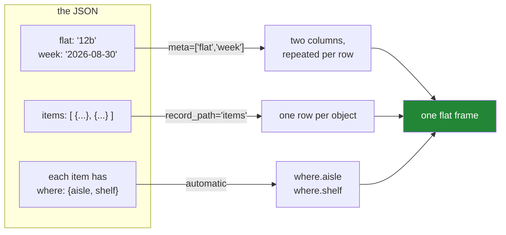

# 2.2 — `json_normalize` — flattening the tree into a rectangle

## One-line answer

`pd.json_normalize` turns a list of nested objects into a flat frame by making each nested key its own
column named `parent.child`, and its two other arguments — `record_path=` for where the rows are and
`meta=` for the envelope fields to carry down — are what make it work on a real API response.

---

## The story

The flat's list has grown its extra notes: each item now has an aisle and a shelf written underneath it.

Somebody finally types it into the spreadsheet, and the way they do it is obvious once you watch. They
do not try to fit "aisle 07, shelf 2" into one cell. They make two new columns at the right-hand end,
head them *where — aisle* and *where — shelf*, and put one number in each.

The indented note becomes two columns whose names remember where they came from. Nothing is lost, and
the grid is still a grid.

That is the whole operation, and it has a name.

---

## The idea in plain language

**Flattening** is turning nested data into a table by making a column for every leaf of the tree, named
after the path that reaches it. The note that lived under `where` becomes the columns `where.aisle` and
`where.shelf`, and the dot in the name is the path.

`pd.json_normalize` does this, and it takes three arguments worth knowing by name.

**The data itself** — a list of objects, one per row. If your rows are already at the top level, this is
the only argument you need.

**`record_path=`** — where the rows are, when they are not at the top level. On the flat's file the rows
are under `"items"`, so `record_path="items"` says "go in there, and each object you find is a row". For
a deeper nesting it takes a list of keys to follow.

**`meta=`** — which of the surrounding fields to keep, repeated on every row. `meta=["flat", "week"]`
takes the two facts about the whole list and puts them on all four rows. This is a real decision rather
than a formality: it turns something that was said once into something said four times, which is
exactly what a rectangle requires and exactly what makes tables larger than trees.

Two smaller arguments come up often enough to name. `sep="_"` changes the joining character in the
generated names, from `where.aisle` to `where_aisle`, which matters because a dot in a column name
means you cannot write `frame.where.aisle` and have it mean anything sensible. And `max_level=0` stops
the flattening after the top level, leaving `where` as a column of dictionaries, which is occasionally
what you want and is mostly a way to see what the argument does.

The thing to understand about the result is what happens when the shape is **ragged** — when one record
has a nested key and another does not. JSON permits this and a table does not, so the missing one
becomes `NaN`. That is the correct answer and it is worth knowing it is happening, because a column that
is mostly `NaN` after a flattening usually means the records were not all the same kind of thing.

---

## Why Setu needs it

- **[2.1](2.1-nested-by-nature.md)** established the shape mismatch; this is the operation that resolves
  it, and it is the reason section 2 exists.
- **[5.1](../05-the-module/5.1-the-loaders-module.md)**'s `from_json` is built on exactly this call.
- **[3.1](../03-parquet/3.1-columns-on-disk-with-types.md)** is where the flattened frame is usually
  written, because reading a large JSON file twice is a waste.
- **Day 227**, the ingestion project, turns paginated API responses into tables, and this is the line
  that does it.
- **Day 229 onwards**, an agent's tool results come back as JSON and have to become countable rows
  before anything can be measured about them.

---

## The mechanism

Start with just the rows, ignoring the envelope:

```python
import json
import pandas as pd
from pathlib import Path

raw = json.loads(Path("data/shopping.json").read_text(encoding="utf-8"))
items = pd.json_normalize(raw["items"])
print(items)
print()
print(items.dtypes.to_string())
```

**Line by line:**

- `json.loads(...)` first, so `raw` is an ordinary Python dictionary and you can look at it. Everything
  below works on that dictionary rather than on the file, which means the shaping can be tested without
  a file at all.
- `raw["items"]` — reaching into the envelope by hand. This is the simplest form: you already know where
  the rows are, so you pass just them, and `record_path=` is not needed.
- `pd.json_normalize(...)` rather than `pd.DataFrame(...)` — `DataFrame` on the same list also produces
  four rows, but it leaves `where` as a column of dictionaries. `json_normalize` is the one that goes
  inside.

```text
    item  need  price where.aisle  where.shelf
0   milk     2   1.15          07            2
1  bread     1   1.40          03            1
2   eggs     6   0.32          07            4
3   rice     1   2.05          11            3

item               str
need             int64
price          float64
where.aisle        str
where.shelf      int64
```

Five columns from three, and **`where.aisle` is `str` holding `'07'`.** Compare that with the CSV, which
lost the zero with no way to get it back ([1.3](../01-the-csv/1.3-when-the-guess-is-wrong.md)). JSON
said the value was a string and pandas believed it, so no `dtype=` argument was needed. That is the one
place JSON is straightforwardly better than CSV.

Now the whole file, envelope and all:

```python
import json
import pandas as pd
from pathlib import Path

raw = json.loads(Path("data/shopping.json").read_text(encoding="utf-8"))
full = pd.json_normalize(raw, record_path="items", meta=["flat", "week"])
print(full)
```

**Line by line:**

- `pd.json_normalize(raw, ...)` — the **whole** object this time, not `raw["items"]`. The function is
  told where to look rather than being handed the answer.
- `record_path="items"` — the key holding the array of rows. A string for one level; a list like
  `["response", "items"]` when the rows are two levels down.
- `meta=["flat", "week"]` — the envelope fields to keep. Each one becomes a column with the same value
  on every row, which is how a fact about the whole file becomes a fact about each row.
- The order of the columns in the output: the record fields first, then the meta fields on the end. That
  is `json_normalize`'s convention and it is worth knowing, because code that relies on column
  **position** will be surprised by it ([Day 28, 1.1](../../../day-28-selection-and-alignment/parts/01-label-and-position/1.1-two-ways-to-say-that-row.md)).

```text
    item  need  price where.aisle  where.shelf flat        week
0   milk     2   1.15          07            2  12b  2026-08-30
1  bread     1   1.40          03            1  12b  2026-08-30
2   eggs     6   0.32          07            4  12b  2026-08-30
3   rice     1   2.05          11            3  12b  2026-08-30
```

`12b` and `2026-08-30` appear four times each. **That repetition is the price of the rectangle**, and it
is why a table of a million records with a five-field envelope carries five million redundant values.
Parquet's compression makes that nearly free ([3.3](../03-parquet/3.3-the-size-and-the-speed-measured.md)),
which is a large part of why the pair — normalise then write Parquet — is the standard ingestion shape.

What the arguments do, laid out against the file:



Three sources, three arguments, one rectangle.

The naming argument, because a dot in a column name has consequences:

```python
import json
import pandas as pd
from pathlib import Path

raw = json.loads(Path("data/shopping.json").read_text(encoding="utf-8"))
print("default sep:", pd.json_normalize(raw["items"]).columns.tolist())
print("sep='_'    :", pd.json_normalize(raw["items"], sep="_").columns.tolist())
print("max_level=0:", pd.json_normalize(raw["items"], max_level=0).columns.tolist())
```

**Line by line:**

- `sep="_"` — the character joining the path segments. The default dot is readable and it means
  `frame.where.aisle` is not valid attribute access, so every reference to that column has to be
  `frame["where.aisle"]`. On a wide frame with three levels of nesting, underscores are usually kinder.
- `max_level=0` — flatten nothing below the top level. `where` comes back as a column of dictionaries,
  which is the `object` dtype from [2.1](2.1-nested-by-nature.md). Useful when a nested field is
  genuinely a blob you intend to store rather than query.

```text
default sep: ['item', 'need', 'price', 'where.aisle', 'where.shelf']
sep='_'    : ['item', 'need', 'price', 'where_aisle', 'where_shelf']
max_level=0: ['item', 'need', 'price', 'where']
```

---

## When it breaks

**A record that does not have the nested key:**

```text
$ uv run python -c "
import pandas as pd
rows = [
    {'item': 'milk', 'need': 2, 'where': {'aisle': '07'}},
    {'item': 'bread', 'need': 1},
]
n = pd.json_normalize(rows)
print(n)
print(n.dtypes.to_string())
"
```

```text
    item  need where.aisle
0   milk     2          07
1  bread     1         NaN
```

```text
item             str
need           int64
where.aisle      str
```

**What it means.** JSON does not require every object in an array to have the same keys, and this is one
of the real differences between a tree and a rectangle. `json_normalize` did the only thing it could:
made the column, and put `NaN` where the key was absent. **No warning.** On two rows that is obvious; on
two hundred thousand rows from an API whose optional fields you have not read the documentation for, a
column that is ninety-eight per cent `NaN` is the only sign that the records were not all the same
shape, and you have to go looking for it.

**A `meta` field that is not there:**

```text
$ uv run python -c "
import json
import pandas as pd
raw = json.loads(open('data/shopping.json').read())
pd.json_normalize(raw, record_path='items', meta=['flat', 'nope'])
" 2>&1 | tail -2
```

```text
KeyError: "Key 'nope' not found. To replace missing values of 'nope' with np.nan, pass in errors='ignore'"
```

**What it means.** One of the more helpful error messages in pandas: it names the missing key **and**
the argument that would make it tolerable. The judgement is which you want. `errors="ignore"` is right
when the field is genuinely optional in the source; it is wrong when the field disappearing means the
API changed, because then it converts a loud failure into a column of `NaN` that nobody looks at. **The
default is strict, and leaving it strict is usually correct.**

**A `record_path` pointing at something that is not a list:**

```text
$ uv run python -c "
import json
import pandas as pd
raw = json.loads(open('data/shopping.json').read())
pd.json_normalize(raw, record_path='flat')
" 2>&1 | tail -2
```

```text
TypeError: Path must contain list or null, but got str at 'flat'
```

**What it means.** `record_path` has to name an array, because each of its elements becomes a row.
`"flat"` holds a single string, so there are no rows in it. The message names the offending key and its
type, which is enough to fix it. The commonest cause is a nesting level being wrong — the rows are under
`response.items` and the code said `items`.

**Using `DataFrame` where `json_normalize` was needed:**

```text
$ uv run python -c "
import json
import pandas as pd
raw = json.loads(open('data/shopping.json').read())
f = pd.DataFrame(raw['items'])
print(f.dtypes.to_string())
print(f['where'].tolist()[0])
"
```

```text
item        str
need      int64
price   float64
where    object
{'aisle': '07', 'shelf': 2}
```

**What it means.** `pd.DataFrame` on a list of dictionaries makes one column per top-level key and stops
there, so `where` is an `object` column of dictionaries — the frame is four-fifths flattened and looks
finished. This is the trap, because the frame prints acceptably and only fails later when something
tries to group by aisle. **`DataFrame` flattens one level; `json_normalize` flattens all of them**, and
that is the whole difference between the two calls.

---

## In production

**What a professional writes instead of the teaching version.** The paths are constants, the shape is
checked, and the ragged columns are reported:

```python
import json
from pathlib import Path

import pandas as pd

RECORD_PATH = "items"
META = ["flat", "week"]
RENAMES = {"where.aisle": "aisle", "where.shelf": "shelf"}


def load_items(path: Path, *, ragged_threshold: float = 0.5) -> pd.DataFrame:
    """Flatten the shopping-list JSON, and complain about columns that are mostly absent."""
    raw = json.loads(path.read_text(encoding="utf-8"))
    frame = pd.json_normalize(raw, record_path=RECORD_PATH, meta=META).rename(columns=RENAMES)
    ragged = frame.columns[frame.isna().mean() > ragged_threshold].tolist()
    if ragged:
        print(f"{path}: mostly-absent columns, check the record shape: {ragged}")
    return frame
```

**Line by line:**

- `RECORD_PATH` and `META` as constants — they describe the **source's envelope**, which is a fact about
  the API rather than about this function. When the API adds a version wrapper, one line changes.
- `.rename(columns=RENAMES)` — the generated `where.aisle` becomes `aisle`, so the rest of the codebase
  never sees a dot in a column name and the schema matches the CSV loader's
  ([1.4](../01-the-csv/1.4-dtype-at-read-time.md)). **Two loaders for the same data should produce
  identically named columns**, or every downstream function needs to know which one ran.
- `frame.isna().mean()` — the fraction missing per column, because `isna()` gives booleans and the mean
  of booleans is a proportion
  ([Day 23, 2.1](../../../day-23-ufuncs-and-statistics/parts/02-statistics/2.1-a-reduction-turns-many-into-one.md)).
- `> ragged_threshold` and a **print rather than a raise** — a mostly-empty column is a smell, not
  necessarily a fault. Some optional fields genuinely are rare. Printing puts it in the log where
  somebody will see it without stopping a load that may be perfectly fine.
- `*` before `ragged_threshold` — keyword-only, because `load_items(path, 0.5)` at a call site says
  nothing ([Day 10, 1.5](../../../day-10-functions/parts/01-the-signature/1.5-keyword-only-and-positional-only.md)).

**What changes at scale.** `json_normalize` is **Python-level code**, not the vectorised C that most of
pandas is: it walks every record and every nested key one at a time. On a few thousand records that is
invisible; on several million it is minutes, and it is the slowest thing in an ingestion pipeline by a
wide margin. Two responses. The first is to normalise **once**, at ingest, and write Parquet
([3.2](../03-parquet/3.2-the-round-trip-that-keeps-dtypes.md)) so that nothing ever parses that JSON
again. The second is to stop flattening everything: `max_level=` limits the depth, and a deeply nested
blob that nobody queries is better stored as a single text column than exploded into two hundred
columns that are `NaN` for most rows. The column count matters — a frame with two thousand columns is
slow in ways that have nothing to do with its row count.

**The failure that only appears with real data.** A loader flattened an API's product records and had
run happily for months. Then the supplier began sending an optional `promotions` array on about two per
cent of products, and each element of that array was itself an object. `json_normalize` cannot flatten
an array of objects into columns — there is no fixed number of them — so it left `promotions` as an
`object` column of lists, and the frame was written to Parquet. The Parquet write **succeeded**, because
Arrow can store a list of structs, and the next stage's schema check passed because it only looked at
the columns it cared about. What broke, three weeks later, was a downstream consumer that could not read
a nested column. **The lesson is that `json_normalize` flattens nested objects and not nested arrays**:
an array inside a record needs either its own `record_path` and a second frame, or an explicit decision
to keep it as text.

**The review comment a senior engineer leaves.** *"This flattens with the default `sep`, so we get
`where.aisle` with a dot in it and every downstream reference has to use bracket notation. Please rename
to match the CSV loader's column names — the two loaders should be interchangeable. And `meta` should
raise rather than `errors='ignore'`: if `week` vanishes we want to know that day, not in the quarterly
report."*

**The interview question.** *"How do you turn a nested JSON API response into a DataFrame?"*
`pd.json_normalize`, with `record_path=` naming where the list of records lives inside the response
envelope and `meta=` naming the envelope fields to carry down onto every row. Nested objects become
columns named by their path, `parent.child`, and I usually rename those so no column name has a dot in
it. Two things I check afterwards: the row count, because getting the `record_path` wrong gives you a
frame of the wrong shape rather than an error; and the proportion of missing values per column, because
JSON records are not required to have the same keys and a ragged source shows up as a column that is
almost entirely `NaN`. And the limitation worth knowing is that it flattens nested **objects**, not
nested **arrays** — an array inside a record either needs its own normalisation into a second table or
has to be kept as text.

---

## Check yourself

```bash
uv run python -c "
import json
import pandas as pd
raw = json.loads(open('data/shopping.json').read())
a = pd.DataFrame(raw['items'])
b = pd.json_normalize(raw['items'])
c = pd.json_normalize(raw, record_path='items', meta=['flat', 'week'])
print('DataFrame     :', a.columns.tolist())
print('json_normalize:', b.columns.tolist())
print('with meta     :', c.columns.tolist())
print('aisle dtype   :', b['where.aisle'].dtype, b['where.aisle'].tolist())
"
```

Three calls, three column lists. Say what each extra column cost, and why the aisle codes kept their
zeros without a `dtype=` argument anywhere.

**Answer out loud, without scrolling up:**

> Say what `record_path=` and `meta=` each do, in one sentence apiece. Then say what happens to a column
> when one record in the array does not have that key, and what `json_normalize` does with a nested
> **array** as opposed to a nested object.

---

**Next:** [2.3 — `orient` — six ways to write a frame](2.3-orient-six-ways-to-write-a-frame.md).
