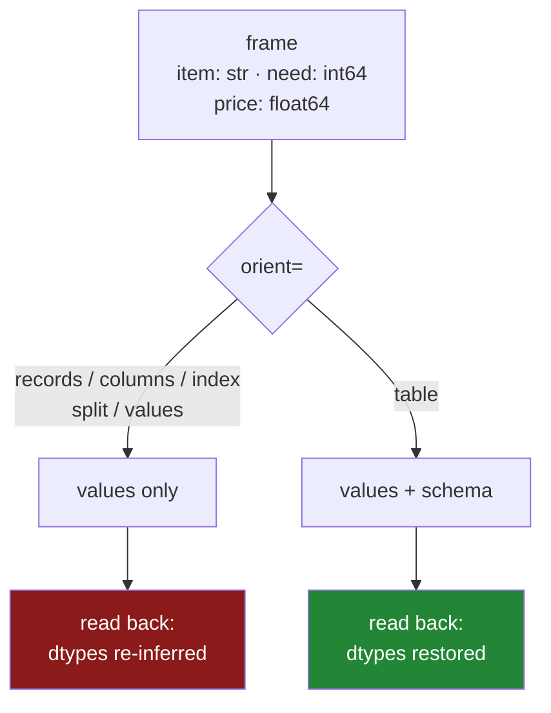

# 2.3 — `orient` — six ways to write the same frame

## One-line answer

`to_json` can write the same frame in six different shapes, they are not interchangeable, and only one
of them — `orient="table"` — records the dtypes, which makes it the only JSON round trip that gives
back what you wrote.

---

## The story

Somebody has to send the shopping list to the person doing the shopping, over a messaging app.

There are several ways to type it, and they all work.

You can send four messages, one per item: *milk, 2, £1.15*. You can send three messages, one per
column: *items: milk, bread, eggs, rice* then *counts: 2, 1, 6, 1* then *prices: …*. You can send one
message with the headings first and then the rows underneath. Or you can just send the numbers and
assume the other person remembers what order the columns go in.

All four contain the same list. The person receiving them has to know which one you sent, because the
second and the fourth are unreadable if you guess wrong — and the fourth is unreadable even if you
guess right, unless you both remember the column order.

Nobody agrees a convention in advance. Everybody just sends whichever one they typed.

---

## The idea in plain language

`frame.to_json()` has an argument called `orient` that chooses the shape of the JSON it writes. There
are six values and they produce six genuinely different documents from one frame.

| `orient` | What it looks like | When it is right |
|---|---|---|
| `"records"` | a list of one object per row | sending rows to an API or another program |
| `"columns"` | an object of columns, each an object of index-to-value | the default; compact for wide sparse data |
| `"index"` | an object of rows, keyed by index label | when the index label is the identifier |
| `"split"` | one object with `columns`, `index` and `data` arrays | no repeated key names, so smaller |
| `"values"` | a list of lists, no names at all | when the shape is agreed elsewhere |
| `"table"` | a `schema` object **and** the data | **the only one that records dtypes** |

The one to remember is the last. Every other orient writes the values and nothing about them, which
means a JSON round trip has the same problem as a CSV round trip
([1.7](../01-the-csv/1.7-to-csv-and-what-it-throws-away.md)): the types are re-inferred on the way back
in. `orient="table"` writes a **Table Schema** alongside the data — a small description saying each
column's name and type — following the *Table Schema* specification
(<https://specs.frictionlessdata.io/table-schema/>), and `read_json(..., orient="table")` uses it.

The other value of knowing the six is diagnostic. When somebody hands you a JSON file and it does not
read the way you expect, the question "which orient is this" is usually the answer, and being able to
recognise the shapes on sight saves an afternoon.

One more thing about the default, because it surprises people. `to_json()` with no `orient` uses
`"columns"` for a DataFrame — an object keyed by column name, each value an object keyed by index
label as a **string**. So the row labels come back as `"0"`, `"1"` rather than `0`, `1`, because JSON
object keys are always strings. That is a real difference and it is why `orient="records"` is what
almost everybody actually wants when sending data somewhere.

---

## Why Setu needs it

- **[2.4](2.4-json-lines.md)** is `orient="records"` with `lines=True`, which is the shape that scales,
  and it only makes sense next to the six.
- **[1.7](../01-the-csv/1.7-to-csv-and-what-it-throws-away.md)** established that a CSV round trip
  loses the dtypes; this part shows that JSON loses them too unless you pick the one orient that does
  not.
- **[3.2](../03-parquet/3.2-the-round-trip-that-keeps-dtypes.md)** is the format where the round trip is
  the default rather than an option, and this is the comparison.
- **Day 234** builds a FastAPI service, and every response it sends is a frame turned into JSON. Which
  orient is a real API design decision.
- **Day 231** has an agent producing structured output, and the shape a model is asked to produce is one
  of these six.

---

## The mechanism

The same two-row frame, written six ways:

```python
import pandas as pd

shop = pd.DataFrame({"item": ["milk", "bread"], "need": [2, 1], "price": [1.15, 1.40]})
for orient in ["records", "columns", "index", "split", "values", "table"]:
    print(f"--- orient={orient!r}")
    print(shop.to_json(orient=orient))
    print()
```

**Line by line:**

- Two rows and three columns, deliberately small, because these documents get long fast and the shapes
  are the point rather than the data.
- `f"{orient!r}"` — the `!r` conversion prints the string with its quotes, so the output reads as
  something you could paste back into code
  ([Day 7, 3.3](../../../day-07-strings/parts/03-formatting/3.3-repr-and-the-debugging-f-string.md)).
- `to_json` with **no path** returns the JSON as a string rather than writing a file, which is what makes
  a loop like this possible.

```text
--- orient='records'
[{"item":"milk","need":2,"price":1.15},{"item":"bread","need":1,"price":1.4}]

--- orient='columns'
{"item":{"0":"milk","1":"bread"},"need":{"0":2,"1":1},"price":{"0":1.15,"1":1.4}}

--- orient='index'
{"0":{"item":"milk","need":2,"price":1.15},"1":{"item":"bread","need":1,"price":1.4}}

--- orient='split'
{"columns":["item","need","price"],"index":[0,1],"data":[["milk",2,1.15],["bread",1,1.4]]}

--- orient='values'
[["milk",2,1.15],["bread",1,1.4]]

--- orient='table'
{"schema":{"fields":[{"name":"index","type":"integer"},{"name":"item","type":"string","extDtype":"str"},{"name":"need","type":"integer"},{"name":"price","type":"number"}],"primaryKey":["index"],"pandas_version":"1.4.0"},"data":[{"index":0,"item":"milk","need":2,"price":1.15},{"index":1,"item":"bread","need":1,"price":1.4}]}
```

Six documents, one frame. Three things in that output are worth stopping on.

**In `"columns"` and `"index"`, the row labels are `"0"` and `"1"` with quotes.** JSON object keys must
be strings, so an integer index becomes text on the way out and comes back as text unless something
converts it. That is a silent index dtype change across a round trip.

**In `"values"` there are no names at all.** Reading it back gives columns called `0`, `1`, `2`. It is
the smallest of the six and it is only safe when both ends have agreed the column order somewhere else,
which is a promise nothing enforces.

**`"table"` carries a `schema`**, and inside it each field has a `type` — `integer`, `string`, `number`
— plus, for the text column, `"extDtype":"str"`, which is pandas recording the exact dtype rather than
the generic Table Schema type. That extra field is what makes the round trip exact rather than
approximately right.

Which one keeps what:



The round trip, tested on the frame that has something to lose:

```python
import pandas as pd

SCHEMA = {"item": "str", "need": "int64", "price": "float64", "aisle": "str"}
typed = pd.read_csv("data/shopping.csv", dtype=SCHEMA, parse_dates=["bought"])

typed.to_json("data/rt.json", orient="table")
back = pd.read_json("data/rt.json", orient="table")
print(back.dtypes.to_string())
print("aisle:", back["aisle"].tolist())
```

**Line by line:**

- `typed` is the correctly typed frame from [1.4](../01-the-csv/1.4-dtype-at-read-time.md), including
  the `aisle` column whose leading zeros are the thing worth protecting.
- `orient="table"` on **both** calls. `read_json` will not guess that a file has a schema in it; if you
  write with `table` and read without it, you get a two-column frame with `schema` and `data` in it,
  which is a confusing five minutes.

```text
item                 str
need               int64
price            float64
aisle                str
bought    datetime64[ns]
```

```text
aisle: ['07', '03', '07', '11']
```

**The zeros survived and the dates came back as dates.** Compare that with the CSV round trip in
[1.7](../01-the-csv/1.7-to-csv-and-what-it-throws-away.md), where both were lost.

One detail is not identical: the date column went out as `datetime64[us]` and came back as
`datetime64[ns]`. The **unit** is not carried by the Table Schema, so the values are right and the dtype
name is not, and `pd.testing.assert_frame_equal` between the two frames fails on that column
([Day 26, 5.3](../../../day-26-frames-and-copy-on-write/parts/05-the-module/5.3-the-test-that-can-go-red.md)).
That is worth knowing before you write a test that asserts a perfect round trip through JSON, and it is
one of the reasons [3.2](../03-parquet/3.2-the-round-trip-that-keeps-dtypes.md) is the better answer.

---

## When it breaks

**Reading a `table` document without saying so:**

```text
$ uv run python -c "
import pandas as pd
pd.read_json('data/rt.json')
" 2>&1 | tail -2
```

```text
ValueError: Mixing dicts with non-Series may lead to ambiguous ordering.
```

**What it means.** Without `orient="table"` on the read, pandas tried to make a frame out of the
`{"schema": {...}, "data": [...]}` envelope and could not, because `schema` is an object and `data` is
an array. The message is about dictionaries and ordering and mentions neither JSON nor the argument
that would fix it, which is why this one is worth meeting here rather than at eleven at night. **The
orients are not self-describing**: nothing in the file announces which one it is, so the read has to be
told, and that is the practical cost of having six of them.

**The index that became text:**

```text
$ uv run python -c "
from io import StringIO
import pandas as pd
f = pd.DataFrame({'need': [2, 1]}, index=[10, 11])
back = pd.read_json(StringIO(f.to_json(orient='columns')))
print('written :', f.to_json(orient='columns'))
print('index   :', back.index.tolist())
print('dtype   :', back.index.dtype)
"
```

```text
written : {"need":{"10":2,"11":1}}
index   : [10, 11]
dtype   : int64
```

**What it means.** This one **recovered**, and it is worth knowing why rather than trusting it. The keys
were written as the strings `"10"` and `"11"`, and on the way back pandas noticed they all looked like
integers and converted them — the same inference as a CSV column
([1.2](../01-the-csv/1.2-read-csv-and-what-it-guessed.md)), with the same failure mode. An index of
`"007"` and `"008"` would come back as `7` and `8`, and the leading zeros would be gone exactly as in
[1.3](../01-the-csv/1.3-when-the-guess-is-wrong.md). `convert_axes=False` turns that inference off.

**Writing `orient="values"` and reading it back:**

```text
$ uv run python -c "
from io import StringIO
import pandas as pd
f = pd.DataFrame({'item': ['milk'], 'need': [2]})
back = pd.read_json(StringIO(f.to_json(orient='values')))
print(back.columns.tolist())
print(back)
"
```

```text
[0, 1]
      0  1
0  milk  2
```

**What it means.** The column names are gone, replaced by positions. Nothing failed, and every piece of
code downstream that says `frame["item"]` now raises `KeyError: 'item'` a long way from here.
`orient="values"` is the smallest of the six and it throws away the one thing that makes a frame
self-describing, so it belongs only where the receiving end has the column list from somewhere else.

Note the `StringIO` wrapper in both of the last two blocks. In pandas 3.0 `read_json` takes a path or a
file-like object and **no longer accepts a bare JSON string**; passing one gives
`FileNotFoundError: File {"need":...} does not exist`, because it was treated as a filename. Wrapping
the text in `io.StringIO` turns it into something the reader will accept.

**A column that JSON cannot represent:**

```text
$ uv run python -c "
import pandas as pd
f = pd.DataFrame({'when': pd.to_datetime(['2026-08-30'])})
print(f.to_json(orient='records'))
" 2>&1 | tail -3
```

```text
Pandas4Warning: The default 'epoch' date format is deprecated and will be removed in a future version, please use 'iso' date format instead.
[{"when":1788048000000}]
```

**What it means.** JSON has no date type, so pandas has to choose a representation, and its historical
default is **milliseconds since 1970** — the number in that output is a real date rendered as an
integer. Anything reading that file sees a large number. pandas 3.0 warns that this default is going
away, which tells you what to do: pass `date_format="iso"` and get `"2026-08-30T00:00:00.000"`, which a
human and any other language can both read. **This is the same class of problem as the CSV's missing
types, arriving from a different direction:** the format cannot express the value, so somebody has to
choose an encoding, and the default was chosen a long time ago.

---

## In production

**What a professional writes instead of the teaching version.** The orient is stated, the date format
is stated, and the choice is justified in one line:

```python
import pandas as pd


def to_api_payload(frame: pd.DataFrame) -> str:
    """One JSON object per row, ISO dates. The shape every HTTP client expects."""
    return frame.to_json(orient="records", date_format="iso", date_unit="s")


def to_archive(frame: pd.DataFrame, path: str) -> None:
    """Write with the schema, so reading it back does not re-infer anything."""
    frame.to_json(path, orient="table", date_format="iso", indent=2)
```

**Line by line:**

- Two functions rather than one with an argument — because the two uses have **different correct
  answers** and hiding that behind a parameter invites somebody to pass the wrong one. Naming them
  after their destination makes the choice at the call site.
- `orient="records"` for the API — a JSON array of objects is what every HTTP client, JavaScript
  front end and downstream service expects. Sending `orient="columns"` to a web client means the client
  has to transpose it.
- `date_format="iso"` on both — the epoch default is deprecated and unreadable. ISO is sortable as text
  and unambiguous ([1.5](../01-the-csv/1.5-parse-dates-and-the-date-that-stayed-text.md)).
- `date_unit="s"` on the API version — seconds rather than milliseconds, which shortens the timestamps
  when microsecond precision is not part of the contract. State it, because the default is `"ms"` and
  a client that parses fixed-width timestamps will notice.
- `indent=2` on the archive and **not** on the payload. An archive is read by people occasionally;
  a payload is read by machines constantly and indentation is bytes on every request.

**What changes at scale.** The whole-document orients stop working, and this is not a preference. Every
one of the six above writes **one JSON value**, so the closing bracket is at the end of the file, so
reading it means holding all of it in memory at once — both the text and the parsed objects. A 2 GB
response is 2 GB of text plus several times that as Python objects. There is no `chunksize` for
`read_json` on these shapes because there is nowhere to stop. That constraint is the entire reason for
[2.4](2.4-json-lines.md), and at any size worth worrying about, `lines=True` is not an optimisation but
the only option. The second scale effect is smaller and real: `orient="records"` repeats every column
name on every row, so a million-row file carries a million copies of each name. `orient="split"` says
each name once and is meaningfully smaller, which is why it survives as an option nobody chooses by
default.

**The failure that only appears with real data.** A service returned frames as
`frame.to_json(orient="records")` and worked for a year. Then a column of dates was added. The dates
went out as epoch milliseconds, the JavaScript front end displayed them as numbers, and somebody
"fixed" that by dividing by a thousand and formatting on the client. Six months later the API added
`date_format="iso"` because of the deprecation warning, and the front end — which was now parsing
numbers — showed every date as invalid. **Two systems had agreed on an undeclared default**, and the
default changed underneath them. The lesson is to state the encoding of anything JSON cannot represent
natively, on the day you first send it, because a default is a decision you did not know you made.

**The review comment a senior engineer leaves.** *"`to_json()` with no `orient` gives the client a
column-of-objects shape they will have to transpose, and the dates will go as epoch milliseconds with a
deprecation warning. `orient='records', date_format='iso'`, please. If this file is for us rather than
for them, use Parquet."*

**The interview question.** *"How would you send a DataFrame as JSON?"* `orient="records"`, because a
list of one object per row is what every client expects, and `date_format="iso"` because JSON has no
date type and the default is epoch milliseconds. Then the part that shows depth: JSON does not round
trip by default — the values go out and the dtypes do not, so reading back re-infers exactly the way a
CSV does — and the one orient that fixes that is `"table"`, which writes a Table Schema alongside the
data. Even then the datetime **unit** is not preserved, so a strict frame comparison across a JSON round
trip fails on the dtype name. If the round trip has to be exact, the answer is Parquet.

---

## Check yourself

```bash
uv run python -c "
import pandas as pd
shop = pd.DataFrame({'item': ['milk', 'bread'], 'need': [2, 1]})
for o in ['records', 'columns', 'split', 'values']:
    text = shop.to_json(orient=o)
    print(f'{o:>8}  {len(text):>3} bytes  {text}')
"
```

Four shapes, four sizes, one frame. Say which is smallest, which is safest to send to somebody else,
and why those are not the same one.

**Answer out loud, without scrolling up:**

> Name the only `orient` that survives a round trip with its dtypes, and say what it writes that the
> others do not. Then say what happens to an integer index under `orient="columns"`, and why it usually
> comes back looking fine anyway.

---

**Next:** [2.4 — JSON Lines](2.4-json-lines.md).
