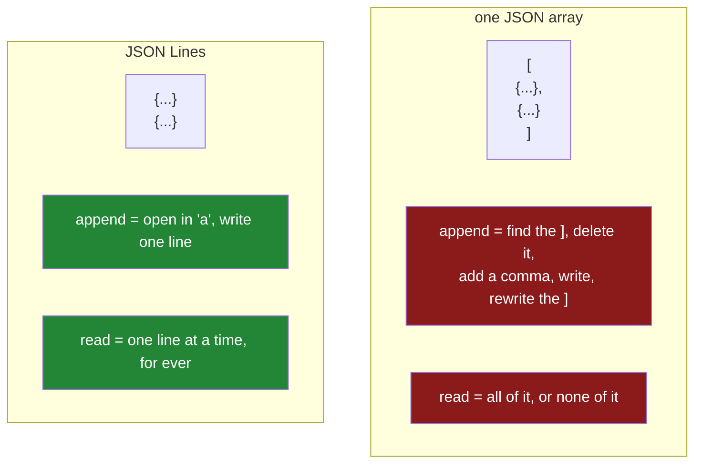

# 2.4 — JSON Lines — one record per line, and why it scales

## One-line answer

JSON Lines is one complete JSON object per line with no wrapping array, which makes it the only JSON
shape you can append to, split, stream and read in chunks — and `lines=True` on `to_json` and
`read_json` is how pandas speaks it.

---

## The story

The flat keeps a notebook by the door where anybody writes down what they bought, one line each, as
they come in.

*Tuesday, milk, £1.15.* Next line. *Tuesday, bread, £1.40.* Next line.

It works because of what you have to do to add a line: nothing. You open the notebook at the last page
and write. You do not have to find the end of anything, or rewrite the top of the page, or move a
bracket.

Compare it with the version where somebody insisted the whole week be written as one properly
punctuated sentence, opening with "This week we bought:" and closing with a full stop. Adding a
purchase to that means finding the full stop, deleting it, adding a comma, writing the new item, and
putting the full stop back. Two people cannot do it at once, and if somebody is interrupted halfway the
sentence is broken and nobody can read any of it.

The notebook survives being interrupted. The sentence does not.

---

## The idea in plain language

**JSON Lines** — often called JSONL or NDJSON — is a text format where every line is a complete JSON
value, usually an object, and there is nothing wrapping them. No opening `[`, no commas between
records, no closing `]`. It is described at <https://jsonlines.org/>, and the description is about that
long.

That one difference changes four things, and every one of them is why the format exists.

**You can append.** Adding a record is opening the file in append mode and writing one line. Adding to
a JSON array means rewriting the end of the file, which means holding a lock, which means one writer.

**You can read it in pieces.** A line is a complete record, so a reader can stop after any line and the
part it has read is valid. A JSON array's closing bracket is at the end of the file, so nothing is
valid until all of it has arrived.

**You can split it.** A 40 GB file can be cut into forty 1 GB pieces at any line boundary and each
piece is a valid JSON Lines file. That is what makes it the standard format for anything processing
data across many machines.

**One broken record does not break the file.** If a line is malformed, that line is malformed. In a
single JSON document, one misplaced brace makes the entire file unparseable.

The cost is the same one `orient="records"` has ([2.3](2.3-orient-six-ways-to-write-a-frame.md)): every
line repeats every key name. A million records with a `description` field carry a million copies of the
word `description`. Compression makes that cheap on disk and it is still bytes to parse.

pandas speaks it with one argument on each side: `to_json(path, orient="records", lines=True)` and
`read_json(path, lines=True)`. The `orient` must be `"records"` — it is the only shape where "one
record" means anything — and pandas will tell you so if you try another.

Day 16 met this format when writing log files
([Day 16, 2.5](../../../day-16-files-and-context-managers/parts/02-reading-and-writing/2.5-jsonl.md));
this part is the same format arriving at a DataFrame.

---

## Why Setu needs it

- **[2.1](2.1-nested-by-nature.md)** said a large JSON document cannot be read in pieces. This is the
  shape that can, and it is the answer to that limitation.
- **[5.2](../05-the-module/5.2-the-file-that-does-not-fit.md)** reads a file too big for memory in
  chunks, and `lines=True` accepts `chunksize=` exactly as `read_csv` does.
- **[3.1](../03-parquet/3.1-columns-on-disk-with-types.md)** is what you convert JSON Lines into once,
  at ingest, so nothing parses it twice.
- **Day 233**, the eval suite, writes one JSON object per evaluated example, appended as each finishes —
  which is this format and no other, because a run that crashes halfway must leave readable results.
- **Day 237**, observability, reads structured logs. Every structured logger on earth writes JSON Lines.

---

## The mechanism

Write the typed shopping list as JSON Lines and look at the file:

```python
import pandas as pd

SCHEMA = {"item": "str", "need": "int64", "price": "float64", "aisle": "str"}
typed = pd.read_csv("data/shopping.csv", dtype=SCHEMA, parse_dates=["bought"])
typed.to_json("data/shopping.jsonl", orient="records", lines=True, date_format="iso")
print(open("data/shopping.jsonl", encoding="utf-8").read())
```

**Line by line:**

- `orient="records"` — required. `lines=True` with any other orient raises, because "one record per
  line" has no meaning for a shape that is not a list of records.
- `lines=True` — the whole difference. Without it you get one line containing a JSON array; with it, one
  line per record and no array at all.
- `date_format="iso"` — the epoch default is deprecated in pandas 3.0 and produces integers where you
  wanted dates ([2.3](2.3-orient-six-ways-to-write-a-frame.md)). On a line-based format this matters
  more than usual, because these files are read by `grep` and by people.
- Printing the raw file rather than a frame, because the shape of the file *is* the subject.

```text
{"item":"milk","need":2,"price":1.15,"aisle":"07","bought":"2026-08-30T00:00:00.000"}
{"item":"bread","need":1,"price":1.4,"aisle":"03","bought":"2026-08-30T00:00:00.000"}
{"item":"eggs","need":6,"price":0.32,"aisle":"07","bought":null}
{"item":"rice","need":1,"price":2.05,"aisle":"11","bought":"2026-08-24T00:00:00.000"}
```

Four lines, four records, no brackets anywhere. **Every line stands alone**, which is the property
everything else follows from. `bought` for eggs is `null`, which is JSON's own way of saying missing —
better than the CSV's empty field, because `null` is unambiguous and an empty field is a convention
([1.6](../01-the-csv/1.6-na-values-and-the-blank.md)).

Appending, which is the operation the format exists for:

```python
import json

with open("data/shopping.jsonl", "a", encoding="utf-8") as handle:
    handle.write(json.dumps({"item": "tea", "need": 1, "price": 2.60, "aisle": "09"}) + "\n")

import pandas as pd

print(pd.read_json("data/shopping.jsonl", lines=True).tail(2))
```

**Line by line:**

- `open(..., "a", ...)` — append mode, which seeks to the end and writes there
  ([Day 16, 2.1](../../../day-16-files-and-context-managers/parts/02-reading-and-writing/2.1-open-and-the-mode-string.md)).
  **Nothing already in the file is read or rewritten.** On a 40 GB file this is as fast as on a 40-byte
  one, which is not true of any other JSON shape.
- `json.dumps(...) + "\n"` — the newline is written explicitly, because the format is defined by the
  line breaks and `write` does not add one. A missing final newline is the commonest way a JSONL file
  ends up with two records on one line.
- The new record has **no `bought` field**. JSON Lines does not require every line to have the same
  keys, so this is legal, and the reader fills the gap with `NaN` — the ragged-shape behaviour from
  [2.2](2.2-json-normalize.md), now at file level.
- `with` rather than a bare `open` — the file is closed even if the write raises
  ([Day 16, 4.1](../../../day-16-files-and-context-managers/parts/04-context-managers/4.1-with-the-block-that-cleans-up.md)).
  On an append-only log that matters: an unclosed handle can leave a partial line.

```text
   item  need  price  aisle                   bought
3  rice     1   2.05     11  2026-08-24T00:00:00.000
4   tea     1   2.60      9                      NaN
```

Two things in that output are the day's earlier lessons arriving again. `aisle` is `9`, not `'09'` —
`read_json` inferred the column exactly as `read_csv` would have
([1.3](../01-the-csv/1.3-when-the-guess-is-wrong.md)), because JSON Lines carries the types of each
value but nothing about the column as a whole. And `bought` came back as text rather than as a date,
because ISO dates are strings in JSON and inference never makes a date
([1.5](../01-the-csv/1.5-parse-dates-and-the-date-that-stayed-text.md)). **JSON Lines is not a round
trip either**; it is an append-friendly transport, and the typing still has to happen somewhere.

The two shapes, and what each costs to add one record to:



Reading it back in pieces, which the array shape cannot do at all:

```python
import pandas as pd

total = 0
rows = 0
with pd.read_json("data/shopping.jsonl", lines=True, chunksize=2) as reader:
    for chunk in reader:
        total += int(chunk["need"].sum())
        rows += len(chunk)
print(f"{rows} rows, {total} things to buy, never more than 2 rows in memory")
```

**Line by line:**

- `chunksize=2` — absurdly small on purpose, so the mechanism is visible on a five-row file. In real
  use it is fifty thousand or so, chosen so one chunk is a comfortable fraction of memory.
- `with ... as reader` — with `chunksize`, `read_json` returns a **reader object rather than a frame**,
  and it holds the open file. The `with` closes it
  ([Day 16, 4.1](../../../day-16-files-and-context-managers/parts/04-context-managers/4.1-with-the-block-that-cleans-up.md)).
  Forgetting it leaves a file handle open, which on Windows means the file cannot be deleted.
- `total += int(chunk["need"].sum())` — the running total is a plain Python integer, so **nothing is
  kept between chunks except one number.** That is the discipline the whole technique requires: whatever
  you compute must be combinable across chunks. A sum is; a median is not
  ([5.2](../05-the-module/5.2-the-file-that-does-not-fit.md)).

```text
5 rows, 11 things to buy, never more than 2 rows in memory
```

---

## When it breaks

**`lines=True` with the wrong orient:**

```text
$ uv run python -c "
import pandas as pd
f = pd.DataFrame({'item': ['milk'], 'need': [2]})
f.to_json('data/bad.jsonl', orient='columns', lines=True)
" 2>&1 | tail -2
```

```text
ValueError: 'lines' keyword only valid when 'orient' is records
```

**What it means.** A clear message, and the reason is worth holding on to: `lines=True` is not a
formatting option, it is a statement that each line is one record. `orient="columns"` writes one object
for the whole frame, so there is nothing to put on separate lines. **The orient defines what a record
is; `lines` only decides where the newlines go.**

**Reading a JSON Lines file without `lines=True`:**

```text
$ uv run python -c "
import pandas as pd
pd.read_json('data/shopping.jsonl')
" 2>&1 | tail -2
```

```text
ValueError: Trailing data
```

**What it means.** The reader parsed the first line as a complete JSON document, found more text after
it, and stopped. *Trailing data* is the message every JSON parser gives for this, in every language, and
it almost always means exactly this: somebody handed a JSON Lines file to something expecting one JSON
document. The fix is `lines=True`, and recognising the message on sight saves the ten minutes you would
otherwise spend looking for a stray brace.

**One bad line in a million:**

```text
$ uv run python -c "
import pandas as pd
from pathlib import Path
Path('data/broken.jsonl').write_text(
    '{\"item\": \"milk\", \"need\": 2}\n' 'not json at all\n' '{\"item\": \"rice\", \"need\": 1}\n',
    encoding='utf-8',
)
pd.read_json('data/broken.jsonl', lines=True)
" 2>&1 | tail -2
```

```text
ValueError: Unexpected character found when decoding 'null'
```

**What it means.** pandas stopped on the unparseable line, and look at the message: it is about a
character while decoding `null`, because the parser got as far as the `n` of `not json at all` and
expected the word `null`. It does not say **which line**, which on a large file is the whole problem,
and it does not say anything a person can act on either. That is the cost of pandas' reader: it does not skip
bad records. The robust pattern is to read the file yourself, keep the line number, and decide per line:

```python
import json
from pathlib import Path

import pandas as pd

good, bad = [], []
for number, line in enumerate(
    Path("data/broken.jsonl").read_text(encoding="utf-8").splitlines(), 1
):
    if not line.strip():
        continue
    try:
        good.append(json.loads(line))
    except json.JSONDecodeError as exc:
        bad.append((number, str(exc)))
print(f"{len(good)} parsed, {len(bad)} rejected: {bad}")
frame = pd.json_normalize(good)
```

```text
2 parsed, 1 rejected: [(2, 'Expecting value: line 1 column 1 (char 0)')]
```

Line 2 is named. That number is the entire reason to write the loop.

**Line by line:**

- `enumerate(..., 1)` — line numbers starting at 1, because that is what an editor shows and the number
  is the entire value of this loop.
- `if not line.strip(): continue` — a blank line, often at the end of the file, is not an error and not
  a record. Skipping it explicitly keeps it out of the rejected list.
- `except json.JSONDecodeError` — the **specific** exception, not a bare `except`
  ([Day 18, 1.4](../../../day-18-exceptions/parts/01-raising-and-catching/1.4-the-bare-except.md)). A
  `KeyboardInterrupt` in this loop should stop the program, not be counted as a bad line.
- Two lists rather than dropping the failures — **the count of rejected lines is data.** A file with
  three bad lines in a million is a normal day; the same file with four hundred thousand bad lines is an
  upstream incident, and only keeping the count tells you which one you are having.

**The file that ended mid-line:**

```text
$ uv run python -c "
import pandas as pd
from pathlib import Path
Path('data/cut.jsonl').write_text('{\"item\": \"milk\", \"need\": 2}\n{\"item\": \"bre', encoding='utf-8')
pd.read_json('data/cut.jsonl', lines=True)
" 2>&1 | tail -2
```

```text
ValueError: Unmatched ''"' when when decoding 'string'
```

**What it means.** The doubled *when when* is pandas' own typo, and it is a useful landmark: this exact
message means a JSON string was opened and never closed. It is what a JSON Lines file looks like when
the writer was killed mid-write, or
when it is being read while still being appended to. **Only the last line is damaged** — the record
before it is intact and readable, which is precisely the property an array-wrapped JSON file does not
have, where the same interruption makes the whole file unparseable. The usual production answer is to
skip a trailing partial line rather than to fail, since on a live log it is not an error at all: it is
a record that is still being written.

---

## In production

**What a professional writes instead of the teaching version.** Records are appended one at a time as
they are produced, never accumulated and written at the end:

```python
import json
from pathlib import Path
from typing import Any


def append_record(path: Path, record: dict[str, Any]) -> None:
    """Append one record. Safe to call from a process that may be killed at any moment."""
    line = json.dumps(record, ensure_ascii=False, separators=(",", ":"), default=str)
    with path.open("a", encoding="utf-8", newline="\n") as handle:
        handle.write(line + "\n")
        handle.flush()
```

**Line by line:**

- One record per call, appended — so a run that dies after nine hundred of a thousand records leaves
  nine hundred usable records. Building a list and writing at the end leaves nothing.
- `ensure_ascii=False` — writes real UTF-8 rather than escaping every non-ASCII character as `\uXXXX`.
  The file is smaller and a person can read it.
- `separators=(",", ":")` — no spaces after the separators, which on millions of records is a
  meaningful fraction of the file size and costs nothing in readability for a machine-read format.
- `default=str` — anything `json.dumps` cannot serialise becomes its string form instead of raising.
  On a log this is the right trade: a slightly lossy record beats an exception that stops the run
  ([Day 26, 5.1](../../../day-26-frames-and-copy-on-write/parts/05-the-module/5.1-the-shopping-list-module.md)
  makes the opposite call, deliberately, because a data module is not a log).
- `newline="\n"` — pins the line ending, so a file written on Windows has the same bytes as one written
  on Linux ([Day 16, 2.3](../../../day-16-files-and-context-managers/parts/02-reading-and-writing/2.3-newlines.md)).
  In a line-delimited format the line ending is part of the format, not a detail.
- `handle.flush()` — pushes the line out of Python's buffer, so a reader tailing the file sees it now
  rather than when the buffer fills
  ([Day 16, 3.2](../../../day-16-files-and-context-managers/parts/03-buffering/3.2-flush-fsync-and-what-saved-means.md)).
  It is not a durability guarantee — that is `os.fsync` — and it is usually the right level.

**What changes at scale.** JSON Lines is the format you receive at scale and rarely the one you keep.
It is what a stream of events looks like, what a structured logger writes, and what one machine hands
another; it is not what you want to run a query against, because every read parses every character of
every field even when you need two columns out of forty. The standard shape is **land in JSON Lines,
convert to Parquet once**, and query the Parquet ([3.4](../03-parquet/3.4-column-pruning.md)). The
second scale property is that files get split by time — one file per hour or per day, named so the
name is a filter — because a single append-only file eventually cannot be reprocessed. That naming
convention is the same idea as Parquet partitioning, arrived at from the other direction.

**The failure that only appears with real data.** A service wrote one JSON Lines file per day and a
nightly job read it with `pd.read_json(path, lines=True)`. It worked for eight months. Then a record
containing an unescaped control character got written — a customer had pasted something odd into a form
— and the nightly job failed with a `ValueError` about decoding, naming no line. The file was
1.4 GB. Finding the bad line took most of a morning with `sed` and bisection, and the fix was two
lines: parse per line, count the failures, carry on. **The lesson is that a format whose whole selling
point is that one bad record does not ruin the file is wasted on a reader that stops at the first one.**

**The review comment a senior engineer leaves.** *"This builds the whole list and writes it at the end,
so if the job dies at ninety per cent we get nothing. Append per record and flush. And on the read side,
`pd.read_json(lines=True)` will stop at the first malformed line without telling us which one — parse
per line and log the rejects with their line numbers."*

**The interview question.** *"Why JSON Lines rather than a JSON array?"* Because a JSON array has to be
complete to be valid — the closing bracket is at the end — so you cannot append without rewriting,
cannot read it in pieces, cannot split it across machines, and one bad character makes the whole file
unparseable. JSON Lines is one complete object per line with no wrapper, so appending is a single write
in append mode, reading is line by line for ever, and a malformed record damages exactly one line. In
pandas it is `lines=True` on both sides with `orient="records"`, and `chunksize=` works with it just as
it does for CSV. The thing I would add is that pandas' own reader stops at the first bad line and does
not say which, so for anything I do not control I parse line by line and keep a count of rejects,
because that count is how you tell a normal day from an upstream incident.

---

## Check yourself

```bash
uv run python -c "
import pandas as pd
f = pd.DataFrame({'item': ['milk', 'bread'], 'need': [2, 1]})
print('--- array shape:')
print(f.to_json(orient='records'))
print('--- lines shape:')
print(f.to_json(orient='records', lines=True))
"
```

The same records, two files. Say what you would have to do to add a third record to each of them, and
which of the two you could safely read while another process was still writing it.

**Answer out loud, without scrolling up:**

> Name the four things JSON Lines can do that a single JSON array cannot, and say what all four follow
> from. Then say what `ValueError: Trailing data` almost always means.

---

**Next:** [3.1 — Columns on disk, with types](../03-parquet/3.1-columns-on-disk-with-types.md).
