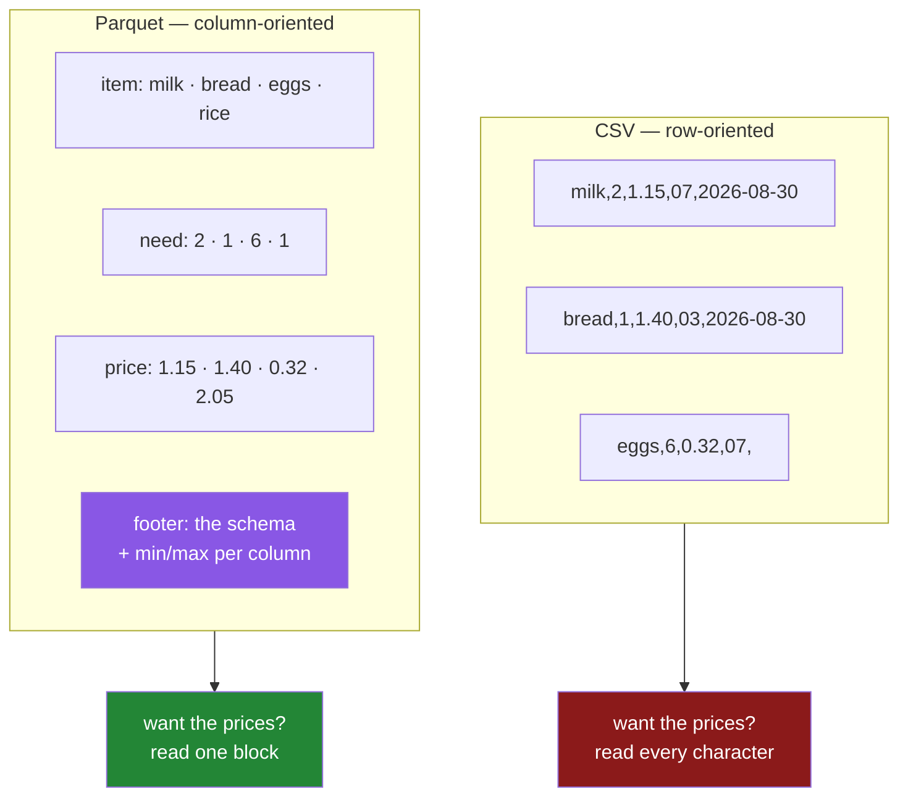

# 3.1 — Columns on disk, with types

## One-line answer

Parquet stores a table **one column at a time** and writes a schema into the file saying what each
column is, which removes both problems this day has been about: nothing is guessed, and nothing has to
be read that you did not ask for.

---

## The story

The flat's shopping list gets copied out twice for two different jobs.

The first copy is written the way the list has always been written: one item per line, everything about
milk on the milk line. That is what you want in the shop, because you deal with one item at a time —
find it, check the count, tick it off.

The second copy is written by whoever is doing the budget. They do not care about milk. They want the
prices, all of them, so they write a single column down the side of a page: 1.15, 1.40, 0.32, 2.05. Add
it up, done, and they never had to read a single item name.

Same list, two arrangements. The person in the shop would find the budget page useless. The person
doing the budget would have to read the whole list, item names and aisles and dates included, to get
four numbers off it.

Neither arrangement is better. They are better at different questions.

---

## The idea in plain language

**Row-oriented** storage keeps all of one record's values next to each other. A CSV is row-oriented:
each line is one item, complete ([1.1](../01-the-csv/1.1-a-csv-has-no-types-in-it.md)). So is JSON
Lines ([2.4](../02-json/2.4-json-lines.md)).

**Column-oriented** storage keeps all of one column's values next to each other. Every item name in one
block, then every count in another block, then every price.

**Parquet** is a column-oriented file format, defined by the Apache Parquet project
(<https://parquet.apache.org/docs/file-format/>). Three things follow from that arrangement, and they
are the whole reason it exists.

**You can read one column without reading the others.** If the prices are in their own block, getting
the prices means reading that block. In a CSV every price has thirty other characters on either side of
it, so there is no way to get at them without passing over everything else
([3.4](3.4-column-pruning.md)).

**It compresses far better.** A column holds one kind of thing, and one kind of thing repeats. A
column of aisle codes with nineteen distinct values across five hundred thousand rows can be stored as
nineteen strings plus five hundred thousand small numbers pointing at them. That is **dictionary
encoding**, and it is automatic ([3.3](3.3-the-size-and-the-speed-measured.md)).

**The types are in the file.** Parquet writes a **schema** — a list of the columns with their types —
into the file's footer. Nothing that reads it has to guess, which means everything sections 1 and 2 of
this day were about simply does not arise ([3.2](3.2-the-round-trip-that-keeps-dtypes.md)).

Two terms before the code. A **row group** is a horizontal slice of the file — say a million rows —
inside which the data is stored column by column. It is the unit a reader can skip, and it is why a
Parquet file can be read in parts despite being columnar. The **footer** is the metadata block at the
end of the file holding the schema, the row group locations, and per-column statistics like the minimum
and maximum value. A reader opens the footer first, which is how it knows what to skip.

The one thing to be clear about: **Parquet is binary.** You cannot open it in a text editor and see
your data, which is a real loss compared with a CSV and the main reason CSVs survive at the edges of
systems ([1.7](../01-the-csv/1.7-to-csv-and-what-it-throws-away.md)).

---

## Why Setu needs it

- **[3.2](3.2-the-round-trip-that-keeps-dtypes.md)** is the round trip that works, and it works because
  of the schema this part describes.
- **[3.4](3.4-column-pruning.md)** reads three columns out of forty, which is only possible because of
  the arrangement this part describes.
- **[5.1](../05-the-module/5.1-the-loaders-module.md)**'s `from_parquet` is the shortest of the four
  loaders, because there is nothing to declare.
- **Day 35** benchmarks pandas against Polars and DuckDB, and all three read Parquet as their native
  input.
- **Day 226**, the capstone's data layer, and **Day 227**, its ingestion, both store intermediate data
  as Parquet for exactly the reasons in this part.

---

## The mechanism

Write the typed frame and read the schema back out of the file:

```python
import pandas as pd
import pyarrow.parquet as pq

SCHEMA = {"item": "str", "need": "int64", "price": "float64", "aisle": "str"}
typed = pd.read_csv("data/shopping.csv", dtype=SCHEMA, parse_dates=["bought"])
typed.to_parquet("data/shopping.parquet", index=False)

print(pq.read_schema("data/shopping.parquet"))
```

**Line by line:**

- `import pyarrow.parquet as pq` — pyarrow is the library that actually reads and writes the format;
  pandas calls it. Importing it directly is how you look at the file's own metadata rather than at the
  frame pandas made from it.
- `typed.to_parquet(path, index=False)` — one call, **no schema argument**. The dtypes are already on
  the frame ([Day 26, 1.4](../../../day-26-frames-and-copy-on-write/parts/01-the-two-objects/1.4-one-dtype-per-column.md)),
  so the writer reads them off it. Compare `to_csv`, where the dtypes had nowhere to go
  ([1.7](../01-the-csv/1.7-to-csv-and-what-it-throws-away.md)).
- `index=False` — the same argument as `to_csv` and for the same reason, though the consequence is
  gentler: Parquet records that the index was a plain range, so a written index does not become an
  `Unnamed: 0` column on the way back.
- `pq.read_schema(path)` — reads **only the footer**. It does not read any data at all, so this is fast
  on a file of any size and is the right way to ask "what is in this file" before deciding to open it.

```text
item: large_string
need: int64
price: double
aisle: large_string
bought: timestamp[us]
-- schema metadata --
pandas: '{"index_columns": [{"kind": "range", "name": null, "start": 0, "' + 821
```

**The types are in the file.** Not guessed from the values, not supplied by the caller — written down
when the file was made, and read back by anything that opens it.

Three details in that output are worth naming. The names are **Arrow's** types rather than pandas' —
`large_string` for text, `double` for a 64-bit float, `timestamp[us]` for a datetime — because Parquet
is a cross-language format and Arrow's type system is the shared vocabulary. Underneath, there is a
second block of **schema metadata** where pandas has stored its own extra information, including what
the index was, which is how a pandas-specific detail survives a format that knows nothing about pandas.
And the `+ 821` is just the display truncating a long string.

How the same four rows sit on disk in the two arrangements:



The purple block is what sections 1 and 2 of this day were missing.

The footer holds more than the schema, and it is worth seeing:

```python
import pyarrow.parquet as pq

meta = pq.read_metadata("data/shopping.parquet")
print("rows       :", meta.num_rows)
print("columns    :", meta.num_columns)
print("row groups :", meta.num_row_groups)
stats = meta.row_group(0).column(2).statistics
print("price min  :", stats.min)
print("price max  :", stats.max)
```

**Line by line:**

- `pq.read_metadata` — again, footer only, no data read.
- `meta.num_rows` — the row count **without reading the rows**. On a CSV, counting rows means reading
  the whole file; here it is a number in the footer.
- `meta.row_group(0).column(2)` — the third column of the first row group, which is `price`. Columns are
  addressed by position in the metadata, which is one of the few places in this day where position
  rather than name is the right handle.
- `.statistics.min` and `.max` — the smallest and largest value in that column of that row group,
  recorded at write time. **This is what lets a reader skip an entire row group** without decompressing
  it: a query for prices above five can look at the maximum, see it is 2.05, and move on.

```text
rows       : 4
columns    : 5
row groups : 1
price min  : 0.32
price max  : 2.05
```

Four rows in one row group, because the file is tiny. A five-hundred-thousand-row file gets several,
and each one carries its own statistics.

---

## When it breaks

**No engine installed:**

```text
$ uv run python -c "
import pandas as pd
pd.DataFrame({'a': [1]}).to_parquet('data/x.parquet', engine='fastparquet')
" 2>&1 | tail -3
```

```text
ImportError: `Import fastparquet` failed. fastparquet is required for parquet support.
Use pip or conda to install the fastparquet package.
```

**What it means.** pandas does not implement Parquet itself; it delegates to `pyarrow` (the default) or
`fastparquet`. This day pins `pyarrow==25.0.1` in `pyproject.toml`, which is why the other calls work,
and it is why pyarrow is a real dependency of the project rather than an optional extra. If you meet
this error with the default engine, the fix is `uv add pyarrow==25.0.1` and not a code change.

**A column pandas can store and Parquet cannot:**

```text
$ uv run python -c "
import pandas as pd
f = pd.DataFrame({'note': [{'a': 1}, 'plain text']})
f.to_parquet('data/mixed.parquet')
" 2>&1 | tail -3
```

```text
ArrowInvalid: ('cannot mix struct and non-struct, non-null values',
'Conversion failed for column note with type object')
```

**What it means.** An `object` column can hold anything, including two different kinds of thing in the
same column ([Day 26, 2.1](../../../day-26-frames-and-copy-on-write/parts/02-the-str-dtype/2.1-text-used-to-be-object.md)),
and Parquet requires one type per column. So the write refuses, and it names the column. **This is a
feature**: the format is telling you that a column you thought was data is actually a bag, and it is
telling you now rather than three stages downstream. The fix is to decide what that column is — text,
or a nested structure, or two columns.

**Reading a file that is not Parquet:**

```text
$ uv run python -c "
import pandas as pd
pd.read_parquet('data/shopping.csv')
" 2>&1 | tail -2
```

```text
ArrowInvalid: Could not open Parquet input source '<Buffer>': Parquet magic bytes not found in footer.
Either the file is corrupted or this is not a parquet file.
```

**What it means.** A Parquet file ends with the four bytes `PAR1`, and the reader checks them before
anything else. The message is precise and it teaches the format: **the footer is at the end**, so
identifying a Parquet file means reading its last bytes rather than its first. It also means a
truncated Parquet file — a download that stopped early — is unreadable rather than partially readable,
which is the opposite of JSON Lines ([2.4](../02-json/2.4-json-lines.md)) and a real trade-off.

---

## In production

**What a professional writes instead of the teaching version.** They look at the footer before deciding
whether to read the file:

```python
from pathlib import Path

import pyarrow.parquet as pq


def describe(path: Path) -> dict[str, object]:
    """What is in this file, without reading any of its data."""
    meta = pq.read_metadata(path)
    schema = pq.read_schema(path)
    return {
        "rows": meta.num_rows,
        "row_groups": meta.num_row_groups,
        "bytes": path.stat().st_size,
        "columns": {name: str(schema.field(name).type) for name in schema.names},
    }
```

**Line by line:**

- Both calls read **only the footer**, so this function costs the same on a 4 KB file and a 40 GB one.
  That is what makes it usable in a listing over a directory of thousands of files, where opening each
  one properly would be out of the question.
- `meta.num_rows` before `path.stat().st_size` — the two together are the useful pair. Rows alone does
  not tell you whether the file will fit in memory; bytes alone does not tell you whether it is worth
  reading. A file with a hundred million rows in 200 MB is heavily compressed and will expand many
  times over when read ([3.3](3.3-the-size-and-the-speed-measured.md)).
- `num_row_groups` — a file with one enormous row group cannot be read in parallel or skipped through,
  however large it is. It is the first thing to check when a Parquet read is unexpectedly slow.
- `{name: str(...type) for name in schema.names}` — the schema as an ordinary dictionary of strings, so
  it can be compared against the project's `SCHEMA`
  ([Day 26, 5.2](../../../day-26-frames-and-copy-on-write/parts/05-the-module/5.2-asserting-the-schema.md))
  or printed in a log. Arrow's type objects do not compare cleanly against strings, which is the same
  trap Day 26 met with pandas dtypes.

**What changes at scale.** Row group size becomes a decision. Too large — one row group for the whole
file — and no reader can skip anything or work on parts in parallel; too small and the footer grows
until reading the metadata is itself slow, and compression suffers because each group is dictionary-
encoded separately. The common default is around one million rows or 128 MB per group, and the reason
those numbers are what they are is that they roughly match how much a single worker wants to hold. The
second thing that changes is that **one file becomes many**: at real volume a dataset is a directory of
Parquet files rather than one file, so that writers can add without rewriting and readers can split the
work. That is [3.4](3.4-column-pruning.md)'s territory and the reason `read_parquet` accepts a directory
as happily as a file.

**The failure that only appears with real data.** A team converted their pipeline's intermediate files
from CSV to Parquet and measured a large speed-up in testing. In production the job got **slower**. The
cause was that the writer was appending in small batches, producing about forty thousand Parquet files
of a few kilobytes each. Every one had a footer to open, and the metadata cost dwarfed the data cost —
the format's advantage had been turned into forty thousand small reads. This is common enough to have a
name, the small files problem, and the fix is to compact: write small files as they arrive, then merge
them periodically into files of a sensible size. **Parquet's benefits are per file, so a format
designed to be read efficiently can be used inefficiently by writing it badly.**

**The review comment a senior engineer leaves.** *"Good — this stage should be Parquet. Two things:
`index=False` unless the index means something, and please check `num_row_groups` on the output. If
this writer is producing one row group per batch we will end up with a file nobody can read in
parallel."*

**The interview question.** *"Why is Parquet faster than CSV?"* The answer that shows experience gives
three reasons and does not stop at the first. It is columnar, so reading three columns out of forty
reads three columns rather than the whole file. It is typed, so there is no parsing of characters into
numbers and no inference — the values are already in their binary form. And it compresses far better,
because a column holds one kind of value, so dictionary and run-length encoding work on it in a way
they cannot on interleaved rows. Then the honest caveat: it is binary, so you cannot look at it in an
editor or fix it with `sed`, and a truncated file is unreadable rather than partially readable — which
is why CSV and JSON Lines still live at the edges of the system where humans and other people's tools
are, and Parquet lives in the middle where our own code reads it.

---

## Check yourself

```bash
uv run python -c "
import pyarrow.parquet as pq
print(pq.read_schema('data/shopping.parquet'))
print()
m = pq.read_metadata('data/shopping.parquet')
print('rows', m.num_rows, 'columns', m.num_columns, 'row groups', m.num_row_groups)
print('last 4 bytes:', open('data/shopping.parquet', 'rb').read()[-4:])
"
```

The last line prints `b'PAR1'`. Say what it is doing there rather than at the start of the file, and
what that implies about a download that stopped halfway.

**Answer out loud, without scrolling up:**

> Say what "column-oriented" means in one sentence, without using the word column twice. Then name the
> three things that follow from it, and say which of the day's earlier problems each one removes.

---

**Next:** [3.2 — The round trip that keeps dtypes](3.2-the-round-trip-that-keeps-dtypes.md).
