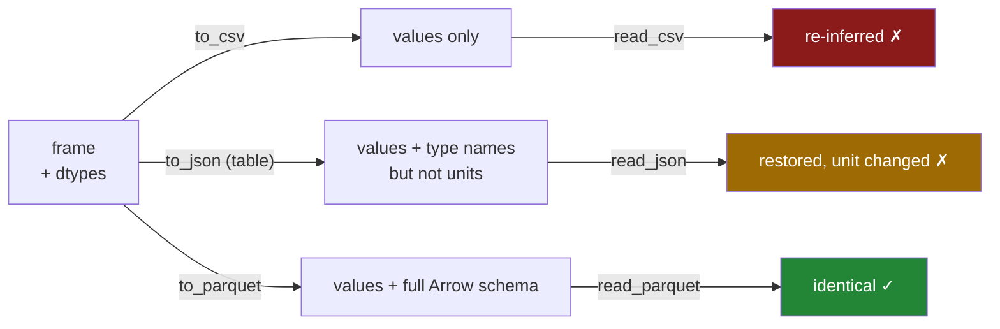

# 3.2 — The round trip that keeps dtypes

## One-line answer

Write a frame to Parquet, read it back, and `frame.equals(original)` is `True` — the aisle codes keep
their zeros and the dates are still dates, because the file carried the schema and the reader had
nothing to guess.

---

## The story

Somebody in the flat spends an evening tidying the shopping list properly — the same evening from
[1.7](../01-the-csv/1.7-to-csv-and-what-it-throws-away.md). Aisles written the way the signs write
them, dates in one format, counts as whole numbers.

This time, instead of printing it and pinning it to the fridge, they save it in a way that keeps the
notes about what each column is. When it is opened next week, `07` is still `07`. Nobody retypes
anything and nobody has to remember what was decided.

That is the whole part. The tidying survived, because it was saved rather than printed.

---

## The idea in plain language

A **round trip** is writing something out and reading it back. It is called that because you want to
end where you started, and the useful question about any file format is whether it actually does.

CSV does not ([1.7](../01-the-csv/1.7-to-csv-and-what-it-throws-away.md)). JSON does not, unless you
pick `orient="table"` and accept that the datetime unit still changes
([2.3](../02-json/2.3-orient-six-ways-to-write-a-frame.md)). Parquet does, because the schema is in the
file ([3.1](3.1-columns-on-disk-with-types.md)), so there is nothing for the reader to decide.

The way to check is not to look at the frame and think it seems fine. There are two proper tools.

`frame.equals(other)` returns one `True` or `False` for whether two frames have the same shape, the
same values, the same dtypes and the same index. It is the whole-frame version of `==`, and unlike `==`
it gives a single answer instead of a frame of booleans
([Day 26, 5.3](../../../day-26-frames-and-copy-on-write/parts/05-the-module/5.3-the-test-that-can-go-red.md)).

`pd.testing.assert_frame_equal(a, b)` raises with a message naming the column and the rows that differ.
`equals` tells you whether; `assert_frame_equal` tells you what. Use the first in a condition, the
second in a test.

One thing to be precise about, because it is the honest limit of the claim. Parquet round trips the
things pandas can express in Arrow's type system — text, integers of each width, floats, booleans,
timestamps, categories, and nested structures. It does **not** round trip an `object` column of
arbitrary Python objects, because Arrow has no type for "anything at all", and that write fails rather
than succeeding badly ([3.1](3.1-columns-on-disk-with-types.md)). Failing loudly on the one case it
cannot handle is a large part of why the guarantee is worth having.

---

## Why Setu needs it

- **[5.3](../05-the-module/5.3-the-round-trip-test.md)** is a test asserting exactly this, and the same
  test asserting that CSV does *not*. A guarantee nobody tests is a hope.
- **[1.3](../01-the-csv/1.3-when-the-guess-is-wrong.md)** was the leading-zero loss; this is the format
  where it cannot happen, and the aisle column is how you check.
- **[3.4](3.4-column-pruning.md)** relies on the schema being in the file to know which columns exist
  before reading any of them.
- **Day 30 onwards**, every day in this phase reads the dataset built here. If the types changed each
  time it was written and read, every one of those days would begin by fixing them.
- **Day 235**, the CI eval gate, compares a stored baseline against a fresh run. That comparison is only
  meaningful if storing and loading the baseline changed nothing.

---

## The mechanism

The direct claim, on the frame that has three things to lose:

```python
import pandas as pd

SCHEMA = {"item": "str", "need": "int64", "price": "float64", "aisle": "str"}
typed = pd.read_csv("data/shopping.csv", dtype=SCHEMA, parse_dates=["bought"])

typed.to_parquet("data/shopping.parquet", index=False)
back = pd.read_parquet("data/shopping.parquet")

print(back.dtypes.to_string())
print()
print("aisle  :", back["aisle"].tolist())
print("equal? :", back.equals(typed))
```

**Line by line:**

- `typed` has the three things earlier parts showed a CSV losing: `aisle` as `str` with leading zeros
  ([1.3](../01-the-csv/1.3-when-the-guess-is-wrong.md)), `bought` as a real datetime
  ([1.5](../01-the-csv/1.5-parse-dates-and-the-date-that-stayed-text.md)), and `need` as a whole number.
- `pd.read_parquet(path)` — **no arguments.** No `dtype=`, no `parse_dates=`, nothing. Compare the
  `read_csv` call two lines above it, which needed both. That difference is the part.
- `back.equals(typed)` — the whole claim in one call. `back == typed` would give a frame of booleans and
  then fail in an `assert`
  ([Day 26, 5.3](../../../day-26-frames-and-copy-on-write/parts/05-the-module/5.3-the-test-that-can-go-red.md)),
  which is why `equals` exists.

```text
item                 str
need               int64
price            float64
aisle                str
bought    datetime64[us]

aisle  : ['07', '03', '07', '11']
equal? : True
```

**`True`.** Every dtype, every value, the index, all identical, with no arguments on the read.

The three formats side by side, on the same frame:

```python
import pandas as pd

SCHEMA = {"item": "str", "need": "int64", "price": "float64", "aisle": "str"}
typed = pd.read_csv("data/shopping.csv", dtype=SCHEMA, parse_dates=["bought"])

typed.to_csv("data/rt.csv", index=False)
typed.to_json("data/rt.json", orient="table")
typed.to_parquet("data/rt.parquet", index=False)

results = {
    "csv": pd.read_csv("data/rt.csv"),
    "json (table)": pd.read_json("data/rt.json", orient="table"),
    "parquet": pd.read_parquet("data/rt.parquet"),
}
for name, frame in results.items():
    same = frame.equals(typed)
    print(f"{name:>13}  equal={str(same):>5}  aisle={frame['aisle'].tolist()[0]!r:>5}")
```

**Line by line:**

- All three writes come from the **same** `typed` frame, so any difference in the results is the
  format's doing and not the data's.
- `orient="table"` for the JSON, which is its best case
  ([2.3](../02-json/2.3-orient-six-ways-to-write-a-frame.md)). Comparing Parquet against a badly-chosen
  JSON orient would not be a fair test.
- `f"{...!r:>5}"` — `!r` puts quotes round the value so `7` and `'07'` are visibly different, and `:>5`
  right-aligns so the column lines up
  ([Day 7, 3.3](../../../day-07-strings/parts/03-formatting/3.3-repr-and-the-debugging-f-string.md)).
- Reading each one **the way somebody who did not write it would**: `read_csv` with no arguments,
  `read_json` with the matching orient, `read_parquet` with nothing.

```text
          csv  equal=False  aisle=    7
 json (table)  equal=False  aisle= '07'
      parquet  equal= True  aisle= '07'
```

Three formats, three answers. CSV lost the zeros. JSON kept the zeros and still fails `equals`, because
the datetime unit changed from `[us]` to `[ns]`
([2.3](../02-json/2.3-orient-six-ways-to-write-a-frame.md)) — **the values are right and the dtype name
is not**, which is exactly the sort of nearly-correct that a test catches and an eyeball does not.
Parquet is `True`.

Why, in one picture:



The amount of information each file carries about itself is the whole explanation.

---

## When it breaks

**A column Arrow has no type for:**

```text
$ uv run python -c "
import pandas as pd
f = pd.DataFrame({'note': [{'a': 1}, 'plain text']})
f.to_parquet('data/mixed.parquet')
" 2>&1 | tail -2
```

```text
ArrowInvalid: ('cannot mix struct and non-struct, non-null values',
'Conversion failed for column note with type object')
```

**What it means.** An `object` column can hold two different kinds of thing, and Parquet cannot. The
write **fails**, naming the column, rather than storing something approximate — and that is what makes
the round-trip guarantee real. A format that silently converted the dictionary to its string form would
round trip in the sense of not raising and would give you back different data.

**The index that came back as a column:**

```text
$ uv run python -c "
import pandas as pd
f = pd.DataFrame({'need': [2, 1]}, index=['milk', 'bread'])
f.to_parquet('data/idx.parquet', index=False)
print(pd.read_parquet('data/idx.parquet').index.tolist())
f.to_parquet('data/idx2.parquet')
print(pd.read_parquet('data/idx2.parquet').index.tolist())
"
```

```text
[0, 1]
['milk', 'bread']
```

**What it means.** `index=False` **throws the index away**, and here the index was the item names, so
real data was lost silently. That is the opposite of the CSV advice in
[1.7](../01-the-csv/1.7-to-csv-and-what-it-throws-away.md), and the reason the advice differs is that
Parquet has somewhere to record what the index was. **The rule is: `index=False` when the index is a
meaningless row number, and the default when it is data.** Parquet handles the second case properly
where CSV cannot.

**Round-tripping a nullable integer:**

```text
$ uv run python -c "
import pandas as pd
f = pd.DataFrame({'need': pd.array([2, None, 6], dtype='Int64')})
f.to_parquet('data/nullable.parquet', index=False)
back = pd.read_parquet('data/nullable.parquet')
print(back['need'].dtype, back['need'].tolist())
print('equal?', back.equals(f))
"
```

```text
Int64 [2, <NA>, 6]
equal? True
```

**What it means.** The nullable integer from [1.6](../01-the-csv/1.6-na-values-and-the-blank.md)
survives, missing value and all. This is worth checking rather than assuming, because it is precisely
the sort of pandas-specific dtype that a cross-language format might have flattened to `float64` — and
that is what the `pandas` block in the schema metadata ([3.1](3.1-columns-on-disk-with-types.md)) is
for.

**Two frames that look equal and are not:**

```text
$ uv run python -c "
import pandas as pd
a = pd.DataFrame({'need': [2, 1]})
b = pd.DataFrame({'need': [2.0, 1.0]})
print(a)
print(b)
print('equals   :', a.equals(b))
pd.testing.assert_frame_equal(a, b)
" 2>&1 | tail -3
```

```text
AssertionError: Attributes of DataFrame.iloc[:, 0] (column name="need") are different

Attribute "dtype" are different
[left]:  int64
[right]: float64
```

**What it means.** `equals` said `False` and did not say why; `assert_frame_equal` said which column and
which attribute. **That is the division of labour between the two**, and it is why a test uses the
second. The specific case matters too: an integer column that became a float is what happens when a
missing value passes through ([1.6](../01-the-csv/1.6-na-values-and-the-blank.md)), and on screen the
two frames differ only by a decimal point.

---

## In production

**What a professional writes instead of the teaching version.** The write and the verification are one
function, because a round-trip guarantee that is never checked is not a guarantee:

```python
from pathlib import Path

import pandas as pd


def write_checked(frame: pd.DataFrame, path: Path) -> Path:
    """Write Parquet and prove it reads back identical. Raises if the format lost anything."""
    path.parent.mkdir(parents=True, exist_ok=True)
    frame.to_parquet(path, index=False, compression="zstd")
    pd.testing.assert_frame_equal(pd.read_parquet(path), frame.reset_index(drop=True))
    return path
```

**Line by line:**

- `compression="zstd"` — stated rather than left to the default `snappy`. Zstandard compresses
  noticeably better at a similar speed and is supported everywhere that matters now; naming it means
  the file's size does not change because a library default changed
  ([3.3](3.3-the-size-and-the-speed-measured.md)).
- `assert_frame_equal(read, written)` **inside the writer** — the check runs once per file, costs one
  extra read, and turns "Parquet round trips" from something you believe into something this pipeline
  has verified for this file. On a large file this is a real cost and the right call is usually to do it
  on a sample; on anything under a few hundred megabytes it is worth it outright.
- `frame.reset_index(drop=True)` on the right-hand side — because `index=False` discarded the index, so
  the correct comparison is against the frame **without** its index. Comparing against the original
  would fail on the index and the message would be confusing. **The check has to encode what you
  actually promised**, which here is "the columns come back", not "everything comes back".
- Returning the path — so the caller can chain, and so the function has an answer rather than only a
  side effect.

**What changes at scale.** The verification stops being free, because it doubles the write into a write
plus a full read. The usual answer is to verify the **schema** rather than the data: read the footer
with `pq.read_schema` ([3.1](3.1-columns-on-disk-with-types.md)), which costs nothing at any size, and
compare it against the expected schema. That catches the failure that actually happens — a dtype
changing because an upstream column changed — while skipping the one that does not, since Parquet
genuinely does not corrupt values. The second change is that **compression becomes a decision with
money attached**: `snappy` is fast and larger, `zstd` is a little slower and meaningfully smaller,
`gzip` is slower still and smaller again. At a terabyte the difference between them is a monthly bill,
and at a gigabyte it is nothing, so this is a decision to make once per dataset and write down.

**The failure that only appears with real data.** A team relied on the Parquet round trip and had never
tested it, which was fine, because it does work. What bit them was a column that had always been
`int64` arriving one day with a single missing value, which made it `float64`
([1.6](../01-the-csv/1.6-na-values-and-the-blank.md)). Parquet faithfully round-tripped `float64`,
because that is what it was given. Downstream, a join between that column and an `int64` key in another
table matched nothing, and the report came out empty. **The round trip was perfect and the data was
wrong**, which is the distinction worth holding: a round-trip guarantee promises the file gives back
what you put in, and says nothing about whether what you put in was right. That is what the schema
check is for ([Day 26, 5.2](../../../day-26-frames-and-copy-on-write/parts/05-the-module/5.2-asserting-the-schema.md)).

**The review comment a senior engineer leaves.** *"`to_parquet` with `index=False` here — but this
frame's index is the order identifier, so we are dropping it. Either keep the index or `reset_index()`
first so it becomes a column. And please pin `compression=`, so the file size does not move under us
when pyarrow changes its default."*

**The interview question.** *"Does writing to Parquet and reading it back give you the same DataFrame?"*
Yes, and the reason is that the schema is written into the file, so the reader has nothing to infer —
`frame.equals(original)` is `True` with no arguments on the read, which is not the case for CSV or for
JSON. The caveats are worth giving unprompted: `index=False` discards the index, so if the index is
data you either keep it or reset it into a column first; and a column of mixed Python objects cannot be
written at all, which is a good failure because the alternative would be a silent conversion. And the
thing I would add is that a perfect round trip does not mean correct data — if a column arrived as
`float64` because of one missing value, Parquet will round trip `float64` faithfully, so the schema
check still belongs after the read.

---

## Check yourself

```bash
uv run python -c "
import pandas as pd
S = {'item': 'str', 'need': 'int64', 'price': 'float64', 'aisle': 'str'}
typed = pd.read_csv('data/shopping.csv', dtype=S, parse_dates=['bought'])
typed.to_parquet('data/rt.parquet', index=False)
typed.to_csv('data/rt.csv', index=False)
print('parquet:', pd.read_parquet('data/rt.parquet').equals(typed))
print('csv    :', pd.read_csv('data/rt.csv').equals(typed))
pd.testing.assert_frame_equal(pd.read_csv('data/rt.csv'), typed)
" 2>&1 | tail -6
```

One `True`, one `False`, and then a message saying exactly which column broke first. Say why the
`read_parquet` call needed no arguments when the `read_csv` that made `typed` needed two.

**Answer out loud, without scrolling up:**

> Say what `equals` answers and what `assert_frame_equal` adds. Then say why `index=False` is right for
> a CSV and sometimes wrong for a Parquet file, and give the one kind of column Parquet refuses to
> write.

---

**Next:** [3.3 — The size and the speed, measured](3.3-the-size-and-the-speed-measured.md).
