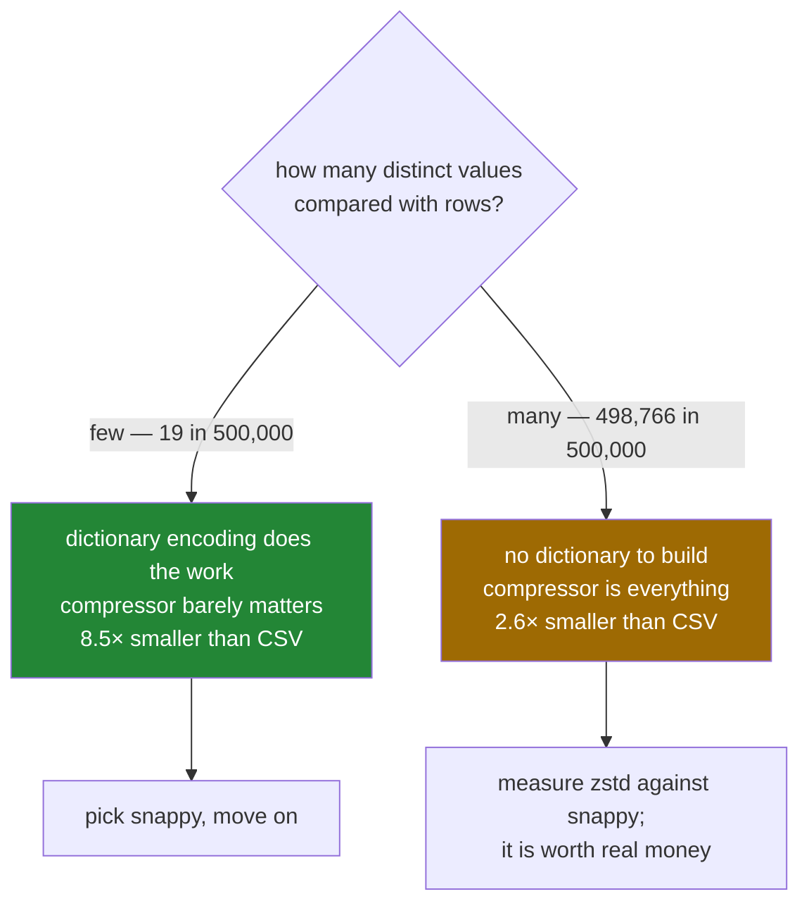

# 3.3 — The size and the speed, measured

## One-line answer

On five hundred thousand shopping rows Parquet is 1.6 MB against the CSV's 13.5 MB and reads in 22
milliseconds against 242 — but the reason is **dictionary encoding**, not the compressor, and on data
with no repetition the gap between compressors matters and the gap between formats shrinks.

---

## The story

The flat's shopping notebook has been going for two years, one line per purchase, and it is nearly
full.

Somebody decides to copy it into a new notebook more compactly. Looking down the item column, they
notice something: it says *milk* over and over. Hundreds of times. So do *bread* and *eggs*. There are
maybe twenty different things the flat ever buys.

So instead of writing *milk* seven hundred times, they write a small key at the front — 1 is milk, 2 is
bread, 3 is eggs — and then just the numbers down the page. The new notebook holds two years in a
quarter of the space, and nothing has been lost.

Then they get to the column where somebody wrote a short note about each purchase. Every note is
different. There is no key to make, no repetition to exploit, and that column takes exactly as much
space as it did before.

The trick worked brilliantly on one column and not at all on the other, and the difference is not the
trick. It is the data.

---

## The idea in plain language

Parquet is smaller and faster than CSV, and it is worth knowing **which** of several mechanisms is
doing the work, because they behave differently on different data.

**Dictionary encoding** is the notebook trick. When a column has few distinct values relative to its
length, Parquet stores the distinct values once and then a list of small integers pointing into them.
Nineteen aisle codes across five hundred thousand rows become nineteen strings and five hundred
thousand tiny numbers. This is the single biggest effect on most real tables, and it happens before any
compression.

**Binary encoding** is that a number is stored as a number. `1.15` in a CSV is four characters; in
Parquet it is eight bytes of float, and — more importantly — reading it back requires no parsing.
That is most of the speed difference.

**Compression** is a general-purpose squeeze applied to each column's block after encoding. Parquet
offers several — `snappy` (the default, fast), `zstd` (a little slower, smaller), `gzip` (slower,
similar to zstd here), or `None`.

The reason to separate these three is that a measurement without them is misleading. On a column that
dictionary-encodes well, the compressor has almost nothing left to do, and changing it changes nothing.
On a column of distinct values there is no dictionary to build, and the compressor is the only thing
working.

One more measurement matters more than either and is easy to forget: **the size in memory**, which is
what decides whether a file opens at all. A 1.6 MB Parquet file is 23 MB of frame. The number on disk
tells you about your storage bill; the number in memory tells you whether the job runs
([5.2](../05-the-module/5.2-the-file-that-does-not-fit.md)).

Day 25 established how to measure honestly — take the minimum of repeated runs, keep setup out of the
timed region ([Day 25, 4.2](../../../day-25-copy-view-and-the-gate/parts/04-the-benchmark/4.2-timeit-honestly.md)).
Everything below follows those rules, and every number was measured on one ordinary laptop, which means
**your numbers will differ and the ratios should not**.

---

## Why Setu needs it

- **[1.7](../01-the-csv/1.7-to-csv-and-what-it-throws-away.md)** argued for Parquet on correctness
  grounds. This is the other half of the argument, with numbers attached.
- **[3.4](3.4-column-pruning.md)** is a larger speed effect than anything here, and it needs this part's
  baseline to be measured against.
- **[5.2](../05-the-module/5.2-the-file-that-does-not-fit.md)** is about the memory number rather than
  the disk number, and this part is where the difference between them is established.
- **Day 34** introduces the categorical dtype, which is dictionary encoding applied in memory rather
  than on disk — the same idea, one layer up.
- **Day 35** benchmarks pandas against Polars and DuckDB. Those comparisons are all run on Parquet, so
  this part's numbers are the floor they start from.

---

## The mechanism

Five hundred thousand shopping rows, written every way, measured:

```python
import os
import time
from pathlib import Path

import numpy as np
import pandas as pd

rng = np.random.default_rng(27)
n = 500_000
items = np.array(["milk", "bread", "eggs", "rice", "tea", "beans"])
big = pd.DataFrame(
    {
        "item": pd.Series(items[rng.integers(0, 6, n)], dtype="str"),
        "need": rng.integers(1, 9, n).astype("int64"),
        "price": np.round(rng.uniform(0.2, 4.0, n), 2),
        "aisle": pd.Series([f"{a:02d}" for a in rng.integers(1, 20, n)], dtype="str"),
        "bought": pd.to_datetime("2026-08-01") + pd.to_timedelta(rng.integers(0, 30, n), unit="D"),
    }
)
big.to_csv("data/big.csv", index=False)
for compression in [None, "snappy", "zstd", "gzip"]:
    path = Path(f"data/big_{compression}.parquet")
    start = time.perf_counter()
    big.to_parquet(path, index=False, compression=compression)
    write = time.perf_counter() - start
    start = time.perf_counter()
    pd.read_parquet(path)
    read = time.perf_counter() - start
    size = os.path.getsize(path) / 1e6
    print(
        f"{str(compression):>7}  {size:6.2f} MB   write {write * 1000:6.0f} ms   read {read * 1000:5.0f} ms"
    )
print("in memory:", f"{big.memory_usage(deep=True).sum() / 1e6:.1f} MB")
```

**Line by line:**

- `np.random.default_rng(27)` — a seeded generator, so the file is the same every time this is run and
  the numbers are comparable across machines
  ([Day 20, 4.2](../../../day-20-arrays-and-dtypes/parts/04-random/4.2-the-seed-is-part-of-the-result.md)).
- `items[rng.integers(0, 6, n)]` — indexing an array of six names with half a million random positions,
  which is how you build a **low-cardinality** column: six distinct values, five hundred thousand rows.
  That ratio is the whole subject of this part.
- `f"{a:02d}"` for the aisle — two digits with a leading zero, the same column that section 1 spent
  three parts on ([1.3](../01-the-csv/1.3-when-the-guess-is-wrong.md)). It has nineteen distinct values.
- `dtype="str"` stated on both text columns, so the frame is what pandas 3.0 would infer and not an
  `object` column ([Day 26, 2.2](../../../day-26-frames-and-copy-on-write/parts/02-the-str-dtype/2.2-str-the-dtype-pandas-3-infers.md)).
- `time.perf_counter()` around **only** the write and only the read. The frame is built once, outside
  everything, so the timing is not measuring `rng.integers`
  ([Day 25, 4.2](../../../day-25-copy-view-and-the-gate/parts/04-the-benchmark/4.2-timeit-honestly.md)).
- `memory_usage(deep=True)` — `deep=True` follows the text columns to their actual contents. Without it
  a text column reports only the size of its pointers, and the answer is wrong by a factor of several.

```text
   None    1.58 MB   write     99 ms   read    38 ms
 snappy    1.58 MB   write     86 ms   read    22 ms
   zstd    1.56 MB   write     95 ms   read    22 ms
   gzip    1.56 MB   write    111 ms   read    18 ms
    csv   13.53 MB   read   242 ms

in memory: 23.1 MB
```

**Read those numbers carefully, because the obvious conclusion is wrong.**

Parquet against CSV: 1.58 MB against 13.53 MB, and 22 ms against 242 ms. Eight and a half times smaller,
eleven times faster to read. That much is the headline and it is real.

But look at the compression column. `None` is 1.58 MB and `zstd` is 1.56 MB. **Turning compression off
entirely costs one per cent.** All the shrinking was done by dictionary encoding before the compressor
saw anything — six item names, nineteen aisle codes, thirty dates and eight counts, in half a million
rows. There is essentially nothing left to compress.

And the memory number is the one that decides whether the job runs: 23.1 MB in memory from a 1.6 MB
file, **fourteen times larger than the file on disk.**

Now the same measurement on data with no repetition in it:

```python
import os

import numpy as np
import pandas as pd

rng = np.random.default_rng(27)
n = 500_000
noise = pd.DataFrame(
    {
        "value": rng.normal(size=n),
        "note": pd.Series([f"ref-{i:08d}" for i in rng.integers(0, 10**8, n)], dtype="str"),
    }
)
noise.to_csv("data/noise.csv", index=False)
for compression in [None, "snappy", "zstd", "gzip"]:
    path = f"data/noise_{compression}.parquet"
    noise.to_parquet(path, index=False, compression=compression)
    print(f"{str(compression):>7}  {os.path.getsize(path) / 1e6:6.2f} MB")
print("distinct notes:", noise["note"].nunique())
```

**Line by line:**

- `rng.normal(size=n)` — half a million distinct floats. Random floats are the hardest thing there is to
  compress, because there is no pattern to find.
- `f"ref-{i:08d}"` over eight-digit random integers — nearly half a million distinct strings.
  **Dictionary encoding cannot help here**: the dictionary would be almost as long as the column.
- The same four compressors, so the two tables are directly comparable.
- `nunique()` printed, because it is the number that explains the whole difference between this table
  and the last one.

```text
   None   12.41 MB
 snappy    8.46 MB
   zstd    6.42 MB
   gzip    6.65 MB
    csv   16.82 MB
```

```text
distinct notes: 498766
```

**A completely different picture from the same code.** Parquet is now 6.4 MB against the CSV's 16.8 —
under three times smaller instead of eight and a half. And the compressor now matters enormously:
`zstd` is nearly half the size of `None`, where on the shopping data it was one per cent.

The rule that comes out of the two tables:



**Cardinality decides which lever matters.** That is the sentence to keep.

---

## When it breaks

**Believing the file size tells you the memory:**

```text
$ uv run python -c "
import os
import pandas as pd
f = pd.read_parquet('data/big_snappy.parquet')
print('file  :', round(os.path.getsize('data/big_snappy.parquet') / 1e6, 2), 'MB')
print('frame :', round(f.memory_usage(deep=True).sum() / 1e6, 1), 'MB')
print('ratio :', round(f.memory_usage(deep=True).sum() / os.path.getsize('data/big_snappy.parquet'), 1))
"
```

```text
file  : 1.58 MB
frame : 23.1 MB
ratio : 14.6
```

**What it means.** The file is compressed and dictionary-encoded; the frame is not. Reading a 1.6 GB
Parquet file on a machine with 16 GB of memory is not obviously safe, because it may want 23 GB. **The
ratio is not a constant** — it depends entirely on how well the data encoded, so a highly repetitive
dataset has a worse ratio than a random one. The only honest way to know is `pq.read_metadata(path)`
for the row count ([3.1](3.1-columns-on-disk-with-types.md)) and an estimate per row, or reading in
chunks and finding out ([5.2](../05-the-module/5.2-the-file-that-does-not-fit.md)).

**Forgetting `deep=True`:**

```text
$ uv run python -c "
import pandas as pd
f = pd.read_parquet('data/big_snappy.parquet')
print('shallow:', round(f.memory_usage().sum() / 1e6, 1), 'MB')
print('deep   :', round(f.memory_usage(deep=True).sum() / 1e6, 1), 'MB')
"
```

```text
shallow: 20.0 MB
deep   : 23.1 MB
```

**What it means.** The shallow measurement counts what the column's array occupies and not what its
text points at. Under pandas 3.0's `str` dtype the gap is modest, because Arrow-backed strings store
their characters in one contiguous block. Under the old `object` dtype the same gap was often a factor
of five or more, and the habit of passing `deep=True` was formed then. It is still the right habit:
`deep=True` is what somebody reading your memory report will assume you used.

**Timing one run:**

```text
$ uv run python -c "
import time
import pandas as pd
for attempt in range(4):
    start = time.perf_counter()
    pd.read_parquet('data/big_snappy.parquet')
    print(f'run {attempt}: {(time.perf_counter() - start) * 1000:.0f} ms')
"
```

```text
run 0: 71 ms
run 1: 24 ms
run 2: 22 ms
run 3: 22 ms
```

**What it means.** The first run is three times slower than the rest, because the file was not yet in
the operating system's page cache and because pyarrow's own machinery was still warming up. **Every
number in this part is a minimum of repeated runs for this reason**, and a benchmark that reports a
single timing is reporting the cost of not having run yet
([Day 25, 4.2](../../../day-25-copy-view-and-the-gate/parts/04-the-benchmark/4.2-timeit-honestly.md)).
Which of the two numbers is the honest one depends on the question: for a service reading the same file
repeatedly, 22 ms; for a nightly job reading a file once, 71 ms.

---

## In production

**What a professional writes instead of the teaching version.** They record the numbers next to the
data rather than in a notebook that gets closed:

```python
import os
from pathlib import Path

import pandas as pd
import pyarrow.parquet as pq

COMPRESSION = "zstd"


def write_and_record(frame: pd.DataFrame, path: Path) -> dict[str, float]:
    """Write the frame and return the facts somebody will want in six months."""
    frame.to_parquet(path, index=False, compression=COMPRESSION)
    meta = pq.read_metadata(path)
    on_disk = os.path.getsize(path)
    in_memory = int(frame.memory_usage(deep=True).sum())
    return {
        "rows": meta.num_rows,
        "bytes_on_disk": on_disk,
        "bytes_in_memory": in_memory,
        "expansion": round(in_memory / on_disk, 1),
        "compression": COMPRESSION,
    }
```

**Line by line:**

- `COMPRESSION` as a module constant — one decision, made once, visible. The default is `snappy`, and a
  file whose compression depends on a library default changes size when the library does.
- Returning a **dictionary rather than printing** — so the caller can log it as structured data, write
  it to the run's JSON Lines record ([2.4](../02-json/2.4-json-lines.md)), or put it in a table. A
  printed number is gone.
- `expansion` — the ratio, precomputed, because that is the number a person actually uses. "This
  dataset expands fourteen times when read" is the fact that decides whether next month's larger
  version will open.
- `meta.num_rows` from the footer rather than `len(frame)` — the same number here, and the version that
  still works when this function is later pointed at a file it did not write.

**What changes at scale.** The compressor stops being a footnote and becomes a monthly bill. On the
high-cardinality table above, `zstd` was 6.42 MB against `snappy`'s 8.46 — twenty-four per cent
smaller, which at a petabyte is a real number and at a gigabyte is nothing. The decision rule most
teams land on is: `snappy` for anything read constantly by a query engine, because decompression speed
is on the critical path; `zstd` for anything stored long-term and read rarely, because storage is
continuous and reads are not. The second scale effect is that these measurements have to be **repeated
on your own data**, and that is not a formality — the eight-and-a-half-times figure on the shopping
list and the two-and-a-half-times figure on the noise table came from identical code, and quoting
either one as "Parquet is N times smaller" would be dishonest.

**The failure that only appears with real data.** A team benchmarked CSV against Parquet on a sample of
their warehouse and measured a twelve-fold size reduction, then planned their storage on that basis. The
sample had been taken with `head -n 100000`, so it was the first hundred thousand rows — which were
sorted by customer, so almost every column repeated heavily inside the sample. On the full unsorted
dataset the reduction was under three times, because the dictionary encoding that had done all the work
on the sorted sample had far less to work with. **Sorted data compresses dramatically better than the
same data unsorted**, which is true and is also why a benchmark on a sorted sample of an unsorted
dataset is not a benchmark. It is also, once understood, a technique: sorting a table before writing it
can halve the file, and is worth doing when the sort key is the column you filter on anyway.

**The review comment a senior engineer leaves.** *"These timings are single runs and the first read of
a file is always slow — take a minimum of five. And please say what data they are on: our aisle column
has nineteen distinct values and our note column has half a million, and the two will not behave the
same way at all."*

**The interview question.** *"How much smaller is Parquet than CSV?"* The honest answer refuses the
question and then answers it. It depends on the cardinality of the columns: on a table where columns
repeat — a handful of categories across millions of rows — dictionary encoding does most of the work
and I have measured eight or nine times smaller, with the compressor contributing about one per cent.
On a table of distinct values, random floats or unique identifiers, there is no dictionary to build, so
it is closer to two or three times and the compressor becomes the main lever — `zstd` was about
twenty-five per cent smaller than `snappy` in that case. And the number I actually care about is
neither, it is the expansion factor into memory: a 1.6 MB Parquet file was 23 MB of DataFrame, and that
ratio is what decides whether the job runs at all.

---

## Check yourself

```bash
uv run python -c "
import os
import pandas as pd
for name in ['big.csv', 'big_snappy.parquet', 'noise.csv', 'noise_snappy.parquet']:
    print(f'{name:>22}  {os.path.getsize(\"data/\" + name) / 1e6:6.2f} MB')
f = pd.read_parquet('data/big_snappy.parquet')
print('distinct aisles:', f['aisle'].nunique(), 'in', len(f), 'rows')
"
```

Two pairs of files, two very different ratios between them. Say which column property explains the
difference, and predict what would happen to the second pair if the note column had only twenty
distinct values.

**Answer out loud, without scrolling up:**

> Name the three separate mechanisms that make Parquet smaller than CSV, and say which one did almost
> all the work on the shopping data. Then say why a 1.6 MB file is not a 1.6 MB problem.

---

**Next:** [3.4 — Column pruning](3.4-column-pruning.md).
