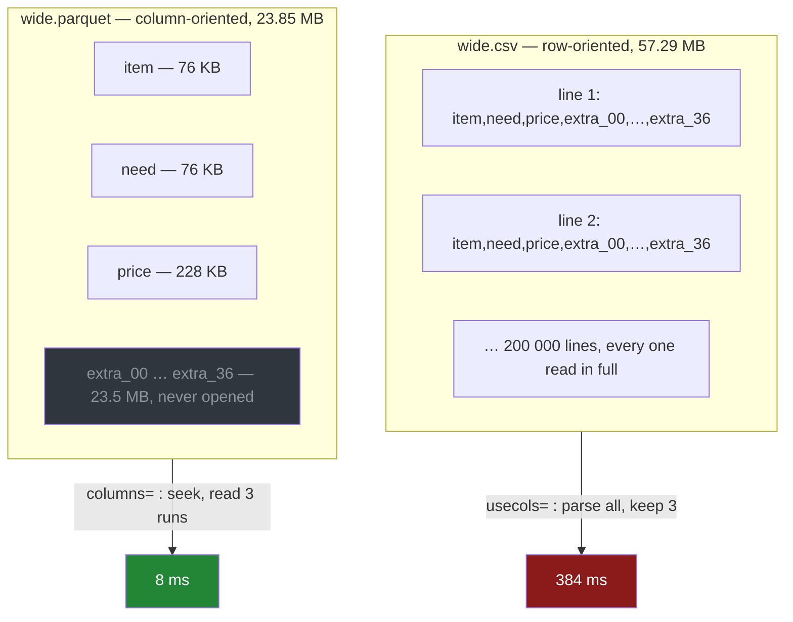

# 3.4 — Column pruning: reading three columns out of forty

## One-line answer

Because Parquet stores each column in its own run of bytes, asking for three columns out of forty
reads only those three runs off the disk — where a CSV has to be read and parsed in full, however
few columns you actually wanted.

---

## The story

The shop starts emailing a weekly export of everything it knows about the flat's orders.

The first one arrives and it is enormous. Opening it shows the five columns anybody in the flat cares
about — the item, how many, the price, the aisle, the day it was bought — and then thirty-five more
that belong to the shop rather than to the flat. The delivery van's number. The till it went through.
Whether the loyalty card was scanned. A discount code that is empty on every row. An internal
reference that is a different long number on every line.

Nobody in the flat wants any of that. The whole reason the export gets opened is to add up what the
week cost, and that needs three of the forty columns.

So somebody writes the obvious thing: open the file, then throw away the columns nobody wants. It
works. It is also slow enough to notice. You press enter, and then you wait, and then the answer
appears.

The thing worth noticing is *why* you waited. Not because adding up three columns is hard. Because
before anything could be added up, every one of those thirty-five unwanted columns was read off the
disk and turned into numbers, and then dropped.

---

## The idea in plain language

**Column pruning** is reading only the columns you asked for, and never touching the bytes of the
ones you did not.

Whether it is possible at all is decided by the file's **layout** — the order the values are written
down in. [3.1](3.1-columns-on-disk-with-types.md) introduced the two layouts, and this part is the
consequence of the difference between them.

A CSV is **row-oriented**. Every line of the file holds one row, so the values of a single column are
scattered down the file, one per line, with thirty-nine other values between each pair of them. There
is no way to collect one column without walking the whole file. Worse, you cannot find where a value
starts without counting commas from the beginning of its line, so even "skip that field" costs the
work of reading it.

Parquet is **column-oriented**. All two hundred thousand values of `price` are written down together,
in one continuous run of bytes, and then all two hundred thousand values of the next column. The file
ends with a **footer** — a small index recording, for every column, the exact byte position where its
run starts and how long that run is.

That footer is what makes pruning possible. A reader that wants three columns opens the file, reads
the footer, looks up three byte positions, and reads three stretches of the file. The other
thirty-seven stretches are never read, never decompressed and never turned into numbers. They may as
well not be in the file.

Two words for the same idea, because you will meet both. **Pruning** is dropping the columns. Some
tools call it **projection pushdown**, because the projection — the choice of which columns to keep —
is *pushed down* from your code into the reader, which then never produces the rest. The matching
trick for rows is **predicate pushdown**, where a filter is handed to the reader so whole blocks of
rows can be skipped too. This part is only about columns.

The argument for stating the columns is exactly the argument
[1.4](../01-the-csv/1.4-dtype-at-read-time.md) made for stating the dtypes. Both turn an **open**
read — give me whatever is in there — into a **closed** one, where you have written down what you
expect and the reader is bound by it.

---

## Why Setu needs it

- **[5.1](../05-the-module/5.1-the-loaders-module.md)** builds one loader whose signature names the
  columns it wants, so the CSV path and the Parquet path are both closed reads.
- **[5.2](../05-the-module/5.2-the-file-that-does-not-fit.md)** is the other half of the same
  problem. Pruning cuts the columns, chunking cuts the rows, and together they are how a file bigger
  than memory gets read at all.
- **[1.1](../01-the-csv/1.1-a-csv-has-no-types-in-it.md)** claimed you cannot read part of a CSV.
  This part is the measurement behind that claim.
- **Day 35** compares pandas against Polars and DuckDB, and pruning is most of why a query engine
  beats a frame library on a wide file. The engine reads three columns; the frame library was asked
  for the whole table.
- **Day 226** designs the project's data layer. A table written once and read many times, by jobs
  that each want a handful of its columns, is the exact case this argument decides.

---

## The mechanism

The same forty-column export, written both ways:

```python
import os

import numpy as np
import pandas as pd

rng = np.random.default_rng(27)
n = 200_000
items = np.array(["milk", "bread", "eggs", "rice", "tea", "beans"])
columns = {
    "item": pd.Series(items[rng.integers(0, 6, n)], dtype="str"),
    "need": rng.integers(1, 9, n).astype("int64"),
    "price": np.round(rng.uniform(0.2, 4.0, n), 2),
}
for i in range(37):
    columns[f"extra_{i:02d}"] = np.round(rng.normal(size=n), 4)
wide = pd.DataFrame(columns)
wide.to_csv("data/wide.csv", index=False)
wide.to_parquet("data/wide.parquet", index=False)
print("shape  :", wide.shape)
print("csv    :", f"{os.path.getsize('data/wide.csv') / 1e6:.2f} MB")
print("parquet:", f"{os.path.getsize('data/wide.parquet') / 1e6:.2f} MB")
```

**Line by line:**

- `default_rng(27)` — the same seed used everywhere on this day, so this file is reproducible and
  comparable with [3.3](3.3-the-size-and-the-speed-measured.md)'s
  ([Day 20, 4.2](../../../day-20-arrays-and-dtypes/parts/04-random/4.2-the-seed-is-part-of-the-result.md)).
- The first three entries are the columns the flat wants, and they are deliberately the ones section
  1 has been using all day, so the story and the benchmark share one shopping list.
- `for i in range(37)` — thirty-seven columns of `rng.normal`, the shop's business rather than the
  flat's. **Random floats on purpose**: they are the least compressible thing there is
  ([3.3](3.3-the-size-and-the-speed-measured.md)), so the unwanted columns are genuinely expensive
  instead of being squashed to nothing by the encoder. A benchmark whose junk columns cost nothing
  would prove nothing.
- `f"extra_{i:02d}"` — zero-padded names, so the columns sort in the order they were made.
- Both files are written from **one frame**, in one process, so they hold identical values and the
  only difference being measured is the layout.

```text
shape  : (200000, 40)
csv    : 57.29 MB
parquet: 23.85 MB
```

Now read three of the forty, both ways:

```python
import time
from collections.abc import Callable

import pandas as pd

WANTED = ["item", "need", "price"]


def best_of(read: Callable[[], pd.DataFrame], reps: int = 5) -> float:
    """Milliseconds for the fastest of `reps` runs."""
    times = []
    for _ in range(reps):
        start = time.perf_counter()
        read()
        times.append(time.perf_counter() - start)
    return min(times) * 1000


print(f"csv     all 40  {best_of(lambda: pd.read_csv('data/wide.csv')):7.0f} ms")
print(f"csv     3 of 40 {best_of(lambda: pd.read_csv('data/wide.csv', usecols=WANTED)):7.0f} ms")
print(f"parquet all 40  {best_of(lambda: pd.read_parquet('data/wide.parquet')):7.0f} ms")
print(
    f"parquet 3 of 40 "
    f"{best_of(lambda: pd.read_parquet('data/wide.parquet', columns=WANTED)):7.0f} ms"
)
```

**Line by line:**

- `WANTED` is a module-level constant rather than a literal repeated four times, because the whole
  argument depends on the four reads asking for exactly the same thing.
- `Callable[[], pd.DataFrame]` — the parameter is a **function that takes nothing and returns a
  frame**, not a frame. Passing `pd.read_csv('data/wide.csv')` would call it once, outside the timer,
  and time nothing at all
  ([Day 14, 1.1](../../../day-14-decorators/parts/01-functions-as-values/1.1-a-function-is-a-value.md)).
- `min(times)`, never the mean — the fastest run is the one with the least interference from
  everything else on the machine, which is the rule
  [Day 25, 4.2](../../../day-25-copy-view-and-the-gate/parts/04-the-benchmark/4.2-timeit-honestly.md)
  argued for. A mean measures your operating system as much as your code.
- The timer wraps **only** `read()`. Building the frame, opening the file and formatting the output
  all sit outside the timed region.
- `usecols=WANTED` is the CSV's version of the request and `columns=WANTED` is Parquet's. **The two
  arguments have different names and different powers**, and the numbers below are that difference.

```text
csv     all 40      757 ms
csv     3 of 40     384 ms
parquet all 40       48 ms
parquet 3 of 40       8 ms
```

**Read the two middle rows against each other, because that is the finding.**

`usecols=` did help the CSV: 757 down to 384, a little under half. That saving is real and worth
having. pandas skips *converting* the unwanted fields into Python objects, and skips allocating
thirty-seven columns of frame. What it cannot skip is reading 57.29 MB off the disk and finding the
commas in it, because the fields it wants are scattered along every line, behind the ones it does
not. **Asking a CSV for 7% of its columns costs you half the work, not 7% of it.**

Parquet went from 48 to 8. Asking for 7% of the columns cost about 17% of the work.

The totals are the number that matters to a job that runs every week: 384 against 8, which is
**forty-eight times.** Nothing in that ratio came from pandas being clever. It came from where the
bytes are.

Why the two layouts answer the same request so differently:



The footer is not a metaphor. You can read it:

```python
import pyarrow.parquet as pq

metadata = pq.ParquetFile("data/wide.parquet").metadata
group = metadata.row_group(0)
total = sum(group.column(i).total_compressed_size for i in range(group.num_columns))
wanted = 0
for i in range(group.num_columns):
    chunk = group.column(i)
    if chunk.path_in_schema in ("item", "need", "price"):
        wanted += chunk.total_compressed_size
        print(f"  {chunk.path_in_schema:6} {chunk.total_compressed_size:>10,} bytes")
print(f"row group total  {total:>10,} bytes")
print(f"the three wanted {wanted:>10,} bytes  ({wanted / total * 100:.1f}%)")
```

**Line by line:**

- `pq.ParquetFile(...)` opens the file and reads **only its footer**. No column data is touched,
  which is why this is instant on a file of any size — and it is the same read the pruning path
  begins with.
- `metadata.row_group(0)` — a **row group** is a horizontal slab of the table, and columns are stored
  separately *within* each slab. This file has one row group holding all two hundred thousand rows.
  Row groups are what make predicate pushdown possible, and they are why a large Parquet file is
  written with several rather than one.
- `group.column(i)` is a **column chunk**: one column's bytes inside one row group. It is the unit
  that gets read or skipped, so it is the unit this whole part is about.
- `total_compressed_size` — the bytes actually occupied on disk, after encoding and compression. The
  uncompressed size is recorded too, but the compressed number is the one that costs disk time.
- `path_in_schema` rather than a plain name, because Parquet columns can be nested and a nested
  field's identity is its path, not its last name. [2.2](../02-json/2.2-json-normalize.md) met the
  same tree from the JSON side.

```text
  item       75,992 bytes
  need       76,269 bytes
  price     227,824 bytes
row group total 23,831,460 bytes
the three wanted    380,085 bytes  (1.6%)
```

**380 KB out of 23.8 MB.** That is the whole explanation of 48 ms becoming 8 ms: the pruning read
touches one and a half per cent of the file. The other 98.4% is the shop's business, and it stays on
the disk.

---

## When it breaks

**Naming a column that is not in the file — the CSV:**

```text
$ uv run python -c "
import pandas as pd
pd.read_csv('data/shopping.csv', usecols=['item', 'need', 'notes'])
" 2>&1 | tail -1
```

```text
ValueError: Usecols do not match columns, columns expected but not found: ['notes']
```

**What it means.** `usecols=` is a demand, not a filter. pandas will not quietly hand back two
columns when you asked for three. **This is the good failure**, and it is the strongest argument for
passing `usecols=` even when you want every column: a column disappearing upstream becomes a loud
error at the read, instead of a `KeyError` four functions later.

**The same mistake against Parquet, which fails very differently:**

```text
$ uv run python -c "
import pandas as pd
pd.read_parquet('data/shopping.parquet', columns=['item', 'notes'])
" 2>&1 | tail -9
```

```text
ArrowInvalid: No match for FieldRef.Name(notes) in item: large_string
need: int64
price: double
aisle: large_string
bought: timestamp[us]
__fragment_index: int32
__batch_index: int32
__last_in_fragment: bool
__filename: string
```

**What it means.** Same mistake, still a correct error, but it arrives from somewhere else.
`ArrowInvalid` comes from Arrow rather than pandas, because pandas passed the column list straight
down to the engine ([3.1](3.1-columns-on-disk-with-types.md)). The message prints the whole schema it
*did* find, which is genuinely useful: the answer to "what should I have typed" is on screen. The
four names beginning with `__` are not in your file. They are the dataset scanner's internal
bookkeeping leaking into the message, and the habit worth building is reading the list above them and
ignoring the rest.

**The one that does not fail — the order you get back:**

```text
$ uv run python -c "
import pandas as pd
print(list(pd.read_csv('data/shopping.csv', usecols=['price', 'item']).columns))
print(list(pd.read_parquet('data/shopping.parquet', columns=['price', 'item']).columns))
"
```

```text
['item', 'price']
['price', 'item']
```

**What it means.** The same request produced two different column orders, with no error anywhere.
`usecols=` is a **set**: it says which columns to keep, and the file's own order decides the rest.
Parquet's `columns=` is a **sequence**: it says which columns, in that order. So code that reads a
file and then relies on position — `frame.iloc[:, 0]`, or a `to_numpy()` handed to a model — gives a
different answer depending on which format it was fed.
[Day 28, 1.3](../../../day-28-selection-and-alignment/parts/01-label-and-position/1.3-iloc-by-position.md)
is where position-based selection gets its own treatment. The defence here is to select by name after
reading, and never to trust the order a reader happened to produce.

---

## In production

**What a professional writes instead of the teaching version.** The column list is not typed at the
call site. It is derived from the schema, so that "what this job reads" is one object:

```python
from pathlib import Path

import pandas as pd

SCHEMA: dict[str, str] = {"item": "str", "need": "int64", "price": "float64", "aisle": "str"}
DATES: tuple[str, ...] = ("bought",)
WANTED: list[str] = [*SCHEMA, *DATES]


def read_export(path: Path) -> pd.DataFrame:
    """Read the shop's export, whatever format it arrived in, closed to five columns."""
    if path.suffix == ".parquet":
        return pd.read_parquet(path, columns=WANTED)
    return pd.read_csv(path, usecols=WANTED, dtype=SCHEMA, parse_dates=list(DATES))
```

**Line by line:**

- `WANTED = [*SCHEMA, *DATES]` — unpacking a dict gives its keys
  ([Day 8, 1.4](../../../day-08-containers/parts/01-sequences/1.4-unpacking-and-star-rest.md)), so
  the column list is **derived** from the schema rather than kept beside it. Two lists that must
  agree will eventually disagree; one list that generates the other cannot.
- `path.suffix == ".parquet"` — the format is decided by the file, and both branches return the same
  five columns under the same names. A caller never has to know which arrived.
- The Parquet branch needs no `dtype=` and no `parse_dates=`, because the file carries its own types
  ([3.2](3.2-the-round-trip-that-keeps-dtypes.md)). That asymmetry is the day's whole argument, in
  two lines of code.
- **Both branches are closed reads.** A thirty-first column appearing in next week's export changes
  nothing about what this function returns, in either format.

**What changes at scale.** Three things.

The saving grows with the *width* of the table, not its length, and real analytical tables are wide.
A hundred and fifty columns is ordinary for an events table, and a job wanting six of them is the
normal case rather than a contrived one. Second, **row groups start to matter**: this file has one,
so a pruning read still seeks around a single slab, but a multi-gigabyte file written with many row
groups lets a reader skip whole slabs on a filter as well as whole columns. Third, and most
important, the file usually is not on a local disk. Over object storage the reader issues **HTTP
range requests** for exactly the byte ranges the footer named, so pruning stops being a saving in
parse time and becomes a saving in *bytes transferred*, which is billed. That is where the 48×
stops being a benchmark curiosity and becomes a line on an invoice.

**The failure that only appears with real data.** A weekly job read a partner's Parquet export with
`columns=` naming eleven fields, and ran for a year. Then the partner renamed one field, and the job
died on the `ArrowInvalid` above. That was the correct outcome, and it still took an afternoon to
trace, because the message named the field but nothing named the partner. The lesson is not to loosen
the column list. It is that a closed read makes an upstream change land on **your** job's traceback
rather than in your numbers, and that such an error deserves the same treatment as any other external
dependency: catch it, and re-raise it saying which file and which source it came from.

**The review comment a senior engineer leaves.** *"This reads the whole export and then does
`frame[['item', 'need', 'price']]`. Move the column list into the read — `usecols=` for CSV,
`columns=` for Parquet. As written we pay to build thirty-seven columns and drop them, and we would
not notice if the file grew to four hundred."*

**The interview question.** *"Why is Parquet faster than CSV?"* A weak answer says "it is compressed
and binary". Compression is the least of it — [3.3](3.3-the-size-and-the-speed-measured.md) measured
a case where turning compression off entirely cost one per cent. The answer that shows you have used
it: the layout is **columnar**, so a query touching three of forty columns reads three of forty
columns and the footer says exactly where they are; the types are **in the file**, so no parsing and
no inference happens; and the encoding is per column, so a column of six repeated names is stored as
a dictionary plus a run of small integers rather than as text. The follow-up is usually "when would
you not use it", and the honest answer is: when a human needs to open it, when the consumer cannot
read it, or when the access pattern is *whole rows, one at a time* — which is what a transactional
database is for, and what section 4 is about.

---

## Check yourself

```bash
uv run python -c "
import time
import pandas as pd
w = ['item', 'need', 'price']
for label, read in [
    ('csv  all', lambda: pd.read_csv('data/wide.csv')),
    ('csv    3', lambda: pd.read_csv('data/wide.csv', usecols=w)),
    ('pq   all', lambda: pd.read_parquet('data/wide.parquet')),
    ('pq     3', lambda: pd.read_parquet('data/wide.parquet', columns=w)),
]:
    s = time.perf_counter()
    read()
    print(label, f'{(time.perf_counter() - s) * 1000:6.0f} ms')
"
```

Your numbers will differ from the ones above; the **ratios** are what should survive. Check that
`usecols=` roughly halves the CSV while `columns=` cuts Parquet by much more than half, and say why
those two savings are not the same kind of saving.

**Answer out loud, without scrolling up:**

> A CSV and a Parquet file hold the same forty columns. You ask each for three. Say what each reader
> physically reads off the disk, and name the part of the Parquet file that lets it skip the rest.
> Then say which of `usecols=` and `columns=` decides the order of the columns you get back.

---

**Next:** [4.1 — A table that knows its own types](../04-sql/4.1-a-table-that-knows-its-types.md).
